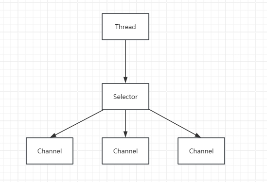
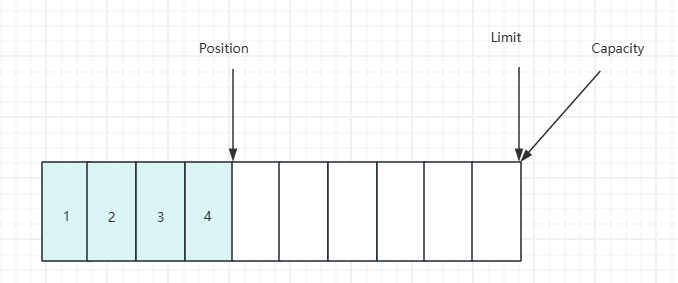
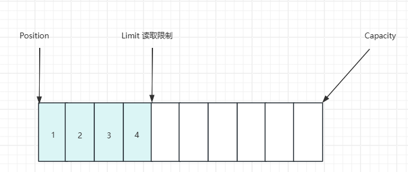
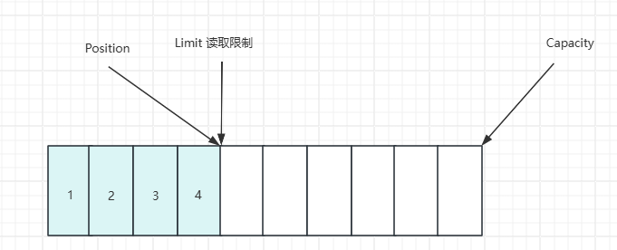
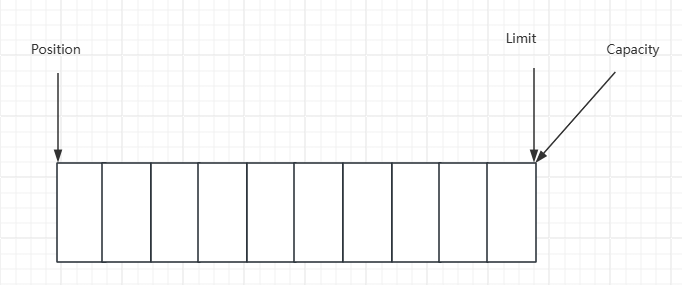
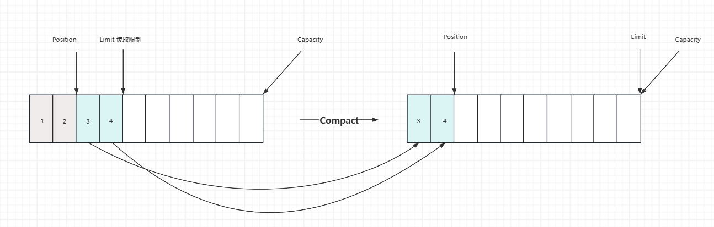

## Netty

*参考 B站 it黑马 Netty 课程*

### 一、NIO 基础

#### 1. 三大组件

##### 1.1 Channel、Buffer

Channel 是**读写数据的双向通道**，可以从 channel 将数据读入 buffer，也可以从 buffer 将数据写入 channel，常见的 Channel 有：

- FileChannel
- DatagramChannel
- SocketChannel
- ServerSocketChannel


Buffer 用于**缓冲读写数据**，常见的 Buffer 有：

- ByteBuffer

  - MappedByteBuffer

  - DirectByteBuffer

  - HeapByteBuffer
- ShortBuffer
- IntBuffer
- LongBuffer
- FloatBuffer
- DoubleBuffer
- CharBuffer


##### 1.2 Selector



Selector 的作用是配合一个线程来管理多个 Channel，获取不同 Channel 上发生的事件，这些 Channel 工作在非阻塞模式下，不会让线程一直工作在一个 Channel 上，适合连接数多，但数据量不大的场景


#### 2. ByteBuffer

##### 2.1 基本使用

```java
package com.sw.netty._01;

import lombok.extern.slf4j.Slf4j;

import java.io.IOException;
import java.io.InputStream;
import java.nio.ByteBuffer;
import java.nio.channels.Channels;
import java.nio.channels.ReadableByteChannel;

@Slf4j
public class ByteBufferTest {
    public static void main(String[] args) {
        try (InputStream is = ByteBufferTest.class.getClassLoader().getResourceAsStream("ByteBufferTest.txt")) {
            if (is == null) {
                throw new IllegalArgumentException("resource not found: ByteBufferTest.txt");
            }

            try (ReadableByteChannel channel = Channels.newChannel(is)) {
                // 准备缓冲区
                ByteBuffer bf = ByteBuffer.allocate(10);
                // 从 channel 读数据，写入 buffer
                int len = channel.read(bf);
                log.info("读取到的字节数：{}", len);

                // 切换为读模式
                bf.flip();
                while (bf.hasRemaining()) {
                    byte b = bf.get();
                    log.info("读取到的字节：{}", (char) b);
                }

                // 切换为写模式
                bf.clear();
            }
        } catch (IOException e) {
            e.printStackTrace();
        }
    }
}

```

执行流程：

1. 向 buffer 写入数据, channel.read(buffer)
2. 调用 flip() 切换至读模式
3. 从 buffer 读数据，buffer.get()
4. 调用 clear() 或 compact() 切换至写模式
5. 重复步骤 1 - 4


##### 2.2 结构

buffer 包含的属性有：capacity、position、limit

开始：


写模式下，position 表示写入位置，limit 表示容量，写入4个字节



调用 flip 后，position 切换为读取位置， limit切换为读取限制



读取4个字节后的状态



调用 clear 后



调用 compact 方法，它的作用是把未读完的部分向前压缩，然后切换至写模式



ByteBufferReadWriteTest

```java
public class ByteBufferReadWriteTest {
    public static void main(String[] args) {
        ByteBuffer bf = ByteBuffer.allocate(10);
        bf.put((byte) 0x16);
        debugAll(bf);
        bf.put(new byte[]{0x17, 0x18, 0x19});
        debugAll(bf);
        bf.flip();
        System.out.println(bf.get());
        debugAll(bf);
        bf.compact();
        debugAll(bf);
        bf.put(new byte[]{0x20, 0x21, 0x22});
        debugAll(bf);

        // +--------+-------------------- all ------------------------+----------------+
        //         position: [1], limit: [10]
        // +-------------------------------------------------+
        //         |  0  1  2  3  4  5  6  7  8  9  a  b  c  d  e  f |
        // +--------+-------------------------------------------------+----------------+
        //         |00000000| 16 00 00 00 00 00 00 00 00 00                   |..........      |
        // +--------+-------------------------------------------------+----------------+
        //         +--------+-------------------- all ------------------------+----------------+
        //         position: [4], limit: [10]
        // +-------------------------------------------------+
        //         |  0  1  2  3  4  5  6  7  8  9  a  b  c  d  e  f |
        // +--------+-------------------------------------------------+----------------+
        //         |00000000| 16 17 18 19 00 00 00 00 00 00                   |..........      |
        // +--------+-------------------------------------------------+----------------+
        //         22
        //         +--------+-------------------- all ------------------------+----------------+
        //         position: [1], limit: [4]
        // +-------------------------------------------------+
        //         |  0  1  2  3  4  5  6  7  8  9  a  b  c  d  e  f |
        // +--------+-------------------------------------------------+----------------+
        //         |00000000| 16 17 18 19 00 00 00 00 00 00                   |..........      |
        // +--------+-------------------------------------------------+----------------+
        //         +--------+-------------------- all ------------------------+----------------+
        //         position: [3], limit: [10]
        // +-------------------------------------------------+
        //         |  0  1  2  3  4  5  6  7  8  9  a  b  c  d  e  f |
        // +--------+-------------------------------------------------+----------------+
        //         |00000000| 17 18 19 19 00 00 00 00 00 00                   |..........      |
        // +--------+-------------------------------------------------+----------------+
        //         +--------+-------------------- all ------------------------+----------------+
        //         position: [6], limit: [10]
        // +-------------------------------------------------+
        //         |  0  1  2  3  4  5  6  7  8  9  a  b  c  d  e  f |
        // +--------+-------------------------------------------------+----------------+
        //         |00000000| 17 18 19 20 21 22 00 00 00 00                   |... !"....      |
        //         +--------+-------------------------------------------------+----------------+
    }
}

```


##### 2.3 常见方法

（1）分配空间

```java
// 使用堆内存，会受 gc 的影响
ByteBuffer.allocate(10);

// 使用直接（物理）内存，读写效率高，但分配效率低
ByteBuffer.allocateDirect(10);
```


（2）向 buffer 写入数据

调用 channel 的 read 方法

```java
int len = channel.read(bf);
```


调用 buffer 的 put 方法

```java
bf.put((byte) 0x16)
```


（3）从 buffer 读取数据

调用 channel 的 write 方法

```java
int len = channel.write(bf);
```


调用 buffer 的 get 方法

```java
// get 方法会让 position 读指针向后走
// rewind 方法可以将 position 重新置为 0
// get(index) 方法获取指定索引下标的内容时，不会移动读指针
byte b = bf.get();
```


ByteBufferReadTest

```java
package com.sw.netty._01;

import java.nio.ByteBuffer;

import static utils.ByteBufferUtil.debugAll;

public class ByteBufferReadTest {
    public static void main(String[] args) {
        ByteBuffer bf = ByteBuffer.allocate(10);
        bf.put(new byte[]{'a', 'b', 'c', 'd'});
        bf.flip();

        // 读全部
        bf.get(new byte[4]);
        debugAll(bf);

        // 从头重新开始读取一个字节
        bf.rewind();
        System.out.println((char) bf.get());

        // +--------+-------------------- all ------------------------+----------------+
        //         position: [4], limit: [4]
        // +-------------------------------------------------+
        //         |  0  1  2  3  4  5  6  7  8  9  a  b  c  d  e  f |
        // +--------+-------------------------------------------------+----------------+
        //         |00000000| 61 62 63 64 00 00 00 00 00 00                   |abcd......      |
        // +--------+-------------------------------------------------+----------------+
        // a

        // mark 标记 position 位置，reset 将 position 位置重置到 mark 标记的位置
        System.out.println((char) bf.get()); // b
        bf.mark();
        System.out.println((char) bf.get()); // c
        System.out.println((char) bf.get()); // d
        bf.reset();
        System.out.println((char) bf.get()); // c

        // get(index) 不会改变读索引的位置
        System.out.println((char) bf.get(3));
        debugAll(bf);

        // d
        // +--------+-------------------- all ------------------------+----------------+
        //         position: [1], limit: [4]
        // +-------------------------------------------------+
        //         |  0  1  2  3  4  5  6  7  8  9  a  b  c  d  e  f |
        // +--------+-------------------------------------------------+----------------+
        //         |00000000| 61 62 63 64 00 00 00 00 00 00                   |abcd......      |
        // +--------+-------------------------------------------------+----------------+
    }
}

```


（4）字符串与 ByteBuffer 互转

```java
package com.sw.netty._01;

import java.nio.ByteBuffer;
import java.nio.charset.StandardCharsets;

import static utils.ByteBufferUtil.debugAll;

public class ByteBuffer2StringTest {
    public static void main(String[] args) {
        ByteBuffer bf = ByteBuffer.allocate(10);

        // 字符串转 ByteBuffer
        // 1. 字符串 getBytes()
        bf.put("sxc".getBytes());
        debugAll(bf);

        // +--------+-------------------- all ------------------------+----------------+
        //         position: [3], limit: [16]
        // +-------------------------------------------------+
        //         |  0  1  2  3  4  5  6  7  8  9  a  b  c  d  e  f |
        // +--------+-------------------------------------------------+----------------+
        //         |00000000| 73 78 63 00 00 00 00 00 00 00 00 00 00 00 00 00 |sxc.............|
        // +--------+-------------------------------------------------+----------------+

        // 2. Charset encode之后自动切换为读模式
        ByteBuffer bf1 = StandardCharsets.UTF_8.encode("sxc");
        debugAll(bf1);

        // +--------+-------------------- all ------------------------+----------------+
        //         position: [0], limit: [3]
        // +-------------------------------------------------+
        //         |  0  1  2  3  4  5  6  7  8  9  a  b  c  d  e  f |
        // +--------+-------------------------------------------------+----------------+
        //         |00000000| 73 78 63                                        |sxc             |
        // +--------+-------------------------------------------------+----------------+

        // 3. wrap 同理方法2，自动切换为读模式
        ByteBuffer bf2 = ByteBuffer.wrap("sxc".getBytes());
        debugAll(bf2);

        // +--------+-------------------- all ------------------------+----------------+
        //         position: [0], limit: [3]
        // +-------------------------------------------------+
        //         |  0  1  2  3  4  5  6  7  8  9  a  b  c  d  e  f |
        // +--------+-------------------------------------------------+----------------+
        //         |00000000| 73 78 63                                        |sxc             |
        // +--------+-------------------------------------------------+----------------+

        // ByteBuffer 转字符串
        bf.flip();
        System.out.println(StandardCharsets.UTF_8.decode(bf)); //sxc

        // Charset、wrap 方法生成的 ByteBuffer 对象不需要再手动显示切换为读模式
        System.out.println(StandardCharsets.UTF_8.decode(bf1)); //sxc
        System.out.println(StandardCharsets.UTF_8.decode(bf2)); //sxc
    }
}

```


##### 2.4 Scattering Reads 分散读

ScatteringReadsTest

```java
package com.sw.netty._01;

import java.net.URL;
import java.nio.ByteBuffer;
import java.nio.channels.FileChannel;
import java.nio.file.Paths;

import static utils.ByteBufferUtil.debugAll;

public class ScatteringReadsTest {
    public static void main(String[] args) {
        URL resource = ScatteringReadsTest.class.getClassLoader().getResource("ScatteringReadsTest.txt");
        if (resource == null) {
            throw new IllegalArgumentException("resource not found: ScatteringReadsTest.txt");
        }

        try (FileChannel channel = FileChannel.open(Paths.get(resource.toURI()))) {
            ByteBuffer bf1 = ByteBuffer.allocate(3);
            ByteBuffer bf2 = ByteBuffer.allocate(3);
            ByteBuffer bf3 = ByteBuffer.allocate(3);
            channel.read(new ByteBuffer[]{bf1, bf2, bf3});
            bf1.flip();
            bf2.flip();
            bf3.flip();
            debugAll(bf1);
            debugAll(bf2);
            debugAll(bf3);

            // +--------+-------------------- all ------------------------+----------------+
            //         position: [0], limit: [3]
            // +-------------------------------------------------+
            //         |  0  1  2  3  4  5  6  7  8  9  a  b  c  d  e  f |
            // +--------+-------------------------------------------------+----------------+
            // |00000000| 31 32 33                                        |123             |
            // +--------+-------------------------------------------------+----------------+
            // +--------+-------------------- all ------------------------+----------------+
            // position: [0], limit: [3]
            // +-------------------------------------------------+
            //         |  0  1  2  3  4  5  6  7  8  9  a  b  c  d  e  f |
            // +--------+-------------------------------------------------+----------------+
            // |00000000| 34 35 36                                        |456             |
            // +--------+-------------------------------------------------+----------------+
            // +--------+-------------------- all ------------------------+----------------+
            // position: [0], limit: [3]
            // +-------------------------------------------------+
            //         |  0  1  2  3  4  5  6  7  8  9  a  b  c  d  e  f |
            // +--------+-------------------------------------------------+----------------+
            // |00000000| 37 38 39                                        |789             |
            // +--------+-------------------------------------------------+----------------+
        } catch (Exception e) {
            e.printStackTrace();
        }
    }
}

```


##### 2.5 GatheringWrites 集中写

GatheringWritesTest

```java
package com.sw.netty._01;

import java.io.IOException;
import java.io.RandomAccessFile;
import java.nio.ByteBuffer;
import java.nio.channels.FileChannel;
import java.nio.charset.StandardCharsets;

public class GatheringWritesTest {
    public static void main(String[] args) {
        ByteBuffer bf1 = StandardCharsets.UTF_8.encode("sun");
        ByteBuffer bf2 = StandardCharsets.UTF_8.encode("xiao");
        ByteBuffer bf3 = StandardCharsets.UTF_8.encode("chuan");

        try (FileChannel channel = new RandomAccessFile("GatheringWritesTest.txt", "rw").getChannel()) {
            channel.write(new ByteBuffer[]{bf1, bf2, bf3});
        } catch (IOException e) {
            e.printStackTrace();
        }
    }
}

```


##### 2.6 黏包、半包

ByteBufferExamTest

```java
package com.sw.netty._01;

import java.nio.ByteBuffer;

import static utils.ByteBufferUtil.debugAll;

public class ByteBufferExamTest {
    public static void main(String[] args) {
        /**
         * 例：通过网络发送给服务器的多条数据如下：
         * Yao Shui Ge,\n
         * Jin Se Wei Ye Na,\n
         * Zhi Bo Jian.
         * 由于各种原因，变成了如下的形式（黏包、半包）
         * Yao Shui Ge,\nJin S
         * e Wei Ye Na,\nZ
         * hi Bo Jian.
         * 现要求将黏包、半包的数据恢复为正确的按 \n 分隔的数据
         */

        ByteBuffer originBf = ByteBuffer.allocate(45);
        originBf.put("Yao Shui Ge,\nJin S".getBytes());
        split(originBf);
        originBf.put("e Wei Ye Na,\nZ".getBytes());
        split(originBf);
        originBf.put("hi Bo Jian.\n".getBytes());
        split(originBf);
    }

    private static void split(ByteBuffer source) {
        source.flip();
        for (int i = 0; i < source.limit(); i++) {
            if ('\n' == source.get(i)) {
                int length = i + 1 - source.position();
                ByteBuffer target = ByteBuffer.allocate(length);
                // 从 source 读，向 target 写
                for (int j = 0; j < length; j++) {
                    target.put(source.get());
                }
                debugAll(target);
            }
        }

        // 此处不使用 clear，需使用 compact 将剩余未读的部分向前移动
        source.compact();
    }

    // +--------+-------------------- all ------------------------+----------------+
    // position: [13], limit: [13]
    //         +-------------------------------------------------+
    //         |  0  1  2  3  4  5  6  7  8  9  a  b  c  d  e  f |
    // +--------+-------------------------------------------------+----------------+
    // |00000000| 59 61 6f 20 53 68 75 69 20 47 65 2c 0a          |Yao Shui Ge,.   |
    // +--------+-------------------------------------------------+----------------+
    // +--------+-------------------- all ------------------------+----------------+
    // position: [18], limit: [18]
    //         +-------------------------------------------------+
    //         |  0  1  2  3  4  5  6  7  8  9  a  b  c  d  e  f |
    // +--------+-------------------------------------------------+----------------+
    // |00000000| 4a 69 6e 20 53 65 20 57 65 69 20 59 65 20 4e 61 |Jin Se Wei Ye Na|
    // |00000010| 2c 0a                                           |,.              |
    // +--------+-------------------------------------------------+----------------+
    // +--------+-------------------- all ------------------------+----------------+
    // position: [13], limit: [13]
    //         +-------------------------------------------------+
    //         |  0  1  2  3  4  5  6  7  8  9  a  b  c  d  e  f |
    // +--------+-------------------------------------------------+----------------+
    // |00000000| 5a 68 69 20 42 6f 20 4a 69 61 6e 2e 0a          |Zhi Bo Jian..   |
    // +--------+-------------------------------------------------+----------------+
}

```


#### 3. 文件编程

##### 3.1 FileChannel

*FileChannel 只能工作在阻塞模式下*

（1）获取

通过 FileInputStream（读）、FileOutputStream（写）、RandomAccessFile（根据指定的模式决定读或写） 的 getChannel() 方法获取


（2）读取

```java
// 返回值表示读取的字节，-1 表示读取到了文件的末尾
int readBytes = channel.read(bf);
```


（3）写入

```java
ByteBuffer bf = ByteBuffer.allcate(16);
bf.put(...);
bf.flip();

// 后续还有值则继续写入，channel.write() 方法不一定能一次写完全部内容
while (bf.hasRemaining()) {
    channel.write(bf);
}
```


（4）关闭

channel 使用完后必须关闭，可以使用 try-with-resources 语法糖或手动关闭 channel.close()


（5）获取当前位置

```java
// 获取位置
long position = channel.position();

// 设置指定下标索引位置
channel.position(123);
```

如果设置为文件末尾：

- 这时进行读取，返回值为 -1
- 执行写入时，会进行追加，如果 position 超过了文件末尾，新内容和原末尾之间会产生空洞(00)


（6）大小

```java
channel.size();
```


（7）强制写入

写入的数据在操作系统的管理下并不是立刻写入磁盘，而是先到缓存中，可以通过 channel.force(true) 方法将文件内容和元数据进行立即写入


##### 3.2 两个 Channel 传输数据

```java
package com.sw.netty._01;

import java.io.FileOutputStream;
import java.net.URL;
import java.nio.channels.FileChannel;
import java.nio.file.Paths;

public class FileChannelTransferToTest {
    public static void main(String[] args) {
        URL resource = ScatteringReadsTest.class.getClassLoader().getResource("ByteBufferTest.txt");
        if (resource == null) {
            throw new IllegalArgumentException("resource not found: ScatteringReadsTest.txt");
        }

        // try (FileChannel from = FileChannel.open(Paths.get(resource.toURI()));
        //      FileChannel to = new FileOutputStream("FileChannelTransferTo.txt").getChannel()) {
        //     // transferTo 一次最多传输 2G 的数据
        //     from.transferTo(0, from.size(), to);
        // } catch (Exception e) {
        //     e.printStackTrace();
        // }

        try (FileChannel from = FileChannel.open(Paths.get(resource.toURI()));
             FileChannel to = new FileOutputStream("FileChannelTransferTo.txt").getChannel()) {

            // 传输大于 2G 的文件
            long size = from.size();
            for (long left = size; left > 0; ) {
                left -= from.transferTo((size - left), left, to);
            }
        } catch (Exception e) {
            e.printStackTrace();
        }
    }
}

```

