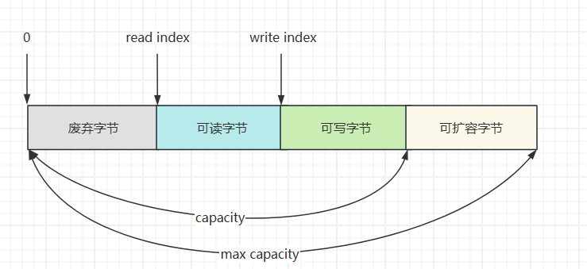
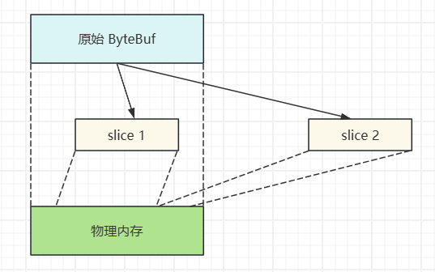
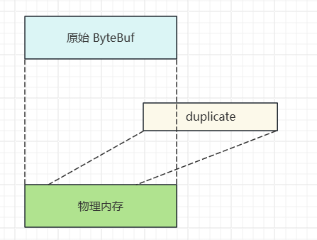
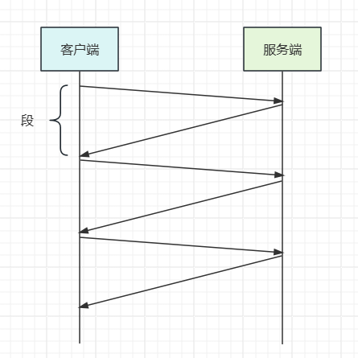
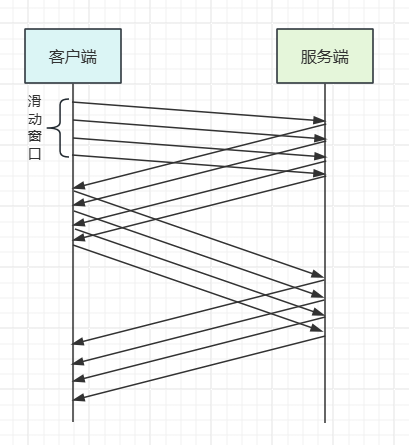

## Netty

*参考 B站 it黑马 Netty 课程*

### 一、NIO 基础

#### 1. 三大组件

##### 1.1 Channel、Buffer

Channel 是**读写数据的双向通道**，可以从 channel 将数据读入 buffer，也可以从 buffer 将数据写入 channel，常见的 Channel 有：

- FileChannel
- DatagramChannel
- SocketChannel
- ServerSocketChannel


Buffer 用于**缓冲读写数据**，常见的 Buffer 有：

- ByteBuffer

  - MappedByteBuffer

  - DirectByteBuffer

  - HeapByteBuffer
- ShortBuffer
- IntBuffer
- LongBuffer
- FloatBuffer
- DoubleBuffer
- CharBuffer


##### 1.2 Selector


Selector 的作用是配合一个线程来管理多个 Channel，获取不同 Channel 上发生的事件，这些 Channel 工作在非阻塞模式下，不会让线程一直工作在一个 Channel 上，适合连接数多，但数据量不大的场景


#### 2. ByteBuffer

##### 2.1 基本使用

```java
package com.sw.netty._01;

import lombok.extern.slf4j.Slf4j;

import java.io.IOException;
import java.io.InputStream;
import java.nio.ByteBuffer;
import java.nio.channels.Channels;
import java.nio.channels.ReadableByteChannel;

@Slf4j
public class ByteBufferTest {
    public static void main(String[] args) {
        try (InputStream is = ByteBufferTest.class.getClassLoader().getResourceAsStream("ByteBufferTest.txt")) {
            if (is == null) {
                throw new IllegalArgumentException("resource not found: ByteBufferTest.txt");
            }

            try (ReadableByteChannel channel = Channels.newChannel(is)) {
                // 准备缓冲区
                ByteBuffer bf = ByteBuffer.allocate(10);
                // 从 channel 读数据，写入 buffer
                int len = channel.read(bf);
                log.info("读取到的字节数：{}", len);

                // 切换为读模式
                bf.flip();
                while (bf.hasRemaining()) {
                    byte b = bf.get();
                    log.info("读取到的字节：{}", (char) b);
                }

                // 切换为写模式
                bf.clear();
            }
        } catch (IOException e) {
            e.printStackTrace();
        }
    }
}

```

执行流程：

1. 向 buffer 写入数据, channel.read(buffer)
2. 调用 flip() 切换至读模式
3. 从 buffer 读数据，buffer.get()
4. 调用 clear() 或 compact() 切换至写模式
5. 重复步骤 1 - 4


##### 2.2 结构

buffer 包含的属性有：capacity、position、limit

开始：


写模式下，position 表示写入位置，limit 表示容量，写入4个字节


调用 flip 后，position 切换为读取位置， limit切换为读取限制


读取4个字节后的状态


调用 clear 后


调用 compact 方法，它的作用是把未读完的部分向前压缩，然后切换至写模式


ByteBufferReadWriteTest

```java
public class ByteBufferReadWriteTest {
    public static void main(String[] args) {
        ByteBuffer bf = ByteBuffer.allocate(10);
        bf.put((byte) 0x16);
        debugAll(bf);
        bf.put(new byte[]{0x17, 0x18, 0x19});
        debugAll(bf);
        bf.flip();
        System.out.println(bf.get());
        debugAll(bf);
        bf.compact();
        debugAll(bf);
        bf.put(new byte[]{0x20, 0x21, 0x22});
        debugAll(bf);

        // +--------+-------------------- all ------------------------+----------------+
        //         position: [1], limit: [10]
        // +-------------------------------------------------+
        //         |  0  1  2  3  4  5  6  7  8  9  a  b  c  d  e  f |
        // +--------+-------------------------------------------------+----------------+
        //         |00000000| 16 00 00 00 00 00 00 00 00 00                   |..........      |
        // +--------+-------------------------------------------------+----------------+
        //         +--------+-------------------- all ------------------------+----------------+
        //         position: [4], limit: [10]
        // +-------------------------------------------------+
        //         |  0  1  2  3  4  5  6  7  8  9  a  b  c  d  e  f |
        // +--------+-------------------------------------------------+----------------+
        //         |00000000| 16 17 18 19 00 00 00 00 00 00                   |..........      |
        // +--------+-------------------------------------------------+----------------+
        //         22
        //         +--------+-------------------- all ------------------------+----------------+
        //         position: [1], limit: [4]
        // +-------------------------------------------------+
        //         |  0  1  2  3  4  5  6  7  8  9  a  b  c  d  e  f |
        // +--------+-------------------------------------------------+----------------+
        //         |00000000| 16 17 18 19 00 00 00 00 00 00                   |..........      |
        // +--------+-------------------------------------------------+----------------+
        //         +--------+-------------------- all ------------------------+----------------+
        //         position: [3], limit: [10]
        // +-------------------------------------------------+
        //         |  0  1  2  3  4  5  6  7  8  9  a  b  c  d  e  f |
        // +--------+-------------------------------------------------+----------------+
        //         |00000000| 17 18 19 19 00 00 00 00 00 00                   |..........      |
        // +--------+-------------------------------------------------+----------------+
        //         +--------+-------------------- all ------------------------+----------------+
        //         position: [6], limit: [10]
        // +-------------------------------------------------+
        //         |  0  1  2  3  4  5  6  7  8  9  a  b  c  d  e  f |
        // +--------+-------------------------------------------------+----------------+
        //         |00000000| 17 18 19 20 21 22 00 00 00 00                   |... !"....      |
        //         +--------+-------------------------------------------------+----------------+
    }
}

```


##### 2.3 常见方法

（1）分配空间

```java
// 使用堆内存，会受 gc 的影响
ByteBuffer.allocate(10);

// 使用直接（物理）内存，读写效率高，但分配效率低
ByteBuffer.allocateDirect(10);
```


（2）向 buffer 写入数据

调用 channel 的 read 方法

```java
int len = channel.read(bf);
```


调用 buffer 的 put 方法

```java
bf.put((byte) 0x16)
```


（3）从 buffer 读取数据

调用 channel 的 write 方法

```java
int len = channel.write(bf);
```


调用 buffer 的 get 方法

```java
// get 方法会让 position 读指针向后走
// rewind 方法可以将 position 重新置为 0
// get(index) 方法获取指定索引下标的内容时，不会移动读指针
byte b = bf.get();
```


ByteBufferReadTest

```java
package com.sw.netty._01;

import java.nio.ByteBuffer;

import static utils.ByteBufferUtil.debugAll;

public class ByteBufferReadTest {
    public static void main(String[] args) {
        ByteBuffer bf = ByteBuffer.allocate(10);
        bf.put(new byte[]{'a', 'b', 'c', 'd'});
        bf.flip();

        // 读全部
        bf.get(new byte[4]);
        debugAll(bf);

        // 从头重新开始读取一个字节
        bf.rewind();
        System.out.println((char) bf.get());

        // +--------+-------------------- all ------------------------+----------------+
        //         position: [4], limit: [4]
        // +-------------------------------------------------+
        //         |  0  1  2  3  4  5  6  7  8  9  a  b  c  d  e  f |
        // +--------+-------------------------------------------------+----------------+
        //         |00000000| 61 62 63 64 00 00 00 00 00 00                   |abcd......      |
        // +--------+-------------------------------------------------+----------------+
        // a

        // mark 标记 position 位置，reset 将 position 位置重置到 mark 标记的位置
        System.out.println((char) bf.get()); // b
        bf.mark();
        System.out.println((char) bf.get()); // c
        System.out.println((char) bf.get()); // d
        bf.reset();
        System.out.println((char) bf.get()); // c

        // get(index) 不会改变读索引的位置
        System.out.println((char) bf.get(3));
        debugAll(bf);

        // d
        // +--------+-------------------- all ------------------------+----------------+
        //         position: [1], limit: [4]
        // +-------------------------------------------------+
        //         |  0  1  2  3  4  5  6  7  8  9  a  b  c  d  e  f |
        // +--------+-------------------------------------------------+----------------+
        //         |00000000| 61 62 63 64 00 00 00 00 00 00                   |abcd......      |
        // +--------+-------------------------------------------------+----------------+
    }
}

```


（4）字符串与 ByteBuffer 互转

```java
package com.sw.netty._01;

import java.nio.ByteBuffer;
import java.nio.charset.StandardCharsets;

import static utils.ByteBufferUtil.debugAll;

public class ByteBuffer2StringTest {
    public static void main(String[] args) {
        ByteBuffer bf = ByteBuffer.allocate(10);

        // 字符串转 ByteBuffer
        // 1. 字符串 getBytes()
        bf.put("sxc".getBytes());
        debugAll(bf);

        // +--------+-------------------- all ------------------------+----------------+
        //         position: [3], limit: [16]
        // +-------------------------------------------------+
        //         |  0  1  2  3  4  5  6  7  8  9  a  b  c  d  e  f |
        // +--------+-------------------------------------------------+----------------+
        //         |00000000| 73 78 63 00 00 00 00 00 00 00 00 00 00 00 00 00 |sxc.............|
        // +--------+-------------------------------------------------+----------------+

        // 2. Charset encode之后自动切换为读模式
        ByteBuffer bf1 = StandardCharsets.UTF_8.encode("sxc");
        debugAll(bf1);

        // +--------+-------------------- all ------------------------+----------------+
        //         position: [0], limit: [3]
        // +-------------------------------------------------+
        //         |  0  1  2  3  4  5  6  7  8  9  a  b  c  d  e  f |
        // +--------+-------------------------------------------------+----------------+
        //         |00000000| 73 78 63                                        |sxc             |
        // +--------+-------------------------------------------------+----------------+

        // 3. wrap 同理方法2，自动切换为读模式
        ByteBuffer bf2 = ByteBuffer.wrap("sxc".getBytes());
        debugAll(bf2);

        // +--------+-------------------- all ------------------------+----------------+
        //         position: [0], limit: [3]
        // +-------------------------------------------------+
        //         |  0  1  2  3  4  5  6  7  8  9  a  b  c  d  e  f |
        // +--------+-------------------------------------------------+----------------+
        //         |00000000| 73 78 63                                        |sxc             |
        // +--------+-------------------------------------------------+----------------+

        // ByteBuffer 转字符串
        bf.flip();
        System.out.println(StandardCharsets.UTF_8.decode(bf)); //sxc

        // Charset、wrap 方法生成的 ByteBuffer 对象不需要再手动显示切换为读模式
        System.out.println(StandardCharsets.UTF_8.decode(bf1)); //sxc
        System.out.println(StandardCharsets.UTF_8.decode(bf2)); //sxc
    }
}

```


##### 2.4 Scattering Reads 分散读

ScatteringReadsTest

```java
package com.sw.netty._01;

import java.net.URL;
import java.nio.ByteBuffer;
import java.nio.channels.FileChannel;
import java.nio.file.Paths;

import static utils.ByteBufferUtil.debugAll;

public class ScatteringReadsTest {
    public static void main(String[] args) {
        URL resource = ScatteringReadsTest.class.getClassLoader().getResource("ScatteringReadsTest.txt");
        if (resource == null) {
            throw new IllegalArgumentException("resource not found: ScatteringReadsTest.txt");
        }

        try (FileChannel channel = FileChannel.open(Paths.get(resource.toURI()))) {
            ByteBuffer bf1 = ByteBuffer.allocate(3);
            ByteBuffer bf2 = ByteBuffer.allocate(3);
            ByteBuffer bf3 = ByteBuffer.allocate(3);
            channel.read(new ByteBuffer[]{bf1, bf2, bf3});
            bf1.flip();
            bf2.flip();
            bf3.flip();
            debugAll(bf1);
            debugAll(bf2);
            debugAll(bf3);

            // +--------+-------------------- all ------------------------+----------------+
            //         position: [0], limit: [3]
            // +-------------------------------------------------+
            //         |  0  1  2  3  4  5  6  7  8  9  a  b  c  d  e  f |
            // +--------+-------------------------------------------------+----------------+
            // |00000000| 31 32 33                                        |123             |
            // +--------+-------------------------------------------------+----------------+
            // +--------+-------------------- all ------------------------+----------------+
            // position: [0], limit: [3]
            // +-------------------------------------------------+
            //         |  0  1  2  3  4  5  6  7  8  9  a  b  c  d  e  f |
            // +--------+-------------------------------------------------+----------------+
            // |00000000| 34 35 36                                        |456             |
            // +--------+-------------------------------------------------+----------------+
            // +--------+-------------------- all ------------------------+----------------+
            // position: [0], limit: [3]
            // +-------------------------------------------------+
            //         |  0  1  2  3  4  5  6  7  8  9  a  b  c  d  e  f |
            // +--------+-------------------------------------------------+----------------+
            // |00000000| 37 38 39                                        |789             |
            // +--------+-------------------------------------------------+----------------+
        } catch (Exception e) {
            e.printStackTrace();
        }
    }
}

```


##### 2.5 GatheringWrites 集中写

GatheringWritesTest

```java
package com.sw.netty._01;

import java.io.IOException;
import java.io.RandomAccessFile;
import java.nio.ByteBuffer;
import java.nio.channels.FileChannel;
import java.nio.charset.StandardCharsets;

public class GatheringWritesTest {
    public static void main(String[] args) {
        ByteBuffer bf1 = StandardCharsets.UTF_8.encode("sun");
        ByteBuffer bf2 = StandardCharsets.UTF_8.encode("xiao");
        ByteBuffer bf3 = StandardCharsets.UTF_8.encode("chuan");

        try (FileChannel channel = new RandomAccessFile("GatheringWritesTest.txt", "rw").getChannel()) {
            channel.write(new ByteBuffer[]{bf1, bf2, bf3});
        } catch (IOException e) {
            e.printStackTrace();
        }
    }
}

```


##### 2.6 黏包、半包

ByteBufferExamTest

```java
package com.sw.netty._01;

import java.nio.ByteBuffer;

import static utils.ByteBufferUtil.debugAll;

public class ByteBufferExamTest {
    public static void main(String[] args) {
        /**
         * 例：通过网络发送给服务器的多条数据如下：
         * Yao Shui Ge,\n
         * Jin Se Wei Ye Na,\n
         * Zhi Bo Jian.
         * 由于各种原因，变成了如下的形式（黏包、半包）
         * Yao Shui Ge,\nJin S
         * e Wei Ye Na,\nZ
         * hi Bo Jian.
         * 现要求将黏包、半包的数据恢复为正确的按 \n 分隔的数据
         */

        ByteBuffer originBf = ByteBuffer.allocate(45);
        originBf.put("Yao Shui Ge,\nJin S".getBytes());
        split(originBf);
        originBf.put("e Wei Ye Na,\nZ".getBytes());
        split(originBf);
        originBf.put("hi Bo Jian.\n".getBytes());
        split(originBf);
    }

    private static void split(ByteBuffer source) {
        source.flip();
        for (int i = 0; i < source.limit(); i++) {
            if ('\n' == source.get(i)) {
                int length = i + 1 - source.position();
                ByteBuffer target = ByteBuffer.allocate(length);
                // 从 source 读，向 target 写
                for (int j = 0; j < length; j++) {
                    target.put(source.get());
                }
                debugAll(target);
            }
        }

        // 此处不使用 clear，需使用 compact 将剩余未读的部分向前移动
        source.compact();
    }

    // +--------+-------------------- all ------------------------+----------------+
    // position: [13], limit: [13]
    //         +-------------------------------------------------+
    //         |  0  1  2  3  4  5  6  7  8  9  a  b  c  d  e  f |
    // +--------+-------------------------------------------------+----------------+
    // |00000000| 59 61 6f 20 53 68 75 69 20 47 65 2c 0a          |Yao Shui Ge,.   |
    // +--------+-------------------------------------------------+----------------+
    // +--------+-------------------- all ------------------------+----------------+
    // position: [18], limit: [18]
    //         +-------------------------------------------------+
    //         |  0  1  2  3  4  5  6  7  8  9  a  b  c  d  e  f |
    // +--------+-------------------------------------------------+----------------+
    // |00000000| 4a 69 6e 20 53 65 20 57 65 69 20 59 65 20 4e 61 |Jin Se Wei Ye Na|
    // |00000010| 2c 0a                                           |,.              |
    // +--------+-------------------------------------------------+----------------+
    // +--------+-------------------- all ------------------------+----------------+
    // position: [13], limit: [13]
    //         +-------------------------------------------------+
    //         |  0  1  2  3  4  5  6  7  8  9  a  b  c  d  e  f |
    // +--------+-------------------------------------------------+----------------+
    // |00000000| 5a 68 69 20 42 6f 20 4a 69 61 6e 2e 0a          |Zhi Bo Jian..   |
    // +--------+-------------------------------------------------+----------------+
}

```


#### 3. 文件编程

##### 3.1 FileChannel

*FileChannel 只能工作在阻塞模式下*

（1）获取

通过 FileInputStream（读）、FileOutputStream（写）、RandomAccessFile（根据指定的模式决定读或写） 的 getChannel() 方法获取


（2）读取

```java
// 返回值表示读取的字节，-1 表示读取到了文件的末尾
int readBytes = channel.read(bf);
```


（3）写入

```java
ByteBuffer bf = ByteBuffer.allcate(16);
bf.put(...);
bf.flip();

// 后续还有值则继续写入，channel.write() 方法不一定能一次写完全部内容
while (bf.hasRemaining()) {
    channel.write(bf);
}
```


（4）关闭

channel 使用完后必须关闭，可以使用 try-with-resources 语法糖或手动关闭 channel.close()


（5）获取当前位置

```java
// 获取位置
long position = channel.position();

// 设置指定下标索引位置
channel.position(123);
```

如果设置为文件末尾：

- 这时进行读取，返回值为 -1
- 执行写入时，会进行追加，如果 position 超过了文件末尾，新内容和原末尾之间会产生空洞(00)


（6）大小

```java
channel.size();
```


（7）强制写入

写入的数据在操作系统的管理下并不是立刻写入磁盘，而是先到缓存中，可以通过 channel.force(true) 方法将文件内容和元数据进行立即写入


##### 3.2 两个 Channel 传输数据

```java
package com.sw.netty._01;

import java.io.FileOutputStream;
import java.net.URL;
import java.nio.channels.FileChannel;
import java.nio.file.Paths;

public class FileChannelTransferToTest {
    public static void main(String[] args) {
        URL resource = ScatteringReadsTest.class.getClassLoader().getResource("ByteBufferTest.txt");
        if (resource == null) {
            throw new IllegalArgumentException("resource not found: ScatteringReadsTest.txt");
        }

        // try (FileChannel from = FileChannel.open(Paths.get(resource.toURI()));
        //      FileChannel to = new FileOutputStream("FileChannelTransferTo.txt").getChannel()) {
        //     // transferTo 一次最多传输 2G 的数据
        //     from.transferTo(0, from.size(), to);
        // } catch (Exception e) {
        //     e.printStackTrace();
        // }

        try (FileChannel from = FileChannel.open(Paths.get(resource.toURI()));
             FileChannel to = new FileOutputStream("FileChannelTransferTo.txt").getChannel()) {

            // 传输大于 2G 的文件
            long size = from.size();
            for (long left = size; left > 0; ) {
                left -= from.transferTo((size - left), left, to);
            }
        } catch (Exception e) {
            e.printStackTrace();
        }
    }
}

```


#### 4. 网络编程

##### 4.1 阻塞模式

单线程模式下，阻塞方法之间存在互相影响

- ServerSocketChannel.accept() 方法会在没有连接建立时阻塞
- SocketChannel.read() 在没有可读数据时阻塞


Sever

```java
package com.sw.netty._04.block;

import lombok.extern.slf4j.Slf4j;

import java.io.IOException;
import java.net.InetSocketAddress;
import java.nio.ByteBuffer;
import java.nio.channels.ServerSocketChannel;
import java.nio.channels.SocketChannel;
import java.util.ArrayList;
import java.util.List;

import static utils.ByteBufferUtil.debugAll;

@Slf4j
public class Server {
    public static void main(String[] args) throws IOException {
        ByteBuffer bf = ByteBuffer.allocate(16);
        ServerSocketChannel ssc = ServerSocketChannel.open();
        ssc.bind(new InetSocketAddress(8088));
        List<SocketChannel> channelList = new ArrayList<>();
        while (true) {
            log.info("connecting...");
            SocketChannel channel = ssc.accept();
            log.info("connected - [{}]", channel);
            channelList.add(channel);
            for (SocketChannel sc : channelList) {
                log.info("before read - [{}]", channel);
                sc.read(bf);
                bf.flip();
                debugAll(bf);
                bf.clear();
                log.info("after read - [{}]", channel);
            }
        }
    }
}

```


Client

```java
package com.sw.netty._04.block;

import lombok.extern.slf4j.Slf4j;

import java.io.IOException;
import java.net.InetSocketAddress;
import java.nio.channels.SocketChannel;

@Slf4j
public class Client {
    public static void main(String[] args) throws IOException {
        SocketChannel sc = SocketChannel.open();
        sc.connect(new InetSocketAddress("localhost", 8088));
        log.info("waiting...");
    }
}

```


##### 4.2 非阻塞模式

非阻塞模式下，相关方法的线程不会阻塞

- ServerSocketChannel.accept() 方法会在没有连接建立时返回 null，继续运行
- SocketChannel.read() 在没有可读数据时返回 0
- 写数据时，数据写入 Channel 后，线程即可继续运行，无需等待 Channel 通过网络把数据发送出去或发送完

但非阻塞模式下，即使没有新的连接建立、可读数据，线程仍在运行；**且数据复的制过程线程是阻塞的**


Sever

```java
package com.sw.netty._04.nonBlock;

import lombok.extern.slf4j.Slf4j;

import java.io.IOException;
import java.net.InetSocketAddress;
import java.nio.ByteBuffer;
import java.nio.channels.ServerSocketChannel;
import java.nio.channels.SocketChannel;
import java.util.ArrayList;
import java.util.List;

import static utils.ByteBufferUtil.debugAll;

@Slf4j
public class Server {
    public static void main(String[] args) throws IOException {
        ByteBuffer bf = ByteBuffer.allocate(16);
        ServerSocketChannel ssc = ServerSocketChannel.open();
        // 切换为非阻塞模式
        ssc.configureBlocking(false);
        ssc.bind(new InetSocketAddress(8088));
        List<SocketChannel> channelList = new ArrayList<>();
        while (true) {
            SocketChannel channel = ssc.accept();
            if (channel != null) {
                log.info("connected - [{}]", channel);
                // 切换为非阻塞模式
                channel.configureBlocking(false);
                channelList.add(channel);
            }
            for (SocketChannel sc : channelList) {
                if (sc.read(bf) > 0) {
                    bf.flip();
                    debugAll(bf);
                    bf.clear();
                    log.info("after read - [{}]", channel);
                }
            }
        }
    }
}

```


Client

```java
package com.sw.netty._04.nonBlock;

import lombok.extern.slf4j.Slf4j;

import java.io.IOException;
import java.net.InetSocketAddress;
import java.nio.channels.SocketChannel;

@Slf4j
public class Client {
    public static void main(String[] args) throws IOException {
        SocketChannel sc = SocketChannel.open();
        sc.connect(new InetSocketAddress("localhost", 8088));
        log.info("waiting...");
    }
}

```


##### 4.3 多路复用

概念：单线程配合 Selector 完成对多个 Channel 可读、可写事件的监听

- 仅针对网络 IO、文件 IO 操作无法使用多路复用
- Selector 的作用：
  - 有可连接事件时建立连接
  - 有可读事件时执行读取操作
  - 有可写事件时执行写入操作

注：Channel 不一定时时可写，当 Channel 可写时，则会触发 Selector 的可写事件


##### 4.4 Selector


与 Selector 协作的线程可以监听多个 Channel，当事件发生时才去处理对应的事件，此时的线程可被充分利用，同时也节约的线程的数量，减少了线程间的上下文切换


（1）创建

```java
Selector selector = Selector.open();
```


（2）绑定 Channel 事件（注册）

```java
Selector selector = Selector.open();
ServerSocketChannel ssc = ServerSocketChannel.open();
// 切换为非阻塞模式
ssc.configureBlocking(false);

// 注册 Channel
SelectionKey sscKey = ssc.register(selector, 0, null);
```

注：

- Channel 必须以非阻塞模式运行
- 绑定的事件类型如下：
  - accept：有连接请求时触发
  - connection：（客户端）连接建立后触发
  - read：读事件
  - write：写事件


（3）监听 Channel 事件

```java
// 方式一：阻塞直到绑定事件发生
int count = selector.select();

// 方式二：阻塞到超时时间（ms）或绑定事件发生
int count = selector.select(long timeout);

// 方式三：selector 立即返回，后续流程根据返回值检查是否有事件发生
int count = selector.selectNow();
```


（4）selector 何时不阻塞

- 发生对应事件时：
  - accept 事件 - 客户端发起连接请求
  - read 事件 - 客户端发送数据、正常/异常关闭（当客户端发送的数据过大，服务端无法一次处理完时，会触发多次读取事件）
  - write 事件 - channel 当前状态可写出数据
- 调用 selector.wakeup()
- 调用 selector.close()
- selector 所在的线程中断


##### 4.5 处理 accept 事件

```java
package com.sw.netty._04.selector;

import lombok.extern.slf4j.Slf4j;

import java.io.IOException;
import java.net.InetSocketAddress;
import java.nio.ByteBuffer;
import java.nio.channels.*;
import java.util.ArrayList;
import java.util.Iterator;
import java.util.List;

import static utils.ByteBufferUtil.debugAll;

@Slf4j
public class Server {
    public static void main(String[] args) throws IOException {
        // 1. Selector
        Selector selector = Selector.open();

        ByteBuffer bf = ByteBuffer.allocate(16);
        ServerSocketChannel ssc = ServerSocketChannel.open();
        // 切换为非阻塞模式
        ssc.configureBlocking(false);

        // 2. 注册 Channel
        /**
         * 通过 SelectionKey，可以知道发生的事件和发生事件的 Channel
         * 事件类型：
         * accept：有连接请求时触发
         * connection：（客户端）连接建立后触发
         * read：读事件
         * write：写事件
         */
        SelectionKey sscKey = ssc.register(selector, 0, null);
        // sscKey 只关注 accept 事件
        sscKey.interestOps(SelectionKey.OP_ACCEPT);
        log.info("register channel key-[{}]", sscKey);

        ssc.bind(new InetSocketAddress(8088));
        while (true) {
            // 3. select 方法，没有事件发生或事件取消时，线程阻塞，否则反之
            selector.select();

            // 4. 处理事件
            Iterator<SelectionKey> iterator = selector.selectedKeys().iterator();
            while (iterator.hasNext()) {
                SelectionKey key = iterator.next();
                // 处理完事件后，需要显式删除对应的key（事件处理完了，但 Selector 不会删除对应的key）
                iterator.remove();

                // 5. 区分事件类型
                if (key.isAcceptable()) {
                    log.info("Deal Accept Event");
                    ServerSocketChannel channel = (ServerSocketChannel) key.channel();
                    SocketChannel sc = channel.accept();
                    sc.configureBlocking(false);
                    SelectionKey scKey = sc.register(selector, 0, null);
                    scKey.interestOps(SelectionKey.OP_READ);
                }
            }
        }
    }
}

```

注：当事件发生后，要么处理，要么取消，如果什么都不做，下次该事件还会触发


##### 4.6 处理 read 事件

（1）演示 Demo

```java
package com.sw.netty._04.selector;

import lombok.extern.slf4j.Slf4j;

import java.io.IOException;
import java.net.InetSocketAddress;
import java.nio.ByteBuffer;
import java.nio.channels.*;
import java.util.ArrayList;
import java.util.Iterator;
import java.util.List;

import static utils.ByteBufferUtil.debugAll;

@Slf4j
public class Server {
    public static void main(String[] args) throws IOException {
        // 1. Selector
        Selector selector = Selector.open();

        ByteBuffer bf = ByteBuffer.allocate(16);
        ServerSocketChannel ssc = ServerSocketChannel.open();
        // 切换为非阻塞模式
        ssc.configureBlocking(false);

        // 2. 注册 Channel
        /**
         * 通过 SelectionKey，可以知道发生的事件和发生事件的 Channel
         * 事件类型：
         * accept：有连接请求时触发
         * connection：（客户端）连接建立后触发
         * read：读事件
         * write：写事件
         */
        SelectionKey sscKey = ssc.register(selector, 0, null);
        // sscKey 只关注 accept 事件
        sscKey.interestOps(SelectionKey.OP_ACCEPT);
        log.info("register channel key-[{}]", sscKey);

        ssc.bind(new InetSocketAddress(8088));
        while (true) {
            // 3. select 方法，没有事件发生或事件取消时，线程阻塞，否则反之
            selector.select();

            // 4. 处理事件
            Iterator<SelectionKey> iterator = selector.selectedKeys().iterator();
            while (iterator.hasNext()) {
                SelectionKey key = iterator.next();
                // 处理完事件后，需要显式删除对应的key（事件处理完了，但 Selector 不会删除对应的key）
                iterator.remove();

                // 5. 区分事件类型
                if (key.isAcceptable()) {
                    log.info("Deal Accept Event");
                    ServerSocketChannel channel = (ServerSocketChannel) key.channel();
                    SocketChannel sc = channel.accept();
                    sc.configureBlocking(false);
                    SelectionKey scKey = sc.register(selector, 0, null);
                    scKey.interestOps(SelectionKey.OP_READ);
                }

                if (key.isReadable()) {
                    try {
                        log.info("Deal Read Event");
                        SocketChannel channel = (SocketChannel) key.channel();
                        ByteBuffer readBf = ByteBuffer.allocate(16);
                        if (-1 != channel.read(readBf)) {
                            readBf.flip();
                            debugAll(readBf);
                        } else {
                            // 处理客户端读事件结束，正常断开
                            log.info("Client - [{}] close", key);
                            key.cancel();
                        }
                    } catch (IOException e) {
                        // 对发生异常的事件取消注册（从 Selector key 集合中移除）
                        // 如：客户端关闭主动断开连接
                        key.cancel();
                        e.printStackTrace();
                    }
                }
            }
        }
    }
}

```


（2）iterator.remove() 解释

当 selector 事件发生后，会将对应的 key 存入 selectedKeys 集合，但在事件处理完后并不会删除对应的 key，需要显式删除处理，如：第一次触发 accept 事件，处理完后，下一次循环再进来，key.isAcceptable() 判断为真，进入对应的判断后 channel.accept() 值为空（此时并不是 accept 事件），触发空指针异常


（3）cancel 的作用

取消注册在 selector 上的 channel，并从 SelectionKeys 集合中删除对应的事件 key


##### 4.7 处理消息边界

- 固定消息长度（数据包大小一样），但是在一定程度上会浪费带宽
- 按分隔符拆分，效率低
- TLV 格式，即：Type 类型、Length 长度、Value 数据，在消息类型和长度已知的情况下，就可以方便的获取消息的大小，以此分配 buffer；需要提前分配 buffer，如果内容过大，会对 server 的吞吐量造成影响
  - HTTP 1.0 TLV 格式
  - HTTP 2.0 LTV 格式


（1）此处以按分隔符拆分为例：

Server

```java
package com.sw.netty._04.msgBoundary;

import lombok.extern.slf4j.Slf4j;

import java.io.IOException;
import java.net.InetSocketAddress;
import java.nio.ByteBuffer;
import java.nio.channels.SelectionKey;
import java.nio.channels.Selector;
import java.nio.channels.ServerSocketChannel;
import java.nio.channels.SocketChannel;
import java.util.Iterator;

import static utils.ByteBufferUtil.debugAll;

@Slf4j
public class Server {
    public static void main(String[] args) throws IOException {
        // 1. Selector
        Selector selector = Selector.open();

        ByteBuffer bf = ByteBuffer.allocate(16);
        ServerSocketChannel ssc = ServerSocketChannel.open();
        // 切换为非阻塞模式
        ssc.configureBlocking(false);

        // 2. 注册 Channel
        /**
         * 通过 SelectionKey，可以知道发生的事件和发生事件的 Channel
         * 事件类型：
         * accept：有连接请求时触发
         * connection：（客户端）连接建立后触发
         * read：读事件
         * write：写事件
         */
        SelectionKey sscKey = ssc.register(selector, 0, null);
        // sscKey 只关注 accept 事件
        sscKey.interestOps(SelectionKey.OP_ACCEPT);
        log.info("register channel key-[{}]", sscKey);

        ssc.bind(new InetSocketAddress(8088));
        while (true) {
            // 3. select 方法，没有事件发生或事件取消时，线程阻塞，否则反之
            selector.select();

            // 4. 处理事件
            Iterator<SelectionKey> iterator = selector.selectedKeys().iterator();
            while (iterator.hasNext()) {
                SelectionKey key = iterator.next();
                // 处理完事件后，需要显式删除对应的key（事件处理完了，但 Selector 不会删除对应的key）
                iterator.remove();

                // 5. 区分事件类型
                if (key.isAcceptable()) {
                    log.info("Deal Accept Event");
                    ServerSocketChannel channel = (ServerSocketChannel) key.channel();
                    SocketChannel sc = channel.accept();
                    sc.configureBlocking(false);

                    ByteBuffer readBf = ByteBuffer.allocate(16);
                    // 将 readBf 作为附件关联到事件 key 上
                    // 将 readBf 的生命周期提升到与 SelectionKey 平级
                    SelectionKey scKey = sc.register(selector, 0, readBf);
                    scKey.interestOps(SelectionKey.OP_READ);
                }

                if (key.isReadable()) {
                    try {
                        log.info("Deal Read Event");
                        SocketChannel channel = (SocketChannel) key.channel();
                        ByteBuffer readBf = (ByteBuffer) key.attachment();
                        if (-1 != channel.read(readBf)) {
                            split(readBf);

                            // 当传输的内容超过 readbf 初始容量时，需进行扩容
                            if (readBf.position() == readBf.limit()) {
                                ByteBuffer newReadBf = ByteBuffer.allocate(readBf.capacity() * 2);
                                readBf.flip();
                                newReadBf.put(readBf);
                                key.attach(newReadBf);
                            }
                        } else {
                            // 处理客户端读事件结束，正常断开
                            log.info("Client - [{}] close", key);
                            key.cancel();
                        }
                    } catch (IOException e) {
                        // 对发生异常的事件取消注册（从 Selector key 集合中移除）
                        // 如：客户端关闭主动断开连接
                        key.cancel();
                        e.printStackTrace();
                    }
                }
            }
        }
    }

    private static void split(ByteBuffer source) {
        source.flip();
        for (int i = 0; i < source.limit(); i++) {
            if ('\n' == source.get(i)) {
                int length = i + 1 - source.position();
                ByteBuffer target = ByteBuffer.allocate(length);
                // 从 source 读，向 target 写
                for (int j = 0; j < length; j++) {
                    target.put(source.get());
                }
                debugAll(target);
            }
        }

        // 此处不使用 clear，需使用 compact 将剩余未读的部分向前移动
        source.compact();
    }
}

```

Client

```java
package com.sw.netty._04.msgBoundary;

import lombok.extern.slf4j.Slf4j;

import java.io.IOException;
import java.net.InetSocketAddress;
import java.nio.channels.SocketChannel;
import java.nio.charset.Charset;

@Slf4j
public class Client {
    public static void main(String[] args) throws IOException {
        SocketChannel sc = SocketChannel.open();
        sc.connect(new InetSocketAddress("localhost", 8088));
        sc.write(Charset.defaultCharset().encode("012\n0123456789abcdefyao\n"));
        sc.write(Charset.defaultCharset().encode("0123456789abcdefsunxiaochuan\nyaoshuige\n"));
        sc.close();
    }
}

```


##### 4.8 ByteBuffer 大小分配

- 每个 Channel 都需要记录可能被切分的消息，因为 ByteBuffer 不能被多个 Channel 共享，需要独立维护
- ByteBuffer 不能太大，需要可变：
  - 思路一：先分配一个小的 buffer，不够的时候再进行扩容，优点是消息连续存储，缺点是数据拷贝存在一定的性能损耗
  - 思路二：用数组维护 buffer，可以避免数据拷贝产生的性能损耗，但消息存储不连续


##### 4.9 处理 write 事件

此处以写入内容过多问题（一次性发送数据）为例：

Server

```java
package com.sw.netty._04.writeableEvents;

import java.io.IOException;
import java.net.InetSocketAddress;
import java.nio.ByteBuffer;
import java.nio.channels.SelectionKey;
import java.nio.channels.Selector;
import java.nio.channels.ServerSocketChannel;
import java.nio.channels.SocketChannel;
import java.nio.charset.Charset;
import java.util.Iterator;
import java.util.UUID;

public class Server {
    public static void main(String[] args) throws IOException {
        ServerSocketChannel ssc = ServerSocketChannel.open();
        ssc.configureBlocking(false);

        Selector selector = Selector.open();
        ssc.register(selector, SelectionKey.OP_ACCEPT);

        ssc.bind(new InetSocketAddress(8088));
        while (true) {
            selector.select();
            Iterator<SelectionKey> iterator = selector.selectedKeys().iterator();
            while (iterator.hasNext()) {
                SelectionKey key = iterator.next();
                iterator.remove();

                if (key.isAcceptable()) {
                    SocketChannel sc = ssc.accept();
                    sc.configureBlocking(false);

                    // 1. 向客户端发送大量数据
                    StringBuilder sb = new StringBuilder();
                    for (int i = 0; i < 999999; i++) {
                        sb.append(UUID.randomUUID().toString().replace("-", ""));
                    }

                    ByteBuffer bf = Charset.defaultCharset().encode(sb.toString());
                    while (bf.hasRemaining()) {
                        int write = sc.write(bf);
                        System.out.println("发送：" + write + " 字节数据");
                    }
                }
            }
        }
    }
}

```


Client

```java
package com.sw.netty._04.writeableEvents;

import java.io.IOException;
import java.net.InetSocketAddress;
import java.nio.ByteBuffer;
import java.nio.channels.SocketChannel;

public class Client {
    public static void main(String[] args) throws IOException {
        SocketChannel sc = SocketChannel.open();
        sc.connect(new InetSocketAddress("localhost", 8088));

        int count = 0;
        while (true) {
            ByteBuffer bf = ByteBuffer.allocate(1024 * 1024);
            count += sc.read(bf);
            System.out.println("接收到：" + count + " 字节数据");
        }
    }
}

```


改进优化：

Server

```java
package com.sw.netty._04.writeableEvents;

import java.io.IOException;
import java.net.InetSocketAddress;
import java.nio.ByteBuffer;
import java.nio.channels.SelectionKey;
import java.nio.channels.Selector;
import java.nio.channels.ServerSocketChannel;
import java.nio.channels.SocketChannel;
import java.nio.charset.Charset;
import java.util.Iterator;
import java.util.UUID;

public class Server {
    public static void main(String[] args) throws IOException {
        ServerSocketChannel ssc = ServerSocketChannel.open();
        ssc.configureBlocking(false);

        Selector selector = Selector.open();
        ssc.register(selector, SelectionKey.OP_ACCEPT);

        ssc.bind(new InetSocketAddress(8088));
        while (true) {
            selector.select();
            Iterator<SelectionKey> iterator = selector.selectedKeys().iterator();
            while (iterator.hasNext()) {
                SelectionKey key = iterator.next();
                iterator.remove();

                if (key.isAcceptable()) {
                    SocketChannel sc = ssc.accept();
                    sc.configureBlocking(false);
                    SelectionKey scKey = sc.register(selector, 0, null);
                    scKey.interestOps(SelectionKey.OP_READ);

                    // 1. 向客户端发送大量数据
                    StringBuilder sb = new StringBuilder();
                    for (int i = 0; i < 999999; i++) {
                        sb.append(UUID.randomUUID().toString().replace("-", ""));
                    }

                    ByteBuffer bf = Charset.defaultCharset().encode(sb.toString());
                    int write = sc.write(bf);
                    System.out.println("OP_READ - 发送：" + write + " 字节数据");

                    // 2. 判断是否有剩余内容
                    if (bf.hasRemaining()) {
                        // 3. 关注可写事件（在原关注事件的基础上，需额外关注写事件）
                        scKey.interestOps(scKey.interestOps() + SelectionKey.OP_WRITE);
                        // scKey.interestOps(scKey.interestOps() | SelectionKey.OP_WRITE);
                        // 4. 将未写完的数据挂载到 scKey 上
                        scKey.attach(bf);
                    }
                }

                if (key.isWritable()) {
                    ByteBuffer bf = (ByteBuffer) key.attachment();
                    SocketChannel sc = (SocketChannel) key.channel();
                    int write = sc.write(bf);
                    System.out.println("OP_WRITE - 发送：" + write + " 字节数据");

                    // 5. 关闭资源
                    if (!bf.hasRemaining()) {
                        // 清除挂载的 buffer
                        key.attach(null);

                        // 清除关注的事件
                        key.interestOps(key.interestOps() - SelectionKey.OP_WRITE);
                    }
                }
            }
        }
    }
}

```

注：当 channel 发送数据，且 socket 缓冲区可写时，对应的事件会频繁发生，**故需要在 socket 缓冲区写不下时再关注写事件**，写完之后需要取消关注


Client

```java
package com.sw.netty._04.writeableEvents;

import lombok.extern.slf4j.Slf4j;

import java.io.IOException;
import java.net.InetSocketAddress;
import java.nio.ByteBuffer;
import java.nio.channels.SelectionKey;
import java.nio.channels.Selector;
import java.nio.channels.SocketChannel;
import java.util.Iterator;

@Slf4j
public class Client {
    public static void main(String[] args) throws IOException {
        Selector selector = Selector.open();
        SocketChannel sc = SocketChannel.open();
        sc.configureBlocking(false);
        sc.register(selector, SelectionKey.OP_CONNECT | SelectionKey.OP_READ);
        sc.connect(new InetSocketAddress("localhost", 8088));

        int count = 0;
        while (true) {
            selector.select();
            Iterator<SelectionKey> iterator = selector.selectedKeys().iterator();
            while (iterator.hasNext()) {
                SelectionKey key = iterator.next();
                iterator.remove();

                if (key.isConnectable()) {
                    log.info("key [{}] connected", key);
                    sc.finishConnect();
                }

                if (key.isReadable()) {
                    ByteBuffer bf = ByteBuffer.allocate(1024 * 1024);
                    count += sc.read(bf);
                    bf.clear();
                    System.out.println("接收到：" + count + " 字节数据");
                }
            }
        }
    }
}

```


#### 5. 多线程优化

##### 5.1 以分组选择器为例：

- 专门用一个线程配合 Selector，只负责 Accept 事件（boss）
- 其他线程配合各自对应的 Selector，只负责 Read、Write 事件（worker）

Server

```java
package com.sw.netty._05;

import lombok.extern.slf4j.Slf4j;

import java.io.IOException;
import java.net.InetSocketAddress;
import java.nio.ByteBuffer;
import java.nio.channels.*;
import java.util.Iterator;
import java.util.concurrent.ConcurrentLinkedDeque;

import static utils.ByteBufferUtil.debugAll;

@Slf4j
public class MultiThreadServer {
    public static void main(String[] args) throws IOException {
        Thread.currentThread().setName("boss");

        ServerSocketChannel ssc = ServerSocketChannel.open();
        ssc.configureBlocking(false);

        Selector selector = Selector.open();
        SelectionKey sscKey = ssc.register(selector, 0, null);
        sscKey.interestOps(SelectionKey.OP_ACCEPT);
        ssc.bind(new InetSocketAddress(8088));

        // 1. 创建 worker
        Worker worker = new Worker("worker-0");
        while (true) {
            selector.select();
            Iterator<SelectionKey> iterator = selector.selectedKeys().iterator();
            while (iterator.hasNext()) {
                SelectionKey key = iterator.next();
                iterator.remove();
                if (key.isAcceptable()) {
                    SocketChannel sc = ssc.accept();
                    sc.configureBlocking(false);
                    log.info("connected - [{}]", sc.getLocalAddress());

                    // 2. 关联读写事件的 selector
                    log.info("before register - [{}]", sc.getLocalAddress());
                    worker.register(sc);
                    log.info("after register - [{}]", sc.getLocalAddress());
                }
            }
        }
    }

    static class Worker implements Runnable {

        private Thread thread;

        private Selector selector;

        private String name;

        private volatile boolean start = false;

        private ConcurrentLinkedDeque<Runnable> queue = new ConcurrentLinkedDeque<>();

        public Worker(String name) {
            this.name = name;
        }

        // 初始化线程、Selector
        public void register(SocketChannel sc) throws IOException {
            if (!start) {
                selector = Selector.open();
                thread = new Thread(this, name);
                thread.start();
                start = true;
            }

            queue.add(() -> {
                try {
                    sc.register(selector, SelectionKey.OP_READ);
                } catch (ClosedChannelException e) {
                    throw new RuntimeException(e);
                }
            });

            // 显式唤醒 worker 的 selector.select() 阻塞，注册后续的读写事件
            selector.wakeup();
        }

        @Override
        public void run() {
            while (true) {
                try {
                    selector.select(); // 阻塞
                    Runnable task = queue.poll();
                    if (task != null) {
                        task.run();
                    }

                    Iterator<SelectionKey> iterator = selector.selectedKeys().iterator();
                    while (iterator.hasNext()) {
                        SelectionKey key = iterator.next();
                        iterator.remove();
                        if (key.isReadable()) {
                            ByteBuffer bf = ByteBuffer.allocate(16);
                            SocketChannel channel = (SocketChannel) key.channel();
                            log.info("read client data - [{}]", channel.getLocalAddress());
                            channel.read(bf);
                            bf.flip();
                            debugAll(bf);
                        }
                    }
                } catch (IOException e) {
                    throw new RuntimeException(e);
                }
            }
        }
    }
}

```


Client

```java
package com.sw.netty._05;

import java.io.IOException;
import java.net.InetSocketAddress;
import java.nio.channels.SocketChannel;
import java.nio.charset.Charset;

public class Client {
    public static void main(String[] args) throws IOException {
        SocketChannel sc = SocketChannel.open();
        sc.connect(new InetSocketAddress("localhost", 8088));
        sc.write(Charset.defaultCharset().encode("0123456789abcdefsunxiaochuan"));
        System.in.read();
    }
}

```


##### 5.2 selector.wakeup() 补充

selector.wakeup() 方法与 selector.select() 书写的前后顺序不影响运行时的阻塞唤醒， 如：wakeup 在前，select 在后，wakeup 执行时先颁发凭证，select 执行时检测到有之前颁发的凭证，此时不会阻塞，而是继续向下运行


##### 5.3 多 worker

Server

```java
package com.sw.netty._05;

import lombok.extern.slf4j.Slf4j;

import java.io.IOException;
import java.net.InetSocketAddress;
import java.nio.ByteBuffer;
import java.nio.channels.*;
import java.util.Iterator;
import java.util.concurrent.ConcurrentLinkedDeque;
import java.util.concurrent.atomic.AtomicInteger;

import static utils.ByteBufferUtil.debugAll;

@Slf4j
public class MultiThreadServer {
    public static void main(String[] args) throws IOException {
        Thread.currentThread().setName("boss");

        ServerSocketChannel ssc = ServerSocketChannel.open();
        ssc.configureBlocking(false);

        Selector selector = Selector.open();
        SelectionKey sscKey = ssc.register(selector, 0, null);
        sscKey.interestOps(SelectionKey.OP_ACCEPT);
        ssc.bind(new InetSocketAddress(8088));

        // 1. 创建 worker
        Worker[] workers = new Worker[Runtime.getRuntime().availableProcessors()];
        for (int i = 0; i < workers.length; i++) {
            workers[i] = new Worker("worker-" + i);
        }

        AtomicInteger index = new AtomicInteger();
        while (true) {
            selector.select();
            Iterator<SelectionKey> iterator = selector.selectedKeys().iterator();
            while (iterator.hasNext()) {
                SelectionKey key = iterator.next();
                iterator.remove();
                if (key.isAcceptable()) {
                    SocketChannel sc = ssc.accept();
                    sc.configureBlocking(false);
                    log.info("connected - [{}]", sc.getLocalAddress());

                    // 2. 关联读写事件的 selector
                    log.info("before register - [{}]", sc.getLocalAddress());
                    // 轮询
                    workers[index.getAndIncrement() % workers.length].register(sc);
                    log.info("after register - [{}]", sc.getLocalAddress());
                }
            }
        }
    }

    static class Worker implements Runnable {

        private Thread thread;

        private Selector selector;

        private String name;

        private volatile boolean start = false;

        private ConcurrentLinkedDeque<Runnable> queue = new ConcurrentLinkedDeque<>();

        public Worker(String name) {
            this.name = name;
        }

        // 初始化线程、Selector
        public void register(SocketChannel sc) throws IOException {
            if (!start) {
                selector = Selector.open();
                thread = new Thread(this, name);
                thread.start();
                start = true;
            }

            queue.add(() -> {
                try {
                    sc.register(selector, SelectionKey.OP_READ);
                } catch (ClosedChannelException e) {
                    throw new RuntimeException(e);
                }
            });

            // 显式唤醒 worker 的 selector.select() 阻塞，注册后续的读写事件
            selector.wakeup();
        }

        @Override
        public void run() {
            while (true) {
                try {
                    selector.select(); // 阻塞
                    Runnable task = queue.poll();
                    if (task != null) {
                        task.run();
                    }

                    Iterator<SelectionKey> iterator = selector.selectedKeys().iterator();
                    while (iterator.hasNext()) {
                        SelectionKey key = iterator.next();
                        iterator.remove();
                        if (key.isReadable()) {
                            ByteBuffer bf = ByteBuffer.allocate(16);
                            SocketChannel channel = (SocketChannel) key.channel();
                            log.info("read client data - [{}]", channel.getLocalAddress());
                            channel.read(bf);
                            bf.flip();
                            debugAll(bf);
                        }
                    }
                } catch (IOException e) {
                    throw new RuntimeException(e);
                }
            }
        }
    }
}

```


### 二、Netty

#### 1. 概念

Netty 是一个异步，基于事件驱动的网络应用框架


#### 2. 快速开始

pom 依赖

```xml
<dependency>
    <groupId>io.netty</groupId>
    <artifactId>netty-all</artifactId>
    <version>4.1.39.Final</version>
</dependency>
```


##### 2.1 Server

```java
package com.sw.netty._01;

import io.netty.bootstrap.ServerBootstrap;
import io.netty.channel.ChannelHandlerContext;
import io.netty.channel.ChannelInboundHandlerAdapter;
import io.netty.channel.ChannelInitializer;
import io.netty.channel.nio.NioEventLoopGroup;
import io.netty.channel.socket.nio.NioServerSocketChannel;
import io.netty.channel.socket.nio.NioSocketChannel;
import io.netty.handler.codec.string.StringDecoder;

public class Server {
    public static void main(String[] args) {
        // 1. 启动器，负责组装 netty 组件
        new ServerBootstrap()
                // 2. 事件组
                .group(new NioEventLoopGroup())
                // 3. channel 实现
                .channel(NioServerSocketChannel.class)
                // 4. 声明不同的 worker 负责的工作（处理哪些事件）
                .childHandler(// 5. 与客户端进行数据读写的通道（初始化工作）
                        new ChannelInitializer<NioSocketChannel>() {
                            @Override
                            protected void initChannel(NioSocketChannel ch) throws Exception {
                                // 6. 添加具体 handler
                                ch.pipeline().addLast(new StringDecoder());
                                ch.pipeline().addLast(new ChannelInboundHandlerAdapter() {
                                    @Override
                                    public void channelRead(ChannelHandlerContext ctx, Object msg) throws Exception {
                                        System.out.println(msg);
                                    }
                                });
                            }
                        })
                // 7. 监听端口
                .bind(8088);
    }
}

```

注：注释 6，在 pipeline 中，下一个 handler 会使用上一个 handler 的处理结果


##### 2.2 Client

```java
package com.sw.netty._01;

import io.netty.bootstrap.Bootstrap;
import io.netty.channel.ChannelInitializer;
import io.netty.channel.nio.NioEventLoopGroup;
import io.netty.channel.socket.nio.NioSocketChannel;
import io.netty.handler.codec.string.StringEncoder;

import java.net.InetSocketAddress;

public class Client {
    public static void main(String[] args) throws InterruptedException {
        // 1.启动器
        new Bootstrap()
                // 2. EventLoop
                .group(new NioEventLoopGroup())
                // 3. channel 实现
                .channel(NioSocketChannel.class)
                // 4. 添加 handler
                .handler(new ChannelInitializer<NioSocketChannel>() {
                    @Override
                    protected void initChannel(NioSocketChannel ch) throws Exception {
                        // 在连接建立之后被调用
                        ch.pipeline().addLast(new StringEncoder());
                    }
                })
                .connect(new InetSocketAddress("localhost", 8088))
                // 显式声明使用同步方法，等待 server 端连接建立完毕
                .sync()
                .channel()
                .writeAndFlush("sunxiaochuan");
    }
}

```


##### 2.3 补充

（1）channel 可以看作是处理数据的通道

（2）输入 ByteBuffer，经 pipeline 后会处理为具体类型的对象，最终又输出 ByteBuffer

（3）handler 处理数据，pipeline 负责分发具体的事件（读、写）给 handler，分为 Inbound 和 Outbound

（4）eventLoop 可以看作数据处理者，并且与 channel 的生命周期绑定，每位处理者有对应的任务队列（普通任务、定时任务），根据 pipeline 流水线的顺序进行处理

#### 3. 组件

##### 3.1 EventLoop

（1）概念

EventLoop 事件循环对象本质是一个单线程处理器（同时维护了一个 Selector）,它继承的父类分为：

- ScheduledExecutorService，定时任务线程池
- netty - OrderedEventExecutor，可以判断线程是否属于当前的 EventLoop，和查找线程属于哪个 EventLoop


EventLoopGroup 是 EventLoop 事件循环对象的一组集合，Channel 会通过 register 方法来注册绑定其中的一个 EventLoop，后续该 Channel 中的事件都由绑定的 EventLoop 来处理，它的功能包含：

- 遍历组中的事件循环对象
- 获取下一个事件循环对象（实现了 Iterable 接口）


（2）EventLoop 任务处理 Demo

```java
package com.sw.netty._02_EventLoop;

import io.netty.channel.nio.NioEventLoopGroup;
import lombok.extern.slf4j.Slf4j;

import java.util.concurrent.TimeUnit;

@Slf4j
public class EventLoopTest {
    public static void main(String[] args) {
        // 1. 创建事件循环组
        NioEventLoopGroup eventExecutors = new NioEventLoopGroup();

        // 2. 执行普通任务
        // eventExecutors.next().execute(() -> log.info("execute normal task"));

        // 3. 定时任务
        eventExecutors.next().scheduleAtFixedRate(() -> log.info("execute schedule task"), 1L, 2L, TimeUnit.SECONDS);
        log.info("main");
    }
}

```


（3）EventLoop 处理 io 事件 Demo

Server

```java
package com.sw.netty._02_EventLoop;

import io.netty.bootstrap.ServerBootstrap;
import io.netty.buffer.ByteBuf;
import io.netty.channel.ChannelHandlerContext;
import io.netty.channel.ChannelInboundHandlerAdapter;
import io.netty.channel.ChannelInitializer;
import io.netty.channel.DefaultEventLoopGroup;
import io.netty.channel.nio.NioEventLoopGroup;
import io.netty.channel.socket.nio.NioServerSocketChannel;
import io.netty.channel.socket.nio.NioSocketChannel;
import lombok.extern.slf4j.Slf4j;

import java.nio.charset.Charset;

@Slf4j
public class Server {
    public static void main(String[] args) {
        DefaultEventLoopGroup defaultGroup = new DefaultEventLoopGroup();
        new ServerBootstrap()
                // accept eventLoop, read eventLoop
                .group(new NioEventLoopGroup(), new NioEventLoopGroup())
                .channel(NioServerSocketChannel.class)
                .childHandler(new ChannelInitializer<NioSocketChannel>() {
                    @Override
                    protected void initChannel(NioSocketChannel ch) throws Exception {
                        ch.pipeline().addLast("handler-01", new ChannelInboundHandlerAdapter() {
                                    @Override
                                    public void channelRead(ChannelHandlerContext ctx, Object msg) throws Exception {
                                        log.info("处理时间较长的请求");
                                        ByteBuf bf = (ByteBuf) msg;
                                        log.info(bf.toString(Charset.defaultCharset()));

                                        // 将消息传递给下一个 handler
                                        ctx.fireChannelRead(msg);
                                    }
                                })
                                .addLast(defaultGroup, "handler-02", new ChannelInboundHandlerAdapter() {
                                    @Override
                                    public void channelRead(ChannelHandlerContext ctx, Object msg) throws Exception {
                                        log.info("处理时间正常的请求");
                                        ByteBuf bf = (ByteBuf) msg;
                                        log.info(bf.toString(Charset.defaultCharset()));
                                    }
                                });
                    }
                })
                .bind(8088);
    }
}

```


Client

```java
package com.sw.netty._02_EventLoop;

import io.netty.bootstrap.Bootstrap;
import io.netty.channel.Channel;
import io.netty.channel.ChannelInitializer;
import io.netty.channel.nio.NioEventLoopGroup;
import io.netty.channel.socket.nio.NioSocketChannel;
import io.netty.handler.codec.string.StringEncoder;

import java.net.InetSocketAddress;

public class Client {
    public static void main(String[] args) throws InterruptedException {
        // 1.启动器
        Channel channel = new Bootstrap()
                // 2. EventLoop
                .group(new NioEventLoopGroup())
                // 3. channel 实现
                .channel(NioSocketChannel.class)
                // 4. 添加 handler
                .handler(new ChannelInitializer<NioSocketChannel>() {
                    @Override
                    protected void initChannel(NioSocketChannel ch) throws Exception {
                        // 在连接建立之后被调用
                        ch.pipeline().addLast(new StringEncoder());
                    }
                })
                .connect(new InetSocketAddress("localhost", 8088))
                .sync()
                .channel();
        System.out.println("test");
    }
}

```


##### 3.2 Channel

（1）sync 同步处理、addListener 异步处理

```java
package com.sw.netty._02_EventLoop;

import io.netty.bootstrap.Bootstrap;
import io.netty.channel.Channel;
import io.netty.channel.ChannelFuture;
import io.netty.channel.ChannelFutureListener;
import io.netty.channel.ChannelInitializer;
import io.netty.channel.nio.NioEventLoopGroup;
import io.netty.channel.socket.nio.NioSocketChannel;
import io.netty.handler.codec.string.StringEncoder;
import lombok.extern.slf4j.Slf4j;

import java.net.InetSocketAddress;

@Slf4j
public class ChannelClient {
    public static void main(String[] args) throws InterruptedException {
        ChannelFuture channelFuture = new Bootstrap()
                .group(new NioEventLoopGroup())
                .channel(NioSocketChannel.class)
                .handler(new ChannelInitializer<NioSocketChannel>() {
                    @Override
                    protected void initChannel(NioSocketChannel ch) throws Exception {
                        ch.pipeline().addLast(new StringEncoder());
                    }
                })
                // 1. 连接到服务端
                // connect 异步阻塞，main 线程创建 channelFuture，而后真正去执行 connect 的是 nio 线程
                .connect(new InetSocketAddress("localhost", 8088));

        // 2.1 使用 sync 方法同步处理结果
        // 调用 sync 时，线程阻塞直到 nio 线程与服务端连接建立完毕
        // channelFuture.sync();
        // Channel channel = channelFuture.channel();
        // log.info("sync {}", channel);
        // channel.writeAndFlush("sync test");

        // 2.2 使用 addListener 异步处理结果
        channelFuture.addListener(new ChannelFutureListener() {
            @Override
            public void operationComplete(ChannelFuture future) throws Exception {
                // 在 nio 线程与服务端建立好连接后，调用 operationComplete 执行后面的操作
                Channel channel = channelFuture.channel();
                log.info("async {}", channel);
                channel.writeAndFlush("async test");
            }
        });
    }
}

```


（2）closeFuture

```java
package com.sw.netty._02_EventLoop;

import io.netty.bootstrap.Bootstrap;
import io.netty.channel.Channel;
import io.netty.channel.ChannelFuture;
import io.netty.channel.ChannelFutureListener;
import io.netty.channel.ChannelInitializer;
import io.netty.channel.nio.NioEventLoopGroup;
import io.netty.channel.socket.nio.NioSocketChannel;
import io.netty.handler.codec.string.StringEncoder;
import lombok.extern.slf4j.Slf4j;

import java.net.InetSocketAddress;
import java.util.Scanner;

@Slf4j
public class CloseFutureClient {
    public static void main(String[] args) throws InterruptedException {
        NioEventLoopGroup eventLoopGroup = new NioEventLoopGroup();
        ChannelFuture channelFuture = new Bootstrap()
                .group(eventLoopGroup)
                .channel(NioSocketChannel.class)
                .handler(new ChannelInitializer<NioSocketChannel>() {
                    @Override
                    protected void initChannel(NioSocketChannel ch) throws Exception {
                        ch.pipeline().addLast(new StringEncoder());
                    }
                })
                .connect(new InetSocketAddress("localhost", 8088));

        Channel channel = channelFuture.channel();
        new Thread(() -> {
            Scanner scanner = new Scanner(System.in);
            while (true) {
                String input = scanner.nextLine();
                if ("q".equals(input)) {
                    channel.close();
                    break;
                }
                channel.writeAndFlush(input);
            }
        }, "input client").start();

        ChannelFuture closeFuture = channel.closeFuture();
        log.info("closing...");
        // 1. 同步处理关闭
        // closeFuture.sync();
        // log.info("channel closed"); // 23:45:06.789 [main] INFO com.sw.netty._02_EventLoop.CloseFutureClient - channel closed
        // eventLoopGroup.shutdownGracefully(); // 23:46:08.678 [nioEventLoopGroup-2-1] DEBUG io.netty.buffer.PoolThreadCache - Freed 1 thread-local buffer(s) from thread: nioEventLoopGroup-2-1

        // 2. 异步关闭
        closeFuture.addListener((ChannelFutureListener) future -> {
            log.info("channel closed"); // 23:48:20.725 [nioEventLoopGroup-2-1] INFO com.sw.netty._02_EventLoop.CloseFutureClient - channel closed
            eventLoopGroup.shutdownGracefully(); // 23:49:24.541 [nioEventLoopGroup-2-1] DEBUG io.netty.buffer.PoolThreadCache - Freed 1 thread-local buffer(s) from thread: nioEventLoopGroup-2-1
        });
    }
}

```


##### 3.3 Handler & Pipeline

（1）Handler

ChannelHandler 用于处理 Channel 上的各种事件，分为入站、出战两种，不同的 ChannelHandler 被连成一串，就形成了 Pipeline

Channel 可以看作产品的加工车间，Pipeline 是加工流水线，ChannelHandler 是流水线上的各道工艺，ByteBuffer 是原材料

入站处理器

```java
package com.sw.netty._03;

import io.netty.bootstrap.ServerBootstrap;
import io.netty.buffer.ByteBuf;
import io.netty.channel.*;
import io.netty.channel.nio.NioEventLoopGroup;
import io.netty.channel.socket.nio.NioServerSocketChannel;
import io.netty.channel.socket.nio.NioSocketChannel;
import lombok.extern.slf4j.Slf4j;

import java.nio.charset.Charset;

@Slf4j
public class PipelineTest {
    public static void main(String[] args) {
        new ServerBootstrap()
                .group(new NioEventLoopGroup())
                .channel(NioServerSocketChannel.class)
                .childHandler(new ChannelInitializer<NioSocketChannel>() {
                    @Override
                    protected void initChannel(NioSocketChannel ch) throws Exception {
                        // 1. pipeline
                        ChannelPipeline pipeline = ch.pipeline();
                        // 2. 添加 handler 处理器
                        pipeline.addLast("handler - 1", new ChannelInboundHandlerAdapter() {
                            @Override
                            public void channelRead(ChannelHandlerContext ctx, Object msg) throws Exception {
                                ByteBuf bf = (ByteBuf) msg;
                                String data = bf.toString(Charset.defaultCharset());
                                log.info("handler-1 收到客户端发送的数据：{}", data);
                                // 必须显式传递给下一个 handler, channelRead 和 fireChannelRead 方法任选其一
                                // super.channelRead(ctx, ch);
                                ctx.fireChannelRead(data);
                            }
                        });

                        pipeline.addLast("handler - 2", new ChannelInboundHandlerAdapter() {
                            @Override
                            public void channelRead(ChannelHandlerContext ctx, Object msg) throws Exception {
                                log.info("handler-2 收到上一个处理器处理之后的数据：{}", msg);
                                super.channelRead(ctx, msg);
                            }
                        });

                        pipeline.addLast("handler - 3", new ChannelInboundHandlerAdapter() {
                            @Override
                            public void channelRead(ChannelHandlerContext ctx, Object msg) throws Exception {
                                log.info("handler-3 收到上一个处理器处理之后的数据：{}", msg);
                                super.channelRead(ctx, msg);
                                ch.writeAndFlush(ctx.alloc().buffer().writeBytes("sunxiaochuan".getBytes()));
                            }
                        });

                        pipeline.addLast("handler - 4", new ChannelOutboundHandlerAdapter() {
                            @Override
                            public void write(ChannelHandlerContext ctx, Object msg, ChannelPromise promise) throws Exception {
                                log.info("4 处理数据...");
                                super.write(ctx, msg, promise);
                            }
                        });

                        pipeline.addLast("handler - 5", new ChannelOutboundHandlerAdapter() {
                            @Override
                            public void write(ChannelHandlerContext ctx, Object msg, ChannelPromise promise) throws Exception {
                                log.info("5 处理数据...");
                                super.write(ctx, msg, promise);
                            }
                        });
                    }
                })
                .bind(8088);
    }
}

```


出站处理器

```java
package com.sw.netty._03;

import io.netty.bootstrap.ServerBootstrap;
import io.netty.buffer.ByteBuf;
import io.netty.channel.*;
import io.netty.channel.nio.NioEventLoopGroup;
import io.netty.channel.socket.nio.NioServerSocketChannel;
import io.netty.channel.socket.nio.NioSocketChannel;
import lombok.extern.slf4j.Slf4j;

import java.nio.charset.Charset;

@Slf4j
public class PipelineTest {
    public static void main(String[] args) {
        new ServerBootstrap()
                .group(new NioEventLoopGroup())
                .channel(NioServerSocketChannel.class)
                .childHandler(new ChannelInitializer<NioSocketChannel>() {
                    @Override
                    protected void initChannel(NioSocketChannel ch) throws Exception {
                        // 1. pipeline
                        ChannelPipeline pipeline = ch.pipeline();
                        // 2. 添加 handler 处理器
                        pipeline.addLast("handler - 1", new ChannelInboundHandlerAdapter() {
                            @Override
                            public void channelRead(ChannelHandlerContext ctx, Object msg) throws Exception {
                                ByteBuf bf = (ByteBuf) msg;
                                String data = bf.toString(Charset.defaultCharset());
                                log.info("handler-1 收到客户端发送的数据：{}", data);
                                // 必须显式传递给下一个 handler, channelRead 和 fireChannelRead 方法任选其一
                                // super.channelRead(ctx, ch);
                                ctx.fireChannelRead(data);
                            }
                        });

                        pipeline.addLast("handler - 2", new ChannelInboundHandlerAdapter() {
                            @Override
                            public void channelRead(ChannelHandlerContext ctx, Object msg) throws Exception {
                                log.info("handler-2 收到上一个处理器处理之后的数据：{}", msg);
                                super.channelRead(ctx, msg);
                            }
                        });

                        pipeline.addLast("handler - 3", new ChannelInboundHandlerAdapter() {
                            @Override
                            public void channelRead(ChannelHandlerContext ctx, Object msg) throws Exception {
                                log.info("handler-3 收到上一个处理器处理之后的数据：{}", msg);
                                super.channelRead(ctx, msg);
                                // channel.write() 方法的流水线顺序： head -> handler-1 -> handler-2 -> handler-3 -> handler-5 -> handler-4 -> tail
                                // 入站处理器查找完后先到 tail，再从 tail 处从后往前查找出战处理器
                                ch.writeAndFlush(ctx.alloc().buffer().writeBytes("sunxiaochuan".getBytes()));
                                // ctx.write() 方法的流水线顺序： head -> handler-1 -> handler-2 -> handler-3 -> tail
                                // 从调用 ctx.write() 方法的 handler 处从后往前查找
                                ctx.writeAndFlush(ctx.alloc().buffer().writeBytes("sunxiaochuan".getBytes()));
                            }
                        });

                        pipeline.addLast("handler - 4", new ChannelOutboundHandlerAdapter() {
                            @Override
                            public void write(ChannelHandlerContext ctx, Object msg, ChannelPromise promise) throws Exception {
                                log.info("4 处理数据...");
                                super.write(ctx, msg, promise);
                            }
                        });

                        pipeline.addLast("handler - 5", new ChannelOutboundHandlerAdapter() {
                            @Override
                            public void write(ChannelHandlerContext ctx, Object msg, ChannelPromise promise) throws Exception {
                                log.info("5 处理数据...");
                                super.write(ctx, msg, promise);
                            }
                        });
                    }
                })
                .bind(8088);
    }
}

```


##### 3.4 ByteBuf

（1）创建

```java
// 创建一个池化基于直接内存的 ByteBuf（指定初始容量为16）
ByteBuf bf = ByteBufAllocator.DEFAULT.buffer(16);
```


（2）直接内存、堆内存

```java
// 创建池化基于堆内存的 ByteBuf
ByteBuf bf = ByteBufAllocator.DEFAULT.heapBuffer(16);

// 创建池化基于直接内存的 ByteBuf
ByteBuf bf = ByteBufAllocator.DEFAULT.directBuffer(16);
```

堆内存：创建和销毁的成本很高，但读写性能好（少一次内存复制）

直接内存：不在 jvm 管辖范围内，GC 压力小


（3）池化、非池化

池化：可以重用 ByteBuf，高并发场景下更节约内存，能较少内存溢出的可能

非池化：每次使用时都得创建新的 ByteBuf 实例，且在堆内存、直接内存不同的场景下影响不同

**Netty 4.1 后非 Android 平台默认开启池化**


（4）组成




（5）写入

| 方法                                                         | 参数说明               | 备注                                                         |
| ------------------------------------------------------------ | ---------------------- | ------------------------------------------------------------ |
| writeBoolean(boolean value)                                  | 写入 boolean 值        | 用一字节 01 表示 true、00 表示false                          |
| writeByte(int value)                                         | 写入 byte 值           |                                                              |
| writeShort(int value)                                        | 写入 short 值          |                                                              |
| writeInt(int value)                                          | 写入 int 值            | Big Endian，即 0x250，写入后 00 00 02 50（网络编程一般情况下默认使用大端写入） |
| writeIntLE(int value)                                        | 写入 int 值            | Little Endian，即 0x250，写入后 50 02 00 00                  |
| writeLong(long value)                                        | 写入 long 值           |                                                              |
| writeChar(int value)                                         | 写入 char 值           |                                                              |
| writeFloat(float value)                                      | 写入 float 值          |                                                              |
| writeDouble(double value)                                    | 写入 double 值         |                                                              |
| writeBytes(ByteBuf src)                                      | 写入 netty 的 ByteBuf  |                                                              |
| writeBytes(byte[] src)                                       | 写入 byte[]            |                                                              |
| writeBytes(ByteBuffer src)                                   | 写入 nio 的 ByteBuffer |                                                              |
| int writeCharSequence(CharSequence sequence, Charset charset) | 写入字符串             |                                                              |


演示：

```java
package com.sw.netty._04;

import io.netty.buffer.ByteBuf;
import io.netty.buffer.ByteBufAllocator;

import static io.netty.buffer.ByteBufUtil.appendPrettyHexDump;
import static io.netty.util.internal.StringUtil.NEWLINE;

public class ByteBufTest {
    public static void main(String[] args) {
        ByteBuf bf = ByteBufAllocator.DEFAULT.buffer(10);
        bf.writeBytes(new byte[]{1, 2, 3, 4});
        log(bf);
        // read index:0 write index:4 capacity:10
        //         +-------------------------------------------------+
        //         |  0  1  2  3  4  5  6  7  8  9  a  b  c  d  e  f |
        // +--------+-------------------------------------------------+----------------+
        // |00000000| 01 02 03 04                                     |....            |
        // +--------+-------------------------------------------------+----------------+

        // 写入整型 10（4字节）
        bf.writeInt(10);
        log(bf);
        // read index:0 write index:8 capacity:10
        //         +-------------------------------------------------+
        //         |  0  1  2  3  4  5  6  7  8  9  a  b  c  d  e  f |
        // +--------+-------------------------------------------------+----------------+
        // |00000000| 01 02 03 04 00 00 00 0a                         |........        |
        // +--------+-------------------------------------------------+----------------+
    }

    private static void log(ByteBuf buffer) {
        int length = buffer.readableBytes();
        int rows = length / 16 + (length % 15 == 0 ? 0 : 1) + 4;
        StringBuilder buf = new StringBuilder(rows * 80 * 2)
                .append("read index:").append(buffer.readerIndex())
                .append(" write index:").append(buffer.writerIndex())
                .append(" capacity:").append(buffer.capacity())
                .append(NEWLINE);
        appendPrettyHexDump(buf, buffer);
        System.out.println(buf);
    }
}

```


（6）扩容

写入过程中，当 ByteBuf 容量不够时会进行扩容：

- 如何写入后数据大小未超过 512，则选择下一个 16 的整数倍进行扩容，如：写入后大小为 12 ，则扩容后 capacity 是 16
- 如果写入后数据大小超过 512，则选择下一个 2^n 进行扩容，如：写入后大小为 513，则扩容后 capacity 是 2^10=1024（2^9=512 已经不够了）
- 扩容不能超过 max capacity 最大容量

```java
package com.sw.netty._04;

import io.netty.buffer.ByteBuf;
import io.netty.buffer.ByteBufAllocator;

import static io.netty.buffer.ByteBufUtil.appendPrettyHexDump;
import static io.netty.util.internal.StringUtil.NEWLINE;

public class ByteBufTest {
    public static void main(String[] args) {
        ByteBuf bf = ByteBufAllocator.DEFAULT.buffer(16);
        bf.writeBytes(new byte[]{1, 2, 3, 4});
        log(bf);
        // read index:0 write index:4 capacity:10
        //         +-------------------------------------------------+
        //         |  0  1  2  3  4  5  6  7  8  9  a  b  c  d  e  f |
        // +--------+-------------------------------------------------+----------------+
        // |00000000| 01 02 03 04                                     |....            |
        // +--------+-------------------------------------------------+----------------+

        // 写入整型 10（4字节）
        bf.writeInt(10);
        log(bf);
        // read index:0 write index:8 capacity:10
        //         +-------------------------------------------------+
        //         |  0  1  2  3  4  5  6  7  8  9  a  b  c  d  e  f |
        // +--------+-------------------------------------------------+----------------+
        // |00000000| 01 02 03 04 00 00 00 0a                         |........        |
        // +--------+-------------------------------------------------+----------------+

        // 继续写入（触发扩容）
        bf.writeBytes(new byte[]{1, 2, 3, 4, 5, 6, 7, 8, 9});
        log(bf);
        // read index:0 write index:17 capacity:64
        //         +-------------------------------------------------+
        //         |  0  1  2  3  4  5  6  7  8  9  a  b  c  d  e  f |
        // +--------+-------------------------------------------------+----------------+
        // |00000000| 01 02 03 04 00 00 00 0a 01 02 03 04 05 06 07 08 |................|
        // |00000010| 09                                              |.               |
        // +--------+-------------------------------------------------+----------------+
    }

    private static void log(ByteBuf buffer) {
        int length = buffer.readableBytes();
        int rows = length / 16 + (length % 15 == 0 ? 0 : 1) + 4;
        StringBuilder buf = new StringBuilder(rows * 80 * 2)
                .append("read index:").append(buffer.readerIndex())
                .append(" write index:").append(buffer.writerIndex())
                .append(" capacity:").append(buffer.capacity())
                .append(NEWLINE);
        appendPrettyHexDump(buf, buffer);
        System.out.println(buf);
    }
}

```


（7）读取

```java
// 读取一个字节
System.out.println(buffer.readByte());

// 重复读取
// 1. 做标记
buffer.markReaderIndex();
System.out.println(buffer.readInt());

// 2. 重置到标记位置
buffer.resetReaderIndex();
System.out.println(buffer.readInt());
```

注：**io 读取操作类似于水流出水管**，ByteBuf 提供的 getXxx() 方法也可以重复读取，且不会改变 read index


（8）retain、release

Netty 中使用了引用计数法来控制回收内存，每个 ByteBuf 都实现了 ReferenceCounted 接口

- 每个 ByteBuf 对象的初始计数为 1
- release 计数器减一
- retain 计数器加一，调用者调用了 retain 方法时，在未使用完之前，即使其他 handler 调用了 release 方法。内存也不会释放，因为引用计数器此时不为 0
- 当引用计数器为 0 时，底层内存会被回收（即使 ByteBuf 对象还存在，释放之后便不能再正常使用）


内存释放规则：**谁最后一个使用，谁负责释放**

- 入站处理规则：
  - 原始 ByteBuf 不做处理，调用 ctx.fireChannelRead(msg) 向后续的 handler 传递，此时无须 release
  - ByteBuf 被转换为其他 Java 对象时，ByteBuf 对象必须 release 处理（在调用链中传递的是转换后的对象，或者说在这个 handler 中转换了，也使用完了，无需再向后传递）
  - 如果不需要再向后传递，必须 release
  - 传递失败时，需要在 flnally 中 release
  - 如果 msg 一直传递到了 tail，则由 tail 负责 release
- 出站处理规则：
  - 出站 msg 最终会以 ByteBuf 的形式输出，会一直传递到 head，由 head 负责 release
- 异常处理规则：
  - ByteBuf 在 pipeline 中出现异常时，必须 release，即申请的资源需要关闭/归还/释放


（8）slice 切片

对原始 ByteBuf 进行切片操作，可以生成多个 ByteBuf，切片时不会发生内存复制，还是使用原 ByteBuf 的内存（零拷贝），但生成的 ByteBuf 各自独立维护读指针、写指针



注：

- 切片后的 ByteBuf 的 max capacity 固定为切片区间（read index, write index）的大小，且不能追加写入新的内容
- 切片后的 ByteBuf 如果内容发生了变化，原始 ByteBuf 的内容也会随之变化（底层使用了同一块内存） 

```java
package com.sw.netty._04;

import io.netty.buffer.ByteBuf;
import io.netty.buffer.ByteBufAllocator;

import static utils.ByteBufferUtil.log;

public class ByteBufSliceTest {
    public static void main(String[] args) {
        ByteBuf bf = ByteBufAllocator.DEFAULT.buffer(16);
        bf.writeBytes(new byte[]{'0', '1', '2', '3', '4', '5', '6', '7', '8', '9', 'a', 'b', 'd', 'c', 'd', 'e', 'f'});
        log(bf);
        // read index:0 write index:17 capacity:64
        //         +-------------------------------------------------+
        //         |  0  1  2  3  4  5  6  7  8  9  a  b  c  d  e  f |
        // +--------+-------------------------------------------------+----------------+
        // |00000000| 30 31 32 33 34 35 36 37 38 39 61 62 64 63 64 65 |0123456789abdcde|
        // |00000010| 66                                              |f               |
        // +--------+-------------------------------------------------+----------------+

        // 切片（切片过程中不会发生数据的复制）
        ByteBuf bf1 = bf.slice(0, 5);
        log(bf1);
        // read index:0 write index:5 capacity:5
        //         +-------------------------------------------------+
        //         |  0  1  2  3  4  5  6  7  8  9  a  b  c  d  e  f |
        // +--------+-------------------------------------------------+----------------+
        // |00000000| 30 31 32 33 34                                  |01234           |
        // +--------+-------------------------------------------------+----------------+
        bf1.retain();

        ByteBuf bf2 = bf.slice(5, 5);
        log(bf2);
        // read index:0 write index:5 capacity:5
        //         +-------------------------------------------------+
        //         |  0  1  2  3  4  5  6  7  8  9  a  b  c  d  e  f |
        // +--------+-------------------------------------------------+----------------+
        // |00000000| 35 36 37 38 39                                  |56789           |
        // +--------+-------------------------------------------------+----------------+

        // 释放内存
        bf.release();

        System.out.println("ByteBuf 内存已释放");

        // 如果后续还要使用，需要显式 retain，防止计数器为0，内存被释放
        log(bf);
    }
}

```


（10）duplicate



截取原始 ByteBuf 的所有内容（零拷贝），没有 max capacity 限制，且独立维护读写指针


（11）CompositeByteBuf

将多个 ByteBuf **合并为一个逻辑上的 ByteBuf**（零拷贝），该方法在内部维护了一个 Component 数组，每个 Component 维护一个 ByteBuf，代表整体中的某一段数据

```java
package com.sw.netty._04;

import io.netty.buffer.ByteBuf;
import io.netty.buffer.ByteBufAllocator;
import io.netty.buffer.CompositeByteBuf;

import static utils.ByteBufferUtil.log;

public class ByteBufCompositeTest {
    public static void main(String[] args) {
        ByteBuf bf = ByteBufAllocator.DEFAULT.buffer();
        bf.writeBytes(new byte[]{'0', '1', '2', '3', '4', '5'});

        ByteBuf bf1 = ByteBufAllocator.DEFAULT.buffer();
        bf1.writeBytes(new byte[]{'6', '7', '8', '9', 'a'});

        // 合并 ByteBuf
        // 方式一：（业务场景复杂，数据量大时，会产生很多io操作，不推荐）
        // ByteBuf bf2 = ByteBufAllocator.DEFAULT.buffer();
        // bf2.writeBytes(bf).writeBytes(bf1);
        // log(bf2);

        // 方式二：（可以避免频繁的数据拷贝操作）
        CompositeByteBuf bf2 = ByteBufAllocator.DEFAULT.compositeBuffer();
        // 通过 increaseWriteIndex 参数调整写入指针，不然合并不进去
        bf2.addComponents(true, bf, bf1);
        log(bf2);
        // read index:0 write index:11 capacity:11
        //         +-------------------------------------------------+
        //         |  0  1  2  3  4  5  6  7  8  9  a  b  c  d  e  f |
        // +--------+-------------------------------------------------+----------------+
        // |00000000| 30 31 32 33 34 35 36 37 38 39 61                |0123456789a     |
        // +--------+-------------------------------------------------+----------------+
    }
}

```


（13）Unpooled

Unpooled 是一个工具类，提供非池化 ByteBuf 的创建、组合、复制（零拷贝）等操作

```java
package com.sw.netty._04;

import io.netty.buffer.ByteBuf;
import io.netty.buffer.ByteBufAllocator;
import io.netty.buffer.Unpooled;

import static utils.ByteBufferUtil.log;

public class ByteBufUnpooledTest {
    public static void main(String[] args) {
        ByteBuf bf = ByteBufAllocator.DEFAULT.buffer(4);
        bf.writeBytes(new byte[]{1, 2, 3, 4});
        ByteBuf bf1 = ByteBufAllocator.DEFAULT.buffer(4);
        bf.writeBytes(new byte[]{5, 6, 7, 8});

        // 当包装多个 ByteBuf 时，底层使用 CompositeByteBuf
        ByteBuf bf2 = Unpooled.wrappedBuffer(bf, bf1);
        System.out.println(bf2.getClass()); // class io.netty.buffer.CompositeByteBuf
        log(bf2);
        // read index:0 write index:8 capacity:8
        //         +-------------------------------------------------+
        //         |  0  1  2  3  4  5  6  7  8  9  a  b  c  d  e  f |
        // +--------+-------------------------------------------------+----------------+
        // |00000000| 01 02 03 04 05 06 07 08                         |........        |
        // +--------+-------------------------------------------------+----------------+

        // 普通 byte 数组同理
        ByteBuf bf3 = Unpooled.wrappedBuffer(new byte[]{'a', 'b'}, new byte[]{'c', 'd'});
        System.out.println(bf3.getClass()); // class io.netty.buffer.CompositeByteBuf
        log(bf3);
        // read index:0 write index:4 capacity:4
        //         +-------------------------------------------------+
        //         |  0  1  2  3  4  5  6  7  8  9  a  b  c  d  e  f |
        // +--------+-------------------------------------------------+----------------+
        // |00000000| 61 62 63 64                                     |abcd            |
        // +--------+-------------------------------------------------+----------------+
    }
}

```


（14）ByteBuf 优势

- 池化可重用，节约内存，在一定程度上减少内存溢出的可能
- 读写指针分离，不需要像 ByteBuffer 一样显式切换读写模式
- 自动扩容
- 支持链式调用
- slice、duplicate、CompositeByteBuf 等使用零拷贝，减少内存的复制

#### 4. 粘包、半包

##### 4.1 粘包

FullPackServer

```java
package com.sw.netty._05;

import io.netty.bootstrap.ServerBootstrap;
import io.netty.channel.ChannelFuture;
import io.netty.channel.ChannelHandlerContext;
import io.netty.channel.ChannelInboundHandlerAdapter;
import io.netty.channel.ChannelInitializer;
import io.netty.channel.nio.NioEventLoopGroup;
import io.netty.channel.socket.SocketChannel;
import io.netty.channel.socket.nio.NioServerSocketChannel;
import io.netty.handler.logging.LogLevel;
import io.netty.handler.logging.LoggingHandler;
import lombok.extern.slf4j.Slf4j;

@Slf4j
public class FullPackServer {
    public static void main(String[] args) {
        new FullPackServer().start();
        // 23:08:22.078 [nioEventLoopGroup-3-1] INFO io.netty.handler.logging.LoggingHandler - [id: 0x2615b37f, L:/127.0.0.1:8088 - R:/127.0.0.1:62128] READ: 360B
        //         +-------------------------------------------------+
        //         |  0  1  2  3  4  5  6  7  8  9  a  b  c  d  e  f |
        // +--------+-------------------------------------------------+----------------+
        // |00000000| 64 35 33 64 34 38 37 33 2d 38 65 31 64 2d 34 62 |d53d4873-8e1d-4b|
        // |00000010| 31 31 2d 39 65 65 31 2d 31 33 34 36 30 35 62 38 |11-9ee1-134605b8|
        // |00000020| 37 34 32 63 34 35 38 64 30 66 63 62 2d 34 31 61 |742c458d0fcb-41a|
        // |00000030| 34 2d 34 62 61 33 2d 62 33 30 61 2d 66 38 66 65 |4-4ba3-b30a-f8fe|
        // |00000040| 65 36 31 65 64 65 34 61 31 38 33 39 37 61 34 37 |e61ede4a18397a47|
        // |00000050| 2d 61 35 36 34 2d 34 62 37 38 2d 61 62 37 39 2d |-a564-4b78-ab79-|
        // |00000060| 66 35 39 32 36 61 32 64 62 65 38 33 62 38 31 31 |f5926a2dbe83b811|
        // |00000070| 31 37 37 66 2d 66 36 63 62 2d 34 66 36 63 2d 38 |177f-f6cb-4f6c-8|
        // |00000080| 31 32 63 2d 38 61 38 64 61 62 34 32 62 66 32 38 |12c-8a8dab42bf28|
        // |00000090| 39 62 63 35 64 33 32 31 2d 35 36 64 63 2d 34 33 |9bc5d321-56dc-43|
        // |000000a0| 31 34 2d 62 30 61 39 2d 34 62 65 64 65 39 66 63 |14-b0a9-4bede9fc|
        // |000000b0| 35 33 35 66 66 38 61 32 33 65 37 63 2d 35 36 30 |535ff8a23e7c-560|
        // |000000c0| 33 2d 34 62 66 30 2d 62 34 66 33 2d 35 30 37 32 |3-4bf0-b4f3-5072|
        // |000000d0| 30 33 35 37 66 37 64 62 63 39 31 39 66 32 32 39 |0357f7dbc919f229|
        // |000000e0| 2d 30 32 63 34 2d 34 65 35 31 2d 62 63 30 36 2d |-02c4-4e51-bc06-|
        // |000000f0| 63 33 65 63 33 66 34 35 65 61 34 30 62 32 38 35 |c3ec3f45ea40b285|
        // |00000100| 38 65 30 36 2d 33 64 36 30 2d 34 35 64 32 2d 61 |8e06-3d60-45d2-a|
        // |00000110| 64 65 63 2d 35 36 35 62 35 61 35 31 30 61 37 35 |dec-565b5a510a75|
        // |00000120| 62 62 64 65 35 65 63 31 2d 63 62 62 62 2d 34 62 |bbde5ec1-cbbb-4b|
        // |00000130| 31 61 2d 61 39 36 35 2d 63 38 32 65 37 61 30 34 |1a-a965-c82e7a04|
        // |00000140| 34 32 33 32 35 39 32 65 61 33 38 34 2d 33 32 34 |4232592ea384-324|
        // |00000150| 30 2d 34 31 63 63 2d 39 66 35 65 2d 35 65 33 63 |0-41cc-9f5e-5e3c|
        // |00000160| 33 66 62 66 37 31 34 33                         |3fbf7143        |
        // +--------+-------------------------------------------------+----------------+
    }

    private void start() {
        NioEventLoopGroup main = new NioEventLoopGroup(1);
        NioEventLoopGroup worker = new NioEventLoopGroup();
        try {
            ServerBootstrap serverBootstrap = new ServerBootstrap();
            serverBootstrap.channel(NioServerSocketChannel.class);
            serverBootstrap.group(main, worker);
            serverBootstrap.childHandler(new ChannelInitializer<SocketChannel>() {
                @Override
                protected void initChannel(SocketChannel ch) throws Exception {
                    ch.pipeline().addLast(new LoggingHandler(LogLevel.INFO));
                    ch.pipeline().addLast(new ChannelInboundHandlerAdapter() {
                        @Override
                        public void channelActive(ChannelHandlerContext ctx) throws Exception {
                            log.info("connected {}", ctx.channel());
                            super.channelActive(ctx);
                        }

                        @Override
                        public void channelInactive(ChannelHandlerContext ctx) throws Exception {
                            log.info("disconnected {}", ctx.channel());
                            super.channelInactive(ctx);
                        }
                    });
                }
            });

            ChannelFuture channelFuture = serverBootstrap.bind(8088);
            log.info("{} binding...", channelFuture.channel());
            channelFuture.sync();
            log.info("{} bound...", channelFuture.channel());
            channelFuture.channel().closeFuture().sync();
        } catch (Exception e) {
            log.error("server error {}", e.getMessage());
        } finally {
            main.shutdownGracefully();
            worker.shutdownGracefully();
            log.info("server stoped");
        }
    }
}

```

FullPackClient

```java
package com.sw.netty._05;

import io.netty.bootstrap.Bootstrap;
import io.netty.buffer.ByteBuf;
import io.netty.channel.ChannelFuture;
import io.netty.channel.ChannelHandlerContext;
import io.netty.channel.ChannelInboundHandlerAdapter;
import io.netty.channel.ChannelInitializer;
import io.netty.channel.nio.NioEventLoopGroup;
import io.netty.channel.socket.SocketChannel;
import io.netty.channel.socket.nio.NioSocketChannel;
import lombok.extern.slf4j.Slf4j;

import java.util.UUID;

@Slf4j
public class FullPackClient {
    public static void main(String[] args) {
        NioEventLoopGroup worker = new NioEventLoopGroup();
        try {
            Bootstrap bootstrap = new Bootstrap();
            bootstrap.channel(NioSocketChannel.class);
            bootstrap.group(worker);
            bootstrap.handler(new ChannelInitializer<SocketChannel>() {
                @Override
                protected void initChannel(SocketChannel ch) throws Exception {
                    log.info("connected...");
                    ch.pipeline().addLast(new ChannelInboundHandlerAdapter() {
                        @Override
                        public void channelActive(ChannelHandlerContext ctx) throws Exception {
                            log.info("sending data...");
                            for (int i = 0; i < 10; i++) {
                                String data = UUID.randomUUID().toString();
                                ByteBuf bf = ctx.alloc().buffer();
                                bf.writeBytes(data.getBytes());
                                ctx.writeAndFlush(bf);
                            }
                        }
                    });
                }
            });
            ChannelFuture channelFuture = bootstrap.connect("localhost", 8088);
            channelFuture.channel().closeFuture().sync();
        } catch (Exception e) {
            log.error("client error {}", e.getMessage());
        } finally {
            worker.shutdownGracefully();
        }
    }
}

```

如上 demo 所示，服务端期望分10次接收客户端发过来的数据，但实际情况是一次就收到了 360B 的数据（粘包现象）


##### 4.2 半包

HalfPackServer

```java
package com.sw.netty._05;

import io.netty.bootstrap.ServerBootstrap;
import io.netty.channel.*;
import io.netty.channel.nio.NioEventLoopGroup;
import io.netty.channel.socket.SocketChannel;
import io.netty.channel.socket.nio.NioServerSocketChannel;
import io.netty.handler.logging.LogLevel;
import io.netty.handler.logging.LoggingHandler;
import lombok.extern.slf4j.Slf4j;

@Slf4j
public class HalfPackServer {
    public static void main(String[] args) {
        new HalfPackServer().start();
    }

    private void start() {
        NioEventLoopGroup main = new NioEventLoopGroup(1);
        NioEventLoopGroup worker = new NioEventLoopGroup();
        try {
            ServerBootstrap serverBootstrap = new ServerBootstrap();
            serverBootstrap.channel(NioServerSocketChannel.class);
            serverBootstrap.group(main, worker);
            // 服务端指定接收缓冲区大小为 16 字节
            serverBootstrap.option(ChannelOption.SO_RCVBUF, 16);
            serverBootstrap.childHandler(new ChannelInitializer<SocketChannel>() {
                @Override
                protected void initChannel(SocketChannel ch) throws Exception {
                    ch.pipeline().addLast(new LoggingHandler(LogLevel.INFO));
                    ch.pipeline().addLast(new ChannelInboundHandlerAdapter() {
                        @Override
                        public void channelActive(ChannelHandlerContext ctx) throws Exception {
                            log.info("connected {}", ctx.channel());
                            super.channelActive(ctx);
                        }

                        @Override
                        public void channelInactive(ChannelHandlerContext ctx) throws Exception {
                            log.info("disconnected {}", ctx.channel());
                            super.channelInactive(ctx);
                        }
                    });
                }
            });

            ChannelFuture channelFuture = serverBootstrap.bind(8088);
            log.info("{} binding...", channelFuture.channel());
            channelFuture.sync();
            log.info("{} bound...", channelFuture.channel());
            channelFuture.channel().closeFuture().sync();
        } catch (Exception e) {
            log.error("server error {}", e.getMessage());
        } finally {
            main.shutdownGracefully();
            worker.shutdownGracefully();
            log.info("server stoped");
        }
    }
}

```

HalfPackClient

```java
package com.sw.netty._05;

import io.netty.bootstrap.Bootstrap;
import io.netty.buffer.ByteBuf;
import io.netty.channel.ChannelFuture;
import io.netty.channel.ChannelHandlerContext;
import io.netty.channel.ChannelInboundHandlerAdapter;
import io.netty.channel.ChannelInitializer;
import io.netty.channel.nio.NioEventLoopGroup;
import io.netty.channel.socket.SocketChannel;
import io.netty.channel.socket.nio.NioSocketChannel;
import lombok.extern.slf4j.Slf4j;

import java.util.UUID;

@Slf4j
public class HalfPackClient {
    public static void main(String[] args) {
        NioEventLoopGroup worker = new NioEventLoopGroup();
        try {
            Bootstrap bootstrap = new Bootstrap();
            bootstrap.channel(NioSocketChannel.class);
            bootstrap.group(worker);
            bootstrap.handler(new ChannelInitializer<SocketChannel>() {
                @Override
                protected void initChannel(SocketChannel ch) throws Exception {
                    log.info("connected...");
                    ch.pipeline().addLast(new ChannelInboundHandlerAdapter() {
                        @Override
                        public void channelActive(ChannelHandlerContext ctx) throws Exception {
                            log.info("sending data...");
                            for (int i = 0; i < 10; i++) {
                                String data = UUID.randomUUID().toString();
                                ByteBuf bf = ctx.alloc().buffer();
                                bf.writeBytes(data.getBytes());
                                ctx.writeAndFlush(bf);
                            }
                        }
                    });
                }
            });
            ChannelFuture channelFuture = bootstrap.connect("localhost", 8088);
            channelFuture.channel().closeFuture().sync();
        } catch (Exception e) {
            log.error("client error {}", e.getMessage());
        } finally {
            worker.shutdownGracefully();
        }
    }
}

```

Server Log

```text
23:17:26.613 [nioEventLoopGroup-3-1] INFO io.netty.handler.logging.LoggingHandler - [id: 0x2b332ddd, L:/127.0.0.1:8088 - R:/127.0.0.1:62753] READ: 80B
         +-------------------------------------------------+
         |  0  1  2  3  4  5  6  7  8  9  a  b  c  d  e  f |
+--------+-------------------------------------------------+----------------+
|00000000| 35 38 37 65 66 34 33 33 2d 30 34 35 34 2d 34 62 |587ef433-0454-4b|
|00000010| 66 61 2d 61 63 62 61 2d 34 32 63 32 66 61 32 30 |fa-acba-42c2fa20|
|00000020| 62 31 36 32 62 32 31 39 61 32 35 31 2d 33 35 63 |b162b219a251-35c|
|00000030| 65 2d 34 61 37 63 2d 62 66 65 34 2d 30 39 63 39 |e-4a7c-bfe4-09c9|
|00000040| 31 35 33 63 34 36 62 38 66 31 30 32 36 34 35 33 |153c46b8f1026453|
+--------+-------------------------------------------------+----------------+
23:17:26.613 [nioEventLoopGroup-3-1] DEBUG io.netty.channel.DefaultChannelPipeline - Discarded inbound message PooledUnsafeDirectByteBuf(ridx: 0, widx: 80, cap: 1024) that reached at the tail of the pipeline. Please check your pipeline configuration.
23:17:26.613 [nioEventLoopGroup-3-1] DEBUG io.netty.channel.DefaultChannelPipeline - Discarded message pipeline : [LoggingHandler#0, HalfPackServer$1$1#0, DefaultChannelPipeline$TailContext#0]. Channel : [id: 0x2b332ddd, L:/127.0.0.1:8088 - R:/127.0.0.1:62753].
23:17:26.613 [nioEventLoopGroup-3-1] INFO io.netty.handler.logging.LoggingHandler - [id: 0x2b332ddd, L:/127.0.0.1:8088 - R:/127.0.0.1:62753] READ COMPLETE
23:17:26.613 [nioEventLoopGroup-3-1] INFO io.netty.handler.logging.LoggingHandler - [id: 0x2b332ddd, L:/127.0.0.1:8088 - R:/127.0.0.1:62753] READ: 64B
         +-------------------------------------------------+
         |  0  1  2  3  4  5  6  7  8  9  a  b  c  d  e  f |
+--------+-------------------------------------------------+----------------+
|00000000| 2d 35 63 63 31 2d 34 39 65 34 2d 61 61 32 38 2d |-5cc1-49e4-aa28-|
|00000010| 65 33 36 61 65 64 38 37 64 66 35 36 65 35 35 62 |e36aed87df56e55b|
|00000020| 37 61 31 62 2d 64 35 33 38 2d 34 37 66 62 2d 62 |7a1b-d538-47fb-b|
|00000030| 36 61 64 2d 33 65 66 34 66 34 34 64 62 62 36 66 |6ad-3ef4f44dbb6f|
+--------+-------------------------------------------------+----------------+
23:17:26.613 [nioEventLoopGroup-3-1] DEBUG io.netty.channel.DefaultChannelPipeline - Discarded inbound message PooledUnsafeDirectByteBuf(ridx: 0, widx: 64, cap: 1024) that reached at the tail of the pipeline. Please check your pipeline configuration.
23:17:26.613 [nioEventLoopGroup-3-1] DEBUG io.netty.channel.DefaultChannelPipeline - Discarded message pipeline : [LoggingHandler#0, HalfPackServer$1$1#0, DefaultChannelPipeline$TailContext#0]. Channel : [id: 0x2b332ddd, L:/127.0.0.1:8088 - R:/127.0.0.1:62753].
23:17:26.613 [nioEventLoopGroup-3-1] INFO io.netty.handler.logging.LoggingHandler - [id: 0x2b332ddd, L:/127.0.0.1:8088 - R:/127.0.0.1:62753] READ COMPLETE
23:17:26.614 [nioEventLoopGroup-3-1] INFO io.netty.handler.logging.LoggingHandler - [id: 0x2b332ddd, L:/127.0.0.1:8088 - R:/127.0.0.1:62753] READ: 80B
         +-------------------------------------------------+
         |  0  1  2  3  4  5  6  7  8  9  a  b  c  d  e  f |
+--------+-------------------------------------------------+----------------+
|00000000| 65 30 39 64 66 35 64 62 2d 66 31 37 31 2d 34 39 |e09df5db-f171-49|
|00000010| 66 36 2d 61 64 64 35 2d 64 33 64 33 39 31 33 66 |f6-add5-d3d3913f|
|00000020| 37 39 35 30 65 37 62 39 35 35 34 62 2d 64 39 63 |7950e7b9554b-d9c|
|00000030| 63 2d 34 33 63 63 2d 62 36 38 38 2d 31 35 65 66 |c-43cc-b688-15ef|
|00000040| 62 62 61 66 34 37 63 39 61 64 32 65 35 38 35 35 |bbaf47c9ad2e5855|
+--------+-------------------------------------------------+----------------+
23:17:26.614 [nioEventLoopGroup-3-1] DEBUG io.netty.channel.DefaultChannelPipeline - Discarded inbound message PooledUnsafeDirectByteBuf(ridx: 0, widx: 80, cap: 512) that reached at the tail of the pipeline. Please check your pipeline configuration.
23:17:26.614 [nioEventLoopGroup-3-1] DEBUG io.netty.channel.DefaultChannelPipeline - Discarded message pipeline : [LoggingHandler#0, HalfPackServer$1$1#0, DefaultChannelPipeline$TailContext#0]. Channel : [id: 0x2b332ddd, L:/127.0.0.1:8088 - R:/127.0.0.1:62753].
23:17:26.614 [nioEventLoopGroup-3-1] INFO io.netty.handler.logging.LoggingHandler - [id: 0x2b332ddd, L:/127.0.0.1:8088 - R:/127.0.0.1:62753] READ COMPLETE
23:17:26.614 [nioEventLoopGroup-3-1] INFO io.netty.handler.logging.LoggingHandler - [id: 0x2b332ddd, L:/127.0.0.1:8088 - R:/127.0.0.1:62753] READ: 64B
         +-------------------------------------------------+
         |  0  1  2  3  4  5  6  7  8  9  a  b  c  d  e  f |
+--------+-------------------------------------------------+----------------+
|00000000| 2d 35 39 33 34 2d 34 62 38 36 2d 62 39 33 62 2d |-5934-4b86-b93b-|
|00000010| 36 66 31 34 62 35 33 66 35 39 36 30 30 32 32 31 |6f14b53f59600221|
|00000020| 64 64 64 61 2d 39 39 65 31 2d 34 38 62 32 2d 39 |ddda-99e1-48b2-9|
|00000030| 66 62 65 2d 39 39 37 30 35 66 66 66 64 65 37 64 |fbe-99705fffde7d|
+--------+-------------------------------------------------+----------------+
23:17:26.614 [nioEventLoopGroup-3-1] DEBUG io.netty.channel.DefaultChannelPipeline - Discarded inbound message PooledUnsafeDirectByteBuf(ridx: 0, widx: 64, cap: 512) that reached at the tail of the pipeline. Please check your pipeline configuration.
23:17:26.614 [nioEventLoopGroup-3-1] DEBUG io.netty.channel.DefaultChannelPipeline - Discarded message pipeline : [LoggingHandler#0, HalfPackServer$1$1#0, DefaultChannelPipeline$TailContext#0]. Channel : [id: 0x2b332ddd, L:/127.0.0.1:8088 - R:/127.0.0.1:62753].
23:17:26.614 [nioEventLoopGroup-3-1] INFO io.netty.handler.logging.LoggingHandler - [id: 0x2b332ddd, L:/127.0.0.1:8088 - R:/127.0.0.1:62753] READ COMPLETE
23:17:26.614 [nioEventLoopGroup-3-1] INFO io.netty.handler.logging.LoggingHandler - [id: 0x2b332ddd, L:/127.0.0.1:8088 - R:/127.0.0.1:62753] READ: 72B
         +-------------------------------------------------+
         |  0  1  2  3  4  5  6  7  8  9  a  b  c  d  e  f |
+--------+-------------------------------------------------+----------------+
|00000000| 37 32 62 61 38 64 31 62 2d 62 34 33 34 2d 34 63 |72ba8d1b-b434-4c|
|00000010| 38 35 2d 62 63 39 64 2d 63 35 61 38 61 37 31 32 |85-bc9d-c5a8a712|
|00000020| 66 38 38 34 34 39 61 37 34 33 32 66 2d 31 37 34 |f88449a7432f-174|
|00000030| 64 2d 34 30 34 63 2d 61 33 65 33 2d 62 64 63 34 |d-404c-a3e3-bdc4|
|00000040| 32 30 31 31 33 30 32 35                         |20113025        |
+--------+-------------------------------------------------+----------------+
23:17:26.614 [nioEventLoopGroup-3-1] DEBUG io.netty.channel.DefaultChannelPipeline - Discarded inbound message PooledUnsafeDirectByteBuf(ridx: 0, widx: 72, cap: 496) that reached at the tail of the pipeline. Please check your pipeline configuration.
23:17:26.614 [nioEventLoopGroup-3-1] DEBUG io.netty.channel.DefaultChannelPipeline - Discarded message pipeline : [LoggingHandler#0, HalfPackServer$1$1#0, DefaultChannelPipeline$TailContext#0]. Channel : [id: 0x2b332ddd, L:/127.0.0.1:8088 - R:/127.0.0.1:62753].
23:17:26.614 [nioEventLoopGroup-3-1] INFO io.netty.handler.logging.LoggingHandler - [id: 0x2b332ddd, L:/127.0.0.1:8088 - R:/127.0.0.1:62753] READ COMPLETE
```

从服务端打印的日志可以看出，接收到的消息被分为了不同字节大小，且分为多次接收，serverBootstrap.option(ChannelOption.SO_RCVBUF, 16) 方法仅设置接收缓冲区的大小（滑动窗口），实际 netty 读取时是这个参数的整数倍（由日志中的 64B、80B 可见）


##### 4.3 粘包、半包产生原因

（1）粘包

- 现象：发送方依次发送 123，456，接收方接收到的数据为 123456
- 原因：
  - 应用层：接收方 ByteBuf 初始容量大小不同（Netty 默认 1024）
  - 滑动窗口：发送方的一个完整报文为 256 字节，由于接收方处理不及时或滑动窗口足够大，这时发送方的发送的数据就会累积在接收方的滑动窗口中，窗口中的多个报文就会发生粘包
  - Nagle 算法也会产生粘包


（2）半包

- 现象：发送方发送 123456，接收方收到的数据为 1，23，456
- 原因：
  - 应用层：接收方 ByteBuf 初始容量大小**小于**发送方此次发送的数据量
  - 滑动窗口：接收方此时的滑动窗口仅剩 256 字节，但发送方发过来的数据是 512 字节，这时接收方收到数据后到达此次滑动窗口的处理阈值，窗口开始处理之前的数据和此次 512 字节中的 256 字节，剩余的 256 字节只能等 ack 后才能继续接收处理，就产生了半包
  - MSS 限制：发送的数据超过 MSS 限制后，就会产生半包（如：超过 MTU 大小）


（3）补充

- 滑动窗口：

  TCP 以段（segment）为单位，每发送一个段就需要一次 ack，当包的往返时间越长时，性能越差

  

  为了解决这个问题，引入了窗口的概念，窗口的大小表示无需等待应答可以继续发送的数据最大值

  

  - 窗口具有缓冲区和流控的作用
  - 窗口内的数据才允许被发送，应答未到达前，必须停止滑动
  - 接收方同样也会维护一个滑动窗口，与发送方的职责一致

- MSS 限制

  - 链路层对一次能够发送的最大数据有限制（MTU maximum transmission unit）
  - 以太网 1500、FDDI 光纤 4352、本地回环不走网卡（MTU为65535）
  - MSS 最大段长度（maximum segment size），即刨除 tcp 头和 ip 头后剩余能够作为传输数据的字节数
    - IPv4 tcp头 20 字节，ip 头 20 字节，MTU 为 1500 - 20 - 20 = 1460
    - 服务端、客户端在 tcp 三次握手时，交换（互相通知）各自的 MTU，然后取双方值最小的那个

- Nagle 算法

  当发送一个字节的数据时，也需要加入 tcp 头和 ip 头（即总字节数为 41），为了提高网络利用率，产生了 Nagle 算法（发送端还有数据未发送，但数据量很少，则延迟发送）：

  - 如果 SO_SNDBUF 的数据达到 MSS，则需要发送
  - 如果 SO_SNDBUF 中含有 FIN（表示需要连接关闭），这时将剩余数据发送完执行关闭
  - 如果 TCP_NODELAY = true，则发送
  - 已发送的数据都收到 ack 时，则需要发送
  - 上述条件不满足，但达到超时阈值（一般为 200ms）则需要发送
  - 除上述情况外，执行延迟发送


##### 4.4 解决方案

（1）短链接

发一个包建立一次连接，以连接建立到连接断开作为消息边界，效率较低

```java
package com.sw.netty._05;

import io.netty.bootstrap.Bootstrap;
import io.netty.buffer.ByteBuf;
import io.netty.channel.ChannelFuture;
import io.netty.channel.ChannelHandlerContext;
import io.netty.channel.ChannelInboundHandlerAdapter;
import io.netty.channel.ChannelInitializer;
import io.netty.channel.nio.NioEventLoopGroup;
import io.netty.channel.socket.SocketChannel;
import io.netty.channel.socket.nio.NioSocketChannel;
import io.netty.handler.logging.LogLevel;
import io.netty.handler.logging.LoggingHandler;
import lombok.extern.slf4j.Slf4j;

@Slf4j
public class ShortConnClientTest {
    public static void main(String[] args) {
        for (int i = 0; i < 10; i++) {
            send();
        }
    }

    private static void send() {
        NioEventLoopGroup worker = new NioEventLoopGroup();
        try {
            Bootstrap bootstrap = new Bootstrap();
            bootstrap.channel(NioSocketChannel.class);
            bootstrap.group(worker);
            bootstrap.handler(new ChannelInitializer<SocketChannel>() {
                @Override
                protected void initChannel(SocketChannel ch) throws Exception {
                    log.info("connected...");
                    ch.pipeline().addLast(new LoggingHandler(LogLevel.INFO));
                    ch.pipeline().addLast(new ChannelInboundHandlerAdapter() {
                        @Override
                        public void channelActive(ChannelHandlerContext ctx) throws Exception {
                            log.info("send data...");
                            ByteBuf bf = ctx.alloc().buffer();
                            bf.writeBytes(new byte[]{1, 2, 3, 4, 5, 6, 7, 8, 9, 10, 11, 12});
                            ctx.writeAndFlush(bf);
                            ctx.close();
                        }
                    });
                }
            });
            ChannelFuture channelFuture = bootstrap.connect("localhost", 8088);
            channelFuture.channel().closeFuture().sync();
        } catch (Exception e) {
            log.error("ShortConnClient error: {}", e.getMessage());
        } finally {
            worker.shutdownGracefully();
        }
    }
}

```

短连接不能解决半包问题，因为不同接收方的缓冲区大小不同且有限


（2）固定长度

每条消息采用固定的长度，内存空间使用效率不高

服务端 decoder 自定义长度

```java
ch.pipeline().addLast(new FixedLengthFrameDecoder(8));
```

客户端

```java
package com.sw.netty._05;

import io.netty.bootstrap.Bootstrap;
import io.netty.buffer.ByteBuf;
import io.netty.channel.ChannelFuture;
import io.netty.channel.ChannelHandlerContext;
import io.netty.channel.ChannelInboundHandlerAdapter;
import io.netty.channel.ChannelInitializer;
import io.netty.channel.nio.NioEventLoopGroup;
import io.netty.channel.socket.SocketChannel;
import io.netty.channel.socket.nio.NioSocketChannel;
import io.netty.handler.logging.LogLevel;
import io.netty.handler.logging.LoggingHandler;
import lombok.extern.slf4j.Slf4j;

import java.util.Random;
import java.util.UUID;

@Slf4j
public class FixedLengthClientTest {
    public static void main(String[] args) {
        NioEventLoopGroup worker = new NioEventLoopGroup();
        try {
            Bootstrap bootstrap = new Bootstrap();
            bootstrap.channel(NioSocketChannel.class);
            bootstrap.group(worker);
            bootstrap.handler(new ChannelInitializer<SocketChannel>() {
                @Override
                protected void initChannel(SocketChannel ch) throws Exception {
                    log.info("connected...");
                    ch.pipeline().addLast(new LoggingHandler(LogLevel.INFO));
                    ch.pipeline().addLast(new ChannelInboundHandlerAdapter() {
                        @Override
                        public void channelActive(ChannelHandlerContext ctx) throws Exception {
                            log.info("send data...");
                            Random random = new Random();
                            ByteBuf bf = ctx.alloc().buffer();
                            for (int i = 0; i < 10; i++) {
                                String data = UUID.randomUUID().toString().replace("-", "").substring(random.nextInt(i + 1));
                                bf.writeBytes(data.getBytes());
                            }
                            ctx.writeAndFlush(bf);
                        }
                    });
                }
            });
            ChannelFuture channelFuture = bootstrap.connect("localhost", 8088);
            channelFuture.channel().closeFuture().sync();
        } catch (Exception e) {
            log.error("FixedLengthClient error: {}", e.getMessage());
        } finally {
            worker.shutdownGracefully();
        }
    }
}

```

服务端每次处理 8 个字节的消息，如果长度太长，会造成浪费，太短会产生半包问题


（3）固定分隔符

如以 \n 作为消息的分隔符，每次对消息的处理都需要先进行转义

服务端加入分隔符 decoder（如果超出指定长度仍未找到目标分隔符，则报错）

```java
ch.pipeline().addLast(new LineBasedFrameDecoder(1024));
```

客户端

```java
package com.sw.netty._05;

import io.netty.bootstrap.Bootstrap;
import io.netty.buffer.ByteBuf;
import io.netty.channel.ChannelFuture;
import io.netty.channel.ChannelHandlerContext;
import io.netty.channel.ChannelInboundHandlerAdapter;
import io.netty.channel.ChannelInitializer;
import io.netty.channel.nio.NioEventLoopGroup;
import io.netty.channel.socket.SocketChannel;
import io.netty.channel.socket.nio.NioSocketChannel;
import io.netty.handler.logging.LogLevel;
import io.netty.handler.logging.LoggingHandler;
import lombok.extern.slf4j.Slf4j;

import java.util.Random;
import java.util.UUID;

@Slf4j
public class LineBasedClientTest {
    public static void main(String[] args) {
        NioEventLoopGroup worker = new NioEventLoopGroup();
        try {
            Bootstrap bootstrap = new Bootstrap();
            bootstrap.channel(NioSocketChannel.class);
            bootstrap.group(worker);
            bootstrap.handler(new ChannelInitializer<SocketChannel>() {
                @Override
                protected void initChannel(SocketChannel ch) throws Exception {
                    log.info("connected...");
                    ch.pipeline().addLast(new LoggingHandler(LogLevel.INFO));
                    ch.pipeline().addLast(new ChannelInboundHandlerAdapter() {
                        @Override
                        public void channelActive(ChannelHandlerContext ctx) throws Exception {
                            log.info("send data...");
                            Random random = new Random();
                            ByteBuf bf = ctx.alloc().buffer();
                            for (int i = 0; i < 10; i++) {
                                String data = UUID.randomUUID().toString().replace("-", "").substring(random.nextInt(i + 1));
                                bf.writeBytes(data.getBytes());
                            }
                            ctx.writeAndFlush(bf);
                        }
                    });
                }
            });
            ChannelFuture channelFuture = bootstrap.connect("localhost", 8088);
            channelFuture.channel().closeFuture().sync();
        } catch (Exception e) {
            log.error("LineBasedClient error: {}", e.getMessage());
        } finally {
            worker.shutdownGracefully();
        }
    }
}

```

适合处理纯字符数据，如果消息中包含分隔符，则解析会存在问题


（4）预设长度

每条消息分 head 和 body，head 中包含 body 的长度

服务端、客户端发送消息前用定长字节约定数据的长度

````java
// 最大长度，长度偏移量，长度占用字节，剥离字节
ch.pipeline().addLast(new LengthFieldBasedFrameDecoder(1024, 0, 1, 0, 1));
````

客户端

```java
package com.sw.netty._05;

import io.netty.bootstrap.Bootstrap;
import io.netty.buffer.ByteBuf;
import io.netty.channel.ChannelFuture;
import io.netty.channel.ChannelHandlerContext;
import io.netty.channel.ChannelInboundHandlerAdapter;
import io.netty.channel.ChannelInitializer;
import io.netty.channel.nio.NioEventLoopGroup;
import io.netty.channel.socket.SocketChannel;
import io.netty.channel.socket.nio.NioSocketChannel;
import io.netty.handler.logging.LogLevel;
import io.netty.handler.logging.LoggingHandler;
import lombok.extern.slf4j.Slf4j;

import java.util.Random;
import java.util.UUID;

@Slf4j
public class LengthFieldBasedClientTest {
    public static void main(String[] args) {
        NioEventLoopGroup worker = new NioEventLoopGroup();
        try {
            Bootstrap bootstrap = new Bootstrap();
            bootstrap.channel(NioSocketChannel.class);
            bootstrap.group(worker);
            bootstrap.handler(new ChannelInitializer<SocketChannel>() {
                @Override
                protected void initChannel(SocketChannel ch) throws Exception {
                    log.info("connected...");
                    ch.pipeline().addLast(new LoggingHandler(LogLevel.INFO));
                    ch.pipeline().addLast(new ChannelInboundHandlerAdapter() {
                        @Override
                        public void channelActive(ChannelHandlerContext ctx) throws Exception {
                            log.info("send data...");
                            Random random = new Random();
                            ByteBuf bf = ctx.alloc().buffer();
                            for (int i = 0; i < 10; i++) {
                                String data = UUID.randomUUID().toString().replace("-", "").substring(random.nextInt(i + 1));
                                // 先写入长度
                                bf.writeByte(random.nextInt(i + 1) + 1);
                                bf.writeBytes(data.getBytes());
                            }
                            ctx.writeAndFlush(bf);
                        }
                    });
                }
            });
            ChannelFuture channelFuture = bootstrap.connect("localhost", 8088);
            channelFuture.channel().closeFuture().sync();
        } catch (Exception e) {
            log.error("LengthFieldBasedClient error: {}", e.getMessage());
        } finally {
            worker.shutdownGracefully();
        }
    }
}

```

