## Spring Cloud OAuth2.0

#### 一、介绍

##### 1. 概念

OAuth开放授权是一个开放标准，允许用户授权第三方应用访问存储在另外的服务提供者上的信息，而不需要将用户名和密码提供给第三方应用或分享数据的内容，OAuth2.0是OAuth协议的延续版本，不向下兼容OAuth1.0.


##### 2. 流程示例

允许将认证和授权的过程交由一个独立的第三方来进行担保，OAuth协议用来定义如何让第三方的担保有效且双方可信，以登录百度账号为例：

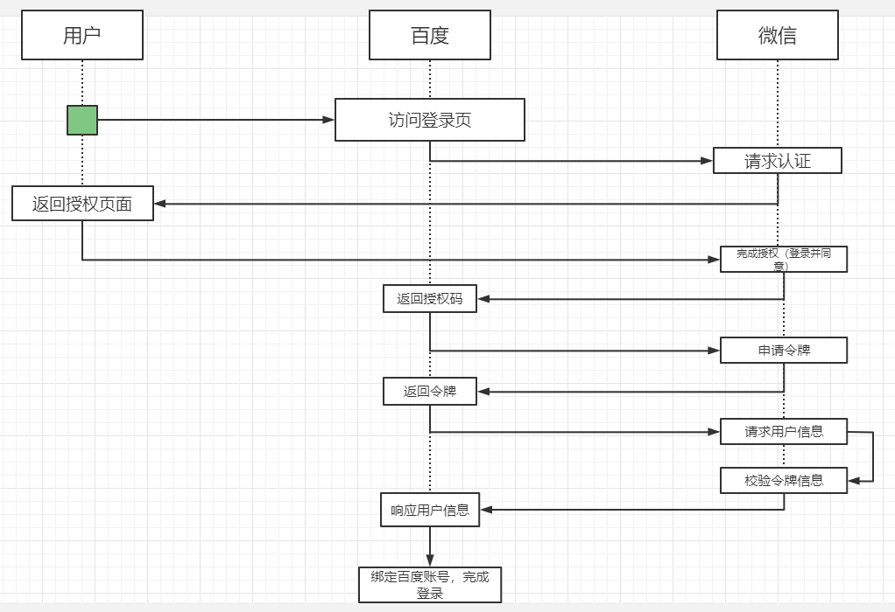

官方示意图：

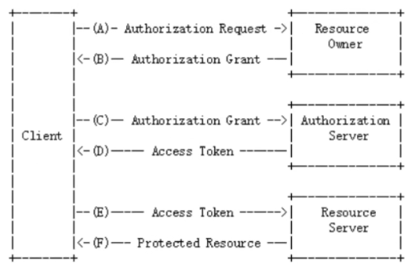


OAuth2.0包含以下几个角色：

> 客户端（示例中的浏览器、微信客户端）

本身不存储资源，需要通过资源拥有者的授权去请求资源服务器的资源

> 资源拥有者（示例中的用户）

通常是用户，也可以是应用程序，即该资源的拥有者

> 授权服务器（也称认证服务器）（示例中的微信）

用于服务提供者对资源资源拥有者的身份进行认证，对访问资源进行授权，认证成功后会给客户端发放令牌（access_token），作为客户端访问资源服务器的凭证

> 资源服务器（示例中的百度、微信）

存储资源的服务器，示例中，微信通过OAuth协议让百度可以访问自己存储的用户信息，而百度则通过该协议让用户可以访问自己受保护的资源


##### 3. 补充

**clientDetails**(client_id)：客户信息，代表百度在微信中的唯一索引

**secret**：密钥，百度获取微信信息时需要提供的一个加密字段

**scope**：授权作用域百度可以获取到的微信的信息范围，如：登录范围的凭证无法获取用户信息范围的内容

**access_token**：访问令牌，百度获取微信用户信息的凭证

**grant_type**：授权类型，authorization_code(授权码模式), password(密码模式), client_credentials(客户端模式), implicit(简易模式、隐式授权), refresh_token(刷新令牌)

userDetails(user_id)：授权用户标识，示例中代表用户的微信号


#### 二、Demo实现

OAuth2的服务包含授权服务（Authorization Server）和资源服务（Resource Server）。


> 授权服务

包含对接入端以及登入用户的合法性进行验证并颁发token等功能，对令牌的请求断点由SpringMVC控制器进行实现

+ AuthorizationEndPoint服务用于认证请求，默认url：/oauth/authorize
+ TokenEndPoint用于访问令牌的请求，默认url：/oauth/token
+ OAuth2AuthenticaionProcessingFilter用于对请求给出的身份令牌进行解析健全


大致业务流程：

1. 客户请求授权服务器申请access_token
2. 客户携带申请到的access_token访问资源服务器中的资源信息
3. 资源服务器将检验access_token的合法性，验证合法后返回对应的资源信息


##### 1. 父工程搭建

> pom.xml

```xml
<?xml version="1.0" encoding="UTF-8"?>
<project xmlns="http://maven.apache.org/POM/4.0.0"
         xmlns:xsi="http://www.w3.org/2001/XMLSchema-instance"
         xsi:schemaLocation="http://maven.apache.org/POM/4.0.0 http://maven.apache.org/xsd/maven-4.0.0.xsd">
    <modelVersion>4.0.0</modelVersion>
    <modules>
        <module>OAuth-Server</module>
        <module>OAuth-User</module>
    </modules>

    <parent>
        <groupId>org.springframework.boot</groupId>
        <artifactId>spring-boot-starter-parent</artifactId>
        <version>2.2.5.RELEASE</version>
        <relativePath/>
    </parent>

    <groupId>com.sw</groupId>
    <artifactId>Spring-Cloud-OAuth2</artifactId>
    <version>1.0.0-SNAPSHOT</version>
    <packaging>pom</packaging>

    <properties>
        <java.version>1.8</java.version>
        <project.build.sourceEncoding>UTF-8</project.build.sourceEncoding>
        <springboot.version>2.2.5.RELEASE</springboot.version>
    </properties>

    <dependencyManagement>
        <dependencies>
            <dependency>
                <groupId>org.springframework.boot</groupId>
                <artifactId>spring-boot-starter-web</artifactId>
                <version>${springboot.version}</version>
            </dependency>
            <dependency>
                <groupId>org.springframework.cloud</groupId>
                <artifactId>spring-cloud-starter-security</artifactId>
                <version>${springboot.version}</version>
            </dependency>
            <dependency>
                <groupId>org.springframework.cloud</groupId>
                <artifactId>spring-cloud-starter-oauth2</artifactId>
                <version>${springboot.version}</version>
            </dependency>
            <dependency>
                <groupId>org.springframework.security</groupId>
                <artifactId>spring-security-jwt</artifactId>
                <version>1.0.9.RELEASE</version>
            </dependency>
            <dependency>
                <groupId>org.springframework.boot</groupId>
                <artifactId>spring-boot-starter-data-redis</artifactId>
                <version>${springboot.version}</version>
            </dependency>
            <dependency>
                <groupId>org.springframework.boot</groupId>
                <artifactId>spring-boot-starter-actuator</artifactId>
                <version>${springboot.version}</version>
            </dependency>
            <dependency>
                <groupId>javax.interceptor</groupId>
                <artifactId>javax.interceptor-api</artifactId>
                <version>1.2.2</version>
            </dependency>
            <dependency>
                <groupId>mysql</groupId>
                <artifactId>mysql-connector-java</artifactId>
                <scope>8.0.18</scope>
            </dependency>
            <dependency>
                <groupId>org.projectlombok</groupId>
                <artifactId>lombok</artifactId>
                <version>1.18.20</version>
            </dependency>
        </dependencies>
    </dependencyManagement>

</project>
```


##### 2. 授权服务

> pom.xml

```xml
<?xml version="1.0" encoding="UTF-8"?>
<project xmlns="http://maven.apache.org/POM/4.0.0"
         xmlns:xsi="http://www.w3.org/2001/XMLSchema-instance"
         xsi:schemaLocation="http://maven.apache.org/POM/4.0.0 http://maven.apache.org/xsd/maven-4.0.0.xsd">
    <parent>
        <artifactId>Spring-Cloud-OAuth2</artifactId>
        <groupId>com.sw</groupId>
        <version>1.0.0-SNAPSHOT</version>
    </parent>
    <modelVersion>4.0.0</modelVersion>

    <artifactId>OAuth-Server</artifactId>

    <dependencies>
        <dependency>
            <groupId>org.springframework.boot</groupId>
            <artifactId>spring-boot-starter-web</artifactId>
        </dependency>
        <dependency>
            <groupId>org.springframework.cloud</groupId>
            <artifactId>spring-cloud-starter-security</artifactId>
        </dependency>
        <dependency>
            <groupId>org.springframework.cloud</groupId>
            <artifactId>spring-cloud-starter-oauth2</artifactId>
        </dependency>
        <dependency>
            <groupId>org.springframework.security</groupId>
            <artifactId>spring-security-jwt</artifactId>
        </dependency>
    </dependencies>

</project>
```


> 主启动类

开启 `@EnableAuthorizationServer` 注解

```java
package com.sw.oauth.server;

import org.springframework.boot.SpringApplication;
import org.springframework.boot.autoconfigure.SpringBootApplication;
import org.springframework.security.oauth2.config.annotation.web.configuration.EnableAuthorizationServer;

/**
 * @author suaxi
 * @date 2022/2/14 22:01
 */
@SpringBootApplication
@EnableAuthorizationServer
public class OAuthServerApplication {

    public static void main(String[] args) {
        SpringApplication.run(OAuthServerApplication.class, args);
    }
}

```


> application.yam

```yaml
server:
  port: 8088

spring:
  application:
    name: OAuth-Server
```


> 配置AuthorizationConfig

```java
package com.sw.oauth.server.config;

import org.springframework.beans.factory.annotation.Autowired;
import org.springframework.context.annotation.Bean;
import org.springframework.context.annotation.Configuration;
import org.springframework.http.HttpMethod;
import org.springframework.security.authentication.AuthenticationManager;
import org.springframework.security.core.userdetails.UserDetailsService;
import org.springframework.security.crypto.bcrypt.BCryptPasswordEncoder;
import org.springframework.security.oauth2.config.annotation.configurers.ClientDetailsServiceConfigurer;
import org.springframework.security.oauth2.config.annotation.web.configuration.AuthorizationServerConfigurerAdapter;
import org.springframework.security.oauth2.config.annotation.web.configurers.AuthorizationServerEndpointsConfigurer;
import org.springframework.security.oauth2.config.annotation.web.configurers.AuthorizationServerSecurityConfigurer;
import org.springframework.security.oauth2.provider.ClientDetailsService;
import org.springframework.security.oauth2.provider.code.AuthorizationCodeServices;
import org.springframework.security.oauth2.provider.code.InMemoryAuthorizationCodeServices;
import org.springframework.security.oauth2.provider.token.AuthorizationServerTokenServices;
import org.springframework.security.oauth2.provider.token.DefaultTokenServices;
import org.springframework.security.oauth2.provider.token.TokenStore;

/**
 * @author suaxi
 * @date 2022/2/14 22:11
 */
@Configuration
public class AuthorizationConfig extends AuthorizationServerConfigurerAdapter {

    @Autowired
    private AuthorizationCodeServices authorizationCodeServices;

    @Autowired
    private AuthenticationManager authenticationManager;

    @Autowired
    private UserDetailsService userDetailsService;

    @Autowired
    private TokenStore tokenStore;

    @Autowired
    private ClientDetailsService clientDetailsService;

    /**
     * 3.令牌端点安全约束
     * @param security
     * @throws Exception
     */
    @Override
    public void configure(AuthorizationServerSecurityConfigurer security) throws Exception {
        security
                //oauth/token_key 公开
                .tokenKeyAccess("permitAll()")
                //oauth/check_token 公开
                .checkTokenAccess("permitAll()")
                //表单认证，申请令牌
                .allowFormAuthenticationForClients();
    }

    /**
     * 1.客户端详情
     * @param clients
     * @throws Exception
     */
    @Override
    public void configure(ClientDetailsServiceConfigurer clients) throws Exception {
        clients.inMemory()
                //clientId
                .withClient("c1")
                //客户端密钥
                .secret(new BCryptPasswordEncoder().encode("secret"))
                //资源列表
                .resourceIds("admin")
                //授权方式
                .authorizedGrantTypes("authorization_code", "password", "client_credentials", "implicit", "refresh_token")
                //授权范围
                .scopes("all")
                //跳转到授权页面
                .autoApprove(false)
                //回调地址
                .redirectUris("https://wangchouchou.com");
    }

    /**
     * 2.令牌服务
     * @param endpoints
     * @throws Exception
     */
    @Override
    public void configure(AuthorizationServerEndpointsConfigurer endpoints) throws Exception {
        endpoints
                //认证管理器
                .authenticationManager(authenticationManager)
                //密码模式的用户信息管理
                .userDetailsService(userDetailsService)
                //授权码服务
                .authorizationCodeServices(authorizationCodeServices)
                //令牌管理服务
                .tokenServices(tokenServices())
                .allowedTokenEndpointRequestMethods(HttpMethod.POST);
    }

    public AuthorizationServerTokenServices tokenServices() {
        DefaultTokenServices tokenServices = new DefaultTokenServices();
        //客户端详情
        tokenServices.setClientDetailsService(clientDetailsService);
        //允许令牌自动刷新
        tokenServices.setSupportRefreshToken(true);
        //令牌存储策略
        tokenServices.setTokenStore(tokenStore);
        //默认令牌有效期
        tokenServices.setAccessTokenValiditySeconds(3600);
        //刷新令牌有效期
        tokenServices.setRefreshTokenValiditySeconds(86400);
        return tokenServices;
    }

    /**
     * 授权码模式的授权码如何存取
     * @return
     */
    @Bean
    public AuthorizationCodeServices authorizationCodeServices() {
        return new InMemoryAuthorizationCodeServices();
    }
}

```

+ **ClientDetailsServiceConfigurer**：配置客户端详情（ClientDetails）服务，客户端详情信息在这里进行初始化，此处以内存配置方式为例
  + clientId：用于标识客户的id
  + secret：客户端安全码
  + scope：客户端访问范围，如果为空，则代表拥有全部的访问范围
  + authorizedGrantTypes：授权类型
  + authorities：客户端拥有的权限
  + redirectUris：回调地址，授权服务会往该地址推送客户端相关的信息
+ **AuthorizationServerEndpointsConfigurer**：配置令牌（token）的访问端点和令牌服务（tokenService），它可以完成令牌服务和令牌服务各个端点配置
    + authenticationManager：认证管理器，选择password认证模式时就需要指定authenticationManager对象来进行鉴权
    + userDetailsService：用户主体管理服务，如果设置这个属性，需要实现UserDetailsService接口，也可以设置全局域（GlobalAuthenticationManagerConfigurer），如果配置这种方式，refresh_token刷新令牌方式的授权流程中会多一个检查步骤，来确保当前令牌是否仍然有效
    + authorizationCodeServices：用于授权码模式
    + implicitGrantService：用于设置隐式授权模式的状态
    + tokenGranter：如果设置该属性，授权全部交由自己掌控，并会忽略以上已设置的属性
+ **AuthorizationServerSecurityConfigurer**：配置令牌端点的安全约束，可以通过pathMapping()方法配置端点url的链接地址，替换oauth默认的授权地址，也可以跟换spring security默认的授权页面
    + /oauth/authorize：授权端点
    + /oauth/token：令牌端点
    + /oauth/confirm_access：用户确认授权提交端点
    + /oauth/error：授权服务错误信息端点
    + /oauth/check_token：检查令牌
    + /oauth/token_key：使用jwt令牌需要用到的提供公有密钥的端点 


> 配置TokenConfig

```java
package com.sw.oauth.server.config;

import org.springframework.context.annotation.Bean;
import org.springframework.context.annotation.Configuration;
import org.springframework.security.oauth2.provider.token.TokenStore;
import org.springframework.security.oauth2.provider.token.store.InMemoryTokenStore;

/**
 * @author suaxi
 * @date 2022/2/14 22:24
 */
@Configuration
public class TokenConfig {

    @Bean
    public TokenStore tokenStore() {
        return new InMemoryTokenStore();
    }

}

```

实现AuthorizationServerTokenService需要继承DefaultTokenService，该类可以修改令牌的格式和存储，默认情况下，在创建令牌时使用随机字符串来填充，这个类完成了令牌管理的大部分事情，唯一需要依赖的是spring容器中的TokenStore接口，以此来定制令牌持久化；TokenStore有一个默认实现（InMemoryTokenStore），这个实现类将令牌保存到内存中，除此之外还有其他几个默认实现类：

+ InMemoryTokenStore：默认采用方式，可在单节点运行（即并发压力不大的情况下，并且在失败时不会进行备份），也可以在并发的时候进行管理，因为数据保存在内存中，不进行持久化存储，易于调试
+ JdbcTokenStore：基于JDBC的实现类，令牌会被保存到关系型数据库中，可在不同的服务器之间共享令牌信息
+ RedisTokenStore：与jdbc方式类似
+ JwtTokenStore（JSON Web Token）：可以将令牌信息全部编码整合进令牌本身，优点是后端可以不用进行存储操作，缺点是撤销一个已经授权的令牌很困难，所以通常用来处理生命周期较短的令牌以及撤销刷新令牌，另一个缺点是令牌较长，包含的用户凭证信息，它不保存任何数据在转换令牌值和授权信息方面与DefaultTokenServices扮演一样的角色


> 配置WebSecurityConfig

```java
package com.sw.oauth.server.config;

import org.springframework.context.annotation.Bean;
import org.springframework.context.annotation.Configuration;
import org.springframework.security.authentication.AuthenticationManager;
import org.springframework.security.config.annotation.method.configuration.EnableGlobalMethodSecurity;
import org.springframework.security.config.annotation.web.builders.HttpSecurity;
import org.springframework.security.config.annotation.web.configuration.WebSecurityConfigurerAdapter;
import org.springframework.security.core.userdetails.User;
import org.springframework.security.core.userdetails.UserDetailsService;
import org.springframework.security.crypto.bcrypt.BCryptPasswordEncoder;
import org.springframework.security.crypto.password.PasswordEncoder;
import org.springframework.security.provisioning.InMemoryUserDetailsManager;

/**
 * @author suaxi
 * @date 2022/2/14 22:25
 */
@Configuration
@EnableGlobalMethodSecurity(prePostEnabled = true, securedEnabled = true)
public class WebSecurityConfig extends WebSecurityConfigurerAdapter {

    @Bean
    public PasswordEncoder passwordEncoder() {
        return new BCryptPasswordEncoder();
    }

    @Bean
    @Override
    public AuthenticationManager authenticationManagerBean() throws Exception{
        return super.authenticationManager();
    }

    @Bean
    @Override
    public UserDetailsService userDetailsService() {
        InMemoryUserDetailsManager inMemoryUserDetailsManager = new InMemoryUserDetailsManager(
                User.withUsername("admin").password(passwordEncoder().encode("123456")).authorities("manager, worker").build(),
                User.withUsername("manager").password(passwordEncoder().encode("123456")).authorities("manager").build(),
                User.withUsername("worker").password(passwordEncoder().encode("123456")).authorities("worker").build()
        );
        return inMemoryUserDetailsManager;
    }

    @Override
    protected void configure(HttpSecurity http) throws Exception {
        http.csrf().disable()
                .authorizeRequests()
                .anyRequest().authenticated()
                .and()
                .formLogin();
    }
}

```


##### 3. 授权服务流程测试

###### 1. 客户端模式client_credentails

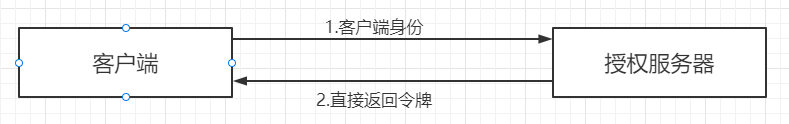

客户端向授权服务器发送自己的身份信息，请求access_token

```bash
localhost:8088/oauth/token
```

参数列表：

+ grant_type：授权类型，需填写client_credentials
+ client_id：客户端标识
+ client_secret：客户端密钥

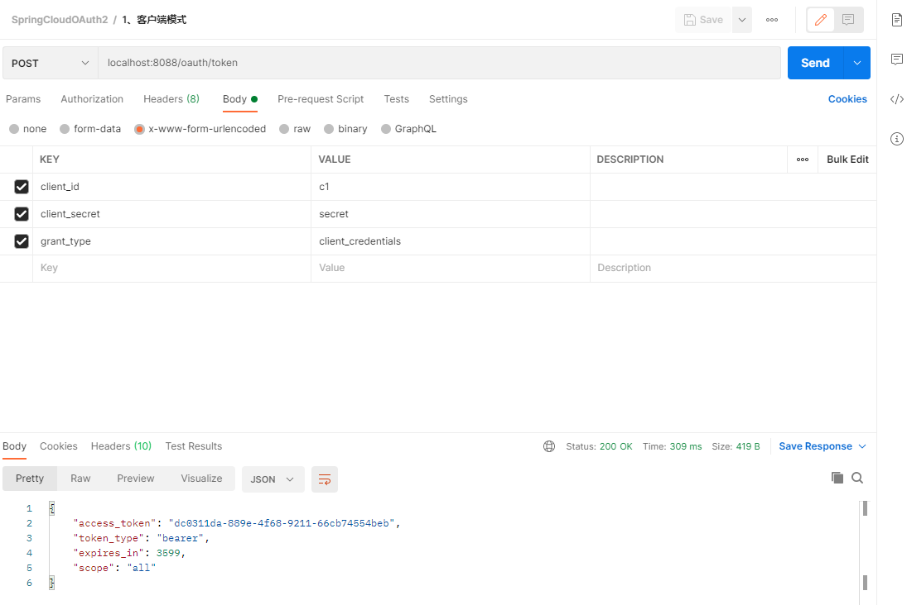

这种方式最方便但也是最不安全的，代表了授权服务器对客户端完全信任，一般用于授权服务器对客户端完全信任的场景。


###### 2. 密码模式password

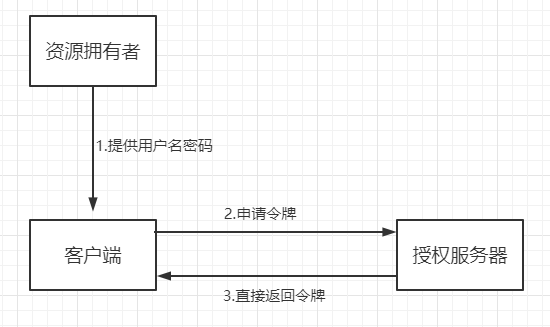

（1）资源拥有者将用户名、密码发送给客户端

（2）客户端用资源拥有者的用户名、密码向授权服务器申请令牌

```bash
localhost:8088/oauth/token
```

参数列表：

+ grant_type：授权类型，需填写password
+ client_id：客户端标识
+ client_secret：客户端密钥
+ username：用户名
+ password：密码

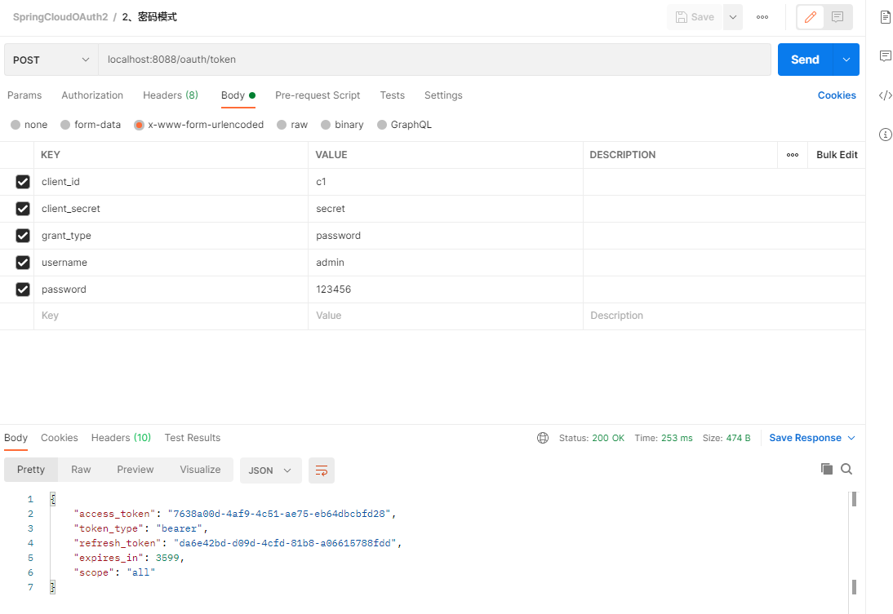

这种方式用户会把用户名、密码直接泄露给客户端，代表了资源拥有者和授权服务器对客户端的绝对互信，一般用于内部开发客户端的场景


###### 3.简化模式（隐式模式）implicit

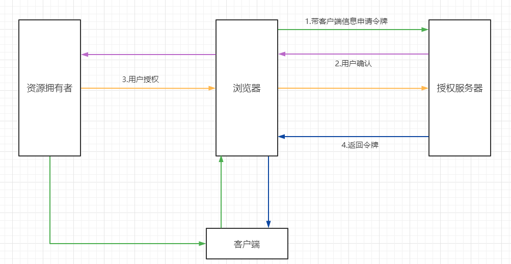

（1）用户访问客户端，客户端向授权服务器申请授权

（2）授权服务器引导用户进入授权页面，待用户同意授权

（3）用户同意授权

（4）用户同意授权后，授权服务器向客户端返回令牌

测试流程：

（1）客户端引导用户，直接访问授权服务器的授权地址

```bash
http://localhost:8088/oauth/authorize?client_id=c1&response_type=token&scope=all&redirect_uri=https://wangchouchou.com
```

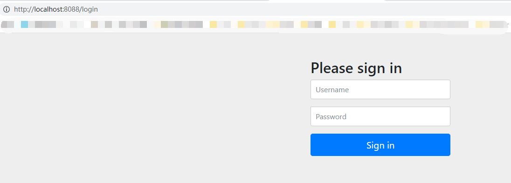

（2）用户登录之后跳转至授权页面

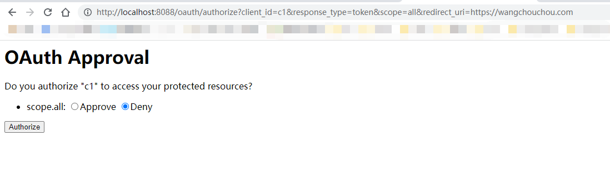

（3）用户点击approve同意授权，提交之后，页面跳转至redirect_uri地址并携带令牌信息（该地址需授权服务器提前配置）

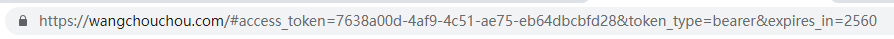

一般情况下，redirect_uri会配置成客户端自己的一个响应地址，这个地址收到授权服务器推送过来的令牌之后，可将它保存至本地，在需要调用资源服务时，再拿出来携带上访问资源服务器。<font color='red'>该模式下，access_token是以#gragement的方式返回的</font>，oauth三方的数据已经进行了隔离，一般用于没有服务端的第三方单页面应用，可在js中直接相应access_token。


###### 4. 授权码模式 authorization_code

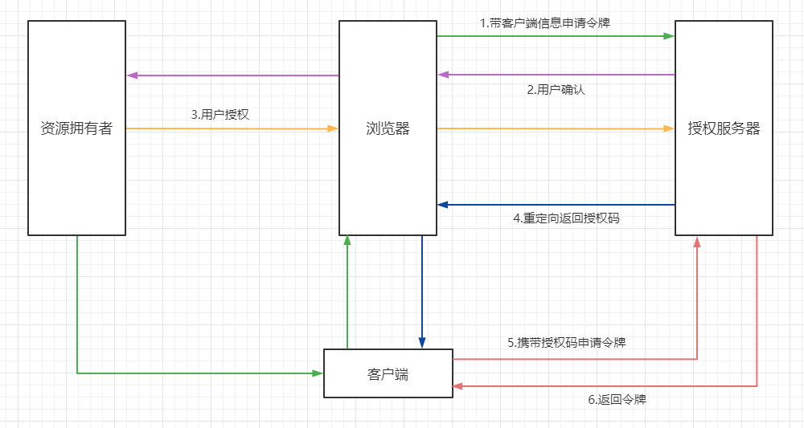

相较于简化模式的流程，授权码模式在第四步时，授权服务器先给客户端返回一个授权码（authorization_code），客户端拿到之后，再向授权服务器申请令牌

测试流程：

（1）用户申请access_token时访问：

```bash
http://localhost:8088/oauth/authorize?client_id=c1&response_type=code&scope=all&redirect_uri=https://wangchouchou.com
```

首先会跳转到授权服务器登录页，用户进行登录


（2）登录完成之后，转到授权页面

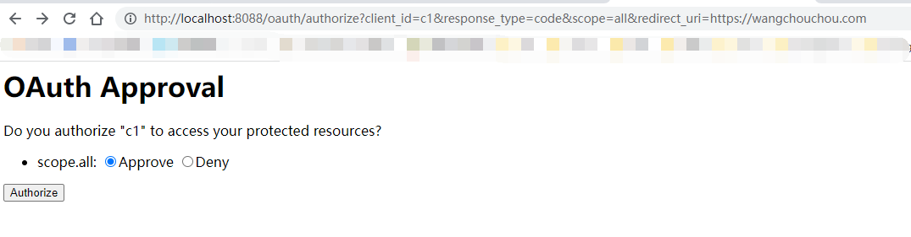

（3）点击同意授权之后，携带授权码重定向至redirect_uri

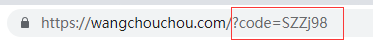

（4）申请令牌

参数列表：

+ grant_type：授权类型，需填写authorization_code
+ client_id：客户端标识
+ client_secret：客户端密钥
+ code：授权码（只能用一次）
+ redirect_uri：重定向地址

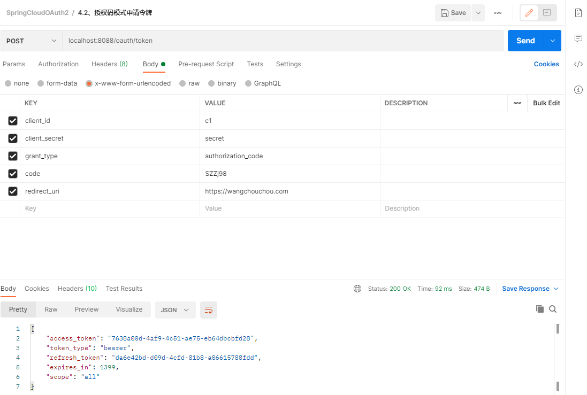


###### 5. 刷新令牌

当令牌超时后，可以通过refresh_token申请新的令牌（refresh_token随access_token一起申请到）

参数列表：

- grant_type：授权类型，需填写refresh_token
- client_id：客户端标识
- client_secret：客户端密钥
- refresh_token：刷新令牌

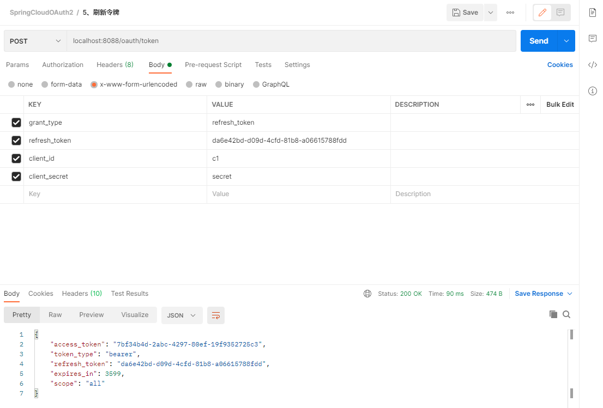


###### 6. 验证令牌

参数列表：

+ token：令牌

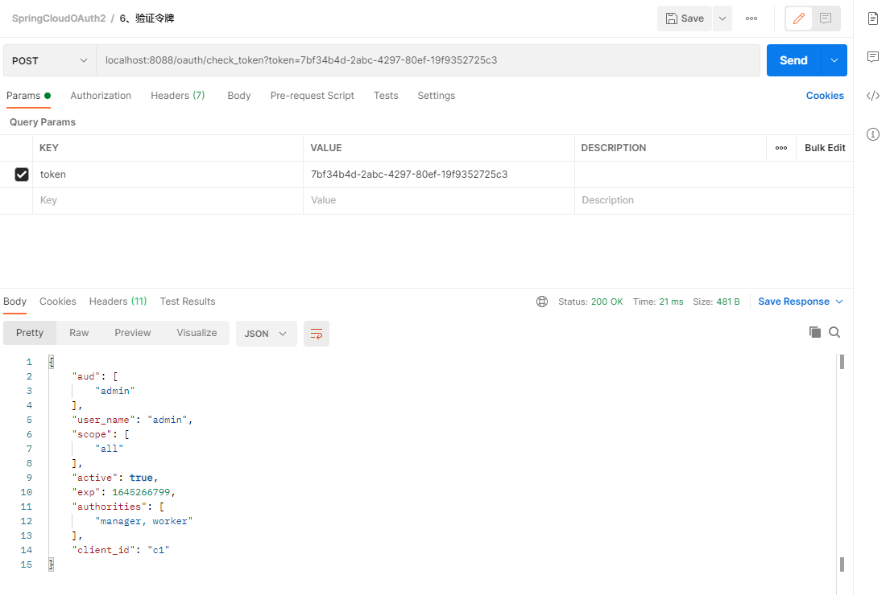


##### 4. 资源服务

> pom.xml

```xml
<?xml version="1.0" encoding="UTF-8"?>
<project xmlns="http://maven.apache.org/POM/4.0.0"
         xmlns:xsi="http://www.w3.org/2001/XMLSchema-instance"
         xsi:schemaLocation="http://maven.apache.org/POM/4.0.0 http://maven.apache.org/xsd/maven-4.0.0.xsd">
    <parent>
        <artifactId>Spring-Cloud-OAuth2</artifactId>
        <groupId>com.sw</groupId>
        <version>1.0.0-SNAPSHOT</version>
    </parent>
    <modelVersion>4.0.0</modelVersion>

    <artifactId>OAuth-User</artifactId>

    <dependencies>
        <dependency>
            <groupId>org.springframework.boot</groupId>
            <artifactId>spring-boot-starter-web</artifactId>
        </dependency>
        <dependency>
            <groupId>org.springframework.cloud</groupId>
            <artifactId>spring-cloud-starter-security</artifactId>
        </dependency>
        <dependency>
            <groupId>org.springframework.cloud</groupId>
            <artifactId>spring-cloud-starter-oauth2</artifactId>
        </dependency>
        <dependency>
            <groupId>org.springframework.security</groupId>
            <artifactId>spring-security-jwt</artifactId>
        </dependency>
    </dependencies>

</project>
```


> 主启动类

打开@EnableResourceServer注解，会自动增加一个OAuth2AuthenticationProcessingFilter的过滤器链

```java
package com.sw.oauth.user;

import org.springframework.boot.SpringApplication;
import org.springframework.boot.autoconfigure.SpringBootApplication;
import org.springframework.security.oauth2.config.annotation.web.configuration.EnableResourceServer;

/**
 * @author suaxi
 * @date 2022/2/14 22:08
 */
@SpringBootApplication
@EnableResourceServer
public class OAuthUserApplication {

    public static void main(String[] args) {
        SpringApplication.run(OAuthUserApplication.class, args);
    }
}

```


> application.yml

```yaml
server:
  port: 8089

spring:
  application:
    name: OAuth-User
```


> 资源服务器核心配置

Spring Security也提供了ResourceServerSecurityConfigurer适配器来协助完成资源服务器的配置

ResourceServerSecurityConfigurer中主要包含：

+ tokenServices：ResourceServerTokenServices类的实例，用来实现令牌服务，即如何验证令牌
+ tokenStore：TokenStore类的实例，指定令牌如何访问，与tokenServices配置可选
+ resourceId：资源服务器id（可选），一般情况下推荐设置并在授权服务中进行验证
+ tokenExtractor：用于提取请求中的令牌

HttpSecurity配置与Spring Security类似：

+ authorizeRequests()方法验证请求
+ antMatchers()方法匹配访问路径
+ access()方法配置需要的权限


> ResourceServerConfig配置

```java
package com.sw.oauth.user.config;

import org.springframework.beans.factory.annotation.Autowired;
import org.springframework.context.annotation.Configuration;
import org.springframework.security.config.annotation.web.builders.HttpSecurity;
import org.springframework.security.config.http.SessionCreationPolicy;
import org.springframework.security.oauth2.config.annotation.web.configuration.ResourceServerConfigurerAdapter;
import org.springframework.security.oauth2.config.annotation.web.configurers.ResourceServerSecurityConfigurer;
import org.springframework.security.oauth2.provider.token.RemoteTokenServices;
import org.springframework.security.oauth2.provider.token.ResourceServerTokenServices;
import org.springframework.security.oauth2.provider.token.TokenStore;

/**
 * @author suaxi
 * @date 2022/2/15 22:36
 */
@Configuration
public class ResourceServerConfig extends ResourceServerConfigurerAdapter {

    private static final String RESOURCE_ADMIN = "admin";

    @Autowired
    private TokenStore tokenStore;

    @Override
    public void configure(ResourceServerSecurityConfigurer resources) throws Exception {
        resources
                //资源ID
                .resourceId(RESOURCE_ADMIN)
                //使用远程服务验证令牌（使用JWT令牌时无需远程验证服务）
                .tokenServices(tokenServices())
                .tokenStore(tokenStore)
                //无状态模式（无需管理session，此处只验证access_token）
                .stateless(true);
    }

    @Override
    public void configure(HttpSecurity http) throws Exception {
        http.authorizeRequests()
                .antMatchers("/admin/**")
                .access("#oauth2.hasAnyScope('all')")
                .and()
                .csrf().disable()
                .sessionManagement().sessionCreationPolicy(SessionCreationPolicy.STATELESS);
    }

    /**
     * access_token远程验证策略
     * @return
     */
    public ResourceServerTokenServices tokenServices() {
        RemoteTokenServices tokenServices = new RemoteTokenServices();
        tokenServices.setCheckTokenEndpointUrl("http://localhost:8088/oauth/check_token");
        tokenServices.setClientId("c1");
        tokenServices.setClientSecret("secret");
        return tokenServices;
    }
}

```

需注意ResourceServerSecurityConfigurer的tokenServices()方法，设置了一个token的管理服务，其中，如果资源服务和授权服务在同一应用程序上，那可以使用DefaultTokenServices，就不用考虑实现所有必要接口一致性的问题，反之，则必须要保证有能够匹配授权服务提供的ResourceServerTokenServices，这个类知道如何对令牌进行解码。

**令牌解析方法**：使用DefaultTokenServices在资源服务器本地配置令牌存储、解码、解析方式；使用RemoteTokenServices，资源服务器通过http请求来解码令牌，每次请求都需要请求授权服务器端点/oauth/check_token，同时还需要授权服务器将该端点暴露出来，以便资源服务器进行访问，在资源服务器配置中需注意：

```java
@Override
public void configure(AuthorizationServerSecurityConfigurer security) throws Exception {
    security
        //oauth/token_key 公开
        .tokenKeyAccess("permitAll()")
        //oauth/check_token 公开
        .checkTokenAccess("permitAll()")
        //表单认证，申请令牌
        .allowFormAuthenticationForClients();
}
```


>资源服务器WebSecurityConfig配置

```java
package com.sw.oauth.user.config;

import org.springframework.context.annotation.Configuration;
import org.springframework.security.config.annotation.web.builders.HttpSecurity;
import org.springframework.security.config.annotation.web.configuration.WebSecurityConfigurerAdapter;

/**
 * @author suaxi
 * @date 2022/2/15 22:52
 */
@Configuration
public class WebSecurityConfig extends WebSecurityConfigurerAdapter {

    @Override
    protected void configure(HttpSecurity http) throws Exception {
        http.csrf().disable()
                .authorizeRequests()
                .antMatchers("/admin/**")
                .hasAnyAuthority("admin")
                .anyRequest().authenticated();
    }
}

```


> controller

```java
package com.sw.oauth.user.controller;

import org.springframework.web.bind.annotation.GetMapping;
import org.springframework.web.bind.annotation.RequestMapping;
import org.springframework.web.bind.annotation.RestController;

/**
 * @author suaxi
 * @date 2022/2/15 22:43
 */
@RestController
@RequestMapping("/admin")
public class AdminController {

    @GetMapping("/test")
    public String test() {
        return "test";
    }
}

```


接口测试：

直接访问：

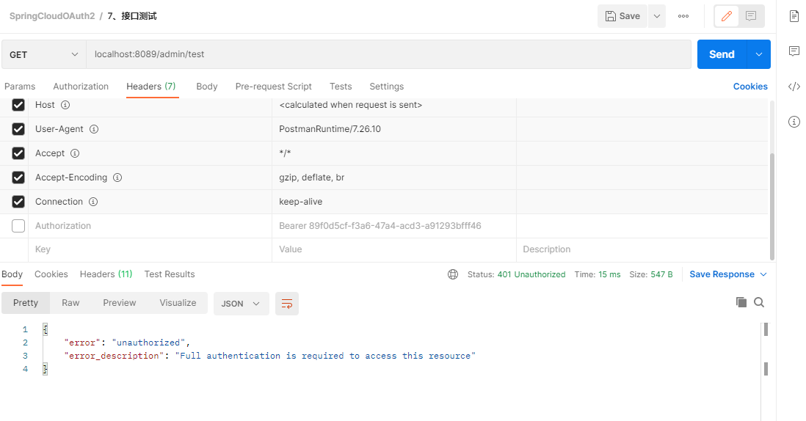

header携带令牌访问：

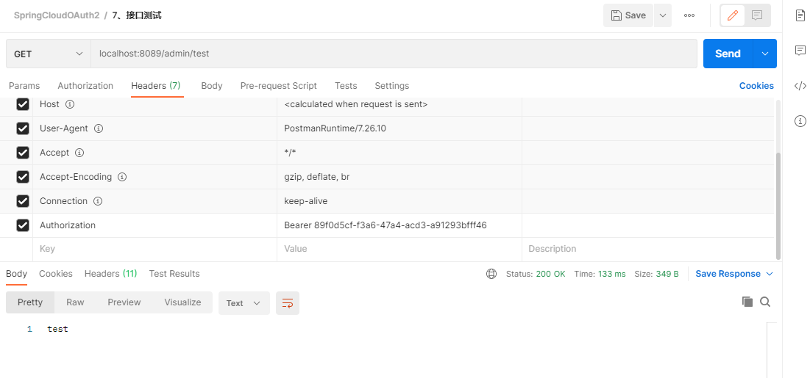

在该测试过程中，资源服务器未配置TokenStore对象，它并不知道access_token的意义；需要使用RemoteTokenServices将令牌拿到授权服务器上进行验证才能得到客户信息，当请求量逐步增大之后，会加重系统的网络负担以及运行效率，而JWT令牌需解决以上提到的问题。


#### 三、 JWT令牌

##### 1. 概念

JWT（JSON Web Token），是一个开放的行业标准（RFC 7519），它定义了一种简单的、自包含的协议格式，用于在通信双方传递json对象，传递的信息经过数字签名，可以被验证和信任，可以使用HMAC、RSA等算法。在OAuth中使用JWT，令牌本身就包含了客户的详细信息，资源服务器就不用再依赖授权服务器就可以完成令牌解析。


官网：https://jwt.io/

RFC 7519协议：https://datatracker.ietf.org/doc/rfc7519/


优点

+ 基于json，方便解析
+ 自定义令牌内容，可扩展
+ 通过非对称加密算法及数字签名防止被篡改，安全性高
+ 资源服务器克不依赖于授权服务器完成令牌解析

缺点：令牌较长，占用的空间过多


> 令牌结构

由Header.Payload.Signature三部分组成，中间由(.)分割

**Header：**

头部包括令牌的类型以及使用的hash算法（HMAC、SHA256、RSA）

```json
{
    "alg": "HS256",
    "typ": "JWT"
}
```

使用Base64编码之后得到JWT令牌的第一部分


**Payload：**

负载（Base64编码）：存放有效信息，如：iss（签发者），exp（过期时间戳），sub（面向的用户）等，也可以自定义字段

该部分不建议存放敏感信息，可以通过解码还原出原始内容。


**Signature:**

该部分防止JWT内容被篡改，使用Base64将前两部分编码，使用(.)连接组成字符串，最后使用header中声明的算法进行签名


##### 2. 配置JWT令牌服务

###### 1. 授权服务配置

> TokenConfig配置

```java
package com.sw.oauth.server.config;

import org.springframework.context.annotation.Bean;
import org.springframework.context.annotation.Configuration;
import org.springframework.security.oauth2.provider.token.TokenStore;
import org.springframework.security.oauth2.provider.token.store.InMemoryTokenStore;
import org.springframework.security.oauth2.provider.token.store.JwtAccessTokenConverter;
import org.springframework.security.oauth2.provider.token.store.JwtTokenStore;

/**
 * @author suaxi
 * @date 2022/2/14 22:24
 */
@Configuration
public class TokenConfig {

    private static final String SIGN_KEY = "server";

//    @Bean
//    public TokenStore tokenStore() {
//        return new InMemoryTokenStore();
//    }

    @Bean
    public TokenStore tokenStore() {
        return new JwtTokenStore(accessTokenConverter());
    }

    @Bean
    public JwtAccessTokenConverter accessTokenConverter() {
        JwtAccessTokenConverter accessTokenConverter = new JwtAccessTokenConverter();
        accessTokenConverter.setSigningKey(SIGN_KEY);
        return accessTokenConverter;
    }
}

```


> AuthorizationConfig配置

```java
@Autowired
private JwtAccessTokenConverter accessTokenConverter;

public AuthorizationServerTokenServices tokenServices() {
    DefaultTokenServices tokenServices = new DefaultTokenServices();
    //客户端详情
    tokenServices.setClientDetailsService(clientDetailsService);
    //允许令牌自动刷新
    tokenServices.setSupportRefreshToken(true);
    //令牌存储策略
    tokenServices.setTokenStore(tokenStore);
    //使用JWT令牌
    tokenServices.setTokenEnhancer(accessTokenConverter);
    //默认令牌有效期
    tokenServices.setAccessTokenValiditySeconds(3600);
    //刷新令牌有效期
    tokenServices.setRefreshTokenValiditySeconds(86400);
    return tokenServices;
}
```


###### 2. 测试

申请令牌：

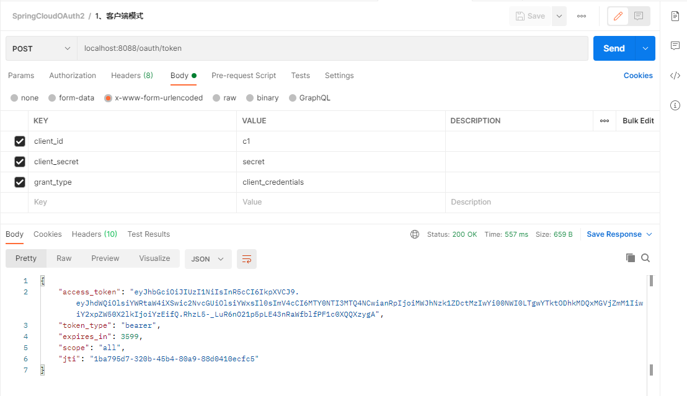


验证令牌：

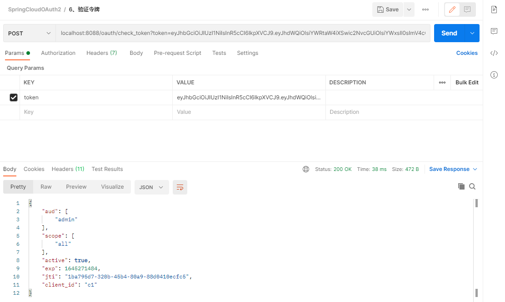


###### 3. 资源服务器配置

1. 将授权服务器中的TokenConfig拷贝至资源服务器config目录下

2. 在ResourceServerConfig中屏蔽ResourceServerTokenServices

   ```java
   package com.sw.oauth.user.config;
   
   import org.springframework.beans.factory.annotation.Autowired;
   import org.springframework.context.annotation.Configuration;
   import org.springframework.security.config.annotation.web.builders.HttpSecurity;
   import org.springframework.security.config.http.SessionCreationPolicy;
   import org.springframework.security.oauth2.config.annotation.web.configuration.ResourceServerConfigurerAdapter;
   import org.springframework.security.oauth2.config.annotation.web.configurers.ResourceServerSecurityConfigurer;
   import org.springframework.security.oauth2.provider.token.RemoteTokenServices;
   import org.springframework.security.oauth2.provider.token.ResourceServerTokenServices;
   import org.springframework.security.oauth2.provider.token.TokenStore;
   
   /**
    * @author suaxi
    * @date 2022/2/15 22:36
    */
   @Configuration
   public class ResourceServerConfig extends ResourceServerConfigurerAdapter {
   
       private static final String RESOURCE_ADMIN = "admin";
   
       @Autowired
       private TokenStore tokenStore;
   
       @Override
       public void configure(ResourceServerSecurityConfigurer resources) throws Exception {
           resources
                   //资源ID
                   .resourceId(RESOURCE_ADMIN)
                   //使用远程服务验证令牌（使用JWT令牌时无需远程验证服务）
   //                .tokenServices(tokenServices())
                   .tokenStore(tokenStore)
                   //无状态模式（无需管理session，此处只验证access_token）
                   .stateless(true);
       }
   
       @Override
       public void configure(HttpSecurity http) throws Exception {
           http.authorizeRequests()
                   .antMatchers("/admin/**")
                   .access("#oauth2.hasAnyScope('all')")
                   .and()
                   .csrf().disable()
                   .sessionManagement().sessionCreationPolicy(SessionCreationPolicy.STATELESS);
       }
   
       /**
        * access_token远程验证策略
        * @return
        */
   //    public ResourceServerTokenServices tokenServices() {
   //        RemoteTokenServices tokenServices = new RemoteTokenServices();
   //        tokenServices.setCheckTokenEndpointUrl("http://localhost:8088/oauth/check_token");
   //        tokenServices.setClientId("c1");
   //        tokenServices.setClientSecret("secret");
   //        return tokenServices;
   //    }
   }
   
   ```


###### 4. 测试

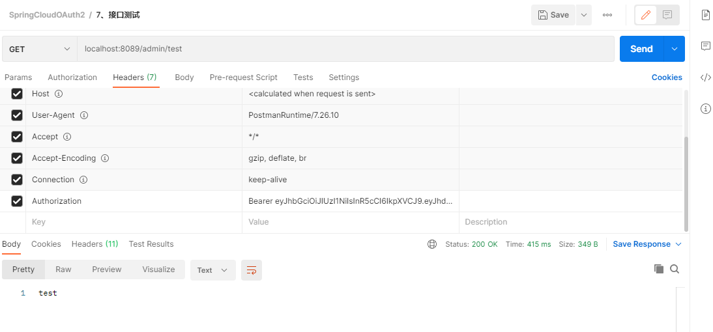

Github demo地址：https://github.com/suaxi/Spring-Cloud-OAuth2