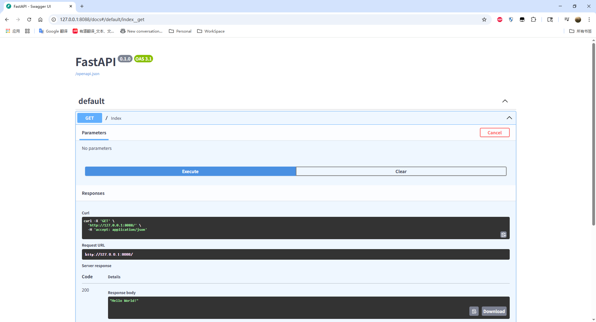
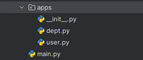
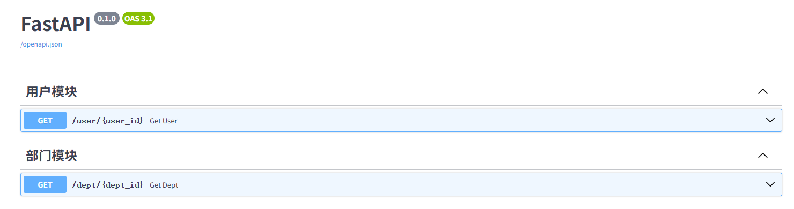

## FastApi

*参考 B站苑昊老师 `FastApi` 课程*

### 一、QuickStart

#### 1. 安装

```bash
# fastapi
pip install fastapi

# uvicorn
pip install uvicorn
```

#### 2. 测试 demo

##### （1）main.py

```python
from fastapi import FastAPI

app = FastAPI()


@app.get("/")
async def index():
    return "Hello World!"
```


##### （2）启动

```bash
# 通过命令行
uvicorn main:app --reload
```

```python
# 通过 main 函数
if __name__ == '__main__':
    import uvicorn

    uvicorn.run("main:app", host="127.0.0.1", port=8088, reload=True)
```


##### （3）接口文档

启动后通过 http://127.0.0.1:8088/docs 即可访问 `swagger`




### 二、路径操作

#### 1. 路径操作装饰器

##### （1）FastApi支持的请求方式

```python
@app.get()
@app.post()
@app.put()
@app.patch()
@app.delete()
@app.options()
@app.head()
@app.trace()
```

##### （2）路径操作装饰器参数

```python
@app.post(
    "/user/{user_id}",
    response_model=User,
    status_code=status.HTTP_200_OK,
    tags=["用户模块"],
    summary="根据user_id查询用户信息",
    description="根据user_id查询用户信息",
    response_description= "用户信息",
    deprecated=False,
)
```


#### 2. include_router

**项目结构**



**`__init.py__`**

```python
# __init__.py
from .user import user
from .dept import dept

```


**dept.py**

```python
from fastapi import APIRouter

dept = APIRouter()


@dept.get("/{dept_id}")
async def get_dept(dept_id):
    return {
        "dept": dept_id
    }

```


**user.py**

```python
from fastapi import APIRouter

user = APIRouter()


@user.get("/{user_id}")
async def get_user(user_id):
    return {
        "user": user_id
    }

```


**main.py**

```python
from fastapi import FastAPI

from apps import user, dept

app = FastAPI()
app.include_router(user, prefix="/user", tags=["用户模块", ])
app.include_router(dept, prefix="/dept", tags=["部门模块", ])

if __name__ == '__main__':
    import uvicorn

    uvicorn.run("main:app", host="127.0.0.1", port=8088, reload=True)

```


启动项目后访问docs



