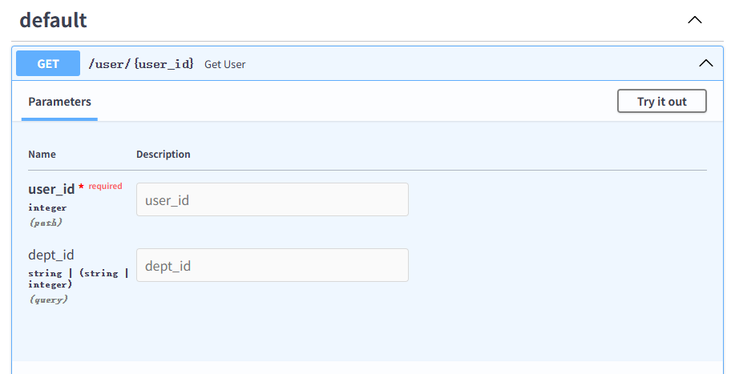
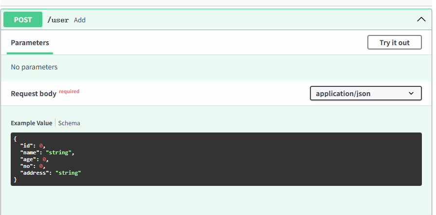
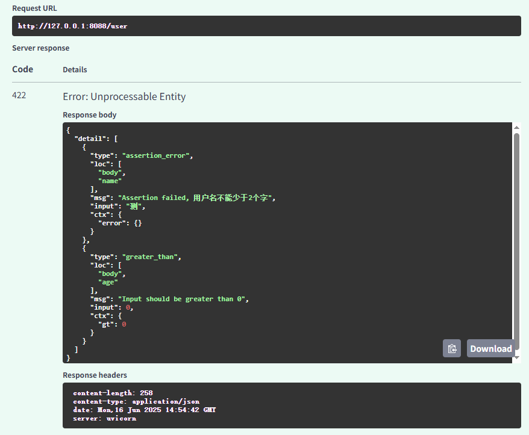
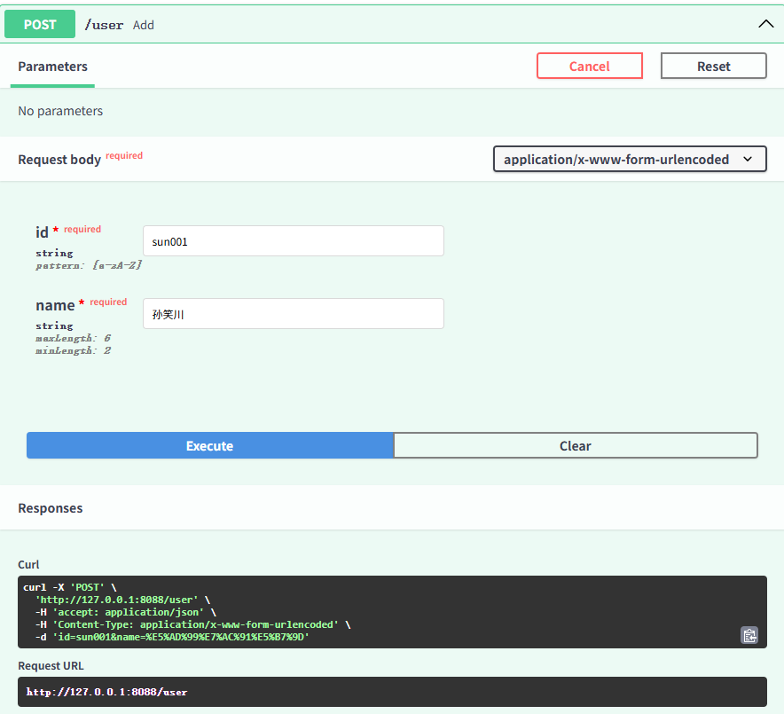
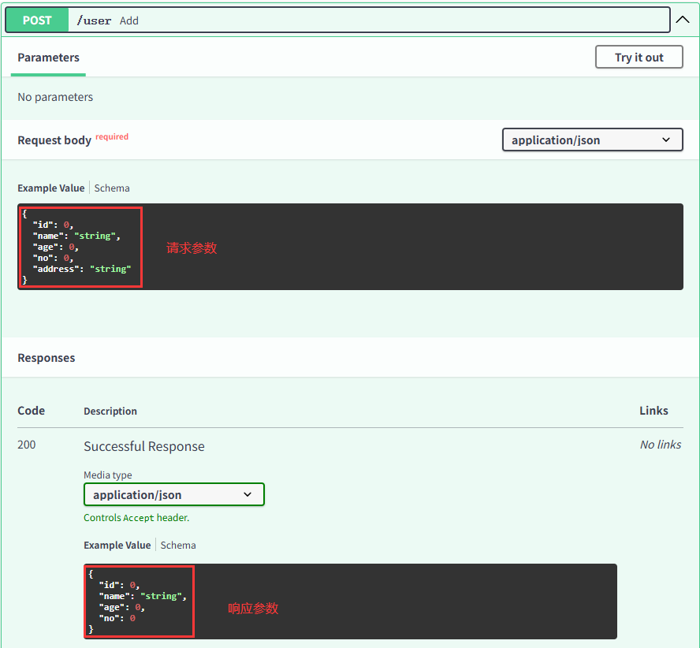
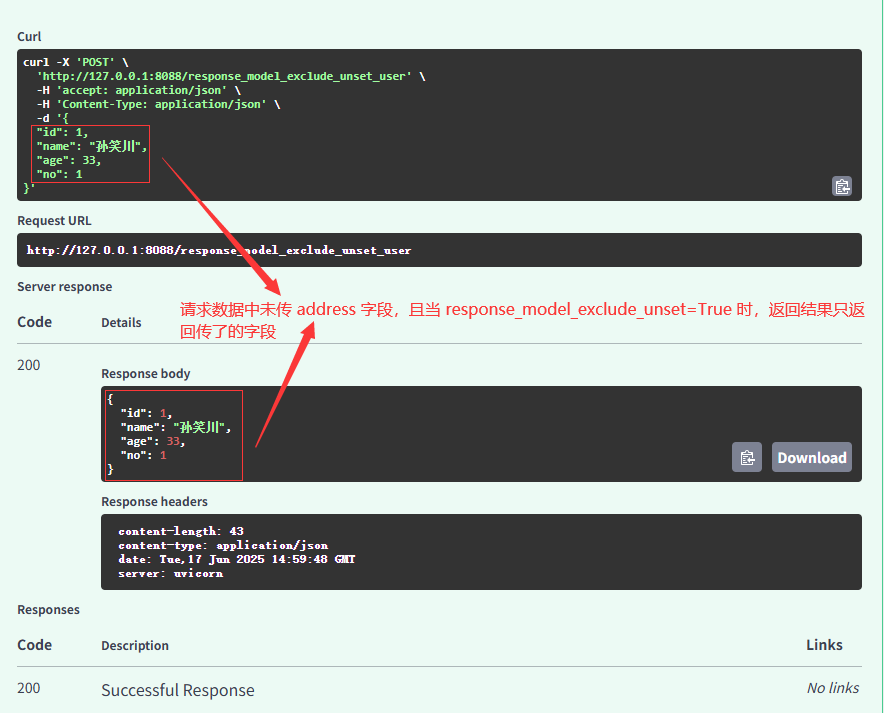

## FastApi

*参考 B站苑昊老师 `FastApi` 课程*

### 一、QuickStart

#### 1. 安装

```bash
# fastapi
pip install fastapi

# uvicorn
pip install uvicorn
```

#### 2. 测试 demo

##### （1）main.py

```python
from fastapi import FastAPI

app = FastAPI()


@app.get("/")
async def index():
    return "Hello World!"
```


##### （2）启动

```bash
# 通过命令行
uvicorn main:app --reload
```

```python
# 通过 main 函数
if __name__ == '__main__':
    import uvicorn

    uvicorn.run("main:app", host="127.0.0.1", port=8088, reload=True)
```


##### （3）接口文档

启动后通过 http://127.0.0.1:8088/docs 即可访问 `swagger`


### 二、路径操作

#### 1. 路径操作装饰器

##### （1）FastApi支持的请求方式

```python
@app.get()
@app.post()
@app.put()
@app.patch()
@app.delete()
@app.options()
@app.head()
@app.trace()
```

##### （2）路径操作装饰器参数

```python
@app.post(
    "/user/{user_id}",
    response_model=User,
    status_code=status.HTTP_200_OK,
    tags=["用户模块"],
    summary="根据user_id查询用户信息",
    description="根据user_id查询用户信息",
    response_description= "用户信息",
    deprecated=False,
)
```


#### 2. include_router

**项目结构**


**`__init.py__`**

```python
# __init__.py
from .user import user
from .dept import dept

```


**dept.py**

```python
from fastapi import APIRouter

dept = APIRouter()


@dept.get("/{dept_id}")
async def get_dept(dept_id):
    return {
        "dept": dept_id
    }

```


**user.py**

```python
from fastapi import APIRouter

user = APIRouter()


@user.get("/{user_id}")
async def get_user(user_id):
    return {
        "user": user_id
    }

```


**main.py**

```python
from fastapi import FastAPI

from apps import user, dept

app = FastAPI()
app.include_router(user, prefix="/user", tags=["用户模块", ])
app.include_router(dept, prefix="/dept", tags=["部门模块", ])

if __name__ == '__main__':
    import uvicorn

    uvicorn.run("main:app", host="127.0.0.1", port=8088, reload=True)

```


启动项目后访问docs


### 三、请求与响应

#### 1. 路径参数

##### （1）基本使用

```python
@app.get("/user/{user_id}")
async def get_user(user_id):
    print(user_id, type(user_id))
    return {
        "user_id": user_id
    }
```


##### （2）声明路径参数类型

此例中参数类型为 int

```python
@app.get("/user/{user_id}")
async def get_user(user_id: int):
    print(user_id, type(user_id))
    return {
        "user_id": user_id
    }
```


##### （3）注意定义的函数顺序问题

```python
"""
注意定义的函数顺序问题
例：有请求路径为 /user/list 的方法，它需要置于 /user/{user/id} 之前
否则会出现请求 /user/list 方法，但请求最终落在了 /user/{user_id} 方法上的问题
"""

@app.get("/user/list")
async def get_user_list():
    return tuple([
        {
            "user": "user1"
        },
        {
            "user": "user2"
        }
    ])

@app.get("/user/{user_id}")
async def get_user(user_id: int):
    print(user_id, type(user_id))
    return {
        "user_id": user_id
    }
```


#### 2. 查询参数（请求参数）

路径函数中声明不属于路径参数的其他函数参数时，它们将被自动解释为**查询字符串**参数，就是 url? 之后用`&`分割的 key-value 键值对。

```python
from typing import Union

from fastapi import FastAPI

app = FastAPI()

"""
此例中有路径参数 user_id，查询参数 dept_id
参数 dept_id 通过 Union 声明为 str、int 类型，或者为None（不传）
"""

@app.get("/user/{user_id}")
async def get_user(user_id: int, dept_id: Union[str, int] = None):
    print(f'user_id={user_id}, dept_id={dept_id}')
    return {
        "user_id": user_id,
        "dept_id": dept_id
    }


if __name__ == '__main__':
    import uvicorn

    uvicorn.run("main:app", host="127.0.0.1", port=8088, reload=True)

```



**补充：**

- 自 Python 3.5 开始，PEP484 为 Python 引入了类型注解（type hints）
- 类型检查，防止运行时出现参数、返回值类型不符
- 作为开发文档附加说明，方便使用者调用时传入和返回参数类型
- 模块加入不会影响程序的运行不会报正式的错误，pycharm 支持 typing 检查错误时会出现黄色警告
- Union 和 Optional，`Optional[str]` 是 `Union[str] = None` 的语法糖


#### 3. 请求体数据

FastApi 请求体数据基于 Pydantic，Pydantic 主要用于做类型强制检查（校验数据）。

##### （1）安装

```bash
pip install pydantic
```


##### （2）使用

```python
from typing import Union, Optional

from fastapi import FastAPI
from pydantic import BaseModel, Field, validator

app = FastAPI()


class User(BaseModel):
    id: int
    name: str
    age: int = Field(default=0, gt=0, lt=100)
    no: int
    address: Optional[str]

    @validator('name')
    def name_validator(cls, val):
        assert len(val) >= 2, '用户名不能少于2个字'
        return val


@app.post("/user")
async def add(user: User):
    print(f'新增用户: {user}')
    return user


if __name__ == '__main__':
    import uvicorn

    uvicorn.run("main:app", host="127.0.0.1", port=8088, reload=True)

```

**补充：**

- FastApi 会自动将定义的模型类转化为 `JSON Schema`

- swagger 文档



- 参数校验

  当接口请求数据为

  ```json
  {
    "id": 1,
    "name": "测",
    "age": 0,
    "no": 10,
    "address": "成都"
  }
  ```

  服务端参数校验返回

  


#### 4.  form 表单数据

在 FastAPI 中可以使用 **Form** 组件来接收表单数据

##### （1）安装

```bash
pip install python-multipart
```


##### （2）使用

```python
from fastapi import FastAPI, Form

app = FastAPI()


@app.post("/user")
async def add(id: str = Form(..., regex='[a-zA-Z]'),
              name: str = Form(..., min_length=2, max_length=6)):
    print(f'新增用户: id={id}, name={name}')
    return {
        "id": id,
        "name": name
    }


if __name__ == '__main__':
    import uvicorn

    uvicorn.run("main:app", host="127.0.0.1", port=8088, reload=True)

```




#### 5. 文件上传

```python
from typing import List

from fastapi import FastAPI, File, UploadFile

app = FastAPI()


@app.post("/upload-file")
async def upload_file(file: bytes = File()):
    print(f'file_len={len(file)}')
    return "上传成功"


@app.post("/upload-files")
async def upload_files(files: List[bytes] = File()):
    print(f'files_len={len(files)}')
    return "上传成功"


# 适合大文件上传
@app.post("/upload-multi-files")
async def upload_multi_files(files: List[UploadFile] = File()):
    print(f'files_len={len(files)}')
    return "上传成功"


if __name__ == '__main__':
    import uvicorn

    uvicorn.run("main:app", host="127.0.0.1", port=8088, reload=True)

```


#### 6. Request 对象

在函数中声明 **Request** 类型的参数，FastAPI 会自动传递 **Request** 对象给这个参数，可以获取其中的 `header`, `url`, `cookie`, `session` 等信息

```python
from fastapi import FastAPI, Request

app = FastAPI()


@app.get("/request_info")
async def request_info(request: Request):
    request_info_dict = {
        "method": request.method,
        "url": request.url,
        "params": request.query_params,
        "headers": request.headers,
        "cookies": request.cookies,
        "ip": request.client.host,
        "user-agent": request.headers.get("User-Agent")
    }
    print(f'request_info_dict={request_info_dict}')
    return request_info_dict


if __name__ == '__main__':
    import uvicorn

    uvicorn.run("main:app", host="127.0.0.1", port=8088, reload=True)

```


#### 7. 请求静态文件

web开发中，常涉及静态文件等资源，如css、js、图片、icon等，可在项目中新建 `static` 文件夹，将静态资源放入该文件夹后做如下配置

```python
from fastapi import FastAPI
from fastapi.staticfiles import StaticFiles

app = FastAPI()

app.mount("/static", StaticFiles(directory="static"))

if __name__ == '__main__':
    import uvicorn

    uvicorn.run("main:app", host="127.0.0.1", port=8088, reload=True)

```


#### 8. 响应参数

##### （1）response_model

FastAPI 提供了 response_model 参数，声明 return 响应体的模型

- 将输出数据转换为 response_model 中声明的数据类型
- 验证数据结构和类型
- 将输出数据限制为该 model 定义的
- 添加到 OpenAPI 中
- 在自动文档系统中使用


以新增用户为例

```python
from typing import Optional

from fastapi import FastAPI
from pydantic import BaseModel, Field, validator

app = FastAPI()


class User(BaseModel):
    id: int
    name: str
    age: int = Field(default=0, gt=0, lt=100)
    no: int
    address: Optional[str]

    @validator('name')
    def name_validator(cls, val):
        assert len(val) >= 2, '用户名不能少于2个字'
        return val


class UserVo(BaseModel):
    id: int
    name: str
    age: int = Field(default=0, gt=0, lt=100)
    no: int


@app.post("/user", response_model=UserVo)
async def add(user: User):
    print(f'新增用户: {user}')
    return user


if __name__ == '__main__':
    import uvicorn

    uvicorn.run("main:app", host="127.0.0.1", port=8088, reload=True)

```




##### （2）response_model_exclude_unset

```python
from typing import Optional

from fastapi import FastAPI
from pydantic import BaseModel, Field, validator

app = FastAPI()


class User(BaseModel):
    id: int
    name: str
    age: int = Field(default=0, gt=0, lt=100)
    no: int
    address: Optional[str] = None

    @validator('name')
    def name_validator(cls, val):
        assert len(val) >= 2, '用户名不能少于2个字'
        return val


@app.post("/response_model_exclude_unset_user", response_model=User, response_model_exclude_unset=True)
async def response_model_exclude_unset_add(user: User):
    print(f'新增用户: {user}')
    return user


if __name__ == '__main__':
    import uvicorn

    uvicorn.run("main:app", host="127.0.0.1", port=8088, reload=True)

```




##### （3）response_model_exclude_defaults

不返回为默认值的字段


##### （4）response_model_exclude_none

不返回为 None 的字段


##### （5）INCLUDE和EXCLUDE

**INCLUDE：**只返回 INCLUDE 声明了的字段

**EXCLUDE：**返回 EXCLUDE 声明了的之外的字段（即排除指定字段）