## 基于Python与OpenCV的图像解析处理

*参考 b 站人工智能算法工程师 up 主*

### 一、环境配置

#### 1. 安装

Anaconda下载地址：https://www.anaconda.com/download

安装后使用 `Python3.6` 虚拟环境及 `opencv-python 3.4.1.15` 版本

```bash
# 注：以管理员身份运行 Anaconda Prompt
conda create -p C:\ProgramData\anaconda3\envs\py36 python=3.6
conda activate C:\ProgramData\anaconda3\envs\py36
pip install opencv-python==3.4.1.15

# 验证 opncv
cd /d C:\ProgramData\anaconda3\envs\py36
python
ipmort cv2
cv2.__version__
```

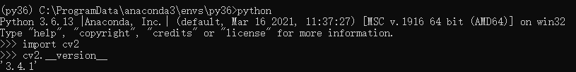


安装拓展

```bash
pip install opencv-contrib-python==3.4.1.15
```


#### 2. Notebook

安装并切换 `Python3.6` 内核

```bash
# 继续在刚刚的 Anaconda Prompt 命令行窗口中执行以下代码
pip install ipykernel
python -m ipykernel install --user --name py36 --display-name "Python 3.6 (py36)"
```

打开 Jupyter Notebook，通过 http://localhost:8888/tree 可以访问到网页版 Notebook

新建一个python测试文件，在顶部的 kernel 选项卡中可找到切换内核选项，切换至刚刚安装的 3.6 版本

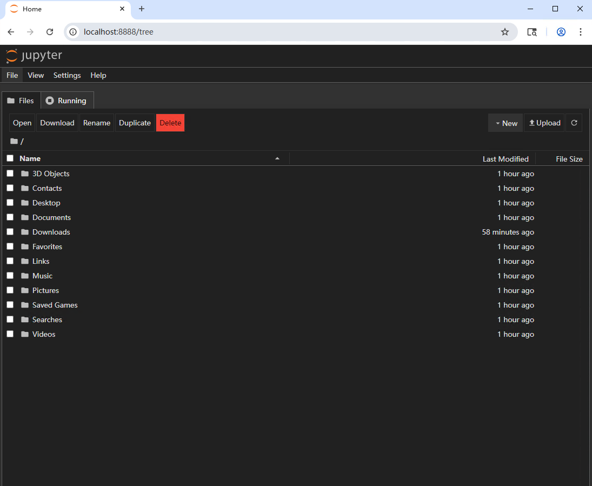


### 二、图像基本操作

#### 1. 图像的读取与显示

- cv2.IMREAD_COLOR 彩色图像
- cv2.IMGREAD_GRAYSCALE 灰度图像

```python
import cv2 # OpenCV 读取的格式是 BGR
import matplotlib.pyplot as plt
import numpy as np
%matplotlib inline

img = cv2.imread('test.jpg')

# 执行 img 回车可显示该图像的数据
array([[[189, 150, 188],
        [189, 150, 188],
        [188, 149, 187],
        ...,
        [189, 147, 188],
        [188, 146, 187],
        [189, 146, 189]],

       [[189, 150, 188],
        [188, 149, 187],
        [188, 149, 187],
        ...,
        [189, 147, 188],
        [188, 146, 187],
        [189, 146, 189]],

       [[188, 149, 187],
        [188, 149, 187],
        [188, 149, 187],
        ...,
        [189, 147, 188],
        [188, 146, 187],
        [189, 146, 189]],

       ...,

       [[189, 150, 188],
        [189, 150, 188],
        [189, 150, 188],
        ...,
        [189, 147, 188],
        [188, 146, 187],
        [189, 146, 189]],

       [[189, 150, 188],
        [189, 150, 188],
        [189, 150, 188],
        ...,
        [189, 147, 188],
        [188, 145, 188],
        [189, 146, 189]],

       [[189, 150, 188],
        [189, 150, 188],
        [189, 150, 188],
        ...,
        [189, 147, 188],
        [188, 145, 188],
        [189, 146, 189]]], dtype=uint8)
```

```python
# 图像的显示
cv2.imshow('image', img)
# 等待时间，毫秒级0表示任意键终止
cv2.waitKey(0)
cv2.destroyAllWindows()
```

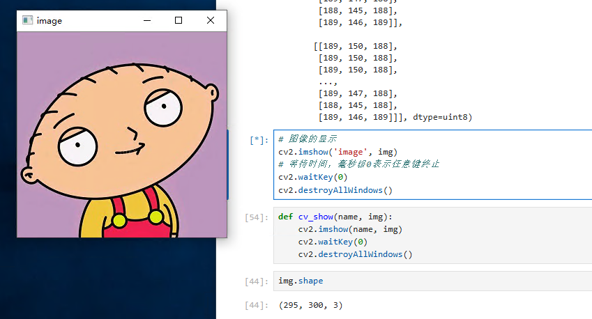

```python
def cv_show(name, img):
    cv2.imshow(name, img)
    cv2.waitKey(0)
    cv2.destroyAllWindows()
```

```python
# 执行 img.shape 可输出该图像的 shape 数据
img.shape
(295, 300, 3)
```

```python
# 读取灰度图
img = cv2.imread('test.jpg', cv2.IMREAD_GRAYSCALE)
img
array([[166, 166, 165, ..., 164, 163, 164],
       [166, 165, 165, ..., 164, 163, 164],
       [165, 165, 165, ..., 164, 163, 164],
       ...,
       [166, 166, 166, ..., 164, 163, 164],
       [166, 166, 166, ..., 164, 163, 164],
       [166, 166, 166, ..., 164, 163, 164]], dtype=uint8)
```

```python
# 图像的显示（灰度图）
cv2.imshow('image', img)
# 等待时间，毫秒级0表示任意键终止
cv2.waitKey(0)
cv2.destroyAllWindows()
```

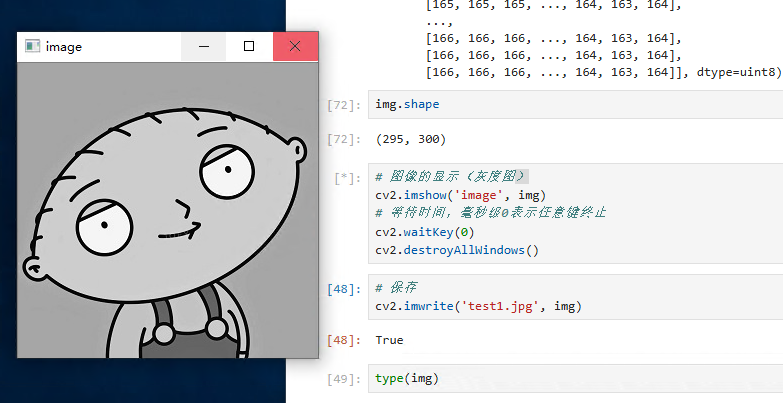

```python
# 保存
cv2.imwrite('test1.jpg', img)
```

```python
type(img)
numpy.ndarray
```


#### 2. 读取视频

- cv2.VideoCapture 可以捕获摄像头，用数字来控制不同的设备，如：0,1
- 如果是视频文件，可以直接指定路径

```python
vc = cv2.VideoCapture('jswyn.mp4')

if vc.isOpened():
    open, frame = vc.read()
else:
    open = False

while open:
    ret, frame = vc.read()
    if frame is None:
        break
    if ret == True:
        gray = cv2.cvtColor(frame, cv2.COLOR_BGR2GRAY)
        cv2.imshow('result', gray)
        if cv2.waitKey(10) & 0xFF == 27:
            break
vc.release()
cv2.destroyAllWindows()
```


#### 3. 截取部分图像数据（ROI区域）

```python
img = cv2.imread('test.jpg')
jiaozi = img[0:50, 0: 150]
cv_show('jiaozi', jiaozi)
```


#### 4. 颜色通道提取

```python
b,g,r = cv2.split(img)
r
array([[188, 188, 187, ..., 188, 187, 189],
       [188, 187, 187, ..., 188, 187, 189],
       [187, 187, 187, ..., 188, 187, 189],
       ...,
       [188, 188, 188, ..., 188, 187, 189],
       [188, 188, 188, ..., 188, 188, 189],
       [188, 188, 188, ..., 188, 188, 189]], dtype=uint8)

r.shape
(295, 300)
```

```python
# 合并
img = cv2.merge((b,g,r))
img.shape
(295, 300, 3)
```

```python
# 只保留 R 通道
cur_img = img.copy()
cur_img[:,:,0] = 0
cur_img[:,:,1] = 0
cv_show('R', cur_img)
```

```python
# 只保留 G 通道
cur_img = img.copy()
cur_img[:,:,0] = 0
cur_img[:,:,2] = 0
cv_show('G', cur_img)
```

```python
# 只保留 B 通道
cur_img = img.copy()
cur_img[:,:,1] = 0
cur_img[:,:,2] = 0
cv_show('B', cur_img)
```


#### 5. 边界填充

```python
top_size,bottom_size,left_size,right_size = (50, 50, 50, 50)
replicate = cv2.copyMakeBorder(img, top_size, bottom_size, left_size, right_size, borderType=cv2.BORDER_REPLICATE)
reflect = cv2.copyMakeBorder(img, top_size, bottom_size, left_size, right_size, borderType=cv2.BORDER_REFLECT)
reflect101 = cv2.copyMakeBorder(img, top_size, bottom_size, left_size, right_size, borderType=cv2.BORDER_REFLECT_101)
wrap = cv2.copyMakeBorder(img, top_size, bottom_size, left_size, right_size, borderType=cv2.BORDER_WRAP)
constant = cv2.copyMakeBorder(img, top_size, bottom_size, left_size, right_size, borderType=cv2.BORDER_CONSTANT, value=0)
```

```python
import matplotlib.pyplot as plt
plt.subplot(231), plt.imshow(img, 'gray'), plt.title('ORIGINAL')
# plt.subplot(231), plt.imshow(replicate, 'gray'), plt.title('REPLICATE')
# plt.subplot(231), plt.imshow(reflect, 'gray'), plt.title('REFLECT')
# plt.subplot(231), plt.imshow(reflect101, 'gray'), plt.title('REFLECT_101')
# plt.subplot(231), plt.imshow(wrap, 'gray'), plt.title('WRAP')
# plt.subplot(231), plt.imshow(constant, 'gray'), plt.title('CONSTANT')
plt.show()
```

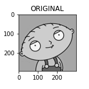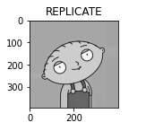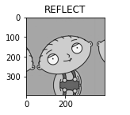

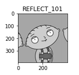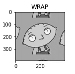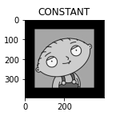

- BORDER_REPLICATE：复制法，复制最边缘像素
- BORDER_REFLECT：反射法，对感兴趣的图像中的像素在两边进行复制，如：dcba|abcde|edc
- BORDER_REFLECT_101：反射法，以最边缘像素为轴，对称复制，如：dcb|abcd|cba
- BORDER_WRAP：外包装法，如：bcde|abcde|abcd
- BORDER_CONSTANT：常量法，常量数值进行填充


#### 6. 数值计算

```python
img_jz = cv2.imread('test.jpg')

img_jz[:5,:,0]
array([[189, 189, 188, ..., 189, 188, 189],
       [189, 188, 188, ..., 189, 188, 189],
       [188, 188, 188, ..., 189, 188, 189],
       [188, 188, 188, ..., 189, 188, 189],
       [188, 188, 188, ..., 189, 188, 189]], dtype=uint8)
img_jz1 = img_jz + 10

img_jz1[:5,:,0]
array([[199, 199, 198, ..., 199, 198, 199],
       [199, 198, 198, ..., 199, 198, 199],
       [198, 198, 198, ..., 199, 198, 199],
       [198, 198, 198, ..., 199, 198, 199],
       [198, 198, 198, ..., 199, 198, 199]], dtype=uint8)
```

```python
# 相加时如果像素点的数值超过边界 255，则会将该值与256进行 % 取余操作
(img_jz + img_jz1)[:5,:,0]

array([[132, 132, 130, ..., 132, 130, 132],
       [132, 130, 130, ..., 132, 130, 132],
       [130, 130, 130, ..., 132, 130, 132],
       [130, 130, 130, ..., 132, 130, 132],
       [130, 130, 130, ..., 132, 130, 132]], dtype=uint8)
```

```python
# 通过cv2的add方法进行操作时，如果像素点的数值超过边界 255，则取255，否则取它自身
cv2.add(img_jz,img_jz1)[:5,:,0]

array([[255, 255, 255, ..., 255, 255, 255],
       [255, 255, 255, ..., 255, 255, 255],
       [255, 255, 255, ..., 255, 255, 255],
       [255, 255, 255, ..., 255, 255, 255],
       [255, 255, 255, ..., 255, 255, 255]], dtype=uint8)
```


#### 7. 图像融合

```python
# 当两张图的大小不一致时，无法进行融合，先用cv2.resize()方法调整
img_ble = cv2.imread('ble.jpg')
img_jz + img_ble

array([[[139,  68,  57],
        [140,  69,  58],
        [137,  68,  59],
        ...,
        [139,  70,  55],
        [138,  69,  53],
        [139,  69,  55]],

       [[140,  69,  58],
        [139,  68,  57],
        [137,  68,  59],
        ...,
        [139,  70,  55],
        [138,  69,  53],
        [139,  69,  55]],

       [[139,  68,  57],
        [139,  68,  57],
        [136,  67,  58],
        ...,
        [139,  70,  55],
        [138,  69,  53],
        [139,  69,  55]],

       ...,

       [[144,  68,  56],
        [137,  65,  57],
        [137,  70,  61],
        ...,
        [138,  68,  55],
        [137,  67,  54],
        [138,  68,  55]],

       [[143,  67,  55],
        [136,  64,  56],
        [135,  68,  59],
        ...,
        [138,  68,  55],
        [137,  66,  55],
        [139,  69,  56]],

       [[142,  66,  54],
        [141,  68,  60],
        [132,  65,  56],
        ...,
        [139,  69,  56],
        [138,  67,  56],
        [139,  69,  56]]], dtype=uint8)
```

```python
# 参数说明：img1,比例,img2,比例,亮度级
res = cv2.addWeighted(img_jz, 0.1, img_ble, 0.6, 0)
plt.imshow(res)
```

<matplotlib.image.AxesImage at 0x24ad14c8860>

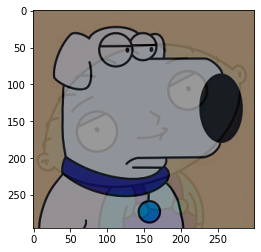

```python
# 将目标值设置为，通过x,y比例进行调整
res = cv2.resize(img, (0, 0), fx=3, fy=2.5)
plt.imshow(res)
```

<matplotlib.image.AxesImage at 0x24ad4d2f4e0>

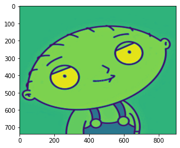


### 三、阈值与平滑处理

#### 1. 图像阈值

```python
ret, dst = cv2.threshold(src, thresh, maxval, type)
```

参数说明：

- src：输入图（只能输入单通道图像，一般为灰度图）
- dst：输出图
- thresh：阈值
- maxval：当像素值大于/小于阈值（根据type决定大于/小于），所赋予的值
- type：二值化的操作类型，包含以下5种：
  - cv2.THRESH_BINARY：超过阈值部分取maxval，否则取0
  - cv2.THRESH_BINARY_INV：THRESH_BINARY取反
  - cv2.THRESH_TRUNC：大于阈值的像素值设为阈值，其他的不变
  - cv2.THRESH_TOZERO：大于阈值的像素值不变，其他的设为0
  - cv2.THRESH_TOZERO_INV：THRESH_TOZERO取反


```python
import cv2 # OpenCV 读取的格式是 BGR
import matplotlib.pyplot as plt
import numpy as np
%matplotlib inline

img = cv2.imread('ble.jpg')
img_gray = cv2.imread('ble.jpg', cv2.IMREAD_GRAYSCALE)

ret, thresh1 = cv2.threshold(img_gray, 127, 255, cv2.THRESH_BINARY)
ret, thresh2 = cv2.threshold(img_gray, 127, 255, cv2.THRESH_BINARY_INV)
ret, thresh3 = cv2.threshold(img_gray, 127, 255, cv2.THRESH_TRUNC)
ret, thresh4 = cv2.threshold(img_gray, 127, 255, cv2.THRESH_TOZERO)
ret, thresh5 = cv2.threshold(img_gray, 127, 255, cv2.THRESH_TOZERO_INV)

titles = ['original', 'BINARY', 'BINARY_INV', 'TRUNC', 'TOZERO', 'TOZERO_INV']
images = [img, thresh1, thresh2, thresh3, thresh4, thresh5]

for i in range(6):
    plt.subplot(2, 3, i + 1), plt.imshow(images[i], 'gray')
    plt.title(titles[i])
    plt.xticks([]), plt.yticks([])
plt.show()
```

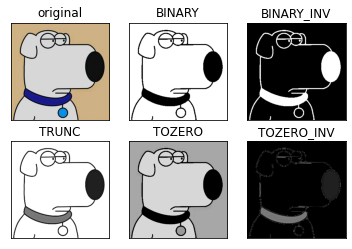


#### 2. 图像平滑


```python
img = cv2.imread('ysg.png')

# cv2.imshow('img', img)
# cv2.waitKey(0)
# cv2.destroyAllWindows()
plt.imshow(cv2.cvtColor(img, cv2.COLOR_BGR2RGB))
```

<matplotlib.image.AxesImage at 0x2a857fb4d68>


```python
# 均值滤波(平卷积操作)
blur = cv2.blur(img, (5, 5))

# cv2.imshow('blur', blur)
# cv2.waitKey(0)
# cv2.destroyAllWindows()
plt.imshow(cv2.cvtColor(blur, cv2.COLOR_BGR2RGB))
```

<matplotlib.image.AxesImage at 0x2a8592e8c50>


```python
# 方框滤波
# normalize=True 即选择归一化时和均值滤波一样
box_normalize_true = cv2.boxFilter(img, -1, (5, 5), normalize=True)

# cv2.imshow('box_normalize_true', box_normalize_true)
# cv2.waitKey(0)
# cv2.destroyAllWindows()
plt.imshow(cv2.cvtColor(box_normalize_true, cv2.COLOR_BGR2RGB))
```

<matplotlib.image.AxesImage at 0x2a8592532b0>


```python
# normalize=False 不做归一化，矩阵中的像素值相加，超过255取255
box_normalize_false = cv2.boxFilter(img, -1, (5, 5), normalize=False)

# cv2.imshow('box_normalize_false', box_normalize_false)
# cv2.waitKey(0)
# cv2.destroyAllWindows()
plt.imshow(cv2.cvtColor(box_normalize_false, cv2.COLOR_BGR2RGB))
```

<matplotlib.image.AxesImage at 0x2a8579eed30>

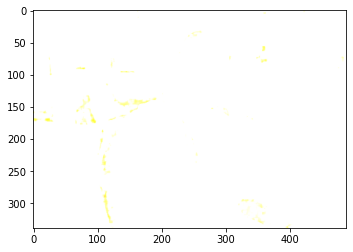


```python
# 高斯滤波
gaussian = cv2.GaussianBlur(img, (5, 5), 1)

# cv2.imshow('gaussian', gaussian)
# cv2.waitKey(0)
# cv2.destroyAllWindows()
plt.imshow(cv2.cvtColor(gaussian, cv2.COLOR_BGR2RGB))
```

<matplotlib.image.AxesImage at 0x2a857a7b828>


```python
# 中值滤波
median = cv2.medianBlur(img, 5)

# cv2.imshow('median', median)
# cv2.waitKey(0)
# cv2.destroyAllWindows()

plt.imshow(cv2.cvtColor(median, cv2.COLOR_BGR2RGB))
```

<matplotlib.image.AxesImage at 0x2a8579d0588>

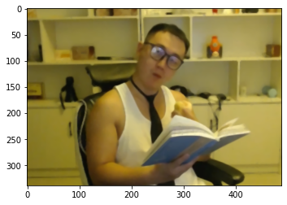


### 四、图像形态学操作

#### 1. 腐蚀操作

```python
import cv2 # OpenCV 读取的格式是 BGR
import matplotlib.pyplot as plt
import numpy as np
%matplotlib inline
```


```python
img = cv2.imread('jswyn.jpg')

# cv2.imshow('img', img)
# cv2.waitKey(0)
# cv2.destroyAllWindows()
plt.imshow(cv2.cvtColor(img, cv2.COLOR_BGR2RGB))
```

<matplotlib.image.AxesImage at 0x2917d142438>

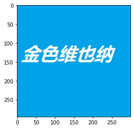

```python
kernel = np.ones((3, 3), np.uint8)
erosion = cv2.erode(img, kernel, iterations=2)

# cv2.imshow('erosion', erosion)
# cv2.waitKey(0)
# cv2.destroyAllWindows()
plt.imshow(cv2.cvtColor(erosion, cv2.COLOR_BGR2RGB))
```

<matplotlib.image.AxesImage at 0x2917e451dd8>

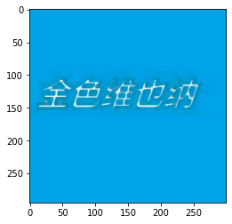

```python
yuan = cv2.imread('yuan.jpg')

# cv2.imshow('yuan', yuan)
# cv2.waitKey(0)
# cv2.destroyAllWindows()
plt.imshow(cv2.cvtColor(yuan, cv2.COLOR_BGR2RGB))
```

<matplotlib.image.AxesImage at 0x2917df154a8>

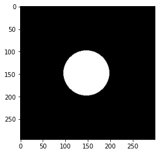

```python
kernel = np.ones((3, 3), np.uint8)

erosion_1 = cv2.erode(yuan, kernel, iterations=1)
plt.imshow(cv2.cvtColor(erosion_1, cv2.COLOR_BGR2RGB))
```

<matplotlib.image.AxesImage at 0x2917e749828>

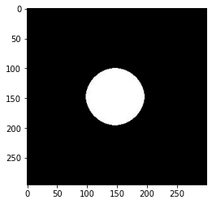

```python
erosion_2 = cv2.erode(yuan, kernel, iterations=2)
plt.imshow(cv2.cvtColor(erosion_2, cv2.COLOR_BGR2RGB))
```

<matplotlib.image.AxesImage at 0x2917e791048>


```python
erosion_3 = cv2.erode(yuan, kernel, iterations=3)
plt.imshow(cv2.cvtColor(erosion_3, cv2.COLOR_BGR2RGB))
```

<matplotlib.image.AxesImage at 0x2917e7caa58>

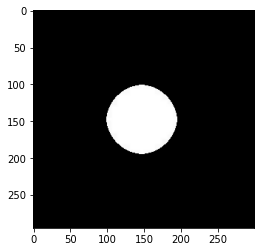


#### 2. 膨胀操作

```python
img = cv2.imread('jswyn.jpg')

# cv2.imshow('img', img)
# cv2.waitKey(0)
# cv2.destroyAllWindows()
plt.imshow(cv2.cvtColor(img, cv2.COLOR_BGR2RGB))
```

<matplotlib.image.AxesImage at 0x2917e80f358>


```python
kernel = np.ones((3, 3), np.uint8)
erosion = cv2.dilate(img, kernel, iterations=2)

# cv2.imshow('erosion', erosion)
# cv2.waitKey(0)
# cv2.destroyAllWindows()
plt.imshow(cv2.cvtColor(erosion, cv2.COLOR_BGR2RGB))
```

<matplotlib.image.AxesImage at 0x2917fd32048>

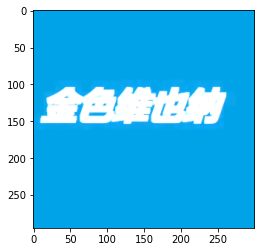

```python
yuan = cv2.imread('yuan.jpg')

# cv2.imshow('yuan', yuan)
# cv2.waitKey(0)
# cv2.destroyAllWindows()
plt.imshow(cv2.cvtColor(yuan, cv2.COLOR_BGR2RGB))
```

<matplotlib.image.AxesImage at 0x2917fd747b8>


```python
kernel = np.ones((6, 6), np.uint8)

erosion_1 = cv2.dilate(yuan, kernel, iterations=1)
plt.imshow(cv2.cvtColor(erosion_1, cv2.COLOR_BGR2RGB))
```

<matplotlib.image.AxesImage at 0x2917fdcc438>

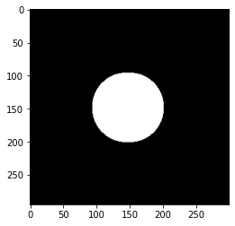

```python
erosion_2 = cv2.dilate(yuan, kernel, iterations=2)
plt.imshow(cv2.cvtColor(erosion_2, cv2.COLOR_BGR2RGB))
```

<matplotlib.image.AxesImage at 0x2917fecd6a0>

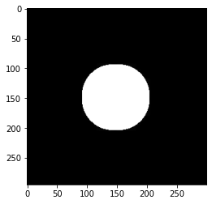

```python
erosion_3 = cv2.dilate(yuan, kernel, iterations=3)
plt.imshow(cv2.cvtColor(erosion_3, cv2.COLOR_BGR2RGB))
```

<matplotlib.image.AxesImage at 0x2917ff28320>

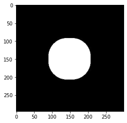


#### 3. 开运算与闭运算

```python
jswyn1 = cv2.imread('jswyn1.jpg')

# cv2.imshow('jswyn1', jswyn1)
# cv2.waitKey(0)
# cv2.destroyAllWindows()
plt.imshow(cv2.cvtColor(jswyn1, cv2.COLOR_BGR2RGB))
```

<matplotlib.image.AxesImage at 0x2917df080b8>

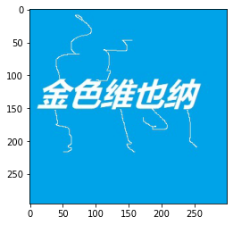

```python
# 开运算：先腐蚀，再膨胀
kernel = np.ones((5, 5), np.uint8)
open = cv2.morphologyEx(jswyn1, cv2.MORPH_OPEN, kernel)

# cv2.imshow('open', open)
# cv2.waitKey(0)
# cv2.destroyAllWindows()
plt.imshow(cv2.cvtColor(open, cv2.COLOR_BGR2RGB))
```

<matplotlib.image.AxesImage at 0x291410e8e48>

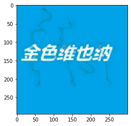

```python
# 闭运算：先膨胀，再腐蚀
kernel = np.ones((5, 5), np.uint8)
close = cv2.morphologyEx(jswyn1, cv2.MORPH_CLOSE, kernel)

# cv2.imshow('close', close)
# cv2.waitKey(0)
# cv2.destroyAllWindows()
plt.imshow(cv2.cvtColor(close, cv2.COLOR_BGR2RGB))
```

<matplotlib.image.AxesImage at 0x2914114a860>

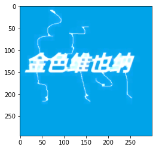


#### 4.梯度运算


```python
# 梯度运算：膨胀 - 腐蚀
img = cv2.imread('yuan.jpg')
kernel = np.ones((5, 5), np.uint8)
gradient = cv2.morphologyEx(img, cv2.MORPH_GRADIENT, kernel)

# cv2.imshow('gradient', gradient)
# cv2.waitKey(0)
# cv2.destroyAllWindows()
plt.imshow(cv2.cvtColor(gradient, cv2.COLOR_BGR2RGB))
```

<matplotlib.image.AxesImage at 0x291412e8da0>

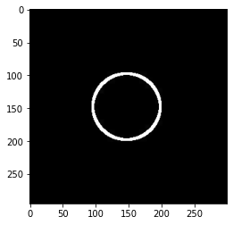


#### 5.礼帽与黑帽

- 礼帽：原始输入 - 开运算结果
- 黑帽：闭运算结果 - 原始输入


```python
# 礼帽
img = cv2.imread('jswyn1.jpg')
kernel = np.ones((3, 3), np.uint8)
top_hat = cv2.morphologyEx(img, cv2.MORPH_TOPHAT, kernel)

# cv2.imshow('top_hat', top_hat)
# cv2.waitKey(0)
# cv2.destroyAllWindows()
plt.imshow(cv2.cvtColor(top_hat, cv2.COLOR_BGR2RGB))
```

<matplotlib.image.AxesImage at 0x291415164e0>

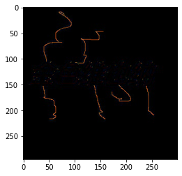

```python
# 黑帽
black_hat = cv2.morphologyEx(img, cv2.MORPH_BLACKHAT, kernel)

# cv2.imshow('black_hat', black_hat)
# cv2.waitKey(0)
# cv2.destroyAllWindows()
plt.imshow(cv2.cvtColor(black_hat, cv2.COLOR_BGR2RGB))
```

<matplotlib.image.AxesImage at 0x2914253fb00>

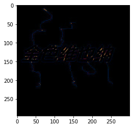


### 五、图像梯度计算

#### 1. Sobel算子

$$
G_x = \begin{bmatrix}
-1 & 0 & +1 \\
-2 & 0 & +2 \\
-1 & 0 & +1
\end{bmatrix} * A
\quad
G_y = \begin{bmatrix}
-1 & -2 & -1 \\
0 & 0 & 0 \\
+1 & +2 & +1
\end{bmatrix} * A
$$

共p1，p2，p3，p4，p5，p6，p7，p8，p9 九个像素值

Gx = p3 - p1 + 2 * p6 - 2 * p4 + p9 - p7

Gy = p9 + 2 * p8 + p7 - p3 - 2 * p2 - p1


```python
import cv2 # OpenCV 读取的格式是 BGR
import matplotlib.pyplot as plt
import numpy as np
%matplotlib inline
```


```python
img = cv2.imread('yuan.jpg', cv2.IMREAD_GRAYSCALE)

# cv2.imshow('img', img)
# cv2.waitKey(0)
# cv2.destroyAllWindows()
plt.imshow(img, cmap='gray')
plt.show()
```


    

**dst = cv2.Sobel(src, ddepth, dx, dy, ksize)**

- src：源图像
- ddepth：图像的深度
- dx：水平方向
- dy：垂直方向
- ksize：Sobel算子的大小


```python
sobel_x = cv2.Sobel(img, cv2.CV_64F, 1, 0, ksize=3)

# cv2.imshow('sobel_x', sobel_x)
# cv2.waitKey(0)
# cv2.destroyAllWindows()
# 白 --> 黑 是正数，黑 --> 白 是负数，负数会被截断为0，需要进行绝对值转换
sobel_abs_x = cv2.convertScaleAbs(sobel_x)
plt.imshow(sobel_abs_x, cmap='gray')
plt.show()
```

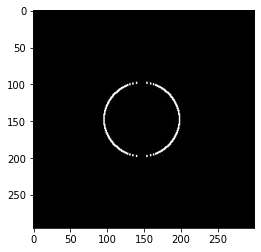

```python
sobel_y = cv2.Sobel(img, cv2.CV_64F, 0, 1, ksize=3)

# cv2.imshow('sobel_y', sobel_y)
# cv2.waitKey(0)
# cv2.destroyAllWindows()
# 白 --> 黑 是正数，黑 --> 白 是负数，负数会被截断为0，需要进行绝对值转换
sobel_abs_y = cv2.convertScaleAbs(sobel_y)
plt.imshow(sobel_abs_y, cmap='gray')
plt.show()
```


```python
# 分别计算x和y，再求和
sobel_x_y = cv2.addWeighted(sobel_display_x, 0.5, sobel_display_y, 0.5, 0)
plt.imshow(sobel_x_y, cmap='gray')
plt.show()
```


##### 例：分别计算和整体计算的效果进行对比


```python
ble = cv2.imread('ble.jpg', cv2.IMREAD_GRAYSCALE)

# cv2.imshow('ble', ble)
# cv2.waitKey(0)
# cv2.destroyAllWindows()
plt.imshow(ble, cmap='gray')
plt.show()
```


```python
# 分别计算 (建议的操作方式)
ble_sobel_x = cv2.Sobel(ble, cv2.CV_64F, 1, 0, ksize=3)
ble_sobel_y = cv2.Sobel(ble, cv2.CV_64F, 0, 1, ksize=3)

ble_sobel_abs_x = cv2.convertScaleAbs(ble_sobel_x)
ble_sobel_abs_y = cv2.convertScaleAbs(ble_sobel_y)
ble_sobel_x_y = cv2.addWeighted(ble_sobel_abs_x, 0.5, ble_sobel_abs_y, 0.5, 0)
plt.imshow(ble_sobel_x_y, cmap='gray')
plt.show()
```

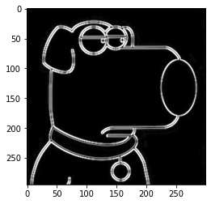

```python
# 整体计算
ble_sobel_xy = cv2.Sobel(ble, cv2.CV_64F, 1, 1, ksize=3)

ble_sobel_abs_xy = cv2.convertScaleAbs(ble_sobel_xy)
plt.imshow(ble_sobel_abs_xy, cmap='gray')
plt.show()
```

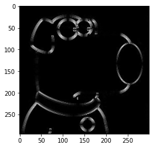


#### 2. Scharr算子

$$
G_x = \begin{bmatrix}
-3 & 0 & 3 \\
-10 & 0 & 10 \\
-3 & 0 & 3
\end{bmatrix} * A
\quad
G_y = \begin{bmatrix}
-3 & -10 & -3 \\
0 & 0 & 0 \\
-3 & -10 & -3
\end{bmatrix} * A
$$

共 p1，p2，p3，p4，p5，p6，p7，p8，p9 九个像素值

Gx = 3 * p3 - 3 * p1 + 10 * p6 - 10 * p4 + 3 * p9 - 3 * p7

Gy = -3 * p1 - 10 * p2 - 3 * p3 - 3 * p7 - 10 * p8 - 3 * p9


```python
ble_scharr_x = cv2.Scharr(ble, cv2.CV_64F, 1, 0)
ble_scharr_y = cv2.Scharr(ble, cv2.CV_64F, 0, 1)

ble_scharr_abs_x = cv2.convertScaleAbs(ble_scharr_x)
ble_scharr_abs_y = cv2.convertScaleAbs(ble_scharr_y)
ble_scharr_x_y = cv2.addWeighted(ble_scharr_abs_x, 0.5, ble_scharr_abs_y, 0.5, 0)
plt.imshow(ble_scharr_x_y, cmap='gray')
plt.show()
```

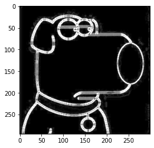


#### 3. Laplacian算子

$$
G = \begin{bmatrix}
0 & 1 & 0 \\
1 & -4 & 1 \\
0 & 1 & 0
\end{bmatrix}
$$

共 p1，p2，p3，p4，p5，p6，p7，p8，p9 九个像素值

G = p2 + p6 - 4 * p5 + p3 + p8


```python
ble_laplacian = cv2.Laplacian(ble, cv2.CV_64F)

ble_laplacian_abs = cv2.convertScaleAbs(ble_laplacian)
plt.imshow(ble_laplacian_abs, cmap='gray')
plt.show()
```


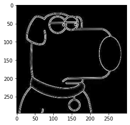


### 六、Canny 边缘检测

#### 1. 流程

(1) 使用高斯滤波器，以平滑图像，滤除噪声

(2) 计算图像中每个像素点的梯度强度和方向

(3) 应用非极大值（Nono-Maximum Suppression）抑制，以消除边缘检测带来的杂散响应

(4) 应用双阈值（Double-Threshold）检测来确定真实的和潜在的边缘

(5) 通过抑制孤立的弱边缘最终完成边缘检测


#### 2. 高斯滤波器

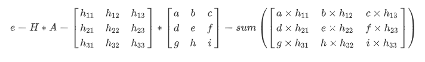


#### 3. 梯度和方向

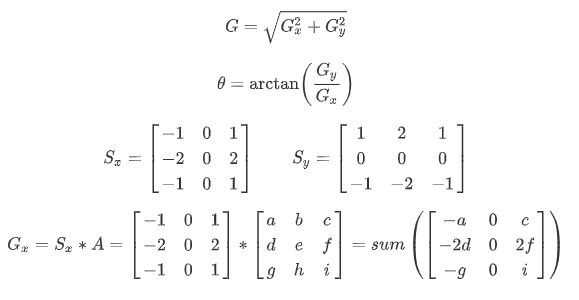


#### 4. 非极大值抑制

- 线性插值法

  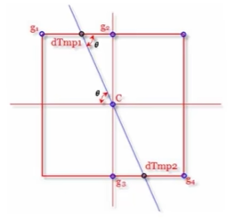

  设g1的梯度幅值M(g1)，g2的梯度幅值M(g2)，则dtmp1可以得到：

  M(dtmp1) = w*M(g2) + (1-w) * M(g1)

  其中w = distance(dtmp1, g2)/distance(g1, g2)

  distance(g1, g2) 表示两点之间的距离

- 简化

  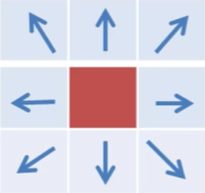

  为了简化计算，由于一个像素周围有八个像素，可以将一个像素的梯度方向离散为八个方向，如此一来计算前后即可，简化插值法

  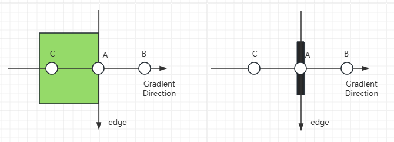


#### 5. 双阈值检测

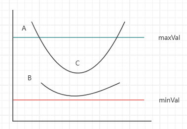

梯度值 > maxVal：则该点处理为边界

minVal < 梯度值 < maxVal：与现有的点（A点、C点）有关联（能连线），则保留，否则舍弃（B点）

梯度值 < minVal：舍弃


#### 6. 演示

```python
import cv2 # OpenCV 读取的格式是 BGR
import matplotlib.pyplot as plt
import numpy as np
%matplotlib inline

img = cv2.imread('ysg.png', cv2.IMREAD_GRAYSCALE)
plt.imshow(img, cmap='gray')
plt.show()

# 参数说明：源图，最小值，最大值
c1 = cv2.Canny(img, 60, 150)
plt.imshow(c1, cmap='gray')
plt.show()

c2 = cv2.Canny(img, 50, 95)
plt.imshow(c2, cmap='gray')
plt.show()

# 阈值范围越小细节越多
```

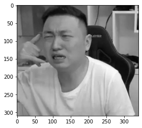

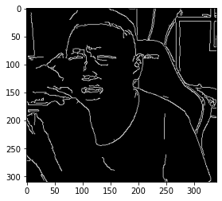

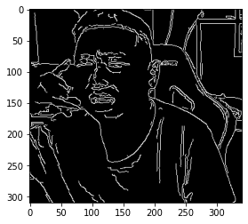


### 七、图像金字塔与轮廓检测

#### 1. 图像轮廓

**cv2.findContours(img, mode, method)**
mode（轮廓检测模式）：

- RETR_EXTERNAL：只检测最外面的轮廓
- RETR_LIST：检测所有的轮廓，并将其保存到链表中
- RETR_CCOMP：检索所有的轮廓，并将他们组织为两层，第一层为各部分的外部边界，第二层为空洞的边界
- RETR_TREE：检索所有的轮廓，并重构嵌套轮廓的整个层次

method（轮廓逼近的方法）：

- CHAIN_APPROX_NONE：以 Freeman 链码的方式输出轮廓，所有其他方法输出多边形（顶点的序列）
- CHAIN_APPROX_SIMPLE：压缩水平的、垂直的和斜的部分，即函数只保留他们的终点部分

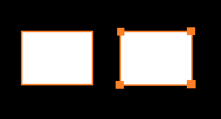

```python
import cv2 # OpenCV 读取的格式是 BGR
import matplotlib.pyplot as plt
import numpy as np
%matplotlib inline

img = cv2.imread('ysg.png')
gray = cv2.cvtColor(img, cv2.COLOR_BGR2GRAY)
# 使用二值图像提高准确率
ret, thresh = cv2.threshold(gray, 127, 255, cv2.THRESH_BINARY)
plt.imshow(thresh, cmap='gray')
plt.show()
```

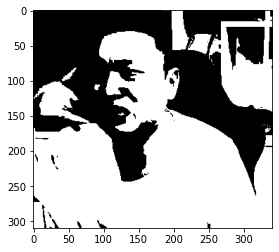

```python
binary, contours, hierarchy = cv2.findContours(thresh, cv2.RETR_TREE, cv2.CHAIN_APPROX_NONE)
```


#### 2. 模板匹配

模板匹配类似于卷积原理，模板在原图像上从原点开始滑动，计算模板与（图像被覆盖的地方）的差别程度（OpenCV中共6种计算方法），然后将每一次计算结果放入一个矩阵，作为结果输出。

6种计算方法：

- TM_SQDIFF：计算平方不同，计算结果值越小，越相关

- TM_CCORR：计算相关性，计算结果值越大，越相关

- TM_CCOEFF：计算相关系数，计算结果值越大，越相关

- TM_SQDIFF_NORMED：计算归一化平方不同，计算结果值越接近0，越相关

- TM_CCORR_NORMED：计算归一化相关性，计算结果值越接近1，越相关

- TM_CCOEFF_NORMED：计算归一化相关系数，计算结果值越接近1，越相关

  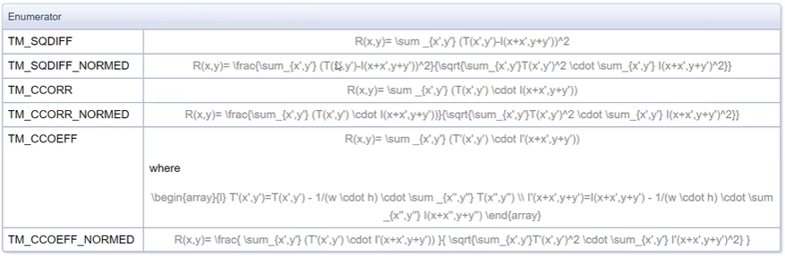

  如：原图像大小为 A x B，模板大小为 a x b，则输出结果矩阵是(A - a + 1) x (B - b + 1)


```python
img = cv2.imread('ysg.png', 0)
template = cv2.imread('ysg_template.png', 0)
h, w = template.shape[:2]
```

```python
img.shape
(310, 341)
```

```python
template.shape
(161, 144)
```

```python
res = cv2.matchTemplate(img, template, cv2.TM_SQDIFF)
res.shape
(150, 198)
```


```python
min_val, max_val, min_loc, max_loc = cv2.minMaxLoc(res)
# 最小值
min_val
0.0

# 最大值
max_val
217423616.0

# 最小值位置
min_loc
(67, 10)

# 最大值位置
max_loc

(189, 97)
```


```python
methods = ['cv2.TM_SQDIFF', 'cv2.TM_CCORR', 'cv2.TM_CCOEFF', 'cv2.TM_SQDIFF_NORMED', 'cv2.TM_CCORR_NORMED', 'cv2.TM_CCOEFF_NORMED']
for item in methods:
    img_copy = img.copy()
    
    # 匹配方法的真值
    method = eval(item)
    print(method)
    res = cv2.matchTemplate(img, template, method)
    min_val, max_val, min_loc, max_loc = cv2.minMaxLoc(res)

    # 如果平方差匹配TM_SQDIFF,或归一化平方差匹配TM_SQDIFF_NORMED，取最小值
    if method in [cv2.TM_SQDIFF, cv2.TM_SQDIFF_NORMED]:
        top_left = min_loc
    else:
        top_left = max_loc
    bottom_right = (top_left[0] + w, top_left[1] + h)
    
    cv2.rectangle(img_copy, top_left, bottom_right, 255, 2)
    plt.subplot(121), plt.imshow(res, cmap='gray')
    plt.xticks([]), plt.yticks([])
    plt.subplot(122), plt.imshow(img_copy, cmap='gray')
    plt.xticks([]), plt.yticks([])
    plt.suptitle(item)
    plt.show()
```

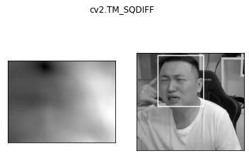

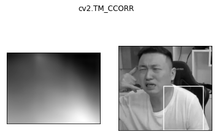

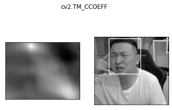


#### 3. 图像金字塔

- 高斯金字塔

  

  - 向下采样（缩小）

    

  - 向上采样（放大）

    

- 拉普拉斯金字塔

  