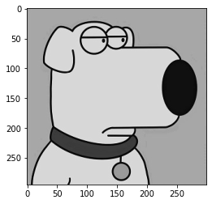
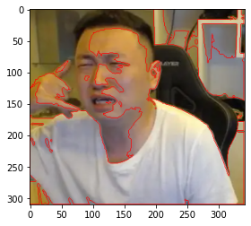
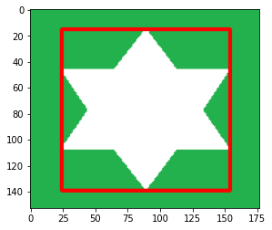
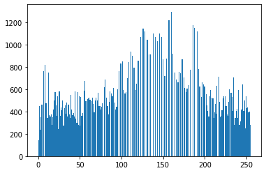

## 基于Python与OpenCV的图像解析处理

*参考 b 站人工智能算法工程师 up 主*

### 一、环境配置

#### 1. 安装

Anaconda下载地址：https://www.anaconda.com/download

安装后使用 `Python3.6` 虚拟环境及 `opencv-python 3.4.1.15` 版本

```bash
# 注：以管理员身份运行 Anaconda Prompt
conda create -p C:\ProgramData\anaconda3\envs\py36 python=3.6
conda activate C:\ProgramData\anaconda3\envs\py36
pip install opencv-python==3.4.1.15

# 验证 opncv
cd /d C:\ProgramData\anaconda3\envs\py36
python
ipmort cv2
cv2.__version__
```


安装拓展

```bash
pip install opencv-contrib-python==3.4.1.15
```


#### 2. Notebook

安装并切换 `Python3.6` 内核

```bash
# 继续在刚刚的 Anaconda Prompt 命令行窗口中执行以下代码
pip install ipykernel
python -m ipykernel install --user --name py36 --display-name "Python 3.6 (py36)"
```

打开 Jupyter Notebook，通过 http://localhost:8888/tree 可以访问到网页版 Notebook

新建一个python测试文件，在顶部的 kernel 选项卡中可找到切换内核选项，切换至刚刚安装的 3.6 版本


### 二、图像基本操作

#### 1. 图像的读取与显示

- cv2.IMREAD_COLOR 彩色图像
- cv2.IMGREAD_GRAYSCALE 灰度图像

```python
import cv2 # OpenCV 读取的格式是 BGR
import matplotlib.pyplot as plt
import numpy as np
%matplotlib inline

img = cv2.imread('test.jpg')

# 执行 img 回车可显示该图像的数据
array([[[189, 150, 188],
        [189, 150, 188],
        [188, 149, 187],
        ...,
        [189, 147, 188],
        [188, 146, 187],
        [189, 146, 189]],

       [[189, 150, 188],
        [188, 149, 187],
        [188, 149, 187],
        ...,
        [189, 147, 188],
        [188, 146, 187],
        [189, 146, 189]],

       [[188, 149, 187],
        [188, 149, 187],
        [188, 149, 187],
        ...,
        [189, 147, 188],
        [188, 146, 187],
        [189, 146, 189]],

       ...,

       [[189, 150, 188],
        [189, 150, 188],
        [189, 150, 188],
        ...,
        [189, 147, 188],
        [188, 146, 187],
        [189, 146, 189]],

       [[189, 150, 188],
        [189, 150, 188],
        [189, 150, 188],
        ...,
        [189, 147, 188],
        [188, 145, 188],
        [189, 146, 189]],

       [[189, 150, 188],
        [189, 150, 188],
        [189, 150, 188],
        ...,
        [189, 147, 188],
        [188, 145, 188],
        [189, 146, 189]]], dtype=uint8)
```

```python
# 图像的显示
cv2.imshow('image', img)
# 等待时间，毫秒级0表示任意键终止
cv2.waitKey(0)
cv2.destroyAllWindows()
```


```python
def cv_show(name, img):
    cv2.imshow(name, img)
    cv2.waitKey(0)
    cv2.destroyAllWindows()
```

```python
# 执行 img.shape 可输出该图像的 shape 数据
img.shape
(295, 300, 3)
```

```python
# 读取灰度图
img = cv2.imread('test.jpg', cv2.IMREAD_GRAYSCALE)
img
array([[166, 166, 165, ..., 164, 163, 164],
       [166, 165, 165, ..., 164, 163, 164],
       [165, 165, 165, ..., 164, 163, 164],
       ...,
       [166, 166, 166, ..., 164, 163, 164],
       [166, 166, 166, ..., 164, 163, 164],
       [166, 166, 166, ..., 164, 163, 164]], dtype=uint8)
```

```python
# 图像的显示（灰度图）
cv2.imshow('image', img)
# 等待时间，毫秒级0表示任意键终止
cv2.waitKey(0)
cv2.destroyAllWindows()
```


```python
# 保存
cv2.imwrite('test1.jpg', img)
```

```python
type(img)
numpy.ndarray
```


#### 2. 读取视频

- cv2.VideoCapture 可以捕获摄像头，用数字来控制不同的设备，如：0,1
- 如果是视频文件，可以直接指定路径

```python
vc = cv2.VideoCapture('jswyn.mp4')

if vc.isOpened():
    open, frame = vc.read()
else:
    open = False

while open:
    ret, frame = vc.read()
    if frame is None:
        break
    if ret == True:
        gray = cv2.cvtColor(frame, cv2.COLOR_BGR2GRAY)
        cv2.imshow('result', gray)
        if cv2.waitKey(10) & 0xFF == 27:
            break
vc.release()
cv2.destroyAllWindows()
```


#### 3. 截取部分图像数据（ROI区域）

```python
img = cv2.imread('test.jpg')
jiaozi = img[0:50, 0: 150]
cv_show('jiaozi', jiaozi)
```


#### 4. 颜色通道提取

```python
b,g,r = cv2.split(img)
r
array([[188, 188, 187, ..., 188, 187, 189],
       [188, 187, 187, ..., 188, 187, 189],
       [187, 187, 187, ..., 188, 187, 189],
       ...,
       [188, 188, 188, ..., 188, 187, 189],
       [188, 188, 188, ..., 188, 188, 189],
       [188, 188, 188, ..., 188, 188, 189]], dtype=uint8)

r.shape
(295, 300)
```

```python
# 合并
img = cv2.merge((b,g,r))
img.shape
(295, 300, 3)
```

```python
# 只保留 R 通道
cur_img = img.copy()
cur_img[:,:,0] = 0
cur_img[:,:,1] = 0
cv_show('R', cur_img)
```

```python
# 只保留 G 通道
cur_img = img.copy()
cur_img[:,:,0] = 0
cur_img[:,:,2] = 0
cv_show('G', cur_img)
```

```python
# 只保留 B 通道
cur_img = img.copy()
cur_img[:,:,1] = 0
cur_img[:,:,2] = 0
cv_show('B', cur_img)
```


#### 5. 边界填充

```python
top_size,bottom_size,left_size,right_size = (50, 50, 50, 50)
replicate = cv2.copyMakeBorder(img, top_size, bottom_size, left_size, right_size, borderType=cv2.BORDER_REPLICATE)
reflect = cv2.copyMakeBorder(img, top_size, bottom_size, left_size, right_size, borderType=cv2.BORDER_REFLECT)
reflect101 = cv2.copyMakeBorder(img, top_size, bottom_size, left_size, right_size, borderType=cv2.BORDER_REFLECT_101)
wrap = cv2.copyMakeBorder(img, top_size, bottom_size, left_size, right_size, borderType=cv2.BORDER_WRAP)
constant = cv2.copyMakeBorder(img, top_size, bottom_size, left_size, right_size, borderType=cv2.BORDER_CONSTANT, value=0)
```

```python
import matplotlib.pyplot as plt
plt.subplot(231), plt.imshow(img, 'gray'), plt.title('ORIGINAL')
# plt.subplot(231), plt.imshow(replicate, 'gray'), plt.title('REPLICATE')
# plt.subplot(231), plt.imshow(reflect, 'gray'), plt.title('REFLECT')
# plt.subplot(231), plt.imshow(reflect101, 'gray'), plt.title('REFLECT_101')
# plt.subplot(231), plt.imshow(wrap, 'gray'), plt.title('WRAP')
# plt.subplot(231), plt.imshow(constant, 'gray'), plt.title('CONSTANT')
plt.show()
```


- BORDER_REPLICATE：复制法，复制最边缘像素
- BORDER_REFLECT：反射法，对感兴趣的图像中的像素在两边进行复制，如：dcba|abcde|edc
- BORDER_REFLECT_101：反射法，以最边缘像素为轴，对称复制，如：dcb|abcd|cba
- BORDER_WRAP：外包装法，如：bcde|abcde|abcd
- BORDER_CONSTANT：常量法，常量数值进行填充


#### 6. 数值计算

```python
img_jz = cv2.imread('test.jpg')

img_jz[:5,:,0]
array([[189, 189, 188, ..., 189, 188, 189],
       [189, 188, 188, ..., 189, 188, 189],
       [188, 188, 188, ..., 189, 188, 189],
       [188, 188, 188, ..., 189, 188, 189],
       [188, 188, 188, ..., 189, 188, 189]], dtype=uint8)
img_jz1 = img_jz + 10

img_jz1[:5,:,0]
array([[199, 199, 198, ..., 199, 198, 199],
       [199, 198, 198, ..., 199, 198, 199],
       [198, 198, 198, ..., 199, 198, 199],
       [198, 198, 198, ..., 199, 198, 199],
       [198, 198, 198, ..., 199, 198, 199]], dtype=uint8)
```

```python
# 相加时如果像素点的数值超过边界 255，则会将该值与256进行 % 取余操作
(img_jz + img_jz1)[:5,:,0]

array([[132, 132, 130, ..., 132, 130, 132],
       [132, 130, 130, ..., 132, 130, 132],
       [130, 130, 130, ..., 132, 130, 132],
       [130, 130, 130, ..., 132, 130, 132],
       [130, 130, 130, ..., 132, 130, 132]], dtype=uint8)
```

```python
# 通过cv2的add方法进行操作时，如果像素点的数值超过边界 255，则取255，否则取它自身
cv2.add(img_jz,img_jz1)[:5,:,0]

array([[255, 255, 255, ..., 255, 255, 255],
       [255, 255, 255, ..., 255, 255, 255],
       [255, 255, 255, ..., 255, 255, 255],
       [255, 255, 255, ..., 255, 255, 255],
       [255, 255, 255, ..., 255, 255, 255]], dtype=uint8)
```


#### 7. 图像融合

```python
# 当两张图的大小不一致时，无法进行融合，先用cv2.resize()方法调整
img_ble = cv2.imread('ble.jpg')
img_jz + img_ble

array([[[139,  68,  57],
        [140,  69,  58],
        [137,  68,  59],
        ...,
        [139,  70,  55],
        [138,  69,  53],
        [139,  69,  55]],

       [[140,  69,  58],
        [139,  68,  57],
        [137,  68,  59],
        ...,
        [139,  70,  55],
        [138,  69,  53],
        [139,  69,  55]],

       [[139,  68,  57],
        [139,  68,  57],
        [136,  67,  58],
        ...,
        [139,  70,  55],
        [138,  69,  53],
        [139,  69,  55]],

       ...,

       [[144,  68,  56],
        [137,  65,  57],
        [137,  70,  61],
        ...,
        [138,  68,  55],
        [137,  67,  54],
        [138,  68,  55]],

       [[143,  67,  55],
        [136,  64,  56],
        [135,  68,  59],
        ...,
        [138,  68,  55],
        [137,  66,  55],
        [139,  69,  56]],

       [[142,  66,  54],
        [141,  68,  60],
        [132,  65,  56],
        ...,
        [139,  69,  56],
        [138,  67,  56],
        [139,  69,  56]]], dtype=uint8)
```

```python
# 参数说明：img1,比例,img2,比例,亮度级
res = cv2.addWeighted(img_jz, 0.1, img_ble, 0.6, 0)
plt.imshow(res)
```

<matplotlib.image.AxesImage at 0x24ad14c8860>


```python
# 将目标值设置为，通过x,y比例进行调整
res = cv2.resize(img, (0, 0), fx=3, fy=2.5)
plt.imshow(res)
```

<matplotlib.image.AxesImage at 0x24ad4d2f4e0>


### 三、阈值与平滑处理

#### 1. 图像阈值

```python
ret, dst = cv2.threshold(src, thresh, maxval, type)
```

参数说明：

- src：输入图（只能输入单通道图像，一般为灰度图）
- dst：输出图
- thresh：阈值
- maxval：当像素值大于/小于阈值（根据type决定大于/小于），所赋予的值
- type：二值化的操作类型，包含以下5种：
  - cv2.THRESH_BINARY：超过阈值部分取maxval，否则取0
  - cv2.THRESH_BINARY_INV：THRESH_BINARY取反
  - cv2.THRESH_TRUNC：大于阈值的像素值设为阈值，其他的不变
  - cv2.THRESH_TOZERO：大于阈值的像素值不变，其他的设为0
  - cv2.THRESH_TOZERO_INV：THRESH_TOZERO取反


```python
import cv2 # OpenCV 读取的格式是 BGR
import matplotlib.pyplot as plt
import numpy as np
%matplotlib inline

img = cv2.imread('ble.jpg')
img_gray = cv2.imread('ble.jpg', cv2.IMREAD_GRAYSCALE)

ret, thresh1 = cv2.threshold(img_gray, 127, 255, cv2.THRESH_BINARY)
ret, thresh2 = cv2.threshold(img_gray, 127, 255, cv2.THRESH_BINARY_INV)
ret, thresh3 = cv2.threshold(img_gray, 127, 255, cv2.THRESH_TRUNC)
ret, thresh4 = cv2.threshold(img_gray, 127, 255, cv2.THRESH_TOZERO)
ret, thresh5 = cv2.threshold(img_gray, 127, 255, cv2.THRESH_TOZERO_INV)

titles = ['original', 'BINARY', 'BINARY_INV', 'TRUNC', 'TOZERO', 'TOZERO_INV']
images = [img, thresh1, thresh2, thresh3, thresh4, thresh5]

for i in range(6):
    plt.subplot(2, 3, i + 1), plt.imshow(images[i], 'gray')
    plt.title(titles[i])
    plt.xticks([]), plt.yticks([])
plt.show()
```


#### 2. 图像平滑


```python
img = cv2.imread('ysg.png')

# cv2.imshow('img', img)
# cv2.waitKey(0)
# cv2.destroyAllWindows()
plt.imshow(cv2.cvtColor(img, cv2.COLOR_BGR2RGB))
```

<matplotlib.image.AxesImage at 0x2a857fb4d68>


```python
# 均值滤波(平卷积操作)
blur = cv2.blur(img, (5, 5))

# cv2.imshow('blur', blur)
# cv2.waitKey(0)
# cv2.destroyAllWindows()
plt.imshow(cv2.cvtColor(blur, cv2.COLOR_BGR2RGB))
```

<matplotlib.image.AxesImage at 0x2a8592e8c50>


```python
# 方框滤波
# normalize=True 即选择归一化时和均值滤波一样
box_normalize_true = cv2.boxFilter(img, -1, (5, 5), normalize=True)

# cv2.imshow('box_normalize_true', box_normalize_true)
# cv2.waitKey(0)
# cv2.destroyAllWindows()
plt.imshow(cv2.cvtColor(box_normalize_true, cv2.COLOR_BGR2RGB))
```

<matplotlib.image.AxesImage at 0x2a8592532b0>


```python
# normalize=False 不做归一化，矩阵中的像素值相加，超过255取255
box_normalize_false = cv2.boxFilter(img, -1, (5, 5), normalize=False)

# cv2.imshow('box_normalize_false', box_normalize_false)
# cv2.waitKey(0)
# cv2.destroyAllWindows()
plt.imshow(cv2.cvtColor(box_normalize_false, cv2.COLOR_BGR2RGB))
```

<matplotlib.image.AxesImage at 0x2a8579eed30>


```python
# 高斯滤波
gaussian = cv2.GaussianBlur(img, (5, 5), 1)

# cv2.imshow('gaussian', gaussian)
# cv2.waitKey(0)
# cv2.destroyAllWindows()
plt.imshow(cv2.cvtColor(gaussian, cv2.COLOR_BGR2RGB))
```

<matplotlib.image.AxesImage at 0x2a857a7b828>


```python
# 中值滤波
median = cv2.medianBlur(img, 5)

# cv2.imshow('median', median)
# cv2.waitKey(0)
# cv2.destroyAllWindows()

plt.imshow(cv2.cvtColor(median, cv2.COLOR_BGR2RGB))
```

<matplotlib.image.AxesImage at 0x2a8579d0588>


### 四、图像形态学操作

#### 1. 腐蚀操作

```python
import cv2 # OpenCV 读取的格式是 BGR
import matplotlib.pyplot as plt
import numpy as np
%matplotlib inline
```


```python
img = cv2.imread('jswyn.jpg')

# cv2.imshow('img', img)
# cv2.waitKey(0)
# cv2.destroyAllWindows()
plt.imshow(cv2.cvtColor(img, cv2.COLOR_BGR2RGB))
```

<matplotlib.image.AxesImage at 0x2917d142438>


```python
kernel = np.ones((3, 3), np.uint8)
erosion = cv2.erode(img, kernel, iterations=2)

# cv2.imshow('erosion', erosion)
# cv2.waitKey(0)
# cv2.destroyAllWindows()
plt.imshow(cv2.cvtColor(erosion, cv2.COLOR_BGR2RGB))
```

<matplotlib.image.AxesImage at 0x2917e451dd8>


```python
yuan = cv2.imread('yuan.jpg')

# cv2.imshow('yuan', yuan)
# cv2.waitKey(0)
# cv2.destroyAllWindows()
plt.imshow(cv2.cvtColor(yuan, cv2.COLOR_BGR2RGB))
```

<matplotlib.image.AxesImage at 0x2917df154a8>


```python
kernel = np.ones((3, 3), np.uint8)

erosion_1 = cv2.erode(yuan, kernel, iterations=1)
plt.imshow(cv2.cvtColor(erosion_1, cv2.COLOR_BGR2RGB))
```

<matplotlib.image.AxesImage at 0x2917e749828>


```python
erosion_2 = cv2.erode(yuan, kernel, iterations=2)
plt.imshow(cv2.cvtColor(erosion_2, cv2.COLOR_BGR2RGB))
```

<matplotlib.image.AxesImage at 0x2917e791048>


```python
erosion_3 = cv2.erode(yuan, kernel, iterations=3)
plt.imshow(cv2.cvtColor(erosion_3, cv2.COLOR_BGR2RGB))
```

<matplotlib.image.AxesImage at 0x2917e7caa58>


#### 2. 膨胀操作

```python
img = cv2.imread('jswyn.jpg')

# cv2.imshow('img', img)
# cv2.waitKey(0)
# cv2.destroyAllWindows()
plt.imshow(cv2.cvtColor(img, cv2.COLOR_BGR2RGB))
```

<matplotlib.image.AxesImage at 0x2917e80f358>


```python
kernel = np.ones((3, 3), np.uint8)
erosion = cv2.dilate(img, kernel, iterations=2)

# cv2.imshow('erosion', erosion)
# cv2.waitKey(0)
# cv2.destroyAllWindows()
plt.imshow(cv2.cvtColor(erosion, cv2.COLOR_BGR2RGB))
```

<matplotlib.image.AxesImage at 0x2917fd32048>


```python
yuan = cv2.imread('yuan.jpg')

# cv2.imshow('yuan', yuan)
# cv2.waitKey(0)
# cv2.destroyAllWindows()
plt.imshow(cv2.cvtColor(yuan, cv2.COLOR_BGR2RGB))
```

<matplotlib.image.AxesImage at 0x2917fd747b8>


```python
kernel = np.ones((6, 6), np.uint8)

erosion_1 = cv2.dilate(yuan, kernel, iterations=1)
plt.imshow(cv2.cvtColor(erosion_1, cv2.COLOR_BGR2RGB))
```

<matplotlib.image.AxesImage at 0x2917fdcc438>


```python
erosion_2 = cv2.dilate(yuan, kernel, iterations=2)
plt.imshow(cv2.cvtColor(erosion_2, cv2.COLOR_BGR2RGB))
```

<matplotlib.image.AxesImage at 0x2917fecd6a0>


```python
erosion_3 = cv2.dilate(yuan, kernel, iterations=3)
plt.imshow(cv2.cvtColor(erosion_3, cv2.COLOR_BGR2RGB))
```

<matplotlib.image.AxesImage at 0x2917ff28320>


#### 3. 开运算与闭运算

```python
jswyn1 = cv2.imread('jswyn1.jpg')

# cv2.imshow('jswyn1', jswyn1)
# cv2.waitKey(0)
# cv2.destroyAllWindows()
plt.imshow(cv2.cvtColor(jswyn1, cv2.COLOR_BGR2RGB))
```

<matplotlib.image.AxesImage at 0x2917df080b8>


```python
# 开运算：先腐蚀，再膨胀
kernel = np.ones((5, 5), np.uint8)
open = cv2.morphologyEx(jswyn1, cv2.MORPH_OPEN, kernel)

# cv2.imshow('open', open)
# cv2.waitKey(0)
# cv2.destroyAllWindows()
plt.imshow(cv2.cvtColor(open, cv2.COLOR_BGR2RGB))
```

<matplotlib.image.AxesImage at 0x291410e8e48>


```python
# 闭运算：先膨胀，再腐蚀
kernel = np.ones((5, 5), np.uint8)
close = cv2.morphologyEx(jswyn1, cv2.MORPH_CLOSE, kernel)

# cv2.imshow('close', close)
# cv2.waitKey(0)
# cv2.destroyAllWindows()
plt.imshow(cv2.cvtColor(close, cv2.COLOR_BGR2RGB))
```

<matplotlib.image.AxesImage at 0x2914114a860>


#### 4.梯度运算


```python
# 梯度运算：膨胀 - 腐蚀
img = cv2.imread('yuan.jpg')
kernel = np.ones((5, 5), np.uint8)
gradient = cv2.morphologyEx(img, cv2.MORPH_GRADIENT, kernel)

# cv2.imshow('gradient', gradient)
# cv2.waitKey(0)
# cv2.destroyAllWindows()
plt.imshow(cv2.cvtColor(gradient, cv2.COLOR_BGR2RGB))
```

<matplotlib.image.AxesImage at 0x291412e8da0>


#### 5.礼帽与黑帽

- 礼帽：原始输入 - 开运算结果
- 黑帽：闭运算结果 - 原始输入


```python
# 礼帽
img = cv2.imread('jswyn1.jpg')
kernel = np.ones((3, 3), np.uint8)
top_hat = cv2.morphologyEx(img, cv2.MORPH_TOPHAT, kernel)

# cv2.imshow('top_hat', top_hat)
# cv2.waitKey(0)
# cv2.destroyAllWindows()
plt.imshow(cv2.cvtColor(top_hat, cv2.COLOR_BGR2RGB))
```

<matplotlib.image.AxesImage at 0x291415164e0>


```python
# 黑帽
black_hat = cv2.morphologyEx(img, cv2.MORPH_BLACKHAT, kernel)

# cv2.imshow('black_hat', black_hat)
# cv2.waitKey(0)
# cv2.destroyAllWindows()
plt.imshow(cv2.cvtColor(black_hat, cv2.COLOR_BGR2RGB))
```

<matplotlib.image.AxesImage at 0x2914253fb00>


### 五、图像梯度计算

#### 1. Sobel算子

$$
G_x = \begin{bmatrix}
-1 & 0 & +1 \\
-2 & 0 & +2 \\
-1 & 0 & +1
\end{bmatrix} * A
\quad
G_y = \begin{bmatrix}
-1 & -2 & -1 \\
0 & 0 & 0 \\
+1 & +2 & +1
\end{bmatrix} * A
$$

共p1，p2，p3，p4，p5，p6，p7，p8，p9 九个像素值

Gx = p3 - p1 + 2 * p6 - 2 * p4 + p9 - p7

Gy = p9 + 2 * p8 + p7 - p3 - 2 * p2 - p1


```python
import cv2 # OpenCV 读取的格式是 BGR
import matplotlib.pyplot as plt
import numpy as np
%matplotlib inline
```


```python
img = cv2.imread('yuan.jpg', cv2.IMREAD_GRAYSCALE)

# cv2.imshow('img', img)
# cv2.waitKey(0)
# cv2.destroyAllWindows()
plt.imshow(img, cmap='gray')
plt.show()
```


    

**dst = cv2.Sobel(src, ddepth, dx, dy, ksize)**

- src：源图像
- ddepth：图像的深度
- dx：水平方向
- dy：垂直方向
- ksize：Sobel算子的大小


```python
sobel_x = cv2.Sobel(img, cv2.CV_64F, 1, 0, ksize=3)

# cv2.imshow('sobel_x', sobel_x)
# cv2.waitKey(0)
# cv2.destroyAllWindows()
# 白 --> 黑 是正数，黑 --> 白 是负数，负数会被截断为0，需要进行绝对值转换
sobel_abs_x = cv2.convertScaleAbs(sobel_x)
plt.imshow(sobel_abs_x, cmap='gray')
plt.show()
```


```python
sobel_y = cv2.Sobel(img, cv2.CV_64F, 0, 1, ksize=3)

# cv2.imshow('sobel_y', sobel_y)
# cv2.waitKey(0)
# cv2.destroyAllWindows()
# 白 --> 黑 是正数，黑 --> 白 是负数，负数会被截断为0，需要进行绝对值转换
sobel_abs_y = cv2.convertScaleAbs(sobel_y)
plt.imshow(sobel_abs_y, cmap='gray')
plt.show()
```


```python
# 分别计算x和y，再求和
sobel_x_y = cv2.addWeighted(sobel_display_x, 0.5, sobel_display_y, 0.5, 0)
plt.imshow(sobel_x_y, cmap='gray')
plt.show()
```


##### 例：分别计算和整体计算的效果进行对比


```python
ble = cv2.imread('ble.jpg', cv2.IMREAD_GRAYSCALE)

# cv2.imshow('ble', ble)
# cv2.waitKey(0)
# cv2.destroyAllWindows()
plt.imshow(ble, cmap='gray')
plt.show()
```




```python
# 分别计算 (建议的操作方式)
ble_sobel_x = cv2.Sobel(ble, cv2.CV_64F, 1, 0, ksize=3)
ble_sobel_y = cv2.Sobel(ble, cv2.CV_64F, 0, 1, ksize=3)

ble_sobel_abs_x = cv2.convertScaleAbs(ble_sobel_x)
ble_sobel_abs_y = cv2.convertScaleAbs(ble_sobel_y)
ble_sobel_x_y = cv2.addWeighted(ble_sobel_abs_x, 0.5, ble_sobel_abs_y, 0.5, 0)
plt.imshow(ble_sobel_x_y, cmap='gray')
plt.show()
```


```python
# 整体计算
ble_sobel_xy = cv2.Sobel(ble, cv2.CV_64F, 1, 1, ksize=3)

ble_sobel_abs_xy = cv2.convertScaleAbs(ble_sobel_xy)
plt.imshow(ble_sobel_abs_xy, cmap='gray')
plt.show()
```


#### 2. Scharr算子

$$
G_x = \begin{bmatrix}
-3 & 0 & 3 \\
-10 & 0 & 10 \\
-3 & 0 & 3
\end{bmatrix} * A
\quad
G_y = \begin{bmatrix}
-3 & -10 & -3 \\
0 & 0 & 0 \\
-3 & -10 & -3
\end{bmatrix} * A
$$

共 p1，p2，p3，p4，p5，p6，p7，p8，p9 九个像素值

Gx = 3 * p3 - 3 * p1 + 10 * p6 - 10 * p4 + 3 * p9 - 3 * p7

Gy = -3 * p1 - 10 * p2 - 3 * p3 - 3 * p7 - 10 * p8 - 3 * p9


```python
ble_scharr_x = cv2.Scharr(ble, cv2.CV_64F, 1, 0)
ble_scharr_y = cv2.Scharr(ble, cv2.CV_64F, 0, 1)

ble_scharr_abs_x = cv2.convertScaleAbs(ble_scharr_x)
ble_scharr_abs_y = cv2.convertScaleAbs(ble_scharr_y)
ble_scharr_x_y = cv2.addWeighted(ble_scharr_abs_x, 0.5, ble_scharr_abs_y, 0.5, 0)
plt.imshow(ble_scharr_x_y, cmap='gray')
plt.show()
```


#### 3. Laplacian算子

$$
G = \begin{bmatrix}
0 & 1 & 0 \\
1 & -4 & 1 \\
0 & 1 & 0
\end{bmatrix}
$$

共 p1，p2，p3，p4，p5，p6，p7，p8，p9 九个像素值

G = p2 + p6 - 4 * p5 + p3 + p8


```python
ble_laplacian = cv2.Laplacian(ble, cv2.CV_64F)

ble_laplacian_abs = cv2.convertScaleAbs(ble_laplacian)
plt.imshow(ble_laplacian_abs, cmap='gray')
plt.show()
```


### 六、Canny 边缘检测

#### 1. 流程

(1) 使用高斯滤波器，以平滑图像，滤除噪声

(2) 计算图像中每个像素点的梯度强度和方向

(3) 应用非极大值（Nono-Maximum Suppression）抑制，以消除边缘检测带来的杂散响应

(4) 应用双阈值（Double-Threshold）检测来确定真实的和潜在的边缘

(5) 通过抑制孤立的弱边缘最终完成边缘检测


#### 2. 高斯滤波器


#### 3. 梯度和方向


#### 4. 非极大值抑制

- 线性插值法

  

  设g1的梯度幅值M(g1)，g2的梯度幅值M(g2)，则dtmp1可以得到：

  M(dtmp1) = w*M(g2) + (1-w) * M(g1)

  其中w = distance(dtmp1, g2)/distance(g1, g2)

  distance(g1, g2) 表示两点之间的距离

- 简化

  

  为了简化计算，由于一个像素周围有八个像素，可以将一个像素的梯度方向离散为八个方向，如此一来计算前后即可，简化插值法

  


#### 5. 双阈值检测


梯度值 > maxVal：则该点处理为边界

minVal < 梯度值 < maxVal：与现有的点（A点、C点）有关联（能连线），则保留，否则舍弃（B点）

梯度值 < minVal：舍弃


#### 6. 演示

```python
import cv2 # OpenCV 读取的格式是 BGR
import matplotlib.pyplot as plt
import numpy as np
%matplotlib inline

img = cv2.imread('ysg.png', cv2.IMREAD_GRAYSCALE)
plt.imshow(img, cmap='gray')
plt.show()

# 参数说明：源图，最小值，最大值
c1 = cv2.Canny(img, 60, 150)
plt.imshow(c1, cmap='gray')
plt.show()

c2 = cv2.Canny(img, 50, 95)
plt.imshow(c2, cmap='gray')
plt.show()

# 阈值范围越小细节越多
```


### 七、图像金字塔与轮廓检测

#### 1. 图像轮廓

##### （1）概念

**cv2.findContours(img, mode, method)**

mode（轮廓检测模式）：

- RETR_EXTERNAL：只检测最外面的轮廓
- RETR_LIST：检测所有的轮廓，并将其保存到链表中
- RETR_CCOMP：检索所有的轮廓，并将他们组织为两层，第一层为各部分的外部边界，第二层为空洞的边界
- RETR_TREE：检索所有的轮廓，并重构嵌套轮廓的整个层次

method（轮廓逼近的方法）：

- CHAIN_APPROX_NONE：以 Freeman 链码的方式输出轮廓，所有其他方法输出多边形（顶点的序列）
- CHAIN_APPROX_SIMPLE：压缩水平的、垂直的和斜的部分，即函数只保留他们的终点部分


```python
import cv2 # OpenCV 读取的格式是 BGR
import matplotlib.pyplot as plt
import numpy as np
%matplotlib inline

img = cv2.imread('ysg.png')
gray = cv2.cvtColor(img, cv2.COLOR_BGR2GRAY)
# 使用二值图像提高准确率
ret, thresh = cv2.threshold(gray, 127, 255, cv2.THRESH_BINARY)
plt.imshow(thresh, cmap='gray')
plt.show()
```


```python
binary, contours, hierarchy = cv2.findContours(thresh, cv2.RETR_TREE, cv2.CHAIN_APPROX_NONE)
```


##### （2）轮廓绘制

```python
img_cp = img.copy()
# 参数：需绘制的图像，轮廓（-1为绘制所有轮廓），颜色模式，线条厚度
res = cv2.drawContours(img_cp, contours, -1, (0, 0, 255), 1)
plt.imshow(cv2.cvtColor(res, cv2.COLOR_BGR2RGB))
plt.show()
```




##### （3）轮廓特征

```python
cnt = contours[0]

# 面积
cv2.contourArea(cnt)
136.0
```

```python
# 周长，True表示闭合
cv2.arcLength(cnt, True)
49.65685415267944
```


#### 2. 模板匹配

##### （1）概念

模板匹配类似于卷积原理，模板在原图像上从原点开始滑动，计算模板与（图像被覆盖的地方）的差别程度（OpenCV中共6种计算方法），然后将每一次计算结果放入一个矩阵，作为结果输出。

6种计算方法：

- TM_SQDIFF：计算平方不同，计算结果值越小，越相关

- TM_CCORR：计算相关性，计算结果值越大，越相关

- TM_CCOEFF：计算相关系数，计算结果值越大，越相关

- TM_SQDIFF_NORMED：计算归一化平方不同，计算结果值越接近0，越相关

- TM_CCORR_NORMED：计算归一化相关性，计算结果值越接近1，越相关

- TM_CCOEFF_NORMED：计算归一化相关系数，计算结果值越接近1，越相关

  

  如：原图像大小为 A x B，模板大小为 a x b，则输出结果矩阵是(A - a + 1) x (B - b + 1)


```python
img = cv2.imread('ysg.png', 0)
template = cv2.imread('ysg_template.png', 0)
h, w = template.shape[:2]
```

```python
img.shape
(310, 341)
```

```python
template.shape
(161, 144)
```

```python
res = cv2.matchTemplate(img, template, cv2.TM_SQDIFF)
res.shape
(150, 198)
```

```python
min_val, max_val, min_loc, max_loc = cv2.minMaxLoc(res)
# 最小值
min_val
0.0

# 最大值
max_val
217423616.0

# 最小值位置
min_loc
(67, 10)

# 最大值位置
max_loc
(189, 97)
```


##### （2）示例

```python
methods = ['cv2.TM_SQDIFF', 'cv2.TM_CCORR', 'cv2.TM_CCOEFF', 'cv2.TM_SQDIFF_NORMED', 'cv2.TM_CCORR_NORMED', 'cv2.TM_CCOEFF_NORMED']
for item in methods:
    img_copy = img.copy()
    
    # 匹配方法的真值
    method = eval(item)
    print(method)
    res = cv2.matchTemplate(img, template, method)
    min_val, max_val, min_loc, max_loc = cv2.minMaxLoc(res)

    # 如果平方差匹配TM_SQDIFF，或归一化平方差匹配TM_SQDIFF_NORMED，取最小值
    if method in [cv2.TM_SQDIFF, cv2.TM_SQDIFF_NORMED]:
        top_left = min_loc
    else:
        top_left = max_loc
    bottom_right = (top_left[0] + w, top_left[1] + h)
    
    cv2.rectangle(img_copy, top_left, bottom_right, 255, 2)
    plt.subplot(121), plt.imshow(res, cmap='gray')
    plt.xticks([]), plt.yticks([])
    plt.subplot(122), plt.imshow(img_copy, cmap='gray')
    plt.xticks([]), plt.yticks([])
    plt.suptitle(item)
    plt.show()
```


```python
# 匹配多个对象
match = cv2.imread('ysg_match.png')
match_gray = cv2.cvtColor(match, cv2.COLOR_BGR2GRAY)
template = cv2.imread('ysg_template.png', 0)
h, w = template.shape[:2]

res = cv2.matchTemplate(match_gray, template, cv2.TM_CCOEFF_NORMED)
threshold = 0.8
loc = np.where(res >= threshold)
# 筛选匹配程度大于等于80%的
for pt in zip(*loc[::-1]):
    bottom_right = (pt[0] + w, pt[1] + h)
    cv2.rectangle(match, pt, bottom_right, (0, 0, 255), 1)

plt.imshow(cv2.cvtColor(match, cv2.COLOR_BGR2RGB))
plt.show()
```


#### 3. 图像金字塔

- 高斯金字塔

  

  - 向下采样（缩小）

    

    ```python
    # 向下采样
    img_down = cv2.pyrDown(img)
    plt.imshow(cv2.cvtColor(img_down, cv2.COLOR_BGR2RGB))
    plt.show()
    ```

    

    ```python
    img.shape
    (310, 341, 3)
    
    img_down.shape
    (155, 171, 3)
    ```

    

  - 向上采样（放大）

    

    ```python
    # 向上采样
    img = cv2.imread('ysg.png')
    img_up = cv2.pyrUp(img)
    plt.imshow(cv2.cvtColor(img_up, cv2.COLOR_BGR2RGB))
    plt.show()
    ```

    

    ```python
    img.shape
    (310, 341, 3)
    
    img_up.shape
    (620, 682, 3)
    ```

    

- 拉普拉斯金字塔

  

  

  ```python
  img = cv2.imread('ysg.png')
  down = cv2.pyrDown(img)
  down_up = cv2.pyrUp(down)
  
  if img.shape != down_up.shape:
      img = cv2.resize(img, (down_up.shape[1], down_up.shape[0]))
  res = img - down_up
  plt.imshow(cv2.cvtColor(res, cv2.COLOR_BGR2RGB))
  plt.show()
  ```

  


#### 4. 轮廓近似

```python
outline = cv2.imread('outline.png')

gray = cv2.cvtColor(outline, cv2.COLOR_BGR2GRAY)
ret, thresh = cv2.threshold(gray, 127, 255, cv2.THRESH_BINARY)
binary, contours, hierarchy = cv2.findContours(thresh, cv2.RETR_TREE, cv2.CHAIN_APPROX_NONE)
cnt = contours[0]

outline_cp = outline.copy()
res = cv2.drawContours(outline_cp, [cnt], -1, (0, 0, 255), 2)
plt.imshow(cv2.cvtColor(res, cv2.COLOR_BGR2RGB))
plt.show()
```


```python
# 值越小，越接近原始轮廓
epsilon = 0.1 * cv2.arcLength(cnt, True)
approx = cv2.approxPolyDP(cnt, epsilon, True)

outline_cp1 = outline.copy()
res = cv2.drawContours(outline_cp1, [approx], -1, (0, 0, 255), 2)
plt.imshow(cv2.cvtColor(res, cv2.COLOR_BGR2RGB))
plt.show()
```


#### 5. 边界矩形

```python
outline = cv2.imread('outline.png')

gray = cv2.cvtColor(outline, cv2.COLOR_BGR2GRAY)
ret, thresh = cv2.threshold(gray, 127, 255, cv2.THRESH_BINARY)
binary, contours, hierarchy = cv2.findContours(thresh, cv2.RETR_TREE, cv2.CHAIN_APPROX_NONE)
cnt = contours[0]

x, y, w, h = cv2.boundingRect(cnt)
res = cv2.rectangle(outline, (x, y), (x + w, y + h), (0, 0, 255), 2)
plt.imshow(cv2.cvtColor(res, cv2.COLOR_BGR2RGB))
plt.show()
```



```python
# 轮廓面积与边界矩形比
area = cv2.contourArea(cnt)
x, y, w, h = cv2.boundingRect(cnt)
rect_area = w * h
extent = float(area) / rect_area
print(extent)

0.5060173697270471
```


#### 6. 外接圆

```python
(x, y), radius = cv2.minEnclosingCircle(cnt)
center = (int(x), int(y))
radius = int(radius)
res = cv2.circle(res, center, radius, (0, 0, 255), 2)
plt.imshow(cv2.cvtColor(res, cv2.COLOR_BGR2RGB))
plt.show()
```


### 八、直方图与傅里叶变换

#### 1. 直方图

统计每个像素点有多少个


**cv2.calcHist(images, channels, mask, histSize, ranges)**

- images：原图，格式为uint8或float32，传入函数时须带中括号 [img]
- channels：统幅图像的直方图，入度图为灰度图时值为：[0]，彩色图像时值为[0][1][2]
- mask：掩模图像，统整幅图像的直方图时值为None，统一部分时使用自定义的掩模图像
- histSize：BIN的数目，如：[0-10] [11-20] 等等
- ranges：像素值范围，如：[0, 256]

```python
import cv2 # OpenCV 读取的格式是 BGR
import matplotlib.pyplot as plt
import numpy as np
%matplotlib inline

# 灰度图
img = cv2.imread('ysg.png', 0)
hist = cv2.calcHist([img], [0], None, [256], [0, 256])
hist.shape

(256, 1)
```

```python
plt.hist(img.ravel(), 256)
plt.show()
```


```python
# 彩色图
img = cv2.imread('ysg.png')
color = ('b', 'g', 'r')
for i, col in enumerate(color):
    hist = cv2.calcHist([img], [i], None, [256], [0, 256])
    plt.plot(hist, color = col)
    plt.xlim([0, 256])
```


mask操作

```python
img = cv2.imread('ysg.png', 0)

# 创建mask
mask = np.zeros(img.shape[:2], np.uint8)

# 掩模图像区域（需要取的地方设置为白色）
mask[100:300, 100:400] = 255

masked_img = cv2.bitwise_and(img, img, mask=mask)

hist_full = cv2.calcHist([img], [0], None, [256], [0, 256])
hist_mask = cv2.calcHist([img], [0], mask, [256], [0, 256])

plt.subplot(221), plt.imshow(img, 'gray')
plt.subplot(222), plt.imshow(mask, 'gray')
plt.subplot(223), plt.imshow(masked_img, 'gray')
plt.subplot(224), plt.plot(hist_full), plt.plot(hist_mask)
plt.xlim([0, 256])
plt.show()
```


#### 2. 直方图均衡化

```python
img = cv2.imread('ysg.png', 0)
plt.hist(img.ravel(), 256)
plt.show()
```


```python
plt.imshow(img, 'gray')
plt.show()
```


```python
# 均衡化
equ = cv2.equalizeHist(img)
plt.hist(equ.ravel(), 256)
plt.show()
```



```python
plt.imshow(equ, 'gray')
plt.show()
```


```python
# 自适应直方图均衡化
clahe = cv2.createCLAHE(clipLimit=2.0, tileGridSize=(1, 1))
img_clahe = clahe.apply(img)
plt.imshow(img_clahe, 'gray')
plt.show()
```


#### 3. 傅里叶变换

##### （1）傅里叶变换的作用

- 高频：变化剧烈的灰度分量，如：边界
- 低频：变化缓慢的灰度分量，如：大海


##### （2）滤波

- 低通滤波器：只保留低频，会使图像模糊
- 高通滤波器：只保留高频，会使图像的细节增强


##### （3）OpenCV cv2.dft()/cv2.idft()

- 输入的图像需要先转换为 np.float32 格式
- 输出结果中频率为0的部分会在左上角，通常需转换到中心位置（通过 shift 变换实现）
- cv2.dft()返回结果是双通道的（实部、虚部），需转换为图像格式才能展示(0, 255)

```python
img = cv2.imread('ysg.png', 0)
img_float32 = np.float32(img)

dft = cv2.dft(img_float32, flags=cv2.DFT_COMPLEX_OUTPUT)
dft_shift = np.fft.fftshift(dft)

# 转换为灰度图能表示的形式
magnitued_spectrum = 20 * np.log(cv2.magnitude(dft_shift[:,:,0], dft_shift[:,:,1]))

plt.subplot(121), plt.imshow(img, cmap='gray')
plt.title('Input Image'), plt.xticks([]), plt.yticks([])
plt.subplot(122), plt.imshow(magnitued_spectrum, cmap='gray')
plt.title('Magnitued Spectrum'), plt.xticks([]), plt.yticks([])
plt.show()
```


```python
# 低通滤波器
img = cv2.imread('ysg.png', 0)
img_float32 = np.float32(img)

dft = cv2.dft(img_float32, flags=cv2.DFT_COMPLEX_OUTPUT)
dft_shift = np.fft.fftshift(dft)

rows, cols = img.shape
# 中心位置
crow, ccol = int(rows/2), int(cols/2)

mask = np.zeros((rows, cols, 2), np.uint8)
mask[crow - 30 : crow + 30, ccol - 30 : ccol + 30] = 1

# IDFT
fshift = dft_shift * mask
f_ishift = np.fft.ifftshift(fshift)
img_back = cv2.idft(f_ishift)
img_back = cv2.magnitude(img_back[:,:,0], img_back[:,:,1])

plt.subplot(121), plt.imshow(img, cmap='gray')
plt.title('Input Image'), plt.xticks([]), plt.yticks([])
plt.subplot(122), plt.imshow(img_back, cmap='gray')
plt.title('Result'), plt.xticks([]), plt.yticks([])
plt.show()
```


```python
# 高通滤波器
img = cv2.imread('ysg.png', 0)
img_float32 = np.float32(img)

dft = cv2.dft(img_float32, flags=cv2.DFT_COMPLEX_OUTPUT)
dft_shift = np.fft.fftshift(dft)

rows, cols = img.shape
# 中心位置
crow, ccol = int(rows/2), int(cols/2)

mask = np.ones((rows, cols, 2), np.uint8)
mask[crow - 30 : crow + 30, ccol - 30 : ccol + 30] = 0

# IDFT
fshift = dft_shift * mask
f_ishift = np.fft.ifftshift(fshift)
img_back = cv2.idft(f_ishift)
img_back = cv2.magnitude(img_back[:,:,0], img_back[:,:,1])

plt.subplot(121), plt.imshow(img, cmap='gray')
plt.title('Input Image'), plt.xticks([]), plt.yticks([])
plt.subplot(122), plt.imshow(img_back, cmap='gray')
plt.title('Result'), plt.xticks([]), plt.yticks([])
plt.show()
```


### 九、信用卡识别

详见 code/01_template-match-ocr

*PyCharm env选择 Python3.6， opencv-python 3.4.1.15*

- template

  

- credit_card

  

- utils.py

  ```python
  import cv2
  
  
  def sort_contours(cnts, method="left-to-right"):
      reverse = False
      i = 0
  
      if method == "right-to-left" or method == "bottom-to-top":
          reverse = True
  
      if method == "top-to-bottom" or method == "bottom-to-top":
          i = 1
      boundingBoxes = [cv2.boundingRect(c) for c in cnts]  # 用一个最小的矩形，把找到的形状包起来x,y,h,w
      (cnts, boundingBoxes) = zip(*sorted(zip(cnts, boundingBoxes),
                                          key=lambda b: b[1][i], reverse=reverse))
  
      return cnts, boundingBoxes
  
  
  def resize(image, width):
      (h, w) = image.shape[:2]
      ratio = width / float(w)
      height = int(h * ratio)
      resize_img = cv2.resize(image, (width, height))
      return resize_img
  
  ```

- ocr_bank_card.py

  ```python
  from imutils import contours
  import numpy as np
  import cv2
  import utils
  
  # 信用卡类型
  BANK_CARD_TYPE = {
      "3": "American Express",
      "4": "Visa",
      "5": "MasterCard",
      "6": "Discover Card"
  }
  
  
  def cv_show(name, img):
      cv2.imshow(name, img)
      cv2.waitKey(0)
      cv2.destroyAllWindows()
  
  
  # 读取模板
  template = cv2.imread("images/ocr_template.png")
  # cv_show("template", template)
  
  ref = cv2.cvtColor(template, cv2.COLOR_BGR2GRAY)
  # cv_show("template_gray", ref)
  
  ref = cv2.threshold(ref, 10, 255, cv2.THRESH_BINARY_INV)[1]
  # cv_show("binary", ref)
  
  # 计算轮廓
  # 参数：二值图，轮廓，要保留的部分
  ref_, refCnts, hierarchy = cv2.findContours(ref.copy(), cv2.RETR_EXTERNAL, cv2.CHAIN_APPROX_SIMPLE)
  
  cv2.drawContours(template, refCnts, -1, (0, 0, 255), 3)
  # cv_show("template", template)
  print(np.array(refCnts).shape)
  refCnts = utils.sort_contours(refCnts, method="left-to-right")[0]
  digits = {}
  
  for (i, c) in enumerate(refCnts):
      # 计算外接矩形并进行resize
      (x, y, w, h) = cv2.boundingRect(c)
      roi = ref[y:y + h, x:x + w]
      roi = cv2.resize(roi, (57, 88))
      digits[i] = roi
  
  # 初始化卷积核
  rectKernel = cv2.getStructuringElement(cv2.MORPH_RECT, (9, 3))
  sqKernel = cv2.getStructuringElement(cv2.MORPH_RECT, (5, 5))
  
  # 读取输入图像，预处理
  image = cv2.imread("images/credit_card_01.png")
  # cv_show("image", image)
  image = utils.resize(image, width=300)
  gray = cv2.cvtColor(image, cv2.COLOR_BGR2GRAY)
  # cv_show("gray", gray)
  
  # 礼帽操作，突出更明亮的区域
  tophat = cv2.morphologyEx(gray, cv2.MORPH_TOPHAT, rectKernel)
  # cv_show("tophat", tophat)
  
  gradX = cv2.Sobel(tophat, ddepth=cv2.CV_32F, dx=1, dy=0, ksize=-1)
  
  gradX = np.absolute(gradX)
  (minVal, maxVal) = (np.min(gradX), np.max(gradX))
  gradX = (255 * ((gradX - minVal) / (maxVal - minVal)))
  gradX = gradX.astype('uint8')
  print(np.array(gradX).shape)
  # cv_show("gradX", gradX)
  
  # 通过闭运算（先膨胀，再腐蚀），将数字连在一起
  gradX = cv2.morphologyEx(gradX, cv2.MORPH_CLOSE, rectKernel)
  # cv_show("gradX", gradX)
  
  # 通过OpenCV THRESH_OTSU 自动寻找合适的阈值
  thresh = cv2.threshold(gradX, 0, 255, cv2.THRESH_BINARY | cv2.THRESH_OTSU)[1]
  
  # 再次执行闭运算
  thresh = cv2.morphologyEx(thresh, cv2.MORPH_CLOSE, sqKernel)
  # cv_show("thresh", thresh)
  
  # 计算轮廓
  thresh_, threshCnts, hierarchy = cv2.findContours(thresh.copy(), cv2.RETR_EXTERNAL, cv2.CHAIN_APPROX_SIMPLE)
  cnts = threshCnts
  cur_img = image.copy()
  cv2.drawContours(cur_img, cnts, -1, (0, 0, 255), 3)
  # cv_show("cur_img", cur_img)
  locs = []
  
  for (i, c) in enumerate(cnts):
      # 计算轮廓
      (x, y, w, h) = cv2.boundingRect(c)
      ar = w / float(h)
  
      # 选择合适的区域，这里以四个数字为一组为例
      if ar > 2.5 and ar < 4.0:
          if (w > 40 and w < 55) and (h > 10 and h < 20):
              locs.append((x, y, w, h))
  
  # 将符合的轮廓从左至右排序
  locs = sorted(locs, key=lambda x: x[0])
  output = []
  
  for (i, (gX, gY, gW, gH)) in enumerate(locs):
      groupOutput = []
  
      # 根据坐标提取每一个组（提取时范围稍微往外移）
      group = gray[gY - 5:gY + gH + 5, gX - 5:gX + gW + 5]
      # cv_show("group", group)
  
      group = cv2.threshold(group, 0, 255, cv2.THRESH_BINARY | cv2.THRESH_OTSU)[1]
      # cv_show("group", group)
  
      # 计算每一组的轮廓
      group_, digitsCnts, hierarchy = cv2.findContours(group.copy(), cv2.RETR_EXTERNAL, cv2.CHAIN_APPROX_SIMPLE)
      digitsCnts = contours.sort_contours(digitsCnts, method="left-to-right")[0]
  
      # 计算每一组中的每一个数值
      for c in digitsCnts:
          # 当前数值的轮廓并进行resize
          (x, y, w, h) = cv2.boundingRect(c)
          roi = group[y:y + h, x:x + w]
          roi = cv2.resize(roi, (57, 88))
          # cv_show("roi", roi)
  
          # 计算匹配度（得分）
          scores = []
  
          for (digit, digitROI) in digits.items():
              result = cv2.matchTemplate(roi, digitROI, cv2.TM_CCOEFF)
              (_, score, _, _) = cv2.minMaxLoc(result)
              scores.append(score)
          groupOutput.append(str(np.argmax(scores)))
  
      # 绘制轮廓
      cv2.rectangle(image, (gX - 5, gY - 5), (gX + gW + 5, gY + gH + 5), (0, 0, 255), 1)
      cv2.putText(image, "".join(groupOutput), (gX, gY - 15), cv2.FONT_HERSHEY_SIMPLEX, 0.65, (0, 0, 255), 2)
  
      # 得到结果
      output.extend(groupOutput)
  
  # 打印结果
  print("Bank Card Type:{}".format(BANK_CARD_TYPE[output[0]]))
  print("Bank Card:{}".format("".join(output)))
  cv_show("Image", image)
  
  ```

- 识别结果

  

- 识别流程说明

  1. 读取（导入）模板
     - 灰度处理
     - 二值处理
  2. 绘制轮廓（外）
  3. 轮廓排序（分离轮廓并按顺序存储）
  4. 读取要识别的银行卡
  5. 将银行卡（源图）resize并灰度处理
  6. 礼帽操作
  7. Sobel算子
  8. 闭运算（先膨胀，再腐蚀），突出要识别的区域
  9. 二值处理
  10. 绘制要识别区域的外轮廓
  11. 提取数字轮廓
      - 绘制外接矩阵
      - 二值处理
      - 与模板数字一一比对（score）
  12. 输出结果


### 十、文档扫描

- 需扫描的文档

  

- scan.py

  ```python
  import numpy as np
  import cv2
  
  
  # 获取四个点
  def get_point(pts):
      rect = np.zeros((4, 2), dtype="float32")
  
      # 按顺序计算四个坐标：左上，右上，右下，左下
      s = pts.sum(axis=1)
  
      # 左上，右下
      rect[0] = pts[np.argmin(s)]
      rect[2] = pts[np.argmax(s)]
  
      # 右上，左下
      diff = np.diff(pts, axis=1)
      rect[1] = pts[np.argmin(diff)]
      rect[3] = pts[np.argmax(diff)]
      return rect
  
  
  def point_transform(image, pts):
      # 获取输入坐标点
      rect = get_point(pts)
      (tl, tr, br, bl) = rect
  
      # 计算输入的w、h
      widthA = np.sqrt(((br[0] - bl[0]) ** 2) + ((br[1] - bl[1]) ** 2))
      widthB = np.sqrt(((tr[0] - tl[0]) ** 2) + ((tr[1] - tl[1]) ** 2))
      maxWidth = max(int(widthA), int(widthB))
  
      heightA = np.sqrt(((tr[0] - br[0]) ** 2) + ((tr[1] - br[1]) ** 2))
      heightB = np.sqrt(((tl[0] - bl[0]) ** 2) + ((tl[1] - bl[1]) ** 2))
      maxHeight = max(int(heightA), int(heightB))
  
      # 变换后的对应坐标位置
      dst = np.array([[0, 0], [maxWidth - 1, 0], [maxWidth - 1, maxHeight - 1], [0, maxHeight - 1]], dtype="float32")
  
      # 计算变换矩阵
      M = cv2.getPerspectiveTransform(rect, dst)
      warped = cv2.warpPerspective(image, M, (maxWidth, maxHeight))
      return warped
  
  
  def resize(image, width=None, height=None, inter=cv2.INTER_AREA):
      dim = None
      (h, w) = image.shape[:2]
      if width is None and height is None:
          return image
      if width is None:
          r = height / float(h)
          dim = (int(w * r), height)
      else:
          r = width / float(w)
          dim = (width, int(h * r))
      resized = cv2.resize(image, dim, interpolation=inter)
      return resized
  
  
  # 读取文档
  image = cv2.imread("images/document_1.jpg")
  ratio = image.shape[0] / 500.0
  image_copy = image.copy()
  
  image = resize(image_copy, height=500)
  
  # 灰度处理
  gray = cv2.cvtColor(image, cv2.COLOR_BGR2GRAY)
  # 高斯处理
  gray = cv2.GaussianBlur(gray, (5, 5), 0)
  edged = cv2.Canny(gray, 50, 150)
  
  # 预处理完的结果
  cv2.imshow("Image", image)
  cv2.imshow("Edged", edged)
  cv2.waitKey(0)
  cv2.destroyAllWindows()
  
  # 轮廓检测
  screenCnt = None
  cnts = cv2.findContours(edged.copy(), cv2.RETR_LIST, cv2.CHAIN_APPROX_SIMPLE)[1]
  cnts = sorted(cnts, key=cv2.contourArea, reverse=True)[:5]
  for c in cnts:
      # 计算近似轮廓
      peri = cv2.arcLength(c, True)
      # 参数说明：输入的点集、准确度（从原始轮廓到近似轮廓的最大距离）、是否封闭
      approx = cv2.approxPolyDP(c, 0.02 * peri, True)
  
      if len(approx) == 4:
          screenCnt = approx
          break
  
  # 绘制轮廓
  cv2.drawContours(image, [screenCnt], -1, (2, 255, 0), 2)
  cv2.imshow("image", image)
  cv2.waitKey(0)
  cv2.destroyAllWindows()
  
  # 透视变换（二维源图 ---> 三维 ---> 二维）
  warped = point_transform(image_copy, screenCnt.reshape(4, 2) * ratio)
  
  # 二值处理
  warped = cv2.cvtColor(warped, cv2.COLOR_BGR2GRAY)
  ref = cv2.threshold(warped, 100, 255, cv2.THRESH_BINARY)[1]
  cv2.imwrite("scan.jpg", ref)
  
  # 输出结果
  cv2.imshow("origin", resize(image_copy, height=500))
  cv2.imshow("result", resize(ref, height=500))
  cv2.waitKey(0)
  cv2.destroyAllWindows()
  
  ```

- 扫描结果

  

- 流程说明
  1. 边缘检测
  2. 获取轮廓
  3. 变换


### 十一、图像特征 harris

#### 1. 基本原理


#### 2. 演示

**cv2.cornerHarris()**

- img：类型为 float32 的入图像
- blockSize：角点检测中指定的区域的大小
- ksize：Sobel 求导中使用的窗口大小（一般为3）
- k：取值参数 [0.04, 0.06]

```python
import numpy as np
import matplotlib.pyplot as plt
import cv2

img = cv2.imread('image.png')
print("img.shape", img.shape)

gray = cv2.cvtColor(img, cv2.COLOR_BGR2GRAY)
dst = cv2.cornerHarris(gray, 2, 3, 0.04)
print("dst.shape", dst.shape)

img.shape (458, 463, 3)
dst.shape (458, 463)
```

```python
img[dst > 0.01 * dst.max()] = [0, 0, 255]
# cv2.imshow("dst", img)
# cv2.waitKey(0)
# cv2.destroyAllWindows()

img_rgb = cv2.cvtColor(img, cv2.COLOR_BGR2RGB)
plt.imshow(img_rgb)
plt.show()
```


### 十二、图像特征 sift

#### 1. 图像尺度空间

人眼很容易就能分辨出物体的大小，但对于计算机却很难，要让机器对物体在不同尺度下有一个统一的认知，就需要考虑图像在不同尺度下的特点。

尺度空间的获取通常使用高斯模糊实现


不同σ的高斯函数决定了图像的平滑程度，σ越大，图像越模糊


#### 2. 分辨率金字塔

- 多分辨率金字塔

  

- 高斯差分金字塔 DOG

  

- DOG定义公式

  

- DOG空间极值检测

  为了寻找尺度空间的极值点，每个像素点要和其图像区域（同一尺度空间）和尺度域（相邻的尺度空间）的所有相邻点进行比较，当其大于或小于所有相邻点时，该点就是极值点。

  如下图所示，位于中间的检测点要和其所在图像的3x3领域8个像素点，以及相临的上下两层的3x3领域18个像素点，共计26个点逐一进行比对。

  


#### 3. 特征关键点定位

候选关键点是DOG空间的局部极值点，且均是离散的，对尺度空间DOG函数进行曲线拟合，计算极值点，以此实现关键点的精确定位。


- 消除边界响应

  

- 特征点的主方向

  

  每个特征点可以得到三个信息（x, y, σ, θ），即位置、尺度、方向，具有多个方向的关键点可以被复制成多份，然后将方向值分别赋值给复制后的特征点，一个特征点就产   生了多个坐标、尺度相等，但方向不同的特征点。


#### 4. 生成特征描述

在完成关键点的梯度计算后，使用直方图统计临域内像素的梯度和方向


为了保证特征矢量的旋转不变性，要以特征点为中心，在附近临域内将坐标轴旋转θ度，即将坐标轴旋转为特征点的主方向。


以旋转之后的主方向为中心取8x8的窗口，求每个像素的梯度幅值和方向，箭头方向代表梯度方向，长度代表梯度幅值，再通过高斯窗口对其进行加权运算，最后在每个4x4的小块上绘制8个方向的梯度直方图，计算每个梯度方向的累加值，即可形成一个种子点，每个特征点由4个种子点组成，每个种子点有8个方向的向量信息。


相关论文建议对每个关键点使用4x4共16个种子点来描述，这样一个关键点就会产生**128维的sift向量**。


#### 5. 演示

```python
import numpy as np
import matplotlib.pyplot as plt
import cv2

img = cv2.imread('ysg.png')
gray = cv2.cvtColor(img, cv2.COLOR_BGR2GRAY)

# 获取特征点
sift = cv2.xfeatures2d.SIFT_create()
kp = sift.detect(gray, None)

img = cv2.drawKeypoints(gray, kp, img)
plt.imshow(img, 'gray')
plt.show()
```


```python
# 计算特征
kp, des = sift.compute(gray, kp)
np.array(kp).shape
(232,)

des.shape
(232, 128)

des[0]
array([  3.,  23.,  10.,   3.,  36.,  59.,  20.,   0., 124.,  15.,   1.,
         1.,  68.,  55.,  16.,   7., 170.,  59.,   0.,   0.,   1.,   1.,
         0.,   1.,  30.,   6.,   1.,   2.,  35.,   3.,   0.,   0.,  15.,
        68.,  22.,   4.,  24.,   6.,   0.,   0., 109.,  16.,   2.,   3.,
       104.,  41.,  10.,  14., 170.,  42.,   0.,   0.,   5.,   3.,   4.,
        26.,  54.,   9.,   1.,   0.,  26.,   6.,   0.,   0.,  77.,  14.,
         0.,   0.,   5.,   5.,   3.,  13.,  80.,   4.,   0.,   0.,  19.,
        24., 135., 155., 170.,   6.,   0.,   0.,   1.,   2.,  62., 170.,
        38.,  13.,   3.,   0.,   4.,   3.,   0.,   4.,  40.,   6.,   0.,
         0.,   4.,   2.,   0.,   4.,  66.,   3.,   0.,   0.,   0.,   0.,
        25.,  60.,   9.,   0.,   0.,   0.,   0.,   0.,  20.,  45.,   4.,
         2.,   0.,   0.,   0.,   0.,   0.,   2.], dtype=float32)
```


### 十三、全景图像拼接

#### 1. 特征匹配

- Brute-Force 蛮力匹配

  ```python
  import numpy as np
  import matplotlib.pyplot as plt
  import cv2
  %matplotlib inline
  
  img1 = cv2.imread('ysg.png')
  img2 = cv2.imread('ysg_1.png')
  
  sift = cv2.xfeatures2d.SIFT_create()
  kp1, des1 = sift.detectAndCompute(img1, None)
  kp2, des2 = sift.detectAndCompute(img2, None)
  
  # crossCheck表示两个特征点要相互匹配，即A中的第i个特征点与B中的第j个特征点最近，反之，B中的第j个特征点到A中的第i个特征点也是
  # NORM_L2：归一化数组（欧几里得距离），不同特征计算方法该参数不同
  bf = cv2.BFMatcher(crossCheck=True)
  ```


- 一对一匹配

  ```python
  matches = bf.match(des1, des2)
  matches = sorted(matches, key = lambda x: x.distance)
  
  img3 = cv2.drawMatches(img1, kp1, img2, kp2, matches[:10], None, flags=2)
  plt.imshow(cv2.cvtColor(img3, cv2.COLOR_BGR2RGB))
  plt.show()
  ```

  

- k对最佳匹配

  ```python
  bf = cv2.BFMatcher()
  matches = bf.knnMatch(des1, des2, k=2)
  
  good = []
  for m, n in matches:
      if m.distance < 0.75 * n.distance:
          good.append([m])
  
  img3 = cv2.drawMatchesKnn(img1, kp1, img2, kp2, good, None, flags=2)
  plt.imshow(cv2.cvtColor(img3, cv2.COLOR_BGR2RGB))
  plt.show()
  ```

  


#### 2. 随机抽样一致算法（Random sample consensus， RANSAC）


选择初始样本点进行拟合，给定一个容忍范围，不断进行迭代


每一次拟合后，容差范围内都有对应的数据点数，找出数据点个数最多的情况，即可得到最终的拟合结果


- 单应性矩阵

  


#### 3. 演示

拼接 left right两张图片


Stitcher.py

```python
import numpy as np
import cv2


class Stitcher:
    # 拼接函数
    def stitch(self, images, ratio=0.75, reprojThresh=4.0, showMatches=False):
        (imageB, imageA) = images

        # 检测图片A、B的sift关键特征点，并计算特征描述
        (kpsA, featuresA) = self.detectAndDescribe(imageA)
        (kpsB, featuresB) = self.detectAndDescribe(imageB)

        # 匹配特征点
        M = self.matchKeypoints(kpsA, kpsB, featuresA, featuresB, ratio, reprojThresh)

        if M is None:
            return None

        # 提取匹配结果 H 矩阵（3x3）
        (matches, H, status) = M

        # 图片A视角变换
        result = cv2.warpPerspective(imageA, H, (imageA.shape[1] + imageB.shape[1], imageA.shape[0]))
        self.cv_show('resultA', result)

        # 将图片B传入result最左边
        result[0:imageB.shape[0], 0:imageB.shape[1]] = imageB
        self.cv_show('resultB', result)

        if showMatches:
            vis = self.drawMatches(imageA, imageB, kpsA, kpsB, matches, status)
            return (result, vis)
        return result

    def cv_show(self, title, img):
        cv2.imshow(title, img)
        cv2.waitKey(0)
        cv2.destroyAllWindows()

    def detectAndDescribe(self, image):
        gray = cv2.cvtColor(image, cv2.COLOR_BGR2GRAY)
        descriptor = cv2.xfeatures2d.SIFT_create()
        (kps, features) = descriptor.detectAndCompute(image, None)

        # 结果转为Numpy数组
        kps = np.float32([kp.pt for kp in kps])
        # 返回特征点集、描述特征
        return (kps, features)

    def matchKeypoints(self, kpsA, kpsB, featuresA, featuresB, ratio, reprojThresh):
        # 暴力匹配
        matcher = cv2.BFMatcher()

        # 使用KNN检测来自图片A、B的sift特征匹配对，k=2
        rawMatches = matcher.knnMatch(featuresA, featuresB, 2)

        matches = []
        for m in rawMatches:
            # 当最近距离和次近距离的比值小于ratio时，保留此匹配对
            if len(m) == 2 and m[0].distance < m[1].distance * ratio:
                matches.append((m[0].trainIdx, m[0].queryIdx))

        # 最少需要4对匹配对
        if len(matches) > 4:
            # 获取匹配对的点坐标
            ptsA = np.float32([kpsA[i] for (_, i) in matches])
            ptsB = np.float32([kpsB[i] for (i, _) in matches])

            # 计算视觉变换矩阵
            (H, status) = cv2.findHomography(ptsA, ptsB, cv2.RANSAC, reprojThresh)
            return (matches, H, status)
        return None

    def drawMatches(self, imageA, imageB, kpsA, kpsB, matches, status):
        # 初始化可视化图片，将A、B左右连接到一起
        (hA, wA) = imageA.shape[:2]
        (hB, wB) = imageB.shape[:2]
        vis = np.zeros((max(hA, hB), wA + wB, 3), dtype="uint8")
        vis[0:hA, 0:wA] = imageA
        vis[0:hB, wA:] = imageB

        # 联合遍历，画出匹配对
        for ((trainIdx, queryIdx), s) in zip(matches, status):
            # 当点对匹配成功时，执行画出
            if s == 1:
                ptA = (int(kpsA[queryIdx][0]), int(kpsA[queryIdx][1]))
                ptB = (int(kpsB[trainIdx][0]) + wA, int(kpsB[trainIdx][1]))
                cv2.line(vis, ptA, ptB, (0, 255, 0), 1)
        return vis

```

imgStitching.py

```python
from Stitcher import Stitcher
import cv2

imageA = cv2.imread("images/left.png")
imageB = cv2.imread("images/right.png")

# 拼接
stitcher = Stitcher()
(result, vis) = stitcher.stitch([imageA, imageB], showMatches=True)

cv2.imshow("imageA", imageA)
cv2.imshow("imageB", imageB)
cv2.imshow("Keypoint Matches", vis)
cv2.imshow("result", result)
cv2.waitKey(0)
cv2.destroyAllWindows()

```

拼接结果


### 十四、停车场车位识别

#### 1. 环境准备

```bash
pip install keras
pip install tensorflow
pip install scipy
```


#### 2. 流程

##### （1）模型训练

根据已有的图片样本训练模型（车位上是否有车）

##### （2）数据处理

- 背景过滤
- Canny 边缘检测
- 停车场区域提取（去掉冗余部分）
- 霍夫变换（检测直线，即车位线）
- 以列为单位划分每一排的停车位
- 提取车位数据
- 生成 CNN 预测图

##### （3）获取结果

通过训练好的模型及车位数据字典（车位上是否有车），判断车位是否为空


#### 3. 代码

*以停车场俯瞰照片为例*

- 项目结构

  

- 停车场俯瞰图

  

  

- keras_train.py

  ```python
  import os
  from tensorflow.keras.applications.vgg16 import VGG16
  from tensorflow.keras.preprocessing.image import ImageDataGenerator
  from tensorflow.keras.models import Model
  from tensorflow.keras.layers import Flatten, Dense
  from tensorflow.keras.callbacks import ModelCheckpoint, EarlyStopping
  from tensorflow.keras import optimizers
  
  files_train = 0
  files_validation = 0
  
  cwd = os.getcwd()
  folder = "train_data/train"
  for sub_folder in os.listdir(folder):
      path, dirs, files = next(os.walk(os.path.join(folder, sub_folder)))
      files_train += len(files)
  
  folder = "train_data/test"
  for sub_folder in os.listdir(folder):
      path, dirs, files = next(os.walk(os.path.join(folder, sub_folder)))
      files_validation += len(files)
  
  print(files_train, files_validation)
  
  img_width, img_height = 48, 48
  train_data_dir = "train_data/train"
  validation_data_dir = "train_data/test"
  nb_train_samples = files_train
  nb_validation_samples = files_validation
  batch_size = 32
  epochs = 15
  num_classes = 2
  
  model = VGG16(weights='imagenet', include_top=False, input_shape=(img_width, img_height, 3))
  
  for layer in model.layers[:10]:
      layer.trainable = False
  
  x = model.output
  x = Flatten()(x)
  predictions = Dense(num_classes, activation='softmax')(x)
  
  model_final = Model(inputs=model.input, outputs=predictions)
  
  model_final.compile(loss='categorical_crossentropy', optimizer=optimizers.SGD(learning_rate=0.0001, momentum=0.9),
                      metrics=["accuracy"])
  
  train_datagen = ImageDataGenerator(
      rescale=1. / 255,
      horizontal_flip=True,
      fill_mode='nearest',
      zoom_range=0.1,
      width_shift_range=0.1,
      height_shift_range=0.1,
      rotation_range=5)
  
  test_datagen = ImageDataGenerator(
      rescale=1. / 255,
      horizontal_flip=True,
      fill_mode='nearest',
      zoom_range=0.1,
      width_shift_range=0.1,
      height_shift_range=0.1,
      rotation_range=5)
  
  train_generator = train_datagen.flow_from_directory(
      train_data_dir,
      target_size=(img_height, img_width),
      batch_size=batch_size,
      class_mode='categorical')
  
  validation_generator = test_datagen.flow_from_directory(
      validation_data_dir,
      target_size=(img_height, img_width),
      class_mode='categorical')
  
  checkpoint = ModelCheckpoint(
      'car1.h5',
      monitor="val_accuracy",
      verbose=1,
      save_best_only=True,
      save_weights_only=False,
      save_freq='epoch'
  )
  
  early = EarlyStopping(
      monitor='val_accuracy',
      min_delta=0,
      patience=10,
      verbose=1,
      mode='auto'
  )
  
  history = model_final.fit(
      train_generator,
      steps_per_epoch=nb_train_samples // batch_size,
      epochs=epochs,
      validation_data=validation_generator,
      validation_steps=nb_validation_samples // batch_size,
      callbacks=[checkpoint, early]
  )
  
  ```

- Parking.py

  ```python
  import os
  import numpy as np
  import cv2
  import matplotlib.pyplot as plt
  
  
  class Parking:
  
      def show_images(self, images, cmap=None):
          cols = 2
          rows = (len(images) + 1) // cols
  
          plt.figure(figsize=(15, 12))
          for i, image in enumerate(images):
              plt.subplot(rows, cols, i + 1)
              cmap = "gray" if len(image.shape) == 2 else cmap
              plt.imshow(image, cmap=cmap)
              plt.xticks([])
              plt.yticks([])
          plt.tight_layout(pad=0, h_pad=0, w_pad=0)
          plt.show()
  
      def cv_show(self, title, img):
          cv2.imshow(title, img)
          cv2.waitKey(0)
          cv2.destroyAllWindows()
  
      def select_rgb_white_yellow(self, image):
          # 过滤背景
          lower = np.uint8([120, 120, 120])
          upper = np.uint8([255, 255, 255])
          # lower_red 和高于 upper_red 的部分分别设置为0，lower_red ~ upper_red 之间的值设置为255,相当于过滤背景
          white_mask = cv2.inRange(image, lower, upper)
          self.cv_show("white_mask", white_mask)
  
          masked = cv2.bitwise_and(image, image, mask=white_mask)
          self.cv_show("masked", masked)
          return masked
  
      def convert_gray_scale(self, image):
          return cv2.cvtColor(image, cv2.COLOR_RGB2GRAY)
  
      def detect_edges(self, image, low_threshold=50, high_threshold=200):
          return cv2.Canny(image, low_threshold, high_threshold)
  
      def filter_region(self, image, vertices):
          # 剔除冗余部分
          mask = np.zeros_like(image)
          if len(mask.shape) == 2:
              cv2.fillPoly(mask, vertices, 255)
              self.cv_show("mask", mask)
          return cv2.bitwise_and(image, mask)
  
      def select_region(self, image):
          # 手动选择区域
          rows, cols = image.shape[:2]
          pt_1 = [cols * 0.05, rows * 0.90]
          pt_2 = [cols * 0.05, rows * 0.70]
          pt_3 = [cols * 0.30, rows * 0.55]
          pt_4 = [cols * 0.6, rows * 0.15]
          pt_5 = [cols * 0.90, rows * 0.15]
          pt_6 = [cols * 0.90, rows * 0.90]
  
          vertices = np.array([[pt_1, pt_2, pt_3, pt_4, pt_5, pt_6]], dtype=np.int32)
          point_img = image.copy()
          point_img = cv2.cvtColor(point_img, cv2.COLOR_GRAY2RGB)
          for point in vertices[0]:
              cv2.circle(point_img, (point[0], point[1]), 10, (0, 0, 255), 4)
          self.cv_show("point_img", point_img)
  
          return self.filter_region(image, vertices)
  
      def hough_lines(self, image):
          # 输入的图像：边缘检测后的结果
          # rho：距离精度
          # theta：角度精度
          # threshold”超过设定阈值才被检测出线段
          # minLineLength：线的最短长度，比这个短的都被忽略，MaxLineCap（两条直线之间的最大间隔，小于此值，认为是一条直线）
          return cv2.HoughLinesP(image, rho=0.1, theta=np.pi / 10, threshold=15, minLineLength=9, maxLineGap=4)
  
      def draw_lines(self, image, lines, color=[255, 0, 0], thickness=2, make_copy=True):
          # 过滤霍夫变换检测到直线
          if make_copy:
              image = np.copy(image)
          cleaned = []
          for line in lines:
              for x1, y1, x2, y2 in line:
                  if abs(y2 - y1) <= 1 and abs(x2 - x1) >= 25 and abs(x2 - x1) <= 55:
                      cleaned.append((x1, y1, x2, y2))
                      cv2.line(image, (x1, y1), (x2, y2), color, thickness)
          print(" No lines detected: ", len(cleaned))
          return image
  
      def identify_blocks(self, image, lines, make_copy=True):
          if make_copy:
              new_image = np.copy(image)
          # 过滤部分直线
          cleaned = []
          for line in lines:
              for x1, y1, x2, y2 in line:
                  if abs(y2 - y1) <= 1 and abs(x2 - x1) >= 25 and abs(x2 - x1) <= 55:
                      cleaned.append((x1, y1, x2, y2))
  
          # 对直线 按照x1 进行排序
          import operator
          list1 = sorted(cleaned, key=operator.itemgetter(0, 1))
  
          # 寻找多列，即每列看作是一排车
          clusters = {}
          dIndex = 0
          clus_dist = 10
  
          for i in range(len(list1) - 1):
              distance = abs(list1[i + 1][0] - list1[i][0])
              if distance <= clus_dist:
                  if not dIndex in clusters.keys(): clusters[dIndex] = []
                  clusters[dIndex].append(list1[i])
                  clusters[dIndex].append(list1[i + 1])
  
              else:
                  dIndex += 1
  
          # 获取坐标
          rects = {}
          i = 0
          for key in clusters:
              all_list = clusters[key]
              cleaned = list(set(all_list))
              if len(cleaned) > 5:
                  cleaned = sorted(cleaned, key=lambda tup: tup[1])
                  avg_y1 = cleaned[0][1]
                  avg_y2 = cleaned[-1][1]
                  avg_x1 = 0
                  avg_x2 = 0
                  for tup in cleaned:
                      avg_x1 += tup[0]
                      avg_x2 += tup[2]
                  avg_x1 = avg_x1 / len(cleaned)
                  avg_x2 = avg_x2 / len(cleaned)
                  rects[i] = (avg_x1, avg_y1, avg_x2, avg_y2)
                  i += 1
  
          print("Num Parking Lanes: ", len(rects))
  
          # 绘制列的矩形
          buff = 7
          for key in rects:
              tup_topLeft = (int(rects[key][0] - buff), int(rects[key][1]))
              tup_botRight = (int(rects[key][2] + buff), int(rects[key][3]))
              cv2.rectangle(new_image, tup_topLeft, tup_botRight, (0, 255, 0), 3)
          return new_image, rects
  
      def draw_parking(self, image, rects, make_copy=True, color=[255, 0, 0], thickness=2, save=True):
          if make_copy:
              new_image = np.copy(image)
          gap = 15.5
          # 字典：一辆车位对应一个位置
          spot_dict = {}
          tot_spots = 0
          # 微调
          adj_y1 = {0: 20, 1: -10, 2: 0, 3: -11, 4: 28, 5: 5, 6: -15, 7: -15, 8: -10, 9: -30, 10: 9, 11: -32}
          adj_y2 = {0: 30, 1: 50, 2: 15, 3: 10, 4: -15, 5: 15, 6: 15, 7: -20, 8: 15, 9: 15, 10: 0, 11: 30}
  
          adj_x1 = {0: -8, 1: -15, 2: -15, 3: -15, 4: -15, 5: -15, 6: -15, 7: -15, 8: -10, 9: -10, 10: -10, 11: 0}
          adj_x2 = {0: 0, 1: 15, 2: 15, 3: 15, 4: 15, 5: 15, 6: 15, 7: 15, 8: 10, 9: 10, 10: 10, 11: 0}
          for key in rects:
              tup = rects[key]
              x1 = int(tup[0] + adj_x1[key])
              x2 = int(tup[2] + adj_x2[key])
              y1 = int(tup[1] + adj_y1[key])
              y2 = int(tup[3] + adj_y2[key])
              cv2.rectangle(new_image, (x1, y1), (x2, y2), (0, 255, 0), 2)
              num_splits = int(abs(y2 - y1) // gap)
              for i in range(0, num_splits + 1):
                  y = int(y1 + i * gap)
                  cv2.line(new_image, (x1, y), (x2, y), color, thickness)
              if key > 0 and key < len(rects) - 1:
                  # 竖直线
                  x = int((x1 + x2) / 2)
                  cv2.line(new_image, (x, y1), (x, y2), color, thickness)
              # 计算数量
              if key == 0 or key == (len(rects) - 1):
                  tot_spots += num_splits + 1
              else:
                  tot_spots += 2 * (num_splits + 1)
  
              # 字典对应
              if key == 0 or key == (len(rects) - 1):
                  for i in range(0, num_splits + 1):
                      cur_len = len(spot_dict)
                      y = int(y1 + i * gap)
                      spot_dict[(x1, y, x2, y + gap)] = cur_len + 1
              else:
                  for i in range(0, num_splits + 1):
                      cur_len = len(spot_dict)
                      y = int(y1 + i * gap)
                      x = int((x1 + x2) / 2)
                      spot_dict[(x1, y, x, y + gap)] = cur_len + 1
                      spot_dict[(x, y, x2, y + gap)] = cur_len + 2
  
          print("total parking spaces: ", tot_spots, cur_len)
          if save:
              filename = "with_parking.jpg"
              cv2.imwrite(filename, new_image)
          return new_image, spot_dict
  
      def assign_spots_map(self, image, spot_dict, make_copy=True, color=[255, 0, 0], thickness=2):
          if make_copy:
              new_image = np.copy(image)
          for spot in spot_dict.keys():
              (x1, y1, x2, y2) = spot
              cv2.rectangle(new_image, (int(x1), int(y1)), (int(x2), int(y2)), color, thickness)
          return new_image
  
      def save_images_for_cnn(self, image, spot_dict, folder_name='cnn_data'):
          for spot in spot_dict.keys():
              (x1, y1, x2, y2) = spot
              (x1, y1, x2, y2) = (int(x1), int(y1), int(x2), int(y2))
              # 裁剪
              spot_img = image[y1:y2, x1:x2]
              spot_img = cv2.resize(spot_img, (0, 0), fx=2.0, fy=2.0)
              spot_id = spot_dict[spot]
  
              filename = "spot" + str(spot_id) + ".jpg"
              print(spot_img.shape, filename, (x1, x2, y1, y2))
  
              cv2.imwrite(os.path.join(folder_name, filename), spot_img)
  
      def make_prediction(self, image, model, class_dictionary):
          # 预处理
          img = image / 255.
  
          # 转换为 4D tensor
          image = np.expand_dims(img, axis=0)
  
          # 根据模型进行训练
          class_predicted = model.predict(image)
          inID = np.argmax(class_predicted[0])
          label = class_dictionary[inID]
          return label
  
      def predict_on_image(self, image, spot_dict, model, class_dictionary, make_copy=True, color=[0, 255, 0], alpha=0.5):
          if make_copy:
              new_image = np.copy(image)
              overlay = np.copy(image)
          self.cv_show("new_image", new_image)
          cnt_empty = 0
          all_spots = 0
          for spot in spot_dict.keys():
              all_spots += 1
              (x1, y1, x2, y2) = spot
              (x1, y1, x2, y2) = (int(x1), int(y1), int(x2), int(y2))
              spot_img = image[y1:y2, x1:x2]
              spot_img = cv2.resize(spot_img, (48, 48))
  
              label = self.make_prediction(spot_img, model, class_dictionary)
              if label == "empty":
                  cv2.rectangle(overlay, (int(x1), int(y1)), (int(x2), int(y2)), color, -1)
                  cnt_empty += 1
  
          cv2.addWeighted(overlay, alpha, new_image, 1 - alpha, 0, new_image)
  
          cv2.putText(new_image, "Available: %d spots" % cnt_empty, (30, 95),
                      cv2.FONT_HERSHEY_SIMPLEX,
                      0.7, (255, 255, 255), 2)
  
          cv2.putText(new_image, "Total: %d spots" % all_spots, (30, 125),
                      cv2.FONT_HERSHEY_SIMPLEX,
                      0.7, (255, 255, 255), 2)
          save = False
  
          if save:
              filename = "with_marking.jpg"
              cv2.imwrite(filename, new_image)
          self.cv_show("new_image", new_image)
  
          return new_image
  
      def predict_on_video(self, video_name, final_spot_dict, model, class_dictionary, ret=True):
          cap = cv2.VideoCapture(video_name)
          count = 0
          while ret:
              ret, image = cap.read()
              count += 1
              if count == 5:
                  count = 0
  
                  new_image = np.copy(image)
                  overlay = np.copy(image)
                  cnt_empty = 0
                  all_spots = 0
                  color = [0, 255, 0]
                  alpha = 0.5
                  for spot in final_spot_dict.keys():
                      all_spots += 1
                      (x1, y1, x2, y2) = spot
                      (x1, y1, x2, y2) = (int(x1), int(y1), int(x2), int(y2))
                      spot_img = image[y1:y2, x1:x2]
                      spot_img = cv2.resize(spot_img, (48, 48))
  
                      label = self.make_prediction(spot_img, model, class_dictionary)
                      if label == "empty":
                          cv2.rectangle(overlay, (int(x1), int(y1)), (int(x2), int(y2)), color, -1)
                          cnt_empty += 1
  
                  cv2.addWeighted(overlay, alpha, new_image, 1 - alpha, 0, new_image)
  
                  cv2.putText(new_image, "Available: %d spots" % cnt_empty, (30, 95),
                              cv2.FONT_HERSHEY_SIMPLEX,
                              0.7, (255, 255, 255), 2)
  
                  cv2.putText(new_image, "Total: %d spots" % all_spots, (30, 125),
                              cv2.FONT_HERSHEY_SIMPLEX,
                              0.7, (255, 255, 255), 2)
                  cv2.imshow("frame", new_image)
                  if cv2.waitKey(10) & 0xFF == ord("q"):
                      break
  
          cv2.destroyAllWindows()
          cap.release()
  
  ```

- parking_test.py

  ```python
  from __future__ import division
  import matplotlib.pyplot as plt
  import cv2
  import os, glob
  from keras.models import load_model
  from Parking import Parking
  import pickle
  
  cwd = os.getcwd()
  
  
  def img_process(test_images, park):
      white_yellow_images = list(map(park.select_rgb_white_yellow, test_images))
      park.show_images(white_yellow_images)
  
      gray_images = list(map(park.convert_gray_scale, white_yellow_images))
      park.show_images(gray_images)
  
      edge_images = list(map(lambda image: park.detect_edges(image), gray_images))
      park.show_images(edge_images)
  
      roi_images = list(map(park.select_region, edge_images))
      park.show_images(roi_images)
  
      list_of_lines = list(map(park.hough_lines, roi_images))
  
      line_images = []
      for image, lines in zip(test_images, list_of_lines):
          line_images.append(park.draw_lines(image, lines))
      park.show_images(line_images)
  
      rect_images = []
      rect_coords = []
      for image, lines in zip(test_images, list_of_lines):
          new_image, rects = park.identify_blocks(image, lines)
          rect_images.append(new_image)
          rect_coords.append(rects)
  
      park.show_images(rect_images)
  
      delineated = []
      spot_pos = []
      for image, rects in zip(test_images, rect_coords):
          new_image, spot_dict = park.draw_parking(image, rects)
          delineated.append(new_image)
          spot_pos.append(spot_dict)
  
      park.show_images(delineated)
      final_spot_dict = spot_pos[1]
      print(len(final_spot_dict))
  
      with open('spot_dict.pickle', 'wb') as handle:
          pickle.dump(final_spot_dict, handle, protocol=pickle.HIGHEST_PROTOCOL)
  
      park.save_images_for_cnn(test_images[0], final_spot_dict)
  
      return final_spot_dict
  
  
  def keras_model(weights_path):
      model = load_model(weights_path)
      return model
  
  
  def img_test(test_images, final_spot_dict, model, class_dictionary):
      for i in range(len(test_images)):
          predicted_images = park.predict_on_image(test_images[i], final_spot_dict, model, class_dictionary)
  
  
  def video_test(video_name, final_spot_dict, model, class_dictionary):
      name = video_name
      cv2.VideoCapture(name)
      park.predict_on_video(name, final_spot_dict, model, class_dictionary, ret=True)
  
  
  if __name__ == '__main__':
      images = [plt.imread(path) for path in glob.glob('images/*.jpg')]
      weights_path = "car1.h5"
      video = "video/parking_video.mp4"
      class_dictionary = {}
      class_dictionary[0] = "empty"
      class_dictionary[1] = "occupied"
      park = Parking()
      park.show_images(images)
      final_spot_dict = img_process(images, park)
      model = keras_model(weights_path)
      img_test(images, final_spot_dict, model, class_dictionary)
      # video_test(video, final_spot_dict, model, class_dictionary)
  
  ```

- 结果

  


### 十五、答题卡扫描

#### 1. 流程

- 答题卡预处理
- 轮廓检测
  - 答题卡区域
  - 选项区域
- 透视变换
- 判题
  - 根据 mask 判断每个选项的非零点数量（判断该选项是否被选中）


#### 2. 演示

- 答题卡

  

  

- answer_scan.py

  ```python
  import numpy as np
  import cv2
  
  # 答案
  answer = {0: 1, 1: 4, 2: 0, 3: 3, 4: 1}
  
  
  def get_points(pts):
      rect = np.zeros((4, 2), dtype="float32")
  
      # 按顺序寻找4个点的坐标（左上，右上，右下，左下）
      # 左上，右下
      s = pts.sum(axis=1)
      rect[0] = pts[np.argmin(s)]
      rect[2] = pts[np.argmax(s)]
  
      # 右上，左下
      diff = np.diff(pts, axis=1)
      rect[1] = pts[np.argmin(diff)]
      rect[3] = pts[np.argmax(diff)]
      return rect
  
  
  def point_transform(image, pts):
      # 获取输入坐标点
      rect = get_points(pts)
      (tl, tr, br, bl) = rect
  
      # 计算输入的w、h，找到最大的
      widthA = np.sqrt(((br[0] - bl[0]) ** 2) + ((br[1] - bl[1]) ** 2))
      widthB = np.sqrt(((tr[0] - tl[0]) ** 2) + ((tr[1] - tl[1]) ** 2))
      maxWidth = max(int(widthA), int(widthB))
  
      heightA = np.sqrt(((tr[0] - br[0]) ** 2) + ((tr[1] - br[1]) ** 2))
      heightB = np.sqrt(((tl[0] - bl[0]) ** 2) + ((tl[1] - bl[1]) ** 2))
      maxHeight = max(int(heightA), int(heightB))
  
      # 变换后的坐标位置
      dst = np.array([
          [0, 0],
          [maxWidth - 1, 0],
          [maxWidth - 1, maxHeight - 1],
          [0, maxHeight - 1]],
          dtype="float32")
  
      # 计算变换矩阵
      M = cv2.getPerspectiveTransform(rect, dst)
      warped = cv2.warpPerspective(image, M, (maxWidth, maxHeight))
      return warped
  
  
  def sort_contours(cnts, method="left-to-right"):
      reverse = False
      i = 0
      if method == "right-to-left" or method == "bottom-to-top":
          reverse = True
      if method == "top-to-bottom" or method == "bottom-to-top":
          i = 1
      boundingBoxes = [cv2.boundingRect(c) for c in cnts]
      (cnts, boundingBoxes) = zip(*sorted(zip(cnts, boundingBoxes),
                                          key=lambda b: b[1][i], reverse=reverse))
      return cnts, boundingBoxes
  
  
  def cv_show(title, img):
      cv2.imshow(title, img)
      cv2.waitKey(0)
      cv2.destroyAllWindows()
  
  
  # 图像预处理
  image = cv2.imread("images/answer1.png")
  contours_img = image.copy()
  gray = cv2.cvtColor(image, cv2.COLOR_BGR2GRAY)
  blur = cv2.GaussianBlur(gray, (5, 5), 0)
  cv2.imshow("blur", blur)
  edged = cv2.Canny(blur, 75, 200)
  cv2.imshow("edged", edged)
  
  # 轮廓检测
  cnts = cv2.findContours(edged.copy(), cv2.RETR_EXTERNAL, cv2.CHAIN_APPROX_SIMPLE)[1]
  cv2.drawContours(contours_img, cnts, -1, (0, 0, 255), 3)
  cv2.imshow("contours_img", contours_img)
  docCnt = None
  if len(cnts) > 0:
      # 根据轮廓大小排序
      cnts = sorted(cnts, key=cv2.contourArea, reverse=True)
      for c in cnts:
          peri = cv2.arcLength(c, True)
          approx = cv2.approxPolyDP(c, 0.02 * peri, True)
          # 检测到4个角时（即完整的答题卡）进行透视变换
          if len(approx) == 4:
              docCnt = approx
              break
  
  # 透视变换
  warped = point_transform(gray, docCnt.reshape(4, 2))
  cv2.imshow("warped", warped)
  
  # 阈值处理（让OpenCV自行选择合适的阈值）
  thresh = cv2.threshold(warped, 0, 255, cv2.THRESH_BINARY_INV | cv2.THRESH_OTSU)[1]
  cv2.imshow("thresh", thresh)
  thresh_contours = thresh.copy()
  
  # 获取答案选项的轮廓
  cnts = cv2.findContours(thresh.copy(), cv2.RETR_EXTERNAL, cv2.CHAIN_APPROX_SIMPLE)[1]
  cv2.drawContours(thresh_contours, cnts, -1, (0, 0, 255), 3)
  cv2.imshow("thresh_contours", thresh_contours)
  question_cnts = []
  for c in cnts:
      (x, y, w, h) = cv2.boundingRect(c)
      # 选项的外接矩形
      ar = w / float(h)
      if w >= 20 and h >= 20 and ar >= 0.9 and ar <= 1.1:
          question_cnts.append(c)
  question_cnts = sort_contours(question_cnts, method="top-to-bottom")[0]
  correct = 0
  
  # 遍历每题的选项
  for (q, i) in enumerate(np.arange(0, len(question_cnts), 5)):
      cnts = sort_contours(question_cnts[i:i + 5])[0]
      bubbled = None
      for (j, c) in enumerate(cnts):
          # mask
          mask = np.zeros(thresh.shape, dtype="uint8")
          cv2.drawContours(mask, [c], -1, 255, -1)
          cv_show("mask", mask)
          # 通过计算非零点数量判断该选项是否被选中
          mask = cv2.bitwise_and(thresh, thresh, mask=mask)
          total = cv2.countNonZero(mask)
  
          if bubbled is None or total > bubbled[0]:
              bubbled = (total, j)
  
      color = (0, 0, 255)
      k = answer[q]
  
      # 判断正确
      if k == bubbled[1]:
          color = (0, 255, 0)
          correct += 1
  
      # 标记正确答案
      cv2.drawContours(warped, [cnts[k]], -1, color, 3)
  
  score = (correct / len(answer)) * 100
  print("score: {:.2f}".format(score))
  cv2.putText(warped,
              "score: {:.2f}".format(score),
              (10, 30),
              cv2.FONT_HERSHEY_SIMPLEX,
              0.9,
              (0, 0, 255),
              2)
  
  cv2.imshow("answer", image)
  cv2.imshow("result", warped)
  cv2.waitKey(0)
  
  ```

- result

  