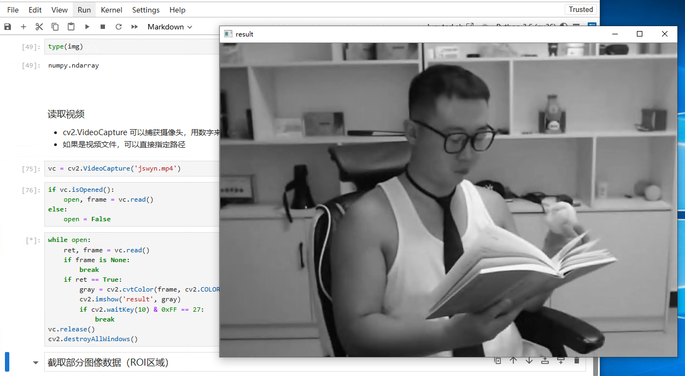

## 基于Python与OpenCV的图像解析处理

*参考 b 站人工智能算法工程师 up 主*

### 一、环境配置

#### 1. 安装

Anaconda下载地址：https://www.anaconda.com/download

安装后使用 `Python3.6` 虚拟环境及 `opencv-python 3.4.1.15` 版本

```bash
# 注：以管理员身份运行 Anaconda Prompt
conda create -p C:\ProgramData\anaconda3\envs\py36 python=3.6
conda activate C:\ProgramData\anaconda3\envs\py36
pip install opencv-python==3.4.1.15

# 验证 opncv
cd /d C:\ProgramData\anaconda3\envs\py36
python
ipmort cv2
cv2.__version__
```


安装拓展

```bash
pip install opencv-contrib-python==3.4.1.15
```


#### 2. Notebook

安装并切换 `Python3.6` 内核

```bash
# 继续在刚刚的 Anaconda Prompt 命令行窗口中执行以下代码
pip install ipykernel
python -m ipykernel install --user --name py36 --display-name "Python 3.6 (py36)"
```

打开 Jupyter Notebook，通过 http://localhost:8888/tree 可以访问到网页版 Notebook

新建一个python测试文件，在顶部的 kernel 选项卡中可找到切换内核选项，切换至刚刚安装的 3.6 版本


### 二、图像基本操作

#### 1. 图像的读取与显示

- cv2.IMREAD_COLOR 彩色图像
- cv2.IMGREAD_GRAYSCALE 灰度图像

```python
import cv2 # OpenCV 读取的格式是 BGR
import matplotlib.pyplot as plt
import numpy as np
%matplotlib inline

img = cv2.imread('test.jpg')

# 执行 img 回车可显示该图像的数据
array([[[189, 150, 188],
        [189, 150, 188],
        [188, 149, 187],
        ...,
        [189, 147, 188],
        [188, 146, 187],
        [189, 146, 189]],

       [[189, 150, 188],
        [188, 149, 187],
        [188, 149, 187],
        ...,
        [189, 147, 188],
        [188, 146, 187],
        [189, 146, 189]],

       [[188, 149, 187],
        [188, 149, 187],
        [188, 149, 187],
        ...,
        [189, 147, 188],
        [188, 146, 187],
        [189, 146, 189]],

       ...,

       [[189, 150, 188],
        [189, 150, 188],
        [189, 150, 188],
        ...,
        [189, 147, 188],
        [188, 146, 187],
        [189, 146, 189]],

       [[189, 150, 188],
        [189, 150, 188],
        [189, 150, 188],
        ...,
        [189, 147, 188],
        [188, 145, 188],
        [189, 146, 189]],

       [[189, 150, 188],
        [189, 150, 188],
        [189, 150, 188],
        ...,
        [189, 147, 188],
        [188, 145, 188],
        [189, 146, 189]]], dtype=uint8)
```

```python
# 图像的显示
cv2.imshow('image', img)
# 等待时间，毫秒级0表示任意键终止
cv2.waitKey(0)
cv2.destroyAllWindows()
```


```python
def cv_show(name, img):
    cv2.imshow(name, img)
    cv2.waitKey(0)
    cv2.destroyAllWindows()
```

```python
# 执行 img.shape 可输出该图像的 shape 数据
img.shape
(295, 300, 3)
```

```python
# 读取灰度图
img = cv2.imread('test.jpg', cv2.IMREAD_GRAYSCALE)
img
array([[166, 166, 165, ..., 164, 163, 164],
       [166, 165, 165, ..., 164, 163, 164],
       [165, 165, 165, ..., 164, 163, 164],
       ...,
       [166, 166, 166, ..., 164, 163, 164],
       [166, 166, 166, ..., 164, 163, 164],
       [166, 166, 166, ..., 164, 163, 164]], dtype=uint8)
```

```python
# 图像的显示（灰度图）
cv2.imshow('image', img)
# 等待时间，毫秒级0表示任意键终止
cv2.waitKey(0)
cv2.destroyAllWindows()
```


```python
# 保存
cv2.imwrite('test1.jpg', img)
```

```python
type(img)
numpy.ndarray
```


#### 2. 读取视频

- cv2.VideoCapture 可以捕获摄像头，用数字来控制不同的设备，如：0,1
- 如果是视频文件，可以直接指定路径

```python
vc = cv2.VideoCapture('jswyn.mp4')

if vc.isOpened():
    open, frame = vc.read()
else:
    open = False

while open:
    ret, frame = vc.read()
    if frame is None:
        break
    if ret == True:
        gray = cv2.cvtColor(frame, cv2.COLOR_BGR2GRAY)
        cv2.imshow('result', gray)
        if cv2.waitKey(10) & 0xFF == 27:
            break
vc.release()
cv2.destroyAllWindows()
```




#### 3. 截取部分图像数据（ROI区域）

```python
img = cv2.imread('test.jpg')
jiaozi = img[0:50, 0: 150]
cv_show('jiaozi', jiaozi)
```


#### 4. 颜色通道提取

```python
b,g,r = cv2.split(img)
r
array([[188, 188, 187, ..., 188, 187, 189],
       [188, 187, 187, ..., 188, 187, 189],
       [187, 187, 187, ..., 188, 187, 189],
       ...,
       [188, 188, 188, ..., 188, 187, 189],
       [188, 188, 188, ..., 188, 188, 189],
       [188, 188, 188, ..., 188, 188, 189]], dtype=uint8)

r.shape
(295, 300)
```

```python
# 合并
img = cv2.merge((b,g,r))
img.shape
(295, 300, 3)
```

```python
# 只保留 R 通道
cur_img = img.copy()
cur_img[:,:,0] = 0
cur_img[:,:,1] = 0
cv_show('R', cur_img)
```

```python
# 只保留 G 通道
cur_img = img.copy()
cur_img[:,:,0] = 0
cur_img[:,:,2] = 0
cv_show('G', cur_img)
```

```python
# 只保留 B 通道
cur_img = img.copy()
cur_img[:,:,1] = 0
cur_img[:,:,2] = 0
cv_show('B', cur_img)
```


#### 5. 边界填充

```python
top_size,bottom_size,left_size,right_size = (50, 50, 50, 50)
replicate = cv2.copyMakeBorder(img, top_size, bottom_size, left_size, right_size, borderType=cv2.BORDER_REPLICATE)
reflect = cv2.copyMakeBorder(img, top_size, bottom_size, left_size, right_size, borderType=cv2.BORDER_REFLECT)
reflect101 = cv2.copyMakeBorder(img, top_size, bottom_size, left_size, right_size, borderType=cv2.BORDER_REFLECT_101)
wrap = cv2.copyMakeBorder(img, top_size, bottom_size, left_size, right_size, borderType=cv2.BORDER_WRAP)
constant = cv2.copyMakeBorder(img, top_size, bottom_size, left_size, right_size, borderType=cv2.BORDER_CONSTANT, value=0)
```

```python
import matplotlib.pyplot as plt
plt.subplot(231), plt.imshow(img, 'gray'), plt.title('ORIGINAL')
# plt.subplot(231), plt.imshow(replicate, 'gray'), plt.title('REPLICATE')
# plt.subplot(231), plt.imshow(reflect, 'gray'), plt.title('REFLECT')
# plt.subplot(231), plt.imshow(reflect101, 'gray'), plt.title('REFLECT_101')
# plt.subplot(231), plt.imshow(wrap, 'gray'), plt.title('WRAP')
# plt.subplot(231), plt.imshow(constant, 'gray'), plt.title('CONSTANT')
plt.show()
```


- BORDER_REPLICATE：复制法，复制最边缘像素
- BORDER_REFLECT：反射法，对感兴趣的图像中的像素在两边进行复制，如：dcba|abcde|edc
- BORDER_REFLECT_101：反射法，以最边缘像素为轴，对称复制，如：dcb|abcd|cba
- BORDER_WRAP：外包装法，如：bcde|abcde|abcd
- BORDER_CONSTANT：常量法，常量数值进行填充


#### 6. 数值计算

```python
img_jz = cv2.imread('test.jpg')

img_jz[:5,:,0]
array([[189, 189, 188, ..., 189, 188, 189],
       [189, 188, 188, ..., 189, 188, 189],
       [188, 188, 188, ..., 189, 188, 189],
       [188, 188, 188, ..., 189, 188, 189],
       [188, 188, 188, ..., 189, 188, 189]], dtype=uint8)
img_jz1 = img_jz + 10

img_jz1[:5,:,0]
array([[199, 199, 198, ..., 199, 198, 199],
       [199, 198, 198, ..., 199, 198, 199],
       [198, 198, 198, ..., 199, 198, 199],
       [198, 198, 198, ..., 199, 198, 199],
       [198, 198, 198, ..., 199, 198, 199]], dtype=uint8)
```

```python
# 相加时如果像素点的数值超过边界 255，则会将该值与256进行 % 取余操作
(img_jz + img_jz1)[:5,:,0]

array([[132, 132, 130, ..., 132, 130, 132],
       [132, 130, 130, ..., 132, 130, 132],
       [130, 130, 130, ..., 132, 130, 132],
       [130, 130, 130, ..., 132, 130, 132],
       [130, 130, 130, ..., 132, 130, 132]], dtype=uint8)
```

```python
# 通过cv2的add方法进行操作时，如果像素点的数值超过边界 255，则取255，否则取它自身
cv2.add(img_jz,img_jz1)[:5,:,0]

array([[255, 255, 255, ..., 255, 255, 255],
       [255, 255, 255, ..., 255, 255, 255],
       [255, 255, 255, ..., 255, 255, 255],
       [255, 255, 255, ..., 255, 255, 255],
       [255, 255, 255, ..., 255, 255, 255]], dtype=uint8)
```


#### 7. 图像融合

```python
# 当两张图的大小不一致时，无法进行融合，先用cv2.resize()方法调整
img_ble = cv2.imread('ble.jpg')
img_jz + img_ble

array([[[139,  68,  57],
        [140,  69,  58],
        [137,  68,  59],
        ...,
        [139,  70,  55],
        [138,  69,  53],
        [139,  69,  55]],

       [[140,  69,  58],
        [139,  68,  57],
        [137,  68,  59],
        ...,
        [139,  70,  55],
        [138,  69,  53],
        [139,  69,  55]],

       [[139,  68,  57],
        [139,  68,  57],
        [136,  67,  58],
        ...,
        [139,  70,  55],
        [138,  69,  53],
        [139,  69,  55]],

       ...,

       [[144,  68,  56],
        [137,  65,  57],
        [137,  70,  61],
        ...,
        [138,  68,  55],
        [137,  67,  54],
        [138,  68,  55]],

       [[143,  67,  55],
        [136,  64,  56],
        [135,  68,  59],
        ...,
        [138,  68,  55],
        [137,  66,  55],
        [139,  69,  56]],

       [[142,  66,  54],
        [141,  68,  60],
        [132,  65,  56],
        ...,
        [139,  69,  56],
        [138,  67,  56],
        [139,  69,  56]]], dtype=uint8)
```

```python
# 参数说明：img1,比例,img2,比例,亮度级
res = cv2.addWeighted(img_jz, 0.1, img_ble, 0.6, 0)
plt.imshow(res)
```

<matplotlib.image.AxesImage at 0x24ad14c8860>


```python
# 将目标值设置为，通过x,y比例进行调整
res = cv2.resize(img, (0, 0), fx=3, fy=2.5)
plt.imshow(res)
```

<matplotlib.image.AxesImage at 0x24ad4d2f4e0>

