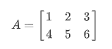
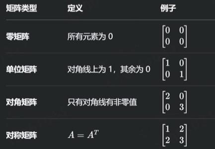

## ndarray

*参考 b 站 mia 木棉老师*

### 一、特性

#### 1. 多维性

支持 0维（标量）、1维（向量）、2维（矩阵）及更高维数组


```python
import numpy as np

arr = np.array(1)
print("arr维度：", arr.ndim)
print(arr)

arr维度： 0
1
```


```python
arr = np.array([1, 2, 3])
print("arr维度：", arr.ndim)
print(arr)

arr维度： 1
[1 2 3]
```


```python
arr = np.array([[1, 2, 3], [4, 5, 6]])
print("arr维度：", arr.ndim)
print(arr)

arr维度： 2
[[1 2 3]
 [4 5 6]]
```


#### 2. 同质性

所有元素类型必须一致


```python
# 数组中元素类型不一致时，会被强制转换为相同的数据类型
arr = np.array([1, 'sunxiaochuan'])
print(arr)

['1' 'sunxiaochuan']
```


```python
arr = np.array([1, True])
print(arr)

[1 1]
```


#### 3. 高效性

基于连续内存块存储，支持向量化运算


### 二、属性

| 属性名称 | 说明                       | 使用示例     |
| -------- | -------------------------- | ------------ |
| shape    | 数组的形状：行数和列数     | arr.shape    |
| ndim     | 维度数量：是几维数组       | arr.ndim     |
| size     | 数组长度（元素个数）       | arr.size     |
| dtype    | 元素类型                   | arr.dtype    |
| T        | 转置：行变列，列变行       | arr.T        |
| itemsize | 单个元素占用的内存字节数   | arr.itemsize |
| nbytes   | 数组总内存占用量           | arr.nbytes   |
| flags    | 内存存储方式：是否连续存储 | arr.flags    |


```python
arr = np.array([[1, 2, 3], [4, 5, 6]])
print(arr)
print("数组的形状：", arr.shape)
print("数组的维度：", arr.ndim)
print("数组的长度：", arr.size)
print("数组的元素类型：", arr.dtype)
print("数组转置：", arr.T)

[[1 2 3]
 [4 5 6]]
数组的形状： (2, 3)
数组的维度： 2
数组的长度： 6
数组的元素类型： int64
数组转置： [[1 4]
 [2 5]
 [3 6]]
```


### 三、创建

#### 1. 基础构造

适用于小规模数组或复制已有数据


```python
# 基础创建
arr = np.array([1, 2, 3])
print(arr)

[1 2 3]
```


```python
# copy(深拷贝)
arr_copy = arr.copy()
print(arr_copy)

arr_copy[0] = 0
print(arr_copy)
print(arr)

[1 2 3]
[0 2 3]
[1 2 3]
```


#### 2. 预定义形状填充

用于快速初始化固定形状的数组（如全0占位，全1初始化）


```python
# 预定义形状
# 全 0
arr = np.zeros((2, 3))
# 元素类型默认为 float64
print(arr)

# 创建时指定元素类型
arr = np.zeros((2, 3), dtype=int)
print(arr)

[[0. 0. 0.]
 [0. 0. 0.]]

[[0 0 0]
 [0 0 0]]
```


```python
# 全 1
arr = np.ones((2, 3))
# 元素类型默认为 float64
print(arr)

[[1. 1. 1.]
 [1. 1. 1.]]
```


```python
# 未初始化（每次初始化的结果不一致）
arr = np.empty((2, 3))
print(arr)

[[1. 1. 1.]
 [1. 1. 1.]]
```


```python
# 指定初始化值全填充
arr =np.full((2, 3), 1)
print(arr)

[[1 1 1]
 [1 1 1]]
```


```python
# _like 表示 shape、dtype和指定的数组一样
arr_like = np.zeros_like(arr)
print(arr_like)

[[0 0 0]
 [0 0 0]]
```


#### 3. 基于数值范围生成

生成数值序列，常用于模拟时间序列、坐标网格等


```python
# 等差数列
# 参数：起始位置，结束位置，步长
arr = np.arange(0, 5, 1)
print(arr)

[0 1 2 3 4]
```


```python
# 等间隔数列
# 参数：起始位置，结束位置，要取几份（均分几份）
arr = np.linspace(1, 5, 3)
print(arr)

# 知道长度和要取几份，通过arange也能实现
arr = np.arange(1, 100, 25)
print(arr)
arr = np.arange(1, 101, 25)
print(arr)

[1. 3. 5.]
[ 1 26 51 76]
[ 1 26 51 76]
```


```python
# 对数间隔数列
# 参数：起始位置，结束位置，要取几份（均分几份），指数
arr = np.logspace(0, 4, 3, base=2)
print(arr)

[ 1.  4. 16.]
```


#### 4. 矩阵

| 名称 | 维度   | 示例                   | 备注                  |
| ---- | ------ | ---------------------- | --------------------- |
| 标量 | 0维    | 1, 2                   | 单个数字，无行列      |
| 向量 | 1维    | [1, 2, 3]              | 只有行或列            |
| 矩阵 | 2维    | [[1, 2, 3], [4, 5, 6]] | 严格的行列结构        |
| 张量 | >= 3维 | [[[1, 2], [3, 4]]]     | 高阶数组（如RGB图像） |

矩阵是由 **行（row）** 和 **列（column）** 排列成的矩形数组



形状（shape）：2行3列，记作 2x3 矩阵
元素（entry）：矩阵中的每个数字称作元素

特殊矩阵

 


```python
# 单位矩阵
arr = np.eye(3, 5, dtype=int)
print(arr)

[[1 0 0 0 0]
 [0 1 0 0 0]
 [0 0 1 0 0]]
```


```python
# 对角矩阵
arr = np.diag([-1, 1, 2, 3])
print(arr)

[[-1  0  0  0]
 [ 0  1  0  0]
 [ 0  0  2  0]
 [ 0  0  0  3]]
```


#### 5. 随机数组生成

模拟实验数据、初始化神经网络权重等


```python
# 随机数组
# 0 - 1 之间的
arr = np.random.rand(3, 3)
print(arr)

[[0.49269745 0.28805571 0.0111438 ]
 [0.43128953 0.72709    0.5444694 ]
 [0.93261996 0.32217166 0.72474585]]
```


```python
# 指定范围区间
# 随机浮点数
arr = np.random.uniform(1, 3, (3, 3))
print(arr)

[[2.70492755 1.636252   1.18072158]
 [1.38557557 2.13813528 2.11942667]
 [2.18956104 2.72948314 1.8949814 ]]
```


```python
# 随机整数
arr = np.random.randint(1, 10, (3, 3))
print(arr)

[[4 9 9]
 [8 5 4]
 [2 6 5]]
```


```python
# 随机数列（正态分布 -3 ~ 3之间）
# 两边的概率小，中间的概率大
arr = np.random.randn(3, 3)
print(arr)

[[ 0.89822946  1.21094463 -1.23360184]
 [ 0.26999662  0.97035489 -1.95975342]
 [-0.54847444  0.24917721  0.13710756]]
```


```python
# 设置随机种子
# 作用：a、b两个同事在各自电脑上做测试时，需要一个相同的数组，通过种子来做关联
np.random.seed(20)
arr = np.random.randint(1, 10, (3, 3))
print(arr)

[[4 5 7]
 [8 3 1]
 [7 9 6]]
```


#### 6. 高级构造方法

处理非结构化数据（文件、字符串等）或通过函数生成复杂数组


### 四、数据类型

| 数据类型                                                     | 说明                                                         |
| ------------------------------------------------------------ | ------------------------------------------------------------ |
| bool                                                         | 布尔值                                                       |
| int8、uint8<br />int16、uint16<br />int32、uint32<br />int64、uint64 | 有符号/无符号的8位（1字节）整型<br />有符号/无符号的16位（2字节）整型<br />有符号/无符号的32位（4字节）整型<br />有符号/无符号的64位（8字节）整型 |
| float16<br />float32<br />float64                            | 半精度浮点型<br />单精度浮点型<br />双精度浮点型             |
| complex64<br />complex128                                    | 用两个32位浮点数表示的复数<br />用两个64位浮点数表示的复数   |


```python
# 布尔值
arr = np.array([1, 0], dtype=bool)
print(arr)

[ True False]
```


```python
# 整型
arr = np.array([1, 2, 3], dtype=int)
print(arr)

[1 2 3]
```


### 五、索引与切片

| 索引/切片类型 | 描述/用法                                               |
| ------------- | ------------------------------------------------------- |
| 基本索引      | 通过下标索引直接访问元素（索引从0开始）                 |
| 行/列切片     | 使用冒号进行切片，得到行或列的子集                      |
| 连续切片      | 从起始索引到结束索引按步长切片                          |
| slice         | slice(start, stop, step)                                |
| 布尔索引      | 通过布尔条件筛选满足条件的元素，支持逻辑运算符（&、\|） |

#### 1. 一维数组的索引与切片

```python
arr = np.random.randint(1, 50, 20)
print(arr)

[20 17 39 39 17 42 38  8 38 35  7 27 14 12 26  4 11 12 14 20]
```

```python
# 获取全部元素
print(arr[:])

[20 17 39 39 17 42 38  8 38 35  7 27 14 12 26  4 11 12 14 20]
```

```python
# 获取部分元素（左闭右开）
print(arr[2:5])

[39 39 17]
```

```python
# 布尔索引（大于10的元素）
print(arr[arr > 10])

[27 27 20 17 39 39 17 42 38 38 35 27 14 12 26 11 12]
```

```python
# 大于5小于10的元素
print(arr[(5 < arr) & (arr < 10)])

[8 7]
```

```python
# slice(start, stop, step)
print(arr[slice(2, 20, 3)])
```


#### 2. 二维数组的索引与切片

```python
arr = np.random.randint(1, 50, (3, 5))
print(arr)

[[14 20 31 47 33]
 [11 44  7 12 19]
 [ 4 14 18 44 17]]
```

```python
# 获取第一行第一列的元素
print(arr[0, 0])

# 获取第二行第三列的元素
print(arr[1, 2])

14
7
```

```python
print(arr[:, :])

[[14 20 31 47 33]
 [11 44  7 12 19]
 [ 4 14 18 44 17]]
```

```python
# 获取第二行的元素
print(arr[1, :])

[11 44  7 12 19]
```

```python
# 获取第二行下标索引1到3的元素（左闭右开）
print(arr[1, 1:3])

[44  7]
```

```python
# 布尔索引
print(arr[arr > 10]) # 该方法将符合条件的元素整理为了一维数组

[14 20 31 47 33 11 44 12 19 14 18 44 17]
```

```python
# 获取第二行中大于10的元素
print(arr[1][arr[1] > 10])

[11 44 12 19]
```

```python
# 筛选第二列的数据
print(arr[:, 1])

[20 44 14]
```


### 六、运算


```python
# 算术运算
a = np.array([1, 2, 3])
b = np.array([4, 5, 6])
print(a + b)
print(a - b)
print(a * b)
print(a / b)
print(a ** 2)

[5 7 9]
[-3 -3 -3]
[ 4 10 18]
[0.25 0.4  0.5 ]
[1 4 9]
```


```python
# python 普通数组的拼接
c = [1, 2, 3]
d = [4, 5, 6]
print(c + d)

[1, 2, 3, 4, 5, 6]
```


```python
a = np.array([[1, 2, 3], [4, 5, 6]])
b = np.array([[4, 5, 6], [7, 8, 9]])
print(a + b)
print(a - b)
print(a * b)
print(a / b)
print(a ** 2)

[[ 5  7  9]
 [11 13 15]]
[[-3 -3 -3]
 [-3 -3 -3]]
[[ 4 10 18]
 [28 40 54]]
[[0.25       0.4        0.5       ]
 [0.57142857 0.625      0.66666667]]
[[ 1  4  9]
 [16 25 36]]
```


```python
# 数组与标量的算术运算
a = np.array([[1, 2, 3], [4, 5, 6]])
print(a + 3)
print(a * 3)

[[4 5 6]
 [7 8 9]]
[[ 3  6  9]
 [12 15 18]]
```


```python
# 广播机制：1. 获取形状，2. 判断是否可广播（行列要相对应）
a = np.array([1, 2, 3])  # 1行3列
b = np.array([[4], [5], [6]])  # 3行1列

"""
a
1 2 3
1 2 3
1 2 3

b
4 4 4
5 5 5
6 6 6
"""

print(a + b)

[[5 6 7]
 [6 7 8]
 [7 8 9]]
```


```python
# 矩阵运算
a = np.array([[1, 2, 3], [4, 5, 6], [7, 8, 9]])
b = np.array([[4, 5, 6], [7, 8, 9], [10, 11, 12]])
print(a + b)

"""
矩阵乘法
(1, 1) = a(1, 1) * b(1, 1) + a(1, 2) * b (2, 1) + a(1, 3) * b(3, 1) 
"""
print(a @ b)

[[ 5  7  9]
 [11 13 15]
 [17 19 21]]
[[ 48  54  60]
 [111 126 141]
 [174 198 222]]
```


### 七、函数

#### 1. 基本数学函数

````python
# 平方根
print(np.sqrt(4))
print(np.sqrt([1, 4, 9]))

arr = np.array([1, 4, 9])
print(np.sqrt(arr))

2.0
[1. 2. 3.]
[1. 2. 3.]
````

```python
# 指数 e^x = y
print(np.exp(3))

20.085536923187668
```

```python
# 对数 ln y = x
print(np.log(1))

0.0
```

```python
# 三角函数
# 正弦
print(np.sin(1))

# 余弦
print(np.cos(np.pi))

0.8414709848078965
-1.0
```

```python
# 绝对值
arr = np.array([1, 2, -3, 4, -5])
print(np.abs(arr))

[1 2 3 4 5]
```

```python
# a的b次幂
print(np.power(arr, 2))

[ 1  4  9 16 25]
```

```python
# 四舍五入
"""
奇进偶不进
奇进：当5前的数字是奇数时，进位：2.35 ---> 2.4
偶不进：当5前的数字是偶数时，舍去：2.45 ---> 2.4
"""
print(np.round([1.1, 2.6, 3.5, 4.5, 4.51]))

[1. 3. 4. 4. 5.]
```

```python
# 向上取整
arr = np.array([1.5, 2.6, 3.7])
print(np.ceil(arr))

# 向下取整
print(np.floor(arr))

[2. 3. 4.]
[1. 2. 3.]
```

```python
# 检测缺失值 NaN
arr = np.array([1, 2, np.nan, 3])
print(np.isnan(arr))

[False False  True False]
```


#### 2. 统计函数

```python
arr = np.random.randint(1, 10, 5)
print(arr)

[3 8 7 7 9]
```

```python
# 求和
print(np.sum(arr))

34
```

```python
# 平均值
print(np.mean(arr))

6.8
```

```python
# 中位数
"""
元素个数为奇数时：先排序，再计算
元素个数为偶数时：中间两个数的平均值
"""
print(np.median(arr))
print(np.median([1, 2, 3, 4]))

7.0
2.5
```

```python
# 标准差
"""
[1, 2, 3] 的平均值为2
标准差 = ((1 - 2)^2 + (2 - 2)^2 + (3 - 2)^2) / 3
"""
print(np.var([1, 2, 3]))

# 方差
"""
根据标准差和方差可以评估一组数据的离散程度，如：温度是否恒定，机器运行是否稳定
"""
print(np.std([1, 2, 3]))

0.6666666666666666
0.816496580927726
```

```python
# 最值
# 最大值
print("最大值：", np.max(arr), "索引位置：", np.argmax(arr))

# 最小值
print("最小值：", np.min(arr), "索引位置：", np.argmin(arr))

最大值： 9 索引位置： 4
最小值： 3 索引位置： 0
```

```python
# 分位数
arr = np.array([1, 2, 3, 4])

"""
1    2    3    4 等分为4份，中间有3段

30%时：
0.3 * 3 = 0.9
(3 - 2) * 0.9 = 0.9 + 1 = 1.9

50%时：
0.5 * 3 = 1.5
(3 - 2) * 1.5 = 1.5 + 1 = 2.5

70%时：
0.7 * 3 = 2.1
(3 - 2) * 0.1 = 0.1 + 3 = 3.1
"""
print(np.percentile(arr, 30))
print(np.percentile(arr, 50))
print(np.percentile(arr, 70))

1.9
2.5
3.0999999999999996
```

```python
# 累积和
print(np.cumsum(arr))

# 累积积
print(np.cumprod(arr))

[ 1  3  6 10]
[ 1  2  6 24]
```

