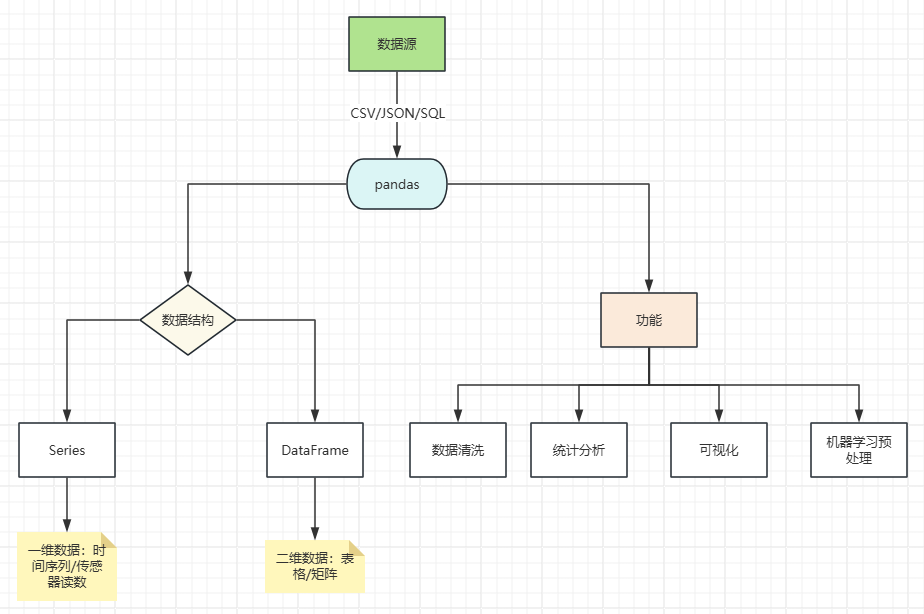

## pandas

### 一、概要

#### 1. 简介

pandas 是Python数据分析工具链中最核心的库，可用于数据读取、清洗、分析、统计、输出等，适用于处理结构化数据（如表格型数据）。


#### 2. 核心设计理念

- 标签化数据结构：提供带标签的轴
- 灵活处理缺失数据：内置NaN处理机制
- 智能数据对齐：自动按标签对齐数据
- IO工具：支持CSV、Excel、SQL等多种数据源
- 时间序列处理：原生支持日期时间处理和频率转换



| 特性     | Series               | DataFrame                        |
| -------- | -------------------- | -------------------------------- |
| 维度     | 一维                 | 二维                             |
| 索引     | 单索引               | 行索引 + 列名                    |
| 数据存储 | 同质化数据类型       | 各列的数据类型可以不同           |
| 类比     | Excel 单列           | Excel Sheet                      |
| 创建方式 | pd.Series([1, 2, 3]) | pd.DataFrame({'col': [1, 2, 3]}) |


### 二、Series

#### 1. 创建

```python
# 安装 pandas
pip install pandas
```


```python
import pandas as pd

s = pd.Series([5, 1, 3, 2, 8, 10])
print(s)

0     5
1     1
2     3
3     2
4     8
5    10
dtype: int64
```

```python
# 自定义索引
s = pd.Series([5, 1, 3, 2, 8, 10], index=['A', 'B', 'C', 'D', 'E', 'F'])
print(s)

s = pd.Series([5, 1, 3, 2, 8, 10], index=[10, 20, 30, 40, 50, 60])
print(s)

A     5
B     1
C     3
D     2
E     8
F    10
dtype: int64
10     5
20     1
30     3
40     2
50     8
60    10
dtype: int64
```

```python
# 自定义name（name用于描述这一列是干什么的）
s = pd.Series([5, 1, 3, 2, 8, 10], index=[10, 20, 30, 40, 50, 60], name='成绩')
print(s)

10     5
20     1
30     3
40     2
50     8
60    10
Name: 成绩, dtype: int64
```

```python
# 通过字典创建
s = pd.Series({'A': 10, 'B': 20, 'C': 30})
print(s)

s1 = pd.Series(s, index=['A', 'C'])
print(s1)

A    10
B    20
C    30
dtype: int64
A    10
C    30
dtype: int64
```


#### 2. 常用属性

| 属性         | 说明                       |
| ------------ | -------------------------- |
| index        | 索引（从0开始）            |
| values       | 值                         |
| dtype/dtypes | 元素的类型                 |
| shape        | 形状                       |
| ndim         | 维度                       |
| size         | 元素个数                   |
| name         | 名称                       |
| loc[]        | 显示索引，按标签索引或切片 |
| iloc[]       | 隐式索引，按位置索引或切片 |
| at[]         | 通过标签访问指定元素       |
| iat[]        | 通过位置访问指定元素       |

```python
s = pd.Series([1, 2, 3, 4, 5], index=['A', 'B', 'C', 'D', 'E'])

# index
print(s.index)

Index(['A', 'B', 'C', 'D', 'E'], dtype='object')
```

```python
# values
print(s.values)

[1 2 3 4 5]
```

```python
# shape ndim size
print(s.shape, s.ndim, s.size)

(5,) 1 5
```

```python
# name
print(s.name)

s.name = "测试"
print(s.name)

None
测试
```

```python
# loc[] 显示索引
print(s.loc['A'])

# iloc[] 隐示索引
print(s.iloc[0])

# 同时也支持切片语法
print(s.loc['A':'C'])
print(s.iloc[0:2])

1
1
A    1
B    2
C    3
Name: 测试, dtype: int64
A    1
B    2
Name: 测试, dtype: int64
```

```python
# at 注：不支持切片语法
print(s.at['A'])

# iat 注：不支持切片语法
print(s.iat[0])

1
1
```


#### 3. 访问数据的方式

```python
# 直接访问
# print(s[0]) 不建议这样使用，底层可能无法区分是取标签为0的值，还是取索引为0的值
print(s['A']) # 通过已设置的标签访问

1
```

```python
# 通过布尔索引访问
print(s[s<3])

A    1
B    2
Name: 测试, dtype: int64
```

```python
# head() 默认取前5行的数据
print(s.head())

s['F'] = 100
s['G'] = 200
print(s.head())

# tail() 默认取最后5行的数据
print(s.tail())
print("=======================")

# 通过参数指定取几行的数据
print(s.head(2))
print("=======================")
print(s.tail(3))

A    1
B    2
C    3
D    4
E    5
Name: 测试, dtype: int64
A    1
B    2
C    3
D    4
E    5
Name: 测试, dtype: int64
C      3
D      4
E      5
F    100
G    200
Name: 测试, dtype: int64
=======================
A    1
B    2
Name: 测试, dtype: int64
=======================
E      5
F    100
G    200
Name: 测试, dtype: int64
```


#### 4. 常用方法

| 方法              | 说明                                                         |
| ----------------- | ------------------------------------------------------------ |
| head()            | 查看前n行数据，默认值为5                                     |
| tail()            | 查看后n行数据，默认值为5                                     |
| isin()            | 判断集合中的每一个元素是否包含在指定的集合中                 |
| isna()            | 判断指定元素是否为缺失值（NaN/None）                         |
| sum()             | 求和（自动忽略缺失值）                                       |
| mean()            | 平均值                                                       |
| min()             | 最小值                                                       |
| max()             | 最大值                                                       |
| var()             | 方差                                                         |
| std()             | 标准差                                                       |
| median()          | 中位数                                                       |
| mode()            | 众数（返回值可以有多个）                                     |
| quantile(q)       | 分位数，q的取值范围：0 ~ 1                                   |
| describe()        | 常见统计信息（如：count、mean、std、min、25%、50%、75%、max） |
| value_count()     | 每个唯一值出现的次数                                         |
| count()           | 集合中非缺失值的数量                                         |
| nunique()         | 唯一值个数（去重后的）                                       |
| unique()          | 数组去重                                                     |
| drop_duplicates() | 去除重复项，同理 unique()                                    |
| sample()          | 随机抽样                                                     |
| sort_index()      | 按索引值排序                                                 |
| sort_values()     | 按值排序                                                     |
| replace()         | 替换                                                         |
| keys()            | 返回集合的索引                                               |

```python
s = pd.Series([5, 1, np.nan, 3, 2, None, 8])
s.name = 'datas'
print(s)

0    5.0
1    1.0
2    NaN
3    3.0
4    2.0
5    NaN
6    8.0
Name: datas, dtype: float64
```

```python
# head()
print(s.head())

0    5.0
1    1.0
2    NaN
3    3.0
4    2.0
Name: datas, dtype: float64
```

```python
# tail()
print(s.tail())
print("================")
print(s.tail(1))

2    NaN
3    3.0
4    2.0
5    NaN
6    8.0
Name: datas, dtype: float64
================
6    8.0
Name: datas, dtype: float64
```

```python
# 查看所有的描述信息
print(s.describe())

count    5.000000
mean     3.800000
std      2.774887
min      1.000000
25%      2.000000
50%      3.000000
75%      5.000000
max      8.000000
Name: datas, dtype: float64
```

```python
# 获取集合的元素个数（忽略缺失值）
print(s.count())

5
```

```python
# 获取集合的索引
print("通过方法获取：")
print(s.keys())

print("通过属性获取：")
print(s.index)

通过方法获取：
RangeIndex(start=0, stop=7, step=1)
通过属性获取：
RangeIndex(start=0, stop=7, step=1)
```

```python
# isna() 检查集合中的每一个元素是否为缺失值
print(s.isna())

0    False
1    False
2     True
3    False
4    False
5     True
6    False
Name: datas, dtype: bool
```

```python
# isin()
print(s.isin([4, 5, 6]))

0     True
1    False
2    False
3    False
4    False
5    False
6    False
Name: datas, dtype: bool
```

```python
# mean()
print(s.mean())

# std()
print(s.std())

# var()
print(s.var())

# min() max()
print(s.min())
print(s.max())

# median()
print(s.median())

3.8
2.7748873851023212
7.699999999999999
1.0
8.0
3.0
```

```python
"""
|----|----|----|----|
1    2    3    5    8

去掉缺失值后等分4段（元素个数减一）
quantile(0.25)
4 * 0.25 = 1
1在等分的第一段
分位数 = 1 + (2-1) * 1 = 2
"""
print(s.sort_values())
print("===============")
# quantile()
print(s.quantile(0.25))
print(s.quantile(0.50))
print(s.quantile(0.75))

1    1.0
4    2.0
3    3.0
0    5.0
6    8.0
2    NaN
5    NaN
Name: datas, dtype: float64
===============
2.0
3.0
5.0
```

```python
# mode()
s[len(s)] = 1
print(s)
print("===============")
print(s.mode())

0    5.0
1    1.0
2    NaN
3    3.0
4    2.0
5    NaN
6    8.0
7    1.0
Name: datas, dtype: float64
===============
0    1.0
Name: datas, dtype: float64
```

```python
# 元素计数
print(s.value_counts())

datas
1.0    2
5.0    1
3.0    1
2.0    1
8.0    1
Name: count, dtype: int64
```

```python
# drop_duplicates()
print(s)
print("====================")
print(s.drop_duplicates())
print("====================")
s[len(s)] = 1
print(s.unique())
# 去重后的元素个数
print(s.nunique())

0    5.0
1    1.0
2    NaN
3    3.0
4    2.0
5    NaN
6    8.0
7    1.0
Name: datas, dtype: float64
====================
0    5.0
1    1.0
2    NaN
3    3.0
4    2.0
6    8.0
Name: datas, dtype: float64
====================
[ 5.  1. nan  3.  2.  8.]
5
```

```python
# sort_index()
print(s.sort_index())

# sort_values()
print(s.sort_values())

0    5.0
1    1.0
2    NaN
3    3.0
4    2.0
5    NaN
6    8.0
7    1.0
8    1.0
Name: datas, dtype: float64
1    1.0
7    1.0
8    1.0
4    2.0
3    3.0
0    5.0
6    8.0
2    NaN
5    NaN
Name: datas, dtype: float64
```


### 三、DataFrame

#### 1. 创建方法


```python
import numpy as np
import pandas as pd

# 通过Series创建
s1 = pd.Series([1, 2, 3])
s2 = pd.Series([4, 5, 6])
df = pd.DataFrame({"1": s1, "2": s2})
print(df)

   1  2
0  1  4
1  2  5
2  3  6
```


```python
# 通过字典创建
# 可以通过columns属性指定列的顺序
df = pd.DataFrame(
    {
        "id": [1, 2, 3],
        "name": ["孙笑川", "药水哥", "Giao哥"],
        "age": [33, 30, 33]
    }
)
print(df)

   id   name  age
0   1    孙笑川   33
1   2    药水哥   30
2   3  Giao哥   33
```


#### 2. 属性

| 属性    | 说明                           |
| ------- | ------------------------------ |
| index   | 行索引                         |
| values  | 值                             |
| dtypes  | 元素类型                       |
| shape   | 形状                           |
| ndim    | 维度                           |
| size    | 元素个数                       |
| columns | 列标签                         |
| loc[]   | 显示索引，按行列标签索引或切片 |
| iloc[]  | 隐式索引，按行列位置索引或切片 |
| at[]    | 使用行列标签访问指定元素       |
| iat[]   | 使用行列位置访问指定元素       |
| T       | 行列转置                       |


```python
print("行索引：", df.index)
print("列标签", df.columns)
print("值：", df.values)

行索引： RangeIndex(start=0, stop=3, step=1)
列标签 Index(['id', 'name', 'age'], dtype='object')
值： [[1 '孙笑川' 33]
 [2 '药水哥' 30]
 [3 'Giao哥' 33]]
```


```python
print("形状：", df.shape)
print("维度：", df.ndim)
print("数据类型：")
print(df.dtypes)

形状： (3, 3)
维度： 2
数据类型：
id       int64
name    object
age      int64
dtype: object
```


```python
# 行数据
# loc
print(df.loc[1])
print("==================")

# iloc
print(df.iloc[1])

id        2
name    药水哥
age      30
Name: 1, dtype: object
==================
id        2
name    药水哥
age      30
Name: 1, dtype: object
```


```python
# 列数据
print(df.loc[:, 'name'])
print("==================")
print(df.iloc[:, 1])

0      孙笑川
1      药水哥
2    Giao哥
Name: name, dtype: object
==================
0      孙笑川
1      药水哥
2    Giao哥
Name: name, dtype: object
```


```python
# 获取指定元素
print(df.at[0, 'name'])
print("==================")
print(df.iat[0, 1])
print("==================")
print(df.loc[0, 'name'])
print("==================")
print(df.iloc[0, 1])

孙笑川
==================
孙笑川
==================
孙笑川
==================
孙笑川
```


```python
# 行列转置
#print(df.T)
```


```python
# 获取单列数据
print(df['name'])
print("==================")
print(df.name)
print("==================")
column = df[['name']]
print(column)
print(type(column))

0      孙笑川
1      药水哥
2    Giao哥
Name: name, dtype: object
==================
0      孙笑川
1      药水哥
2    Giao哥
Name: name, dtype: object
==================
    name
0    孙笑川
1    药水哥
2  Giao哥
<class 'pandas.core.frame.DataFrame'>
```


```python
# 多列数据
print(df[['name', 'age']])

    name  age
0    孙笑川   33
1    药水哥   30
2  Giao哥   33
```


```python
# 获取部分数据
print(df.head(2))
print("==================")
print(df.tail(2))

   id name  age
0   1  孙笑川   33
1   2  药水哥   30
==================
   id   name  age
1   2    药水哥   30
2   3  Giao哥   33
```


```python
# 布尔索引
print(df[df.age > 32])
print("==================")
print(df[(df.age > 32) & (df.id == 1)])

   id   name  age
0   1    孙笑川   33
2   3  Giao哥   33
==================
   id name  age
0   1  孙笑川   33
```


```python
# 随机抽样
print(df.sample(2))

   id   name  age
0   1    孙笑川   33
2   3  Giao哥   33
```


#### 3. 常用方法

| 方法              | 说明                                                      |
| ----------------- | --------------------------------------------------------- |
| head()            | 获取前n行数据，默认值5                                    |
| tail()            | 获取后n行数据，默认值5                                    |
| isin()            | 判断元素是否包含在参数集合中                              |
| isna()            | 判断每一个元素是否为缺失值（NaN/None）                    |
| sum()             | 求和，自动忽略缺失值                                      |
| mean()            | 平均值                                                    |
| min()             | 最小值                                                    |
| max()             | 最大值                                                    |
| var()             | 方差                                                      |
| std()             | 标准差                                                    |
| median()          | 中位数                                                    |
| mode()            | 众数（可以有多个返回值）                                  |
| quantile(q)       | 分位数，q取值范围为：0~1                                  |
| describe()        | 常见统计信息（count、mean、std、min、25%、50%、75%、max） |
| value_counts()    | 每个唯一值的出现次数                                      |
| count()           | 非缺失值数量                                              |
| duplicated()      | 是否重复                                                  |
| drop_duplicates() | 去除重复项                                                |
| sample()          | 随机抽样                                                  |
| replace()         | 替换                                                      |
| sort_index()      | 按索引排序                                                |
| sort_values()     | 按值排序                                                  |
| nlargest()        | 返回某列最大的n条数据                                     |
| nsmallest()       | 返回某列最小的n条数据                                     |


```python
df = pd.DataFrame(
    {
        "id": [1, 2, 3],
        "name": ["孙笑川", "药水哥", "Giao哥"],
        "age": [33, 30, 31],
        "address": ["成都", "武汉", "河南"]
    }
)
print(df)

   id   name  age address
0   1    孙笑川   33      成都
1   2    药水哥   30      武汉
2   3  Giao哥   31      河南
```


```python
print(df.head(1))
print("============================")
print(df.tail(1))

   id name  age address
0   1  孙笑川   33      成都
============================
   id   name  age address
2   3  Giao哥   31      河南
```


```python
# 查看元素是否包含在参数集合中
print(df.isin(["药水哥", 31]))

      id   name    age  address
0  False  False  False    False
1  False   True  False    False
2  False  False   True    False
```


```python
# 查看元素是否是缺失值
print(df.isna())

      id   name    age  address
0  False  False  False    False
1  False  False  False    False
2  False  False  False    False
```


```python
# 求和
print(df.sum())
print("============================")
print(df.age.sum())

id                   6
name       孙笑川药水哥Giao哥
age                 94
address         成都武汉河南
dtype: object
============================
94
```


```python
# 最值
print(df.age.max())
print(df.name.min())

33
Giao哥
```


```python
# 平均数
print(df.age.mean())

# 中位数
print(df.age.median())

# 众数
print(df.age.mode())

31.333333333333332
31.0
0    30
1    31
2    33
Name: age, dtype: int64
```


```python
# 标准差
print(df.age.std())

# 方差
print(df.age.var())

# 分位数
print(df.age.quantile(0.25))

1.5275252316519468
2.3333333333333335
30.5
```


```python
# 描述信息
print(df.describe())

        id        age
count  3.0   3.000000
mean   2.0  31.333333
std    1.0   1.527525
min    1.0  30.000000
25%    1.5  30.500000
50%    2.0  31.000000
75%    2.5  32.000000
max    3.0  33.000000
```


```python
# 每一列中非缺失值的个数
print(df.count())

id         3
name       3
age        3
address    3
dtype: int64
```


```python
# 每一个唯一值的出现次数
print(df.value_counts())

id  name   age  address
1   孙笑川    33   成都         1
2   药水哥    30   武汉         1
3   Giao哥  31   河南         1
Name: count, dtype: int64
```


```python
# 去重
print(df.drop_duplicates())

   id   name  age address
0   1    孙笑川   33      成都
1   2    药水哥   30      武汉
2   3  Giao哥   31      河南
```


```python
# 判重
print(df.duplicated())
print("============================")
# 指定列判重
print(df.duplicated(subset="name"))

0    False
1    False
2    False
dtype: bool
============================
0    False
1    False
2    False
dtype: bool
```


```python
# 随机抽样
print(df.sample())

   id   name  age address
2   3  Giao哥   31      河南
```


```python
# replace
print(df.replace(30, 35))

   id   name  age address
0   1    孙笑川   33      成都
1   2    药水哥   35      武汉
2   3  Giao哥   31      河南
```


```python
# 累计和
print(df.cumsum())
print("============================")

# 参数 axis 0：按列累计，1按行累计
# 注：累计时需确保元素类型一直
print(df.cummax(axis=0))

   id         name  age address
0   1          孙笑川   33      成都
1   3       孙笑川药水哥   63    成都武汉
2   6  孙笑川药水哥Giao哥   94  成都武汉河南
============================
   id name  age address
0   1  孙笑川   33      成都
1   2  药水哥   33      武汉
2   3  药水哥   33      河南
```


```python
# 排序
print(df.sort_index())
print("============================")

# 按值排序时需指定按哪一列排
print(df.sort_values(by='name'))
print("============================")

# 多列排序，并指定排序方式 False：倒序 True：升序
print(df.sort_values(by=['name', 'age'], ascending=[False, False]))

   id   name  age address
0   1    孙笑川   33      成都
1   2    药水哥   30      武汉
2   3  Giao哥   31      河南
============================
   id   name  age address
2   3  Giao哥   31      河南
0   1    孙笑川   33      成都
1   2    药水哥   30      武汉
============================
   id   name  age address
1   2    药水哥   30      武汉
0   1    孙笑川   33      成都
2   3  Giao哥   31      河南
```


```python
print(df.nlargest(2, columns=['age']))
print("============================")
print(df.nsmallest(2, columns=['age']))

   id   name  age address
0   1    孙笑川   33      成都
2   3  Giao哥   31      河南
============================
   id   name  age address
1   2    药水哥   30      武汉
2   3  Giao哥   31      河南
```

