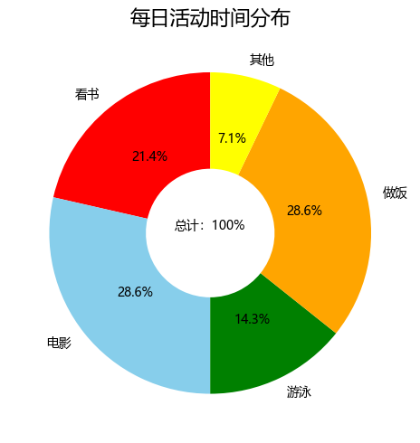
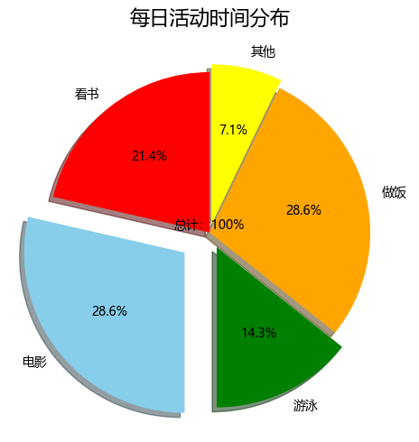
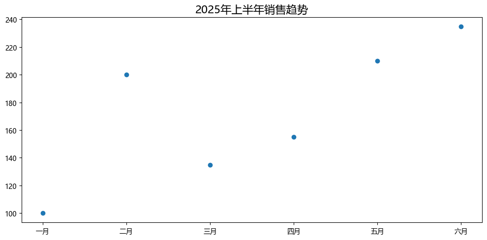
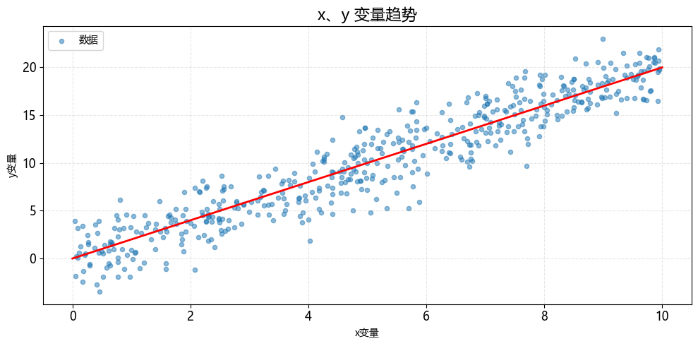
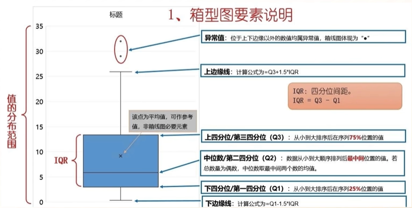
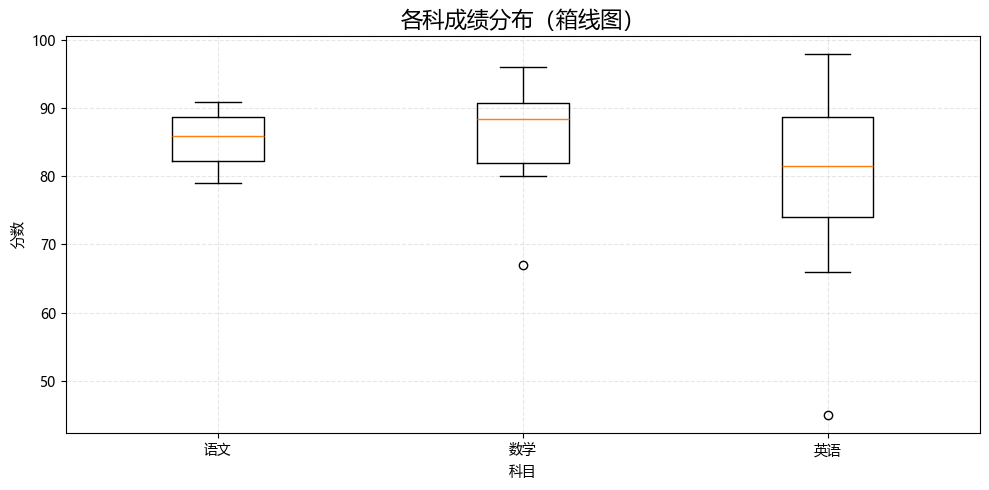
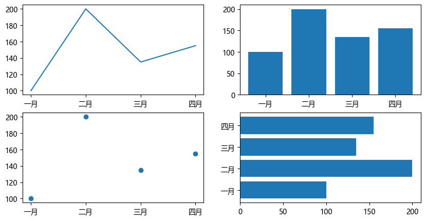

## matplotlib

### 一、统计图

```python
# 安装依赖
pip install matplotlib
```


#### 1. 折线图


```python
import matplotlib.pyplot as plt
from matplotlib import rcParams

rcParams['font.family'] = 'Microsoft YaHei'

# 设置图表大小
plt.figure(figsize=(10, 5))

month = ['一月', '二月', '三月', '四月']
sales = [100, 200, 135, 155]

# 绘制折线图
plt.plot(month, sales, label='steam deck', color='orange', linewidth=2, marker='o')

# 标题
plt.title('2025年销售数据', fontsize=16)

# 坐标轴标签
plt.xlabel('月份')
plt.ylabel('销售额（万元）')

# 图例
plt.legend(loc='upper left')

# 背景
plt.grid(axis='y', alpha=0.3, linestyle='--')

# 设置刻度的样式（可选）
plt.xticks(rotation=10, fontsize=12)
plt.yticks(rotation=0, fontsize=12)

# y轴范围
plt.ylim(0, 250)

# 在每个坐标点上显示数值
for x, y in zip(month, sales):
    plt.text(x, y + 5, str(y), ha='center', va='bottom', fontsize=11)

plt.show()
```


#### 2. 条形图


```python
import matplotlib.pyplot as plt
from matplotlib import rcParams

rcParams['font.family'] = 'Microsoft YaHei'

# 设置图表大小
plt.figure(figsize=(10, 5))

subjects = ['语文', '数学', '英语', '思政']
scores = [93, 96, 60, 90]

# bar 纵向柱状图
plt.bar(subjects, scores, label='学生：孙笑川', width=0.3)

# 标题
plt.title('期末成绩', fontsize=16)

# 坐标轴标签
plt.xlabel('科目')
plt.ylabel('分数')

# 图例
plt.legend(loc='upper left')

# 背景
plt.grid(axis='y', alpha=0.3, linestyle='--')

# 设置刻度的样式（可选）
plt.xticks(rotation=0, fontsize=12)
plt.yticks(rotation=0, fontsize=12)

# y轴范围
plt.ylim(0, 100)

# 在每个坐标点上显示数值
for x, y in zip(subjects, scores):
    plt.text(x, y + 5, str(y), ha='center', va='bottom', fontsize=11)

# 自动优化排版
plt.tight_layout()

plt.show()
```


```python
import matplotlib.pyplot as plt
from matplotlib import rcParams

rcParams['font.family'] = 'Microsoft YaHei'

# 设置图表大小
plt.figure(figsize=(10, 5))

subjects = ['孙笑川', '药水哥', 'Giao哥', '刘波']
scores = [9.3, 9.6, 8.0, 9.0]

# barh 横向柱状图
plt.barh(subjects, scores, label='成绩', color='orange')

# 标题
plt.title('50米短跑成绩', fontsize=16)

# 坐标轴标签
plt.xlabel('用时')
plt.ylabel('学生')

# 图例
plt.legend(loc='upper right')

# 背景
plt.grid(axis='x', alpha=0.3, linestyle='--')

# 设置刻度的样式（可选）
plt.xticks(rotation=0, fontsize=12)
plt.yticks(rotation=0, fontsize=12)

# x轴范围
plt.xlim(0, 15)

# 在每个坐标点上显示数值
for index, score in enumerate(scores):
    plt.text(score + 0.5, index, f'{score}', ha='left', va='bottom', fontsize=11)

# 自动优化排版
plt.tight_layout()

plt.show()
```


#### 3. 饼图


```python
import matplotlib.pyplot as plt
from matplotlib import rcParams

rcParams['font.family'] = 'Microsoft YaHei'

# 设置图表大小
plt.figure(figsize=(10, 5))

things = ['看书', '电影', '游泳', '做饭', '其他']
times = [1.5, 2, 1, 2, 0.5]
# 配色
colors = ['red', 'skyblue', 'green', 'orange', 'yellow']

# autopct 显示占比
# startangle 初始画图的角度
# colors 饼图配色
# wedgeprops 圆环半径
# pctdistance 百分比显示位置
plt.pie(times, labels=things, autopct='%.1f%%', startangle=90, colors=colors, wedgeprops={'width': 0.6},
        pctdistance=0.6)

# 标题
plt.title('每日活动时间分布', fontsize=16)
plt.text(0, 0, '总计：100%', ha='center', va='bottom', fontsize=10)

# 自动优化排版
plt.tight_layout()

plt.show()
```





```python
import matplotlib.pyplot as plt
from matplotlib import rcParams

rcParams['font.family'] = 'Microsoft YaHei'

# 设置图表大小
plt.figure(figsize=(10, 5))

things = ['看书', '电影', '游泳', '做饭', '其他']
times = [1.5, 2, 1, 2, 0.5]
# 配色
colors = ['red', 'skyblue', 'green', 'orange', 'yellow']
# 爆炸式饼图，设置突出块
explode = (0, 0.2, 0.1, 0, 0.05)

# autopct 显示占比
# startangle 初始画图的角度
# colors 饼图配色
# wedgeprops 圆环半径
# pctdistance 百分比显示位置
plt.pie(times, labels=things, autopct='%.1f%%', startangle=90, colors=colors, pctdistance=0.6, explode=explode,
        shadow=True)

# 标题
plt.title('每日活动时间分布', fontsize=16)
plt.text(0, 0, '总计：100%', ha='center', va='bottom', fontsize=10)

# 自动优化排版
plt.tight_layout()

plt.show()
```




#### 4. 散点图


```python
import matplotlib.pyplot as plt
from matplotlib import rcParams

rcParams['font.family'] = 'Microsoft YaHei'

# 设置图表大小
plt.figure(figsize=(10, 5))

month = ['一月', '二月', '三月', '四月', '五月', '六月']
sales = [100, 200, 135, 155, 210, 235]

# 绘制散点图
plt.scatter(month, sales)

# 标题
plt.title('2025年上半年销售趋势', fontsize=16)

# 自动优化排版
plt.tight_layout()

plt.show()
```




```python
import matplotlib.pyplot as plt
from matplotlib import rcParams
import random

rcParams['font.family'] = 'Microsoft YaHei'

# 设置图表大小
plt.figure(figsize=(10, 5))

x = []
y = []

for i in range(500):
    temp = random.uniform(0, 10)
    x.append(temp)
    y.append(2 * temp + random.gauss(0, 2))

# 绘制散点图
plt.scatter(x, y, alpha=0.5, s=20, label='数据')

# 标题
plt.title('x、y 变量趋势', fontsize=16)

# 坐标轴标签
plt.xlabel('x变量')
plt.ylabel('y变量')

# 图例
plt.legend(loc='upper left')

# 背景
plt.grid(True, alpha=0.3, linestyle='--')

# 设置刻度的样式（可选）
plt.xticks(rotation=0, fontsize=12)
plt.yticks(rotation=0, fontsize=12)

# y轴范围
# plt.ylim(0, 30)

# 回归线
plt.plot([0, 10], [0, 20], color='red', linewidth=2)

# 自动优化排版
plt.tight_layout()

plt.show()
```




#### 5. 箱线图




```python
import matplotlib.pyplot as plt
from matplotlib import rcParams

rcParams['font.family'] = 'Microsoft YaHei'

# 设置图表大小
plt.figure(figsize=(10, 5))

data = {
    "语文": [88, 82, 85, 89, 91, 80, 79, 83, 87, 89],
    "数学": [90, 91, 80, 67, 85, 88, 93, 96, 81, 89],
    "英语": [96, 88, 83, 45, 89, 73, 77, 80, 98, 66],
}

# 绘制箱线图
plt.boxplot(data.values(), tick_labels=data.keys())

# 标题
plt.title('各科成绩分布（箱线图）', fontsize=16)

# 坐标轴标签
plt.xlabel('科目')
plt.ylabel('分数')

# 背景
plt.grid(True, alpha=0.3, linestyle='--')

# 自动优化排版
plt.tight_layout()

plt.show()
```





#### 6. 绘制多个图


```python
import matplotlib.pyplot as plt
from matplotlib import rcParams

rcParams['font.family'] = 'Microsoft YaHei'

# 设置图表大小
plt.figure(figsize=(10, 5))

# data
month = ['一月', '二月', '三月', '四月']
sales = [100, 200, 135, 155]

# subplot 行 列 索引
p1 = plt.subplot(2, 2, 1)
p1.plot(month, sales)

p2 = plt.subplot(2, 2, 2)
p2.bar(month, sales)

p2 = plt.subplot(2, 2, 3)
p2.scatter(month, sales)

p2 = plt.subplot(2, 2, 4)
p2.barh(month, sales)
```



