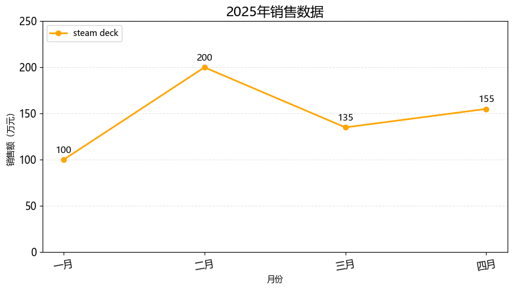
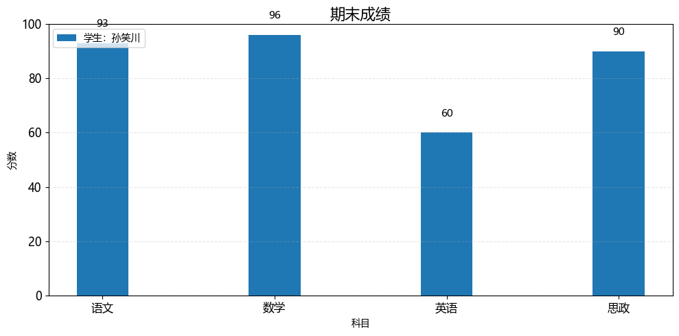
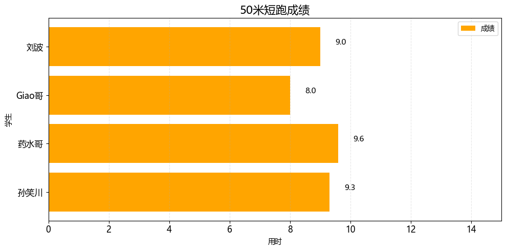

## matplotlib

### 一、统计图

```python
# 安装依赖
pip install matplotlib
```


#### 1. 折线图


```python
import matplotlib.pyplot as plt
from matplotlib import rcParams

rcParams['font.family'] = 'Microsoft YaHei'

# 设置图表大小
plt.figure(figsize=(10, 5))

month = ['一月', '二月', '三月', '四月']
sales = [100, 200, 135, 155]

# 绘制折线图
plt.plot(month, sales, label='steam deck', color='orange', linewidth=2, marker='o')

# 标题
plt.title('2025年销售数据', fontsize=16)

# 坐标轴标签
plt.xlabel('月份')
plt.ylabel('销售额（万元）')

# 图例
plt.legend(loc='upper left')

# 背景
plt.grid(axis='y', alpha=0.3, linestyle='--')

# 设置刻度的样式（可选）
plt.xticks(rotation=10, fontsize=12)
plt.yticks(rotation=0, fontsize=12)

# y轴范围
plt.ylim(0, 250)

# 在每个坐标点上显示数值
for x, y in zip(month, sales):
    plt.text(x, y + 5, str(y), ha='center', va='bottom', fontsize=11)

plt.show()
```




#### 2. 条形图


```python
import matplotlib.pyplot as plt
from matplotlib import rcParams

rcParams['font.family'] = 'Microsoft YaHei'

# 设置图表大小
plt.figure(figsize=(10, 5))

subjects = ['语文', '数学', '英语', '思政']
scores = [93, 96, 60, 90]

# bar 纵向柱状图
plt.bar(subjects, scores, label='学生：孙笑川', width=0.3)

# 标题
plt.title('期末成绩', fontsize=16)

# 坐标轴标签
plt.xlabel('科目')
plt.ylabel('分数')

# 图例
plt.legend(loc='upper left')

# 背景
plt.grid(axis='y', alpha=0.3, linestyle='--')

# 设置刻度的样式（可选）
plt.xticks(rotation=0, fontsize=12)
plt.yticks(rotation=0, fontsize=12)

# y轴范围
plt.ylim(0, 100)

# 在每个坐标点上显示数值
for x, y in zip(subjects, scores):
    plt.text(x, y + 5, str(y), ha='center', va='bottom', fontsize=11)

# 自动优化排版
plt.tight_layout()

plt.show()
```




```python
import matplotlib.pyplot as plt
from matplotlib import rcParams

rcParams['font.family'] = 'Microsoft YaHei'

# 设置图表大小
plt.figure(figsize=(10, 5))

subjects = ['孙笑川', '药水哥', 'Giao哥', '刘波']
scores = [9.3, 9.6, 8.0, 9.0]

# barh 横向柱状图
plt.barh(subjects, scores, label='成绩', color='orange')

# 标题
plt.title('50米短跑成绩', fontsize=16)

# 坐标轴标签
plt.xlabel('用时')
plt.ylabel('学生')

# 图例
plt.legend(loc='upper right')

# 背景
plt.grid(axis='x', alpha=0.3, linestyle='--')

# 设置刻度的样式（可选）
plt.xticks(rotation=0, fontsize=12)
plt.yticks(rotation=0, fontsize=12)

# x轴范围
plt.xlim(0, 15)

# 在每个坐标点上显示数值
for index, score in enumerate(scores):
    plt.text(score + 0.5, index, f'{score}', ha='left', va='bottom', fontsize=11)

# 自动优化排版
plt.tight_layout()

plt.show()
```

