## seaborn

```python
# 安装依赖
pip install seaborn
```


### 一、统计图


```python
import pandas as pd
import seaborn as sns
import matplotlib.pyplot as plt
from matplotlib import rcParams

rcParams['font.family'] = 'Microsoft YaHei'

# 设置图表大小
plt.figure(figsize=(10, 5))

# data
penguins = pd.read_csv('static/2_pandas/data/penguins.csv')
penguins.dropna(inplace=True)
# penguins.head()
```


#### 1. 直方图


```python
sns.histplot(data=penguins, x='species')

<Axes: xlabel='species', ylabel='Count'>
```


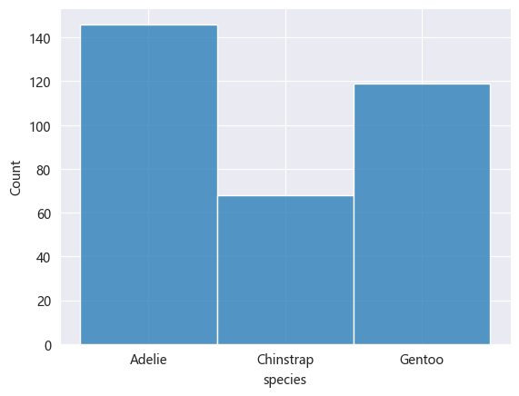


#### 2. 核密度估计图

核密度估计图（KDE，Kernel Density Estimate Plot）用于显示数据分布，其通过平滑直方图的方法来估计数据的概率密度函数，使得分布图看起来更加连续、平滑。

核密度估计是一种非参数方法，用于估计随机变量的概率密度函数。其基本思想是将每个数据点视为一个”核（高斯分布）“，然后将这些核的贡献相加以构成平滑的密度曲线。


```python
# 喙长度 - 核密度估计图
sns.kdeplot(data=penguins, x='bill_length_mm')

<Axes: xlabel='bill_length_mm', ylabel='Density'>
```

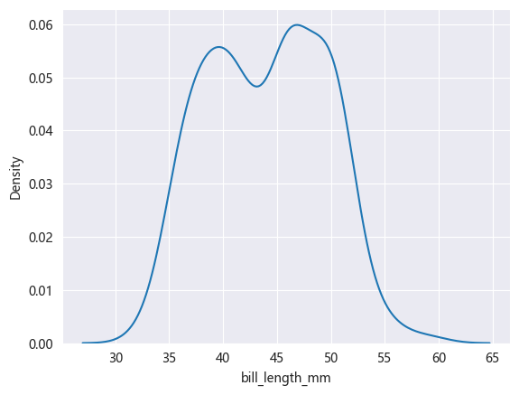


```python
sns.histplot(data=penguins, x='bill_length_mm', kde=True)

<Axes: xlabel='bill_length_mm', ylabel='Count'>
```

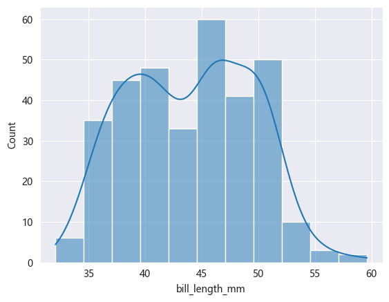


#### 3. 计数图

计数图用于绘制分类变量的计数分布图，显示每个类别在数据集中出现的次数，可以快速了解类别的分布情况。


```python
# 不同岛屿的企鹅分布数量
sns.countplot(data=penguins, x='island')

<Axes: xlabel='island', ylabel='count'>
```

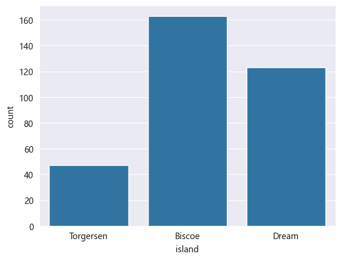


#### 4. 散点图


```python
# x：体重，y：脚蹼长度
# hue参数可设置通过不同”分类“进行比对
sns.scatterplot(data=penguins, x='body_mass_g', y='flipper_length_mm', hue='sex')

<Axes: xlabel='body_mass_g', ylabel='flipper_length_mm'>
```

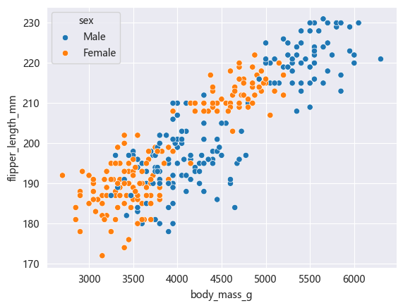


#### 5. 蜂窝图


```python
# kind='hex'
sns.jointplot(data=penguins, x='body_mass_g', y='flipper_length_mm', kind='hex')

<seaborn.axisgrid.JointGrid at 0x239c7cddc40>
```

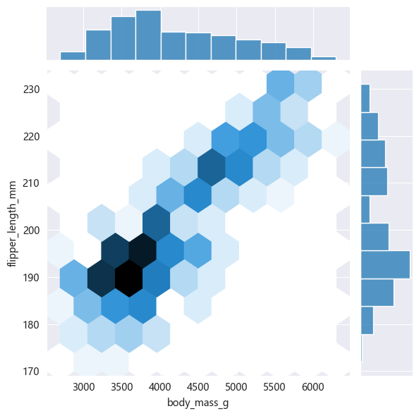


#### 6. 二维核密度估计图


```python
# 同时设置参数x和y
sns.kdeplot(data=penguins, x='body_mass_g', y='flipper_length_mm')

<Axes: xlabel='body_mass_g', ylabel='flipper_length_mm'>
```

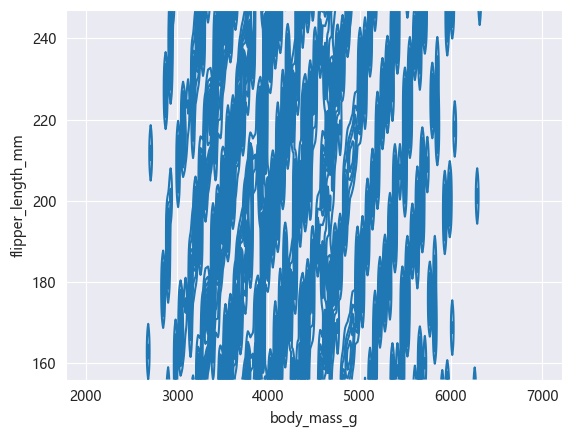


```python
# fill 填充
# cbar 颜色示意条
sns.kdeplot(data=penguins, x='body_mass_g', y='flipper_length_mm', fill=True, cbar=True)

<Axes: xlabel='body_mass_g', ylabel='flipper_length_mm'>
```

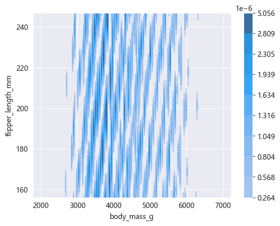


#### 7. 条形图


```python
sns.barplot(data=penguins, x='species', y='bill_length_mm', estimator='mean', errorbar=None)

<Axes: xlabel='species', ylabel='bill_length_mm'>
```


#### 8. 箱线图


```python
sns.boxplot(data=penguins, x='species', y='bill_length_mm')

<Axes: xlabel='species', ylabel='bill_length_mm'>
```

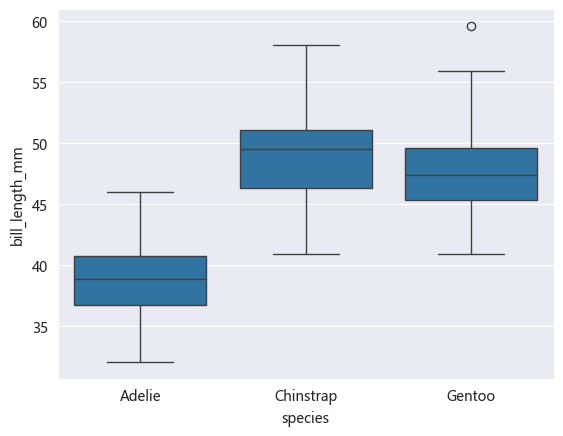


#### 9. 小提琴图

小提琴图（Violin Plot）是一种结合了箱线图和核密度估计图的可视化图表，用于展示数据的分布情况、集中趋势、散布情况以及异常值，不仅可以显示数据的基本统计量（中位数、四分位数等），还可以展示数据的概率密度。


```python
sns.violinplot(data=penguins, x='species', y='bill_length_mm')

<Axes: xlabel='species', ylabel='bill_length_mm'>
```

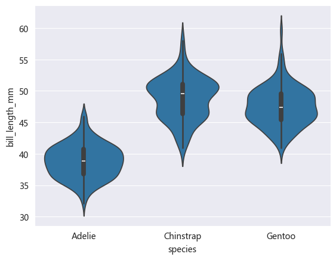


#### 10. 成对关系图

成对关系图是一种用于显示多个变量之间关系的可视化图表，其对角线上的图通常显示每个变量的分布，即单变量特性，其他位置的图用于展示所有变量的两两关系。


```python
sns.pairplot(penguins, hue='species')

<seaborn.axisgrid.PairGrid at 0x239c979de20>
```

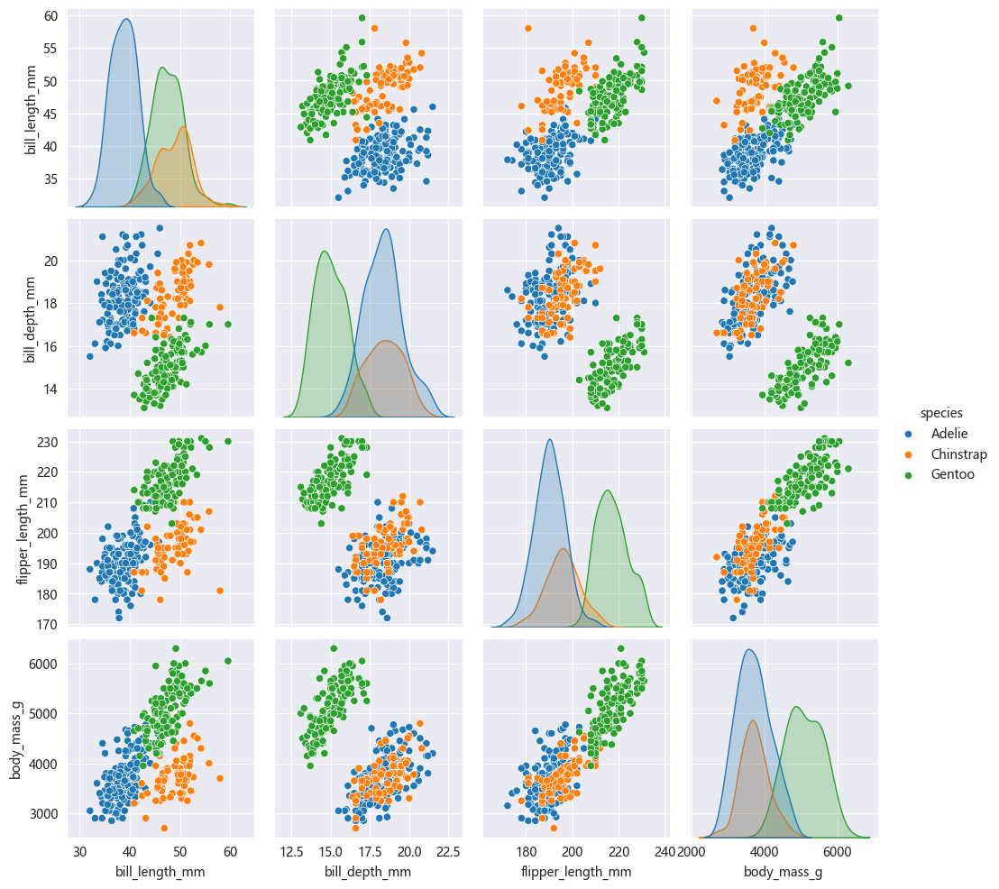