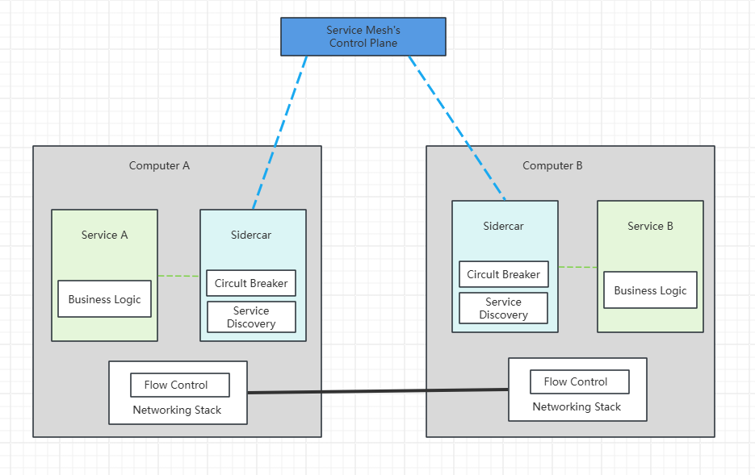
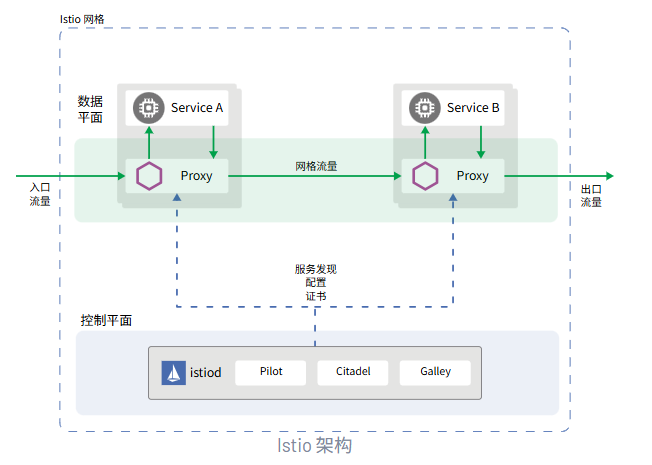
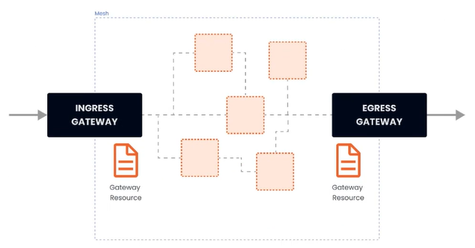

## Istio

### 一、服务网格

服务网格（Service Mesh）是一个专用的基础架构层，用于管理分布式应用程序中各个微服务之间的通信。它充当透明且分散的代理网络，并且部署在应用服务旁边，这些代理通常被称为 **Sidercar**，用于处理服务间的网络调用，限流，熔断，负载均衡等。



当微服务（Service）集群扩大到一定规模后，就形成了网格状（Mesh），即 Service Mesh 形态


### 二、Istio

官网：https://istio.io/latest/zh/

Istio 是一种开源服务网格，可透明地分层到现有的分布式应用程序上。 Istio 的强大功能提供了一种统一且更高效的方式来保护、连接和监控服务。 Istio 是实现负载均衡、服务到服务身份验证和监控的途径 - 几乎无需更改服务代码。包含以下功能：

- 使用双向 TLS 加密、强大的基于身份的身份验证和鉴权在集群中保护服务到服务通信
- HTTP、gRPC、WebSocket 和 TCP 流量的自动负载均衡
- 使用丰富的路由规则、重试、故障转移和故障注入对流量行为进行细粒度控制
- 支持访问控制、限流和配额的可插入策略层和配置 API
- 集群内所有流量（包括集群入口和出口）的自动指标、日志和链路追踪



Istio 服务网格从逻辑上划分为**数据平面**和**控制平面**

- 数据平面：由一组被部署为 Sidercar 的智能代理（Envoy）组成，负责协调和控制微服务之间的所有网络通信，同时也收集和报告所有网格流量的遥测数据
- 控制平面：管理、配置代理，进行流量路由


### 三、安装

*以 istioctl 为例*

```bash
# 下载
curl -L https://istio.io/downloadIstio | sh -
cd istio-1.28.1
export PATH=$PWD/bin:$PATH
```

安装目录包含：

- `samples/` 目录下的示例应用
- `bin/` 目录下的 [`istioctl`](https://istio.io/latest/zh/docs/reference/commands/istioctl) 客户端可执行文件。

```bash
# 安装
istioctl install --set profile=demo -y
        |\          
        | \         
        |  \        
        |   \       
      /||    \      
     / ||     \     
    /  ||      \    
   /   ||       \   
  /    ||        \  
 /     ||         \ 
/______||__________\
____________________
  \__       _____/  
     \_____/        

✔ Istio core installed ⛵️                                                                                          
✔ Istiod installed 🧠                                                                                             
✔ Ingress gateways installed 🛬                                                                                   
✔ Egress gateways installed 🛫                                                                                    
✔ Installation complete 
```

istio 提供的几种内置配置，这些配置文件提供了对 Istio 控制平面和 Istio 数据平面 Sidecar 的定制内容:

- **default**：根据 `IstioOperator` API 的默认设置启动组件。 建议用于生产部署和 [Multicluster Mesh](https://istio.io/latest/zh/docs/ops/deployment/deployment-models/#multiple-clusters) 中的 Primary Cluster。

  您可以运行 `istioctl profile dump` 命令来查看默认设置。

- **demo**：这一配置具有适度的资源需求，旨在展示 Istio 的功能。 它适合运行 [Bookinfo](https://istio.io/latest/zh/docs/examples/bookinfo/) 应用程序和相关任务。 

  此配置文件启用了高级别的追踪和访问日志，因此不适合进行性能测试。

- **minimal**：与默认配置文件相同，但只安装了控制平面组件， 它允许您使用 [Separate Profile](https://istio.io/latest/zh/docs/setup/upgrade/gateways/#installation-with-istioctl) 配置控制平面和数据平面组件(例如 Gateway)。

- **remote**：配置 [Multicluster Mesh](https://istio.io/latest/zh/docs/ops/deployment/deployment-models/#multiple-clusters) 的 Remote Cluster。

- **empty**：不部署任何东西。可以作为自定义配置的基本配置文件。

- **preview**：预览文件包含的功能都是实验性。这是为了探索 Istio 的新功能，不确保稳定性、安全性和性能（使用风险需自负）。

|                        | default | demo | minimal | remote | empty | preview |
| ---------------------- | ------- | ---- | ------- | ------ | ----- | ------- |
| 核心组件               |         |      |         |        |       |         |
| `istio-egressgateway`  |         | ✔    |         |        |       |         |
| `istio-ingressgateway` | ✔       | ✔    |         |        |       | ✔       |
| `istiod`               | ✔       | ✔    | ✔       |        |       | ✔       |

```bash
# 给命名空间添加标签，指示 Istio 在部署应用的时候，自动注入 Envoy Sidecar 代理
kubectl label namespace [default] istio-injection=enabled
```


安装 Kubernetes Gateway API CRD

Kubernetes Gateway API CRD 在大多数 Kubernetes 集群上不会默认安装， 在使用 Gateway API 之前需要安装

```bash
$ kubectl get crd gateways.gateway.networking.k8s.io &> /dev/null || \
   { kubectl kustomize "github.com/kubernetes-sigs/gateway-api/config/crd?ref=v1.4.0" | kubectl app
```


### 四、流量管理

#### 1. Gateway

在安装 istio 的时候，同时安装了入口和出口网关，这两个网关都运行了一个 Envoy 代理实例，它们在网格的边缘作为负载均衡器的角色。



gateway 资源实例：

```yaml
apiVersion: networking.istio.io/v1alpha3
  kind: Gateway
  metadata:
    name: gateway-demo
    namespace: default
  spec:
    selector:
      istio: ingressgateway
    servers:
    - port:
        number: 80
        name: http
        protocol: HTTP
      hosts:
      - dev.example.com
      - test.example.com

```

上述示例做了哪些事：

- 配置了一个代理，作为负载均衡器
- 服务端口为80
- 应用于 istio 入口网关代理
- hosts 字段作为过滤器，只有以 dev.example.com 和 test.example.com 为目的地的流量才允许通过

为了控制和转发流量到集群内运行的实际实例，还需要配置 VirtualService，并与网关相连接。


（1）简单路由实例

部署 nginx，并通过 istio 网关进行访问

```yaml
---
apiVersion: apps/v1
kind: Deployment
metadata:
  namespace: test
  name: nginx
  labels:
    app: nginx
spec:
  replicas: 1
  selector:
    matchLabels:
      app: nginx
  template:
    metadata:
      labels:
        app: nginx
    spec:
      restartPolicy: Always
      containers:
        - image: 'nginx:latest'
          imagePullPolicy: IfNotPresent
          name: nginx
          env:
            - name: TZ
              value: Asia/Shanghai
          ports:
            - containerPort: 80
              protocol: TCP

---
apiVersion: v1
kind: Service
metadata:
  namespace: test
  name: nginx
  labels:
    app: nginx
spec:
  ports:
    - port: 80
      targetPort: 80
      protocol: TCP
  selector:
    app: nginx
```

```yaml
# 网关
apiVersion: networking.istio.io/v1alpha3
kind: Gateway
metadata:
  name: gateway-nginx
  namespace: test
spec:
  selector:
    istio: ingressgateway
  servers:
  - port:
      number: 80
      name: http
      protocol: HTTP
    hosts:
      - '*'
```

在未绑定 VirtualService 之前，网关还不知道要将流量路由到哪

```yaml
apiVersion: networking.istio.io/v1alpha3
kind: VirtualService
metadata:
  name: virtualService-nginx
  namespace: test
spec:
  hosts:
    - '*'
  gateways:
    - gateway-nginx
  http:
    - route:
      - destination:
          host: nginx.test.svc.cluster.local
          port: 80
```

部署完之后，通过 curl -v x.x.x.x 即可测试


#### 2. VirtualService

通过 VirtualService，可以定义流量路由规则

| 字段名                  | 说明                                                         |
| ----------------------- | ------------------------------------------------------------ |
| spec.hosts              | 定义路由规则关联一组的hosts，可以是带有通配符的DNS名称或者IP地址（IP地址仅能应用于来源流量为边缘代理网关）。该字段能应用于 HTTP 和 TCP 流量。在 Kubernetes 环境中，可以使用 service 的名称作为缩写，lstio 会按照 VirtualService 所在 namespace 补齐缩写，例如在 default namespace 的 VirtualService 包含 host 缩写 reviews 会被补齐为 reviews.default.svc.cluster.local，为避免误配置，推荐填写 host 全称。 |
| spec.gateway            | 定义应用路由规则的来源流量，可以是一个或多个网关，或网格内部的 sidecar，指定方式为[gateway namespace]/[gateway name]，保留字段 mesh 表示网格内部所有的 sidecar，当该参数缺省时,会默认填写 mesh，即该路由规则的来源流量为网格内部所有的 sidecar。 |
| spec.http               | 定义一组有序的（优先匹配靠前的路由规则）应用于 HTTP 流量的路由规则，HTTP 路由规则会应用于网格内部的 service 端口命名为http-， http2-，grpc- 开头的流量以及来自 gateway 的协议为 HTTP，HTTP2，GRPC，TLS-Terminated-HTTPS 的流量。 |
| spec.http.match         | 定义路由的匹配规则列表，单个匹配规则项内所有条件是且关系，多个匹配规则之间为或关系。 |
| spec.http.route         | 定义路由转发目的地列表，一条 HTTP 路由可以是重定向或转发（默认)，转发的目的地可以是一个或多个服务（服务版本），同时也可以配置权重、header 操作等行为。 |
| spec.http.redirect      | 定义路由重定向，一条 HTTP 路由可以是重定向或转发（默认），如规则中指定了 passthrough 选项，route.redirect 均会被忽略，可将 HTTP 301重定向到另外的 URL 或Authority。 |
| spec.http.rewrite       | 定义重写HTTP URL 或 Authority headers，不能与重定向同时配置，重写操作会在转发前执行。 |
| spec.http.timeout       | 请求超时时间                                                 |
| spec.http.retries       | 请求重试次数                                                 |
| spec.http.fault         | 故障注入策略，开启时超时和重试策略不生效                     |
| spec.http.mirror        | 定义将 HTTP 流量复制到另一个指定的目的端，被复制的流量按照“best effort”原则，sidecar / 网关不会等待复制流量的响应结果就会从源目的端返回响应。 |
| spec.http.mirrorPercent | 定义镜像流量的复制百分比，默认值为100，即100%                |
| spec.http.corsPolicy    | 定义 CORS 策略                                               |
| spec.http.headers       | 定义 header 操作规则，包括 request 和 response header 的增删改。 |
| spec.tcp                | 定义一组有序的（优先匹配靠前的路由规则）应用于 TCP 流量的路由规则，该规则会应用于任何非 HTTP 和 TLS 的端口。 |
| spec.tcp.match          | 定义路由的匹配规则列表，单个匹配规则项内所有条件是且关系，多个匹配规则之间为或关系。 |
| spec.tcp.route          | 定义 TCP 连接转发的目的端。                                  |
| spec.tls                | 定义一组有序的（优先匹配靠前的路由规则）应用于未终止的 TLS 或 HTTPS 流量的路由规则，该路由规则会应用于网格内部的 service 端口命名为 https-，tls- 开头的流量，来自 gateway 的端口协议为 HTTPS，TLS 的未终止加密流量，ServiceEntry 使用 HTTPS，TLS 协议的端口，当 https-，tls- 端口未关联 VirtualService 规则时将会被视为 TCP 流量。 |
| spec.tls.match          | 定义 TLS 流量路由的匹配规则列表，单个匹配规则项内所有条件是且关系，多个匹配规则之间为或关系。 |
| spec.tls.route          | 定义连接转发的目的端                                         |


##### 2.1 route

HTTP Route 规则的功能：满足 HTTPMatchRequest 条件的流量都会被路由到 HTTPRouteDestination，执行重定向（HTTPRedirect）、重写（HTTPRewrite）、重试（HTTPRetry）、故障注入（HTTPFaultInjection）、跨站（CorsPolicy）等策略。


##### 2.2 match

match 是路由的匹配规则，支持 uri、scheme、method、authority 等字段，且支持 perfix（前缀）、exact（精确）、regex（正则）三种匹配模式：

```yaml
# 匹配 uri 以 test 开头的请求
- match:
  - uri:
    prefix: "/test"
```

```yaml
# 匹配 header 中 key 为 source，value 为 abc 的请求
- match:
  - headers:
    source:
      exact: abc
```

```yaml
# 根据来源标签匹配
- match:
  sourceLabels:
    app: nginx
    version: v1
```

```yaml
# 匹配 header 中 key 为 source，value 为 test1 的请求 或 uri 以 test2 开头的请求
- match:
  - headers:
    source:
      exact: abc
    uri:
    prefix: "/test1"
  - uri:
    prefix: "/test2"
```


##### 2.3 路由目标（RouteDestionation）

在 HTTPRouteDestionation 中主要包含三个字段：destination（请求目标）、weight（权重）、headers（请求头），其中 destination 必填。

- destination：通过 host、subset 和 port 三个属性描述，表示最终将流量路由到此目标。host 是 Destination 必选字段，表示在 lstio 中注册的服务名（建议写全域名），subset 表示在 host 上定义的一个子集，如：在灰度发布中将版本定义为 subset，配置路由策略会将流量转发到不同版本的 subset 上。

  ```yaml
  spec:
    hosts:
      - test.com
    http:
      - route:
        - destination:
            host: test.com
            subset: v1
          destination:
            host: test.com
            subset : v2
  ```

- weight：表示流量分配的比例，在一个 route 下多个 destination 的 weight 总和要求是100（默认100，必填字段）。如：从原有的 v1 版本中切分 20% 的流量到 v2 版本，这也是灰度发布常用的一个流量策略，即不区分内容，平等的从总流量中切出一部分流量给新版本。

  ```yaml
  spec:
    hosts:
      - test.com
    http:
      - route:
        - destination:
            host: test.com
            subset: v1
            weight: 80
          destination:
            host: test.com
            subset : v2
            weight: 20
  ```

- headers：提供了对 HTTP header 的一种操作机制，可以修改一次 HTTP 请求中的Request 或 Response 的值，包含 request 和 response 两个字段。

  - request：表示在发请求给目标地址时修改 Request 的 header
  - response：表示在返回应答时修改 Response 的 header
  - 对应的类型都是 HeaderOperations 类型，使用set、add、remove字段来定义对 Header 的操作
    - set：使用map上的key和value覆盖 Request 和 Response 中对应的 Header
    - add：追加map上的key和value到原有的 Header
    - remove：删除在列表中指定的 Header


##### 2.4 HTTP重定向（HTTPRedirect）

HTTPRedirect 包含两个字段来表示重定向的目标：

- uri：替换 URL 中的 uri 部分
- authority：替换 URL 中的 authority 部分

```yaml
# 对 nginx 服务中，所有前缀为 test1 的请求都会被重定向到 new-test 的 /test/a1 地址
apiVersion: networking.istio.io/v1alpha3
kind: VirtualService
metadata:
  name: nginx
  namespace: test
spec:
  hosts:
    - test.com
  http:
    - match:
      - uri:
          prefix: /test1
        redirect:
          uri: /test/a1
          authority: new-test.com
```


##### 2.5 HTTP重写（HTTPRewrite）

通过 HTTP 重写可以在将请求转发给目标服务前修改 HTTP 请求中指定部分的内容，HTTP 重写对用户是不可见的（在服务端执行）

HTTPRewrite 包含两个字段：

- uri：重写 URL 中的 uri 部分
- authority：重写 URL 中的 authority 部分

和 HTTPRedirect 规则稍有不同的是，HTTPRedirect 的 uri 只能替换全部的 path，但 HTTPRewrite 的 uri 是可以重写前缀的，即匹配条件是前缀匹配，则只修改匹配到的前缀。

```yaml
# 将请求前缀中的 /test1 重写为 /test/a1
apiVersion: networking.istio.io/v1alpha3
kind: VirtualService
metadata:
  name: nginx
  namespace: test
spec:
  hosts:
    - test.com
  http:
    - match:
      - uri:
          prefix: /test1
        rewrite:
          uri: /test/a1
        route:
          - destination:
              host: new-test
```


##### 2.6 HTTP重试（HTTPRetry）

HTTPRetry 可以定义请求失败时的重试策略，包含三个字段：

- attempts：必选字段，定义重试的次数
- perTryTimeout：每次重试超时的时间，单位可以是 ms、s、m和h
- retryOn：进行重试的条件，多个条件时以逗号分隔
  - 5xx：在上游服务返回 5xx 应答码，或者在没有返回时重试
  - gateway-error：类似于5xx异常，只对502、503和504应答码进行重试
  - connect-failure：在链接上游服务失败时重试
  - retriable-4xx：在上游服务返回可重试的4xx应答码时执行重试
  - refused-stream：在上游服务使用 REFUSED_STREAM 错误码重置时执行重试
  - cancelled：gRPC 应答的 Header 中状态码是 cancelled 时执行重试
  - deadline-exceeded：在 gRPC 应答的 Header 中状态码是 deadline-exceeded 时执行重试
  - internal：在 gRPC 应答的 Header 中状态码是 internal 时执行重试
  - resource-exhausted：在 gRPC 应答的 Header 中状态码是 resource-exhausted 时执行重试
  - unavailable：在 gRPC 应答的 Header 中状态码是 unavailable 时执行重试

```yaml
apiVersion: networking.istio.io/v1alpha3
kind: VirtualService
metadata:
  name: nginx
  namespace: test
spec:
  hosts:
    - test.com
  http:
    - route:
        - destination:
            host: test.com
          retries:
           attempts: 3
           perTryTimeout: 5s
           retryOn: 5xx,connect-failure
```


##### 2.7 HTTP流量镜像（HTTPMirror）

HTTP 流量镜像指的是将流量转发到原目标地址的同时将流量给另外一个目标地址镜像一份。把生产环境中的实际流量镜像一份到另外一个系统上，完全不会对生产系统产生影响，这里只是镜像了一份流量，数据面代理只需要关注原来转发的流量就可以，不用等待镜像目标地址的返回。

```yaml
apiVersion: networking.istio.io/v1alpha3
kind: VirtualService
metadata:
  name: nginx
  namespace: test
spec:
  hosts:
    - test.com
  http:
    - route:
        - destination:
            host: test.com
            subset: v1
          mirror:
            host: test.net
            subset: v2
```


##### 2.8 HTTP故障注入（HTTPFaultInjection）

HTTPFaultInjection 通过 delay 和 abort 设置延时和中止两种故障，分别表示 Proxy 延迟转发和终止 HTTP 请求。

delay 包含以下两个字段：

- fixedDelay：必选，表示延迟时间，单位可以是毫秒，秒，分钟和小时，要求至少要大于1毫秒
- percentage：延时作用在多少比例的请求上

```yaml
# 让 1.5% 的请求延时 5s
apiVersion: networking.istio.io/v1alpha3
kind: VirtualService
metadata:
  name: nginx
  namespace: test
spec:
  hosts:
    - test.com
  http:
    - route:
        - destination:
            host: test.com
            subset: v1
          fault:
            delay:
              fixedDelay: 5s
              percentage:
                value: 1.5
```

abort 包含以下两个字段：

- httpStatus：必选，http 状态码
- percentage：终止故障作用在多少比例的请求上

```yaml
# 让 1.5% 的请求返回 500
apiVersion: networking.istio.io/v1alpha3
kind: VirtualService
metadata:
  name: nginx
  namespace: test
spec:
  hosts:
    - test.com
  http:
    - route:
        - destination:
            host: test.com
            subset: v1
          fault:
            abort:
              httpStatus: 500
              percentage:
                value: 1.5
```


##### 2.9 HTTP跨域资源共享（CorsPolicy）

在 VirtualService 中可以对满足条件的请求配置跨域资源共享，allowOrigin，allowMethods，allowHeader，exposeHeader，maxAge，allowCredentials，等都被转化为 Access-Control-* 的 Header。

```yaml
# 允许来自 new-test.com 的 GET 请求
apiVersion: networking.istio.io/v1alpha3
kind: VirtualService
metadata:
  name: nginx
  namespace: test
spec:
  hosts:
    - test.com
  http:
    - route:
        - destination:
            host: test.com
            subset: v1
          corsPolicy:
            allowOrigin:
              - new-test.com
            allowMethod:
              - GET
            maxAge: 2d
```


#### 五、DestinationRule

#### 1. 概念

| 字段名称                             | 说明                                                         |
| ------------------------------------ | ------------------------------------------------------------ |
| spec.host                            | 关联 DestinationRule 配置的服务名称，可以是自动发现的服务（例如Kubernetes service name），或通过 ServiceEntry 声明的 hosts。如填写的服务名无法在上述源中找到。则该 DestinationRule 中定义的规则无效 |
| spec.subsets                         | 定义服务的版本（subsets），版本可通过标签键值对匹配服务中的endpoints。可以在 subsets 级覆盖流量策略配置 |
| spec.trafficPolicy                   | 定义流量策略，包括负载均衡、连接池、健康检查、TLS 策略等     |
| spec.spec.trafficPolicy.loadBalancer | 配置负载均衡算法，可配置：简单负载均衡算法(round robin，least conn，random...) ，一致性哈希（会话保持，支持按 header name，cookie，IP，query parameter 哈希)，地域感知负载均衡算法 |
| spec.trafficPolicy.connectionPool    | 配置与上游服务的连接量，可设置 TCP/HTTP 连接池               |
| spec.trafficPolicy.outlierDetection  | 配置从负载均衡池中驱逐不健康的 hosts                         |
| spec.trafficPolicy.tls               | 连接上游服务的 client 端 TLS 相关配置，与 PeerAuthentication 策略（server 端 TLS 模式配置）配合使用 |
| spec.trafficPolicy.portLevelSettings | 配置端口级的流量策略，该策略会覆盖服务 / subsets 级别的流量策略配置 |

DestinationRule 在路由发生后应用于流量，支持如下配置：

- 负载均衡
- 连接池
- 局部异常点检测
- 客户端 TLS 配置
- 端口流量策略


#### 2. 负载均衡设置

通过负载均衡设置，可以控制目的地使用的负载均衡算法

```yaml
apiVersion: netweorking.istio.io/v1alpha3
kind: DestinationRule
metadata:
  name: nginx-destination
spec:
  host: nginx.test.svc.cluster.local
  trafficPolicy:
    loadBalancer:
      simple: ROUND_ROBIN # 轮询
    subsets:
      - name: v1
        labels:
          version: vl
      - name: v2
        labels:
          version: v2
```

- simple字段：

  - ROUND_ROBIN：轮询算法，如果未指定则默认采用这种算法

  - LEAST_CONN：最少连接算法，从两个随机选择的服务选择一个活动请求数较少的后端实例

  - RANDOM：从可用的健康实例中随机选择一个

  - PASSTHROUGH：直接转发连接到客户端连接的目标地址，即不做做负载均衡

- consistentHash 字段：
  - httpHeaderName：基于 Header
  - httpCookie：基于 Cookie
  -  useSourcelp：基于源 IP 计算哈希值
  - minimumRingSize：哈希环上虚拟节点数的最小值，节点数越多则负载均衡越精细

```yaml
trafficPolicy:
  loadBalancer:
    consistentHash:
      httpCokkie:
        name: location
        ttl: 2s
```


#### 3. 连接池配置

可以在 TCP 和 HTTP 层面应用于上游服务的每个主机，可以用它们来控制连接量

tcp 连接池配置：

- maxConnections：上游服务的所有实例建立的最大连接数，默认值1024，属于 TCP 层的配置，对于HTTP，只作用于 HTTP/1.1，因为 HTTP/2 对每个主机都使用单个连接
- connectTimeout：TCP 连接超时，表示主机网络连接超时，可以改善因调用服务变慢而导致整个链路变慢的情况
- tcpKeepalive：lstio1.1 版本开始新支持的配置，定期给对端发送一个 keepalive 探测包，判断连接是否可用

```yaml
spec:
  host: nginx.test.svc.cluster.local
  trafficPolicy:
    connectionPool:
      tcp:
        maxConnections: 50
        connectTimeout: 25ms
        tcpKeepalive:
          probes: 5
          time: 3600
          interval: 60s
```


http 连接池配置：

- http1MaxPendingRequests：最大等待 HTTP 请求数，默认值1024，只适用于 HTTP/1.1 的服务，因为 HTTP/2 协议的请求在到来时会立即复用连接，不会在连接池等待

- http2MaxRequests：最大请求数，默认值1024，只适用于 HTTP/2 服务，因为 HTTP/1.1 使用最大连接数 maxConnections 即可，表示上游服务的所有实例处理的最大请求数

- maxRequestsPerConnection：每个连接的最大请求数，HTTP/1.1 和 HTTP/2 连接池都遵循此参数，如果没有设置，则代表不限制

  设置为1时表示每个连接只处理一个请求，相当于禁用了 Keep-alive

- maxRetries：最大重试次数，默认值3，表示服务可以执行的最大重试次数。如果调用端因为偶发的抖动导致请求直接失败，则可能会带来业务损失，一般建议配置重试，若重试成功则可正常返回数据，只不过比原来响应得慢一点，但如果重试次数太多，会对性能造成一定的影响

- idleTimeout：空闲超时，即：在多长时间内没有活动请求则关闭连接

```yaml
# 配置最大80个连接，最多100个并发请求，每个请求的连接数不超过10个，超时时间为30ms
spec:
  host: nginx.test.cluster.local
  trafficPolicy:
    connectionPool:
      tcp:
        maxConnections: 80
        connectTimeout: 30ms
      http:
        http2MaxRequests: 100
        maxRequestsPerConnection: 10
```

