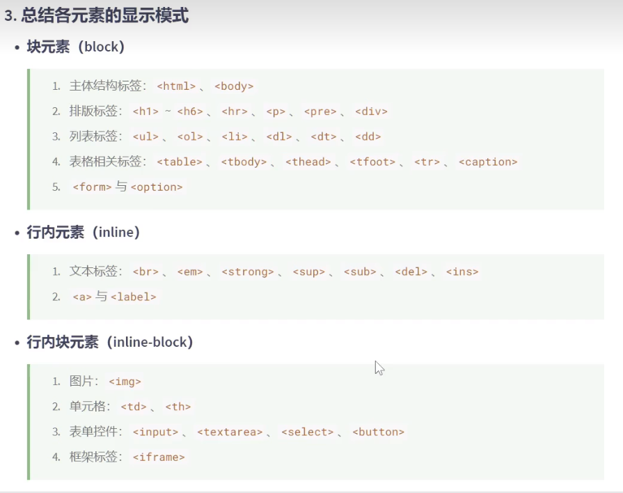

### 一、CSS的编写位置

**1. 行内样式**

```html
<!DOCTYPE html>
<html lang="zh-CN">
<head>
    <meta charset="UTF-8">
    <title>位置1_行内样式</title>
</head>
<body>
    <h1 style="color: green; font-size: 60px;">你好，孙笑川！</h1>
</body>
</html>
```


**2. 内部样式**

```html
<!DOCTYPE html>
<html lang="zh-CN">
<head>
    <meta charset="UTF-8">
    <title>位置2_内部样式</title>
    <style>
        h1{
            color: lightgreen;
            font-size: 60px;
        }
        h2{
            color: orange;
            font-size: 30px;
        }
        p{
            color: lightcoral;
            font-size: 25px;
        }
        img{
            width: 400px;
        }
    </style>
</head>
<body>
    <h1>你好，孙笑川！</h1>
    <h2>大家好，我是药水哥！</h2>
    <p>北京欢迎你</p>
    <p>上海欢迎你</p>
    <p>广州欢迎你</p>
    
</body>
</html>
```


**3. 外部样式**

position.css

```css
h1{
    color: lightgreen;
    font-size: 60px;
}
h2{
    color: orange;
    font-size: 30px;
}
p{
    color: lightcoral;
    font-size: 25px;
}
img{
    width: 400px;
}
```


```html
<!DOCTYPE html>
<html lang="zh-CN">
<head>
    <meta charset="UTF-8">
    <title>位置2_内部样式</title>
    <link rel="stylesheet" href="./position.css">
</head>
<body>
    <h1>你好，孙笑川！</h1>
    <h2>大家好，我是药水哥！</h2>
    <p>北京欢迎你</p>
    <p>上海欢迎你</p>
    <p>广州欢迎你</p>
    
</body>
</html>
```


### 二、样式表的优先级

```html
<!DOCTYPE html>
<html lang="zh-CN">
<head>
    <meta charset="UTF-8">
    <title>优先级</title>
    <link rel="stylesheet" href="../01_CSS的编写位置/position.css">
    <style>
        h1{
            color: red;
            font-size: 100px;
        }
    </style>
</head>
<body>
    <!-- 行内样式 > 内部样式 = 外部样式
         内部样式、外部样式优先级相同，且后写的会覆盖前写的
         同一个样式表中，优先级也和编写顺序有关
    -->
    <!-- <h1 style="color: aquamarine;">你好，孙笑川</h1> -->

    <h1>你好，孙笑川</h1>
</body>
</html>
```


### 三、语法规范

```html
<!DOCTYPE html>
<html lang="zh-CN">
<head>
    <meta charset="UTF-8">
    <title>语法规范</title>
    <style>
        h1 {
            /* 字体颜色 */
            color: cadetblue;
            font-size: 40px;
        }
    </style>
</head>
<body>
    <h1>你好，孙笑川</h1>
</body>
</html>
```


### 四、代码风格

```html
<!DOCTYPE html>
<html lang="zh-CN">
<head>
    <meta charset="UTF-8">
    <title>代码风格</title>
    <style>
        /* 展开风格 */
        /* h1 {
            color: aquamarine;
            font-size: 40px;
        } */
        /* 紧凑风格 */
        h1 {color: aquamarine;font-size: 40px;}
    </style>
</head>
<body>
    <h1>你好，孙笑川</h1>
</body>
</html>
```


### 五、基本选择器

**1. 通配选择器**

```html
<!DOCTYPE html>
<html lang="zh-CN">
<head>
    <meta charset="UTF-8">
    <title>通配选择器</title>
    <style>
        * {
            color: cadetblue;
            font-size: 16px;
        }
    </style>
</head>
<body>
    <h1>将进酒·君不见</h1>
    <p>【作者】李白 【朝代】唐</p>
    <pre>
    君不见，黄河之水天上来，奔流到海不复回。

    君不见，高堂明镜悲白发，朝如青丝暮成雪。

    人生得意须尽欢，莫使金樽空对月。

    天生我材必有用，千金散尽还复来。

    烹羊宰牛且为乐，会须一饮三百杯。

    岑夫子，丹丘生，将进酒，杯莫停。

    与君歌一曲，请君为我倾耳听。

    钟鼓馔玉不足贵，但愿长醉不愿醒。

    古来圣贤皆寂寞，惟有饮者留其名。

    陈王昔时宴平乐，斗酒十千恣欢谑。

    主人何为言少钱，径须沽取对君酌。

    五花马，千金裘，呼儿将出换美酒，与尔同销万古愁。
    </pre>
</body>
</html>
```


**2. 元素选择器**

```html
<!DOCTYPE html>
<html lang="zh-CN">
<head>
    <meta charset="UTF-8">
    <title>元素选择器</title>
    <style>
        h1 {
            color: chocolate;
        }
        h4 {
            color: green;
        }
        p {
            color: red;
            font-size: 16px;
        }
    </style>
</head>
<body>
    <h1>将进酒·君不见</h1>
    <h4>【作者】李白 【朝代】唐</h4>
    <p>君不见，黄河之水天上来，奔流到海不复回。</p>

    <p>君不见，高堂明镜悲白发，朝如青丝暮成雪。</p>

    <p>人生得意须尽欢，莫使金樽空对月。</p>

    <p>天生我材必有用，千金散尽还复来。</p>

    <p>烹羊宰牛且为乐，会须一饮三百杯。</p>

    <p>岑夫子，丹丘生，将进酒，杯莫停。</p>

    <p>与君歌一曲，请君为我倾耳听。</p>

    <p>钟鼓馔玉不足贵，但愿长醉不愿醒。</p>

    <p>古来圣贤皆寂寞，惟有饮者留其名。</p>

    <p>陈王昔时宴平乐，斗酒十千恣欢谑。</p>

    <p>主人何为言少钱，径须沽取对君酌。</p>

    <p>五花马，千金裘，呼儿将出换美酒，与尔同销万古愁。</p>

    <br/>
    <h1>静夜思</h1>
    <h4>【作者】李白 【朝代】唐</h4>
    <p>床前明月光，疑是地上霜。</p>

    <p>举头望明月，低头思故乡。</p>
</body>
</html>
```


**3. 类选择器**

```html
<!DOCTYPE html>
<html lang="zh-CN">
<head>
    <meta charset="UTF-8">
    <title>元素选择器</title>
    <style>
        /* 选中页面中所有类名为p1的元素 */
        .p1 {
            color: red;
        }
        /* 选中页面中所有类名为p2的元素 */
        .p2 {
            color: skyblue;
        }
        .p3 {
            font-size: 20px;
        }
    </style>
</head>
<body>
    <h1>将进酒·君不见</h1>
    <h4>【作者】李白 【朝代】唐</h4>
    <p class="p1">君不见，黄河之水天上来，奔流到海不复回。</p>

    <p class="p1">君不见，高堂明镜悲白发，朝如青丝暮成雪。</p>

    <p class="p1">人生得意须尽欢，莫使金樽空对月。</p>

    <p class="p1">天生我材必有用，千金散尽还复来。</p>

    <p class="p1">烹羊宰牛且为乐，会须一饮三百杯。</p>

    <p class="p1">岑夫子，丹丘生，将进酒，杯莫停。</p>

    <p class="p1">与君歌一曲，请君为我倾耳听。</p>

    <p class="p1">钟鼓馔玉不足贵，但愿长醉不愿醒。</p>

    <p class="p1">古来圣贤皆寂寞，惟有饮者留其名。</p>

    <p class="p1">陈王昔时宴平乐，斗酒十千恣欢谑。</p>

    <p class="p1">主人何为言少钱，径须沽取对君酌。</p>

    <p class="p1">五花马，千金裘，呼儿将出换美酒，与尔同销万古愁。</p>
    <span class="p1 p3">2023年10月19日22点41分</span>
    <br/>
    <h1>静夜思</h1>
    <h4>【作者】李白 【朝代】唐</h4>
    <p class="p2">床前明月光，疑是地上霜。</p>

    <p class="p2">举头望明月，低头思故乡。</p>
</body>
</html>
```


**4. ID选择器**

```html
<!DOCTYPE html>
<html lang="zh-CN">
<head>
    <meta charset="UTF-8">
    <title>ID选择器</title>
    <style>
        #title1 {
            color: red;
        }
        #title2 {
            color: blue;
        }
        .title2 {
            font-size: 16px;
        }
    </style>
</head>
<body>
    <h1 id="title1">将进酒·君不见</h1>
    <h4>【作者】李白 【朝代】唐</h4>
    <p>君不见，黄河之水天上来，奔流到海不复回。</p>

    <p>君不见，高堂明镜悲白发，朝如青丝暮成雪。</p>

    <p>人生得意须尽欢，莫使金樽空对月。</p>

    <p>天生我材必有用，千金散尽还复来。</p>

    <p>烹羊宰牛且为乐，会须一饮三百杯。</p>

    <p>岑夫子，丹丘生，将进酒，杯莫停。</p>

    <p>与君歌一曲，请君为我倾耳听。</p>

    <p>钟鼓馔玉不足贵，但愿长醉不愿醒。</p>

    <p>古来圣贤皆寂寞，惟有饮者留其名。</p>

    <p>陈王昔时宴平乐，斗酒十千恣欢谑。</p>

    <p>主人何为言少钱，径须沽取对君酌。</p>

    <p>五花马，千金裘，呼儿将出换美酒，与尔同销万古愁。</p>
    <br/>
    <h1 id="title2" class="title2">静夜思</h1>
    <h4>【作者】李白 【朝代】唐</h4>
    <p>床前明月光，疑是地上霜。</p>

    <p>举头望明月，低头思故乡。</p>
</body>
</html>
```


### 六、复合选择器

**1. 交集选择器**

```html
<!DOCTYPE html>
<html lang="zh-CN">
<head>
    <meta charset="UTF-8">
    <title>交集选择器</title>
    <style>
        .rich {
            color: gold;
        }
        .beauty {
            color: red;
        }
        /* 交集选择器 */
        /* 选中类名为beauty的p元素，这种写法使用频率非常高 */
        p.beauty {
            color: green;
        }
        .rich.beauty {
            color: palevioletred;
        }
        /* 后来者居上指的是样式的先后顺序，不是指行内元素所写的先后顺序 */
    </style>
</head>
<body>
    <h2 class="rich">土豪李四</h2>
    <h2 class="beauty">明星张三</h2>
    <h2 class="rich beauty">钻石老五</h2>
    <hr/>
    <p class="beauty">小狗旺财</p>
    <p class="beauty">小猪佩奇</p>
</body>
</html>
```


**2. 并集选择器**

```html
<!DOCTYPE html>
<html lang="zh-CN">
<head>
    <meta charset="UTF-8">
    <title>交集选择器</title>
    <style>
        .rich {
            color: gold;
        }
        .beauty {
            color: red;
        }
        /* 交集选择器 */
        /* 选中类名为beauty的p元素，这种写法使用频率非常高 */
        p.beauty {
            color: green;
        }
        .rich.beauty {
            color: palevioletred;
        }
        /* 后来者居上指的是样式的先后顺序，不是指行内元素所写的先后顺序 */
    </style>
</head>
<body>
    <h2 class="rich">土豪李四</h2>
    <h2 class="beauty">明星张三</h2>
    <h2 class="rich beauty">钻石老五</h2>
    <hr/>
    <p class="beauty">小狗旺财</p>
    <p class="beauty">小猪佩奇</p>
</body>
</html>
```


**3. 后代选择器**

```html
<!DOCTYPE html>
<html lang="zh-CN">
<head>
    <meta charset="UTF-8">
    <title>后代选择器</title>
    <style>
        ul li {
            color: red;
        }
        ol li {
            color: green;
        }
        ul li a {
            color: orange;
        }
        ol li a {
            color: gray;
        }
        .subject li.yuwen {
            color: blue;
        }
        .subject div.yuwen {
            color: chocolate;
        }
    </style>
</head>
<body>
    <ul>
        <li>抽烟</li>
        <li>喝酒</li>
        <li>
            <a href="#">烫头</a>
        </li>
        <!-- <div>
            <li>踢球</li>
        </div> -->
    </ul>
    <hr/>
    <ol>
        <li>张三</li>
        <li>李四</li>
        <li>
            <a href="#">王五</a>
        </li>
    </ol>
    <hr/>
    <ol class="subject">
        <li class="yuwen">语文</li>
        <div class="yuwen">学科介绍：学好语文</div>
        <li>数学</li>
        <li>英语</li>
    </ol>
</body>
</html>
```


**4. 子代选择器**

```html
<!DOCTYPE html>
<html lang="zh-CN">
<head>
    <meta charset="UTF-8">
    <title>子代选择器</title>
    <style>
        /* 只选择儿子 div中的子代a元素 */
        div>a {
            color: red;
        }
        div>p>a {
            color: skyblue;
        }
        .foot>a {
            color: gray;
        }
    </style>
</head>
<body>
    <div>
        <a href="#">张三</a>
        <a href="#">李四</a>
        <a href="#">王五</a>
        <p>
            <a href="#">赵六</a>
            <div class="foot">
                <a href="#">孙七</a>
            </div>
        </p>
    </div>
</body>
</html>
```


**5. 兄弟选择器**

```html
<!DOCTYPE html>
<html lang="zh-CN">
<head>
    <meta charset="UTF-8">
    <title>兄弟选择器</title>
    <style>
        /* 相邻兄弟选择器 */
        /* 找到跟div紧紧相邻的p元素，兄弟选择器只往下看，不往上看（睡在我下铺的兄弟） */
        /* div+p {
            color: red;
        } */


        /* 通用兄弟选择器 */
        /* 选中div后所有的兄弟p元素（睡在我下铺的所有兄弟） */
        div~p {
            color: red;
        }
        li+li {
            color: orange;
        }
    </style>
</head>
<body>
    <div>语文</div>
    <p>数学</p>
    <p>英语</p>
    <p>物理</p>
    <hr/>
    <ul>
        <li>主页</li>
        <li>秒杀</li>
        <li>订单</li>
        <li>我的</li>
    </ul>
</body>
</html>
```


**6. 属性选择器**

```html
<!DOCTYPE html>
<html lang="zh-CN">
<head>
    <meta charset="UTF-8">
    <title>属性选择器</title>
    <style>
        /* 1.选中具有title属性的元素 */
        /* [title] {
            color: red;
        } */

        /* 2.选中具有title属性，且属性值为yuwen的元素 */
        /* [title="yuwen"] {
            color: red;
        } */

        /* 3.选中具有title属性，且属性值以字母y开头的元素 */
        /* [title^="y"] {
            color: red;
        } */


        /* 4.选中具有title属性，且属性值以字母n结尾的元素 */
        /* [title$="n"] {
            color: red;
        } */

        /* 3.选中具有title属性，且属性值包含字母n的元素 */
        [title*="n"] {
            color: red;
        }
    </style>
</head>
<body>
    <div title="yuwen">语文</div>
    <div title="shuxue">数学</div>
    <div>英语</div>
    <div>物理</div>
</body>
</html>
```


**7. 伪类选择器—概念**

```html
<!DOCTYPE html>
<html lang="zh-CN">
<head>
    <meta charset="UTF-8">
    <title>伪类选择器_概念</title>
    <style>
        /* 伪类：很像类，但不是类（class），是元素特殊状态的一种描述 */
        /* 没有访问过的 */
        a:link {
            color: orange;
        }

        /* 访问过的 */
        a:visited {
            color: gray;
        }
    </style>
</head>
<body>
    <a href="https://www.baidu.com">去百度</a>
    <a href="https://www.jd.com">去京东</a>
</body>
</html>
```


**8. 伪类选择器—动态伪类**

```html
<!DOCTYPE html>
<html lang="zh-CN">
<head>
    <meta charset="UTF-8">
    <title>伪类选择器_动态伪类</title>
    <style>
        /* 顺序：lvha */
        /* 没有访问过的 */
        a:link {
            color: orange;
        }

        /* 访问过的 */
        a:visited {
            color: gray;
        }
        /* 选中的是鼠标悬浮状态的a元素 */
        a:hover {
            color: skyblue;
        }
        /* 选中的是激活状态的a元素 */
        a:active {
            color: green;
        }
        span:hover {
            color: pink;
        }
        span:active {
            color: yellowgreen;
        }
        input:focus {
            color: orange;
            background-color: green;
        }
    </style>
</head>
<body>
    <a href="https://www.baidu.com">去百度</a>
    <a href="https://www.jd.com">去京东</a>
    <span>孙笑川</span>
    <br>
    <input type="text">
    <br>
    <input type="text">
    <br>
    <input type="text">
</body>
</html>
```


**9. 伪类选择器—结构伪类1**

```html
<!DOCTYPE html>
<html lang="zh-CN">
<head>
    <meta charset="UTF-8">
    <title>伪类选择器_结构伪类_1</title>
    <style>
        /* 选中的是div的第一个儿子p元素（按照所有子元素计算的，以下同理） 结构1*/
        /* div>p:first-child {
            color: red;
        } */

        /* 选中的是div的第一个儿子p元素 结构2*/
        /* div>p:first-child {
            color: red;
        } */

        /* 选中的是p元素，且p的父亲是谁无所谓，但p必须是其父亲的第一个儿子 结构3*/
        /* div p:first-child {
            color: red;
        } */
        p:first-child {
            color: red;
        }
    </style>
</head>
<body>
    <!-- 结构1 -->
    <!-- <div>
        <p>张三：98分</p>
        <p>李四：88分</p>
        <p>王五：78分</p>
        <p>赵六：68分</p>
    </div> -->

    <!-- 结构2 -->
    <!-- <div>
        <span>张三：98分</p>
        <p>李四：88分</p>
        <p>王五：78分</p>
        <p>赵六：68分</p>
    </div> -->

    <!-- 结构3 -->
    <p>测试一</p>
    <div>
        <p>测试二</p>
        <marquee>
            <p>测试三</p>
            <p>张三：98分</p>
        </marquee>
        <p>李四：88分</p>
        <p>王五：78分</p>
        <p>赵六：68分</p>
    </div>
</body>
</html>
```


**10. 伪类选择器—结构伪类2**

```html
<!DOCTYPE html>
<html lang="zh-CN">
<head>
    <meta charset="UTF-8">
    <title>伪类选择器_结构伪类_2</title>
    <style>
        /* 选中的是div的第一个儿子p元素（按照所有子元素计算的，以下同理） 结构1*/
        /* div>p:first-child {
            color: red;
        } */

        /* 选中的是div的最后一个儿子p元素（按照所有子元素计算的） 结构1 */
        /* div>p:last-child {
            color: red;
        } */

        /* 选中的是div的第n个儿子p元素（按照所有子元素计算的） 结构1 */
        /* div>p:nth-child(3) {
            color: red;
        } */

        /* 选中的是div的偶数个儿子p元素（按照所有子元素计算的） 结构2 */
        /* 
          关于n的值：
          1. 0或不写：什么都不选中（几乎不用）
          2. n：选中所有的子元素（几乎不用）
          3. 1 ~ 正无穷的整数：选中对应序号的子元素
          4. 2n或even： 选中序号为偶数的子元素
          5. 2n + 1：选中序号为奇数的子元素
          6. -n + 3：选中前三个
        */
        /* div>p:nth-child(2n) {
            color: red;
        } */

        /* 选中的是div的第一个儿子p元素（按照所有同类型兄弟计算） 结构3 */
        /* div>p:first-of-type {
            color: red;
        } */

        /* 选中的是div的最后一个儿子p元素（按照所有同类型兄弟计算） 结构3 */
        /* div>p:last-of-type {
            color: red;
        } */

        /* 选中的是div的第n个儿子p元素（按照所有同类型兄弟计算） 结构3 */
        div>p:nth-of-type(3) {
            color: red;
        }
    </style>
</head>
<body>
    <!-- 结构1 -->
    <!-- <div>
        <p>张三：98分</p>
        <p>李四：88分</p>
        <p>王五：78分</p>
        <p>赵六：68分</p>
        <p>孙七：58分</p>
        <p>老八：48分</p>
    </div> -->

    <!-- 结构2 -->
    <!-- <div>
        <p>第1个</p>
        <p>第2个</p>
        <p>第3个</p>
        <p>第4个</p>
        <p>第5个</p>
        <p>第6个</p>
        <p>第7个</p>
        <p>第8个</p>
        <p>第9个</p>
        <p>第10个</p>
    </div> -->

    <!-- 结构3 -->
    <div>
        <span>测试1</span>
        <p>张三：98分</p>
        <p>李四：88分</p>
        <span>测试2</span>
        <p>王五：78分</p>
        <p>赵六：68分</p>
        <span>测试3</span>
        <p>孙七：58分</p>
        <span>测试4</span>
        <p>老八：48分</p>
    </div>
</body>
</html>
```


**10. 伪类选择器—结构伪类3**

```html
<!DOCTYPE html>
<html lang="zh-CN">
<head>
    <meta charset="UTF-8">
    <title>伪类选择器_结构伪类_3</title>
    <style>
        /* 选中div中倒数第n个的儿子p元素（按照所有兄弟元素计算） 结构1 */
        /* div>p:nth-last-child(3) {
            color: red;
        } */

        /* 选中div中倒数第n个的儿子p元素（按照所有同类型的兄弟元素计算） 结构1 */
        /* div>p:nth-last-of-type(2) {
            color: red;
        } */

        /* 选中的是没有兄弟的span元素 结构2 */
        /* span:only-child {
            color: red;
        } */

        /* 选中的是没有同类型兄弟的span元素 结构2 */
        /* span:only-of-type {
            color: red;
        } */

        /* 选中的是html根元素 */
        /* :root {
            background-color: gray;
        } */

        /* 选中的是没有内容的div元素（空格也算元素，所以div空标签内不能有空格，不然选不中） */
        div:empty {
            width: 100px;
            height: 100px;
            background-color: red;
        }
    </style>
</head>
<body>
    <!-- 结构1 -->
    <!-- <div>
        <span>测试1</span>
        <p>张三：98分</p>
        <p>李四：88分</p>
        <p>王五：78分</p>
        <p>赵六：68分</p>
        <p>孙七：58分</p>
        <p>老八：48分</p>
        <span>测试2</span>
    </div> -->

    <!-- 结构2 -->
    <!-- <div>
        <span>测试1</span>
    </div>
    <div>
        <span>测试2</span>
        <p>张三：98分</p>
        <p>李四：88分</p>
        <p>王五：78分</p>
        <p>赵六：68分</p>
        <p>孙七：58分</p>
        <p>老八：48分</p>
    </div> -->

    <!-- 结构3 -->
    <div></div>
</body>
</html>
```


**12. 伪类选择器—否定伪类**

```html
<!DOCTYPE html>
<html lang="zh-CN">
<head>
    <meta charset="UTF-8">
    <title>伪类选择器_否定伪类</title>
    <style>
        /* 选中的是div的儿子p元素，但是排除类名为fail的元素 */
        /* div>p:not(.fail) {
            color: red;
        } */

        /* 选中的是div的儿子p元素，但是排除title属性值以“不及格”开头的 */
        /* div>p:not([title^="不及格"]) {
            color: red;
        } */

        /* 选中的是div的儿子p元素，但是排除第一个儿子p元素 */
        div>p:not(:first-child) {
            color: red;
        }
    </style>
</head>
<body>
    <!-- 结构1 -->
    <div>
        <p>张三：98分</p>
        <p>李四：88分</p>
        <p>王五：78分</p>
        <p>赵六：68分</p>
        <p class="fail" title="不及格">孙七：58分</p>
        <p class="fail" title="不及格">老八：48分</p>
    </div>
</body>
</html>
```


**13. 伪类选择器—UI伪类**

```html
<!DOCTYPE html>
<html lang="zh-CN">
<head>
    <meta charset="UTF-8">
    <title>伪类选择器_UI伪类</title>
    <style>
        /* 选中的是勾选的复选框或单选按钮 */
        input:checked {
            width: 100px;
            height: 100px;
        }

        /* 选中的是被禁用的input元素 */
        input:disabled {
            background-color: gray;
        }

        /* 选中的是可用的input元素 */
        input:enabled {
            background-color: green;
        }
    </style>
</head>
<body>
    <input type="checkbox">
    <input type="radio" name="gender">
    <input type="radio" name="gender">
    <input type="text">
    <input type="text" disabled>
</body>
</html>
```


**14. 伪类选择器—目标伪类**

```html
<!DOCTYPE html>
<html lang="zh-CN">
<head>
    <meta charset="UTF-8">
    <title>伪类选择器_目标伪类</title>
    <style>
        div {
            height: 900px;
            background-color: lightcyan;
        }
        div:target {
            background-color: green;
        }
    </style>
</head>
<body>
    <a href="#one">去看第1个</a>
    <a href="#two">去看第2个</a>
    <a href="#three">去看第3个</a>
    <a href="#four">去看第4个</a>
    <a href="#five">去看第5个</a>
    <a href="#six">去看第6个</a>

    <div id="one">第1个</div>
    <br>
    <div id="two">第2个</div>
    <br>
    <div id="three">第3个</div>
    <br>
    <div id="four">第4个</div>
    <br>
    <div id="five">第5个</div>
    <br>
    <div id="six">第6个</div>
</body>
</html>
```


**15. 伪类选择器—语言伪类**

```html
<!DOCTYPE html>
<html lang="zh-CN">
<head>
    <meta charset="UTF-8">
    <title>伪类选择器_语言伪类</title>
    <style>
        /* 根据指定的语言来选择元素 */
        div:lang(en) {
            color: red;
        }

        :lang(zh-CN) {
            color: green;
        }
    </style>
</head>
<body>
    <div>语文</div>
    <div lang="en">数学</div>
    <p>英语</div>
    <span>科学</div>
</body>
</html>
```


**16. 伪元素选择器**

```html
<!DOCTYPE html>
<html lang="zh-CN">
<head>
    <meta charset="UTF-8">
    <title>伪元素选择器</title>
    <style>
        /* 伪元素：很像元素，但不是元素（element），是元素中的一些特殊位置 */
        /* 选中的是div中的第一个文字 */
        div::first-letter {
            color: red;
            font-size: 16px;
        }

        /* 选中的是div中的第一行文字 */
        div::first-line {
            background-color: yellow;
        }

        /* 选中的是div中被鼠标选择的文字 */
        div::selection {
            background-color: green;
            color: red;
        }

        /* 选中的是input元素中的提示元素 */
        input::placeholder {
            color: skyblue;
        }

        /* 选中的是p元素最开始的位置，随后创建一个子元素（必须配合conten使用） */
        p::before {
            content: "￥";
        }

        p::after {
            content: ".00";
        }
    </style>
</head>
<body>
    <div>Lorem ipsum dolor sit amet consectetur adipisicing elit. Quas praesentium dicta, dolorem suscipit dolores amet iusto tenetur in necessitatibus inventore porro veritatis molestias reiciendis iste veniam repellendus at quaerat soluta!</div>
    <input type="text" placeholder="请输入内容">
    <p>199</p>
    <p>299</p>
    <p>399</p>
</body>
</html>
```


### 七、选择器的优先级

```html
<!DOCTYPE html>
<html lang="zh-CN">
<head>
    <meta charset="UTF-8">
    <title>选择器优先级</title>
    <style>
        /* 行内 > id选择器 > 类选择器 > 元素选择器 > 通配选择器 */
        #sunxiaochuan {
            color: blue;
        }

        .slogan {
            color: yellow;
        }

        h2 {
            color: red;
        }
        * {
            color: green;
        }
    </style>
</head>
<body>
    <h2 id="sunxiaochuan" class="slogan" style="color: blueviolet;">孙笑川</h2>
</body>
</html>
```


```html
<!DOCTYPE html>
<html lang="zh-CN">
<head>
    <meta charset="UTF-8">
    <title>选择器优先级</title>
    <style>
        /* 权重计算：(a,b,c) */
        /* 
        a：ID选择器的个数
        b：类、伪类、属性 选择器的个数
        c：元素、伪元素 选择器的个数
        
        注：行内样式权重大于所有选择器
        !important 的权重大于行内样式，大于所有选择器，权重最高
        */

        #test {
            color: purple;
        }

        /* (1,0,0) */
        #jialidun {
            color: orange;
        }

        /* (0,2,1) 从左到右依次比较大小，当前位胜出后，后面的不再对比 */
        .container span.slogan {
            color: red;
        }

        /* (0,1,3) */
        div>p>span:nth-child(1) {
            color: green;
        }

        .slogan {
            color: blue !important;
        }
    </style>
</head>
<body>
    <div class="container" id="test">
        <p>
            <span id="jialidun" class="slogan">家里蹲大学</span>
            <span>欢迎新同学</span>
        </p>
    </div>
</body>
</html>
```


### 八、三大特性

```html
<!DOCTYPE html>
<html lang="zh-CN">
<head>
    <meta charset="UTF-8">
    <title>CSS三大特性</title>
</head>
<body>
    <!-- 
        1.层叠性
        概念：如果发生了样式冲突，就会根据一定的规则（选择器优先级），进行样式的层叠（覆盖）

        2.继承性
        概念：元素会自动拥有其父元素，或其祖元素上所设置的某些样式
        规则：优先继承离得近的
        常见的可继承属性：text-xxx font-xxx line-xxx color

        3.优先级
        !important > 行内样式 > ID选择器 > 类选择器 > 元素选择器 > * > 继承的样式
        并集选择器计算权重时，每一个部分是分开算的
     -->
</body>
</html>
```


### 九、像素、颜色

**1. 像素**

```html
<!DOCTYPE html>
<html lang="zh-CN">
<head>
    <meta charset="UTF-8">
    <title>像素</title>
    <style>
        .test {
            width: 100px;
            height: 100px;
            background-color: red;
        }
    </style>
</head>
<body>
    <div class="test"></div>
</body>
</html>
```


**2. 颜色表示方式—颜色名**

```html
<!DOCTYPE html>
<html lang="zh-CN">
<head>
    <meta charset="UTF-8">
    <title>颜色_第1种表示_颜色名</title>
    <style>
        .test {
            color: red;
        }
    </style>
</head>
<body>
    <h2 class="test">孙笑川</h2>
</body>
</html>
```


**3. 颜色表示方式—rgb/rgba**

```html
<!DOCTYPE html>
<html lang="zh-CN">
<head>
    <meta charset="UTF-8">
    <title>颜色_第2种表示_rgb或rgba</title>
    <style>
        /* 若三种颜色的值相同，呈现的是灰色，值越大，灰色越浅 */
        .test1 {
            color: rgb(255, 0, 0);
        }

        .test2 {
            color: rgb(0, 255, 0);
        }

        .test3 {
            color: rgb(0, 0, 255);
        }

        .test4 {
            color: rgb(138, 43, 226);
        }

        .test5 {
            color: rgba(138, 43, 226, 0.5);
        }
    </style>
</head>
<body>
    <h2 class="test1">孙笑川1</h2>
    <h2 class="test2">孙笑川2</h2>
    <h2 class="test3">孙笑川3</h2>
    <h2 class="test4">孙笑川4</h2>
    <h2 class="test5">孙笑川5</h2>
</body>
</html>
```


**4. 颜色表示方式—HEX/HEXA**

```html
<!DOCTYPE html>
<html lang="zh-CN">
<head>
    <meta charset="UTF-8">
    <title>颜色_第3种表示_HEX或HEXA</title>
    <style>
        /* 
        格式 #ff0000
        每一位数字的取值范围是0 ~ f，即：(1,2,3,4,5,6,7,8,9,a,b,c,d,e,f)
        所以每一种光的最小值是00，最大值是ff
        */
        .test1 {
            color: #FF0000;
        }

        .test2 {
            color: #00FF00;
        }

        .test3 {
            color: #0000FF;
        }

        .test4 {
            color: #c7edcc;
        }

        .test5 {
            color: rgba(138, 43, 226, 0.5);
        }
    </style>
</head>
<body>
    <h2 class="test1">孙笑川1</h2>
    <h2 class="test2">孙笑川2</h2>
    <h2 class="test3">孙笑川3</h2>
    <h2 class="test4">孙笑川4</h2>
    <h2 class="test5">孙笑川5</h2>
</body>
</html>
```


**5. 颜色表示方式—HSL/HSLA**

```html
<!DOCTYPE html>
<html lang="zh-CN">
<head>
    <meta charset="UTF-8">
    <title>颜色_第4种表示_HSL或HSLA</title>
    <style>
        /* 
        hsl(色相, 饱和度, 亮（明）度)
        色相：取值范围 0 - 360度
        饱和度：0% 全灰，100% 没有灰
        亮度：0% 亮度没了 黑色，100% 太亮了 白色
        */
        .test1 {
            color: hsl(0deg, 100%, 50%);
        }

        .test2 {
            color: hsl(60deg, 100%, 50%);
        }

        .test3 {
            color: hsl(120deg, 100%, 50%);
        }

        .test4 {
            color: hsl(0deg, 50%, 50%);
        }

        .test5 {
            color: hsla(0deg, 50%, 50%, 60%);
        }
    </style>
</head>
<body>
    <h2 class="test1">孙笑川1</h2>
    <h2 class="test2">孙笑川2</h2>
    <h2 class="test3">孙笑川3</h2>
    <h2 class="test4">孙笑川4</h2>
    <h2 class="test5">孙笑川5</h2>
</body>
</html>
```


### 十、字体常用属性

**1. 字体大小**

```html
<!DOCTYPE html>
<html lang="zh-CN">
<head>
    <meta charset="UTF-8">
    <title>字体大小</title>
    <style>
        body {
            font-size: 20px;
        }

        .test1 {
            font-size: 40px;
        }

        /* .test2 {
            font-size: 30px;
        }

        .test3 {
            font-size: 20px;
        }

        .test4 {
            font-size: 10px;
        } */
    </style>
</head>
<body>
    <div class="test1">孙笑川1</div>
    <div class="test2">孙笑川2</div>
    <div class="test3">孙笑川3</div>
    <div class="test4">孙笑川4</div>
</body>
</html>
```


**2. 字体族**

```html
<!DOCTYPE html>
<html lang="zh-CN">
<head>
    <meta charset="UTF-8">
    <title>字体族</title>
    <style>
        /* 
        字体族：衬线字体（笔锋强劲的那种）/非衬线字体
        可以设置多个字体，浏览器解析时按从左到右的顺序查找，没找到就使用后面的，且通常在最后写上 serif 或 sans-serif作为这一组的标识，如果都没找到，浏览器会联合系统选择一种合适的字体
        */
        .test1 {
            font-size: 100px;
            font-family: "微软雅黑";
        }

        .test2 {
            font-size: 100px;
            font-family: "楷体";
        }

        .test3 {
            font-size: 100px;
            font-family: "宋体";
        }

        .test4 {
            font-size: 100px;
            font-family: "华文彩云";
        }

        .test5 {
            font-size: 100px;
            font-family: "STCaiyun", "STHupo", "Microsoft YaHei", sans-serif;
        }
    </style>
</head>
<body>
    <div class="test1">孙笑川1</div>
    <div class="test2">孙笑川2</div>
    <div class="test3">孙笑川3</div>
    <div class="test4">孙笑川4</div>
    <div class="test5">孙笑川4</div>
</body>
</html>
```


**3. 字体风格**

```html
<!DOCTYPE html>
<html lang="zh-CN">
<head>
    <meta charset="UTF-8">
    <title>字体风格</title>
    <style>
        .test1 {
            font-size: 100px;
            font-style: normal;
        }

        .test2 {
            font-size: 100px;
            font-style: italic;
        }

        .test3 {
            font-size: 100px;
            font-style: oblique;
        }

        em {
            font-size: 100px;
        }
    </style>
</head>
<body>
    <div class="test1">孙笑川1</div>
    <div class="test2">孙笑川2</div>
    <div class="test3">孙笑川3</div>
    <em>孙笑川4</em>
</body>
</html>
```


**4. 字体粗细**

```html
<!DOCTYPE html>
<html lang="zh-CN">
<head>
    <meta charset="UTF-8">
    <title>字体粗细</title>
    <style>
        div {
            font-size: 100px;
        }
        .test1 {
            font-weight: lighter;
        }

        .test2 {
            font-weight: normal;
        }

        .test3 {
            font-weight: bold;
        }

        .test4 {
            font-weight: bolder;
        }

        .test5 {
            font-weight: 300;
        }
    </style>
</head>
<body>
    <div class="test1">孙笑川1</div>
    <div class="test2">孙笑川2</div>
    <div class="test3">孙笑川3</div>
    <div class="test4">孙笑川4</div>
    <div class="test5">孙笑川5</div>
</body>
</html>
```


**5. 字体复合属性**

```html
<!DOCTYPE html>
<html lang="zh-CN">
<head>
    <meta charset="UTF-8">
    <title>字体复合属性</title>
    <style>
        /* 
        编写规则：
        1.字体大小、字体族必须写上
        2.字体族必须是最后一位，字体大小必须是倒数第二位
        3.各个属性间用空格隔开
         */
        .test1 {
            font: bold italic 100px "华文彩云1","华文琥珀";
        }
    </style>
</head>
<body>
    <div class="test1">孙笑川1</div>
</body>
</html>
```


### 十一、常用文本属性

**1. 文本颜色**

```html
<!DOCTYPE html>
<html lang="zh-CN">
<head>
    <meta charset="UTF-8">
    <title>文本颜色</title>
    <style>
        div {
            font-size: 100px;
        }

        .test1 {
            color: rgb(255, 0, 0);
        }

        .test2 {
            color: rgba(255, 0, 0, 0.5);
        }

        .test3 {
            color: #0000FF;
        }

        .test4 {
            color: #0000FF88;
        }

        .test5 {
            color: hsl(0, 100%, 50%);
        }

        .test6 {
            color: hsl(0, 100%, 50%, 0.5);
        }
    </style>
</head>
<body>
    <div class="test1">孙笑川1</div>
    <div class="test2">孙笑川2</div>
    <div class="test3">孙笑川3</div>
    <div class="test4">孙笑川4</div>
    <div class="test5">孙笑川5</div>
    <div class="test6">孙笑川6</div>
</body>
</html>
```


**2. 文本间距**

```html
<!DOCTYPE html>
<html lang="zh-CN">
<head>
    <meta charset="UTF-8">
    <title>文本间距</title>
    <style>
        div {
            font-size: 30px;
        }

        .test1 {
            /* 字母间距 */
            letter-spacing: 20px;
        }

        .test2 {
            /* 单词间距（通过空格识别单词） */
            word-spacing: 12px;
        }
    </style>
</head>
<body>
    <div>hello world！孙笑川</div>
    <div class="test1">hello world！孙笑川</div>
    <div class="test2">hello world！孙笑川</div>
</body>
</html>
```


**3. 文本修饰**

```html
<!DOCTYPE html>
<html lang="zh-CN">
<head>
    <meta charset="UTF-8">
    <title>文本修饰</title>
    <style>
        div {
            font-size: 40px;
        }

        .test1 {
            /* 上划的红色波浪线 */
            text-decoration: overline wavy red;
        }

        /* 下划的绿色虚线 */
        .test2 {
            text-decoration: underline dotted green;
        }

        /* 删除线 */
        .test3 {
            text-decoration: line-through;
        }

        .test4,
        ins,
        del {
            /* 没有各种线 */
            text-decoration: none;
        }
    </style>
</head>
<body>
    <div class="test1">孙笑川1</div>
    <div class="test2">孙笑川2</div>
    <div class="test3">孙笑川3</div>
    <div class="test4">孙笑川4</div>
    <ins>孙笑川4</ins>
    <del>孙笑川4</del>
</body>
</html>
```


**4. 文本缩进**

```html
<!DOCTYPE html>
<html lang="zh-CN">
<head>
    <meta charset="UTF-8">
    <title>文本缩进</title>
    <style>
        div {
            font-size: 40px;
            text-indent: 80px;
        }
    </style>
</head>
<body>
    <div>欢迎来到家里蹲大学！欢迎来到家里蹲大学！欢迎来到家里蹲大学！欢迎来到家里蹲大学！欢迎来到家里蹲大学！欢迎来到家里蹲大学！欢迎来到家里蹲大学！欢迎来到家里蹲大学！</div>
</body>
</html>
```


**5. 文本对齐—水平**

```html
<!DOCTYPE html>
<html lang="zh-CN">
<head>
    <meta charset="UTF-8">
    <title>文本对齐_水平</title>
    <style>
        div {
            font-size: 40px;
            background-color: aquamarine;
            text-align: right;
        }
    </style>
</head>
<body>
    <div>孙笑川</div>
</body>
</html>
```


**6. font-size**

```html
<!DOCTYPE html>
<html lang="zh-CN">
<head>
    <meta charset="UTF-8">
    <title>font-size</title>
</head>
<body>
    <!-- 
        1.由于字体设计的原因，文字最终呈现的大小，并不一定于font-size的值一致，可能大，也可能小
        2.通常情况下，文字相对字体设计框，并不是垂直居中的，通常都靠下一些
     -->
</body>
</html>
```


**7. 行高**

```html
<!DOCTYPE html>
<html lang="zh-CN">
<head>
    <meta charset="UTF-8">
    <title>行高</title>
    <style>
        .test {
            font-size: 40px;
            background-color: skyblue;

            /* 第一种写法：值为像素值 */
            /* line-height: 40px; */

            /* 第二种写法：值为normal */
            /* line-height: normal; */

            /* 第三种写法：值为数值，参考自身font-size的倍数 */
            /* line-height: 1.5; */

            /* 第三种写法：值为百分比 */
            /* line-height: 150%; */
        }
    </style>
</head>
<body>
    <div class="test">sunxiaochuan孙笑川，带带大师兄，药水哥yaoshuigesunxiaochuan孙笑川，带带大师兄，药水哥yaoshuigesunxiaochuan孙笑川，带带大师兄，药水哥yaoshuige</div>
</body>
</html>
```


**8.行高注意事项**

```html
<!DOCTYPE html>
<html lang="zh-CN">
<head>
    <meta charset="UTF-8">
    <title>行高注意事项</title>
    <style>
        /* 1.行高过小，文字会重叠，且最小值为0，不能为负数 */
        /* #test {
            font-size: 40px;
            background-color: skyblue;
            line-height: 60px;
        } */

        /* 2.行高是可以继承的 */
        /* #test {
            font-size: 40px;
            background-color: skyblue;
            line-height: 1.5;
        }

        span {
            font-size: 200px;
            color: red;
        } */

        /* 
        line-height 和 height 的关系：
        设置了height，高度就是height的值
        没有设置height，高度就是 line-height * 行数
        */
        /* #test {
            font-size: 40px;
            background-color: yellowgreen;
            line-height: 100px;
            height: 300px;
        } */

        /* 没有设置height，高度是 line-height * 行数，此处 line-height 为0，所以也就是为什么背景色没有了的原因 */
        #test {
            font-size: 40px;
            background-color: skyblue;
            line-height: 0px;
        }

        /* 
        应用场景：
        1.调整多行文字的间距
        2.单行文字的垂直居中
        3.
        */
    </style>
</head>
<body>
    <!-- <div id="test">孙笑川sunxiaochuan带带大师兄daidaidashixoiong刘波药水哥药水哥刘波孙笑川sunxiaochuan带带大师兄daidaidashixoiong刘波药水哥药水哥刘波孙笑川sunxiaochuan带带大师兄daidaidashixoiong刘波药水哥药水哥刘波</div> -->
    <!-- <div id="test">孙笑川sunxiaochuan带带大师兄daidaidashixoiong刘波药水哥药水哥刘波孙笑川sunxiaochuan带带大师兄daidaidashixoiong刘波<span>药水哥</span>>药水哥刘波孙笑川sunxiaochuan带带大师兄daidaidashixoiong刘波药水哥药水哥刘波</div> -->
    <!-- <div id="test">孙笑川sunxiaochuan带带大师兄daidaidashixoiong刘波药水哥药水哥刘波</div> -->
    <div id="test">孙笑川sunxiaochuan带带大师兄daidaidashixoiong刘波药水哥药水哥刘波孙笑川sunxiaochuan带带大师兄daidaidashixoiong刘波药水哥药水哥刘波</div>
</body>
</html>
```


**10. 文本对齐—垂直**

```html
<!DOCTYPE html>
<html lang="zh-CN">
<head>
    <meta charset="UTF-8">
    <title>文本对齐_垂直</title>
    <style>
        /* 
        1.顶部：无需任何属性，在垂直方向上，默认就是顶部对齐
        2.居中：对于单行文字，让 height=line-height即可
        3.底部：对于单行文字，目前临时的解决方案是：让 line-height = (height * 2) - x
                x是根据字体族动态决定的一个值
        */
        div {
            font-size: 40px;
            background-color: skyblue;
            height: 400px;
            line-height: 750px;
        }
    </style>
</head>
<body>
    <div>孙笑川</div>
</body>
</html>
```


**11. vertical-align**

```html
<!DOCTYPE html>
<html lang="zh-CN">
<head>
    <meta charset="UTF-8">
    <title>vertical-align</title>
    <style>
        /* 
        vertical-align 用于指定同一行元素之间，或表格单元格内文字的垂直对齐方式
        注：不能控制块级元素
         */
        div {
            font-size: 100px;
            height: 300px;
            background-color: skyblue;
        }

        span {
            font-size: 40px;
            background-color: orange;
            vertical-align: top;
        }

        img {
            height: 150px;
            /* vertical-align: middle; */
        }

        .test {
            vertical-align: top;
        }
    </style>
</head>
<body>
    <div>
        sunxiaochuan孙笑川x<span>x是根据字体族动态决定的一个值</span>
    </div>
    <hr>
    <div>
        sunxiaochuan孙笑川x
    </div>
    <hr>
    <table border="1" cellspacing="0">
        <caption>人员信息</caption>
        <thead>
            <tr>
                <th>姓名</th>
                <th>性别</th>
                <th>年龄</th>
            </tr>
        </thead>
        <tbody>
            <tr>
                <th height="200px" class="test">孙笑川</th>
                <th>男</th>
                <th>33</th>
            </tr>
            <tr>
                <th>刘波</th>
                <th>男</th>
                <th>30</th>
            </tr>
            <tr>
                <th>药水哥</th>
                <th>男</th>
                <th>29</th>
            </tr>
        </tbody>
    </table>
</body>
</html>
```


### 十二、列表相关的属性

```html
<!DOCTYPE html>
<html lang="zh-CN">
<head>
    <meta charset="UTF-8">
    <title>列表相关的属性</title>
    <style>
        li {
            background-color: skyblue;
        }

        ul {
            /* 列表符号 */
            /* list-style-type: decimal; */
             /* 列表符号的位置 */
            /* list-style-position: outside; */
            /* 自定义列表符号 */
            /* list-style-image: url(""); */

            /* 复合属性 */
            list-style: decimal outside;
        }
    </style>
</head>
<body>
    <ul>
        <li>《凶手找到了，@带带大师兄》</li>
        <li>《一夜暴富》</li>
        <li>《白日做梦》</li>
    </ul>
</body>
</html>
```


### 十三、表格相关的属性

**1. 表格相关的属性**

```html
<!DOCTYPE html>
<html lang="zh-CN">
<head>
    <meta charset="UTF-8">
    <title>表格相关的属性</title>
    <style>
        table {
            /* border-width: 2px;
            border-color: black;
            border-style: solid; */
            border: 2px green solid;
        }

        td,th {
            border: 2px green solid;
        }

        h2 {
            border: 3px red solid;
        }

        span {
            border: 3px skyblue dotted;
        }
    </style>
</head>
<body>
    <h2>边框相关的属性不仅仅是表格才能使用</h2>
    <span>药水哥</span>
    <table>
        <caption>人员信息</caption>
        <thead>
            <tr>
                <th>序号</th>
                <th>姓名</th>
                <th>年龄</th>
                <th>政治面貌</th>
            </tr>
        </thead>
        <tbody>
            <tr>
                <td>1</td>
                <td>孙笑川</td>
                <td>33</td>
                <td>党员</td>
            </tr>
            <tr>
                <td>2</td>
                <td>刘波</td>
                <td>30</td>
                <td>团员</td>
            </tr>
            <tr>
                <td>3</td>
                <td>药水哥</td>
                <td>30</td>
                <td>群众</td>
            </tr>
        </tbody>
    </table>
</body>
</html>
```


**2. 表格独有的属性**

```html
<!DOCTYPE html>
<html lang="zh-CN">
<head>
    <meta charset="UTF-8">
    <title>表格独有的属性</title>
    <style>
        table {
            border: 2px green solid;
            width: 500px;
            /* 控制表格的列宽 */
            table-layout: fixed;
            /* 单元格间距（生效的前提是：不能合并边框） */
            border-spacing: 10px;
            /* 合并相邻单元格的边框 */
            border-collapse: collapse;
            /* 隐藏没有内容的单元格（生效的前提是：不能合并边框） */
            empty-cells: hide;
            /* 设置表格标题的位置 */
            caption-side: top;
        }

        td,th {
            border: 2px orange solid;
        }

        .number {
            width: 50px;
            height: 50px;
        }
    </style>
</head>
<body>
    <table>
        <caption>人员信息</caption>
        <thead>
            <tr>
                <th class="number">序号</th>
                <th>姓名</th>
                <th>年龄</th>
                <th>政治面貌</th>
            </tr>
        </thead>
        <tbody>
            <tr>
                <td>1</td>
                <td>孙笑川</td>
                <td>33</td>
                <td>党员</td>
            </tr>
            <tr>
                <td>2</td>
                <td>刘波</td>
                <td></td>
                <td>团员</td>
            </tr>
            <tr>
                <td>3</td>
                <td>药水哥</td>
                <td>30</td>
                <td>群众</td>
            </tr>
        </tbody>
    </table>
</body>
</html>
```


### 十四、背景相关的属性

```html
<!DOCTYPE html>
<html lang="zh-CN">
<head>
    <meta charset="UTF-8">
    <title>背景相关的属性</title>
    <style>
        div {
            width: 400px;
            height: 400px;
            border: 2px solid black;
            font-size: 40px;
            /* 默认值：transparent */
            /* background-color: skyblue; */

            /* background-image: url("../images/touxiang.jpg"); */
            
            /* 设置背景图片的重复方式 */
            /* background-repeat: no-repeat; */
            
            /* 控制背景图片的位置 第一种写法：关键词 */
            /* background-position: center; */
            
            /* 控制背景图片的位置 第二种写法：用具体的像素值 */
            /* background-position: 150px 150px; */

            /* 复合属性 */
            background: skyblue url("../images/touxiang.jpg") no-repeat 150px 150px;
        }
    </style>
</head>
<body>
    <div>孙笑川</div>
</body>
</html>
```


### 十五、鼠标相关的属性

```html
<!DOCTYPE html>
<html lang="zh-CN">
<head>
    <meta charset="UTF-8">
    <title>鼠标相关的属性</title>
    <style>
        div {
            width: 400px;
            height: 400px;
            background-color: skyblue;
            cursor: url("../images/touxiang.jpg"), pointer;
        }

        button {
            cursor: pointer;
        }
    </style>
</head>
<body>
    <div>
        把鼠标放进来看一看
        <input type="text">
        <a href="#">百度</a>
        <button>点我</button>
    </div>
</body>
</html>
```


### 十六、盒子模型

**1. 常用的长度单位**

```html
<!DOCTYPE html>
<html lang="zh-CN">
<head>
    <meta charset="UTF-8">
    <title>常用的长度单位</title>
    <style>
        /* 像素 px */
        #d1 {
            width: 200px;
            height: 200px;
            font-size: 20px;
            background-color: skyblue;
        }

        /* 相对于当前元素或其父元素的font-size的倍数 em */
        #d2 {
            width: 10em;
            height: 10em;
            /* font-size: 20px; */
            background-color: skyblue;
        }

        /* 相对于根元素的font-size的倍数 rem */
        #d3 {
            width: 5rem;
            height: 5rem;
            font-size: 20px;
            background-color: skyblue;
        }

        /* 相对其父元素的百分比 */
        #d4 {
            width: 200px;
            height: 200px;
            font-size: 20px;
            background-color: skyblue;
        }

        .inside {
            width: 50%;
            height: 25%;
            font-size: 150%;
            background-color: gray;
        }
    </style>
</head>
<body>
    <div id="d1">1</div>
    <hr>
    <div id="d2">2</div>
    <hr>
    <div id="d3">3</div>
    <hr>
    <div id="d4">
        <div class="inside">4</div>
    </div>
    <hr>
</body>
</html>
```


**2. 元素的显示模式**

```html
<!DOCTYPE html>
<html lang="zh-CN">
<head>
    <meta charset="UTF-8">
    <title>元素的显示模式</title>
    <style>
        div {
            width: 200px;
            height: 200px;
        }
        #d1 {
            background-color: skyblue;
        }

        #d2 {
            background-color: orange;
        }

        #d3 {
            background-color: green;
        }

        .one {
            background-color: skyblue;
        }

        .two {
            background-color: orange;
        }

        span {
            width: 200px;
            height: 200px;
        }

        img {
            width: 150px;
        }
    </style>
</head>
<body>
    <!-- 
        块元素：
        1.在页面中独占一行，不会与任何元素共用一行，是从上到下排列的
        2.默认宽度：撑满父元素
        3.默认高度：由内容撑开
        可以通过CSS设置宽高
     -->
     <div id="d1">举头望明月</div>
     <div id="d2">低头思故乡</div>
     <div id="d3">千山鸟飞绝</div>
     <hr>

     <!-- 
        行内元素：
        1.在页面中不独占一行，一行中不能容纳下的行内元素，会在下一行继续从左到右排列
        2.默认宽度：由内容撑开
        3.默认高度：由内容撑开
        无法通过CSS设置宽高
      -->
      <span class="one">孤舟蓑笠翁</span>
      <span class="two">独钓寒江雪</span>
      <span class="one">孤舟蓑笠翁</span>
      <span class="two">独钓寒江雪</span>
      <span class="one">孤舟蓑笠翁</span>
      <span class="two">独钓寒江雪</span>
      <span class="one">孤舟蓑笠翁</span>
      <span class="two">独钓寒江雪</span>
      <span class="one">孤舟蓑笠翁</span>
      <span class="two">独钓寒江雪</span>
      <span class="one">孤舟蓑笠翁</span>
      <span class="two">独钓寒江雪</span>
      <span class="one">孤舟蓑笠翁</span>
      <span class="two">独钓寒江雪</span>
      <span class="one">孤舟蓑笠翁</span>
      <span class="two">独钓寒江雪</span>
      <span class="one">孤舟蓑笠翁</span>
      <span class="two">独钓寒江雪</span>
      <hr>

      <!-- 
        行内块元素（内联块元素）：
        1.在页面中不独占一行，一行中不能容纳下的行内元素，会在下一行继续从左到右排列
        2.默认宽度：由内容撑开
        3.默认高度：由内容撑开
        可以通过CSS设置宽高
       -->
       
       
       
</body>
</html>
```




**3. 修改元素的显示模式**

```html
<!DOCTYPE html>
<html lang="zh-CN">
<head>
    <meta charset="UTF-8">
    <title>修改元素的显示模式</title>
    <style>
        /* 
        display:
        none 元素会被隐藏
        block 元素将作为块级元素显示
        inline 元素将作为内联元素显示
        inline-block 元素将作为行内块元素显示
        */
        div {
            font-size: 20px;
            width: 200px;
            height: 200px;
            display: inline-block;
        }

        #d1 {
            background-color: skyblue;
        }

        #d2 {
            background-color: olivedrab;
        }

        #d3 {
            background-color: orange;
        }

        a {
            font-size: 20px;
            width: 200px;
            height: 200px;
            display: block;
        }

        #a1 {
            background-color: skyblue;
        }

        #a2 {
            background-color: orange;
        }

        #a3 {
            background-color: green;
        }
    </style>
</head>
<body>
    <div id="d1">孙笑川</div>
    <div id="d2">刘波</div>
    <div id="d3">药水哥</div>
    <hr>
    <a id="a1" href="https://www.baidu.com">去百度</a>
    <a id="a2" href="https://www.jd.com">去京东</a>
    <a id="a3" href="https://www.toutiao.com">去头条</a>
</body>
</html>
```


**4. 盒子模型的组成部分**

```html
<!DOCTYPE html>
<html lang="zh-CN">
<head>
    <meta charset="UTF-8">
    <title>盒子模型的组成部分</title>
    <style>
        /* 
        CSS会把所有的HTML元素都看成一个盒子，所有的样式也都基于这个盒子
        1.margin（外边距）：盒子与外界的距离，如电脑包装盒纸箱与墙角的距离
        2.border（边框）：盒子的边框
        3.padding（内边距）：紧贴内容的补白区域
        4.content（内容）：元素中的文本或后代元素都是它的内容

        盒子的大小 = content + 左右padding + 左右border
        注：外边距margin不会影响盒子的大小，但会影响盒子的位置
        */
        div {
            /* 内容区的宽高 */
            width: 400px;
            height: 400px;

            /* 内边距 */
            padding: 20px;

            border: 10px solid black;

            font-size: 20px;
            background-color: gray;
        }
    </style>
</head>
<body>
    <div>带带大师兄</div>
</body>
</html>
```


**5. 盒子的内容区**

```html
<!DOCTYPE html>
<html lang="zh-CN">
<head>
    <meta charset="UTF-8">
    <title>盒子的内容区_content</title>
    <style>
        div {
            /* 注：width与min-width一般不一起使用，height同理 */
            width: 800px;
            /* min-width: 600px; */
            /* max-width: 1000px; */

            height: 200px;
            /* min-height: 50px; */
            /* max-height: 400px; */

            background-color: skyblue;
            margin: 0px;
        }
    </style>
</head>
<body>
    <div>Lorem ipsum dolor sit amet consectetur adipisicing elit. Praesentium quibusdam eius sapiente voluptatem iure maiores at culpa ea tenetur aspernatur aperiam obcaecati fugit adipisci, architecto ex aliquam. Nostrum voluptatum possimus ipsa id repudiandae omnis dignissimos odio, praesentium, distinctio odit at. Dolorem quia fuga laboriosam reprehenderit ab quasi alias repudiandae, impedit quisquam perferendis praesentium veritatis totam? Ipsa laudantium, ab magnam minus natus delectus optio quis nulla voluptatibus ratione enim quod qui mollitia accusamus dolores cum doloribus dolorum non commodi fuga hic sequi nihil repellendus eius? Quos possimus nostrum numquam repellendus labore nemo minus accusantium sapiente. Aspernatur qui amet unde, iusto perspiciatis eveniet voluptates quae facilis voluptatem ipsa non illo? Aliquam odio corporis perferendis, laudantium architecto, recusandae temporibus, quasi animi repudiandae sit velit sed. Illum tenetur nostrum aspernatur perspiciatis accusamus, dolore a adipisci at. Eius quas et assumenda odit exercitationem quidem cum magnam distinctio sed, quibusdam repellat alias atque est, numquam obcaecati neque at deserunt delectus impedit! Tempore officia modi distinctio hic aliquam rerum, illum a autem, ipsum aperiam tenetur illo quasi maxime exercitationem tempora excepturi totam repellendus itaque cupiditate sed corrupti delectus. Iure totam minus pariatur, corrupti necessitatibus quaerat voluptates. Ab velit enim fuga blanditiis quia amet. Perferendis iusto laborum dicta sint unde, cupiditate facere possimus corrupti mollitia cumque quos beatae incidunt. Voluptatum nihil ipsam aspernatur consequuntur fugiat suscipit at beatae accusamus facilis? Quos, eaque obcaecati deleniti voluptate necessitatibus mollitia unde eos, ea molestiae asperiores amet beatae aliquid ipsam vero dicta corporis fugiat facilis consequatur pariatur nostrum atque! Eveniet amet voluptatem molestias in illo. Ipsum porro impedit doloremque ut facilis eum repellendus error est magnam sed rerum quas harum, debitis odio sit atque excepturi dolorem fugit dolor nisi magni cupiditate nulla. Dicta vel dolore explicabo ut, ratione necessitatibus deleniti error doloribus enim nisi consequatur accusamus, rem culpa blanditiis inventore ex et adipisci sint harum laborum! Quis cum delectus, tempora aliquam placeat, voluptates deserunt amet cupiditate voluptatem quod perspiciatis? Fuga enim obcaecati dolorem quas hic dignissimos temporibus ea ipsam? Fugiat unde, id delectus itaque nesciunt sit consectetur mollitia amet enim, deleniti autem possimus ea quaerat similique ex corrupti quos cupiditate error harum expedita. Ipsam cumque possimus reprehenderit incidunt eaque recusandae repudiandae sed aperiam ratione, corrupti vero quos animi fugit? Minus nam sit temporibus quibusdam voluptate repellendus quis voluptatem mollitia dolorum, voluptas vel error iure quos similique? Aperiam reprehenderit saepe expedita cupiditate a asperiores voluptatem illum qui fugit quaerat corrupti placeat veritatis non, quisquam at quos maxime soluta exercitationem neque velit dolorem culpa itaque pariatur mollitia! Nam consequatur exercitationem incidunt architecto, doloribus magni aliquam officiis tenetur debitis numquam at reprehenderit ex ea blanditiis a quidem ad totam recusandae sint? Doloremque quidem quasi quaerat non distinctio cupiditate molestias eos. Doloribus, quidem? Sit vero dolorum vel eum, deleniti unde aut ipsam, debitis, nulla ut explicabo reprehenderit pariatur nisi eos! Eum accusantium neque, est temporibus saepe omnis corrupti adipisci totam, voluptatibus, tempora sit sunt maiores harum ratione illum aliquam alias iste laboriosam! Maxime explicabo necessitatibus, possimus officiis nesciunt odit eveniet ab iusto commodi eligendi sed, excepturi distinctio similique vero non quidem perspiciatis amet, nobis consectetur. Explicabo, aspernatur velit ex exercitationem, expedita iusto deleniti corrupti optio, accusantium quaerat fuga. Sit animi eligendi exercitationem error minus, aliquid quaerat culpa nulla deserunt distinctio modi pariatur et provident inventore? Ipsa, nostrum perspiciatis magni adipisci numquam nemo ab enim quam quaerat facilis quia at laboriosam animi quas eum porro eaque obcaecati. Odio dolorem impedit iste at suscipit dolore eligendi beatae assumenda a velit veniam in tempore, magni tenetur dolor voluptatum distinctio. Provident reiciendis quod voluptatum incidunt inventore unde, minima illum, nobis fugit similique fugiat aspernatur. Possimus eligendi eos esse excepturi, hic molestias ex veniam dolorem porro ad quae sint doloremque saepe. Illo perferendis expedita dolore tempora quae qui esse minima ea eligendi at dicta iusto veniam aperiam cumque, voluptate nam ipsam asperiores! Rerum ea sint sapiente architecto officiis sequi non nulla mollitia nihil quaerat earum inventore delectus, ipsam dolor. Repellat nam similique quaerat deleniti, saepe atque. Neque rerum inventore odio! Temporibus at odit odio cum non quia deserunt officiis incidunt ad accusantium, nemo fuga quas sit itaque, aliquid voluptatibus, debitis ab obcaecati. Provident repellendus ad, delectus, eaque alias vel magnam qui recusandae temporibus magni et dicta ratione cumque sint dignissimos aliquid quia nobis. Placeat, earum. Molestiae similique ipsum explicabo saepe veritatis accusantium magni sed voluptates cumque iusto nobis totam porro placeat qui autem accusamus, numquam beatae! Tempora unde pariatur repellendus, officiis vel fugit dicta ullam quae voluptatum a repellat aperiam velit nam consequuntur, quo labore, officia tempore in veritatis asperiores corrupti. Quae qui nihil unde quasi corrupti iure reiciendis recusandae amet quia vero placeat perferendis sequi eum, sed mollitia illo expedita commodi voluptatum a, obcaecati eius provident consequuntur, voluptatem cupiditate. Laboriosam aliquid rerum tenetur tempore sed similique porro deserunt aspernatur minus voluptatibus eum ab maxime qui, et labore mollitia velit aliquam.</div>
</body>
</html>
```


**6. 默认宽度**

```html
<!DOCTYPE html>
<html lang="zh-CN">
<head>
    <meta charset="UTF-8">
    <title>关于默认宽度</title>
    <style>
        /* 
        默认宽度：不设置width属性时，元素所呈现出来的宽度
        总宽度 = 父的content - 自身左右的margin
        内容区的宽度 = 父的content - 自身左右的margin - 自身左右的border - 自身左右的padding
        */
        div {
            height: 200px;
            background-color: gray;
        }
    </style>
</head>
<body>
    <div>带带大师兄</div>
</body>
</html>
```


**7. 盒子的内边距**

```html
<!DOCTYPE html>
<html lang="zh-CN">
<head>
    <meta charset="UTF-8">
    <title>盒子的内边距</title>
    <style>
        #d1 {
            width: 400px;
            height: 400px;

            /* 左侧内边距，其他方向同理 */
            /* padding-left: 20px; */

            /* 复合属性，写一个值：四个方向的内边距是一样的 */
            /* padding: 20px; */

            /* 复合属性，写两个值：上下、左右 */
            /* padding: 10px 20px; */

            /* 复合属性，写三个值：上、左右、下 */
            padding: 10px 20px 30px;

            /* 复合属性，写四个值：上、右、下、左 */
            padding: 10px 20px 30px 40px;

            font-size: 20px;
            background-color: skyblue;
        }

        /* 行内元素的左右边距设置没问题，上下边距不能完美的设置 */
        span {
            font-size: 20px;
            background-color: orange;
            padding-left: 20px;
            padding-right: 20px;
            padding-top: 20px;
            padding-bottom: 20px;
        }

        /* 块级元素、行内块级元素，四个方向的内边距都可以完美的设置 */
        img {
            padding: 20px;
        }
    </style>
</head>
<body>
    <div id="d1">带带大师兄</div>
    <hr>
    <span>药水哥</span>
    <div>Lorem ipsum dolor sit amet consectetur adipisicing elit. Esse, veritatis.</div>
    <hr>
    
    <div>有遮挡吗，没有</div>
</body>
</html>
```


**8. 盒子的边框**

```html
<!DOCTYPE html>
<html lang="zh-CN">
<head>
    <meta charset="UTF-8">
    <title>盒子的边框_border</title>
    <style>
        div {
            width: 400px;
            height: 400px;
            font-size: 20px;
            background-color: skyblue;

            border-left-width: 10px;
            border-right-width: 20px;
            border-top-width: 30px;
            border-bottom-width: 40px;

            border-left-color: red;
            border-right-color: orange;
            border-top-color: green;
            border-bottom-color: rebeccapurple;

            border-left-style: solid;
            border-right-style: dashed;
            border-top-style: dotted;
            border-bottom-style: double;

            /* border-width: 10px; */
            /* border-color: red; */
            /* border-style: solid; */

            border-left: 50px solid purple;
            border-right: 60px dashed purple;
            border-top: 70px double purple;
            border-bottom: 80px dotted purple;

            border: 10px solid red;
        }
    </style>
</head>
<body>
    <div>带带大师兄</div>
</body>
</html>
```


**9. 盒子的外边距**

```html
<!DOCTYPE html>
<html lang="zh-CN">
<head>
    <meta charset="UTF-8">
    <title>盒子的外边距</title>
    <style>
        div {
            width: 400px;
            height: 400px;

            /* margin-left: 10px;
            margin-right: 20px;
            margin-top: 30px;
            margin-bottom: 40px; */

            margin: 10px 20px 30px 40px;

            background-color: skyblue;
        }
    </style>
</head>
<body>
    <div>带带大师兄</div>
</body>
</html>
```


**10. margin的注意事项一**

```html
<!DOCTYPE html>
<html lang="zh-CN">
<head>
    <meta charset="UTF-8">
    <title>margin的注意事项1</title>
    <style>
        .outer {
            width: 400px;
            height: 400px;
            padding: 50px;
            background-color: gray;
        }

        .inner {
            width: 100px;
            height: 100px;
            margin: 100px;
            background-color: orange;
        }
    </style>
</head>
<body>
    <!-- 子元素的margin是参考父元素的content计算的 -->
    <div class="outer">
        <div class="inner"></div>
    </div>
</body>
</html>
```


**11. margin的注意事项二**

```html
<!DOCTYPE html>
<html lang="zh-CN">
<head>
    <meta charset="UTF-8">
    <title>margin的注意事项2</title>
    <style>
        .box {
            width: 200px;
            height: 200px;
        }

        .box1 {
            background-color: skyblue;
        }

        .box2 {
            background-color: orange;
            margin-top: 50px;
            margin-bottom: 50px;
        }

        .box3 {
            background-color: green;
        }

        .two {
            margin-left: 50px;
            margin-right: 50px;
        }
    </style>
</head>
<body>
    <!-- 上margin、左margin会影响自身的位置，下margin、右margin会影响兄弟元素的位置 -->
    <div class="box box1">1</div>
    <div class="box box2">2</div>
    <div class="box box3">3</div>
    <hr>
    
</body>
</html>
```


**12. margin的注意事项三**

```html
<!DOCTYPE html>
<html lang="zh-CN">
<head>
    <meta charset="UTF-8">
    <title>margin的注意事项3</title>
    <style>
        #d1 {
            width: 400px;
            height: 400px;
            margin: 50px;
            background-color: deepskyblue;
        }

        img {
            margin: 50px;
        }

        .one {
            background-color: skyblue;
        }

        .two {
            background-color: orange;
            margin-left: 10px;
            margin-right: 20px;
            margin-top: 100px;
            margin-bottom: 3000px;
        }

        .three {
            background-color: green;
        }
    </style>
</head>
<body>
    <!-- 对于行内元素来说，左右的margin是可以完美设置的，上下的margin设置后是无效的 -->
    <div id="d1">我是一个块级元素</div>
    <div>我是一个块级元素</div>
    <hr>
    
    <div>我是一段文字</div>
    <hr>
    <span class="one">人之初</span><span class="two">性本善</span><span class="three">性相近</span>
</body>
</html>
```


**13. margin的注意事项四**

```html
<!DOCTYPE html>
<html lang="zh-CN">
<head>
    <meta charset="UTF-8">
    <title>margin的注意事项4</title>
    <style>
        div {
            width: 800px;
            height: 100px;
            /* margin-left: auto;
            margin-right: auto; */
            margin: 100px auto;
            background-color: deepskyblue;
        }

        span {
            background-color: blueviolet;
            margin: 0 auto;
        }
    </style>
</head>
<body>
    <!-- margin的值也可以是auto，给一个块级元素设置auto，可以使其在父元素内水平居中 -->
    <div>带带大师兄</div>
    <span>药水哥</span>
</body>
</html>
```


**14. margin的注意事项五**

```html
<!DOCTYPE html>
<html lang="zh-CN">
<head>
    <meta charset="UTF-8">
    <title>margin的注意事项5</title>
    <style>
        .box {
            width: 200px;
            height: 200px;
        }

        .box1 {
            background-color: skyblue;
        }

        .box2 {
            background-color: orange;
        }
    </style>
</head>
<body>
    <!-- margin的值可以是负值 -->
    <div class="box box1">1</div>
    <div class="box box2">2</div>
</body>
</html>
```


**15. margin的塌陷问题**

```html
<!DOCTYPE html>
<html lang="zh-CN">
<head>
    <meta charset="UTF-8">
    <title>margin的塌陷问题</title>
    <style>
        .outer {
            width: 400px;
            /* height: 400px; */
            background-color: gray;
            /* margin塌陷问题：第一种解决方案，设置不为0的border */
            /* border: 1px solid red; */

            /* margin塌陷问题：第二种解决方案，设置不为0的padding */
            /* padding: 1px; */

            /* margin塌陷问题：第三种解决方案，给父元素设置SCC样式（强烈推荐） */
            overflow: hidden;
        }

        .inner1 {
            width: 100px;
            height: 100px;
            background-color: orange;
            margin-top: 50px;
        }

        .inner2 {
            width: 100px;
            height: 100px;
            background-color: green;
            margin-bottom: 50px;
        }
    </style>
</head>
<body>
    <div class="outer">
        <div class="inner1">inner1</div>
        <div class="inner2">inner2</div>
    </div>
    <div>带带大师兄</div>
</body>
</html>
```


**16. margin合并问题**

```html
<!DOCTYPE html>
<html lang="zh-CN">
<head>
    <meta charset="UTF-8">
    <title>margin合并问题</title>
    <style>
        /* 上面兄弟元素的下外边距和下面兄弟元素的上外边距会合并，且取其中最大的值，而不是相加 */
        .box {
            width: 200px;
            height: 200px;
            overflow: hidden;
        }

        .box1 {
            background-color: skyblue;
            margin-bottom: 50px;
        }

        .box2 {
            background-color: orange;
            margin-top: 60px;
        }

        .test {
            width: 200px;
            height: 200px;
            display: inline-block;
        }

        .testa {
            background-color: blueviolet;
            margin-right: 50px;
        }

        .testb {
            background-color: tomato;
            margin-left: 60px;
        }
    </style>
</head>
<body>
    <div class="box box1">1</div>
    <div class="box box2">2</div>
    <hr>
    <div class="test testa">a</div><div class="test testb">b</div>
</body>
</html>
````


**17. 处理内容的溢出**

```html
<!DOCTYPE html>
<html lang="zh-CN">
<head>
    <meta charset="UTF-8">
    <title>处理内容的溢出</title>
    <style>
        /* 
        overflow-x overflow-y不能一个是hidden，一个是visible
        overflow常用的属性是auto和hidden
        */
        #d1 {
            width: 400px;
            height: 200px;
            background-color: skyblue;
            /* overflow: auto; */
            overflow-x: hidden;
            overflow-y: scroll;
        }

        #d2 {
            width: 1000px;
            background-color: orange;
        }
    </style>
</head>
<body>
    <div id="d1">
        Lorem ipsum dolor sit amet consectetur, adipisicing elit. Voluptas eum veniam veritatis ea assumenda
        nulla ab quos distinctio, quidem saepe esse voluptatem molestias vero recusandae doloribus natus iure dolore
        quae, tempora corporis, qui molestiae dicta! Ratione animi magni eius temporibus deserunt nesciunt culpa ea quos
        <div id="d2">Lorem, ipsum dolor sit amet consectetur adipisicing elit. Ea inventore itaque nobis dolor, aspernatur vel tempora dicta asperiores doloremque culpa unde, voluptatem nihil. Quos, inventore? Eligendi repellat doloribus repudiandae. Sed deleniti perspiciatis alias fugiat dolorum in aperiam modi. Eligendi voluptatibus ratione saepe amet praesentium consequatur aliquam molestias, rem qui voluptate!</div>
        ipsum necessitatibus distinctio dicta aspernatur repudiandae aliquam iure illum numquam labore quod soluta, sint
        in iusto accusamus, a velit. Ad totam hic sequi odit, quis impedit laudantium. Autem eos a libero atque, ullam
        distinctio consequatur quidem. Quam quasi dicta earum excepturi veritatis, voluptatibus ut dolore ullam sed
        facilis! Commodi in dolores cum ipsum nihil unde.
    </div>
</body>
</html>
```


**18. 隐藏元素的两种方式**

```html
<!DOCTYPE html>
<html lang="zh-CN">
<head>
    <meta charset="UTF-8">
    <title>隐藏元素的两种方式</title>
    <style>
        .box {
            width: 200px;
            height: 200px;
        }

        .box1 {
            background-color: skyblue;
            /* 不占位 */
            /* display: none; */

            /* 占位 */
            visibility: hidden;
        }

        .box2 {
            background-color: orange;
        }
    </style>
</head>
<body>
    <div class="box box1">1</div>
    <div class="box box2">2</div>
</body>
</html>
```


**19. 样式的继承**

```html
<!DOCTYPE html>
<html lang="zh-CN">
<head>
    <meta charset="UTF-8">
    <title>样式的继承</title>
    <style>
        /* 
        会继承的：
        字体属性、文本属性（除了vertical-align）、文字颜色等

        不会继承的：
        边框、背景、内/外边距、宽/高、溢出方式等（换句话说就是与盒子模型相关的）
        */
        #d1 {
            height: 600px;
            padding: 50px;
            background-color: gray;
            font-size: 40px;
            color: yellow;
            font-weight: bold;
        }

        #d2 {
            height: 400px;
            padding: 50px;
            background-color: orange;
        }

        #d3 {
            height: 200px;
            background-color: green;
        }
    </style>
</head>
<body>
    <div id="d1">
        <div id="d2">
            <div id="d3">带带大师兄</div>
        </div>
    </div>
</body>
</html>
```


**20. 元素的默认样式**

```html
<!DOCTYPE html>
<html lang="zh-CN">
<head>
    <meta charset="UTF-8">
    <title>元素的默认样式</title>
    <style>
        body {
            /* margin: 0; */
        }
        #d1 {
            font-size: 50px;
            color: orange;
        }

        a {
            color: black;
            text-decoration: none;
            cursor: default;
        }
    </style>
</head>
<body>
    <div id="d1">
        <a href="https://www.baidu.com">去百度</a>
        <span>带带大师兄</span>
    </div>
    <hr>
    <h1>一级标题</h1>
    <h2>二级标题</h2>
    <hr>
    <p>我是一个段落</p>
    <hr>
    <ul>
        <li>张三</li>
        <li>李四</li>
    </ul>
</body>
</html>
```


**21. 布局的技巧一**

```html
<!DOCTYPE html>
<html lang="zh-CN">
<head>
    <meta charset="UTF-8">
    <title>布局的技巧_1</title>
    <style>
        .outer {
            width: 400px;
            height: 400px;
            background-color: gray;
            overflow: hidden;
        }

        .inner {
            width: 200px;
            height: 100px;
            background-color: orange;
            margin-left: 100px;
            margin: 0 auto;
            margin-top: 150px;
            text-align: center;
            line-height: 100px;
        }
    </style>
</head>
<body>
    <div class="outer">
        <div class="inner">inner</div>
    </div>
</body>
</html>
```


**22. 布局的技巧二**

```html
<!DOCTYPE html>
<html lang="zh-CN">
<head>
    <meta charset="UTF-8">
    <title>布局的技巧_2</title>
    <style>
        .outer {
            width: 400px;
            height: 400px;
            background-color: gray;
            text-align: center;
            line-height: 400px;
        }

        span {
            background-color: orange;
        }
    </style>
</head>
<body>
    <div class="outer">
        <span>带带大师兄</span>
    </div>
</body>
</html>
```


**23. 布局的技巧三**

```html
<!DOCTYPE html>
<html lang="zh-CN">
<head>
    <meta charset="UTF-8">
    <title>布局的技巧_3</title>
    <style>
        /* 
        1.行内元素、行内块元素，可以被父元素当作文本处理
        2.子元素在父元素中水平居中：
            （1）若子元素为块元素，给父元素加上 margin: 0 auto
            （2）若子元素为行内元素、行内块元素，给父元素加上 text-align: center
        3.子元素在父元素中垂直居中
            （1）若子元素为块元素，给子元素加上 margin-top 值为(父元素content - 子元素盒子总高度) / 2
            （2）若子元素为行内元素、行内块元素：
                让父元素的height = line-height，每个子元素都加上 vertical-align: middle
                若想绝对垂直居中，父元素 font-size 设置为 0
        */
        .outer {
            width: 400px;
            height: 400px;
            background-color: gray;
            text-align: center;
            line-height: 400px;
            font-size: 0px;
        }

        img {
            vertical-align: middle;
        }

        span {
            font-size: 40px;
            vertical-align: middle;
            background-color: orange;
        }
    </style>
</head>
<body>
    <div class="outer">
        <span>带带大师兄</span>
        
    </div>
</body>
</html>
```


**24. 元素之间的空白问题**

```html
<!DOCTYPE html>
<html lang="zh-CN">
<head>
    <meta charset="UTF-8">
    <title>元素之间的空白问题</title>
    <style>
        /* 
        产生原因：
        行内元素、行内块元素，彼此之间的换行会被浏览器解析为一个空白字符
        解决方案：
        1.去掉换行和空格（不推荐）
        2.给父元素设置 font-size: 0，再给需要显示文字的元素，单独设置字体大小
        */
        div {
            height: 200px;
            background-color: gray;
            font-size: 0;
        }

        span {
            font-size: 20px;
        }

        .s1 {
            background-color: skyblue;
        }

        .s2 {
            background-color: orange;
        }

        .s3 {
            background-color: green;
        }
    </style>
</head>
<body>
    <div>
        <span class="s1">孙笑川</span>
        <span class="s2">药水哥</span>
        <span class="s3">刘波</span>
        <hr>
        
        
        
    </div>
</body>
</html>
```


**25. 行内块的幽灵空白问题**

```html
<!DOCTYPE html>
<html lang="zh-CN">
<head>
    <meta charset="UTF-8">
    <title>行内块的幽灵空白问题</title>
    <style>
        /* 
        产生原因：行内块元素与文本的基线对齐，而文本的基线与文本最低端之间是有一定距离的
        */
        div {
            width: 600px;
            background-color: skyblue;
            /* 方案三：给父元素设置font-size: 0，如果该行内块内部还有文本，则需单独设置font-size */
            /* font-size: 0; */
        }

        img {
            width: 200px;
            /* 方案一：给行内块元素设置vertical，值不为baselin即可， */
            vertical-align: bottom;

            /* 方案二：若父元素只有一张图片，设置图片为display: block */
            /* display: block; */
        }
    </style>
</head>
<body>
    <div>
        xg
    </div>
</body>
</html>
```


### 十七、浮动

**1. 简介**

```html
<!DOCTYPE html>
<html lang="zh-CN">
<head>
    <meta charset="UTF-8">
    <title>简介</title>
    <style>
        /* 在最初，浮动是用来实现文字环绕图片效果的，现在浮动是主流的页面布局方式之一 */
        div {
            width: 600px;
            height: 400px;background-color: skyblue;
        }

        img {
            width: 200px;
            float: right;
            /* margin-right:  0.5em; */
        }

        .d::first-letter {
            font-size: 40px;
            float: left;
        }
    </style>
</head>
<body>
    <div>
        
        Lorem ipsum dolor sit amet consectetur adipisicing elit. Ea asperiores quis, distinctio iste animi eum. Atque molestiae quibusdam, quidem blanditiis tenetur laudantium minima impedit ipsum voluptates culpa nesciunt quos repellendus, explicabo eligendi velit. Nobis tempora mollitia non debitis quisquam itaque ut expedita voluptas consequatur a quam, odit saepe aut. Quasi, neque eaque. Officia iusto numquam enim obcaecati dolore impedit unde, rerum quibusdam nulla eius, accusamus accusantium repellat eos reiciendis debitis quis. Saepe, veniam harum voluptate dolore ducimus a, nemo quod qui eaque doloremque corporis earum repellat quas suscipit cum quae voluptatibus illo neque libero perspiciatis, pariatur odit aspernatur? Autem, dolores.
    </div>
    <hr>
    <div class="d">
        Lorem ipsum dolor sit amet consectetur adipisicing elit. Eligendi alias quos at temporibus quidem illum? Dicta, unde. Perferendis expedita inventore doloribus distinctio, eaque magni. Unde iste laudantium maiores recusandae, hic illum consequuntur asperiores ea deleniti odio velit eos! Adipisci doloribus debitis tempora officia magni repellendus. Repudiandae earum quos consequatur dignissimos enim impedit necessitatibus eum vel, corrupti quisquam reiciendis deleniti quidem itaque error numquam qui minima ut animi iusto? Doloremque, cum voluptatibus molestiae eius, soluta nostrum eum beatae aliquid possimus porro perspiciatis sed ut obcaecati a voluptas autem saepe inventore quia nisi. Excepturi commodi similique voluptates, maxime eveniet a vero tempora!
    </div>
</body>
</html>
```


**2. 元素浮动后的特点**

```html
<!DOCTYPE html>
<html lang="zh-CN">
<head>
    <meta charset="UTF-8">
    <title>元素浮动后的特点</title>
    <style>
        /* 
        1.脱离文档流
        2.不管浮动前是什么元素，浮动后：默认的宽高是被内容撑开的，而且可以自定义设置
        3.不会独占一行，可以与其它元素共用一行
        4.不会margin合并，也不会margin塌陷，能够完美的设置四个方向的margin和padding
        5.不会像行内块一样被当作文本处理（没有行内块的空白问题）
        */
        .outer {
            width: 800px;
            height: 600px;
            background-color: gray;
            padding: 10px;
        }

        .box {
            font-size: 20px;
            padding: 10px;
        }

        .box1 {
            background-color: skyblue;
        }

        .box2 {
            background-color: orange;
            float: left;
            /* width: 200px;
            height: 200px; */
            /* margin-left: 20px;
            margin-right: 20px;
            margin-top: 20px;
            margin-bottom: 20px; */
        }

        .box3 {
            background-color: green;
            float: left;
        }
    </style>
</head>
<body>
    <div class="outer">
        <div class="box box1">盒子1</div>
        <div class="box box2">盒子2</div>
        <div class="box box3">盒子3</div>
    </div>
</body>
</html>
```


**3. 浮动后的影响**

```html
<!DOCTYPE html>
<html lang="zh-CN">
<head>
    <meta charset="UTF-8">
    <title>解决浮动后的影响</title>
    <style>
        /* 
        布局中的一个原则：设置浮动的时候，兄弟元素要么全都浮动，要么全都不浮动
        */
        .outer {
            width: 500px;
            background-color: gray;
            border: 1px solid black;

            /* 第一种解决方案：给父元素指定高度 */
            /* height: 122px; */

            /* 第二种解决方案：给父元素也设置浮动，会带来其他影响 */
            /* float: left; */

            /* 第三种解决方案：给父元素设置 overflow: hidden */
            /* overflow: scroll; */

        }

        .box {
            width: 100px;
            height: 100px;
            background-color: skyblue;
            border: 1px solid black;
            margin: 10px;
        }

        .box1,
        .box2,
        .box3,
        .box4 {
            /* 使用clear的前提：本身必须是一个块元素，且本身没有浮动 */
            float: left;
        }

        /* 第四种解决方案：在所有浮动元素的最后面，添加一个块级元素，并给该块级元素设置 clear:both */
        /* .test {
            clear: both;
        } */

        /* 第五种解决方案：给浮动元素的父元素，设置伪元素，通过伪元素清除浮动（原理与方案四相同） */
        .outer::after {
            content: '';
            clear: both;
            display: block;
        }
    </style>
</head>
<body>
    <div class="outer">
        <div class="box box1">1</div>
        <div class="box box2">2</div>
        <div class="box box3">3</div>
        <div class="box box4">4</div>
        <div class="test"></div>
    </div>
    <!-- <div style="background-color: orange;">Lorem ipsum dolor sit amet consectetur adipisicing elit. Doloremque enim sed eum quasi nostrum ipsa nulla possimus facilis eos eligendi? Maxime quos eos iste dolore. Magni nulla non, adipisci voluptatum recusandae quibusdam sequi hic, consequuntur distinctio in reprehenderit? Quas voluptatum autem minus quam dolorum nostrum possimus numquam, at totam sed, eius veritatis dolore eos reprehenderit eveniet quis velit perferendis nihil modi molestiae suscipit eum. Nulla magni delectus eius unde illo? Porro delectus numquam assumenda, nulla sed fuga? Eum, eligendi. Ipsum consequatur inventore praesentium, sit rem repellat debitis dolorum perspiciatis aliquam magnam possimus! Obcaecati maiores hic cumque non suscipit, porro itaque odio consequatur, atque sed necessitatibus ipsa. Perferendis doloribus corrupti, alias, atque error qui officia, veritatis asperiores facilis quas labore numquam quidem rem animi perspiciatis. Totam, officia placeat ipsa ipsum consequatur odit aliquid tempore eaque quod tenetur! Delectus id voluptatem accusamus qui iste culpa nisi aperiam, illo asperiores numquam. Perferendis reprehenderit molestias facilis? Earum omnis magnam ducimus non eaque, obcaecati ipsum blanditiis illo alias, assumenda dolorem ipsam, placeat nisi. Architecto aliquam placeat blanditiis provident. Aut autem fugiat inventore, suscipit, ratione cupiditate voluptas omnis cum vitae at nihil dolor. Nesciunt rerum vero assumenda dolor, laborum vel? Deserunt alias corrupti natus impedit quis!</div> -->

</body>
</html>
```


**4. 解决浮动后的影响**

```html
<!DOCTYPE html>
<html lang="zh-CN">
<head>
    <meta charset="UTF-8">
    <title>解决浮动后的影响</title>
    <style>
        /* 
        布局中的一个原则：设置浮动的时候，兄弟元素要么全都浮动，要么全都不浮动
        */
        .outer {
            width: 500px;
            background-color: gray;
            border: 1px solid black;

            /* 第一种解决方案：给父元素指定高度 */
            /* height: 122px; */

            /* 第二种解决方案：给父元素也设置浮动，会带来其他影响 */
            /* float: left; */

            /* 第三种解决方案：给父元素设置 overflow: hidden */
            /* overflow: scroll; */

        }

        .box {
            width: 100px;
            height: 100px;
            background-color: skyblue;
            border: 1px solid black;
            margin: 10px;
        }

        .box1,
        .box2,
        .box3,
        .box4 {
            /* 使用clear的前提：本身必须是一个块元素，且本身没有浮动 */
            float: left;
        }

        /* 第四种解决方案：在所有浮动元素的最后面，添加一个块级元素，并给该块级元素设置 clear:both */
        /* .test {
            clear: both;
        } */

        /* 第五种解决方案：给浮动元素的父元素，设置伪元素，通过伪元素清除浮动（原理与方案四相同） */
        .outer::after {
            content: '';
            clear: both;
            display: block;
        }
    </style>
</head>
<body>
    <div class="outer">
        <div class="box box1">1</div>
        <div class="box box2">2</div>
        <div class="box box3">3</div>
        <div class="box box4">4</div>
        <div class="test"></div>
    </div>
    <!-- <div style="background-color: orange;">Lorem ipsum dolor sit amet consectetur adipisicing elit. Doloremque enim sed eum quasi nostrum ipsa nulla possimus facilis eos eligendi? Maxime quos eos iste dolore. Magni nulla non, adipisci voluptatum recusandae quibusdam sequi hic, consequuntur distinctio in reprehenderit? Quas voluptatum autem minus quam dolorum nostrum possimus numquam, at totam sed, eius veritatis dolore eos reprehenderit eveniet quis velit perferendis nihil modi molestiae suscipit eum. Nulla magni delectus eius unde illo? Porro delectus numquam assumenda, nulla sed fuga? Eum, eligendi. Ipsum consequatur inventore praesentium, sit rem repellat debitis dolorum perspiciatis aliquam magnam possimus! Obcaecati maiores hic cumque non suscipit, porro itaque odio consequatur, atque sed necessitatibus ipsa. Perferendis doloribus corrupti, alias, atque error qui officia, veritatis asperiores facilis quas labore numquam quidem rem animi perspiciatis. Totam, officia placeat ipsa ipsum consequatur odit aliquid tempore eaque quod tenetur! Delectus id voluptatem accusamus qui iste culpa nisi aperiam, illo asperiores numquam. Perferendis reprehenderit molestias facilis? Earum omnis magnam ducimus non eaque, obcaecati ipsum blanditiis illo alias, assumenda dolorem ipsam, placeat nisi. Architecto aliquam placeat blanditiis provident. Aut autem fugiat inventore, suscipit, ratione cupiditate voluptas omnis cum vitae at nihil dolor. Nesciunt rerum vero assumenda dolor, laborum vel? Deserunt alias corrupti natus impedit quis!</div> -->

</body>
</html>
```


### 十八、定位

**1. 相对定位**

```html
<!DOCTYPE html>
<html lang="zh-CN">
<head>
    <meta charset="UTF-8">
    <title>相对定位</title>
    <style>
        /* 
        相对于自己原来的位置
        特点：
        1.不会脱离文档流，元素位置的变化，只是视觉效果上的变化，不会对其他元素产生任何影响
        2.定位元素的显示层级比普通元素高，无论什么定位，显示层级都是一样的
          默认规则：
            定位的元素会盖在普通元素之上
            都发生定位的两个元素，后写的元素会盖在先写的元素之上
        3.left不能和right一起使用，top与bottom同理
        4.相对定位的元素，也能继续浮动（不推荐）
        5.相对定位的元素，也能通过margin调整位置（不推荐）
        注：绝大多数情况下，相对定位会与绝对定位一起使用
        */
        .outer {
            width: 500px;
            background-color: skyblue;
            border: 1px solid black;
            padding: 20px;
        }

        .box {
            width: 200px;
            height: 200px;
            font-size: 20px;
        }

        .box1 {
            background-color: #888;
        }

        .box2 {
            background-color: orange;
            position: relative;
            left: 50px;
        }

        .box3 {
            background-color: green;
        }
    </style>
</head>
<body>
    <div class="outer">
        <div class="box box1">1</div>
        <div class="box box2">2</div>
        <div class="box box3">3</div>
    </div>
</body>
</html>
```


**2. 绝对定位**

```html
<!DOCTYPE html>
<html lang="zh-CN">
<head>
    <meta charset="UTF-8">
    <title>绝对定位</title>
    <style>
        /* 
        如何设置：
        给元素设置position: absolute
        可以使用left、right、top、bottom四个属性调整位置

        绝对定位的参考点在哪里
        参考它的包含块：
        1.对于没有脱离文档流的元素：包含块就是父元素
        2.对于脱离文档流的元素：包含块是第一个拥有定位属性的祖先元素（如果所有祖先都没定位，那包含块就是整个页面）

        绝对定位元素的特点：
        1.脱离文档流，会对后面的兄弟元素、父元素有影响
        2.left和right不能同时使用，同理相对定位
        3.绝对定位、浮动不能同时设置，如果同时设置，浮动失效，以定位为主
        4.绝对定位的元素也能通过margin调整位置（不推荐）
        5.无论是什么元素（行内、行内块、块级）设置为绝对定位之后，都变成了定位元素

        什么是定位元素：默认宽高都被内容所撑开，且能自由设置宽高（参考例子中的box2 span元素设置为定位元素后）
        */
        .outer {
            width: 500px;
            background-color: skyblue;
            border: 1px solid black;
            padding: 20px;
            position: relative;
        }

        .box {
            width: 200px;
            height: 200px;
            font-size: 20px;
        }

        .box1 {
            background-color: #888;
        }

        .box2 {
            background-color: orange;
            position: absolute;
            top: 220px;
            left: 20px;
            transition: 1s all linear;
        }

        .box3 {
            background-color: green;
        }

        .outer:hover .box2 {
            left: 220px;
        }
    </style>
</head>
<body>
    <div class="outer">
        <div class="box box1">1</div>
        <span class="box box2">2</span>
        <div class="box box3">3</div>
    </div>
</body>
</html>
```


**3. 固定定位**

```html
<!DOCTYPE html>
<html lang="zh-CN">
<head>
    <meta charset="UTF-8">
    <title>固定定位</title>
    <style>
        /* 
        如何设置：
        给元素设置position: fixed
        可以使用left、right、top、bottom四个属性调整位置

        绝对定位的参考点在哪里
        参考它的视口：
            什么是视口？对于PC浏览器来说，视口就是我们看网页的那扇“窗户”

        固定定位元素的特点：
        1.脱离文档流，会对后面的兄弟元素、父元素有影响
        2.left和right不能同时使用，同理相对定位
        3.固定定位、浮动不能同时设置，如果同时设置，浮动失效，以定位为主
        4.固定定位的元素也能通过margin调整位置（不推荐）
        5.无论是什么元素（行内、行内块、块级）设置为绝固定位之后，都变成了定位元素
        */
        .outer {
            width: 500px;
            background-color: skyblue;
            border: 1px solid black;
            padding: 20px;
        }

        .box {
            width: 200px;
            height: 200px;
            font-size: 20px;
        }

        .box1 {
            background-color: #888;
        }

        .box2 {
            background-color: orange;
            position: fixed;
            top: 0;
            left: 0
        }

        .box3 {
            background-color: green;
        }
    </style>
</head>
<body>
    <div class="outer">
        <div class="box box1">1</div>
        <div class="box box2">2</div>
        <div class="box box3">3</div>
    </div>
    <div>Lorem ipsum dolor sit amet, consectetur adipisicing elit. Quas totam quidem ipsum neque, eos reiciendis dolorum, nam repellat dolore saepe deserunt officiis iure perferendis provident. Quaerat earum cupiditate, tempore vitae quidem provident? Tenetur assumenda harum perferendis quisquam corrupti inventore ab aliquam minus sit exercitationem distinctio animi soluta reprehenderit eligendi quaerat iste consequatur fugiat, tempore excepturi doloremque adipisci quod fuga ut? Delectus dignissimos veritatis facere vel atque eveniet at, aspernatur repudiandae inventore dolore magnam quam mollitia modi sit. Similique, molestias natus magnam, id neque asperiores tempora amet quas perspiciatis alias reprehenderit voluptate non perferendis nulla aut maiores. Maxime, odio libero recusandae quae, expedita hic dolor soluta rerum culpa accusantium quibusdam inventore, esse temporibus veritatis. Tenetur, rerum, ipsam, praesentium iure molestiae asperiores quis voluptatibus totam odit ipsum aliquam autem! Ab, sit ratione, molestias animi repellat deserunt eligendi cumque in dolore a recusandae reprehenderit quae nemo repellendus ex autem amet omnis blanditiis soluta, accusantium temporibus? Nesciunt laboriosam temporibus, sequi doloremque quos deleniti voluptatum dolores. Doloribus aspernatur velit delectus quos. Doloribus in nobis ex, eius quidem odit assumenda ea nihil eveniet commodi exercitationem, modi officia necessitatibus eaque architecto, repellat dolor incidunt rerum odio veritatis voluptatum impedit consequuntur unde. Inventore pariatur quas voluptatem impedit et at aut similique sed, placeat error obcaecati nemo vero necessitatibus provident quod totam soluta deserunt dignissimos perspiciatis accusantium sequi esse voluptates. Sint odio dolorum quasi beatae soluta officiis tenetur natus ea repellendus necessitatibus, expedita eius atque vel aperiam possimus, ipsam placeat iure animi ad obcaecati impedit quod corporis ipsum ratione. A beatae molestias veritatis, harum corporis quas rerum fugit, odit voluptatem necessitatibus pariatur perspiciatis ipsam libero dolores consectetur, sequi expedita temporibus dolore. Ducimus neque minima perferendis numquam rem natus repellat voluptas dicta magnam in incidunt perspiciatis aliquid, nemo ullam quasi velit nostrum modi. Nihil tempora exercitationem asperiores iusto dolorum dicta, quam sint ea eius culpa dolor consequatur. Ipsam cupiditate nesciunt porro necessitatibus qui laboriosam repellendus quos laborum recusandae mollitia illo blanditiis omnis vitae facilis nobis adipisci repudiandae minus architecto, voluptas provident tenetur, obcaecati veniam dolore voluptatibus! Perferendis et praesentium id magnam voluptate voluptates vel unde quaerat facilis ullam quasi, laborum temporibus officia repellat expedita, minus ut, corrupti sequi. Minus ex impedit quasi dignissimos ullam dolores unde totam deserunt, est soluta esse delectus, voluptatum illo, error in voluptatibus autem accusantium provident nemo! Nobis, est. Autem et voluptatum, explicabo, impedit deserunt dignissimos eligendi quas ab id quidem dolorum debitis laudantium a numquam est unde excepturi assumenda vero enim eum quisquam similique reprehenderit. Porro aliquid provident animi ipsum debitis repellendus corrupti amet vitae facere ab nulla mollitia quas doloremque numquam laudantium a voluptate nostrum, voluptas accusantium at. Accusamus distinctio debitis nobis sunt ad aut obcaecati vitae dolores quibusdam soluta repellat consequatur veritatis incidunt, eos voluptates laudantium inventore, libero explicabo. Dignissimos maiores cumque quam sunt id recusandae doloremque ipsam vero soluta. Molestiae, exercitationem nobis nisi repudiandae, dicta magnam fuga et aliquam aliquid, illo sapiente mollitia est aspernatur placeat earum corporis ipsam blanditiis in ex obcaecati! Consequatur impedit voluptas pariatur, corrupti perspiciatis quasi facere expedita tenetur adipisci enim quidem delectus? Cupiditate assumenda praesentium vero nesciunt, error est? Tempora, saepe. Earum a aperiam vitae, tempora labore nesciunt excepturi sit neque itaque voluptatibus est ducimus nihil cupiditate quisquam. Nesciunt ad pariatur maxime nisi consectetur aspernatur ullam inventore iusto omnis animi assumenda, ducimus alias quibusdam cumque vel molestias ipsum exercitationem molestiae perspiciatis porro, hic vero placeat. Optio veritatis nemo consequuntur voluptates aspernatur sapiente totam iste corporis quibusdam officiis fugiat doloremque explicabo dicta mollitia eveniet, accusantium dolore quia voluptatem, voluptas dolores rem minima sunt. Hic necessitatibus nulla minima magnam animi distinctio ea illum suscipit harum dignissimos commodi aperiam officiis, sit corporis, unde nesciunt vitae debitis asperiores atque eaque consequuntur architecto eum? Aspernatur, nihil totam. Eos asperiores, officiis repudiandae corporis repellat expedita inventore neque enim laudantium magnam pariatur reprehenderit impedit voluptate vel laboriosam porro, labore molestias quisquam libero ad cupiditate blanditiis delectus illo! Dignissimos veniam accusantium, esse optio, nemo consectetur ab dolor eum molestiae itaque laudantium assumenda aperiam placeat obcaecati labore accusamus dolores doloribus? Deserunt consectetur sit a, reprehenderit aut sequi dignissimos optio sapiente enim nulla nesciunt libero nam dolor velit pariatur. Unde corrupti omnis officia. Vero amet maxime repellat adipisci repellendus voluptates eveniet, quos cumque eligendi consequuntur officia fuga sapiente odit labore ipsa obcaecati nemo similique, aspernatur delectus. Laudantium iste necessitatibus suscipit nobis architecto perferendis velit repellendus cum illum quos quo dolores ipsum repellat, tenetur fuga, dolor ab numquam animi cupiditate culpa. Adipisci neque amet sequi? Nemo atque perspiciatis dolor maiores corrupti. Provident at adipisci dignissimos alias enim! Natus doloribus odio molestias atque quae quasi saepe ipsa eum deserunt laudantium quos deleniti molestiae porro accusantium, iste architecto dolorem nemo ab! Ipsa ullam ducimus eaque hic itaque commodi! Consequuntur ea consequatur expedita, porro excepturi perspiciatis eos voluptatem impedit deleniti aperiam facilis voluptate labore atque quas eius. Omnis aliquid modi eius reprehenderit accusantium explicabo officia ratione vitae, dicta, nesciunt repellendus molestias, earum itaque magnam laborum deleniti minus labore repellat quibusdam quae sit perspiciatis inventore repudiandae. Amet minus nihil nobis blanditiis porro facilis repudiandae quo illum, quas quam est quisquam praesentium labore delectus. Nihil dolorem illo tenetur minima minus eum sunt in mollitia non! Dignissimos, temporibus officiis eum minus molestias explicabo laudantium consectetur molestiae possimus, itaque velit quidem corrupti nemo natus laborum fugit exercitationem sit necessitatibus ducimus saepe hic quos! Consequatur voluptate rem laborum amet ratione, doloremque ea, ullam error voluptatibus temporibus, velit iusto praesentium repellendus modi facere non cupiditate corrupti nam autem provident tempora? Nam porro dolorem alias dolorum culpa tenetur aperiam maiores sunt quasi eius laudantium minus eos deleniti exercitationem doloribus similique ipsa, maxime labore voluptate. Commodi architecto consequatur nesciunt odio incidunt atque facilis minus voluptatibus ea repellat harum quibusdam molestias illo, animi itaque at veritatis soluta quidem? Aut, molestias aliquid atque, sunt nulla, autem recusandae quae tempora nisi ducimus accusantium provident veritatis. Harum at inventore velit illo quia amet reiciendis nulla nam dignissimos est? Natus, mollitia odio! Repudiandae ad eligendi similique dolor. Exercitationem quas, non sint reprehenderit omnis magnam, hic repellat beatae odio illo porro saepe alias maiores accusantium.</div>
</body>
</html>
```


**4. 粘性定位**

```html
<!DOCTYPE html>
<html lang="zh-CN">
<head>
    <meta charset="UTF-8">
    <title>粘性定位</title>
    <style>
        /* 
        如何设置：
        给元素设置position: sticky
        可以使用left、right、top、bottom四个属性调整位置，不过最常用的是top

        参考点在哪里？
        离它最近的一个拥有“滚动机制”的祖先元素（胶水粘住的点），即便这个祖先不是最近的真实可滚动祖先

        特点：
        1.不脱离文档流，它是一种专门用于窗口滚动时的新的定位方式
        2.最常用的值是top
        3.粘性定位和浮动可以同时设置，但不推荐
        4.粘性定位也能通过margin调整位置，但不推荐

        粘性定位和相对定位的特点基本一致，不同的是，粘性定位可以在元素到达某个位置时将其固定
        */
        * {
            margin: 0;
            padding: 0;
        }

        body {
            height: 2000px;
        }

        .page-header {
            height: 100px;
            text-align: center;
            line-height: 100px;
            background-color: orange;
            font-size: 20px;
        }

        .item {
            background-color: gray;
        }

        .first {
            background-color: skyblue;
            font-size: 40px;
            position: sticky;
            top: 0;
        }
    </style>
</head>
<body>
    <!-- 头部 -->
    <div class="page-header">头部</div>
    <!-- 内容 -->
    <div class="content">
        <div class="item">
            <div class="first">A</div>
            <h2>A1</h2>
            <h2>A2</h2>
            <h2>A3</h2>
            <h2>A4</h2>
            <h2>A5</h2>
            <h2>A6</h2>
            <h2>A7</h2>
            <h2>A8</h2>
        </div>
        <div class="item">
            <div class="first">B</div>
            <h2>B1</h2>
            <h2>B2</h2>
            <h2>B3</h2>
            <h2>B4</h2>
            <h2>B5</h2>
            <h2>B6</h2>
            <h2>B7</h2>
            <h2>B8</h2>
        </div>
        <div class="item">
            <div class="first">C</div>
            <h2>C1</h2>
            <h2>C2</h2>
            <h2>C3</h2>
            <h2>C4</h2>
            <h2>C5</h2>
            <h2>C6</h2>
            <h2>C7</h2>
            <h2>C8</h2>
        </div>
    </div>
</body>
</html>
```


**5. 定位的层级**

```html
<!DOCTYPE html>
<html lang="zh-CN">
<head>
    <meta charset="UTF-8">
    <title>定位的层级</title>
    <style>
        /* 
        1.定位元素的显示层级比普通元素高，无论什么定位，显示层级都是一样的
        2.如果位置发生重叠，默认情况是：后面的元素会显示在前面的元素之上
        3.可以通过css属性z-index调整元素的显示层级
        4.z-index的属性值是数字，没有单位，数字越大，层级越高
        5.只有定位的元素，设置z-index才有效
        6.如果z-index值大的元素，依然没有覆盖掉z-index值小的元素，请检查其 包含块 的层级
        */
        .outer {
            width: 500px;
            background-color: skyblue;
            border: 1px solid black;
            padding: 20px;
            position: relative;
        }

        .box {
            width: 200px;
            height: 200px;
            font-size: 20px;
        }

        .box1 {
            background-color: #888;
        }

        .box2 {
            background-color: orange;
            position: relative;
            top: -130px;
            left: 50px;
        }

        .box3 {
            background-color: green;
            position: absolute;
            top: 130px;
            left: 130px;
        }

        .box4 {
            background-color: red;
            position: fixed;
            top: 200px;
            left: 200px;
        }
    </style>
</head>
<body>
    <div class="outer">
        <div class="box box1">1</div>
        <div class="box box2">2</div>
        <div class="box box3">3</div>
        <div class="box box4">4</div>
    </div>
</body>
</html>
```


**6. 定位可以越过padding**

```html
<!DOCTYPE html>
<html lang="zh-CN">
<head>
    <meta charset="UTF-8">
    <title>定位可以越过padding</title>
    <style>
        .outer {
            width: 800px;
            height: 800px;
            padding: 20px;
            background-color: gray;
            position: relative;
        }

        .inner {
            width: 200px;
            height: 200px;
            background-color: orange;
            position: absolute;
            top: 0;
            left: 0;
        }
    </style>
</head>
<body>
    <div class="outer">
        <div class="inner"></div>
    </div>
</body>
</html>
```


**6. 定位的特殊应用一**

```html
<!DOCTYPE html>
<html lang="zh-CN">
<head>
    <meta charset="UTF-8">
    <title>定位的特殊应用1</title>
    <style>
        /* 
        定位的特殊应用：
        1.发生固定定位、绝对定位后，元素都变成了定位元素，默认宽高被内容撑开，且依然可以设置宽高
        2.发生相对定位后，元素依然是之前的显示模式，不脱离文档流
        3.以下所说的特殊应用只针对 绝对定位、固定定位 元素，不包括相对定位元素
        */
        .outer {
            height: 400px;
            background-color: gray;
            position: relative;
        }

        .inner {
            background-color: orange;
            font-size: 20px;
            padding: 2dvb;
            border: 5px solid black;
            position: absolute;

            /* 让定位元素充满包含块，宽：同时设置left right为0，高同理 */
            left: 0;
            right: 0;
        }
    </style>
</head>
<body>
    <div class="outer">
        <div class="inner">带带大师兄</div>
    </div>
</body>
</html>
```


**8. 定位的特殊应用二**

```html
<!DOCTYPE html>
<html lang="zh-CN">
<head>
    <meta charset="UTF-8">
    <title>定位的特殊应用2</title>
    <style>
        .outer {
            width: 800px;
            height: 400px;
            background-color: gray;
            position: relative;
        }

        .inner {
            width: 400px;
            height: 100px;
            background-color: orange;
            font-size: 20px;
            position: absolute;

            /* 让定位元素在包含块中居中 */
            /* 方案一：推荐使用 */
            /* top: 0;
            left: 0;
            right: 0;
            bottom: 0;
            margin: auto; */

            /* 方案二 */
            top: 50%;
            left: 50%;
            margin-left: -200px;
            margin-top: -50px;

            /* 注：以上两种方案，儿子必须有宽高才行 */
        }
    </style>
</head>
<body>
    <div class="outer">
        <div class="inner">带带大师兄</div>
    </div>
</body>
</html>
```

