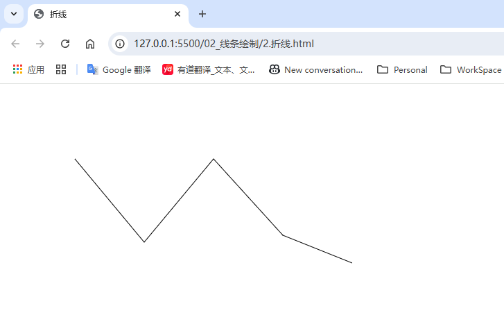

## Canvas

*参考 b站 叩丁狼 Canvas 课程*

### 一、基础使用

#### （1）通过 html 标签创建

```html
<!DOCTYPE html>
<html lang="en">
<head>
    <meta charset="UTF-8">
    <meta name="viewport" content="width=device-width, initial-scale=1.0">
    <title>通过html标签创建</title>
</head>
<body>
    <canvas id="canvas" width="500" height="500"></canvas>
    <script>
        // 1. 获取 canvas 画布
        const canvas = document.getElementById('canvas')
        
        // 2. 获取 context 对象（画笔）
        const context = canvas.getContext('2d')
        
        // 3. 画一个正方形
        // fillRect(x, y, width, height)
        context.fillRect(50, 40, 200, 200)
    </script>
</body>
</html>
```


#### （2）通过 js 创建

```html
<!DOCTYPE html>
<html lang="en">
<head>
    <meta charset="UTF-8">
    <meta name="viewport" content="width=device-width, initial-scale=1.0">
    <title>通过js创建</title>
</head>
<body>
    <script>
        // 1. 创建 canvas 画布
        const canvas = document.createElement('canvas')
        // 设置宽高
        canvas.width = 500
        canvas.height = 500
        document.body.append(canvas)

        // 2. 获取 context 对象（画笔）
        const context = canvas.getContext('2d')

        // 3. （同第一节）画一个正方形
        context.fillRect(60, 60, 200, 200)
    </script>
</body>
</html>
```


#### （3）canvas 宽高的设置

```html
<!DOCTYPE html>
<html lang="en">
<head>
    <meta charset="UTF-8">
    <meta name="viewport" content="width=device-width, initial-scale=1.0">
    <title>canvas宽高的设置</title>
    <!-- <style>
        canvas {
            width: 500px;
            height: 500px
        }
    </style> -->
</head>
<body>
    <script>
        // 注意：不建议使用 CSS 样式表设置 canvas 的宽高，样式会出问题
        // 1. 创建 canvas 画布
        const canvas = document.createElement('canvas')
        // 设置宽高
        canvas.width = 500
        canvas.height = 500
        document.body.append(canvas)

        // 2. 获取 context 对象（画笔）
        const context = canvas.getContext('2d')

        // 3. （同第一节）画一个正方形
        context.fillRect(60, 60, 200, 200)
    </script>
</body>
</html>
```


### 二、线条绘制

#### （1）直线

步骤：

- 使用 `moveTO` 方法把画笔移动到直线起点

- 使用 `lineTo` 方法把画笔移动到直线终点

- 使用 `stroke` 方法让画笔绘制线条

  ```html
  <!DOCTYPE html>
  <html lang="en">
  <head>
      <meta charset="UTF-8">
      <meta name="viewport" content="width=device-width, initial-scale=1.0">
      <title>直线</title>
  </head>
  <body>
      <script>
          // 1. 创建 canvas 画布
          const canvas = document.createElement('canvas')
          // 设置宽高
          canvas.width = 500
          canvas.height = 500
          document.body.append(canvas)
  
          // 2. 获取 context 对象（画笔）
          const context = canvas.getContext('2d')
  
          // 3. 绘制直线
          // 3.1 起点
          context.moveTo(100, 100)
          // 3.2 终点
          context.lineTo(200, 220)
          // 3.3 调用画线的方法
          context.stroke()
      </script>
  </body>
  </html>
  ```

  


#### （2）折线

```html
<!DOCTYPE html>
<html lang="en">
<head>
    <meta charset="UTF-8">
    <meta name="viewport" content="width=device-width, initial-scale=1.0">
    <title>折线</title>
</head>
<body>
    <script>
        // 1. 创建 canvas 画布
        const canvas = document.createElement('canvas')
        // 设置宽高
        canvas.width = 500
        canvas.height = 500
        document.body.append(canvas)

        // 2. 获取 context 对象（画笔）
        const context = canvas.getContext('2d')

        // 3. 绘制折线
        // 3.1 起点
        context.moveTo(100, 100)
        // 3.2 使用 lineTo 依次经过转折点
        context.lineTo(200, 220)
        context.lineTo(300, 100)
        context.lineTo(400, 210)
        context.lineTo(500, 250)
        // 3.3 调用画线的方法
        context.stroke()
    </script>
</body>
</html>
```




#### （3）lineWidth 设置线条的宽度

```html
<!DOCTYPE html>
<html lang="en">
<head>
    <meta charset="UTF-8">
    <meta name="viewport" content="width=device-width, initial-scale=1.0">
    <title>lineWidth设置线条的宽度</title>
</head>
<body>
    <script>
        // 1. 创建 canvas 画布
        const canvas = document.createElement('canvas')
        // 设置宽高
        canvas.width = 500
        canvas.height = 500
        document.body.append(canvas)

        // 2. 获取 context 对象（画笔）
        const context = canvas.getContext('2d')

        // 3. 画线
        context.moveTo(100, 100)
        context.lineTo(200, 220)

        // 4.设置线条的宽度（粗细）
        context.lineWidth = 3

        // 5.画线
        context.stroke()

        context.lineTo(300, 100)
        // 注意：画完线之后如果有新的路径，要调用 stroke 方法才会绘制新的路径
        context.stroke()
    </script>
</body>
</html>
```


#### （4）strokeStyle 修改线条的颜色

```html
<!DOCTYPE html>
<html lang="en">
<head>
    <meta charset="UTF-8">
    <meta name="viewport" content="width=device-width, initial-scale=1.0">
    <title>strokeStyle修改线条的颜色</title>
</head>
<body>
    <script>
        // 1. 创建 canvas 画布
        const canvas = document.createElement('canvas')
        // 设置宽高
        canvas.width = 500
        canvas.height = 500
        document.body.append(canvas)

        // 2. 获取 context 对象（画笔）
        const context = canvas.getContext('2d')

        // 3. 画线
        context.moveTo(100, 100)
        context.lineTo(200, 220)

        context.lineWidth = 3

        // 4.修改线条的颜色
        context.strokeStyle = '#add8e6'

        // 5.画线
        context.stroke()

        context.lineTo(300, 100)
        // 注意：画完线之后如果有新的路径，要调用 stroke 方法才会绘制新的路径
        context.stroke()
    </script>
</body>
</html>
```


#### （5）线性渐变

```html
<!DOCTYPE html>
<html lang="en">
<head>
    <meta charset="UTF-8">
    <meta name="viewport" content="width=device-width, initial-scale=1.0">
    <title>线性渐变</title>
</head>
<body>
    <script>
        // 1. 创建 canvas 画布
        const canvas = document.createElement('canvas')
        // 设置宽高
        canvas.width = 500
        canvas.height = 500
        document.body.append(canvas)

        // 2. 获取 context 对象（画笔）
        const context = canvas.getContext('2d')

        // 3. 线性渐变
        // 创建
        const gradient = context.createLinearGradient(0, 0, 500, 500)
        // 从什么颜色开始渐变
        gradient.addColorStop(0, 'pink')
        // 中间
        gradient.addColorStop(0.35, 'yellow')
        // 到什么颜色结束
        gradient.addColorStop(1, 'green')

        // 画线
        context.lineTo(0, 0)
        context.lineTo(300, 300)
        context.lineWidth = 3

        // 将渐变作为线条的颜色
        context.strokeStyle = gradient
        context.stroke()
    </script>
</body>
</html>
```


#### （6）径向渐变

```html
<!DOCTYPE html>
<html lang="en">
<head>
    <meta charset="UTF-8">
    <meta name="viewport" content="width=device-width, initial-scale=1.0">
    <title>径向渐变</title>
</head>
<body>
    <script>
        // 1. 创建 canvas 画布
        const canvas = document.createElement('canvas')
        // 设置宽高
        canvas.width = 500
        canvas.height = 500
        document.body.append(canvas)

        // 2. 获取 context 对象（画笔）
        const context = canvas.getContext('2d')

        // 3. 生成渐变对象
        const gradient = context.createRadialGradient(100, 100, 0, 100, 100, 100)
        // 添加渐变的颜色
        gradient.addColorStop(0, 'yellow')
        gradient.addColorStop(1, 'green')
        
        // 把渐变赋给画笔
        context.fillStyle = gradient
        context.fillRect(0, 0, 200, 200)
    </script>
</body>
</html>
```


#### （7）锥形渐变

```html
<!DOCTYPE html>
<html lang="en">
<head>
    <meta charset="UTF-8">
    <meta name="viewport" content="width=device-width, initial-scale=1.0">
    <title>锥形渐变</title>
</head>
<body>
    <script>
        // 1. 创建 canvas 画布
        const canvas = document.createElement('canvas')
        // 设置宽高
        canvas.width = 500
        canvas.height = 500
        document.body.append(canvas)

        // 2. 获取 context 对象（画笔）
        const context = canvas.getContext('2d')

        // 3. 生成渐变对象
        /*
        参数一：弧度
        参数二：渐变中心的 x 轴坐标
        参数三：渐变中心的 y 轴坐标
        */
        const gradient = context.createConicGradient(45 * (Math.PI / 180), 100, 100)
        // 添加渐变的颜色
        gradient.addColorStop(0, 'pink')
        gradient.addColorStop(1, 'lightgreen')
        
        // 把渐变赋给画笔
        context.fillStyle = gradient
        context.fillRect(0, 0, 200, 200)
    </script>
</body>
</html>
```


#### （8）重复元图像

```html
<!DOCTYPE html>
<html lang="en">
<head>
    <meta charset="UTF-8">
    <meta name="viewport" content="width=device-width, initial-scale=1.0">
    <title>重复元图像</title>
</head>
<body>
    <script>
        // 1. 创建 canvas 画布
        const canvas = document.createElement('canvas')
        // 设置宽高
        canvas.width = 500
        canvas.height = 500
        document.body.append(canvas)

        // 2. 获取 context 对象（画笔）
        const context = canvas.getContext('2d')

        // 3. 生成渐变对象
        let img = new Image()
        img.src = './images/test.jpg'

        img.onload = function() {
            // 创建重复元图像对象
            let p = context.createPattern(img, 'repeat')

            context.fillStyle = p
            context.fillRect(0, 0, 200, 200)
            
        }
    </script>
</body>
</html>
```


#### （9）渐变的折线

```html
<!DOCTYPE html>
<html lang="en">
<head>
    <meta charset="UTF-8">
    <meta name="viewport" content="width=device-width, initial-scale=1.0">
    <title>渐变的折线</title>
</head>
<body>
    <script>
        // 1. 创建 canvas 画布
        const canvas = document.createElement('canvas')
        // 设置宽高
        canvas.width = 500
        canvas.height = 500
        document.body.append(canvas)

        // 2. 获取 context 对象（画笔）
        const context = canvas.getContext('2d')

        // 3. 绘制折线
        context.lineWidth = 3

        // 渐变
        let gradient = context.createLinearGradient(100, 100, 500, 100)
        gradient.addColorStop(0, 'lightblue')
        gradient.addColorStop(0.25, 'lightgreen')
        gradient.addColorStop(0.5, 'hotpink')
        gradient.addColorStop(1, 'red')

        // 将渐变赋值给 context
        context.strokeStyle = gradient

        // 3.1 起点
        context.moveTo(100, 100)
        // 3.2 使用 lineTo 依次经过转折点
        context.lineTo(200, 220)
        context.lineTo(300, 100)
        context.lineTo(400, 210)
        context.lineTo(500, 100)
        // 3.3 调用画线的方法
        context.stroke()
    </script>
</body>
</html>
```


#### （10）线段转折点的样式

```html
<!DOCTYPE html>
<html lang="en">
<head>
    <meta charset="UTF-8">
    <meta name="viewport" content="width=device-width, initial-scale=1.0">
    <title>线段转折点的样式</title>
</head>
<body>
    <script>
        // 1. 创建 canvas 画布
        const canvas = document.createElement('canvas')
        // 设置宽高
        canvas.width = 500
        canvas.height = 500
        document.body.append(canvas)

        // 2. 获取 context 对象（画笔）
        const context = canvas.getContext('2d')

        // 3. 绘制折线
        context.lineWidth = 8

        // 渐变
        let gradient = context.createLinearGradient(100, 100, 500, 100)
        gradient.addColorStop(0, 'lightblue')
        gradient.addColorStop(0.25, 'lightgreen')
        gradient.addColorStop(0.5, 'hotpink')
        gradient.addColorStop(1, 'red')

        // 将渐变赋值给 context
        context.strokeStyle = gradient

        // 修改线段起点、终点的样式
        /*
        butt 默认值，线条末端呈正方形
        round 圆角
        square 线条末端呈方形 
        */
        context.lineCap = 'round'

        // 修改线段转折点的样式
        /*
        miter 默认值，通过延伸相连部分的外边缘，使其相交于一点，形成一个额外的菱形区域
        round 圆角
        bevel 在相连部分的末端填充一个额外的以三角形为底的区域，每个部分都有各自独立的矩形拐角
        */
        context.lineJoin = 'round'

        // 3.1 起点
        context.moveTo(100, 100)
        // 3.2 使用 lineTo 依次经过转折点
        context.lineTo(200, 220)
        context.lineTo(300, 100)
        context.lineTo(400, 210)
        context.lineTo(500, 100)
        // 3.3 调用画线的方法
        context.stroke()
    </script>
</body>
</html>
```


### 三、弧线

Canvas中的曲线分为两种：**标准圆弧曲线**、**贝塞尔曲线**

#### 1. 弧线

```html
<!DOCTYPE html>
<html lang="en">
<head>
    <meta charset="UTF-8">
    <meta name="viewport" content="width=device-width, initial-scale=1.0">
    <title>弧线</title>
</head>
<body>
    <script>
        // 1. 创建 canvas 画布
        const canvas = document.createElement('canvas')
        // 设置宽高
        canvas.width = 500
        canvas.height = 500
        document.body.append(canvas)

        // 2. 获取 context 对象（画笔）
        const context = canvas.getContext('2d')

        // 画圆弧
        /*
        参数：圆心x， 圆心y， 弧度，圆弧起点，圆弧终点，是否逆时针（默认为false）
        */
        context.arc(200, 200, 50, 90 * (Math.PI / 180), 180 * (Math.PI / 180), true)
        context.stroke()
    </script>
</body>
</html>
```


#### 2. 画一个笑脸

```html
<!DOCTYPE html>
<html lang="en">
<head>
    <meta charset="UTF-8">
    <meta name="viewport" content="width=device-width, initial-scale=1.0">
    <title>笑脸</title>
</head>
<body>
    <script>
        // 1. 创建 canvas 画布
        const canvas = document.createElement('canvas')
        // 设置宽高
        canvas.width = 500
        canvas.height = 500
        document.body.append(canvas)

        // 2. 获取 context 对象（画笔）
        const context = canvas.getContext('2d')

        // 3.画笑脸
        // 3.1 外圈大圆
        context.arc(200, 200, 100, 0, 360 * (Math.PI / 180))
        context.stroke()

        // 3.2 左眼
        // 重新生成新的路径（即在两个不相关的图形之间要加上开始路径，闭合路径，取消两个图形之间的连线）
        context.beginPath()
        context.arc(150, 150, 20, 0, 360 * (Math.PI / 180))
        context.stroke()
        context.closePath()

        // 3.3 右眼
        context.beginPath()
        context.arc(250, 150, 20, 0, 360 * (Math.PI / 180))
        context.stroke()
        context.closePath()

        // 3.4 鼻子
        context.beginPath()
        context.arc(200, 195, 8, 0, 360 * (Math.PI / 180))
        context.stroke()
        context.closePath()

        // 3.5 嘴巴
        context.beginPath()
        context.arc(200, 200, 80, 0, 180 * (Math.PI / 180))
        context.stroke()
        context.closePath()
    </script>
</body>
</html>
```


#### 3. 椭圆

```html
<!DOCTYPE html>
<html lang="en">
<head>
    <meta charset="UTF-8">
    <meta name="viewport" content="width=device-width, initial-scale=1.0">
    <title>椭圆</title>
</head>
<body>
    <script>
        // 1. 创建 canvas 画布
        const canvas = document.createElement('canvas')
        // 设置宽高
        canvas.width = 500
        canvas.height = 500
        document.body.append(canvas)

        // 2. 获取 context 对象（画笔）
        const context = canvas.getContext('2d')

        // 画椭圆
        /*
        参数：圆心x，圆心y，x半径，y半径，椭圆旋转的角度（弧度），圆弧起点，圆弧终点，是否逆时针（默认为false）
        */
        context.ellipse(300, 300, 200, 100, 0, 0, 360 * (Math.PI / 180))
        context.stroke()
    </script>
</body>
</html>
```


#### 4. 使用fill填充图形

```html
<!DOCTYPE html>
<html lang="en">
<head>
    <meta charset="UTF-8">
    <meta name="viewport" content="width=device-width, initial-scale=1.0">
    <title>使用fill填充图形</title>
</head>
<body>
    <script>
        // 1. 创建 canvas 画布
        const canvas = document.createElement('canvas')
        // 设置宽高
        canvas.width = 500
        canvas.height = 500
        document.body.append(canvas)

        // 2. 获取 context 对象（画笔）
        const context = canvas.getContext('2d')

        // 3.填充
        context.moveTo(100, 100)
        context.lineTo(90, 220)
        context.lineTo(220, 150)
        // 调用fill方法时，路径会自动连接起始位置
        // context.lineTo(100, 100)
        
        // context.fill()

        // 填充指定颜色
        // context.fillStyle = 'lightblue'
        // context.fill()

        // 使用线性渐变填充
        // const gradient = context.createLinearGradient(0, 0, 500, 500)
        // gradient.addColorStop(0, 'lightblue')
        // gradient.addColorStop(1, 'red')
        // context.fillStyle = gradient
        // context.fill()

        // 使用径向渐变填充
        const gradient = context.createRadialGradient(150, 150, 0, 150, 150, 100)
        gradient.addColorStop(0, 'lightblue')
        gradient.addColorStop(1, 'orange')
        context.fillStyle = gradient
        context.fill()
    </script>
</body>
</html>
```


