## Canvas

*参考 b站 叩丁狼 Canvas 课程*

### 一、基础使用

#### （1）通过 html 标签创建

```html
<!DOCTYPE html>
<html lang="en">
<head>
    <meta charset="UTF-8">
    <meta name="viewport" content="width=device-width, initial-scale=1.0">
    <title>通过html标签创建</title>
</head>
<body>
    <canvas id="canvas" width="500" height="500"></canvas>
    <script>
        // 1. 获取 canvas 画布
        const canvas = document.getElementById('canvas')
        
        // 2. 获取 context 对象（画笔）
        const context = canvas.getContext('2d')
        
        // 3. 画一个正方形
        // fillRect(x, y, width, height)
        context.fillRect(50, 40, 200, 200)
    </script>
</body>
</html>
```


#### （2）通过 js 创建

```html
<!DOCTYPE html>
<html lang="en">
<head>
    <meta charset="UTF-8">
    <meta name="viewport" content="width=device-width, initial-scale=1.0">
    <title>通过js创建</title>
</head>
<body>
    <script>
        // 1. 创建 canvas 画布
        const canvas = document.createElement('canvas')
        // 设置宽高
        canvas.width = 500
        canvas.height = 500
        document.body.append(canvas)

        // 2. 获取 context 对象（画笔）
        const context = canvas.getContext('2d')

        // 3. （同第一节）画一个正方形
        context.fillRect(60, 60, 200, 200)
    </script>
</body>
</html>
```


#### （3）canvas 宽高的设置

```html
<!DOCTYPE html>
<html lang="en">
<head>
    <meta charset="UTF-8">
    <meta name="viewport" content="width=device-width, initial-scale=1.0">
    <title>canvas宽高的设置</title>
    <!-- <style>
        canvas {
            width: 500px;
            height: 500px
        }
    </style> -->
</head>
<body>
    <script>
        // 注意：不建议使用 CSS 样式表设置 canvas 的宽高，样式会出问题
        // 1. 创建 canvas 画布
        const canvas = document.createElement('canvas')
        // 设置宽高
        canvas.width = 500
        canvas.height = 500
        document.body.append(canvas)

        // 2. 获取 context 对象（画笔）
        const context = canvas.getContext('2d')

        // 3. （同第一节）画一个正方形
        context.fillRect(60, 60, 200, 200)
    </script>
</body>
</html>
```


### 二、线条绘制

#### （1）直线

步骤：

- 使用 `moveTO` 方法把画笔移动到直线起点

- 使用 `lineTo` 方法把画笔移动到直线终点

- 使用 `stroke` 方法让画笔绘制线条

  ```html
  <!DOCTYPE html>
  <html lang="en">
  <head>
      <meta charset="UTF-8">
      <meta name="viewport" content="width=device-width, initial-scale=1.0">
      <title>直线</title>
  </head>
  <body>
      <script>
          // 1. 创建 canvas 画布
          const canvas = document.createElement('canvas')
          // 设置宽高
          canvas.width = 500
          canvas.height = 500
          document.body.append(canvas)
  
          // 2. 获取 context 对象（画笔）
          const context = canvas.getContext('2d')
  
          // 3. 绘制直线
          // 3.1 起点
          context.moveTo(100, 100)
          // 3.2 终点
          context.lineTo(200, 220)
          // 3.3 调用画线的方法
          context.stroke()
      </script>
  </body>
  </html>
  ```

  


#### （2）折线

```html
<!DOCTYPE html>
<html lang="en">
<head>
    <meta charset="UTF-8">
    <meta name="viewport" content="width=device-width, initial-scale=1.0">
    <title>折线</title>
</head>
<body>
    <script>
        // 1. 创建 canvas 画布
        const canvas = document.createElement('canvas')
        // 设置宽高
        canvas.width = 500
        canvas.height = 500
        document.body.append(canvas)

        // 2. 获取 context 对象（画笔）
        const context = canvas.getContext('2d')

        // 3. 绘制折线
        // 3.1 起点
        context.moveTo(100, 100)
        // 3.2 使用 lineTo 依次经过转折点
        context.lineTo(200, 220)
        context.lineTo(300, 100)
        context.lineTo(400, 210)
        context.lineTo(500, 250)
        // 3.3 调用画线的方法
        context.stroke()
    </script>
</body>
</html>
```


#### （3）lineWidth 设置线条的宽度

```html
<!DOCTYPE html>
<html lang="en">
<head>
    <meta charset="UTF-8">
    <meta name="viewport" content="width=device-width, initial-scale=1.0">
    <title>lineWidth设置线条的宽度</title>
</head>
<body>
    <script>
        // 1. 创建 canvas 画布
        const canvas = document.createElement('canvas')
        // 设置宽高
        canvas.width = 500
        canvas.height = 500
        document.body.append(canvas)

        // 2. 获取 context 对象（画笔）
        const context = canvas.getContext('2d')

        // 3. 画线
        context.moveTo(100, 100)
        context.lineTo(200, 220)

        // 4.设置线条的宽度（粗细）
        context.lineWidth = 3

        // 5.画线
        context.stroke()

        context.lineTo(300, 100)
        // 注意：画完线之后如果有新的路径，要调用 stroke 方法才会绘制新的路径
        context.stroke()
    </script>
</body>
</html>
```


#### （4）strokeStyle 修改线条的颜色

```html
<!DOCTYPE html>
<html lang="en">
<head>
    <meta charset="UTF-8">
    <meta name="viewport" content="width=device-width, initial-scale=1.0">
    <title>strokeStyle修改线条的颜色</title>
</head>
<body>
    <script>
        // 1. 创建 canvas 画布
        const canvas = document.createElement('canvas')
        // 设置宽高
        canvas.width = 500
        canvas.height = 500
        document.body.append(canvas)

        // 2. 获取 context 对象（画笔）
        const context = canvas.getContext('2d')

        // 3. 画线
        context.moveTo(100, 100)
        context.lineTo(200, 220)

        context.lineWidth = 3

        // 4.修改线条的颜色
        context.strokeStyle = '#add8e6'

        // 5.画线
        context.stroke()

        context.lineTo(300, 100)
        // 注意：画完线之后如果有新的路径，要调用 stroke 方法才会绘制新的路径
        context.stroke()
    </script>
</body>
</html>
```


#### （5）线性渐变

```html
<!DOCTYPE html>
<html lang="en">
<head>
    <meta charset="UTF-8">
    <meta name="viewport" content="width=device-width, initial-scale=1.0">
    <title>线性渐变</title>
</head>
<body>
    <script>
        // 1. 创建 canvas 画布
        const canvas = document.createElement('canvas')
        // 设置宽高
        canvas.width = 500
        canvas.height = 500
        document.body.append(canvas)

        // 2. 获取 context 对象（画笔）
        const context = canvas.getContext('2d')

        // 3. 线性渐变
        // 创建
        const gradient = context.createLinearGradient(0, 0, 500, 500)
        // 从什么颜色开始渐变
        gradient.addColorStop(0, 'pink')
        // 中间
        gradient.addColorStop(0.35, 'yellow')
        // 到什么颜色结束
        gradient.addColorStop(1, 'green')

        // 画线
        context.lineTo(0, 0)
        context.lineTo(300, 300)
        context.lineWidth = 3

        // 将渐变作为线条的颜色
        context.strokeStyle = gradient
        context.stroke()
    </script>
</body>
</html>
```


#### （6）径向渐变

```html
<!DOCTYPE html>
<html lang="en">
<head>
    <meta charset="UTF-8">
    <meta name="viewport" content="width=device-width, initial-scale=1.0">
    <title>径向渐变</title>
</head>
<body>
    <script>
        // 1. 创建 canvas 画布
        const canvas = document.createElement('canvas')
        // 设置宽高
        canvas.width = 500
        canvas.height = 500
        document.body.append(canvas)

        // 2. 获取 context 对象（画笔）
        const context = canvas.getContext('2d')

        // 3. 生成渐变对象
        const gradient = context.createRadialGradient(100, 100, 0, 100, 100, 100)
        // 添加渐变的颜色
        gradient.addColorStop(0, 'yellow')
        gradient.addColorStop(1, 'green')
        
        // 把渐变赋给画笔
        context.fillStyle = gradient
        context.fillRect(0, 0, 200, 200)
    </script>
</body>
</html>
```


#### （7）锥形渐变

```html
<!DOCTYPE html>
<html lang="en">
<head>
    <meta charset="UTF-8">
    <meta name="viewport" content="width=device-width, initial-scale=1.0">
    <title>锥形渐变</title>
</head>
<body>
    <script>
        // 1. 创建 canvas 画布
        const canvas = document.createElement('canvas')
        // 设置宽高
        canvas.width = 500
        canvas.height = 500
        document.body.append(canvas)

        // 2. 获取 context 对象（画笔）
        const context = canvas.getContext('2d')

        // 3. 生成渐变对象
        /*
        参数一：弧度
        参数二：渐变中心的 x 轴坐标
        参数三：渐变中心的 y 轴坐标
        */
        const gradient = context.createConicGradient(45 * (Math.PI / 180), 100, 100)
        // 添加渐变的颜色
        gradient.addColorStop(0, 'pink')
        gradient.addColorStop(1, 'lightgreen')
        
        // 把渐变赋给画笔
        context.fillStyle = gradient
        context.fillRect(0, 0, 200, 200)
    </script>
</body>
</html>
```


#### （8）重复元图像

```html
<!DOCTYPE html>
<html lang="en">
<head>
    <meta charset="UTF-8">
    <meta name="viewport" content="width=device-width, initial-scale=1.0">
    <title>重复元图像</title>
</head>
<body>
    <script>
        // 1. 创建 canvas 画布
        const canvas = document.createElement('canvas')
        // 设置宽高
        canvas.width = 500
        canvas.height = 500
        document.body.append(canvas)

        // 2. 获取 context 对象（画笔）
        const context = canvas.getContext('2d')

        // 3. 生成渐变对象
        let img = new Image()
        img.src = './images/test.jpg'

        img.onload = function() {
            // 创建重复元图像对象
            let p = context.createPattern(img, 'repeat')

            context.fillStyle = p
            context.fillRect(0, 0, 200, 200)
            
        }
    </script>
</body>
</html>
```


#### （9）渐变的折线

```html
<!DOCTYPE html>
<html lang="en">
<head>
    <meta charset="UTF-8">
    <meta name="viewport" content="width=device-width, initial-scale=1.0">
    <title>渐变的折线</title>
</head>
<body>
    <script>
        // 1. 创建 canvas 画布
        const canvas = document.createElement('canvas')
        // 设置宽高
        canvas.width = 500
        canvas.height = 500
        document.body.append(canvas)

        // 2. 获取 context 对象（画笔）
        const context = canvas.getContext('2d')

        // 3. 绘制折线
        context.lineWidth = 3

        // 渐变
        let gradient = context.createLinearGradient(100, 100, 500, 100)
        gradient.addColorStop(0, 'lightblue')
        gradient.addColorStop(0.25, 'lightgreen')
        gradient.addColorStop(0.5, 'hotpink')
        gradient.addColorStop(1, 'red')

        // 将渐变赋值给 context
        context.strokeStyle = gradient

        // 3.1 起点
        context.moveTo(100, 100)
        // 3.2 使用 lineTo 依次经过转折点
        context.lineTo(200, 220)
        context.lineTo(300, 100)
        context.lineTo(400, 210)
        context.lineTo(500, 100)
        // 3.3 调用画线的方法
        context.stroke()
    </script>
</body>
</html>
```


#### （10）线段转折点的样式

```html
<!DOCTYPE html>
<html lang="en">
<head>
    <meta charset="UTF-8">
    <meta name="viewport" content="width=device-width, initial-scale=1.0">
    <title>线段转折点的样式</title>
</head>
<body>
    <script>
        // 1. 创建 canvas 画布
        const canvas = document.createElement('canvas')
        // 设置宽高
        canvas.width = 500
        canvas.height = 500
        document.body.append(canvas)

        // 2. 获取 context 对象（画笔）
        const context = canvas.getContext('2d')

        // 3. 绘制折线
        context.lineWidth = 8

        // 渐变
        let gradient = context.createLinearGradient(100, 100, 500, 100)
        gradient.addColorStop(0, 'lightblue')
        gradient.addColorStop(0.25, 'lightgreen')
        gradient.addColorStop(0.5, 'hotpink')
        gradient.addColorStop(1, 'red')

        // 将渐变赋值给 context
        context.strokeStyle = gradient

        // 修改线段起点、终点的样式
        /*
        butt 默认值，线条末端呈正方形
        round 圆角
        square 线条末端呈方形 
        */
        context.lineCap = 'round'

        // 修改线段转折点的样式
        /*
        miter 默认值，通过延伸相连部分的外边缘，使其相交于一点，形成一个额外的菱形区域
        round 圆角
        bevel 在相连部分的末端填充一个额外的以三角形为底的区域，每个部分都有各自独立的矩形拐角
        */
        context.lineJoin = 'round'

        // 3.1 起点
        context.moveTo(100, 100)
        // 3.2 使用 lineTo 依次经过转折点
        context.lineTo(200, 220)
        context.lineTo(300, 100)
        context.lineTo(400, 210)
        context.lineTo(500, 100)
        // 3.3 调用画线的方法
        context.stroke()
    </script>
</body>
</html>
```


### 三、弧线

Canvas中的曲线分为两种：**标准圆弧曲线**、**贝塞尔曲线**

#### 1. **标准圆弧曲线**

##### （1）弧线

```html
<!DOCTYPE html>
<html lang="en">
<head>
    <meta charset="UTF-8">
    <meta name="viewport" content="width=device-width, initial-scale=1.0">
    <title>弧线</title>
</head>
<body>
    <script>
        // 1. 创建 canvas 画布
        const canvas = document.createElement('canvas')
        // 设置宽高
        canvas.width = 500
        canvas.height = 500
        document.body.append(canvas)

        // 2. 获取 context 对象（画笔）
        const context = canvas.getContext('2d')

        // 画圆弧
        /*
        参数：圆心x， 圆心y， 弧度，圆弧起点，圆弧终点，是否逆时针（默认为false）
        */
        context.arc(200, 200, 50, 90 * (Math.PI / 180), 180 * (Math.PI / 180), true)
        context.stroke()
    </script>
</body>
</html>
```


##### （2）画一个笑脸

```html
<!DOCTYPE html>
<html lang="en">
<head>
    <meta charset="UTF-8">
    <meta name="viewport" content="width=device-width, initial-scale=1.0">
    <title>笑脸</title>
</head>
<body>
    <script>
        // 1. 创建 canvas 画布
        const canvas = document.createElement('canvas')
        // 设置宽高
        canvas.width = 500
        canvas.height = 500
        document.body.append(canvas)

        // 2. 获取 context 对象（画笔）
        const context = canvas.getContext('2d')

        // 3.画笑脸
        // 3.1 外圈大圆
        context.arc(200, 200, 100, 0, 360 * (Math.PI / 180))
        context.stroke()

        // 3.2 左眼
        // 重新生成新的路径（即在两个不相关的图形之间要加上开始路径，闭合路径，取消两个图形之间的连线）
        context.beginPath()
        context.arc(150, 150, 20, 0, 360 * (Math.PI / 180))
        context.stroke()
        context.closePath()

        // 3.3 右眼
        context.beginPath()
        context.arc(250, 150, 20, 0, 360 * (Math.PI / 180))
        context.stroke()
        context.closePath()

        // 3.4 鼻子
        context.beginPath()
        context.arc(200, 195, 8, 0, 360 * (Math.PI / 180))
        context.stroke()
        context.closePath()

        // 3.5 嘴巴
        context.beginPath()
        context.arc(200, 200, 80, 0, 180 * (Math.PI / 180))
        context.stroke()
        context.closePath()
    </script>
</body>
</html>
```


##### （3）椭圆

```html
<!DOCTYPE html>
<html lang="en">
<head>
    <meta charset="UTF-8">
    <meta name="viewport" content="width=device-width, initial-scale=1.0">
    <title>椭圆</title>
</head>
<body>
    <script>
        // 1. 创建 canvas 画布
        const canvas = document.createElement('canvas')
        // 设置宽高
        canvas.width = 500
        canvas.height = 500
        document.body.append(canvas)

        // 2. 获取 context 对象（画笔）
        const context = canvas.getContext('2d')

        // 画椭圆
        /*
        参数：圆心x，圆心y，x半径，y半径，椭圆旋转的角度（弧度），圆弧起点，圆弧终点，是否逆时针（默认为false）
        */
        context.ellipse(300, 300, 200, 100, 0, 0, 360 * (Math.PI / 180))
        context.stroke()
    </script>
</body>
</html>
```


##### （4）使用fill填充图形

```html
<!DOCTYPE html>
<html lang="en">
<head>
    <meta charset="UTF-8">
    <meta name="viewport" content="width=device-width, initial-scale=1.0">
    <title>使用fill填充图形</title>
</head>
<body>
    <script>
        // 1. 创建 canvas 画布
        const canvas = document.createElement('canvas')
        // 设置宽高
        canvas.width = 500
        canvas.height = 500
        document.body.append(canvas)

        // 2. 获取 context 对象（画笔）
        const context = canvas.getContext('2d')

        // 3.填充
        context.moveTo(100, 100)
        context.lineTo(90, 220)
        context.lineTo(220, 150)
        // 调用fill方法时，路径会自动连接起始位置
        // context.lineTo(100, 100)
        
        // context.fill()

        // 填充指定颜色
        // context.fillStyle = 'lightblue'
        // context.fill()

        // 使用线性渐变填充
        // const gradient = context.createLinearGradient(0, 0, 500, 500)
        // gradient.addColorStop(0, 'lightblue')
        // gradient.addColorStop(1, 'red')
        // context.fillStyle = gradient
        // context.fill()

        // 使用径向渐变填充
        const gradient = context.createRadialGradient(150, 150, 0, 150, 150, 100)
        gradient.addColorStop(0, 'lightblue')
        gradient.addColorStop(1, 'orange')
        context.fillStyle = gradient
        context.fill()
    </script>
</body>
</html>
```


##### （5）五子棋

```html
<!DOCTYPE html>
<html lang="en">
<head>
    <meta charset="UTF-8">
    <meta name="viewport" content="width=device-width, initial-scale=1.0">
    <title>五子棋</title>
    <style>
        canvas {
            background-color: green;
            display: block;
            margin: 0 auto;
        }

        #tip {
            text-align: center;
            padding: 20px;
        }
    </style>
</head>
<body>
    <div id="tip">游戏开始</div>
    <script>
        // 1.创建 canvas 画布
        const canvas = document.createElement('canvas')
        // 设置宽高
        canvas.width = 700
        canvas.height = 700
        document.body.append(canvas)

        // 2.获取 context 对象（画笔）
        const context = canvas.getContext('2d')

        const tip = document.getElementById('tip')

        // 3.棋盘
        for (i = 0; i < 14; i++) {
            context.moveTo(50, 50 * i)
            context.lineTo(650, 50 * i)
            context.stroke()

            context.moveTo(50 * i, 50)
            context.lineTo(50 * i, 650)
            context.stroke()
        }

        // 5.棋子颜色判断标志位
        let isBlackChess = true

        // 6.使用二维数组存储棋子
        let circles = []
        for(i = 0; i < 14; i ++) {
            circles[i] = []
        }

        // 7.游戏结束判断标志位
        let gameOver = false

        // 4.落子
        canvas.addEventListener('click', e => {
            if (gameOver) {
                return
            }

            let { offsetX, offsetY } = e

            // 判断棋子不超出棋盘
            if (offsetX < 25 || offsetY < 25 || offsetX > 675 || offsetY > 675) {
                return
            }

            // 6.1 格子位置
            let gridX = Math.floor((offsetX + 25) / 50)
            let gridY = Math.floor((offsetY + 25) / 50)

            // 6.3 判断是否重复落子
            if (circles[gridX][gridY]) {
                return
            }

            // 4.1 棋子位置
            let x = gridX * 50
            let y = gridY * 50
            
            context.beginPath()
            context.arc(x, y, 20, 0, 2 * Math.PI)

            // 6.2 存储棋子
            circles[gridX][gridY] = isBlackChess ? 'black' : 'white'

            // 5.1 设置棋子颜色
            let chessGradientX = isBlackChess ? x - 10 : x + 10
            let chessGradientY = isBlackChess ? y - 10 : y + 10
            let gradient = context.createRadialGradient(chessGradientX, chessGradientY, 0, chessGradientX, chessGradientY, 30)
            gradient.addColorStop(0, isBlackChess ? 'gray' : '#666')
            gradient.addColorStop(1, isBlackChess ? 'black' : 'white')
            context.fillStyle = gradient

            // 5.2 设置棋子阴影
            context.shadowColor = '#333'
            context.shadowOffsetX = 2.5
            context.shadowOffsetY = 2

            context.fill()
            context.closePath()

            // 7.判断当前是否有人获胜
            gameOver = checkVertical(circles[gridX][gridY], gridX, gridY) || checkHorizontal(circles[gridX][gridY], gridX, gridY) || checkWn2Es(circles[gridX][gridY], gridX, gridY) || checkEn2Ws(circles[gridX][gridY], gridX, gridY)

            if (gameOver) {
                tip.innerText = `${isBlackChess ? '黑' : '白'}棋获胜，游戏结束！`
                //console.log(circles)
                return
            }

            tip.innerText = isBlackChess ? '请白棋落子' : '请黑棋落子'
            isBlackChess = !isBlackChess
        })

        // 纵向查找是否有五个连续相同的棋子
        function checkVertical(currentChess, row, col) {
            let count = 1
            return checkUp(currentChess, row, col, count) + checkDown(currentChess, row, col, count) - 1 >= 5
        }

        function checkUp(currentChess, row, col, count) {
            // 向上查找的次数
            let up = 0

            while (true) {
                // 向上查找
                up++

                // 角
                // 左上角
                if (row === 1 && col === 1) {
                    return count
                }
                // 右上角
                if (row + up === circles.length && col === 1) {
                    return count
                }

                // 边
                // 上
                if (col === 1) {
                    return count
                }
                // 右 pass
                // 下 pass
                // 左 pass

                // 超出边界
                if (row - up < 0) {
                    return count
                }

                if (circles[row][col - up] && circles[row][col - up] === currentChess) {
                    count++
                }

                // 棋子不连续
                if (col === 1) {
                    if (count >= 5 || (circles[row][col + up] !== currentChess)) {
                        break
                    }
                } else if (col + up >= circles.length) {
                    if (count >= 5 || (circles[row][col - up] !== currentChess)) {
                        break
                    }
                } else {
                    if (count >= 5 || (circles[row][col - up] !== currentChess && circles[row][col + up] !== currentChess)) {
                        break
                    }
                }
            }
            return count
        }
        function checkDown(currentChess, row, col, count) {
            // 向下查找的次数
            let down = 0

            while (true) {
                // 向下查找
                down++

                // 角
                // 右下角
                if (row + down === circles.length && col + down === circles.length) {
                    return count
                }
                // 左下角
                if (row === 1 && col + down === circles.length) {
                    return count
                }

                // 边
                // 上 pass
                // 右 pass
                // 下
                if (col + down === circles.length) {
                    return count
                }
                // 左 pass

                // 超出边界
                if (row + down > circles.length) {
                    return count
                }

                if (circles[row][col + down] && circles[row][col + down] === currentChess) {
                    count++
                }

                // 棋子不连续
                if (col === 1) {
                    if (count >= 5 || (circles[row][col - down] !== currentChess)) {
                        break
                    }
                } else if (col + down >= circles.length) {
                    if (count >= 5 || (circles[row][col - down] !== currentChess)) {
                        break
                    }
                } else {
                    if (count >= 5 || (circles[row][col - down] !== currentChess && circles[row][col + down] !== currentChess)) {
                        break
                    }
                }
            }
            return count
        }

        // 横向查找是否有五个连续相同的棋子
        function checkHorizontal(currentChess, row, col) {
            let count = 1
            return checkLeft(currentChess, row, col, count) + checkRight(currentChess, row, col, count) - 1 >= 5
        }

        function checkLeft(currentChess, row, col, count) {
            // 向左查找的次数
            let left = 0

            while (true) {
                // 向左查找
                left++

                // 角
                // 左上角
                if (row === 1 && col === 1) {
                    return count
                }
                // 左下角
                if (row === 1 && col + left === circles.length) {
                    return count
                }

                // 边
                // 上 pass
                // 右 pass
                // 下 pass
                // 左
                if (row === 1) {
                    return count
                }

                // 超出边界
                if (row - left < 0) {
                    return count
                }

                if (circles[row - left][col] && circles[row - left][col] === currentChess) {
                    count++
                }

                // 棋子不连续
                if (col === 1 && row + left < circles.length) {
                    if (count >= 5 || (circles[row + left][col] !== currentChess)) {
                        break
                    }
                } else if (row + left >= circles.length) {
                    if (count >= 5 || (circles[row - left][col] !== currentChess)) {
                        break
                    }
                } else {
                    if (count >= 5 || (circles[row - left][col] !== currentChess && circles[row + left][col] !== currentChess)) {
                        break
                    }
                }
            }
            return count
        }
        function checkRight(currentChess, row, col, count) {
            // 向右查找的次数
            let right = 0

            while (true) {
                // 向右查找
                right++

                // 角
                // 右上角
                if (row + right === circles.length && col === 1) {
                    return count
                }
                // 右下角
                if (row + right === circles.length && col + right === circles.length) {
                    return count
                }

                // 边
                // 上 pass
                // 右
                if (row + right === circles.length) {
                    return count
                }
                // 下 pass
                // 左 pass

                if (circles[row + right][col] && circles[row + right][col] === currentChess) {
                    count++
                }

                // 超出边界
                if (row + right > circles.length) {
                    return count
                }

                // 同色棋子大于5 || 棋子不连续
                if (col === 1 && row + right < circles.length) {
                    if (count >= 5 || (circles[row + right][col] !== currentChess)) {
                        break
                    }
                } else if (row + right >= circles.length) {
                    if (count >= 5 || (circles[row - right][col] !== currentChess)) {
                        break
                    }
                } else {
                    if (count >= 5 || (circles[row - right][col] !== currentChess && circles[row + right][col] !== currentChess)) {
                        break
                    }
                }
            }
            return count
        }

        // 左上到右下查找是否有五个连续相同的棋子
        function checkWn2Es(currentChess, row, col) {
            // 连续同色棋子的数量
            let count = 1
            return checkWn(currentChess, row, col, count) + checkEs(currentChess, row, col, count) - 1 >= 5
        }

        function checkWn(currentChess, row, col, count) {
            // 左上查找的次数
            let leftUp = 0

            while (true) {
                // 向左上查找
                leftUp++

                // 角
                // 左上角
                if (row === 1 && col === 1) {
                    return count
                }
                // 右上角
                if (row + leftUp === circles.length && col === 1) {
                    return count
                }
                // 左下角
                if (row === 1 && col + leftUp === circles.length) {
                    return count
                }

                // 边
                // 上
                if (col === 1) {
                    return count
                }
                // 右 pass
                // 下 pass
                // 左
                if (row === 1) {
                    return count
                }

                // 超出边界
                if (row - leftUp < 0 || col - leftUp < 0) {
                    return count
                }

                if (circles[row - leftUp][col - leftUp] && circles[row - leftUp][col - leftUp] === currentChess) {
                    count++
                }

                // 同色棋子大于5 || 棋子不连续
                if (row === 1 || col === 1) {
                    if (count >= 5 || (circles[row + leftUp][col + leftUp] !== currentChess)) {
                        break
                    }
                } else if (row + leftUp >= circles.length || col + leftUp >= circles.length) {
                    if (count >= 5 || circles[row - leftUp][col - leftUp] !== currentChess) {
                        break
                    }
                } else {
                    if (count >= 5 || (circles[row - leftUp][col - leftUp] !== currentChess && circles[row + leftUp][col + leftUp] !== currentChess)) {
                        break
                    }
                }
            }
            return count
        }
        function checkEs(currentChess, row, col, count) {
            // 右下查找的次数
            let rightDown = 0

            while (true) {
                // 向右下查找
                rightDown++

                // 角
                // 右上角
                if (row + rightDown === circles.length && col === 1) {
                    return count
                }
                // 右下角
                if (row + rightDown === circles.length && col + rightDown === circles.length) {
                    return count
                }
                // 左下角
                if (row === 1 && col + rightDown === circles.length) {
                    return count
                }

                // 边
                // 上 pass
                // 右
                if (row + rightDown === circles.length) {
                    return count
                }
                // 下
                if (col + rightDown === circles.length) {
                    return count
                }
                // 左 pass

                // 超出边界
                if (row + rightDown > circles.length || col + rightDown > circles.length) {
                    return count
                }

                if (circles[row + rightDown][col + rightDown] && circles[row + rightDown][col + rightDown] === currentChess) {
                    count++
                }

                // 同色棋子大于5 || 棋子不连续
                if (row === 1 || col === 1) {
                    if (count >= 5 || (circles[row + rightDown][col + rightDown] !== currentChess)) {
                        break
                    }
                } else if (row + rightDown >= circles.length || col + rightDown >= circles.length) {
                    if (count >= 5 || circles[row - rightDown][col - rightDown] !== currentChess) {
                        break
                    }
                } else {
                    if (count >= 5 || row - rightDown < 0) {
                        break
                    }
                    if (count >= 5 || (circles[row - rightDown][col - rightDown] !== currentChess && circles[row + rightDown][col + rightDown] !== currentChess)) {
                        break
                    }
                }
            }
            return count
        }

        // 右上到左下查找是否有五个连续相同的棋子
        function checkEn2Ws(currentChess, row, col) {
            // 连续同色棋子的数量
            let count = 1
            return checkEn(currentChess, row, col, count) + checkWs(currentChess, row, col, count) - 1 >= 5
        }

        function checkEn(currentChess, row, col, count) {
            // 右上查找的次数
            let rightUp = 0

            while (true) {
                // 向右上查找
                rightUp++

                // 角
                // 左上角
                if (row === 1 && col === 1) {
                    return count
                }
                // 右上角
                if (row + rightUp === circles.length && col === 1) {
                    return count
                }
                // 右下角
                if (row + rightUp === circles.length && col + rightUp === circles.length) {
                    return count
                }

                // 边
                // 上
                if (col === 1) {
                    return count
                }
                // 右
                if (row + rightUp >= circles.length) {
                    return count
                }
                // 下 pass
                // 左 pass

                // 超出边界
                if (row + rightUp > circles.length || col - rightUp < 0) {
                    return count
                }
                
                if (circles[row + rightUp][col - rightUp] && circles[row + rightUp][col - rightUp] === currentChess) {
                    count++
                }

                // 同色棋子大于5 || 棋子不连续
                if (row === 1 || col + rightUp >= circles.length) {
                    if (count >= 5 || (circles[row + rightUp][col - rightUp] !== currentChess)) {
                        break
                    }
                } else if (row + rightUp >= circles.length || col === 1) {
                    if (count >= 5 || (circles[row - rightUp][col + rightUp] !== currentChess)) {
                        break
                    }
                } else {
                    if (count >= 5 || row - rightUp < 0) {
                        break
                    }
                    if (count >= 5 || (circles[row + rightUp][col - rightUp] !== currentChess && circles[row - rightUp][col + rightUp] !== currentChess)) {
                        break
                    }
                }
            }
            return count
        }
        function checkWs(currentChess, row, col, count) {
            // 左下查找的次数
            let leftDown = 0

            while (true) {
                // 向左下查找
                leftDown++

                // 角
                // 左上角
                if (row === 1 && col === 1) {
                    return count
                }
                // 左下角
                if (row === 1 && col + leftDown === circles.length) {
                    return count
                }
                // 右下角
                if (row + leftDown === circles.length && col + leftDown === circles.length) {
                    return count
                }

                // 边
                // 上 pass
                // 右 pass
                // 下
                if (col === col + leftDown === circles.length) {
                    return count
                }
                // 左
                if (row === 1) {
                    return count
                }

                // 超出边界
                if (row - leftDown < 0 || col + leftDown > circles.length) {
                    return count
                }

                if (circles[row - leftDown][col + leftDown] && circles[row - leftDown][col + leftDown] === currentChess) {
                    count++
                }

                // 同色棋子大于5 || 棋子不连续
                if (row + leftDown >= circles.length || col === 1) {
                    if (count >= 5 || circles[row - leftDown][col + leftDown] !== currentChess) {
                        break
                    }
                } else if (row === 1 || col + leftDown >= circles.length) {
                    if (count >= 5 || (circles[row + leftDown][col - leftDown] !== currentChess)) {
                        break
                    }
                } else {
                    if (count >= 5 || (circles[row - leftDown][col + leftDown] !== currentChess && circles[row + leftDown][col - leftDown] !== currentChess)) {
                        break
                    }
                }
            }
            return count
        }
    </script>
</body>
</html>
```

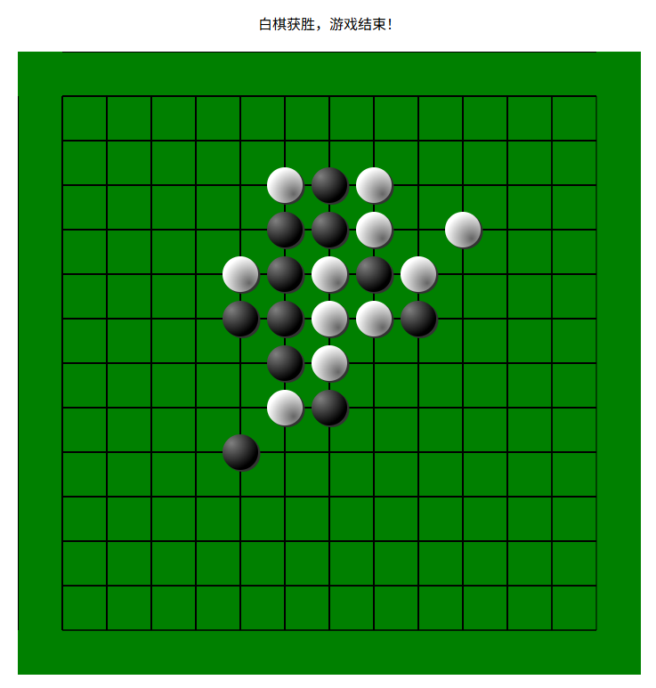

##### （6）阴影

```html
<!DOCTYPE html>
<html lang="en">
<head>
    <meta charset="UTF-8">
    <meta name="viewport" content="width=device-width, initial-scale=1.0">
    <title>阴影</title>
</head>
<body>
    <script>
        // 1.创建 canvas 画布
        const canvas = document.createElement('canvas')
        // 设置宽高
        canvas.width = 500
        canvas.height = 500
        document.body.append(canvas)

        // 2.获取 context 对象（画笔）
        const context = canvas.getContext('2d')

        context.strokeStyle = 'green'
        context.lineWidth = 6

        // 设置图像的阴影
        context.shadowColor = 'gray'
        context.shadowOffsetX = 6
        context.shadowOffsetY = 3
        context.shadowBlur = 5

        context.moveTo(100, 100)
        context.lineTo(260, 260)
        context.stroke()
    </script>
</body>
</html>
```


#### 2. 贝塞尔曲线

Canvas 提供了二阶和三阶的贝塞尔曲线方法：

- quadraticCurveTo
- bezierCurveTo


##### （1）二阶、三阶贝塞尔曲线

```html
<!DOCTYPE html>
<html lang="en">
<head>
    <meta charset="UTF-8">
    <meta name="viewport" content="width=device-width, initial-scale=1.0">
    <title>贝塞尔曲线</title>
</head>
<body>
    <script>
        // 1.创建 canvas 画布
        const canvas = document.createElement('canvas')
        // 设置宽高
        canvas.width = 500
        canvas.height = 500
        document.body.append(canvas)

        // 2.获取 context 对象（画笔）
        const context = canvas.getContext('2d')

        // // 二阶贝塞尔曲线（第一个点是控制点）
        // // 3.1 起始点
        // context.moveTo(100, 100)
        // // 3.2 调用 quadraticCurveTo 绘制二阶路径
        // context.quadraticCurveTo(180, 230, 350, 100)
        // context.stroke()

        // 三阶贝塞尔曲线（第一、二个点是控制点）
        // 4.1 起始点
        context.moveTo(100, 100)
        // 4.2 调用bezierCurveTo绘制三阶路径
        context.bezierCurveTo(180, 210, 50, 280, 410, 360)
        context.stroke()
    </script>
</body>
</html>
```

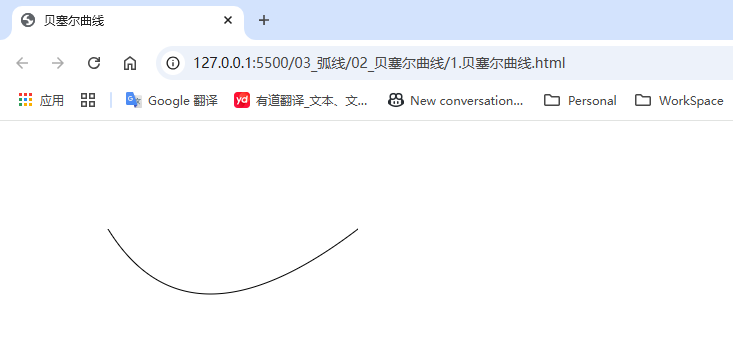

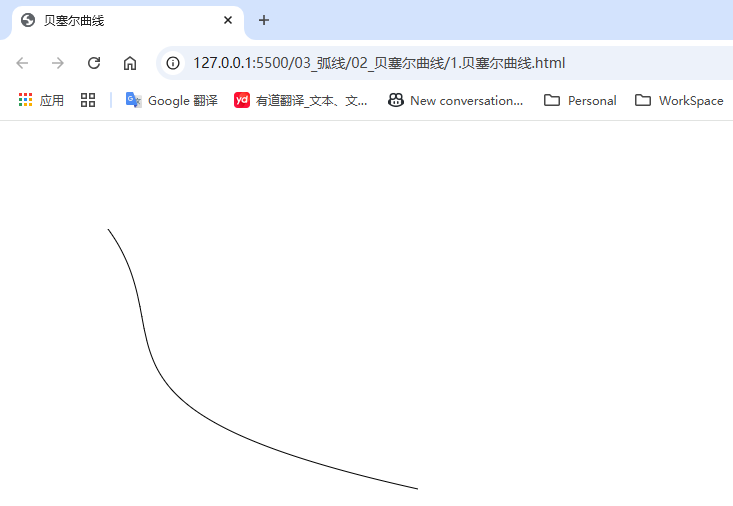


##### （2）使用 arcTo 绘制圆弧

```html
<!DOCTYPE html>
<html lang="en">
<head>
    <meta charset="UTF-8">
    <meta name="viewport" content="width=device-width, initial-scale=1.0">
    <title>arcTo绘制圆弧</title>
</head>
<body>
    <script>
        // 1.创建 canvas 画布
        const canvas = document.createElement('canvas')
        // 设置宽高
        canvas.width = 500
        canvas.height = 500
        document.body.append(canvas)

        // 2.获取 context 对象（画笔）
        const context = canvas.getContext('2d')

        // arcTo 绘制圆弧
        // 3.1 起始点
        context.moveTo(100, 100)
        // 3.2 调用 arcTo 方法，第一、二个参数为控制点，第三个参数为圆弧半径
        context.arcTo(180, 100, 180, 180, 50)
        context.stroke()
    </script>
</body>
</html>
```

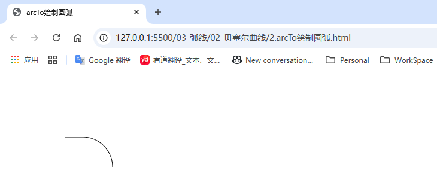


### 四、图片

#### 1. 绘制图片

```html
<!DOCTYPE html>
<html lang="en">
<head>
    <meta charset="UTF-8">
    <meta name="viewport" content="width=device-width, initial-scale=1.0">
    <title>绘制图片</title>
</head>
<body>
    <script>
        // 1.创建 canvas 画布
        const canvas = document.createElement('canvas')
        // 设置宽高
        canvas.width = 500
        canvas.height = 500
        document.body.append(canvas)

        // 2.获取 context 对象（画笔）
        const context = canvas.getContext('2d')

        // 3.1 准备图片
        let img = new Image()
        img.src = './images/test.jpg'

        // 图片加载时需要一定的时间（该加载过程不会阻塞js进程），需等待加载完成，才能绘制
        img.onload = function () {
            // 3.2 使用 drawImage 方法
            // 方法一：传入绘制的坐标，按图片原有的大小绘制
            // context.drawImage(img, 100, 100)

            // 方法二：传入绘制的坐标和渲染的大小（宽、高）
            // context.drawImage(img, 20, img.height)

            // 方法三：传入要裁切的区域，渲染到页面上
            context.drawImage(img, 10, 20, 15, 25, 100, 100, 100, 100)
        }
    </script>
</body>
</html>
```

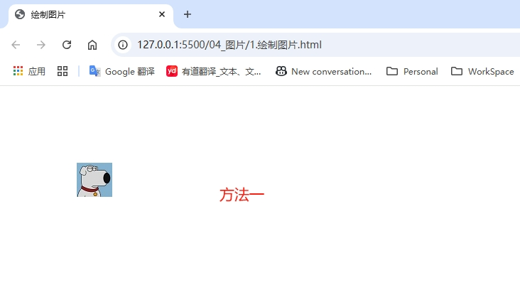

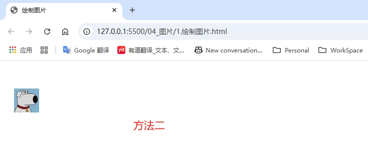

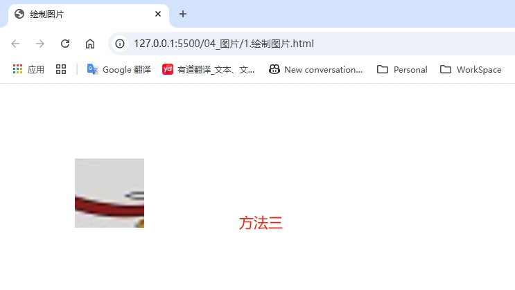


#### 2. 动画

*使用的精灵图素材宽1260，高300，分为7份*

```html
<!DOCTYPE html>
<html lang="en">
<head>
    <meta charset="UTF-8">
    <meta name="viewport" content="width=device-width, initial-scale=1.0">
    <title>动画</title>
</head>
<body>
    <script>
        // 1.创建 canvas 画布
        const canvas = document.createElement('canvas')
        // 设置宽高
        canvas.width = 500
        canvas.height = 500
        document.body.append(canvas)

        // 2.获取 context 对象（画笔）
        const context = canvas.getContext('2d')

        // 3.1 准备图片
        let img = new Image()
        img.src = './images/sprite.png'

        // 图片加载时需要一定的时间（该加载过程不会阻塞js进程），需等待加载完成，才能绘制
        img.onload = function () {
            let index = 0
            setInterval(() => {
                context.clearRect(0, 0, canvas.width, canvas.height)
                context.drawImage(img, 180 * index, 0, 180, 300, 0, 0, 180, 300)
                index++
                index %= 7
            }, 100)
        }
    </script>
</body>
</html>
```

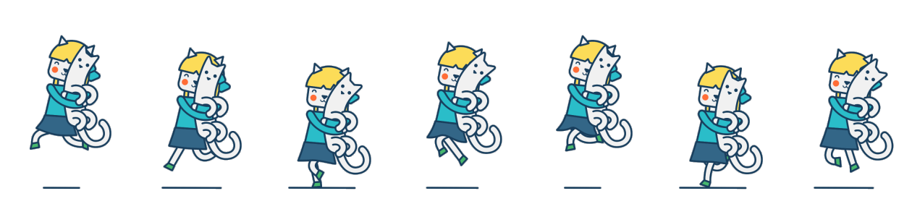

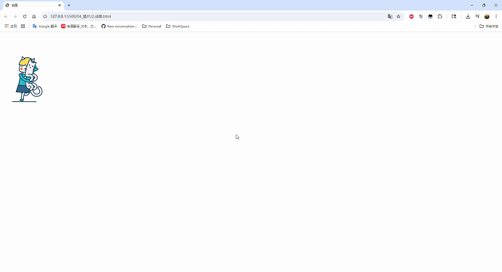

#### 3. 文字

##### （1）绘制文字

```html
<!DOCTYPE html>
<html lang="en">
<head>
    <meta charset="UTF-8">
    <meta name="viewport" content="width=device-width, initial-scale=1.0">
    <title>绘制文字</title>
</head>
<body>
    <script>
        // 1.创建 canvas 画布
        const canvas = document.createElement('canvas')
        // 设置宽高
        canvas.width = 500
        canvas.height = 500
        document.body.append(canvas)

        // 2.获取 context 对象（画笔）
        const context = canvas.getContext('2d')

        // 文字属性
        context.font = '200 16px Arial'

        // fillText(content, x, y, [maxWidth])
        // 注：x, y为文字的左下角初始坐标
        context.fillText('孙笑川', 100, 100)
        // maxWidth 属性一般不使用
        context.fillText('孙笑川', 100, 200, 30)

        // strokeText(content, x, y, [maxWidth])
        context.strokeText('孙笑川', 100, 300)
    </script>
</body>
</html>
```

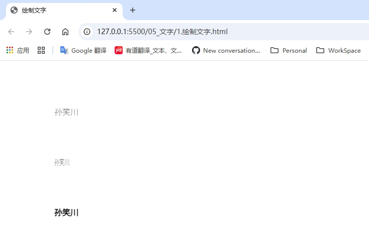


##### （2）绘制渐变的文字

```html
<!DOCTYPE html>
<html lang="en">
<head>
    <meta charset="UTF-8">
    <meta name="viewport" content="width=device-width, initial-scale=1.0">
    <title>绘制渐变的文字</title>
</head>
<body>
    <script>
        // 1.创建 canvas 画布
        const canvas = document.createElement('canvas')
        // 设置宽高
        canvas.width = 500
        canvas.height = 500
        document.body.append(canvas)

        // 2.获取 context 对象（画笔）
        const context = canvas.getContext('2d')

        // 文字属性
        context.font = 'italic 40px Arial'

        // 渐变
        let gradient = context.createLinearGradient(0, 0, 500, 0)
        gradient.addColorStop(0, 'yellow')
        gradient.addColorStop(0.25, 'orange')
        gradient.addColorStop(0.5, 'skyblue')
        gradient.addColorStop(0.75, 'purple')
        gradient.addColorStop(1, 'red')

        context.fillStyle = gradient

        // fillText(content, x, y, [maxWidth])
        // 注：x, y为文字的左下角初始坐标
        context.fillText('孙笑川', 100, 100)
        // maxWidth 属性一般不使用
        context.fillText('孙笑川', 100, 200, 30)

        context.strokeStyle = gradient

        // strokeText(content, x, y, [maxWidth])
        context.strokeText('孙笑川', 100, 300)
    </script>
</body>
</html>
```

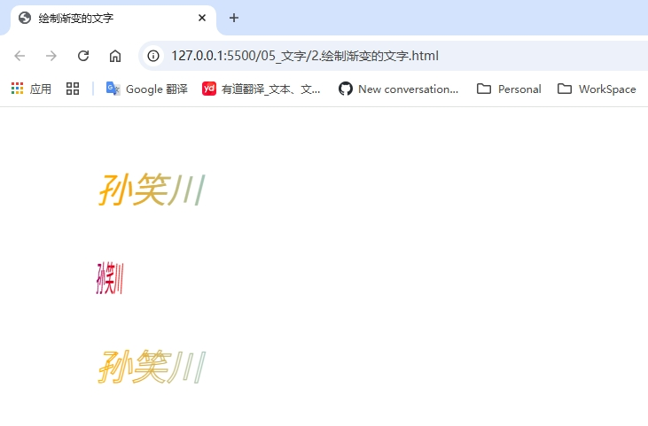


##### （3）文字的横向对齐方式

```html
<!DOCTYPE html>
<html lang="en">
<head>
    <meta charset="UTF-8">
    <meta name="viewport" content="width=device-width, initial-scale=1.0">
    <title>文字的横向对齐方式</title>
</head>
<body>
    <script>
        // 1.创建 canvas 画布
        const canvas = document.createElement('canvas')
        // 设置宽高
        canvas.width = 500
        canvas.height = 500
        document.body.append(canvas)

        // 2.获取 context 对象（画笔）
        const context = canvas.getContext('2d')

        // 辅助中线
        context.strokeStyle = 'black'
        context.moveTo(250, 0)
        context.lineTo(250, 500)
        context.stroke()

        // 文字属性
        context.font = 'italic 24px Arial'

        // 方向控制 direction
        context.direction = 'ltr' // 默认为从左到右

        // 对齐方式 textAlign
        // context.textAlign = 'left'
        // context.textAlign = 'right'
        // context.textAlign = 'center'

        // fillText(content, x, y, [maxWidth])
        // 注：x, y为文字的左下角初始坐标
        context.fillText('孙笑川', 250, 100)

        context.direction = 'rtl' // 默认为从左到右

        // strokeText(content, x, y, [maxWidth])
        context.strokeText('孙笑川', 250, 300)
    </script>
</body>
</html>
```

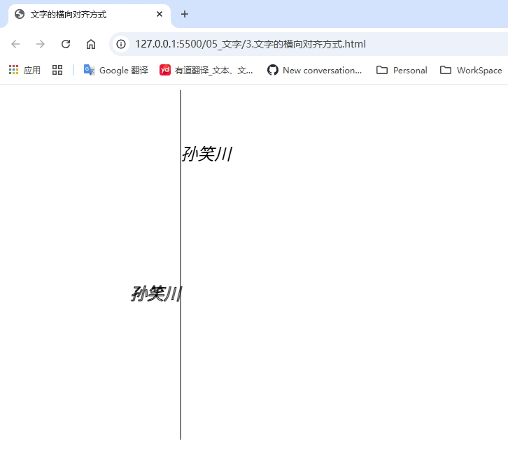


##### （4）文字的纵向对齐方式

```html
<!DOCTYPE html>
<html lang="en">
<head>
    <meta charset="UTF-8">
    <meta name="viewport" content="width=device-width, initial-scale=1.0">
    <title>文字的纵向对齐方式</title>
</head>
<body>
    <script>
        // 1.创建 canvas 画布
        const canvas = document.createElement('canvas')
        // 设置宽高
        canvas.width = 500
        canvas.height = 500
        document.body.append(canvas)

        // 2.获取 context 对象（画笔）
        const context = canvas.getContext('2d')

        const baselines = ['top', 'hanging', 'middle', 'alphabetic', 'ideographic']

        context.font = '24px Arial'
        baselines.forEach((baseline, index) => {
            // 基线
            context.textBaseline = baseline
            const y = 50 + index * 50
            context.beginPath()
            context.moveTo(0, y + 0.5)
            context.lineTo(500, y + 0.5)
            context.stroke()

            context.fillText(`孙笑川（${baseline})`, 0, y)
        })
    </script>
</body>
</html>
```

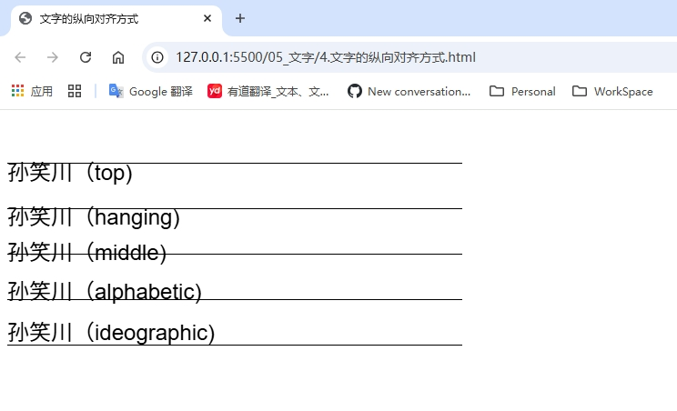


### 五、滤镜

```html
<!DOCTYPE html>
<html lang="en">
<head>
    <meta charset="UTF-8">
    <meta name="viewport" content="width=device-width, initial-scale=1.0">
    <title>滤镜</title>
</head>
<body>
    <script>
        // 1.创建 canvas 画布
        const canvas = document.createElement('canvas')
        // 设置宽高
        canvas.width = 500
        canvas.height = 500
        document.body.append(canvas)

        // 2.获取 context 对象（画笔）
        const context = canvas.getContext('2d')

        // 滤镜
        // context.filter = 'none' // 默认值
        // context.filter = 'blur(5px)' // 模糊
        // context.filter = 'brightness(70%)' // 亮度
        // context.filter = 'contrast(25%)' // 对比度
        // context.filter = 'grayscale(60%)' // 灰度
        // context.filter = 'hue-rotate(100deg)' // 色彩旋转
        // context.filter = 'invert(60%)' // 透明度
        // context.filter = 'opacity(60%)' // 反相
        // context.filter = 'saturate(300%)' // 饱和度
        context.filter = 'sepia(300%)' // 褐度

        const img = new Image()
        img.src = './images/test.jpg'
        img.onload = function() {
            context.drawImage(img, 100, 100)
        }
    </script>
</body>
</html>
```

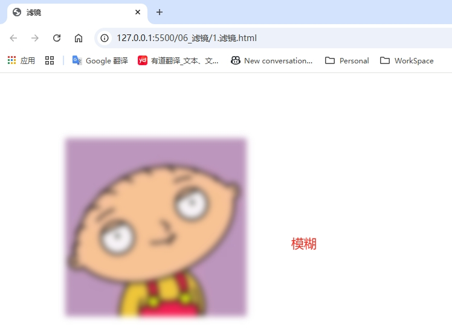


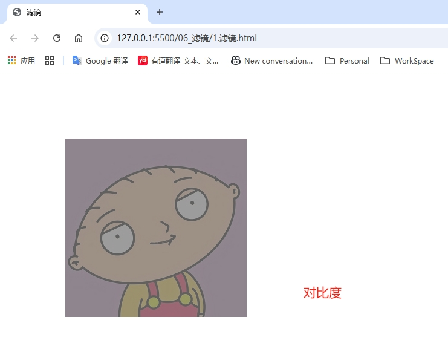

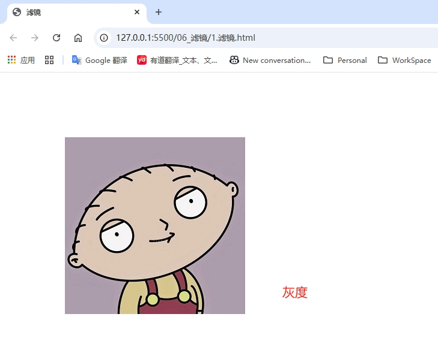

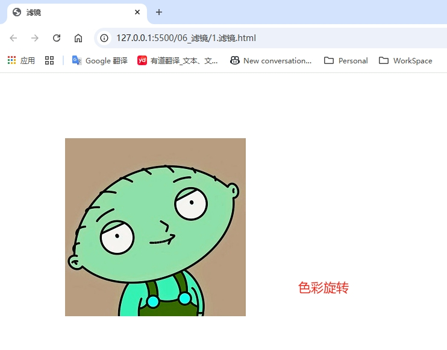

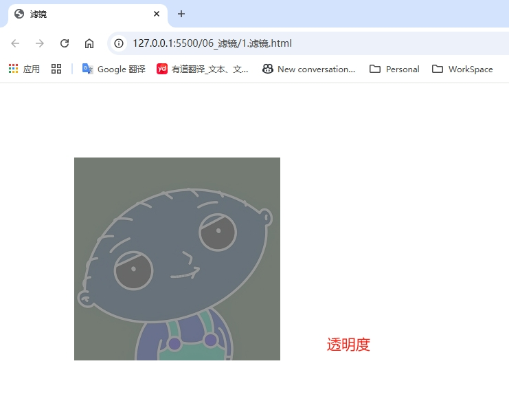

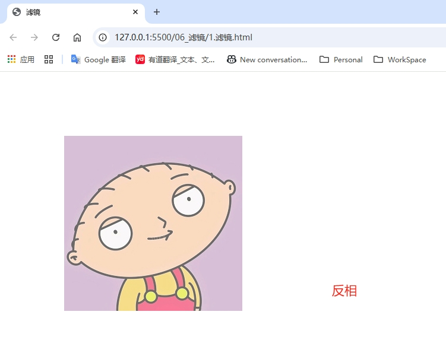

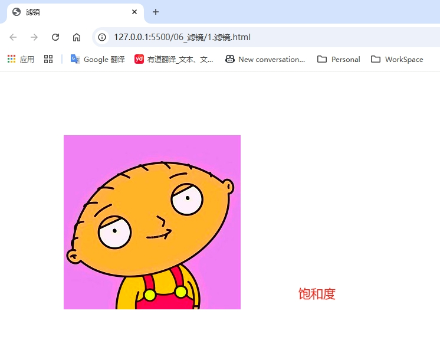

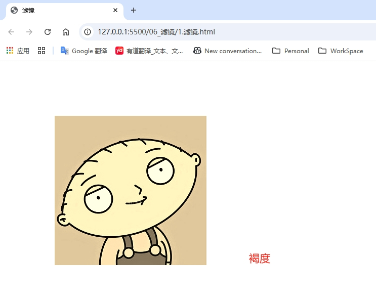


### 六、变换

#### 1. translate 位移

```html
<!DOCTYPE html>
<html lang="en">
<head>
    <meta charset="UTF-8">
    <meta name="viewport" content="width=device-width, initial-scale=1.0">
    <title>translate位移</title>
    <style>
        canvas {
            background-color: lightblue;
            display: block;
            margin: auto;
        }
    </style>
</head>
<body>
    <script>
        // 1.创建 canvas 画布
        const canvas = document.createElement('canvas')
        // 设置宽高
        canvas.width = 500
        canvas.height = 500
        document.body.append(canvas)

        // 2.获取 context 对象（画笔）
        const context = canvas.getContext('2d')

        // 位移（基于原点的变换）
        context.translate(100, 100)

        context.fillRect(10, 10, 100, 100)
    </script>
</body>
</html>
```

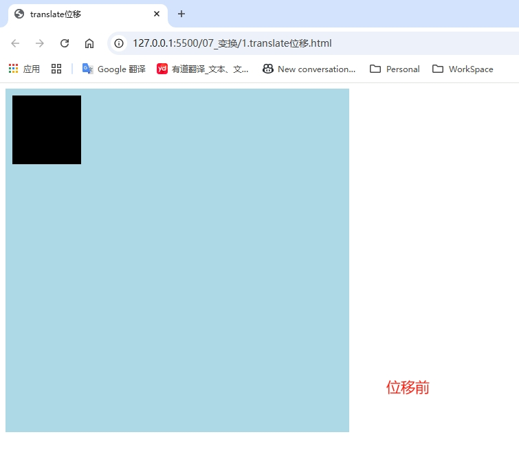

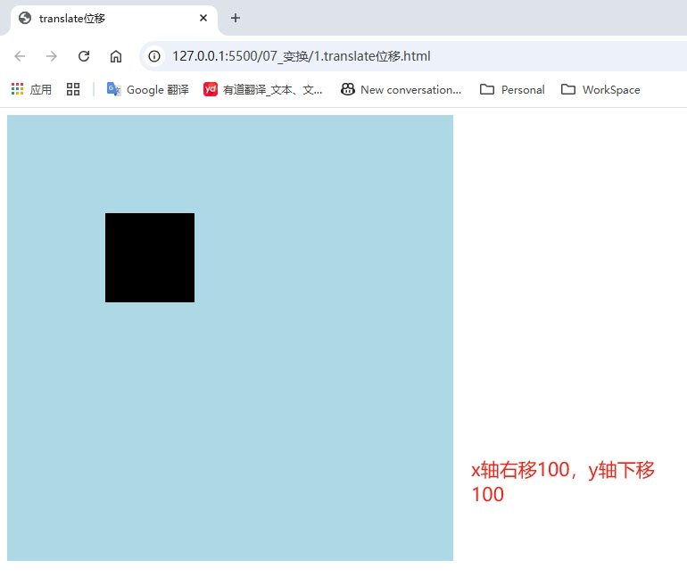


#### 2. rotate 旋转

```html
<!DOCTYPE html>
<html lang="en">
<head>
    <meta charset="UTF-8">
    <meta name="viewport" content="width=device-width, initial-scale=1.0">
    <title>rotate旋转</title>
    <style>
        canvas {
            background-color: lightblue;
        }
    </style>
</head>
<body>
    <script>
        // 1.创建 canvas 画布
        const canvas = document.createElement('canvas')
        // 设置宽高
        canvas.width = 500
        canvas.height = 500
        document.body.append(canvas)

        // 2.获取 context 对象（画笔）
        const context = canvas.getContext('2d')

        // 位移（基于原点的变换）
        context.translate(200, 200)
        context.rotate(45 * Math.PI / 180)

        context.fillRect(10, 10, 100, 100)
    </script>
</body>
</html>
```

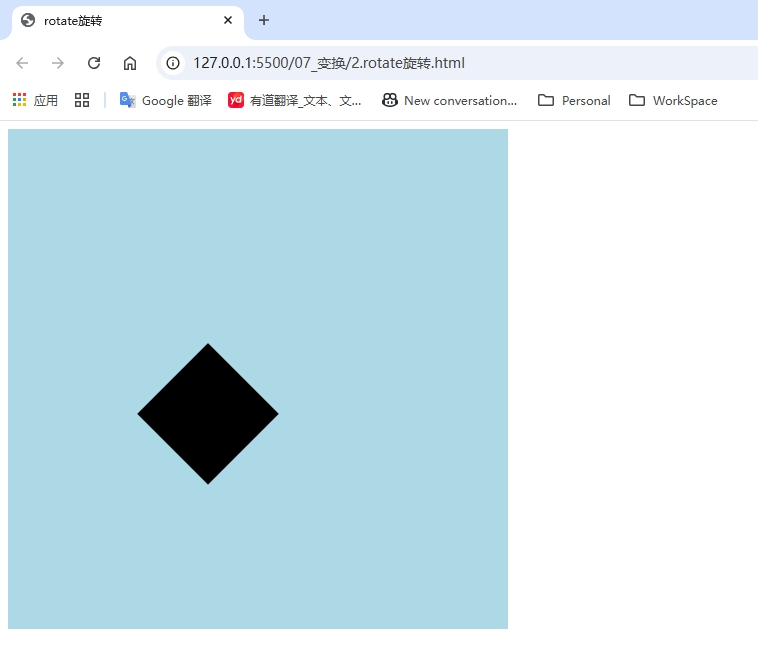


#### 3. scale 缩放

```html
<!DOCTYPE html>
<html lang="en">
<head>
    <meta charset="UTF-8">
    <meta name="viewport" content="width=device-width, initial-scale=1.0">
    <title>缩放</title>
    <style>
        canvas {
            background-color: lightblue;
        }
    </style>
</head>
<body>
    <script>
        // 1.创建 canvas 画布
        const canvas = document.createElement('canvas')
        // 设置宽高
        canvas.width = 500
        canvas.height = 500
        document.body.append(canvas)

        // 2.获取 context 对象（画笔）
        const context = canvas.getContext('2d')

        // 缩放
        context.scale(1.1, 2)

        context.fillRect(10, 10, 100, 100)
    </script>
</body>
</html>
```

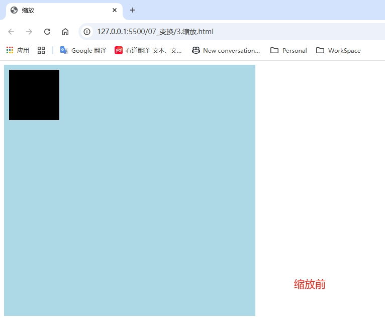

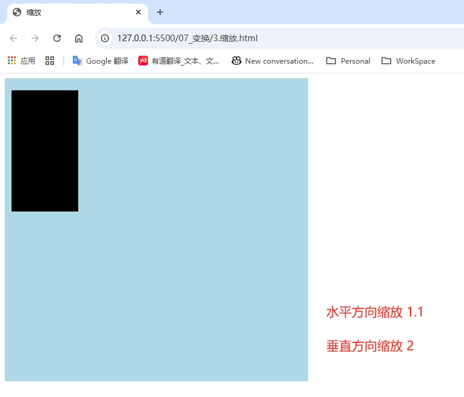


#### 4. transform

```html
<!DOCTYPE html>
<html lang="en">
<head>
    <meta charset="UTF-8">
    <meta name="viewport" content="width=device-width, initial-scale=1.0">
    <title>transform</title>
    <style>
        canvas {
            background-color: lightblue;
        }
    </style>
</head>
<body>
    <script>
        // 1.创建 canvas 画布
        const canvas = document.createElement('canvas')
        // 设置宽高
        canvas.width = 500
        canvas.height = 500
        document.body.append(canvas)

        // 2.获取 context 对象（画笔）
        const context = canvas.getContext('2d')

        /*
        transform(a, b, c, d, e, f) 该方法集位移、旋转、缩放为一体
        a 水平缩放
        b 垂直倾斜
        c 水平倾斜
        d 垂直缩放
        e 水平移动
        f 垂直移动
        */
        context.transform(1.1, 45 * Math.PI / 180, 30 * Math.PI / 180, 1.4, 100, 100)
        context.fillRect(10, 10, 100, 100)
    </script>
</body>
</html>
```

