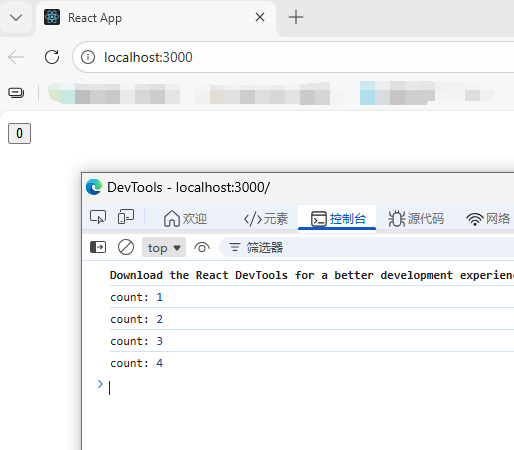
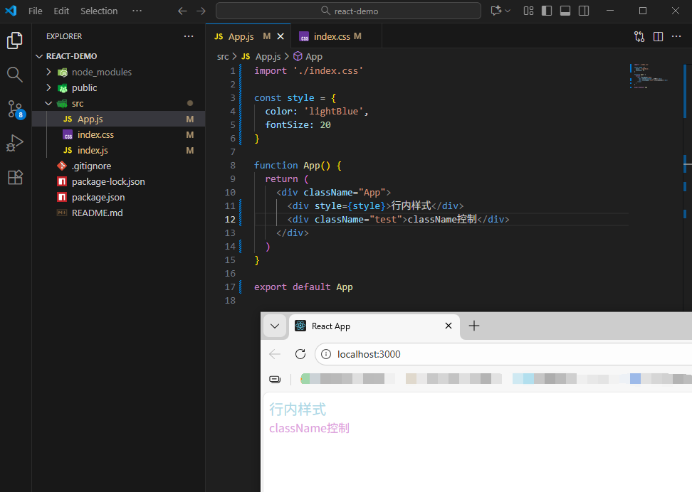

## React 18

### 一、搭建开发环境

官网快速开始文档 - 创建一个 React 项目：

https://18.react.dev/learn/creating-a-react-app

```bash
npx create-react-app react-demo

npm start
```


### 二、JSX 基础

#### 1. 概念

JSX（JS的语法扩展）是JavaScript 和 XML（HTML）的缩写，表示在 js 代码中编写 HTML 模板结构，它是 React 中编写 UI 模板的方式


#### 2. 使用 js 表达式

在 JSX 中可以通过大括号语法 {} 识别 js 中的表达式，如：变量、函数调用、方法调用等

- 使用引号传递字符串
- 使用 js 变量
- 函数调用和方法调用
- 使用 js 对象

```jsx
const index = 1

function getName() {
  return '孙笑川'
}
function App() {
  return (
    <div className="App">
      这是 React Demo

      {/* 使用引号传递字符串 */}
      {'这是 React Demo'}

      {/* 使用 js 变量 */}
      {index}

      {/* 函数调用 */}
      {getName()}

      {/* 方法调用 */}
      {new Date().getDate()}

      {/* 使用js对象 */}
      <div style={{ color: 'red' }}>这是 React Demo</div>
    </div>
  );
}

export default App;

```


#### 3. 列表渲染

```jsx
const list = [
  {id: '1', name: '孙笑川'},
  {id: '2', name: '药水哥'},
  {id: '3', name: '刘波'}
]

function App() {
  return (
    <div className="App">
      {/* 渲染列表 */}
      <ul>
        {list.map(item => <li key={item.id}>{item.name}</li>)}
      </ul>
    </div>
  );
}

export default App;

```


#### 4. 条件渲染

通过逻辑运算符、三元表达式实现基础的条件渲染

```jsx
const flag = true

function App() {
  return (
    <div className="App">
      {/* 逻辑运算 */}
      {flag && <span>这是 span 标签</span>}

      {/* 三元运算 */}
      {!flag ? <span>这是 span 标签</span> : <p>这是 p 标签</p>}
    </div>
  );
}

export default App;

```


#### 5. 复杂条件渲染

通过自定义函数 + if 判断语句实现

```jsx
const type = 1 // 0 1 2

function getType() {
  if (type === 0) {
    return <div>孙笑川</div>
  }
  if (type === 1) {
    return <div>药水哥</div>
  }
  if (type === 2) {
    return <div>刘波</div>
  }
}

function App() {
  return (
    <div className="App">
      {/* 复杂条件渲染 */}
      {getType()}
    </div>
  );
}

export default App;

```


### 四、事件绑定

#### 1. 基础事件绑定

语法：on + 事件名称 = { 事件处理方法/函数 }

```jsx
function App() {
  const clickHandler = () => {
    alert('事件绑定')
  }

  return (
    <div className="App">
      <button onClick={clickHandler}>Click</button>
    </div>
  )
}

export default App

```


#### 2. 使用事件对象参数

```jsx
function App() {
  const clickHandler = (e) => {
    alert('事件绑定')
    console.log('事件参数', e)
  }

  return (
    <div className="App">
      <button onClick={clickHandler}>Click</button>
    </div>
  )
}

export default App

```


#### 3. 传递自定义参数

语法：绑定事件时改造为箭头函数（通过函数引用的方式实现），通过形参传递

```jsx
function App() {
  const clickHandler = (name) => {
    console.log('自定义参数', name)
  }

  return (
    <div className="App">
      <button onClick={() => clickHandler('孙笑川')}>Click</button>
    </div>
  )
}

export default App

```


#### 4. 同时传递事件对象和自定义参数

语法：在绑定事件的位置传递事件实参 e，clickHandler 中声明形参，且需要注意参数的顺序

```jsx
function App() {
  const clickHandler = (name, e) => {
    console.log('自定义参数', name, '事件参数', e)
  }

  return (
    <div className="App">
      <button onClick={(e) => clickHandler('孙笑川', e)}>Click</button>
    </div>
  )
}

export default App

```


### 五、组件

概念：一个组件即用户界面的一部分，它有自己的逻辑和样式，如：Header、SiderBar、MainPage

在 React 中，一个组件就是首字母大写（大驼峰）的函数，内部存放对应组件的逻辑和视图 UI，使用时把组件当成标签书写即可

```jsx
// 定义组件
const Button = () => {
  return <button>Click</button>
}

function App() {
  return (
    <div className="App">
      {/* 使用/渲染组件 */}
      <Button />
    </div>
  )
}

export default App

```


### 六、useState

#### 1. 基础使用

useState 是 React 中的一个 Hook 函数，它允许我们向组件添加一个状态变量，从而控制/影响组件的渲染结果，注：状态变量一旦发生变化，组件的视图 UI 也会同步变化（数据驱动视图）

```jsx
// useState
import { useState } from 'react'

function App() {
  // 1. 调用 useState 添加状态变量
  // count 状态变量
  // setCount 修改状态变量的方法
  const [count, setCount] = useState(0)

  // 2. 点击事件回调
  const clickHandler = () => {
    setCount(count + 1)
  }
  return (
    <div className="App">
      <button onClick={clickHandler}>{count}</button>
    </div>
  )
}

export default App

```


#### 2. 修改状态的规则

##### （1）状态不可变

在 React 中，状态被认为是只读的，应秉持**“替换它而不是修改它”**的原则，直接修改状态不会触发视图的更新

```jsx
import { useState } from 'react'

function App() {
  let [count, setCount] = useState(0)

  const clickHandler = () => {
    // setCount(count + 1)

    // 直接修改，值变化了，但不会触发视图的更新
    count++
    console.log('count:', count)
  }
  return (
    <div className="App">
      <button onClick={clickHandler}>{count}</button>
    </div>
  )
}

export default App

```




##### （2）修改对象状态

对于对象类型的状态变量，应该始终传给 set 方法一个**全新的对象**来进行修改

```jsx
import { useState } from 'react'

function App() {
  // 修改对象
  const [form, setForm] = useState({
    name: '孙笑川',
    age: 33
  })

  const changeForm = () => {
    setForm({
      ...form,
      name: '药水哥',
      age: '30'
    })
  }
  return (
    <div className="App">
      <p>姓名：{form.name}</p>
      <p>年龄：{form.age}</p>
      <button onClick={changeForm}>修改对象</button>
    </div>
  )
}

export default App

```


### 七、组件的样式处理

#### 1. 内联样式（不推荐）

```jsx
<div style={{ color='red' }}>测试</div>
```


#### 2. class 类名控制

```css
.App {
    color: red
}
```

```jsx
import './index.css'

function App() {
  return (
    <div className="App">测试</div>
  )
}

export default App

```


#### 3. 示例

```css
.test {
    color: plum;
}
```

```jsx
import './index.css'

const style = {
  color: 'lightBlue',
  fontSize: 20
}

function App() {
  return (
    <div className="App">
      <div style={style}>行内样式</div>
      <div className="test">行内样式</div>
    </div>
  )
}

export default App

```

