## React 18

*参考 b站 传智黑马课程*

### 一、搭建开发环境

官网快速开始文档 - 创建一个 React 项目：

https://18.react.dev/learn/creating-a-react-app

```bash
npx create-react-app react-demo

npm start
```


### 二、JSX 基础

#### 1. 概念

JSX（JS的语法扩展）是JavaScript 和 XML（HTML）的缩写，表示在 js 代码中编写 HTML 模板结构，它是 React 中编写 UI 模板的方式


#### 2. 使用 js 表达式

在 JSX 中可以通过大括号语法 {} 识别 js 中的表达式，如：变量、函数调用、方法调用等

- 使用引号传递字符串
- 使用 js 变量
- 函数调用和方法调用
- 使用 js 对象

```jsx
const index = 1

function getName() {
  return '孙笑川'
}
function App() {
  return (
    <div className="App">
      这是 React Demo

      {/* 使用引号传递字符串 */}
      {'这是 React Demo'}

      {/* 使用 js 变量 */}
      {index}

      {/* 函数调用 */}
      {getName()}

      {/* 方法调用 */}
      {new Date().getDate()}

      {/* 使用js对象 */}
      <div style={{ color: 'red' }}>这是 React Demo</div>
    </div>
  );
}

export default App;

```


#### 3. 列表渲染

```jsx
const list = [
  {id: '1', name: '孙笑川'},
  {id: '2', name: '药水哥'},
  {id: '3', name: '刘波'}
]

function App() {
  return (
    <div className="App">
      {/* 渲染列表 */}
      <ul>
        {list.map(item => <li key={item.id}>{item.name}</li>)}
      </ul>
    </div>
  );
}

export default App;

```


#### 4. 条件渲染

通过逻辑运算符、三元表达式实现基础的条件渲染

```jsx
const flag = true

function App() {
  return (
    <div className="App">
      {/* 逻辑运算 */}
      {flag && <span>这是 span 标签</span>}

      {/* 三元运算 */}
      {!flag ? <span>这是 span 标签</span> : <p>这是 p 标签</p>}
    </div>
  );
}

export default App;

```


#### 5. 复杂条件渲染

通过自定义函数 + if 判断语句实现

```jsx
const type = 1 // 0 1 2

function getType() {
  if (type === 0) {
    return <div>孙笑川</div>
  }
  if (type === 1) {
    return <div>药水哥</div>
  }
  if (type === 2) {
    return <div>刘波</div>
  }
}

function App() {
  return (
    <div className="App">
      {/* 复杂条件渲染 */}
      {getType()}
    </div>
  );
}

export default App;

```


### 四、事件绑定

#### 1. 基础事件绑定

语法：on + 事件名称 = { 事件处理方法/函数 }

```jsx
function App() {
  const clickHandler = () => {
    alert('事件绑定')
  }

  return (
    <div className="App">
      <button onClick={clickHandler}>Click</button>
    </div>
  )
}

export default App

```


#### 2. 使用事件对象参数

```jsx
function App() {
  const clickHandler = (e) => {
    alert('事件绑定')
    console.log('事件参数', e)
  }

  return (
    <div className="App">
      <button onClick={clickHandler}>Click</button>
    </div>
  )
}

export default App

```


#### 3. 传递自定义参数

语法：绑定事件时改造为箭头函数（通过函数引用的方式实现），通过形参传递

```jsx
function App() {
  const clickHandler = (name) => {
    console.log('自定义参数', name)
  }

  return (
    <div className="App">
      <button onClick={() => clickHandler('孙笑川')}>Click</button>
    </div>
  )
}

export default App

```


#### 4. 同时传递事件对象和自定义参数

语法：在绑定事件的位置传递事件实参 e，clickHandler 中声明形参，且需要注意参数的顺序

```jsx
function App() {
  const clickHandler = (name, e) => {
    console.log('自定义参数', name, '事件参数', e)
  }

  return (
    <div className="App">
      <button onClick={(e) => clickHandler('孙笑川', e)}>Click</button>
    </div>
  )
}

export default App

```


### 五、组件

概念：一个组件即用户界面的一部分，它有自己的逻辑和样式，如：Header、SiderBar、MainPage

在 React 中，一个组件就是首字母大写（大驼峰）的函数，内部存放对应组件的逻辑和视图 UI，使用时把组件当成标签书写即可

```jsx
// 定义组件
const Button = () => {
  return <button>Click</button>
}

function App() {
  return (
    <div className="App">
      {/* 使用/渲染组件 */}
      <Button />
    </div>
  )
}

export default App

```


### 六、useState

#### 1. 基础使用

useState 是 React 中的一个 Hook 函数，它允许我们向组件添加一个状态变量，从而控制/影响组件的渲染结果，注：状态变量一旦发生变化，组件的视图 UI 也会同步变化（数据驱动视图）

```jsx
// useState
import { useState } from 'react'

function App() {
  // 1. 调用 useState 添加状态变量
  // count 状态变量
  // setCount 修改状态变量的方法
  const [count, setCount] = useState(0)

  // 2. 点击事件回调
  const clickHandler = () => {
    setCount(count + 1)
  }
  return (
    <div className="App">
      <button onClick={clickHandler}>{count}</button>
    </div>
  )
}

export default App

```


#### 2. 修改状态的规则

##### （1）状态不可变

在 React 中，状态被认为是只读的，应秉持**“替换它而不是修改它”**的原则，直接修改状态不会触发视图的更新

```jsx
import { useState } from 'react'

function App() {
  let [count, setCount] = useState(0)

  const clickHandler = () => {
    // setCount(count + 1)

    // 直接修改，值变化了，但不会触发视图的更新
    count++
    console.log('count:', count)
  }
  return (
    <div className="App">
      <button onClick={clickHandler}>{count}</button>
    </div>
  )
}

export default App

```

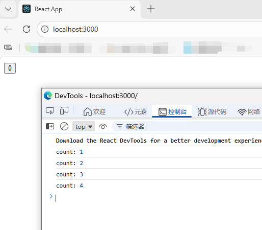


##### （2）修改对象状态

对于对象类型的状态变量，应该始终传给 set 方法一个**全新的对象**来进行修改

```jsx
import { useState } from 'react'

function App() {
  // 修改对象
  const [form, setForm] = useState({
    name: '孙笑川',
    age: 33
  })

  const changeForm = () => {
    setForm({
      ...form,
      name: '药水哥',
      age: '30'
    })
  }
  return (
    <div className="App">
      <p>姓名：{form.name}</p>
      <p>年龄：{form.age}</p>
      <button onClick={changeForm}>修改对象</button>
    </div>
  )
}

export default App

```


### 七、组件的样式处理

#### 1. 内联样式（不推荐）

```jsx
<div style={{ color='red' }}>测试</div>
```


#### 2. class 类名控制

```css
.App {
    color: red
}
```

```jsx
import './index.css'

function App() {
  return (
    <div className="App">测试</div>
  )
}

export default App

```


#### 3. 示例

```css
.test {
    color: plum;
}
```

```jsx
import './index.css'

const style = {
  color: 'lightBlue',
  fontSize: 20
}

function App() {
  return (
    <div className="App">
      <div style={style}>行内样式</div>
      <div className="test">行内样式</div>
    </div>
  )
}

export default App

```

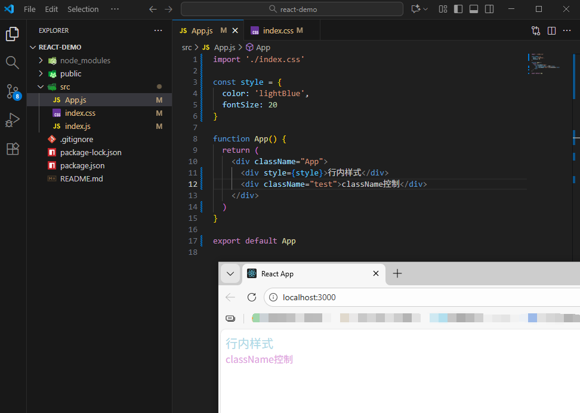


### 八、classnames 优化类名控制

该库可以通过条件动态控制 class 类名的显示，github：https://github.com/JedWatson/classnames


#### 1. 安装

```bash
npm install classnames
```


#### 2. 使用

```jsx
import classNames from 'classnames'

<li className="nav-sort">
    {tabs.map((item) => (
        <span
            key={item.type}
            className={classNames('nav-item', {
                active: type === item.type
            })}
            onClick={() => tabChangeHandler(item.type)}
            >
            {item.text}
        </span>
    ))}
</li>
```


### 九、受控表单绑定

概念：使用 useState 控制表单的状态

```jsx
import { useState } from 'react'

function App() {
  // 1. 通过 value 属性绑定 react 状态
  const [inputVal, setInputVal] = useState('')

  // 2. 绑定 onChange 事件，通过事件参数（即输入框最新的值）反向修改 react 状态
  return (
    <div className="App">
      <input
        type="text"
        value={inputVal}
        onChange={(e) => setInputVal(e.target.value)}
      ></input>
    </div>
  )
}

export default App

```


### 十、获取 DOM

通过 useRef 钩子函数实现：

1. 使用 useRef 创建 ref 对象
2. 在 DOM 可用时，通过创建的 xxxRef.current 拿到 DOM 对象

```jsx
import { useRef } from 'react'

function App() {
  const inputRef = useRef(null)

  // 组件渲染完毕后获取 DOM
  const getDom = () => {
    console.dir(inputRef.current)
  }

  return (
    <div className="App">
      <input type="text" ref={inputRef}></input>
      <button onClick={getDom}>获取 DOM</button>
    </div>
  )
}

export default App

```

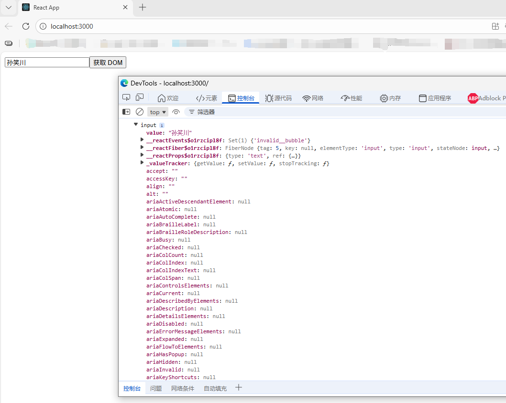


### 十一、组件间通信

#### 1. 概念

组件之间的数据传递


#### 2. 父传子

##### （1）实现步骤：

1. 父组件传递数据：在子组件标签上绑定属性
2. 子组件接收数据：子组件通过 props 参数接收数据

```jsx
function Son(props) {
  return <div>{props.name}</div>
}

function App() {
  const name = '孙笑川'
  return (
    <div className="App">
      <Son name={name} />
    </div>
  )
}

export default App

```

##### （2）props 说明

- props 可传递任意类型的数据

  数字、字符串、布尔值、数组、对象、函数、JSX

- props 是只读对象

  子组件只能读取 props 中的数据，不能直接修改（即父组件的数据只能由父组件修改）


#### 3. props children

当我们把内容嵌套在子组件标签中时，父组件会自动在名为 children 的 prop属性中接收该内容

```jsx
function Son(props) {
  console.log(props)
  return <div>Son Compent, {props.children}</div>
}

function App() {
  return (
    <div className="App">
      <Son>
        <span>Nested content</span>
      </Son>
    </div>
  )
}

export default App

```


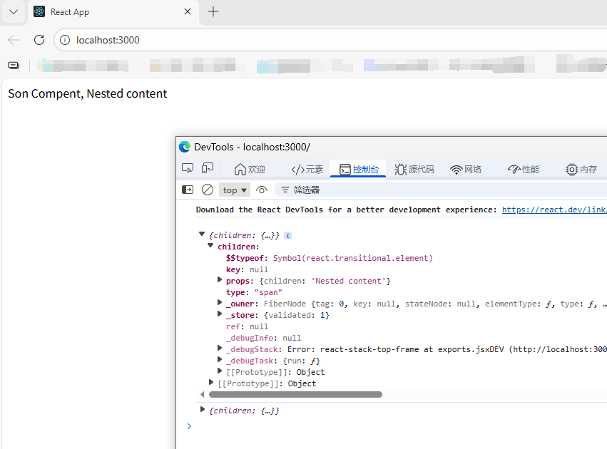


#### 4. 子传父

在子组件中调用父组件中的函数并传递参数

```jsx
import { useState } from 'react'

function Son({ getMsg }) {
  const data = '孙笑川'
  return (
    <div>
      Son Compent
      <button onClick={() => getMsg(data)}>点一下</button>
    </div>
  )
}

function App() {
  const [msg, setMsg] = useState('')
  const getMsg = (msg) => {
    setMsg(msg)
    console.log('son compent transmit data:', msg)
  }
  return (
    <div className="App">
      This is React Demo, {msg}
      <Son getMsg={getMsg} />
    </div>
  )
}

export default App

```

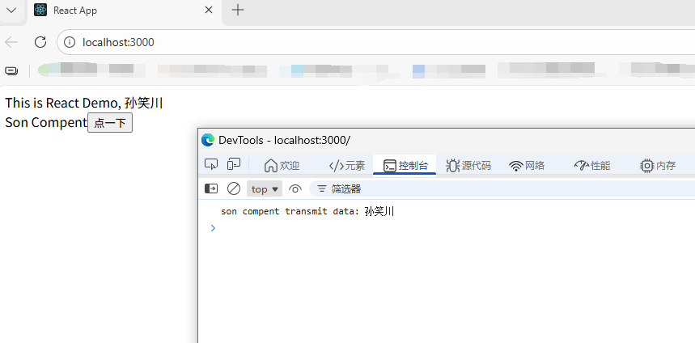


#### 5. 兄弟组件通信

借助“状态提示”机制，通过父组件进行兄弟组件间的数据传递

1. A 组件子传父
2. 父组件父传子给 B 组件

```jsx
import { useState } from 'react'

function A({ getAData }) {
  const data = 'a compent data'
  return (
    <div>
      <p>Son A Compent</p>
      <button onClick={() => getAData(data)}>A Compent</button>
    </div>
  )
}

function B(props) {
  return <p>Son B Compent, {props.data}</p>
}

function App() {
  const [data, setData] = useState('')
  const getAData = (data) => {
    setData(data)
    console.log(data)
  }
  return (
    <div className="App">
      <A getAData={getAData} />
      <B data={data} />
    </div>
  )
}

export default App

```

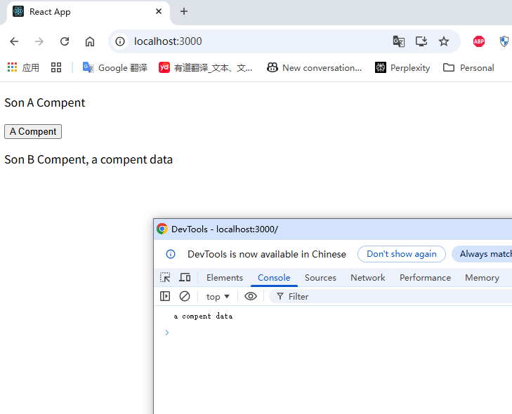


#### 6. 使用 Context 机制跨层级组件通信

实现步骤：

1. 使用 createContext 方法创建 Ctx 上下文对象
2. 在顶层组件（App）中通过 Ctx.provider 组件提供数据
3. 在底层组件中通过 useContext 钩子函数获取消费数据

```jsx
import { createContext, useContext } from 'react'

const Ctx = createContext()

function A() {
  return (
    <div>
      <p>Son A Compent</p>
    </div>
  )
}

function B() {
  const data = useContext(Ctx)
  return <p>Son B Compent, {data}</p>
}

function App() {
  const data = 'App data'
  return (
    <div className="App">
      <Ctx value={data}>
        this is App
        <A />
        <B />
      </Ctx>
    </div>
  )
}

export default App

```

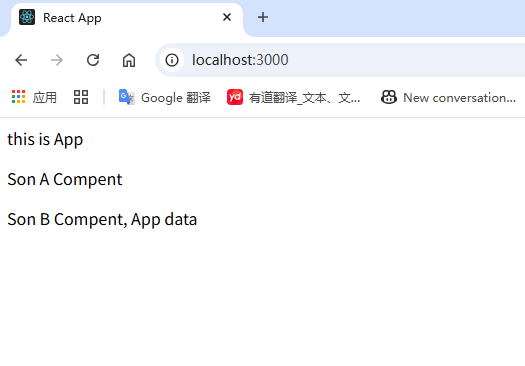


### 十二、useEffect

#### 1. 概念

useEffect 是 React 的一个 Hook 函数，用于在 React 组件中创建不是由事件引起而是由渲染本身引起的操作，如：ajax请求，更改 DOM 等


#### 2. 基础使用

语法：

```jsx
useEffect(() => {}, [])
```

参数一：函数（副作用函数），可在函数内部放置要执行的操作

参数二：数组（可选），数组中放置的是依赖项，不同依赖项会影响第一个参数（函数）的执行，当数组为空时，副作用函数只会在组件渲染完毕后执行一次

```jsx
import { useEffect, useState } from 'react'

const URL = 'https://geek.itheima.net/v1_0/channels'
function App() {
  const [list, setList] = useState([])
  useEffect(() => {
    async function getChannels() {
      const res = await fetch(URL)
      const jsonRes = await res.json()
      console.log(jsonRes)
      setList(jsonRes.data.channels)
    }
    getChannels()
  }, [])
  return (
    <div className="App">
      this is App
      <ul>
        {list.map((item) => (
          <li key={item.id}>{item.name}</li>
        ))}
      </ul>
    </div>
  )
}

export default App

```


#### 3. 依赖项参数说明

| 依赖项     | 副作用函数执行时机                  |
| ---------- | ----------------------------------- |
| 无         | 组件初始渲染 + 组件更新时执行       |
| 空数组     | 只在组件渲染完毕后执行一次          |
| 特定依赖项 | 组件初始渲染 + 特定依赖项变化时执行 |


#### （1）没有依赖项

```jsx
import { useEffect, useState } from 'react'

function App() {
  const [count, setCount] = useState(0)
  useEffect(() => {
    console.log('useEffect函数执行', count)
  })
  return (
    <div className="App">
      this is App
      <button onClick={() => setCount(count + 1)}>点击</button>
    </div>
  )
}

export default App

```

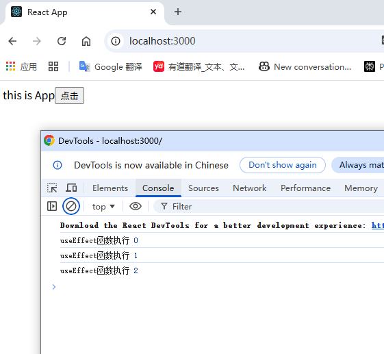


#### （2）空数组依赖

```jsx
import { useEffect, useState } from 'react'

function App() {
  const [count, setCount] = useState(0)
  useEffect(() => {
    console.log('useEffect函数执行', count)
  }, [])
  return (
    <div className="App">
      this is App
      <button onClick={() => setCount(count + 1)}>点击</button>
    </div>
  )
}

export default App

```

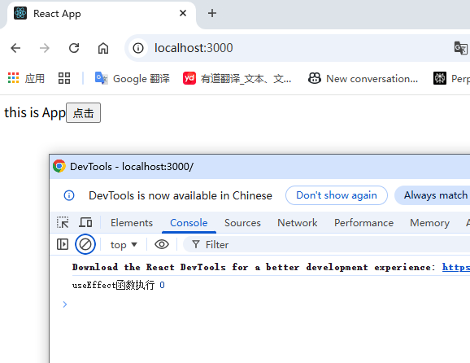


#### （3）特定依赖项

```jsx
import { useEffect, useState } from 'react'

function App() {
  const [count, setCount] = useState(0)
  useEffect(() => {
    console.log('useEffect函数执行', count)
  }, [count])
  return (
    <div className="App">
      this is App
      <button onClick={() => setCount(count + 1)}>点击</button>
    </div>
  )
}

export default App

```

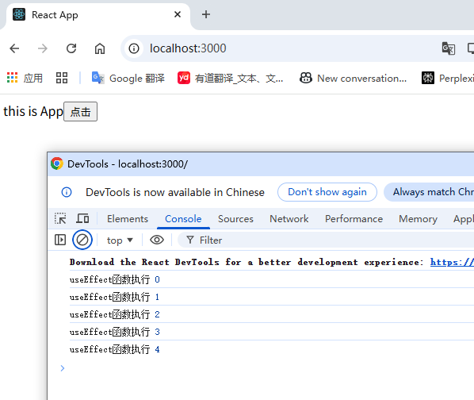


#### 4. 清除副作用

概念：在 useEffect 中编写的**由渲染本身引起的对接组件外部的操作**，就称为**副作用操作**，如：useEffect 中设置了一个定时器，在组件卸载时想清除定时器，这个过程就是清理副作用


语法：

```jsx
useEffect(() => {
    // 业务逻辑
    return () => {
        // 清除副作用
    }
}, [])
```


执行时机：一般情况下在组件卸载时执行

```jsx
import { useEffect, useState } from 'react'

function Son() {
  useEffect(() => {
    const timer = setInterval(() => {
      console.log('执行定时器')
    }, 1000)
    return () => {
      clearInterval(timer)
    }
  }, [])
  return <div>Son Compent</div>
}
function App() {
  const [show, setShow] = useState(true)
  return (
    <div className="App">
      this is App
      {show && <Son />}
      <button onClick={() => setShow(false)}>卸载Son组件</button>
    </div>
  )
}

export default App

```


### 十三、自定义 Hook 实现

#### 1. 概念

自定义 Hook 是以 use 开头的函数，通过它可以实现逻辑的封装和复用


#### 2. 案例

未使用自定义 Hook

```jsx
import { useState } from 'react'

function App() {
  const [show, setShow] = useState(true)
  const toggle = () => {
    setShow(false)
  }
  return (
    <div className="App">
      {show && <div>this is App</div>}
      <button onClick={toggle}>按钮</button>
    </div>
  )
}

export default App

```


使用自定义 Hook

```jsx
import { useState } from 'react'

function useToggle() {
  const [show, setShow] = useState(true)
  const toggle = () => {
    setShow(!show)
  }
  return {
    show,
    toggle
  }
}

function App() {
  const { show, toggle } = useToggle()
  return (
    <div className="App">
      {show && <div>this is App</div>}
      <button onClick={toggle}>按钮</button>
    </div>
  )
}

export default App

```


#### 3. 使用规则

（1）只能在组件中或其他自定义 Hook 函数中调用

（2）只能在组件得顶层调用，不能嵌套在 if、for、其他函数中


### 十四、Redux

#### 1. 概念

Redux 是 React 最常用的集中式状态管理工具，与 Vue 中的 Vuex、Pina 类似，可以独立于框架运行


#### 2. 快速上手

##### 计数器 demo

1. 定义 reducer 函数
2. 使用 createStore 方法传入 reducer 函数，生成 store 实例对象
3. 使用 store 实例的 subscribe 方法订阅数据的变化
4. 使用 store 实例的 dispatch 方法提交 action 对象，以此触发数据的变化（告诉 reducer 对数据的修改）
5. 使用 store 实例的 getState 方法获取最新的状态数据，更新视图

```html
<!doctype html>
<html lang="en">
  <head>
    <meta charset="UTF-8" />
    <title>Redux Quick Start Demo</title>
  </head>
  <body>
    <button id="decrBtn">-</button>
    <span id="countSpan">0</span>
    <button id="incrBtn">+</button>
  </body>
  <script type="module">
    import { legacy_createStore as createStore } from 'https://unpkg.com/redux@5.0.1/dist/redux.browser.mjs'

    // 1. 定义 reducer 函数
    function reducer(state = { count: 0 }, action) {
      if (action.type === 'INCREMENT') {
        return { count: state.count + 1 }
      }

      if (action.type === 'DECREMENT') {
        return { count: state.count - 1 }
      }
      return state
    }

    // 2. 创建 store 实例对象
    const store = createStore(reducer)

    // 3. 订阅数据变化
    store.subscribe(() => {
      console.log('count update', store.getState())

      // 5. 获取最新数据，更新状态
      document.getElementById('countBtn').innerText = store.getState()
    })

    // 4. 通过 dispatch 提交 action 更改状态
    const decrBtn = document.getElementById('decrBtn')
    decrBtn.addEventListener('click', () => {
      store.dispatch({ type: 'DECREMENT' })
    })

    const incrBtn = document.getElementById('incrBtn')
    incrBtn.addEventListener('click', () => {
      store.dispatch({ type: 'INCREMENT' })
    })
  </script>
</html>

```


管理数据的流程：

- state：存放管理的数据状态
- action：描述怎么修改数据
- reducer：（函数）根据 action 的表述生成一个新的 state

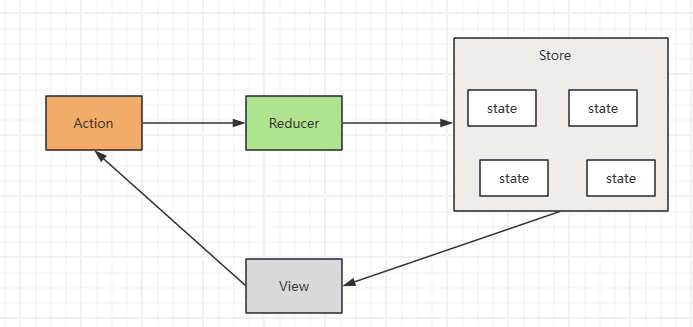


#### 3. 在 React 中使用 Redux

##### （1）Redux Toolkit（RTK）

RTK 是官方推荐的编写 Redux 逻辑的方式之一，是一套工具的集合，其作用如下：

- 简化 store 配置
- 内置 immer，支持可变式状态修改
- 内置 thunk，便于异步的创建和使用


##### （2）react-redux

连接 Redux 和 React 组件的中间件


##### （3）redux-demo

包含：cli 脚手架 redux 计数器案例、提交 action 传参、异步状态操作

https://github.com/suaxi/develop-relevant-notes/tree/main/front-end/React18/code/redux-demo


### 十五、Router

#### 1. 示例

https://github.com/suaxi/develop-relevant-notes/tree/main/front-end/React18/code/react-router-demo


#### 2. 路由导航

##### （1）声明式路由导航

在模板中通过 `<Link />` 组件描述要去哪里

```jsx
const Login = () => {
  return (
    <div>
      登录
      {/* 声明式导航 */}
      <Link to="/article">跳转到文章页面</Link>
    </div>
  )
}

export default Login

```

语法说明：通过给组件的 to 属性指定要跳转的路由path，组件会被渲染为浏览器支持的 a 链接，如需要传参时，直接通过字符串拼接的形式即可


##### （2）编程式导航

指通过 `useNavigate` 钩子函数得到导航方法，然后通过调用方法以命令式的形式进行路由跳转

```jsx
import { Link, useNavigate } from 'react-router-dom'
const Login = () => {
  const naigate = useNavigate()
  return (
    <div>
      登录
      {/* 声明式导航 */}
      <Link to="/article">跳转到文章页面</Link>
      {/* 编程式导航 */}
      <button onClick={() => naigate('/article')}>跳转到文章页面</button>
    </div>
  )
}

export default Login

```

语法说明：通过调用 `navigate` 方法传入路由 path 进行跳转


#### 3. 路由传参

##### （1）searchParams 传参

```jsx
naigate('/article?name="孙笑川"&age=33')
```

```jsx
const [params] = useSearchParams()
const name = params.get('name')
const age = params.get('age')
```


##### （2）params 传参

```jsx
naigate('/article/33')
```

```jsx
// 绑定参数
const router = createBrowserRouter([
  {
    path: '/article/:name/:age',
    element: <Article />
  }
])
```

```jsx
const params = useParams()
const name = params.name
const age = params.age
```


#### 4. 嵌套路由

在一级路由中又嵌套了其他路由，这种关系就叫做嵌套路由


##### （1）实现步骤

- 使用 children 属性配置路由嵌套关系
- 使用 `<Outlet />` 组件配置二级路由渲染位置

```jsx
{
  path: '/',
  element: <Layout />,
  children: [
    {
      path: 'board',
      element: <Board />
    },
    {
      path: 'about',
      element: <About />
    }
  ]
}
```

```jsx
const Layout = () => {
  return (
    <div>
      <h1>一级路由 Layout</h1>
      <Link to="/board">看板</Link>
      <br />
      <Link to="/about">关于</Link>

      {/* 二级路由出口 */}
      <Outlet />
    </div>
  )
}
```


##### （2）默认二级路由

一般情况下，访问一级路由时，是不会渲染二级路由的，当去掉二级路由的 path，添加 `index: true` 属性时，访问一级路由时，会默认渲染出二级路由

```jsx
{
  path: '/',
  element: <Layout />,
  children: [
    {
      // path: 'board',
      index: true,
      element: <Board />
    },
    {
      path: 'about',
      element: <About />
    }
  ]
}
```

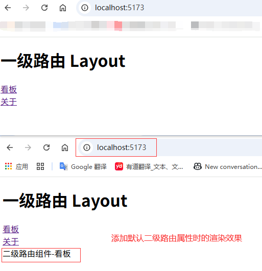


#### 5. 404 路由

当用户输入的 url 在整个路由配置中都找不到对应的 path 时，可以使用 404 兜底组件改善用户体验


##### （1）实现步骤

- 404 组件
- 在路由表数组的末尾，以 `*` 号作为路由 path 进行配置

```jsx
const NotFound = () => {
  return (
    <div>
      <h1>404 Not Found</h1>
    </div>
  )
}

export default NotFound

```

```jsx
{
  path: '*',
  element: <NotFound />
}
```


#### 6. 两种路由模式

| 路由模式 | url          | 原理                          | 是否需要后端支持 |
| -------- | ------------ | ----------------------------- | ---------------- |
| history  | url/layout   | history 对象 + pushState 事件 | 是               |
| hash     | usr/#/layout | 监听 hashChange 事件          | 否               |


使用方式：创建路由时，通过切换 `createBrowserRouter`、`createHashRouter` Api即可