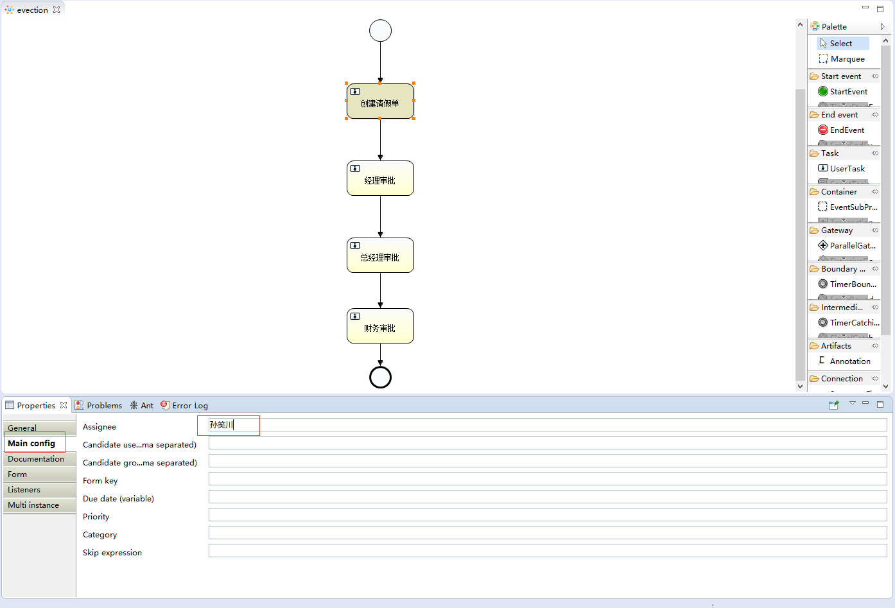
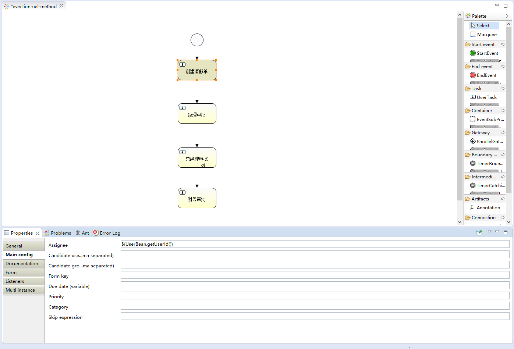

# Activiti7 工作流

## 一、简介

Activiti是一个工作流引擎，业务系统访问（操作）activiti的接口，就可以方便的操作流程相关数据，这样就可以把工作流环境与业务系统的环境集成在一起。

### 1. 流程定义

使用activiti流程建模工具 `activity-designer` 定义业务流程 `.bpmn` 文件， `.bpmn` 文件就是业务流程定义文件，通过 `xml` 定义业务流程。


### 2. 流程定义部署

activiti部署业务流程定义 `.bpmn` 文件，使用 `activiti` 提供的api把流程定义内容存储起来，在Activiti执行过程中可以查询定义的内容。


### 3. 流程实例

流程实例(ProcessInstance)：启动一个流程实例表示开始一次业务流程的运行。 在员工请假流程定义部署完成后，如果张三要请假就可以启动一个流程实例，如果李四要请假也启动一 个流程实例，两个流程的执行互相不影响。


### 4. 待办任务

待办任务(Task)：因为现在系统的业务流程已经交给 `activiti` 管理，通过 `activiti` 就可以查询当前流程执行到哪了，当前用户需要办理什么任务了，这些 `activiti` 帮我们管理了，而不需要开发人员自己编写在sql语句查询。


### 5. 用户办理任务

用户查询待办任务后，就可以办理某个任务，如果这个任务办理完成还需要其它用户办理，比如采购单：创建后由部门经理审核，这个过程也是由 `activiti` 帮我们完成。


### 6. 流程结束

当任务办理完成没有下一个任务结点，表明这个流程实例完成。


## 二、应用

### 1. 基本使用

#### （1）创建Maven应用

> pom.xml

```xml
<?xml version="1.0" encoding="UTF-8"?>
<project xmlns="http://maven.apache.org/POM/4.0.0"
         xmlns:xsi="http://www.w3.org/2001/XMLSchema-instance"
         xsi:schemaLocation="http://maven.apache.org/POM/4.0.0 http://maven.apache.org/xsd/maven-4.0.0.xsd">
    <modelVersion>4.0.0</modelVersion>

    <groupId>com.sw</groupId>
    <artifactId>ActivitiDemo</artifactId>
    <version>1.0-SNAPSHOT</version>

    <properties>
        <maven.compiler.source>8</maven.compiler.source>
        <maven.compiler.target>8</maven.compiler.target>
        <project.build.sourceEncoding>UTF-8</project.build.sourceEncoding>
        <slf4j.version>1.6.6</slf4j.version>
        <log4j.version>1.2.12</log4j.version>
        <activiti.version>7.0.0.Beta1</activiti.version>
        <mysql.version>8.0.26</mysql.version>
        <mybatis.version>3.5.13</mybatis.version>
        <dbcp.version>1.4</dbcp.version>
        <junit.version>4.12</junit.version>
        <commons-io.version>2.6</commons-io.version>
    </properties>

    <dependencies>
        <!-- activiti core -->
        <dependency>
            <groupId>org.activiti</groupId>
            <artifactId>activiti-engine</artifactId>
            <version>${activiti.version}</version>
        </dependency>
        <dependency>
            <groupId>org.activiti</groupId>
            <artifactId>activiti-spring</artifactId>
            <version>${activiti.version}</version>
        </dependency>

        <!-- bpmn 模型处理 -->
        <dependency>
            <groupId>org.activiti</groupId>
            <artifactId>activiti-bpmn-model</artifactId>
            <version>${activiti.version}</version>
        </dependency>

        <!-- bpmn 转换 -->
        <dependency>
            <groupId>org.activiti</groupId>
            <artifactId>activiti-bpmn-converter</artifactId>
            <version>${activiti.version}</version>
        </dependency>

        <!-- bpmn json转换 -->
        <dependency>
            <groupId>org.activiti</groupId>
            <artifactId>activiti-json-converter</artifactId>
            <version>${activiti.version}</version>
        </dependency>

        <!-- bpmn 布局 -->
        <dependency>
            <groupId>org.activiti</groupId>
            <artifactId>activiti-bpmn-layout</artifactId>
            <version>${activiti.version}</version>
            <exclusions>
                <exclusion>
                    <groupId>com.github.jgraph</groupId>
                    <artifactId>jgraphx</artifactId>
                </exclusion>
            </exclusions>
        </dependency>

        <!-- bpmn cloud -->
        <dependency>
            <groupId>org.activiti.cloud</groupId>
            <artifactId>activiti-cloud-services-api</artifactId>
            <version>${activiti.version}</version>
        </dependency>

        <!-- mysql -->
        <dependency>
            <groupId>mysql</groupId>
            <artifactId>mysql-connector-java</artifactId>
            <version>${mysql.version}</version>
        </dependency>

        <!-- mybatis -->
        <dependency>
            <groupId>org.mybatis</groupId>
            <artifactId>mybatis</artifactId>
            <version>${mybatis.version}</version>
        </dependency>

        <!-- dbcp -->
        <dependency>
            <groupId>commons-dbcp</groupId>
            <artifactId>commons-dbcp</artifactId>
            <version>${dbcp.version}</version>
        </dependency>

        <!-- junit -->
        <dependency>
            <groupId>junit</groupId>
            <artifactId>junit</artifactId>
            <version>${junit.version}</version>
        </dependency>

        <!-- log4j -->
        <dependency>
            <groupId>log4j</groupId>
            <artifactId>log4j</artifactId>
            <version>${log4j.version}</version>
        </dependency>

        <!-- sl4j -->
        <dependency>
            <groupId>org.slf4j</groupId>
            <artifactId>slf4j-api</artifactId>
            <version>${slf4j.version}</version>
        </dependency>
        <dependency>
            <groupId>org.slf4j</groupId>
            <artifactId>slf4j-log4j12</artifactId>
            <version>${slf4j.version}</version>
        </dependency>

        <!-- commons-io -->
        <dependency>
            <groupId>commons-io</groupId>
            <artifactId>commons-io</artifactId>
            <version>${commons-io.version}</version>
        </dependency>
    </dependencies>

</project>
```


#### （2）log4j

```properties
# Set root category priority to INFO and its only appender to CONSOLE.
#log4j.rootCategory=INFO, CONSOLE debug info warn error fatal
log4j.rootCategory=debug, CONSOLE, LOGFILE
# Set the enterprise logger category to FATAL and its only appender to CONSOLE.
log4j.logger.org.apache.axis.enterprise=FATAL, CONSOLE
# CONSOLE is set to be a ConsoleAppender using a PatternLayout.
log4j.appender.CONSOLE=org.apache.log4j.ConsoleAppender
log4j.appender.CONSOLE.layout=org.apache.log4j.PatternLayout
log4j.appender.CONSOLE.layout.ConversionPattern=%d{ISO8601} %-6r[%15.15t] %-5p %30.30c %x - %m\n
# LOGFILE is set to be a File appender using a PatternLayout.
log4j.appender.LOGFILE=org.apache.log4j.FileAppender
log4j.appender.LOGFILE.File=D:\logs\act\activiti.log
log4j.appender.LOGFILE.Append=true
log4j.appender.LOGFILE.layout=org.apache.log4j.PatternLayout
log4j.appender.LOGFILE.layout.ConversionPattern=%d{ISO8601} %-6r[%15.15t] %-5p %30.30c %x - %m\n
```


#### （3）添加Activiti配置文件

在resources下创建 `activiti.cfg.xml` （默认命名方式不能修改）文件

*此处使用单独配置数据源的方式*

```xml
<?xml version="1.0" encoding="UTF-8"?>
<beans xmlns="http://www.springframework.org/schema/beans"
       xmlns:xsi="http://www.w3.org/2001/XMLSchema-instance"
       xsi:schemaLocation="http://www.springframework.org/schema/beans http://www.springframework.org/schema/beans/spring-beans.xsd">
    <bean class="org.activiti.engine.impl.cfg.StandaloneProcessEngineConfiguration" id="processEngineConfiguration">
        <!--<property name="jdbcDriver" value="com.mysql.cj.jdbc.Driver"/>-->
        <!--<property name="jdbcUrl" value="jdbc:mysql://127.0.0.1:3306/activiti?characterEncoding=utf-8&amp;nullCatalogMeansCurrent=true&amp;serverTimezone=UTC"/>-->
        <!--<property name="jdbcUsername" value="root"/>-->
        <!--<property name="jdbcPassword" value="123456"/>-->
        <property name="databaseSchemaUpdate" value="true"/>
        <property name="dataSource" ref="dataSource" />
    </bean>

    <bean class="org.apache.commons.dbcp.BasicDataSource" id="dataSource">
        <property name="driverClassName" value="com.mysql.cj.jdbc.Driver"/>
        <property name="url" value="jdbc:mysql://127.0.0.1:3306/activiti?characterEncoding=utf-8&amp;nullCatalogMeansCurrent=true&amp;serverTimezone=UTC"/>
        <property name="username" value="root"/>
        <property name="password" value="123456"/>
        <property name="maxActive" value="3"/>
        <property name="maxIdle" value="2"/>
    </bean>
</beans>
```


#### （4）单元测试自动生成表结构

通过单元测试调用 `Activiti API` 来生成需要的表

```java
@Test
public void test01() {
    //使用classpath下的activiti.cfg.xml中的配置来创建ProcessEngine
    ProcessEngine engine = ProcessEngines.getDefaultProcessEngine();
    System.out.println(engine);
}
```


### 2. 表结构介绍

#### （1）表的命名规则和作用

+ ACT_RE ：`RE` 表示 `repository`，这个前缀的表包含了流程定义和流程静态资源 （图片，规则等等）
+ ACT_RU：`RU` 表示 `runtime`， 包含流程实例，任务，变量，异步任务，等运行中的 数据。`Activiti` 只在流程实例执行过程中保存这些数据，在流程结束时就会删除这些记录
+ ACT_HI：`HI` 表示 `history`， 包含历史数据，比如历史流程实例， 变量，任务等等
+ ACT_GE ： `GE` 表示 `general`，通用数据，用于不同场景下


#### （2）数据表介绍

| 表分类       | 表名             | 解释                     |
| ------------ | ---------------- | ------------------------ |
| 一般数据     | ACT_GE_BYTEARRAY | 通用的流程定义和流程资源 |
|              | ACT_GE_PROPERTY  | 系统相关属性 |
| 流程历史记录 | ACT_HI_ACTINST | 历史的流程实例 |
|              |ACT_HI_ATTACHMENT | 历史的流程附件 |
|              | ACT_HI_COMMENT | 历史的说明性信息 |
|              | ACT_HI_DETAIL | 历史的流程运行中的细节信息 |
|              | ACT_HI_IDENTITYLINK | 历史的流程运行过程中用户关系 |
|              | ACT_HI_PROCINST | 历史的流程实例 |
|              | ACT_HI_TASKINST | 历史的任务实例 |
|              | ACT_HI_VARINST | 历史的流程运行中的变量信息 |
| 流程定义表 | ACT_RE_DEPLOYMENT   | 部署单元信息 |
|              | ACT_RE_MODEL        | 模型信息 |
|              | ACT_RE_PROCDEF      | 已部署的流程定义 |
| 运行实例表 | ACT_RU_EVENT_SUBSCR | 运行时事件 |
|              | ACT_RU_EXECUTION | 运行时流程执行实例 |
|              | ACT_RU_IDENTITYLINK | 运行时用户关系信息，存储任务节点与参与者的相关信息 |
|              | ACT_RU_JOB | 运行时作业 |
|              | ACT_RU_TASK | 运行时任务 |
|              | ACT_RU_VARIABLE | 运行时变量表 |


### 3. ProcessEngine创建方式

前面使用的是 `getDefaultProcessEngine()` 方法来加载 `classpath` 下的 `activiti.cfg.xml` 文件，还可以通过自定义的方式加载配置文件

```java
@Test
public void test02() {
    //创建ProcessEngineConfiguration对象
    ProcessEngineConfiguration configuration = ProcessEngineConfiguration.createProcessEngineConfigurationFromResource("activiti.cfg.xml");
    //创建ProcessEngine对象
    ProcessEngine engine = configuration.buildProcessEngine();
    System.out.println(engine);
}
```


### 4. Service服务接口

Service是工作流引擎提供用于进行工作流部署、执行、管理的服务接口，使用这些接口就是操作服务对应的数据表

#### （1）创建方式

通过 `ProcessEngine` 创建 `Service`

```java
//RuntimeService
RuntimeService runtimeService = processEngine.getRuntimeService();

//RepositoryService
RepositoryService repositoryService = processEngine.getRepositoryService();

//TaskService
TaskService taskService = processEngine.getTaskService();
```


#### （2）Service总览

| 名称              | 作用         |
| ----------------- | ------------ |
| RepositoryService | 资源管理     |
| RuntimeService    | 流程运行管理 |
| TaskService       | 任务管理     |
| HistoryService    | 历史管理     |
| ManagementService | 引擎管理     |

+ RepositoryService：是 `activiti` 的资源管理类，提供了管理和控制流程发布包和流程定义的操作。使用工作流建模工具设计的业务流程图需要使用此 `service` 将流程定义文件的内容进行部署。除了部署流程定义以外还可以：
  + 查询引擎中的发布包和流程定义
  + 暂停或激活发布包，对应全部和特定流程定义，暂停意味着它们不能再执行任何操作了，激活是对应的反向操作
  + 获得多种资源，像是包含在发布包里的文件，或引擎自动生成的流程图。获得流程定义的pojo版本，可以用来通过java解析流程，而不必通过xml
+ RuntimeService：获取很多关于流程执行相关的信息
+ TaskService：获取任务的信息
+ HistoryService：查询历史信息，执行流程时，引擎会根据配置保存很多数据，如：流程实例启动时间，任务的参与者，完成任务的时间，每个流程实例的执行路径等等
+ ManagementService：提供了对 `Activiti` 流程引擎的管理和维护功能，这些功能主要用于 `Activiti` 系统的日常维护，而不在工作流驱动的应用程序中使用


###  5. 流程绘制

#### （1）绘制插件

IDEA在2019版本之后没有再维护 `Activiti` 的流程设计工具，此处使用 Eclipse 来进行流程设计


#### （2）绘制流程

指定流程主键


指定任务负责人




#### （3）图标介绍

流程符号 BPMN 2.0是业务流程建模符号2.0的缩写，它由Business Process Management Initiative这个非营利协会创建并不断发展。作为一种标识，BPMN 2.0是使用一些符号来明确业务流程设计流程图的一整套符号规范，它能增进业务建模时的沟通效率。 目前BPMN2.0是最新的版本，它用于在BPM上下文中进行布局和可视化的沟通。

BPMN 2.0的**基本符号**主要包含：

+ **事件 Event**

  

+ **活动 Activity**

  

+ **网关 GateWay**

  网关用来处理决策，常用网关有：

  

  + 排他网关：只有一条路径会被选择，流程执行到该网关时，按照输出流的顺序逐个计算，当条件的计算结果为 `true` 时，继续执行当前网关的输出流； 如果多条线路计算结果都是 `true`，则会执行第一个值为 `true` 的线路，如果所有网关计算结果没有 `true`，则引擎会抛出异常。 排他网关需要和条件顺序流结合使用，`default` 属性指定默认顺序流，当所有的条件不满足时会执行默认顺序流
  + 并行网关：所有路径会被同时选择：
    + 拆分：并行执行所有输出顺序流，为每一条顺序流创建一个并行执行线路
    + 合并：所有从并行网关拆分并执行完成的线路均在此等候，直到所有的线路都执行完成才继续向下执行
  + 包容网关：可以同时执行多条线路，也可以在网关上设置条件
    + 拆分：计算每条线路上的表达式，当表达式计算结果为 `true` 时，创建一个并行线路并继续执行
    + 合并：所有从包容网关拆分并执行完成的线路均在此等候，直到所有的线路都执行完成才继续向下 执行
  + 事件网关：专门为中间捕获事件设置的，允许设置多个输出流指向多个不同的中间捕获事件。当流程执行到事 件网关后，流程处于等待状态，需要等待抛出事件才能将等待状态转换为活动状态

+ **流向 Flow** 

  流是连接两个流程节点的连线，常见的流向有以下几种：

  

+ **Palette（画板）**

  + Connection  连接 Event事件
  + Task  任务
  + Gateway  网关
  + Container  容器
  + Boundary event  边界事件
  + Intermediate event  中间事件


### 6. 流程操作

#### （1）流程部署

流程部署即将流程设计器中定义的流程部署到 `activiti` 数据库中

> 单文件部署

```java
@Test
public void deploy() {
    //1.获取ProcessEngine对象
    ProcessEngine engine = ProcessEngines.getDefaultProcessEngine();
    //2.获取RepositoryService
    RepositoryService service = engine.getRepositoryService();
    //3.部署
    Deployment deploy = service.createDeployment()
        .addClasspathResource("bpmn/evection.bpmn")
        .addClasspathResource("bpmn/evection.png")
        .name("出差申请流程")
        .deploy();
    System.out.println("id: " + deploy.getId());
    System.out.println("name: " + deploy.getName());
}
```


> 压缩包文件部署

将bpmn和png文件打包为 `.zip` 文件，进行部署

```java
@Test
public void test04(){
    //定义zip文件的输入流
    InputStream inputStream =this.getClass().getClassLoader().getResourceAsStream("bpmn/evection.zip");
    //对inputStream做装饰
    ZipInputStream zipInputStream = new ZipInputStream(inputStream);
    ProcessEngine engine = ProcessEngines.getDefaultProcessEngine();
    RepositoryService repositoryService = engine.getRepositoryService();
    Deployment deploy = repositoryService.createDeployment()
                        .addZipInputStream(zipInputStream)
                        .name("出差申请流程")
                        .deploy();
    // 4.输出流程部署的信息
    System.out.println("流程部署的id:" + deploy.getId());
    System.out.println("流程部署的名称：" + deploy.getName());
}
```

流程定义部署后操作activiti中的三张表：

+ **act_re_deployment**：流程定义部署表，每部署一次就增加一条记录
+ **act_re_procdef** ：流程定义表，部署每个新的流程定义都会在这张表中增加一条记录
+ **act_ge_bytearray** ：流程资源表，流程部署的bpmn文件和png图片会保存在该表中


#### （2）启动流程实例

启动一个流程表示发起一个新的出差申请单

```java
@Test
public void start() {
    //1.获取ProcessEngine对象
    ProcessEngine engine = ProcessEngines.getDefaultProcessEngine();
    //2.RuntimeService
    RuntimeService service = engine.getRuntimeService();
    //3.启动
    ProcessInstance instance = service.startProcessInstanceByKey("evection");
    System.out.println("流程定义id: " + instance.getProcessDefinitionId());
    System.out.println("流程实例id: " + instance.getProcessInstanceId());
    System.out.println("当前活动id: " + instance.getActivityId());
}
```

启动流程实例涉及到的表：

+ **act_hi_actinst** 流程实例执行历史
+ **act_hi_identitylink** 流程的参与用户的历史信息
+ **act_hi_procinst** 流程实例历史信息
+ **act_hi_taskinst** 流程任务历史信息
+ **act_ru_execution** 流程执行信息
+ **act_ru_identitylink** 流程的参与用户信息
+ **act_ru_task** 任务信息


#### （3）任务查找

流程启动后，对应的任务负责人就可以查询自己当前能够处理的任务，查询出来的任务都是当前用户的待办任务

```java
@Test
public void queryTask() {
    //1.获取ProcessEngine对象
    ProcessEngine engine = ProcessEngines.getDefaultProcessEngine();
    //2.TaskService
    TaskService service = engine.getTaskService();
    //3.根据流程key、任务负责人查询
    List<Task> list = service.createTaskQuery().processDefinitionKey("evection").taskAssignee("zhansan").list();
    for (Task task : list) {
        System.out.println("流程定义id: " + task.getProcessDefinitionId());
        System.out.println("任务id: " + task.getId());
        System.out.println("任务负责人: " + task.getAssignee());
        System.out.println("任务名称: " + task.getName());
    }
}
```


#### （4）流程任务处理

任务负责人查询出来了待办的任务，选择任务进行处理，即完成任务

```java
@Test
public void dealTask() {
    //1.获取ProcessEngine对象
    ProcessEngine engine = ProcessEngines.getDefaultProcessEngine();
    //2.TaskService
    TaskService service = engine.getTaskService();
    //3.根据流程key、任务负责人查询
    Task task = service.createTaskQuery().processDefinitionKey("evection").taskAssignee("孙笑川").singleResult();
    //4.处理任务
    service.complete(task.getId());
}
```

孙笑川 处理完成之后，任务流转到药水哥处，接着由药水哥登录系统进行处理


#### （5）查询流程定义

查询流程相关的信息：流程的定义，流程的部署，流程定义的版本

```java
@Test
public void queryProcessDefinition() {
    //1.获取ProcessEngine对象
    ProcessEngine engine = ProcessEngines.getDefaultProcessEngine();
    //2.RepositoryService
    RepositoryService service = engine.getRepositoryService();
    List<ProcessDefinition> list = service.createProcessDefinitionQuery().processDefinitionKey("evection").orderByProcessDefinitionVersion().desc().list();
    for (ProcessDefinition processDefinition : list) {
        System.out.println("流程定义id: " + processDefinition.getId());
        System.out.println("流程定义name: " + processDefinition.getName());
        System.out.println("流程定义key: " + processDefinition.getKey());
        System.out.println("流程定义version: " + processDefinition.getVersion());
        System.out.println("流程部署id: " + processDefinition.getDeploymentId());
    }
}
```


#### （6）删除流程

```java
@Test
public void deleteProcess() {
    //1.获取ProcessEngine对象
    ProcessEngine engine = ProcessEngines.getDefaultProcessEngine();
    //2.RepositoryService
    RepositoryService service = engine.getRepositoryService();
    //如果该流程定义已经有启动了的流程实例，则无法删除
    service.deleteDeployment("1");
    //级联删除，设置为true时同时删除流程定义、运行中的流程实例
    //service.deleteDeployment("1", true);
}
```

*级联删除权限一般只开放给系统管理员*


#### （7）流程资源下载

用户想要查看流程定义相关的信息时，可以从数据库中下载对应资源到本地（数据库直接查询blob类型数据或通过api下载资源文件，二选一即可）

```java
@Test
public void readFileFromDatabase() throws IOException {
    //1.获取ProcessEngine对象
    ProcessEngine engine = ProcessEngines.getDefaultProcessEngine();
    //2.RepositoryService
    RepositoryService service = engine.getRepositoryService();
    //3.查询器
    ProcessDefinition definition = service.createProcessDefinitionQuery().processDefinitionKey("evection").singleResult();
    //4.流程部署id
    String deploymentId = definition.getDeploymentId();
    //png
    InputStream pngIs = service.getResourceAsStream(deploymentId, definition.getDiagramResourceName());
    //bpmn
    InputStream bpmnIs = service.getResourceAsStream(deploymentId, definition.getResourceName());
    //5.保存
    File pngFile = new File("d:/evection.png");
    File bpmnFile = new File("d:/evection.bpmn");
    FileOutputStream pngOs = new FileOutputStream(pngFile);
    FileOutputStream bpmnOs = new FileOutputStream(bpmnFile);
    IOUtils.copy(pngIs, pngOs);
    IOUtils.copy(bpmnIs, bpmnOs);

    //6.关闭流
    pngIs.close();
    pngOs.close();
    bpmnIs.close();
    bpmnOs.close();
}
```


#### （8）查看历史流程信息

即使流程定义已经被删除了，流程执行的实例信息依然保存在Activiti的 `act_hi_*` 相关的表中

```java
@Test
public void processHistoryInfo() {
    //1.获取ProcessEngine对象
    ProcessEngine engine = ProcessEngines.getDefaultProcessEngine();
    //2.HistoryService
    HistoryService service = engine.getHistoryService();
    HistoricActivityInstanceQuery instanceQuery = service.createHistoricActivityInstanceQuery().processDefinitionId("evection:1:4").orderByHistoricActivityInstanceStartTime().desc();
    List<HistoricActivityInstance> list = instanceQuery.list();
    for (HistoricActivityInstance hi : list) {
        System.out.println(hi.getActivityId());
        System.out.println(hi.getActivityName());
        System.out.println(hi.getActivityType());
        System.out.println(hi.getAssignee());
        System.out.println(hi.getProcessDefinitionId());
        System.out.println(hi.getProcessInstanceId());
        System.out.println("--------------------------------");
    }
}
```


## 三、流程实例

### 1. 概念

流程实例(ProcessInstance)代表流程定义的执行实例

一个流程实例包括了所有的运行节点，可以通过这个对象来了解当前流程实例的进度等信息，例如：用户或者程序按照流程定义的内容发起了一个流程，这就是一个流程实例


### 2. 业务管理

流程定义部署在Activiti后，我们就可以在系统中通过Activiti去管理流程的执行，但是如果要将流程实例和业务数据关联，这时需要使用到Activiti中预留的BusinessKey（业务标识）来关联

```java
@Test
public void associateBusinessKey() {
    //1.获取ProcessEngine对象
    ProcessEngine engine = ProcessEngines.getDefaultProcessEngine();
    //2.RuntimeService
    RuntimeService service = engine.getRuntimeService();
    //3.启动流程，添加businessKey
    ProcessInstance instance = service.startProcessInstanceByKey("evection", "10001");
    System.out.println("businessKey: " + instance.getBusinessKey());
}
```


### 3. 流程实例的挂起和激活

在实际场景中可能由于流程变更需要将当前运行的流程暂停而不删除，流程暂停后将不能继续执行

#### （1）全部流程挂起

操作流程的定义为挂起状态，该流程定义下边所有的流程实例全部暂停。 流程定义为挂起状态时，该流程定义将**不允许启动新的**流程实例，同时该流程定义下的所有的流程实例都将**全部挂起暂停执行**

```java
@Test
public void processSuspendOrActive() {
    //1.获取ProcessEngine对象
    ProcessEngine engine = ProcessEngines.getDefaultProcessEngine();
    //2.RepositoryService
    RepositoryService service = engine.getRepositoryService();
    //3.查询流程定义的对象
    ProcessDefinition definition = service.createProcessDefinitionQuery().processDefinitionKey("evection").singleResult();
    //4.获取当前流程定义的状态
    String id = definition.getId();
    boolean suspended = definition.isSuspended();
    //5.挂起 ---> 激活，否则反之
    if (suspended) {
        service.activateProcessDefinitionById(id, true, null);
        System.out.println("流程：" + id + "，已激活");
    } else {
        service.suspendProcessDefinitionById(id, true, null);
        System.out.println("流程：" + id + "，已挂起");
    }
}
```

注：挂起流程定义后，实例对象中（数据库数据的状态）的状态会修改为 2，此时如果再去操作对应的流程实例会**抛出异常**，将挂起的流程转变为激活状态，则对应的状态值会从 2 更新为 1（即可以正常处理业务流程）


### 4. 单个实例挂起

针对单个流程执行挂起操作，则将指定的流程实例挂起，当前流程定义的其他流程实例不受干扰，此时如果去操作已挂起的该流程实例，同理会抛出异常

```java
@Test
public void singleProcessSuspendOrActive() {
    //1.获取ProcessEngine对象
    ProcessEngine engine = ProcessEngines.getDefaultProcessEngine();
    //2.RuntimeService
    RuntimeService service = engine.getRuntimeService();
    //3.查询流程实例对象
    ProcessInstance instance = service.createProcessInstanceQuery().processInstanceId("2501").singleResult();
    //4.获取相关状态
    String id = instance.getId();
    boolean suspended = instance.isSuspended();
    //5.执行挂起/激活
    if (suspended) {
        service.activateProcessInstanceById(id);
        System.out.println("流程实例：" + id + "，已激活");
    } else {
        service.suspendProcessInstanceById(id);
        System.out.println("流程实例：" + id + "，已挂起");
    }
}
```


## 四、个人任务

### 1. 分配任务负责人

#### （1）固定分配

在进行业务流程设计的时候指定固定的任务负责人


Properties ---> Main Config ---> Assignee


#### （2）表达式分配

在Activiti中支持使用UEL表达式，UEL表达式是Java EE6 规范的一部分， UEL(Unified Expression Language) 即统一表达式语言

Activiti支持两种UEL表达式： `UEL-value` 和 `UEL-method`


> **UEL-value**

创建一个新的流程


使用表达式


之后的几个负责人以 `${assignee0}`, `${assignee1}`...的形式以此类推

流程绘制完成之后，进行部署，在启动流程实例时给 UEL 表达式赋值

```java
@Test
public void deploy() {
    //1.获取ProcessEngine对象
    ProcessEngine engine = ProcessEngines.getDefaultProcessEngine();
    //2.获取RepositoryService
    RepositoryService service = engine.getRepositoryService();
    //3.部署
    Deployment deploy = service.createDeployment()
        .addClasspathResource("bpmn/evection-uel.bpmn")
        .addClasspathResource("bpmn/evection-uel.png")
        .name("出差申请流程-UEL")
        .deploy();
    System.out.println("id: " + deploy.getId());
    System.out.println("name: " + deploy.getName());
}

@Test
public void createProcess() {
    ProcessEngine engine = ProcessEngines.getDefaultProcessEngine();
    RuntimeService service = engine.getRuntimeService();
    //设置assignee
    Map<String, Object> map = new HashMap<>();
    map.put("assignee0", "zhangsan");
    map.put("assignee1", "lisi");
    map.put("assignee2", "wangwu");
    map.put("assignee3", "xiaoming");
    service.startProcessInstanceByKey("evection-uel", map);
}
```

启动成功后，可在 `act_ru_variable` 表中查找对应的赋值信息


> **UEL-method**



UserBean即注册到Spring容器中的Bean，表示调用该对象的 `getUserId` 方法


> **UEL-method 与 UEL-value 结合**

如： `${userService.findManager(emp)}`

`userService` 是 Spring 容器的一个bean，`findManager` 是该 bean 的一个方法，emp 是 activiti 流程变量， emp作为参数传到 `userService.findManager` 方法中


> 其他

表达式支持解析基础类型、 bean、 list、 array 和 map，也可作为条件判断，如： `${order.price > 100 && order.price < 250}`


#### （3）分配监听器

使用监听器来完成负责人的指定，在流程设计的时候就不需要指定assignee Event选项


> Event分类：

+ **create**:任务创建后触发 
+ **assignment**：任务分配后触发 
+ **Delete**：任务完成后触发 
+ **All**：所有事件都触发


> 自定义监听器

```java
package com.sw.listener;

import org.activiti.engine.delegate.DelegateTask;

public class TaskListener implements org.activiti.engine.delegate.TaskListener {

    @Override
    public void notify(DelegateTask delegateTask) {
        if ("创建请假单".equals(delegateTask.getName()) && "create".equals(delegateTask.getEventName())) {
            //指定任务负责人
            delegateTask.setAssignee("zhangsan-listener");
        }
    }
}
```


> 测试

```java
@Test
public void deploy() {
    //1.获取ProcessEngine对象
    ProcessEngine engine = ProcessEngines.getDefaultProcessEngine();
    //2.获取RepositoryService
    RepositoryService service = engine.getRepositoryService();
    //3.部署
    Deployment deploy = service.createDeployment()
        .addClasspathResource("bpmn/evection-listener.bpmn")
        .addClasspathResource("bpmn/evection-listener.png")
        .name("出差申请流程-Listener")
        .deploy();
    System.out.println("id: " + deploy.getId());
    System.out.println("name: " + deploy.getName());
}

@Test
public void createProcess() {
    ProcessEngine engine = ProcessEngines.getDefaultProcessEngine();
    RuntimeService service = engine.getRuntimeService();
    service.startProcessInstanceByKey("evection-listener");
}
```


#### （4）查询任务

> **查询指定任务负责人的待办任务**

```java
@Test
public void queryPersonalTaskList() {
    //流程定义key
    String processDefinitionKey = "evection";

    //任务负责人
    String assignee = "lisi";

    ProcessEngine engine = ProcessEngines.getDefaultProcessEngine();
    TaskService taskService = engine.getTaskService();
    List<Task> list = taskService.createTaskQuery().processDefinitionKey(processDefinitionKey).taskAssignee(assignee).list();
    if (list != null && list.size() > 0) {
        for (Task task : list) {
            System.out.println("----------------------");
            System.out.println("流程实例id：" + task.getProcessInstanceId());
            System.out.println("任务id：" + task.getId());
            System.out.println("任务负责人：" + task.getAssignee());
            System.out.println("任务名称：" + task.getName());
        }
    }
}
```


> **关联 businessKey**

在 activiti 实际应用中，查询待办任务的同时可能还要显示出和业务系统相关的数据，如：查询待审批出差任务列表需要将出差单的日期、 出差天数等信息显示出来，出差天数等信息在业务系统中存在，而并没有在 activiti 数据库中，所以无法通过 activiti 的 api 查询到出差相关的信息。 

实现： 在查询待办任务时，通过 businessKey（业务标识 ）关联查询业务系统的出差信息表单，从而查询出出差天数等信息

```java
@Test
public void queryProcessInstance() {
    ProcessEngine engine = ProcessEngines.getDefaultProcessEngine();

    //查询流程实例id
    TaskService taskService = engine.getTaskService();
    Task task = taskService.createTaskQuery().processDefinitionKey("evection").taskAssignee("lisi").singleResult();
    String instanceId = task.getProcessInstanceId();

    //根据流程实例id查询businessKey
    RuntimeService runtimeService = engine.getRuntimeService();
    ProcessInstance instance = runtimeService.createProcessInstanceQuery().processInstanceId(instanceId).singleResult();
    System.out.println("businessKey: " + instance.getBusinessKey());
}
```


#### （5）办理任务

```java
@Test
public void completeTask() {
    //任务id
    String taskId = "10005";

    //任务负责人
    String assignee = "zhansan";

    ProcessEngine engine = ProcessEngines.getDefaultProcessEngine();
    TaskService taskService = engine.getTaskService();
    Task task = taskService.createTaskQuery().taskId(taskId).taskAssignee(assignee).singleResult();
    if (task == null) {
        throw new IllegalArgumentException(assignee + " 无权限处理该任务！");
    }
    taskService.complete(taskId);
    System.out.println("任务：" + taskId + "，已完成");
}
```

注：在实际应用中，完成任务前需要校验任务的负责人是否具有该任务的办理权限


## 五、流程变量

### 1. 概念

流程变量在 activiti 中是一个非常重要的角色，流程运转有时需要靠流程变量，业务系统和 activiti 结合时少不了流程变量，流程变量就是 activiti 在管理工作流时根据管理需要而设置的变量。 如：在出差申请流程流转时如果出差天数大于 3 天则由总经理审核，否则由人事直接审核， 出差天数就可以设置为**流程变量**，在流程流转时使用。 

<font color='red'>注：虽然流程变量中可以存储业务数据，可以通过activiti的api查询流程变量从而实现查询业务数据， 但是不建议这样使用，因为业务数据查询由业务系统负责，activiti设置流程变量**是为了流程执行需要而创建的**。</font>


### 2. 流程变量类型

如果将 pojo 存储到流程变量中，必须实现序列化接口 serializable，为了**防止由于新增字段无法反序列化，需要生成 serialVersionUID**


### 3. 流程变量作用域

流程变量的作用域可以是一个流程实例(processInstance)，或一个任务(task)，或一个执行实例 (execution)

+ global变量

  流程变量的默认作用域是流程实例，当一个流程变量的作用域为流程实例时，可以称为 global 变量

  注：Global变量：userId（变量名）、xxx（变量值） global 变量中变量名不允许重复，设置相同名称的变量，后设置的值会覆盖前设置的变量值

+ local变量

  任务和执行实例仅仅是针对一个任务和一个执行实例范围，范围没有流程实例大， 称为 local 变量。Local 变量由于在不同的任务或不同的执行实例中，作用域互不影响，变量名可以相同没有影响。Local 变量名也可以和 global 变量名相同，也是没有影响的


### 4. 流程表变量的使用方法

#### （1）在属性上使用UEL表达式

可以在 assignee 处设置 UEL 表达式，表达式的值为任务的负责人，比如： ${assignee}， assignee 就 是一个流程变量名称， Activiti获取UEL表达式的值，即流程变量assignee的值 ，将assignee的值作为任务的负责人进行任务分配


#### （2）在连线上使用UEL表达式

可以在连线上设置UEL表达式，决定流程走向。 比如：${price<10000} ，price就是一个流程变量名称，uel表达式结果类型为布尔类型， 如果UEL表达式是true，则决定流程执行走向（即流程走这条连线）


### 5. 使用流程变量

例：员工创建出差申请单，由部门经理审核，部门经理申请通过后3天以下由财务直接申批，3天以上先由总经理审批，总经理审批通过后再由财务审批


### （1）流程定义

先通过UEL-value来设置负责人


然后在分支线上来设置条件


注：此处还可以通过对象参数命名，比如 evection.num


另一根线对应的设置


设置完成之后即可部署流程


### （2）使用global变量

> 创建pojo对象

```java
public class Evection implements Serializable {

    /**
     * id
     */
    private long id;

    /**
     * 名称
     */
    private String evectionName;

    /**
     * 出差天数
     */
    private double num;

    /**
     * 开始日期
     */
    private Date startDate;

    /**
     * 结束日期
     */
    private Date endDate;

    /**
     * 目的地
     */
    private String destination;

    /**
     * 事由
     */
    private String reason;

    public Evection() {
    }

    public Evection(long id, String evectionName, double num, Date startDate, Date endDate, String destination, String reason) {
        this.id = id;
        this.evectionName = evectionName;
        this.num = num;
        this.startDate = startDate;
        this.endDate = endDate;
        this.destination = destination;
        this.reason = reason;
    }

    public long getId() {
        return id;
    }

    public void setId(long id) {
        this.id = id;
    }

    public String getEvectionName() {
        return evectionName;
    }

    public void setEvectionName(String evectionName) {
        this.evectionName = evectionName;
    }

    public double getNum() {
        return num;
    }

    public void setNum(double num) {
        this.num = num;
    }

    public Date getStartDate() {
        return startDate;
    }

    public void setStartDate(Date startDate) {
        this.startDate = startDate;
    }

    public Date getEndDate() {
        return endDate;
    }

    public void setEndDate(Date endDate) {
        this.endDate = endDate;
    }

    public String getDestination() {
        return destination;
    }

    public void setDestination(String destination) {
        this.destination = destination;
    }

    public String getReason() {
        return reason;
    }

    public void setReason(String reason) {
        this.reason = reason;
    }

    @Override
    public String toString() {
        return "Evection{" +
                "id=" + id +
                ", evectionName='" + evectionName + '\'' +
                ", num=" + num +
                ", startDate=" + startDate +
                ", endDate=" + endDate +
                ", destination='" + destination + '\'' +
                ", reason='" + reason + '\'' +
                '}';
    }
}
```

> 部署流程

```java
@Test
public void deploy() {
    //1.获取ProcessEngine对象
    ProcessEngine engine = ProcessEngines.getDefaultProcessEngine();
    //2.获取RepositoryService
    RepositoryService service = engine.getRepositoryService();
    //3.部署
    Deployment deploy = service.createDeployment()
        .addClasspathResource("bpmn/evection-variable.bpmn")
        .addClasspathResource("bpmn/evection-variable.png")
        .name("出差申请流程-Variable")
        .deploy();
    System.out.println("id: " + deploy.getId());
    System.out.println("name: " + deploy.getName());
}
```

> 设置流程变量

a. 启动流程时设置，变量的作用域是整个流程实例

通过startProcessInstanceByKey方法设置流程变量的作用域是一个流程实例，流程变量使用Map存储，同一个流程实例map中的key相同时，后者会覆盖前者

```java
@Test
public void startAndSet() {
    ProcessEngine engine = ProcessEngines.getDefaultProcessEngine();
    RuntimeService runtimeService = engine.getRuntimeService();

    String key = "evection-variable";

    Map<String, Object> variables = new HashMap<>();
    Evection evection = new Evection();
    evection.setNum(2d);
    variables.put("evection", evection);
    variables.put("assignee0", "zhangsan");
    variables.put("assignee1", "lisi");
    variables.put("assignee2", "wangwu");
    variables.put("assignee3", "xiaoming");
    ProcessInstance instance = runtimeService.startProcessInstanceByKey(key, variables);
    System.out.println("流程实例名称：" + instance.getName());
    System.out.println("流程定义id：" + instance.getProcessDefinitionId());
}
```

处理任务

```java
@Test
public void completeTask() {
    String key = "evection-variable";
    String assignee = "lisi";

    ProcessEngine engine = ProcessEngines.getDefaultProcessEngine();
    TaskService taskService = engine.getTaskService();

    Task task = taskService.createTaskQuery().processDefinitionKey(key).taskAssignee(assignee).singleResult();
    if (task != null) {
        taskService.complete(task.getId());
        System.out.println("任务：" + task.getId() + "，" + task.getName() + "，完成");
    }
}
```


b. 处理任务时设置

在完成任务时设置流程变量，该流程变量只有在该任务完成后其它结点才可使用该变量，它的作用域是整个流程实例，如果设置的流程变量的key在流程实例中已存在相同的名字则后设置的变量会替换前边设置的变量

```java
@Test
public void startProcess() {
    ProcessEngine engine = ProcessEngines.getDefaultProcessEngine();
    RuntimeService runtimeService = engine.getRuntimeService();

    String key = "evection-variable";

    Map<String, Object> variables = new HashMap<>();
    variables.put("assignee0", "zhangsan");
    variables.put("assignee1", "lisi");
    variables.put("assignee2", "wangwu");
    variables.put("assignee3", "xiaoming");
    ProcessInstance instance = runtimeService.startProcessInstanceByKey(key, variables);
    System.out.println("流程实例名称：" + instance.getName());
    System.out.println("流程定义id：" + instance.getProcessDefinitionId());
}
```

处理时设置

```java
@Test
public void doingSet() {
    String taskId = "1404";

    ProcessEngine processEngine = ProcessEngines.getDefaultProcessEngine();
    TaskService taskService = processEngine.getTaskService();

    Map<String, Object> variables = new HashMap<>();
    Evection evection = new Evection();
    evection.setNum(3d);
    variables.put("evection", evection);
    taskService.setVariablesLocal(taskId, variables);
    taskService.complete(taskId);
}
```

注： 通过当前任务设置流程变量，需要指定当前任务id，如果当前执行的任务id不存在则抛出异常（任务办理时也是通过map设置流程变量，一次可以设置多个变量）


c. 当前流程实例设置

通过流程实例id设置全局变量，该流程实例必须未执行完成（即该流程实例还没有走完/结束）

```java
@Test
public void setLocalVariableByTaskId(){
    String taskId="1404";

    ProcessEngine processEngine = ProcessEngines.getDefaultProcessEngine();
    TaskService taskService = processEngine.getTaskService();

    Evection evection = new Evection ();
    evection.setNum(3d);
    taskService.setVariableLocal(taskId, "evection", evection);
    // 可以通过map一次设置多个值
    //taskService.setVariablesLocal(taskId, variables)
}
```

注：任务id必须是当前待办的任务id，act_ru_task中存在，如果该任务已结束，会抛出异常，同时也可以通过 taskService.getVariable() 方法获取流程变量


### （3）设置local变量

a. 任务办理时设置

任务办理时设置local流程变量，当前运行的流程实例只能在该任务结束前使用，任务结束该变量无法在 当前流程实例使用，可以通过查询历史任务查询

```java
@Test
public void completTask() {
    //任务id
    String taskId = "1404";
    //获取processEngine
    ProcessEngine processEngine = ProcessEngines.getDefaultProcessEngine();
    TaskService taskService = processEngine.getTaskService();
    //定义流程变量
    Map<String, Object> variables = new HashMap<String, Object>();
    Evection evection = new Evection ();
    evection.setNum(3d);
    //定义流程变量
    Map<String, Object> variables = new HashMap<>();
    //变量名是evection，变量值是evection对象
    variables.put("evection", evection);
    //设置local变量，作用域为该任务
    taskService.setVariablesLocal(taskId, variables);
    //完成任务
    taskService.complete(taskId);
}
```

注：作用域为当前任务，每个任务可以设置同名的变量，互不影响


b. 通过当前任务设置

```java
@Test
public void setLocalVariableByTaskId(){
    String taskId="1404";

    ProcessEngine processEngine = ProcessEngines.getDefaultProcessEngine();
    TaskService taskService = processEngine.getTaskService();

    Evection evection = new Evection ();
    evection.setNum(3d);
    taskService.setVariableLocal(taskId, "evection", evection);
    // 可以通过map一次设置多个值
    //taskService.setVariablesLocal(taskId, variables)
}
```

注：同理全局变量设置时的前提条件，即当前任务不能执行完/结束


c. 补充

部门经理审核、总经理审核、财务审核时设置local变量，可通过historyService查询每个历史任务时一起将流程变量的值也查询出来

```java
@Test
public void queryHistoryInfo() {
    //创建历史任务查询对象
    HistoricTaskInstanceQuery historicTaskInstanceQuery = historyService.createHistoricTaskInstanceQuery();
    //查询结果包括local变量
    historicTaskInstanceQuery.includeTaskLocalVariables();
    for (HistoricTaskInstance historicTaskInstance : list) {
        System.out.println("==============================");
        System.out.println("任务id：" + historicTaskInstance.getId());
        System.out.println("任务名称：" + historicTaskInstance.getName());
        System.out.println("任务负责人：" + historicTaskInstance.getAssignee());
        System.out.println("任务local变量："+ historicTaskInstance.getTaskLocalVariables());
}
```


## 六、组任务

### 1. 组任务处理流程

#### （1）查询组任务

指定候选人，查询该候选人当前的待办任务，候选人不能立即办理任务


#### （2）拾取(claim)任务

该组任务的所有候选人都能拾取

 将候选人的组任务，变成个人任务，原来候选人就变成了该任务的负责人

如果拾取后不想办理该任务时怎么办？

需要将已经拾取的个人任务归还到组里边，将个人任务变成了组任务（即设置assignee为null）


#### （3）查询个人任务

查询方式同理个人任务部分，根据assignee查询用户负责的个人任务


#### （4）办理个人任务

同理任务处理


### 2. 查询组任务

根据候选人查询组任务

```java
@Test
public void queryGroupTask() {
    String key = "evection1";
    String candidateUser = "zhangsan";
    ProcessEngine engine = ProcessEngines.getDefaultProcessEngine();
    TaskService taskService = engine.getTaskService();
    List<Task> list = taskService.createTaskQuery()
        .processDefinitionKey(key)
        .taskCandidateUser(candidateUser)
        //.taskCandidateOrAssigned(candidateUser)
        .list();
    for (Task task : list) {
        System.out.println("流程实例id：" + task.getProcessInstanceId());
        System.out.println("任务id：" + task.getId());
        System.out.println("任务名称：" + task.getName());
        System.out.println("负责人：" + task.getAssignee());
    }
}
```


### 3. 拾取组任务

候选人员拾取组任务后该任务变为自己（即指定候选人）的个人任务

```java
@Test
public void claimTask() {
    String taskId = "45002";
    String userId = "zhangsan";

    ProcessEngine engine = ProcessEngines.getDefaultProcessEngine();
    TaskService taskService = engine.getTaskService();
    Task task = taskService.createTaskQuery().taskId(taskId).taskCandidateUser(userId).singleResult();
    if (task != null) {
        taskService.claim(taskId, userId);
        System.out.println("任务拾取成功");
    }
}
```


### 4. 查询个人待办任务

查询方式同理个人任务查询

```java
@Test
public void queryGroupTask() {
    String key = "evection1";
    String candidateUser = "zhangsan";
    ProcessEngine engine = ProcessEngines.getDefaultProcessEngine();
    TaskService taskService = engine.getTaskService();
    List<Task> list = taskService.createTaskQuery()
        .processDefinitionKey(key)
        //.taskCandidateUser(candidateUser)
        //.taskCandidateOrAssigned(candidateUser)
        .taskAssignee(candidateUser)
        .list();
    for (Task task : list) {
        System.out.println("流程实例id：" + task.getProcessInstanceId());
        System.out.println("任务id：" + task.getId());
        System.out.println("任务名称：" + task.getName());
        System.out.println("负责人：" + task.getAssignee());
    }
}
```


### 5. 办理个人任务

```java
@Test
public void completeTask() {
    ProcessEngine engine = ProcessEngines.getDefaultProcessEngine();
    TaskService taskService = engine.getTaskService();
    taskService.complete("42505");
    System.out.println("任务完成");
}
```


### 6. 归还组任务

设置 assignee 为 null 即可

```java
@Test
public void taskBack() {
    String taskId = "45002";
    String userId = "zhangsan";
    ProcessEngine engine = ProcessEngines.getDefaultProcessEngine();
    TaskService taskService = engine.getTaskService();
    Task task = taskService.createTaskQuery().taskId(taskId).taskAssignee(userId).singleResult();
    if (task != null) {
        //设置userId为null，则归还组任务
        taskService.setAssignee(taskId, null);
        System.out.println("归还任务成功");
    }
}
```


### 7. 任务交接

将任务负责人设置为其他用户

```java
@Test
public void setOtherUserId() {
    String taskId = "45002";
    String userId = "zhangsan";
    ProcessEngine engine = ProcessEngines.getDefaultProcessEngine();
    TaskService taskService = engine.getTaskService();
    Task task = taskService.createTaskQuery().taskId(taskId).taskAssignee(userId).singleResult();
    if (task != null) {
        //设置新的任务负责人
        taskService.setAssignee(taskId, "sunxiaocuan");
        System.out.println("任务交接成功");
    }
}
```


### 8. 数据库表操作

查询当前任务执行表

```sql
SELECT * FROM act_ru_task
```

任务执行表记录当前执行的任务信息，由于该任务当前是组任务，所有assignee为空，当拾取任务后该字段就是拾取用户的 id

查询任务参与者

```sql
SELECT * FROM act_ru_identitylink
```

该表记录当前任务用户或组，当前任务如果设置了候选人，会向该表插入候选人记录，有 几个候选人就插入几个

与 `act_ru_identitylink` 对应的还有一张历史表 `act_hi_identitylink`，向 `act_ru_identitylink` 插入记录的同时也会向历史表插入对应的记录


## 七、网关

### 1. 排他网关 ExclusiveGateway

#### （1）概念

排他网关，用来在流程中实现决策。 当流程执行到这个网关，所有分支都会判断条件是否为true，如果 为true则执行该分支，**排他网关只会选择一个为true的分支执行，如果有两个分支条件都为true，排他网关会选择id值较小的一条分支去执行**


当从网关出去的线所有条件都不满足时则会抛出异常

```java
org.activiti.engine.ActivitiException: No outgoing sequence flow of the exclusive gateway 'exclusivegateway' could be selected for continuing the process at
org.activiti.engine.impl.bpmn.behavior.ExclusiveGatewayActivityBehavior.leave(ExclusiveGatewayActivityBehavior.java:85)
```


#### （2）测试

```java
public class ExclusiveTest {

    @Test
    public void deploy() {
        //1.获取ProcessEngine对象
        ProcessEngine engine = ProcessEngines.getDefaultProcessEngine();
        //2.获取RepositoryService
        RepositoryService service = engine.getRepositoryService();
        //3.部署
        Deployment deploy = service.createDeployment()
                .addClasspathResource("bpmn/evection-exclusive.bpmn")
                .addClasspathResource("bpmn/evection-exclusive.png")
                .name("出差申请流程-排他网关")
                .deploy();
        System.out.println("id: " + deploy.getId());
        System.out.println("name: " + deploy.getName());
        //service.deleteDeployment("57501", true);
    }

    @Test
    public void startProcess() {
        ProcessEngine engine = ProcessEngines.getDefaultProcessEngine();
        RuntimeService runtimeService = engine.getRuntimeService();
        Evection evection = new Evection();
        evection.setNum(4d);
        Map<String, Object> map = new HashMap<>();
        map.put("evection", evection);
        ProcessInstance instance = runtimeService.startProcessInstanceByKey("evection-exclusive", map);
        System.out.println("流程定义id：" + instance.getProcessDefinitionId());
    }

    @Test
    public void completeTask() {
        String userId = "lisi";

        ProcessEngine engine = ProcessEngines.getDefaultProcessEngine();
        TaskService taskService = engine.getTaskService();
        Task task = taskService.createTaskQuery().processDefinitionKey("evection-exclusive").taskAssignee(userId).singleResult();
        if (task != null) {
            Evection evection = new Evection();
            evection.setNum(2d);
            Map<String, Object> map = new HashMap<>();
            map.put("evection", evection);
            taskService.complete(task.getId(), map);
            System.out.println("任务：" + task.getId() + "完成");
        }
    }
}
```


### 2. 并行网关ParallelGateway

#### （1）概念

并行网关允许将流程分成多条分支，也可以把多条分支汇聚到一起，并行网关的功能是基于进入和外出顺序流的：

+ fork分支： 并行后的所有外出顺序流，为每个顺序流都创建一个并发分支

+ join汇聚： 所有到达并行网关，在此等待的进入分支，直到所有进入顺序流的分支都到达以后，流程就会通过汇聚网关

  

注意，如果同一个并行网关有多个进入和多个外出顺序流，它就同时具有分支和汇聚功能，这时，网关会先汇聚所有进入的顺序流，然后再切分成多个并行分支，并行网关与其他网关的主要区别是，并行网关不会解析条件，**即使顺序流中定义了条件，在流程流转时也会被忽略**


#### （2）测试

```java
public class 8ParallelTest {

    @Test
    public void deploy() {
        //1.获取ProcessEngine对象
        ProcessEngine engine = ProcessEngines.getDefaultProcessEngine();
        //2.获取RepositoryService
        RepositoryService service = engine.getRepositoryService();
        //3.部署
        Deployment deploy = service.createDeployment()
                .addClasspathResource("bpmn/evection-parallel.bpmn")
                //.addClasspathResource("bpmn/evection-exclusive.png")
                .name("出差申请流程-并行网关")
                .deploy();
        System.out.println("id: " + deploy.getId());
        System.out.println("name: " + deploy.getName());
        //service.deleteDeployment("57501", true);
    }

    @Test
    public void startProcess() {
        ProcessEngine engine = ProcessEngines.getDefaultProcessEngine();
        RuntimeService runtimeService = engine.getRuntimeService();
        Evection evection = new Evection();
        evection.setNum(4d);
        Map<String, Object> map = new HashMap<>();
        map.put("evection", evection);
        ProcessInstance instance = runtimeService.startProcessInstanceByKey("evection-parallel", map);
        System.out.println("流程定义id：" + instance.getProcessDefinitionId());
    }

    @Test
    public void completeTask() {
        String userId = "lisi";

        ProcessEngine engine = ProcessEngines.getDefaultProcessEngine();
        TaskService taskService = engine.getTaskService();
        Task task = taskService.createTaskQuery().processDefinitionKey("evection-parallel").taskAssignee(userId).singleResult();
        if (task != null) {
            taskService.complete(task.getId());
            System.out.println("任务：" + task.getId() + "完成");
        }
    }
}
```

流程流转至网关处，可查看 `act_ru_task` 表对应的数据，有两个正在执行的任务


查看 `act_ru_execution` 表，有多个分支正在运行


并行任务执行不分前后，由任务的负责人去执行即可，处理完一个任务则 `act_ru_task`  减少一条记录（负责人为技术经理对应的任务）


有并行网关的汇聚结点，则说明有一个分支已经到汇聚，等待其它的分支到达


当所有分支任务都完成，都到达汇聚结点后，查看 `act_ru_task` 表，执行流程实例已经变为总经理审批（出差天数大于等于3），说明流程执行已经通过并行网关（即所有分支到达汇聚结点，并行网关执行完成）


### 3. 包含网关InclusiveGateway

#### （1）概念

包含网关可以看做是排他网关和并行网关的结合体，和排他网关一样，你可以在外出顺序流上定义条件，包含网关会解析它们，但其主要的区别是包含网关可以选择多于的一条顺序流，这和并行网关一样，包含网关的功能是基于进入和外出顺序流的：

+ 分支： 所有外出顺序流的条件都会被解析，结果为true的顺序流会以并行方式继续执行，会为每个顺序流创建 一个分支
+ 汇聚： 所有并行分支到达包含网关会进入等待状态，直到每个进入顺序流的分支都到达，这是与并行网关最大的不同（包含网关只会等待被选中且执行了的进入顺序流，在汇聚之后， 流程会穿过包含网关继续执行）


#### （2）测试

```java
public class InclusiveTest {

    @Test
    public void deploy() {
        //1.获取ProcessEngine对象
        ProcessEngine engine = ProcessEngines.getDefaultProcessEngine();
        //2.获取RepositoryService
        RepositoryService service = engine.getRepositoryService();
        //3.部署
        Deployment deploy = service.createDeployment()
                .addClasspathResource("bpmn/evection-inclusive.bpmn")
                //.addClasspathResource("bpmn/evection-inclusive.png")
                .name("出差申请流程-包含网关")
                .deploy();
        System.out.println("id: " + deploy.getId());
        System.out.println("name: " + deploy.getName());
    }

    @Test
    public void startProcess() {
        ProcessEngine engine = ProcessEngines.getDefaultProcessEngine();
        RuntimeService runtimeService = engine.getRuntimeService();
        Evection evection = new Evection();
        evection.setNum(4d);
        Map<String, Object> map = new HashMap<>();
        map.put("evection", evection);
        ProcessInstance instance = runtimeService.startProcessInstanceByKey("evection-inclusive", map);
        System.out.println("流程定义id：" + instance.getProcessDefinitionId());
    }

    @Test
    public void completeTask() {
        String userId = "zhangsan";

        ProcessEngine engine = ProcessEngines.getDefaultProcessEngine();
        TaskService taskService = engine.getTaskService();
        Task task = taskService.createTaskQuery().processDefinitionKey("evection-inclusive").taskAssignee(userId).singleResult();
        if (task != null) {
            taskService.complete(task.getId());
            System.out.println("任务：" + task.getId() + "完成");
        }
    }
}
```


> 执行流程

a. 当流程执行到第一个包含网关后，会根据条件判断，当前要走哪几个分支

`act_ru_task` 表信息


技术经理审批、人事经理审批都是当前并行执行的任务


`act_ru_execution` 表信息


第一条记录代表包含网关分支，第二、三条记录代表要执行的分支

如果有一个分支执行先走到汇聚结点的分支，要在此等待其它执行分支


b. 先执行技术经理审批，然后查看当前任务表 `act_ru_task`，还剩人事经理的任务


查看 `act_ru_execution` 表信息


人事经理的分支还在，技术经理的分支已走到汇聚节点


c. 人事经理进行任务处理，然后查看当前任务表 `act_ru_task`，任务来到了总经理这边


查看 `act_ru_execution` 表信息


包含网关执行完成，分支和汇聚就从 `act_ru_execution` 删除

注：

+ 如果包含网关中设置的条件在流程变量中不存在，则会抛出异常

+ 分支需要判断条件，只有符合条件的分支才会执行，符合条件的分支最终才进行汇聚


### 4. 事件网关EventGateway

事件网关允许根据事件判断流向，网关的每个外出顺序流都要连接到一个中间捕获事件，当流程到达一个基于事件网关时，网关会进入等待状态（即暂停执行），与此同时，会为每个外出顺序流创建相对应的事件订阅，事件网关的外出顺序流和普通顺序流不同，这些顺序流不会真的"执行"，相反它们让流程引擎去决定执行到事件网关的流程需要订阅哪些事件，同时还要考虑以下条件：

+ 事件网关必须有两条或以上外出顺序流
+ 事件网关后，只能使用 `intermediateCatchEvent` 类型（activiti不支持基于事件网关后连接 `ReceiveTask`）
+ 连接到事件网关的中间捕获事件必须只有一个入口顺序流


**intermediateCatchEvent 类型：**

+ Message Event  消息事件
+ Singal Event  信号事件
+ Timer Event  定时事件

