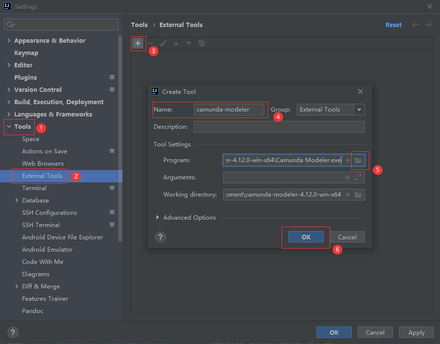
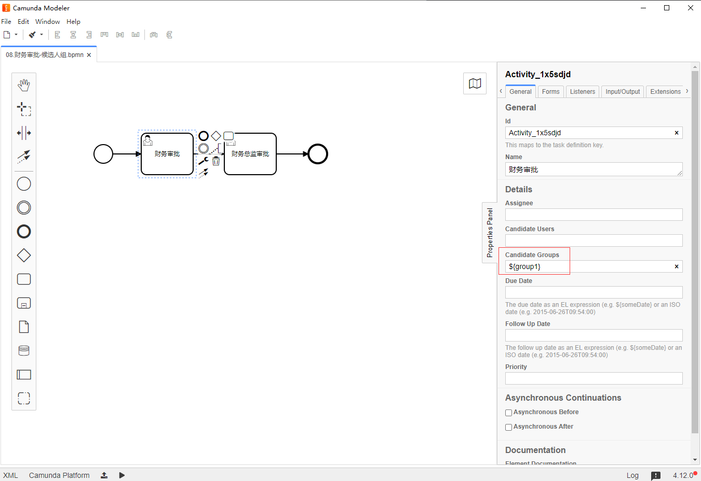
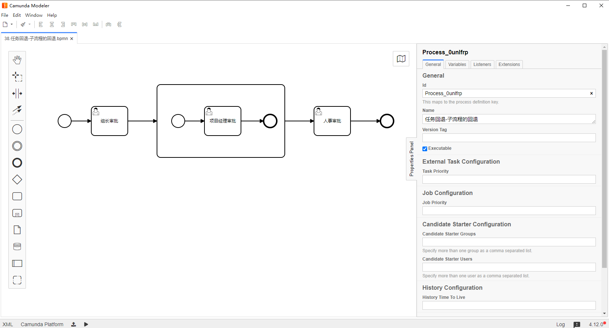

## 一、IDEA引入流程设计器

*以 Camunda 7.15.0 版本为例*

### 1. 下载Camunda Model

https://downloads.camunda.cloud/release/camunda-bpm/run/7.15/camunda-bpm-run-7.15.0.zip

https://downloads.camunda.cloud/release/camunda-modeler/4.12.0/camunda-modeler-4.12.0-win-x64.zip


### 2. 在IDEA中配置

idea ---> file ---> setting ---> tools ---> external tools ---> 点击添加---> tool settings ---> programs ---> 选择刚刚下载的压缩包解压之后的camunda modeler.exe ---> ok




### 3. 编辑BPMN文件

启动 camunda-modeler


## 二、SpringBoot整合Camunda

### 1. 根据官方文档

https://docs.camunda.org/get-started/spring-boot/


### 2. 自定义

#### （1）新建springboot项目

pom.xml配置

```xml
<?xml version="1.0" encoding="UTF-8"?>
<project xmlns="http://maven.apache.org/POM/4.0.0" xmlns:xsi="http://www.w3.org/2001/XMLSchema-instance"
         xsi:schemaLocation="http://maven.apache.org/POM/4.0.0 https://maven.apache.org/xsd/maven-4.0.0.xsd">
    <modelVersion>4.0.0</modelVersion>
    <parent>
        <groupId>org.springframework.boot</groupId>
        <artifactId>spring-boot-starter-parent</artifactId>
        <version>2.2.5.RELEASE</version>
        <relativePath/>
    </parent>

    <groupId>com.sw</groupId>
    <artifactId>camunda-demo</artifactId>
    <version>0.0.1-SNAPSHOT</version>
    <name>camunda-demo</name>
    <description>camunda-demo</description>

    <properties>
        <java.version>1.8</java.version>
        <camunda.version>7.15.0</camunda.version>
        <camunda.spin.dataformat.version>1.14.4</camunda.spin.dataformat.version>
        <mysql.version>8.0.33</mysql.version>
        <lombok.version>1.18.32</lombok.version>
    </properties>
    <dependencies>
        <!-- camunda bom -->
        <dependency>
            <groupId>org.camunda.bpm</groupId>
            <artifactId>camunda-bom</artifactId>
            <version>${camunda.version}</version>
            <type>pom</type>
            <scope>import</scope>
        </dependency>

        <!-- camunda starter rest -->
        <dependency>
            <groupId>org.camunda.bpm.springboot</groupId>
            <artifactId>camunda-bpm-spring-boot-starter-rest</artifactId>
            <version>${camunda.version}</version>
        </dependency>

        <!-- camunda starter webapp -->
        <dependency>
            <groupId>org.camunda.bpm.springboot</groupId>
            <artifactId>camunda-bpm-spring-boot-starter-webapp</artifactId>
            <version>${camunda.version}</version>
        </dependency>

        <!-- camunda engine plugin spin -->
        <dependency>
            <groupId>org.camunda.bpm</groupId>
            <artifactId>camunda-engine-plugin-spin</artifactId>
            <version>${camunda.version}</version>
        </dependency>

        <!-- camunda spin -->
        <dependency>
            <groupId>org.camunda.spin</groupId>
            <artifactId>camunda-spin-dataformat-all</artifactId>
            <version>${camunda.spin.dataformat.version}</version>
        </dependency>

        <!-- spring web -->
        <dependency>
            <groupId>org.springframework.boot</groupId>
            <artifactId>spring-boot-starter-web</artifactId>
        </dependency>

        <!-- jdbc -->
        <dependency>
            <groupId>org.springframework.boot</groupId>
            <artifactId>spring-boot-starter-jdbc</artifactId>
        </dependency>

        <!--mysql-->
        <dependency>
            <groupId>mysql</groupId>
            <artifactId>mysql-connector-java</artifactId>
            <version>${mysql.version}</version>
        </dependency>

        <!-- lombok -->
        <dependency>
            <groupId>org.projectlombok</groupId>
            <artifactId>lombok</artifactId>
            <version>${lombok.version}</version>
            <scope>provided</scope>
        </dependency>

        <dependency>
            <groupId>org.springframework.boot</groupId>
            <artifactId>spring-boot-starter-test</artifactId>
            <scope>test</scope>
        </dependency>
    </dependencies>

    <build>
        <plugins>
            <plugin>
                <groupId>org.springframework.boot</groupId>
                <artifactId>spring-boot-maven-plugin</artifactId>
            </plugin>
        </plugins>
    </build>

</project>

```


#### （2）修改数据库为MySQL

解压 camunda-bpm-run-7.15.0.zip 压缩包，在 `camunda-bpm-run-7.15.0\configuration\sql\create` 路径下找到 `mysql_engine_7.15.0.sql`，`mysql_identity_7.15.0.sql`两个文件，在数据库创建 camunda-demo 库，并执行刚才的两个sql文件


#### （3）修改数据源配置文件

application.yml

```yml
server:
  port: 8088

spring:
  datasource:
    driver-class-name: com.mysql.cj.jdbc.Driver
    url: jdbc:mysql://127.0.0.1:3306/camunda-demo?serverTimezone=Asia/Shanghai&characterEncoding=utf8&useSSL=false
    username: root
    password: 123456

camunda.bpm.admin-user:
  id: admin
  password: 123456

camunda:
  bpm:
    database:
      type: mysql
      schema-update: true
    #自动部署resources下的bpmn文件
    auto-deployment-enabled: false
```

项目启动成功之后可访问 http://localhost:8088


#### （4）表说明

*与Activity类似*

|              | **表名**              | **解释**                                           |
| ------------ | --------------------- | -------------------------------------------------- |
| 一般数据     |                       |                                                    |
|              | [ACT_GE_BYTEARRAY]    | 通用的流程定义和流程资源                           |
|              | [ACT_GE_PROPERTY]     | 系统相关属性                                       |
| 流程历史记录 |                       |                                                    |
|              | [ACT_HI_ACTINST]      | 历史的流程实例                                     |
|              | [ACT_HI_ATTACHMENT]   | 历史的流程附件                                     |
|              | [ACT_HI_COMMENT]      | 历史的说明性信息                                   |
|              | [ACT_HI_DETAIL]       | 历史的流程运行中的细节信息                         |
|              | [ACT_HI_IDENTITYLINK] | 历史的流程运行过程中用户关系                       |
|              | [ACT_HI_PROCINST]     | 历史的流程实例                                     |
|              | [ACT_HI_TASKINST]     | 历史的任务实例                                     |
|              | [ACT_HI_VARINST]      | 历史的流程运行中的变量信息                         |
| 流程定义表   |                       |                                                    |
|              | [ACT_RE_DEPLOYMENT]   | 部署单元信息                                       |
|              | [ACT_RE_MODEL]        | 模型信息                                           |
|              | [ACT_RE_PROCDEF]      | 已部署的流程定义                                   |
| 运行实例表   |                       |                                                    |
|              | [ACT_RU_EVENT_SUBSCR] | 运行时事件                                         |
|              | [ACT_RU_EXECUTION]    | 运行时流程执行实例                                 |
|              | [ACT_RU_IDENTITYLINK] | 运行时用户关系信息，存储任务节点与参与者的相关信息 |
|              | [ACT_RU_JOB]          | 运行时作业                                         |
|              | [ACT_RU_TASK]         | 运行时任务                                         |
|              | [ACT_RU_VARIABLE]     | 运行时变量表                                       |
| 用户用户组表 |                       |                                                    |
|              | [ACT_ID_BYTEARRAY]    | 二进制数据表                                       |
|              | [ACT_ID_GROUP]        | 用户组信息表                                       |
|              | [ACT_ID_INFO]         | 用户信息详情表                                     |
|              | [ACT_ID_MEMBERSHIP]   | 人与组关系表                                       |
|              | [ACT_ID_PRIV]         | 权限表                                             |
|              | [ACT_ID_PRIV_MAPPING] | 用户或组权限关系表                                 |
|              | [ACT_ID_PROPERTY]     | 属性表                                             |
|              | [ACT_ID_TOKEN]        | 记录用户的token信息                                |
|              | [ACT_ID_USER]         | 用户表                                             |


## 三、任务分配

### 1. 固定分配

在绘制流程时直接指定 Assignee


测试

```java
package com.sw.camundademo;

import org.camunda.bpm.engine.RepositoryService;
import org.camunda.bpm.engine.RuntimeService;
import org.camunda.bpm.engine.TaskService;
import org.camunda.bpm.engine.repository.Deployment;
import org.camunda.bpm.engine.runtime.ProcessInstance;
import org.junit.jupiter.api.Test;
import org.springframework.beans.factory.annotation.Autowired;
import org.springframework.boot.test.context.SpringBootTest;

/**
 * @Author Suaxi
 * @Date 2024/7/3 22:11
 * @Description
 */
@SpringBootTest
public class AssigneeTest {

    @Autowired
    private RepositoryService repositoryService;

    @Autowired
    private RuntimeService runtimeService;

    @Autowired
    private TaskService taskService;

    @Test
    public void deploy() {
        Deployment deploy = repositoryService.createDeployment()
                .name("请假流程-固定分配")
                .addClasspathResource("flow/01.任务分配-固定分配.bpmn")
                .deploy();
        System.out.println(deploy.getId());
    }

    @Test
    public void startProcess() {
        ProcessInstance processInstance = runtimeService.startProcessInstanceById("Process_0sa1c18:1:db75f76f-3946-11ef-9303-a8a1592cf182");
        System.out.println("processInstance.getId() = " + processInstance.getId());
    }

    @Test
    public void completeTask() {
        taskService.complete("44488821-3947-11ef-98ee-a8a1592cf182");
    }
}

```


### 2. 值表达式

通过 `${value}` 的形式来设置 Assignee


测试

```java
package com.sw.camundademo;

import org.camunda.bpm.engine.RepositoryService;
import org.camunda.bpm.engine.RuntimeService;
import org.camunda.bpm.engine.TaskService;
import org.camunda.bpm.engine.repository.Deployment;
import org.camunda.bpm.engine.runtime.ProcessInstance;
import org.junit.jupiter.api.Test;
import org.springframework.beans.factory.annotation.Autowired;
import org.springframework.boot.test.context.SpringBootTest;

import java.util.HashMap;
import java.util.Map;

/**
 * @Author Suaxi
 * @Date 2024/7/3 22:11
 * @Description
 */
@SpringBootTest
public class AssigneeTest {

    @Autowired
    private RepositoryService repositoryService;

    @Autowired
    private RuntimeService runtimeService;

    @Autowired
    private TaskService taskService;

    @Test
    public void deploy() {
        Deployment deploy = repositoryService.createDeployment()
                .name("请假流程-值表达式")
                .addClasspathResource("flow/02.任务分配-值表达式.bpmn")
                .deploy();
        System.out.println(deploy.getId());
    }

    @Test
    public void startProcess() {
        Map<String, Object> variables = new HashMap<>(4);
        variables.put("user1", "admin");
        ProcessInstance processInstance = runtimeService.startProcessInstanceById("Process_0nn4skb:1:cfb647fa-3949-11ef-83c2-a8a1592cf182", variables);
        System.out.println("processInstance.getId() = " + processInstance.getId());
    }

    @Test
    public void completeTaskVariables() {
        Map<String, Object> variables = new HashMap<>(4);
        variables.put("user2", "admin");
        taskService.complete("34ca22b2-394a-11ef-896b-a8a1592cf182", variables);
    }
}

```


### 3. 方法表达式

与值表达式类似，当调用无参的方法时，要在表达式方法名的末尾添加括号（与值表达式做区分），如：

```bash
# assigneeService是容器中的bean对象，通过调用getAssignee()方法来设置 Assignee
${assigneeService.getAssignee()}
${assigneeService.getAssignee("method expression test")}
```


测试

```java
package com.sw.camundademo.service;

import lombok.extern.slf4j.Slf4j;
import org.springframework.stereotype.Service;

/**
 * @Author Suaxi
 * @Date 2024/7/3 22:46
 * @Description
 */
@Slf4j
@Service
public class AssigneeService {

    public String getAssignee() {
        log.info("getAssignee方法执行了");
        return "admin";
    }
}

```


```java
package com.sw.camundademo;

import org.camunda.bpm.engine.RepositoryService;
import org.camunda.bpm.engine.RuntimeService;
import org.camunda.bpm.engine.TaskService;
import org.camunda.bpm.engine.repository.Deployment;
import org.camunda.bpm.engine.runtime.ProcessInstance;
import org.junit.jupiter.api.Test;
import org.springframework.beans.factory.annotation.Autowired;
import org.springframework.boot.test.context.SpringBootTest;

import java.util.HashMap;
import java.util.Map;

/**
 * @Author Suaxi
 * @Date 2024/7/3 22:11
 * @Description
 */
@SpringBootTest
public class AssigneeTest {

    @Autowired
    private RepositoryService repositoryService;

    @Autowired
    private RuntimeService runtimeService;

    @Autowired
    private TaskService taskService;

    @Test
    public void deploy() {
        Deployment deploy = repositoryService.createDeployment()
                .name("请假流程-方法表达式")
                .addClasspathResource("flow/03.任务分配-方法表达式.bpmn")
                .deploy();
        System.out.println(deploy.getId());
    }

    @Test
    public void startProcess() {
        ProcessInstance processInstance = runtimeService.startProcessInstanceById("Process_128tk93:1:0316ac79-394c-11ef-b118-a8a1592cf182");
        System.out.println("processInstance.getId() = " + processInstance.getId());
    }

    @Test
    public void completeTask() {
        taskService.complete("3858dc36-394c-11ef-bc0e-a8a1592cf182");
    }
    
}

```


### 4. 监听器配置

可以通过自定义的监听器配置来指定 Assignee

监听器（根据流程实例的事件类型 create 设置 Assignee）

```java
package com.sw.camundademo.listener;

import lombok.extern.slf4j.Slf4j;
import org.camunda.bpm.engine.delegate.DelegateTask;
import org.camunda.bpm.engine.delegate.TaskListener;

/**
 * @Author Suaxi
 * @Date 2024/7/3 23:07
 * @Description
 */
@Slf4j
public class AssigneeListener implements TaskListener {

    @Override
    public void notify(DelegateTask delegateTask) {
        if (EVENTNAME_CREATE.equals(delegateTask.getEventName())) {
            log.info("自定义监听器触发了...");
            delegateTask.setAssignee("admin");
        }
    }
}

```


流程图绘制（在 Listener 选项卡下配置 Event Type 和具体的监听器全路径类名）


测试方法同理以上其他的任务分配方式


## 四、流程变量

### 1. 运行时变量

流程图


#### （1）全局变量

测试

```java
package com.sw.camundademo;

import org.camunda.bpm.engine.RepositoryService;
import org.camunda.bpm.engine.RuntimeService;
import org.camunda.bpm.engine.TaskService;
import org.camunda.bpm.engine.repository.Deployment;
import org.junit.jupiter.api.Test;
import org.springframework.beans.factory.annotation.Autowired;
import org.springframework.boot.test.context.SpringBootTest;

import java.util.HashMap;
import java.util.Map;

/**
 * @Author Suaxi
 * @Date 2024/7/4 21:31
 * @Description
 */
@SpringBootTest
public class GlobalProcessVariablesTest {

    @Autowired
    private RepositoryService repositoryService;

    @Autowired
    private RuntimeService runtimeService;

    @Autowired
    private TaskService taskService;

    @Test
    public void deploy() {
        Deployment deploy = repositoryService.createDeployment()
                .name("请假流程-流程变量-全局变量")
                .addClasspathResource("flow/05.流程变量-全局变量.bpmn")
                .deploy();
        System.out.println(deploy.getId());
    }

    @Test
    public void startProcess() {
        String processId = "Process_17lc2nv:1:f92e9184-3a09-11ef-b11b-a8a1592cf182";

        Map<String, Object> variables = new HashMap<>();
        variables.put("name", "孙笑川");
        variables.put("age", 33);
        variables.put("flag", true);
        runtimeService.startProcessInstanceById(processId, variables);
    }

    /**
     * 获取运行时流程变量
     */
    @Test
    public void getVariable() {
        Map<String, Object> variables = runtimeService.getVariables("649c18cb-3a0a-11ef-a405-a8a1592cf182");
        for (String key : variables.keySet()) {
            Object obj = variables.get(key);
            System.out.println(key + " - " + obj);
        }
    }

    /**
     * 修改运行时流程变量
     */
    @Test
    public void updateVariable() {
        String executionId = "649c18cb-3a0a-11ef-a405-a8a1592cf182";
        runtimeService.setVariable(executionId, "flag", false);
        runtimeService.setVariable(executionId, "address", "四川成都");
    }

    @Test
    public void completeTask() {
        String taskId = "649e88d4-3a0a-11ef-a405-a8a1592cf182";
        Map<String, Object> variables = taskService.getVariables(taskId);
        variables.put("sex", "男");
        taskService.complete(taskId, variables);
    }
}

```


#### （2）局部变量

概念：仅针对在一个任务或一个执行实例中，范围没有流程实例大，不同任务/执行实例的本地变量**作用域互不影响**，所以不同任务/执行实例的本地变量名可以相同，也可以跟全局变量名相同。


测试

```java
package com.sw.camundademo;

import org.camunda.bpm.engine.RepositoryService;
import org.camunda.bpm.engine.RuntimeService;
import org.camunda.bpm.engine.TaskService;
import org.camunda.bpm.engine.repository.Deployment;
import org.junit.jupiter.api.Test;
import org.springframework.beans.factory.annotation.Autowired;
import org.springframework.boot.test.context.SpringBootTest;

import java.util.HashMap;
import java.util.Map;

/**
 * @Author Suaxi
 * @Date 2024/7/5 22:31
 * @Description
 */
@SpringBootTest
public class PartProcessVariablesTest {

    @Autowired
    private RepositoryService repositoryService;

    @Autowired
    private RuntimeService runtimeService;

    @Autowired
    private TaskService taskService;

    @Test
    public void deploy() {
        Deployment deploy = repositoryService.createDeployment()
                .name("请假流程-流程变量-局部变量")
                .addClasspathResource("flow/06.流程变量-局部变量.bpmn")
                .deploy();
        System.out.println(deploy.getId());
    }

    @Test
    public void startProcess() {
        String processId = "Process_1qnwbgx:1:b64186ea-3ad4-11ef-8a7c-a8a1592cf182";

        Map<String, Object> variables = new HashMap<>();
        variables.put("name", "孙笑川1");
        variables.put("age", 33);
        variables.put("flag", true);
        runtimeService.startProcessInstanceById(processId, variables);
    }

    /**
     * 获取运行时流程变量
     */
    @Test
    public void getVariable() {
        Map<String, Object> variables = runtimeService.getVariables("57b19eeb-3ad8-11ef-a150-a8a1592cf182");
        for (String key : variables.keySet()) {
            Object obj = variables.get(key);
            System.out.println(key + " - " + obj);
        }
    }

    /**
     * 通过 runtimeService 设置 local 流程变量
     */
    @Test
    public void setLocalVariableByExecutionId() {
        String executionId = "57b19eeb-3ad8-11ef-a150-a8a1592cf182";
        runtimeService.setVariableLocal(executionId, "no", "0001");
        runtimeService.setVariableLocal(executionId, "flag", false);
    }

    /**
     * 通过 taskService 设置 local 流程变量
     */
    @Test
    public void setLocalVariableByTaskId() {
        String taskId = "57b43704-3ad8-11ef-a150-a8a1592cf182";
        taskService.setVariableLocal(taskId, "no", "0001");
        taskService.setVariableLocal(taskId, "flag", false);
    }

    @Test
    public void completeTask() {
        String taskId = "57b43704-3ad8-11ef-a150-a8a1592cf182";

        Map<String, Object> variables = taskService.getVariables(taskId);
        for (String key : variables.keySet()) {
            System.out.println(key + " - " + variables.get(key));
        }
        taskService.complete(taskId);
    }
    
}

```

注：

+ 通过 runtimeService 设置的本地流程变量的作用域与 executionId绑定，在该流程中有效

+ 通过 taskService 设置的本地流程变量的作用域与 taskId绑定，作用域仅在当前 task 的生命周期中

  


### 2. 历史变量

历史变量存于 `act_hi_varinst` 表中，在流程启动时，流程变量同时存入 `act_ru_variable` 与 `act_hi_varinst` 表，流程结束后，表 `act_hi_varinst` 中的数据持久化保存。

```java
@Test
public void getHistoryVariables() {
    List<HistoricDetail> historicDetailList = historyService.createHistoricDetailQuery()
        .processInstanceId("649c18cb-3a0a-11ef-a405-a8a1592cf182")
        .list();
    if (historicDetailList != null && historicDetailList.size() > 0) {
        for (HistoricDetail historicDetail : historicDetailList) {
            System.out.println("historicDetail.getExecutionId() = " + historicDetail.getExecutionId());
            System.out.println("historicDetail.getTaskId() = " + historicDetail.getTaskId());
        }
        System.out.println("================================");
    }

    List<HistoricVariableInstance> historicVariableInstanceList = historyService.createHistoricVariableInstanceQuery()
        .processInstanceId("649c18cb-3a0a-11ef-a405-a8a1592cf182")
        .list();
    if (historicVariableInstanceList != null && historicVariableInstanceList.size() > 0) {
        for (HistoricVariableInstance historicVariableInstance : historicVariableInstanceList) {
            System.out.println(historicVariableInstance.getName() + "：" + historicVariableInstance.getValue());
        }
    }
}

```


## 五、身份服务

### 1. 候选人

#### （1）流程图


候选人设置方式：

+ 直接指定

  

+ 通过表达式设置（当不清楚具体是谁来审批时）

  


#### （2）部署和启动流程

```java
package com.sw.camundademo;

import org.camunda.bpm.engine.*;
import org.camunda.bpm.engine.repository.Deployment;
import org.camunda.bpm.engine.task.IdentityLink;
import org.camunda.bpm.engine.task.Task;
import org.junit.jupiter.api.Test;
import org.springframework.beans.factory.annotation.Autowired;
import org.springframework.boot.test.context.SpringBootTest;

import java.util.HashMap;
import java.util.List;
import java.util.Map;

/**
 * @Author Suaxi
 * @Date 2024/7/8 21:52
 * @Description
 */
@SpringBootTest
public class FlowCandidateTest {
    @Autowired
    private RepositoryService repositoryService;

    @Autowired
    private RuntimeService runtimeService;

    @Autowired
    private TaskService taskService;

    @Test
    public void deploy() {
        Deployment deploy = repositoryService.createDeployment()
                .name("财务审批-候选人")
                .addClasspathResource("flow/07.财务审批-候选人.bpmn")
                .deploy();
        System.out.println(deploy.getId());
    }

    @Test
    public void startProcess() {
        String processId = "Process_1su8y7i:1:7f77bcb5-3d31-11ef-933e-a8a1592cf182";
        runtimeService.startProcessInstanceById(processId);
    }
}
```


#### （3）拾取任务

在候选人流程中，组要通过**拾取**行为把**候选人**转换为**处理人**

+ 通过GUI操作

  

+ 通过API操作

```java
/**
 * 查询当前登录用户可拾取的任务
 */
@Test
public void getUserCandidateUserTask() {
    List<Task> currentUserTaskList = taskService.createTaskQuery()
        .taskCandidateUser("admin")
        .list();

    if (currentUserTaskList != null && currentUserTaskList.size() > 0) {
        for (Task task : currentUserTaskList) {
            System.out.println("task.getId() = " + task.getId());
            System.out.println("task.getName() = " + task.getName());
            System.out.println("====================================");
        }
    } else {
        System.out.println("当前登录用户没有可候选的task");
    }
}

@Test
public void claimTask() {
    Task task = taskService.createTaskQuery()
        .taskCandidateUser("admin")
        .singleResult();
    if (task != null) {
        taskService.claim(task.getId(), "admin");
    }
}
```

注：已经拾取过的任务不能被其他候选人强行拾取，且拾取后其他候选人查不到该任务


#### （4）归还任务

拾取后的任务如果因为一些原因不想/不能操作，可以归还

+ 通过GUI操作

  

+ 通过API操作

  ```java
  @Test
  public void unClaimTak() {
      Task task = taskService.createTaskQuery()
          .taskAssignee("admin")
          .singleResult();
      if (task != null) {
          //只需把任务处理人设置为空即可
          taskService.claim(task.getId(), null);
      } else {
          System.out.println("没有需要归还的任务！");
      }
  }
  ```

  


#### （5）交接任务

拾取后的任务如果不想处理也不想归还，则可以交接/指派给其他用户处理

```java
@Test
public void setAssignee() {
    Task task = taskService.createTaskQuery()
        .taskAssignee("admin")
        .singleResult();
    if (task != null) {
        taskService.setAssignee(task.getId(), "zhangsan");
        System.out.println("任务交接/指派给了zhangsan！");
    } else {
        System.out.println("未查询到待处理的任务！");
    }
}
```


#### （6）完成任务

```java
@Test
public void completeTask() {
    String taskId = "a50080d7-3d31-11ef-a0f6-a8a1592cf182";
    //当前流程的下一个节点需要通过表达式设置候选人，此处需要设置候选人变量
    Map<String, Object> map = new HashMap<>(2);
    map.put("user1", "admin");
    map.put("user2", "lisi");
    taskService.complete(taskId, map);
}
```


### 2. 候选人组

#### （1）用户管理

```java
package com.sw.camundademo;

import org.camunda.bpm.engine.IdentityService;
import org.camunda.bpm.engine.identity.User;
import org.junit.jupiter.api.Test;
import org.springframework.beans.factory.annotation.Autowired;
import org.springframework.boot.test.context.SpringBootTest;

/**
 * @Author Suaxi
 * @Date 2024/7/9 21:54
 * @Description
 */
@SpringBootTest
public class FlowCandidateGroupTest {

    @Autowired
    private IdentityService identityService;

    /**
     * 创建用户
     */
    @Test
    public void createUser() {
        User user = identityService.newUser("zhangsan");
        user.setPassword("123456");
        user.setEmail("zhangsan@qq.com");
        user.setFirstName("zhang");
        user.setLastName("san");
        identityService.saveUser(user);
    }

    /**
     * 删除用户
     */
    @Test
    public void deleteUser() {
        identityService.deleteUser("zhangsan");
    }

    /**
     * 更新用户
     */
    @Test
    public void updateUser() {
        User user = identityService.createUserQuery().userId("zhangsan").singleResult();
        user.setLastName("777");
        //saveUser包含保存和更新的操作
        identityService.saveUser(user);
    }
}

```


#### （2）Group管理

```java
/**
 * 创建组
 */
@Test
public void createGroup() {
    Group group = identityService.newGroup("userGroup");
    group.setName("用户组");
    group.setType("user");
    identityService.saveGroup(group);
}

/**
 * 更新组
 */
@Test
public void updateGroup() {
    Group group = identityService.createGroupQuery().groupId("userGroup").singleResult();
    group.setName("用户组");
    group.setType("USER");
    identityService.saveGroup(group);
}

/**
 * 删除组
 */
@Test
public void deleteGroup() {
    identityService.deleteGroup("userGroup");
}
```


#### （3）用户、组关联关系管理

```java
/**
 * 建立 user 和 group 的关联关系
 */
@Test
public void createMemberShip() {
    identityService.createMembership("zhangsan", "userGroup");
}

/**
 * 更新 user 和 group 的关联关系
 */
@Test
public void updateMemberShip() {
    //camunda未提供直接更新memberShip的api，此处采用先删除再插入的方法
    identityService.deleteMembership("zhangsan", "userGroup");
    identityService.createMembership("zhangsan", "userGroup1");
}
```


#### （4）应用

流程图




测试

```java
@Test
public void deploy() {
    Deployment deploy = repositoryService.createDeployment()
        .name("财务审批-候选人组")
        .addClasspathResource("flow/08.财务审批-候选人组.bpmn")
        .deploy();
    System.out.println(deploy.getId());
}

@Test
public void startProcess() {
    String processId = "Process_10u33as:1:2cc72548-3e02-11ef-b682-a8a1592cf182";
    Map<String, Object> variables = new HashMap<>();
    variables.put("group1", "userGroup1");
    runtimeService.startProcessInstanceById(processId, variables);
}

@Test
public void queryCandidateGroupTask() {
    String processDefinitionId = "Process_10u33as:1:2cc72548-3e02-11ef-b682-a8a1592cf182";
    //根据当前登录用户查询对应的group
    List<Group> groupList = identityService.createGroupQuery().groupMember("zhangsan").list();
    if (groupList != null && groupList.size() > 0) {
        for (Group group : groupList) {
            List<Task> taskList = taskService.createTaskQuery()
                .processDefinitionId(processDefinitionId)
                .taskCandidateGroup(group.getId())
                .list();
            if (taskList != null && taskList.size() > 0) {
                for (Task task : taskList) {
                    System.out.println("task.getName() = " + task.getName());
                }
            } else {
                System.out.println("未查询到待审批的任务！");
            }
        }
    }
}

@Test
public void claimTask() {
    String processDefinitionId = "Process_10u33as:1:2cc72548-3e02-11ef-b682-a8a1592cf182";
    //根据当前登录用户查询对应的group
    List<Group> groupList = identityService.createGroupQuery().groupMember("zhangsan").list();
    if (groupList != null && groupList.size() > 0) {
        for (Group group : groupList) {
            List<Task> taskList = taskService.createTaskQuery()
                .processDefinitionId(processDefinitionId)
                .taskCandidateGroup(group.getId())
                .list();
            if (taskList != null && taskList.size() > 0) {
                for (Task task : taskList) {
                    taskService.claim(task.getId(), "zhangsan");
                }
            } else {
                System.out.println("未查询到待审批的任务！");
            }
        }
    }
}
```


## 六、租户

多租户是指一个单一的Camunda应用需要为多个租户服务的情况，对于每个租户来说，应该有某些隔离的保证，例如：A租户的流程实例不应该干扰B租户的流程实例

多租户可以通过两种不同的方式实现：

+ 一个租户使用一个流程引擎
+ 多个租户使用同一个流程引擎（将数据与租户标识符相关联）

*此处以第二种方式为例*


### 1. 租户管理

```java
package com.sw.camundademo;

import org.camunda.bpm.engine.IdentityService;
import org.camunda.bpm.engine.identity.Tenant;
import org.junit.jupiter.api.Test;
import org.springframework.beans.factory.annotation.Autowired;
import org.springframework.boot.test.context.SpringBootTest;

/**
 * @Author Suaxi
 * @Date 2024/7/11 22:09
 * @Description
 */
@SpringBootTest
public class FlowTenantTest {

    @Autowired
    private IdentityService identityService;

    /**
     * 创建租户
     */
    @Test
    public void createTenant() {
        Tenant tenant = identityService.newTenant("tenant3");
        tenant.setName("租户3");
        identityService.saveTenant(tenant);
    }

    /**
     * 更新租户
     */
    @Test
    public void updateTenant() {
        Tenant tenant = identityService.createTenantQuery().tenantId("tenant1").singleResult();
        tenant.setName("租户1-更新测试");
        identityService.saveTenant(tenant);
    }

    /**
     * 删除租户
     */
    @Test
    public void deleteTenant() {
        identityService.deleteTenant("tenant3");
    }

    /**
     * 绑定租户和组的关系
     */
    @Test
    public void tenantGroupShip() {
        identityService.createTenantGroupMembership("bj", "userGroup");
        identityService.createTenantGroupMembership("bj", "userGroup1");
        identityService.createTenantGroupMembership("sh", "userGroup1");
        identityService.createTenantGroupMembership("sh", "userGroup2");
        identityService.createTenantGroupMembership("sz", "userGroup");
        identityService.createTenantGroupMembership("sz", "userGroup2");
    }
}

```


### 2. 流程部署

#### （1）流程图


#### （2）部署流程及流程相关数据的查询

```java
/**
 * 部署流程
 * 1.部署时关联租户 - 租户特有
 * 2.部署时不关联租户 - 所有用户都有
 */
@Test
public void deploy() {
    Deployment deploy = repositoryService.createDeployment()
        .name("财务审批-租户")
        .addClasspathResource("flow/09.财务审批-租户.bpmn")
        .tenantId("bj")
        .deploy();
    System.out.println(deploy.getId());
}

@Test
public void deployWithTenant() {
    Deployment deploy = repositoryService.createDeployment()
        .name("财务审批-租户（不关联租户）")
        .addClasspathResource("flow/09.财务审批-租户.bpmn")
        //.tenantId("bj")
        .deploy();
    System.out.println(deploy.getId());
}

/**
 * 根据租户ID查询流程部署
 */
@Test
public void queryDeploymentByTenantId() {
    List<Deployment> deploymentList = repositoryService.createDeploymentQuery()
        .tenantIdIn("bj")
        .list();
    if (deploymentList != null && deploymentList.size() > 0) {
        for (Deployment deployment : deploymentList) {
            System.out.println(deployment.getId() + " - " + deployment.getName());

        }
    }
}

/**
 * 根据租户ID查询流程定义
 */
@Test
public void queryProcessDefinitionByTenantId() {
    List<ProcessDefinition> processDefinitionList = repositoryService.createProcessDefinitionQuery()
        .tenantIdIn("bj")
        .list();
    if (processDefinitionList != null && processDefinitionList.size() > 0) {
        for (ProcessDefinition processDefinition : processDefinitionList) {
            System.out.println(processDefinition.getId() + " - " + processDefinition.getName());

        }
    }
}

/**
 * 查询非租户的流程定义
 */
@Test
public void queryProcessDefinitionWithoutTenantId() {
    List<ProcessDefinition> processDefinitionList = repositoryService.createProcessDefinitionQuery()
        .withoutTenantId()
        .list();
    if (processDefinitionList != null && processDefinitionList.size() > 0) {
        for (ProcessDefinition processDefinition : processDefinitionList) {
            System.out.println(processDefinition.getId() + " - " + processDefinition.getName());

        }
    }
}

/**
 * 查询租户和非租户的流程定义
 */
@Test
public void queryAllProcessDefinition() {
    List<ProcessDefinition> processDefinitionList = repositoryService.createProcessDefinitionQuery()
        .includeProcessDefinitionsWithoutTenantId()
        .tenantIdIn("bj")
        .list();
    if (processDefinitionList != null && processDefinitionList.size() > 0) {
        for (ProcessDefinition processDefinition : processDefinitionList) {
            System.out.println(processDefinition.getId() + " - " + processDefinition.getName());

        }
    }
}
```


#### （3）启动流程实例

```java
@Test
public void startFlow() {
    //根据 processInstanceKey、tenantId 启动流程实例
    String processInstanceKey = "Process_1xvsrpm";
    ProcessInstance processInstance = runtimeService.createProcessInstanceByKey(processInstanceKey)
        .processDefinitionTenantId("bj")
        .setVariable("group1", "userGroup")
        .execute();
    System.out.println("processInstance.getId() = " + processInstance.getId());

    //根据 processInstanceKey 启动流程实例
    Map<String, Object> variables = new HashMap<>();
    variables.put("group1", "userGroup");
    runtimeService.startProcessInstanceByKey(processInstanceKey, variables);
}
```


#### （4）拾取任务

```java
/**
 * 查询当前登录用户待审批的任务（租户）
 */
@Test
public void queryCurrentUserTask() {
    List<Group> groupList = identityService.createGroupQuery()
        .groupMember("admin")
        .list();

    if (groupList != null && groupList.size() > 0) {
        for (Group group : groupList) {
            List<Tenant> tenantList = identityService.createTenantQuery()
                .groupMember(group.getId()).list();
            if (tenantList != null && tenantList.size() > 0) {
                //实际使用时建议单独写sql处理此处的查询
                String[] tenantIdArr = new String[tenantList.size()];
                for (int i = 0; i < tenantList.size(); i++) {
                    tenantIdArr[i] = tenantList.get(i).getId();
                }
                List<Task> taskList = taskService.createTaskQuery()
                    .tenantIdIn(tenantIdArr)
                    .list();
                if (taskList != null && taskList.size() > 0) {
                    for (Task task : taskList) {
                        System.out.println(task.getId() + " - " + task.getName());
                    }
                }
            }
        }
    }
}

/**
 * 拾取任务
 */
@Test
public void claimTask() {
    List<Task> taskList = taskService.createTaskQuery()
        .tenantIdIn("bj")
        //.taskCandidateGroup()
        .list();
    if (taskList != null && taskList.size() > 0) {
        for (Task task : taskList) {
            taskService.claim(task.getId(), "admin");
        }
    }
}
```


## 七、网关

### 1. 排他网关

排他网关（exclusive gateway）用于对流程中的决策建模，当执行到达这个网关时，会按照所有出口顺序流定义的顺序对它们进行计算，选择第一个条件计算为 `true` 的顺序流（当没有设置条件时，认为当前顺序流为 `true`）继续流程。

#### （1）流程图


#### （2）测试

```java
package com.sw.camundademo;

import org.camunda.bpm.engine.RepositoryService;
import org.camunda.bpm.engine.RuntimeService;
import org.camunda.bpm.engine.TaskService;
import org.camunda.bpm.engine.repository.Deployment;
import org.junit.jupiter.api.Test;
import org.springframework.beans.factory.annotation.Autowired;
import org.springframework.boot.test.context.SpringBootTest;

import java.util.HashMap;
import java.util.Map;

/**
 * @Author Suaxi
 * @Date 2024/7/15 21:26
 * @Description
 */
@SpringBootTest
public class ExclusiveGatewayTest {

    @Autowired
    private RepositoryService repositoryService;

    @Autowired
    private RuntimeService runtimeService;

    @Autowired
    private TaskService taskService;

    @Test
    public void deploy() {
        Deployment deploy = repositoryService.createDeployment()
                .name("网关-排他网关")
                .addClasspathResource("flow/10.网关-排他网关.bpmn")
                .deploy();
        System.out.println(deploy.getId());
    }

    @Test
    public void startProcess() {
        String processId = "Process_18phe80:1:5fc9d4f7-42ae-11ef-b9f8-a8a1592cf182";
        runtimeService.startProcessInstanceById(processId);
    }

    @Test
    public void completeTask() {
        String taskId = "ad9c02f2-42ae-11ef-ad23-a8a1592cf182";
        
        Map<String, Object> variables = new HashMap<>();
        variables.put("day", 4);
        
        taskService.complete(taskId, variables);
    }
}

```

注：当排他网关执行过程中有多个条件都满足时，流程引擎会根据bpmn流程图中顺序流的绘制顺序从前往后（从上到下）的顺序走


### 2. 并行网关

并行网关（parallel gateway）允许将流程分为多条分支，也可以把多条分支汇聚到一起，并行网关的功能基于进入/外出顺序流：

+ fork分支：并行后的所有外出顺序流，为每个顺序流都创建一个并发分支
+ join汇聚：所有到达并行网关，在此等待的进入分支，直到所有进入顺序流的分支都到达以后，流程就会通过汇聚网关

如果一个并行网关既有进入，也有外出顺序六流（即同时具有分支和汇聚的功能），此时网关会先汇聚所有进入的顺序流，然后再切分成多个并行分支

**并行网关不会解析条件，即使在顺序流中定义了，也会被忽略**


#### （1）流程图


#### （2）测试

```java
package com.sw.camundademo;

import org.camunda.bpm.engine.RepositoryService;
import org.camunda.bpm.engine.RuntimeService;
import org.camunda.bpm.engine.TaskService;
import org.camunda.bpm.engine.repository.Deployment;
import org.junit.jupiter.api.Test;
import org.springframework.beans.factory.annotation.Autowired;
import org.springframework.boot.test.context.SpringBootTest;

/**
 * @Author Suaxi
 * @Date 2024/7/16 21:58
 * @Description
 */
@SpringBootTest
public class ParallelGatewayTest {

    @Autowired
    private RepositoryService repositoryService;

    @Autowired
    private RuntimeService runtimeService;

    @Autowired
    private TaskService taskService;

    @Test
    public void deploy() {
        Deployment deploy = repositoryService.createDeployment()
                .name("网关-并行网关")
                .addClasspathResource("flow/11.网关-并行网关.bpmn")
                .deploy();
        System.out.println(deploy.getId());
    }

    @Test
    public void startProcess() {
        String processId = "Process_1tykzow:1:93a6df9a-437b-11ef-92d6-a8a1592cf182";
        runtimeService.startProcessInstanceById(processId);
    }

    @Test
    public void completeTask() {
        String taskId = "e5988111-437b-11ef-90a3-a8a1592cf182";
        taskService.complete(taskId);
    }
}

```


当组长审批完成后，汇聚网关会等待项目经理审批、人事审批分支顺序流完成后才进入到总经理审批节点


### 3. 包含网关

包含网关（inclusive gateway）可以看作是排他网关和并行网关的结合体，和排他网关一样，包含网关可以在外出顺序流上定义条件。

+ 分支：所有外出顺序流的条件都会被解析，结果为 `true` 的顺序流会以并行方式继续执行，会为每个顺序流创建一个分支
+ 汇聚：所有并行分支到达包含网关，会进入等待状态，直到每个包含流程token的进入顺序流的分支都到达，这是与并行网关最大的不同（即包含网关只会等待被选中执行了的进入顺序流），在汇聚之后，流程继续往后执行

#### （1）流程图


#### （2）测试

```java
package com.sw.camundademo;

import org.camunda.bpm.engine.RepositoryService;
import org.camunda.bpm.engine.RuntimeService;
import org.camunda.bpm.engine.TaskService;
import org.camunda.bpm.engine.repository.Deployment;
import org.junit.jupiter.api.Test;
import org.springframework.beans.factory.annotation.Autowired;
import org.springframework.boot.test.context.SpringBootTest;

import java.util.HashMap;
import java.util.Map;

/**
 * @Author Suaxi
 * @Date 2024/7/17 21:32
 * @Description
 */
@SpringBootTest
public class InclusiveGatewayTest {

    @Autowired
    private RepositoryService repositoryService;

    @Autowired
    private RuntimeService runtimeService;

    @Autowired
    private TaskService taskService;

    @Test
    public void deploy() {
        Deployment deploy = repositoryService.createDeployment()
                .name("网关-包容网关")
                .addClasspathResource("flow/12.网关-包容网关.bpmn")
                .deploy();
        System.out.println(deploy.getId());
    }

    @Test
    public void startProcess() {
        String processId = "Process_1j4dy1f:1:ca7ae82d-4441-11ef-8b7e-a8a1592cf182";
        runtimeService.startProcessInstanceById(processId);
    }

    @Test
    public void completeTask() {
        String taskId = "e1ea5b22-4441-11ef-ac89-a8a1592cf182";

        Map<String, Object> variables = new HashMap<>();
        variables.put("day", 4);
        taskService.complete(taskId, variables);
    }
}

```


当组长审批完成，**且传入的变量day为4时**，流程走向如下（走了未设置条件和满足条件的两条线）：


任务表中的数据为：


## 八、事件

事件（event）通常用于为流程生命周期中发生的事情建模，事件总是图形化为圆圈。在BPMN2.0中，主要分为：捕获（catching）与抛出（throwing）事件。

+ 捕获：当流程执行到达这个事件时，会等待直到触发器执行，触发器类型由XML中的类型声明定义
+ 抛出：当流程执行到达这个事件时，会触发对应的触发器


### 1. 定时器事件

定时触发相关的事件：定时器启动事件、定时器捕获中间事件、定时器边界事件

#### （1）定时器启动事件

定时器启动事件（timer start event）在指定的时间创建流程实例，可用于流程只需要启动一次，或流程需要在特定的时间间隔重复启动等场景。

其中需要注意：

+ 子流程不能有定时器启动事件
+ 在流程部署时就开始计时，不需要单独调用 `startProcessInstanceByxxx()` 方法来启动，当调用该方法时，会在定时启动的基础上再额外启动一个对应的流程
+ 当部署带有定时器启动事件的流程更新版本时，上一个版本的定时器作业会被清除，即Camunda流程引擎不希望旧版本的流程仍然自动启动更新之后的新版本流程实例


##### a. Date 固定时间点触发

ISO8601相关内容：https://zh.wikipedia.org/wiki/ISO_8601


当该流程部署后，在任务表中能看到对应的固定时间点启动事件任务


##### b. Duration 间隔时间触发


同理，流程部署后可在任务表看到对应的任务记录


##### c. Cycle重复多次触发


注：timeCycle 表达式包含可选属性 `EndDate` ，即 `R3/PT1M/${EndDate}` 表示执行过程中到达 `EndDate` 指定的时间时应用停止运行，并为该任务执行其他作业


#### （2）定时器中间事件


当组长审批完成之后，流程引擎会在任务记录表中创建对应的中间捕获事件对应的任务记录


#### （3）定时器边界事件


流程启动后等待一分钟不进行任何操作，等待边界事件触发


如果在流程启动后正常进行组长审批，则边界事件不会触发，流程正常走向“项目经理1”审批


### 2. 消息事件

#### （1）启动事件

在接收到某些消息后来启动对应的流程实例，消息类型包括不限于邮件、短信等等


测试

```java
package com.sw.camundademo;

import org.camunda.bpm.engine.RepositoryService;
import org.camunda.bpm.engine.RuntimeService;
import org.camunda.bpm.engine.repository.Deployment;
import org.junit.jupiter.api.Test;
import org.springframework.beans.factory.annotation.Autowired;
import org.springframework.boot.test.context.SpringBootTest;

/**
 * @Author Suaxi
 * @Date 2024/7/24 21:53
 * @Description
 */
@SpringBootTest
public class FlowEventMessageTest {

    @Autowired
    private RepositoryService repositoryService;

    @Autowired
    private RuntimeService runtimeService;

    @Test
    public void deploy() {
        Deployment deploy = repositoryService.createDeployment()
                .name("事件-消息事件-启动事件")
                .addClasspathResource("flow/18.事件-消息事件-启动事件.bpmn")
                .deploy();
        System.out.println(deploy.getId());
    }

    @Test
    public void startMessageFlow() {
        runtimeService.startProcessInstanceByMessage("MsgStartEventMsg");
    }
}

```

注：启动流程时hi，可以通过常用的方式来启动，也可以通过对应的 `startProcessInstanceByMessage()` 方法启动


#### （2）中间事件

中间捕获事件即在流程运行过程中需要消息来触发的场景


测试

```java
package com.sw.camundademo;

import org.camunda.bpm.engine.RepositoryService;
import org.camunda.bpm.engine.RuntimeService;
import org.camunda.bpm.engine.TaskService;
import org.camunda.bpm.engine.repository.Deployment;
import org.junit.jupiter.api.Test;
import org.springframework.beans.factory.annotation.Autowired;
import org.springframework.boot.test.context.SpringBootTest;

/**
 * @Author Suaxi
 * @Date 2024/7/24 21:53
 * @Description
 */
@SpringBootTest
public class FlowEventMessageTest {

    @Autowired
    private RepositoryService repositoryService;

    @Autowired
    private RuntimeService runtimeService;

    @Autowired
    private TaskService taskService;

    @Test
    public void deploy() {
        Deployment deploy = repositoryService.createDeployment()
                .name("事件-消息事件-中间捕获事件")
                .addClasspathResource("flow/19.事件-消息事件-中间捕获事件.bpmn")
                .deploy();
        System.out.println(deploy.getId());
    }

    @Test
    public void startMessageFlow() {
        String processInstanceId = "Process_14g0sj6:1:2f885ce8-49c7-11ef-9019-a8a1592cf182";
        runtimeService.startProcessInstanceById(processInstanceId);
    }

    @Test
    public void complete() {
        String taskId = "612049bf-49c7-11ef-b518-a8a1592cf182";
        taskService.complete(taskId);
    }

    @Test
    public void sendMessageTest() {
        runtimeService.messageEventReceived("MsgMiddleCatchEventMsg", "fcbae170-49c7-11ef-8c1d-a8a1592cf182");
    }
}

```

注：当组长正常审批完成后，需要发送对应的消息来触发流程图中所画的中间事件，流程才会继续往后走


#### （3）边界事件


同理定时器中的边界事件，当流程启动后，在组长**审批前发送消息**，即可触发对应的消息边界事件，走向新的流程方向（项目经理2审批）


测试

```java
package com.sw.camundademo;

import org.camunda.bpm.engine.RepositoryService;
import org.camunda.bpm.engine.RuntimeService;
import org.camunda.bpm.engine.TaskService;
import org.camunda.bpm.engine.repository.Deployment;
import org.junit.jupiter.api.Test;
import org.springframework.beans.factory.annotation.Autowired;
import org.springframework.boot.test.context.SpringBootTest;

/**
 * @Author Suaxi
 * @Date 2024/7/24 21:53
 * @Description
 */
@SpringBootTest
public class FlowEventMessageTest {

    @Autowired
    private RepositoryService repositoryService;

    @Autowired
    private RuntimeService runtimeService;

    @Autowired
    private TaskService taskService;

    @Test
    public void deploy() {
        Deployment deploy = repositoryService.createDeployment()
                .name("事件-消息事件-边界事件")
                .addClasspathResource("flow/20.事件-消息事件-边界事件.bpmn")
                .deploy();
        System.out.println(deploy.getId());
    }

    @Test
    public void startMessageFlow() {
        String processInstanceId = "Process_0ub5i8b:1:b4e5124e-49c9-11ef-9973-a8a1592cf182";
        runtimeService.startProcessInstanceById(processInstanceId);
    }

    @Test
    public void sendMessageTest() {
        runtimeService.messageEventReceived("MsgBoundaryEventMsg", "c910f373-49c9-11ef-b0ae-a8a1592cf182");
    }
}

```


### 3. 错误事件

#### （1）开始事件

错误启动事件（error start event），可用于触发事件子流程（Event Sub-Process），需注意错误启动事件不能用于启动流程实例


流程图


JavaDelegate

```java
package com.sw.camundademo.delegate;

import lombok.extern.slf4j.Slf4j;
import org.camunda.bpm.engine.delegate.BpmnError;
import org.camunda.bpm.engine.delegate.DelegateExecution;
import org.camunda.bpm.engine.delegate.JavaDelegate;

/**
 * @Author Suaxi
 * @Date 2024/7/31 21:42
 * @Description
 */
@Slf4j
public class ErrorEventStartDelegate implements JavaDelegate {

    @Override
    public void execute(DelegateExecution execution) throws Exception {
        log.info("ErrorEventStartDelegate执行了...");
        //抛出的信息必须与设置的error code对应
        throw new BpmnError("ErrorEventStartMsg");
    }
}

```


测试

```java
package com.sw.camundademo;

import org.camunda.bpm.engine.RepositoryService;
import org.camunda.bpm.engine.RuntimeService;
import org.camunda.bpm.engine.TaskService;
import org.camunda.bpm.engine.repository.Deployment;
import org.junit.jupiter.api.Test;
import org.springframework.beans.factory.annotation.Autowired;
import org.springframework.boot.test.context.SpringBootTest;

/**
 * @Author Suaxi
 * @Date 2024/7/31 21:49
 * @Description
 */
@SpringBootTest
public class FlowEventErrorTest {

    @Autowired
    private RepositoryService repositoryService;

    @Autowired
    private RuntimeService runtimeService;

    @Autowired
    private TaskService taskService;

    @Test
    public void deploy() {
        Deployment deploy = repositoryService.createDeployment()
                .name("事件-错误事件-开始事件")
                .addClasspathResource("flow/21.事件-错误事件-开始事件.bpmn")
                .deploy();
        System.out.println(deploy.getId());
    }

    @Test
    public void startErrorFlow() {
        String processInstanceId = "Process_1jtpd2d:1:26709f49-4f44-11ef-a77c-10ffe00abd05";
        runtimeService.startProcessInstanceById(processInstanceId);
    }
    
}
```


当启动流程，服务任务绑定的 JavaDelegate 抛出错误后，会启动对应的错误启动事件子流程


#### （2）边界事件

当子流程执行过程中对外抛出了相关的异常，在流程中设置的错误边界事件就能捕获到相关的事件，然后做对应的处理

流程图，此处以服务任务绑定 `JavaDelegate` 为例


JavaDelegate

```java
package com.sw.camundademo.delegate;

import lombok.extern.slf4j.Slf4j;
import org.camunda.bpm.engine.delegate.BpmnError;
import org.camunda.bpm.engine.delegate.DelegateExecution;
import org.camunda.bpm.engine.delegate.JavaDelegate;

/**
 * @Author Suaxi
 * @Date 2024/8/4 20:43
 * @Description
 */
@Slf4j
public class ErrorEventBoundaryDelegate implements JavaDelegate {

    @Override
    public void execute(DelegateExecution execution) throws Exception {
        log.info("ErrorEventBoundaryDelegate执行了...");
        //抛出的信息必须与设置的error code对应
        throw new BpmnError("ErrorEventBoundaryMsg");
    }
}

```


当流程启动，对应的服务任务绑定的 `JavaDelegate` 执行时，抛出了对应的错误及 error code，则会触发对应的错误边界事件


触发后，流程进入对应的节点


### 4. 信号事件

#### （1）开始事件

通过信号来启动流程实例


测试

```java
package com.sw.camundademo;

import org.camunda.bpm.engine.RepositoryService;
import org.camunda.bpm.engine.RuntimeService;
import org.camunda.bpm.engine.repository.Deployment;
import org.junit.jupiter.api.Test;
import org.springframework.beans.factory.annotation.Autowired;
import org.springframework.boot.test.context.SpringBootTest;

/**
 * @Author Suaxi
 * @Date 2024/8/5 21:23
 * @Description
 */
@SpringBootTest
public class FlowEventSignalTest {

    @Autowired
    private RepositoryService repositoryService;

    @Autowired
    private RuntimeService runtimeService;

    @Test
    public void deploy() {
        Deployment deploy = repositoryService.createDeployment()
                .name("事件-信号事件-开始事件")
                .addClasspathResource("flow/23.事件-信号事件-开始事件.bpmn")
                .deploy();
        System.out.println(deploy.getId());
    }

    /**
     * 通过信号触发启动流程实例
     */
    @Test
    public void signalReceive() {
        runtimeService.signalEventReceived("signalStartEvent");
    }

}

```


#### （2）中间捕获事件

当流程实例启动后，会阻塞在信号中间捕获事件处，等待信号触发后才会执行后续的流程


测试

```java
package com.sw.camundademo;

import org.camunda.bpm.engine.RepositoryService;
import org.camunda.bpm.engine.RuntimeService;
import org.camunda.bpm.engine.repository.Deployment;
import org.junit.jupiter.api.Test;
import org.springframework.beans.factory.annotation.Autowired;
import org.springframework.boot.test.context.SpringBootTest;

/**
 * @Author Suaxi
 * @Date 2024/8/5 21:23
 * @Description
 */
@SpringBootTest
public class FlowEventSignalTest {

    @Autowired
    private RepositoryService repositoryService;

    @Autowired
    private RuntimeService runtimeService;

    @Test
    public void deploy() {
        Deployment deploy = repositoryService.createDeployment()
                .name("事件-信号事件-中间捕获事件")
                .addClasspathResource("flow/24.事件-信号事件-中间捕获事件.bpmn")
                .deploy();
        System.out.println(deploy.getId());
    }

    @Test
    public void startFlow() {
        String processInstanceId = "Process_1x6a9fh:1:5eb47e10-532f-11ef-ba7f-10ffe00abd05";
        runtimeService.startProcessInstanceById(processInstanceId);
    }

    /**
     * 通过信号触发中间捕获事件
     */
    @Test
    public void signalReceive() {
        runtimeService.signalEventReceived("signalMiddleCatchEvent");
    }

}

```

当执行完组长审批后，流程会阻塞在中间捕获事件处，直到信号 `signalMiddleCatchEvent` 触发，才会执行后续的流程


#### （3）中间抛出事件

在流程执行的过程中，某个节点抛出了对应的信号，触发了对应的信号捕获事件


测试

```java
package com.sw.camundademo;

import org.camunda.bpm.engine.RepositoryService;
import org.camunda.bpm.engine.RuntimeService;
import org.camunda.bpm.engine.TaskService;
import org.camunda.bpm.engine.repository.Deployment;
import org.junit.jupiter.api.Test;
import org.springframework.beans.factory.annotation.Autowired;
import org.springframework.boot.test.context.SpringBootTest;

/**
 * @Author Suaxi
 * @Date 2024/8/5 21:23
 * @Description
 */
@SpringBootTest
public class FlowEventSignalTest {

    @Autowired
    private RepositoryService repositoryService;

    @Autowired
    private RuntimeService runtimeService;

    @Autowired
    private TaskService taskService;

    @Test
    public void deploy() {
        Deployment deploy = repositoryService.createDeployment()
                .name("事件-信号事件-中间抛出事件")
                .addClasspathResource("flow/25.事件-信号事件-中间抛出事件.bpmn")
                .deploy();
        System.out.println(deploy.getId());
    }

    @Test
    public void startFlow() {
        String processInstanceId = "Process_1tpyp0e:1:fab9fb72-5331-11ef-8386-10ffe00abd05";
        runtimeService.startProcessInstanceById(processInstanceId);
    }

    @Test
    public void complete() {
        taskService.complete("2b789f00-5332-11ef-98d2-10ffe00abd05");
    }
}

```

注：当流程实例启动后，<font color='red'>应先执行</font>**组长2审批**，让对应的中间捕获事件流程处于阻塞的状态，在**组长1审批**完成后，且抛出信号 `signalMiddleThrowEvent` 时，才会进入**项目经理审批**流程，反之只会进入到**人事审批**流程


#### （4）边界事件


测试

```java
package com.sw.camundademo;

import org.camunda.bpm.engine.RepositoryService;
import org.camunda.bpm.engine.RuntimeService;
import org.camunda.bpm.engine.TaskService;
import org.camunda.bpm.engine.repository.Deployment;
import org.junit.jupiter.api.Test;
import org.springframework.beans.factory.annotation.Autowired;
import org.springframework.boot.test.context.SpringBootTest;

/**
 * @Author Suaxi
 * @Date 2024/8/5 21:23
 * @Description
 */
@SpringBootTest
public class FlowEventSignalTest {

    @Autowired
    private RepositoryService repositoryService;

    @Autowired
    private RuntimeService runtimeService;

    @Autowired
    private TaskService taskService;

    @Test
    public void deploy() {
        Deployment deploy = repositoryService.createDeployment()
                .name("事件-信号事件-边界事件")
                .addClasspathResource("flow/26.事件-信号事件-边界事件.bpmn")
                .deploy();
        System.out.println(deploy.getId());
    }

    @Test
    public void startFlow() {
        String processInstanceId = "Process_12diz27:1:5e6bea56-5334-11ef-8213-10ffe00abd05";
        runtimeService.startProcessInstanceById(processInstanceId);
    }

    @Test
    public void complete() {
        taskService.complete("9328e474-5334-11ef-8f89-10ffe00abd05");
    }

    /**
     * 通过信号触发边界事件
     */
    @Test
    public void signalReceive() {
        runtimeService.signalEventReceived("signalBoundaryEvent");
    }

}

```

注：启动流程后，如果在组长审批的过程中**没有发送信号** `signalBoundaryEvent` ，则流程会进入到项目经理审批节点，反之，**如果发送了信号**，则会被组长审批节点中阻塞等待的信号边界事件捕获，进入到人事审批节点中


### 5. 结束事件

#### （1）错误结束事件

当流程执行到达**错误结束事件（error end event）**时，当前分支结束执行，并抛出错误，这个错误可以由错误边界、中间事件捕获，如果未匹配到对应的错误边界事件，将会抛出异常


测试

```java
package com.sw.camundademo;

import org.camunda.bpm.engine.RepositoryService;
import org.camunda.bpm.engine.RuntimeService;
import org.camunda.bpm.engine.TaskService;
import org.camunda.bpm.engine.repository.Deployment;
import org.junit.jupiter.api.Test;
import org.springframework.beans.factory.annotation.Autowired;
import org.springframework.boot.test.context.SpringBootTest;

/**
 * @Author Suaxi
 * @Date 2024/8/6 21:10
 * @Description
 */
@SpringBootTest
public class FlowEventEndTest {

    @Autowired
    private RepositoryService repositoryService;

    @Autowired
    private RuntimeService runtimeService;

    @Autowired
    private TaskService taskService;

    @Test
    public void deploy() {
        Deployment deploy = repositoryService.createDeployment()
                .name("事件-结束事件-错误结束事件")
                .addClasspathResource("flow/27.事件-结束事件-错误结束事件.bpmn")
                .deploy();
        System.out.println(deploy.getId());
    }

    @Test
    public void startFlow() {
        String processInstanceId = "Process_00xytj8:1:e8902c02-53f5-11ef-9c4a-10ffe00abd05";
        runtimeService.startProcessInstanceById(processInstanceId);
    }

    @Test
    public void complete() {
        taskService.complete("9328e474-5334-11ef-8f89-10ffe00abd05");
    }

}

```

当流程执行到**人事审批**时，此时设置流程变量 flag = true，流程走向为：


设置 flag = false，流程走向为：


#### （2）中断结束事件

中断结束事件也称为终止结束事件，主要用于对流程的终止。当在一个流程实例的执行过程中，需要提前或因为其他原因中断这个运行中的流程，可以使用这个事件来处理。

当在流程实例的层面处理，则整个流程都会被中断；当在子流程中处理，则当前作用和作用域内的所有内部流程都会被中断

+ 案例一：没有子流程的中断结束事件案例


测试

```java
package com.sw.camundademo;

import org.camunda.bpm.engine.RepositoryService;
import org.camunda.bpm.engine.RuntimeService;
import org.camunda.bpm.engine.TaskService;
import org.camunda.bpm.engine.repository.Deployment;
import org.junit.jupiter.api.Test;
import org.springframework.beans.factory.annotation.Autowired;
import org.springframework.boot.test.context.SpringBootTest;

/**
* @Author Suaxi
* @Date 2024/8/6 21:10
* @Description
*/
@SpringBootTest
public class FlowEventEndTest {

  @Autowired
  private RepositoryService repositoryService;

  @Autowired
  private RuntimeService runtimeService;

  @Autowired
  private TaskService taskService;

  @Test
  public void deploy() {
	  Deployment deploy = repositoryService.createDeployment()
			  .name("事件-结束事件-中断结束事件")
			  .addClasspathResource("flow/28.事件-结束事件-中断结束事件.bpmn")
			  .deploy();
	  System.out.println(deploy.getId());
  }

  @Test
  public void startFlow() {
	  String processInstanceId = "Process_1g4qego:1:9f795b0c-53f8-11ef-a302-10ffe00abd05";
	  runtimeService.startProcessInstanceById(processInstanceId);
  }

}

```

启动流程后，在执行**组长3审批**时，如果设置的流程变量flag = true，则按照正常的顺序走，反之如果设置的flag = false，则流程直接中断，可在历史流程实例表中查询到相关的数据


+ 案例二：有子流程的情况下


测试

```java
package com.sw.camundademo;

import org.camunda.bpm.engine.RepositoryService;
import org.camunda.bpm.engine.RuntimeService;
import org.camunda.bpm.engine.TaskService;
import org.camunda.bpm.engine.repository.Deployment;
import org.junit.jupiter.api.Test;
import org.springframework.beans.factory.annotation.Autowired;
import org.springframework.boot.test.context.SpringBootTest;

import java.util.HashMap;
import java.util.Map;

/**
* @Author Suaxi
* @Date 2024/8/6 21:10
* @Description
*/
@SpringBootTest
public class FlowEventEndTest {

  @Autowired
  private RepositoryService repositoryService;

  @Autowired
  private RuntimeService runtimeService;

  @Autowired
  private TaskService taskService;

  @Test
  public void deploy() {
	  Deployment deploy = repositoryService.createDeployment()
			  .name("事件-结束事件-中断结束事件（有子流程）")
			  .addClasspathResource("flow/29.事件-结束事件-中断结束事件.bpmn")
			  .deploy();
	  System.out.println(deploy.getId());
  }

  @Test
  public void startFlow() {
	  String processInstanceId = "Process_1xxaxsj:1:8315add5-53fa-11ef-8ee5-10ffe00abd05";
	  runtimeService.startProcessInstanceById(processInstanceId);
  }

  @Test
  public void complete() {
	  Map<String, Object> variables = new HashMap<>();
	  variables.put("flag", false);
	  taskService.complete("213ce445-53fb-11ef-b9de-10ffe00abd05", variables);
  }

}

```

启动流程后，在执行**组长3审批**时，如果设置的流程变量flag = true，则按照正常的顺序走，反之如果设置的flag = false，则当前子流程直接中断，但不会影响**组长1审批**、**组长2审批**的执行


#### （3）取消结束事件

取消结束事件（cancel end event）只能与BPMN事务子流程一起使用，当流程执行到达取消结束事件时，会抛出取消事件，且必须有取消边界事件（cancel boundary event）捕获，取消边界事件将取消事务，同时触发补偿


测试

```java
package com.sw.camundademo;

import org.camunda.bpm.engine.RepositoryService;
import org.camunda.bpm.engine.RuntimeService;
import org.camunda.bpm.engine.TaskService;
import org.camunda.bpm.engine.repository.Deployment;
import org.junit.jupiter.api.Test;
import org.springframework.beans.factory.annotation.Autowired;
import org.springframework.boot.test.context.SpringBootTest;

import java.util.HashMap;
import java.util.Map;

/**
 * @Author Suaxi
 * @Date 2024/8/6 21:10
 * @Description
 */
@SpringBootTest
public class FlowEventEndTest {

    @Autowired
    private RepositoryService repositoryService;

    @Autowired
    private RuntimeService runtimeService;

    @Autowired
    private TaskService taskService;

    @Test
    public void deploy() {
        Deployment deploy = repositoryService.createDeployment()
                .name("事件-结束事件-取消结束事件")
                .addClasspathResource("flow/30.事件-结束事件-取消结束事件.bpmn")
                .deploy();
        System.out.println(deploy.getId());
    }

    @Test
    public void startFlow() {
        String processInstanceId = "Process_16jqg12:1:74f44003-53fd-11ef-8cb6-10ffe00abd05";
        runtimeService.startProcessInstanceById(processInstanceId);
    }

    @Test
    public void complete() {
        Map<String, Object> variables = new HashMap<>();
        variables.put("flag", false);
        taskService.complete("88a91c26-53fd-11ef-9b2f-10ffe00abd05", variables);
    }

}

```

启动流程后，在执行**组长审批**时，如果设置的流程变量flag = true，则按照正常的顺序（组长审批-项目经理审批-人事审批）走，反之设置的falg = false 时，流程会执行到**开发经理审批**补偿边界事件中


当开发经理审批完成时，触发取消边界事件总经理审批


#### （4）补偿事件

通过补偿达到控制业务流程的目的，此处以购票支付失败为例


OrderTicketDelegate

```java
package com.sw.camundademo.delegate;

import lombok.extern.slf4j.Slf4j;
import org.camunda.bpm.engine.delegate.DelegateExecution;
import org.camunda.bpm.engine.delegate.JavaDelegate;

/**
 * @Author Suaxi
 * @Date 2024/8/6 22:26
 * @Description
 */
@Slf4j
public class OrderTicketDelegate implements JavaDelegate {

    @Override
    public void execute(DelegateExecution execution) throws Exception {
        log.info("执行OrderTicketDelegate，车票预定成功...");
    }
}

```


CompensationMiddleThrowEventDelegate

```java
package com.sw.camundademo.delegate;

import lombok.extern.slf4j.Slf4j;
import org.camunda.bpm.engine.delegate.BpmnError;
import org.camunda.bpm.engine.delegate.DelegateExecution;
import org.camunda.bpm.engine.delegate.JavaDelegate;

/**
 * @Author Suaxi
 * @Date 2024/8/6 22:28
 * @Description
 */
@Slf4j
public class CompensationMiddleThrowEventDelegate implements JavaDelegate {

    @Override
    public void execute(DelegateExecution execution) throws Exception {
        log.info("执行CompensationMiddleThrowEventDelegate，支付失败...");
        throw new BpmnError("compensationMiddleThrowEvent");
    }
}

```


测试

```java
package com.sw.camundademo;

import org.camunda.bpm.engine.RepositoryService;
import org.camunda.bpm.engine.RuntimeService;
import org.camunda.bpm.engine.TaskService;
import org.camunda.bpm.engine.repository.Deployment;
import org.junit.jupiter.api.Test;
import org.springframework.beans.factory.annotation.Autowired;
import org.springframework.boot.test.context.SpringBootTest;

import java.util.HashMap;
import java.util.Map;

/**
 * @Author Suaxi
 * @Date 2024/8/6 21:10
 * @Description
 */
@SpringBootTest
public class FlowEventEndTest {

    @Autowired
    private RepositoryService repositoryService;

    @Autowired
    private RuntimeService runtimeService;

    @Autowired
    private TaskService taskService;

    @Test
    public void deploy() {
        Deployment deploy = repositoryService.createDeployment()
                .name("事件-结束事件-补偿事件")
                .addClasspathResource("flow/31.事件-结束事件-补偿事件.bpmn")
                .deploy();
        System.out.println(deploy.getId());
        repositoryService.deleteDeployment("d8790e22-5400-11ef-a7c9-10ffe00abd05");
    }

    @Test
    public void startFlow() {
        String processInstanceId = "Process_0up7x7t:2:954f574f-5401-11ef-a09c-10ffe00abd05";
        runtimeService.startProcessInstanceById(processInstanceId);
    }

}

```

启动流程后，预定车票和支付绑定的 javaDelegate 同步执行


流程进入到对应的**取消订单**补偿节点


## 九、多人会签

### 1. 概念

多实例活动是为业务流程中的某个步骤定义重复的一种方式，在编程概念中，多实例与 foreach 结构相匹配：它允许对给定集合中的每个项目按顺序或并行地执行某个步骤或一个完整的子流程

多实例是一个有额外属性的常规活动，它将导致该活动在运行时被多次执行，以下活动可成为多实例活动：

+ Service Task 服务任务
+ Send Task 发送任务
+ User Task 用户任务
+ Business Rule Task 业务规则任务
+ Script Task 脚本任务
+ Receive Task 接收任务
+ Manual Task 手动任务
+ （Embedded）Sub-Process （嵌入）子流程
+ Call Activity 发起活动
+ Transaction Subprocess 事务子流程

注：网关或事件不能用于多实例中

如果一个活动是多实例的，这将由活动底部的三条短线表示：**三条垂直线 - 并行**，**三条竖线 - 顺序执行**


按照规范，每个实例所创建的执行的每个父执行将有以下变量：

+ nrOfInstances：实例总数量
+ nrOfActiveInstances：当前活动的（且未完成）的实例数量，在顺序执行中这个数量恒为1
+ nrOfCompletedInstances：已完成的实例数量

这些值可以通过 `execution.getVariables()` 方法获取

此外，每个创建的执行将有一个执行本地变量（即对其他执行不可见，且不存储在流程实例级别）

+ loopCounter：表示该特定实例的 `foreach` 循环中的索引

为了使一个活动实例成为多实例，活动 xml 元素必须有一个 `multiInstanceLoopCharacteristics` 子元素

```xml
<multiInstanceLoopCharacteristics isSequential="false|true">
    ......
</multiInstanceLoopCharacteristics>
```


### 2. 并行会签-案例一

流程图


测试

```java
package com.sw.camundademo;

import org.camunda.bpm.engine.RepositoryService;
import org.camunda.bpm.engine.RuntimeService;
import org.camunda.bpm.engine.repository.Deployment;
import org.junit.jupiter.api.Test;
import org.springframework.beans.factory.annotation.Autowired;
import org.springframework.boot.test.context.SpringBootTest;

import java.util.Arrays;
import java.util.HashMap;
import java.util.List;
import java.util.Map;

/**
 * @Author Suaxi
 * @Date 2024/8/8 22:25
 * @Description
 */
@SpringBootTest
public class FlowMultiInstanceTest {

    @Autowired
    private RepositoryService repositoryService;

    @Autowired
    private RuntimeService runtimeService;

    @Test
    public void deploy() {
        Deployment deploy = repositoryService.createDeployment()
                .name("多人会签-并行会签-案例一")
                .addClasspathResource("flow/32.多人会签-并行会签-案例一.bpmn")
                .deploy();
        System.out.println(deploy.getId());
    }

    @Test
    public void startFlow() {
        String processId = "Process_0riwap9:1:302f5906-5592-11ef-a63f-10ffe00abd05";

        Map<String, Object> variables = new HashMap<>();
        variables.put("persons", Arrays.asList("admin", "zhangsan", "lisi"));

        runtimeService.startProcessInstanceById(processId, variables);
    }
}

```

启动流程后，可看到有三个待审批的并行执行任务


### 3. 并行会签-案例二

流程图


MultiInstanceCompleteTaskListener

```java
package com.sw.camundademo.listener;

import org.camunda.bpm.engine.delegate.DelegateExecution;
import org.springframework.stereotype.Component;

/**
 * @Author Suaxi
 * @Date 2024/8/9 23:03
 * @Description
 */
@Component("multiInstanceCompleteTaskListener")
public class MultiInstanceCompleteTaskListener {

    public Boolean completeTask(DelegateExecution execution) {
        System.out.println("会签总数：" + execution.getVariable("nrOfInstances"));
        System.out.println("当前获取的会签数量：" + execution.getVariable("nrOfActiveInstances"));
        System.out.println("已经完成的会签数量：" + execution.getVariable("nrOfCompletedInstances"));
        Boolean flag = (Boolean) execution.getVariable("flag");
        System.out.println("当前审批意见：" + flag);
        return flag;
    }
}

```


测试

```java
package com.sw.camundademo;

import org.camunda.bpm.engine.RepositoryService;
import org.camunda.bpm.engine.RuntimeService;
import org.camunda.bpm.engine.TaskService;
import org.camunda.bpm.engine.repository.Deployment;
import org.junit.jupiter.api.Test;
import org.springframework.beans.factory.annotation.Autowired;
import org.springframework.boot.test.context.SpringBootTest;

import java.util.Arrays;
import java.util.HashMap;
import java.util.Map;

/**
 * @Author Suaxi
 * @Date 2024/8/8 22:25
 * @Description
 */
@SpringBootTest
public class FlowMultiInstanceTest {

    @Autowired
    private RepositoryService repositoryService;

    @Autowired
    private RuntimeService runtimeService;

    @Autowired
    private TaskService taskService;

    @Test
    public void deploy() {
        Deployment deploy = repositoryService.createDeployment()
                .name("多人会签-并行会签-案例二")
                .addClasspathResource("flow/33.多人会签-并行会签-案例二.bpmn")
                .deploy();
        System.out.println(deploy.getId());
    }

    @Test
    public void startFlow() {
        String processId = "Process_1whtv0v:1:c256cf1b-5661-11ef-b3fe-10ffe00abd05";

        Map<String, Object> variables = new HashMap<>();
        variables.put("persons", Arrays.asList("admin", "zhangsan", "lisi"));

        runtimeService.startProcessInstanceById(processId, variables);
    }

    @Test
    public void completeTask() {
        String taskId = "ce5aac4c-5661-11ef-accb-10ffe00abd05";

        Map<String, Object> variables = new HashMap<>();
        variables.put("flag", true);
        taskService.complete(taskId, variables);
    }
}

```

根据设置的并行会签完成条件，当其中一人审批通过时即通过


### 4. 串行会签

流程图


测试

```java
package com.sw.camundademo;

import org.camunda.bpm.engine.RepositoryService;
import org.camunda.bpm.engine.RuntimeService;
import org.camunda.bpm.engine.TaskService;
import org.camunda.bpm.engine.repository.Deployment;
import org.junit.jupiter.api.Test;
import org.springframework.beans.factory.annotation.Autowired;
import org.springframework.boot.test.context.SpringBootTest;

import java.util.Arrays;
import java.util.HashMap;
import java.util.Map;

/**
 * @Author Suaxi
 * @Date 2024/8/8 22:25
 * @Description
 */
@SpringBootTest
public class FlowMultiInstanceTest {

    @Autowired
    private RepositoryService repositoryService;

    @Autowired
    private RuntimeService runtimeService;

    @Autowired
    private TaskService taskService;

    @Test
    public void deploy() {
        Deployment deploy = repositoryService.createDeployment()
                .name("多人会签-串行会签")
                .addClasspathResource("flow/34.多人会签-串行会签.bpmn")
                .deploy();
        System.out.println(deploy.getId());
    }

    @Test
    public void startFlow() {
        String processId = "Process_0sgnfjk:1:c8ba7ba3-57e0-11ef-b282-10ffe00abd05";

        Map<String, Object> variables = new HashMap<>();
        variables.put("persons", Arrays.asList("admin", "zhangsan", "lisi"));

        runtimeService.startProcessInstanceById(processId, variables);
    }
    
}

```

注：串行会签流程中，审批完一个，才出现下一个待审批任务，如果设置审批完成条件的话，也可以像并行会签流程中的例子一样，一人审批通过，则全部通过，流程进行到下一个节点


## 十、任务回退

### 1. 串行的回退

流程图


测试

```java
package com.sw.camundademo;

import org.camunda.bpm.engine.RepositoryService;
import org.camunda.bpm.engine.RuntimeService;
import org.camunda.bpm.engine.repository.Deployment;
import org.junit.jupiter.api.Test;
import org.springframework.beans.factory.annotation.Autowired;
import org.springframework.boot.test.context.SpringBootTest;

/**
 * @Author Suaxi
 * @Date 2024/8/13 21:27
 * @Description
 */
@SpringBootTest
public class FlowRollbackTest {

    @Autowired
    private RepositoryService repositoryService;

    @Autowired
    private RuntimeService runtimeService;

    @Test
    public void deploy() {
        Deployment deploy = repositoryService.createDeployment()
                .name("任务回退-串行的回退")
                .addClasspathResource("flow/35.任务回退-串行的回退.bpmn")
                .deploy();
        System.out.println(deploy.getId());
    }

    @Test
    public void startFlow() {
        String processId = "Process_15y1ksp:1:f147328e-5977-11ef-8eb4-10ffe00abd05";
        runtimeService.startProcessInstanceById(processId);
    }

    @Test
    public void taskRollback() {
        String processInstanceId = "076d6028-597c-11ef-98e6-10ffe00abd05";
        runtimeService.createProcessInstanceModification(processInstanceId)
                //.startBeforeActivity("Activity_0l16yzx") //跳转到指定结点之前
                .startAfterActivity("Activity_0l16yzx") //跳转到指定结点之后
                .cancelAllForActivity("Activity_0azdt7x") //取消某个指定节点
                .execute();
    }
}

```


此处以人事审批节点**回退至**项目经理审批节点为例，执行回退方法后，历史任务表数据如下


补充：

| 类别                       | 方法                                                         |
| -------------------------- | ------------------------------------------------------------ |
| 在活动前启动               | 回退到这个节点                                               |
|                            | startBeforeActivity(String activityId);                      |
|                            | startBeforeActivity(String activityId, String ancestorActivityInstanceId); |
| 在活动后启动               | 通过 `startAfterActivity()` 方法，跳转到指定节点之后的节点   |
|                            | startAfterActivity(String activityId);                       |
|                            | startAfterActivity(String activityId, String ancestorActivityInstanceId); |
| 启动一个过渡               | 通过 `startTransition()` 方法，在一个指定的序列流上开始执行，当有多个流出的序列流时，此时可以与 `startAfterActivity()` 方法一起使用 |
|                            | startTransition(String activityId);                          |
|                            | startTransition(String activityId, String ancestorActivityInstanceId); |
| 取消活动实例               | 通过 `cancelActivityInstance()` 方法取消指定的活动实例       |
|                            | cancelActivityInstance(String activityInstanceId);           |
| 取消过渡实例               | 过渡实例表示即将以异步延续的形式进入/离开一个活动的执行流，一个已经创建但尚未执行的异步延续Job被表示为一个过渡实例，可以通过 `cancelTransitionInstance()` 方法来操作 |
|                            | cancelTransitionInstance(String transitionInstanceId);       |
| 取消指定活动的所有活动实例 | 通过 `cancelAllForActivity()` 方法操作                       |
|                            | cancelAllForActivity(String activityId);                     |


### 2. 并行的回退

流程图


测试

```java
package com.sw.camundademo;

import org.camunda.bpm.engine.RepositoryService;
import org.camunda.bpm.engine.RuntimeService;
import org.camunda.bpm.engine.repository.Deployment;
import org.junit.jupiter.api.Test;
import org.springframework.beans.factory.annotation.Autowired;
import org.springframework.boot.test.context.SpringBootTest;

/**
 * @Author Suaxi
 * @Date 2024/8/13 21:27
 * @Description
 */
@SpringBootTest
public class FlowRollbackTest {

    @Autowired
    private RepositoryService repositoryService;

    @Autowired
    private RuntimeService runtimeService;

    @Test
    public void deploy() {
        Deployment deploy = repositoryService.createDeployment()
                .name("任务回退-并行的回退")
                .addClasspathResource("flow/36.任务回退-并行的回退.bpmn")
                .deploy();
        System.out.println(deploy.getId());
    }

    @Test
    public void startFlow() {
        String processId = "Process_08oudkn:1:61e0cbaf-5a45-11ef-a08c-10ffe00abd05";
        runtimeService.startProcessInstanceById(processId);
    }

    @Test
    public void taskRollback() {
        //例一：从技术总监审批、人事审批回退到组长审批
        //String processInstanceId = "765f3a01-5a45-11ef-b89b-10ffe00abd05";
        //runtimeService.createProcessInstanceModification(processInstanceId)
        //        .startAfterActivity("StartEvent_1")
        //        .cancelAllForActivity("Activity_04lzlma")
        //        .cancelAllForActivity("Activity_1cy7zrd")
        //        .execute();

        //例二：从总经理审批回退到技术总监审批、人事审批
        String processInstanceId = "f3d6dd13-5a46-11ef-9eef-10ffe00abd05";
        runtimeService.createProcessInstanceModification(processInstanceId)
                .startAfterActivity("Activity_1u47ggy")
                .startBeforeActivity("Activity_1cy7zrd")
                .cancelAllForActivity("Activity_1vpmtcx")
                .execute();
    }
}

```


例一历史流程实例表数据


例二历史流程实例表数据


### 3. 排他网关的回退

流程图


测试

此处以项目经理审批回退到排他网关之前，并让流程重新走到人事审批为例

```java
package com.sw.camundademo;

import org.camunda.bpm.engine.RepositoryService;
import org.camunda.bpm.engine.RuntimeService;
import org.camunda.bpm.engine.repository.Deployment;
import org.junit.jupiter.api.Test;
import org.springframework.beans.factory.annotation.Autowired;
import org.springframework.boot.test.context.SpringBootTest;

/**
 * @Author Suaxi
 * @Date 2024/8/13 21:27
 * @Description
 */
@SpringBootTest
public class FlowRollbackTest {

    @Autowired
    private RepositoryService repositoryService;

    @Autowired
    private RuntimeService runtimeService;

    @Test
    public void deploy() {
        Deployment deploy = repositoryService.createDeployment()
                .name("任务回退-排他网关的回退")
                .addClasspathResource("flow/37.任务回退-排他网关的回退.bpmn")
                .deploy();
        System.out.println(deploy.getId());
    }

    @Test
    public void startFlow() {
        String processId = "Process_1we1amp:1:3b817685-5a48-11ef-b838-10ffe00abd05";
        runtimeService.startProcessInstanceById(processId);
    }

    @Test
    public void taskRollback() {
        String processInstanceId = "4b4fc9b1-5a48-11ef-90d7-10ffe00abd05";
        runtimeService.createProcessInstanceModification(processInstanceId)
                .startBeforeActivity("Gateway_0v6gm4b")
                .setVariable("day", 5)
                .cancelAllForActivity("Activity_13amaw8")
                .execute();
    }
}

```


历史流程实例表数据


### 4. 子流程的回退

流程图




测试

```java
package com.sw.camundademo;

import org.camunda.bpm.engine.RepositoryService;
import org.camunda.bpm.engine.RuntimeService;
import org.camunda.bpm.engine.repository.Deployment;
import org.junit.jupiter.api.Test;
import org.springframework.beans.factory.annotation.Autowired;
import org.springframework.boot.test.context.SpringBootTest;

/**
 * @Author Suaxi
 * @Date 2024/8/13 21:27
 * @Description
 */
@SpringBootTest
public class FlowRollbackTest {

    @Autowired
    private RepositoryService repositoryService;

    @Autowired
    private RuntimeService runtimeService;

    @Test
    public void deploy() {
        Deployment deploy = repositoryService.createDeployment()
                .name("任务回退-子流程的回退")
                .addClasspathResource("flow/38.任务回退-子流程的回退.bpmn")
                .deploy();
        System.out.println(deploy.getId());
    }

    @Test
    public void startFlow() {
        String processId = "Process_0unlfrp:1:ff5ff077-5b0b-11ef-9419-10ffe00abd05";
        runtimeService.startProcessInstanceById(processId);
    }

    @Test
    public void taskRollback() {
        //例一：子任务-项目经理审批回退至组长审批
        //String processInstanceId = "31f21b1b-5b0c-11ef-990e-10ffe00abd05";
        //runtimeService.createProcessInstanceModification(processInstanceId)
        //       .startBeforeActivity("Activity_0jscehr")
        //        .cancelAllForActivity("Activity_0uodo09")
        //        .execute();

        //例二：人事审批回退至子任务-项目经理审批
        String processInstanceId = "31f21b1b-5b0c-11ef-990e-10ffe00abd05";
        runtimeService.createProcessInstanceModification(processInstanceId)
                .startBeforeActivity("Activity_093vft3")
                .cancelAllForActivity("Activity_1bf56np")
                .execute();
    }
}

```


### 5. 重启/恢复实例

流程实例终止后，其历史数据仍然存在，并且可以访问，且可以重启该历史流程实例（前提是历史级别设置为 FULL）。例：

+ 当执行中的流程实例没有以期望的方式结束时，此时可以使用重启流程实例的方法
+ 恢复被错误地取消的流程实例到最后的状态
+ 由于错误路由导致流程实例被终止后重启

重启流程实例API `runtimeService.restartProcessInstances()`


流程图


测试

```java
package com.sw.camundademo;

import org.camunda.bpm.engine.RepositoryService;
import org.camunda.bpm.engine.RuntimeService;
import org.camunda.bpm.engine.repository.Deployment;
import org.junit.jupiter.api.Test;
import org.springframework.beans.factory.annotation.Autowired;
import org.springframework.boot.test.context.SpringBootTest;

/**
 * @Author Suaxi
 * @Date 2024/8/13 21:27
 * @Description
 */
@SpringBootTest
public class FlowRollbackTest {

    @Autowired
    private RepositoryService repositoryService;

    @Autowired
    private RuntimeService runtimeService;

    @Test
    public void deploy() {
        Deployment deploy = repositoryService.createDeployment()
                .name("任务回退-重启、恢复流程实例")
                .addClasspathResource("flow/39.任务回退-重启、恢复流程实例.bpmn")
                .deploy();
        System.out.println(deploy.getId());
    }

    @Test
    public void startFlow() {
        String processId = "Process_0f17ijs:1:30fc859e-5b0e-11ef-97d6-10ffe00abd05";
        runtimeService.startProcessInstanceById(processId);
    }

    @Test
    public void deleteProcessInstance() {
        //流程启动后，执行到组长审批、项目经理审批时，删除该流程实例，模拟流程执行过程中的异常中断
        String processInstanceId = "400eb4ef-5b0e-11ef-8abb-10ffe00abd05";
        runtimeService.deleteProcessInstance(processInstanceId, "deleted");
    }

    @Test
    public void recoveryProcessInstance() {
        //恢复流程实例至组长审批、项目经理审批
        String processDefinitionId = "Process_0f17ijs:1:30fc859e-5b0e-11ef-97d6-10ffe00abd05";
        runtimeService.restartProcessInstances(processDefinitionId)
                .startBeforeActivity("Activity_1590vkg")
                .startBeforeActivity("Activity_14mdtr0")
                .processInstanceIds("400eb4ef-5b0e-11ef-8abb-10ffe00abd05")
                .execute();
    }

}

```

注：恢复后的流程实例从用户角度来说中断前是什么样，恢复后也是什么样；但从系统层面来说，恢复后的流程实例是一个全新的数据（流程实例id已经不同）

此处可以参考历史流程实例表数据


## 十一、动态表单

### 1. 内置表单

流程图


测试

```java
package com.sw.camundademo;

import org.camunda.bpm.engine.FormService;
import org.camunda.bpm.engine.RepositoryService;
import org.camunda.bpm.engine.RuntimeService;
import org.camunda.bpm.engine.TaskService;
import org.camunda.bpm.engine.form.FormField;
import org.camunda.bpm.engine.form.StartFormData;
import org.camunda.bpm.engine.repository.Deployment;
import org.junit.jupiter.api.Test;
import org.springframework.beans.factory.annotation.Autowired;
import org.springframework.boot.test.context.SpringBootTest;

import java.util.HashMap;
import java.util.List;
import java.util.Map;

/**
 * @Author Suaxi
 * @Date 2024/8/20 21:02
 * @Description
 */
@SpringBootTest
public class FlowFormsTest {

    @Autowired
    private RepositoryService repositoryService;

    @Autowired
    private RuntimeService runtimeService;

    @Autowired
    private TaskService taskService;

    @Autowired
    private FormService formService;

    @Test
    public void deploy() {
        Deployment deploy = repositoryService.createDeployment()
                .name("动态表单-内置表单")
                .addClasspathResource("flow/40.动态表单-内置表单.bpmn")
                .deploy();
        System.out.println(deploy.getId());
    }

    @Test
    public void getDeploymentData() {
        String processId = "Process_0fc8vlb:1:791e3a95-5ef4-11ef-9b8d-10ffe00abd05";
        StartFormData startFormData = formService.getStartFormData(processId);
        System.out.println("FormKey: " + startFormData.getFormKey());
        List<FormField> formFieldList = startFormData.getFormFields();
        if (formFieldList != null && formFieldList.size() > 0) {
            for (FormField formField : formFieldList) {
                System.out.println(formField.getId() + " - " + formField.getLabel() + ": " + formField.getValue().getValue());
            }
        }
    }

    @Test
    public void startFlow() {
        String processId = "Process_0fc8vlb:1:791e3a95-5ef4-11ef-9b8d-10ffe00abd05";
        Map<String, Object> map = new HashMap<>();
        map.put("reason", "有事要请假！");
        map.put("days", 3);
        runtimeService.startProcessInstanceById(processId, map);
    }

    @Test
    public void startFormFlow() {
        String processId = "Process_0fc8vlb:1:791e3a95-5ef4-11ef-9b8d-10ffe00abd05";
        Map<String, Object> map = new HashMap<>();
        map.put("reason", "我要请假！");
        map.put("days", 5);
        formService.submitStartForm(processId, map);
    }

    @Test
    public void getTaskFormData() {
        String processId = "Process_0fc8vlb:1:791e3a95-5ef4-11ef-9b8d-10ffe00abd05";
        String taskId = "5fe00ff2-5ef6-11ef-859a-10ffe00abd05";
        StartFormData startFormData = formService.getStartFormData(processId);
        List<FormField> formFieldList = startFormData.getFormFields();
        if (formFieldList != null && formFieldList.size() > 0) {
            for (FormField formField : formFieldList) {
                String id = formField.getId();
                System.out.println(id + ": " + taskService.getVariable(taskId, id));
            }
        }
    }

}

```


### 2. Camunda表单

流程图


测试步骤同理内置表单


### 3. 外置表单

流程图


测试步骤同理内置表单


启动流程后，可在**组长审批**节点打开外置表单


